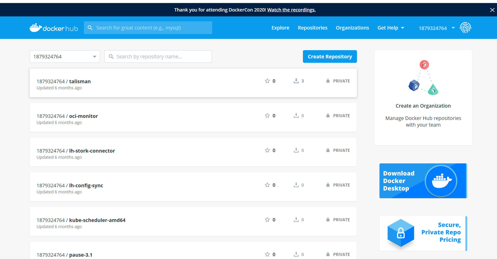

# 访问Docker仓库 
## Docker Hub公共镜像市场

Docker Hub是Docker官方提供的最大的公共镜像仓库，目前包括了超过100 000的镜像，地址为[https://hub.docker.com](https://hub.docker.com/) 。大部分对镜像的需求，都可以通过在Docker Hub中直接下载镜像来实现。

如图：



### 1登录

可以通过命令行执行docker login命令来输入用户名、密码和邮箱来完成注册和登录。注册成功后，本地用户目录下会自动创建.docker/config.json文件，保存用户的认证信息。

登录成功的用户可以上传个人制作的镜像到Docker Hub。

``` shell
#执行docker login命令来输入用户名、密码和邮箱来完成注册和登录

[root@iZ2ze38chylj63vuj6fqiaZ ~]# docker login
Login with your Docker ID to push and pull images from Docker Hub. If you don\'t have a Docker ID, head over to https://hub.docker.com to create one.
Username (1879324764): 1879324764
Password: 
Login Succeeded

#或者使用面交互式的登录方式
[root@k8s-node01 ~]# docker login -u 1879324764 -p admin#123
WARNING! Using --password via the CLI is insecure. Use --password-stdin.
WARNING! Your password will be stored unencrypted in /root/.docker/config.json.
Configure a credential helper to remove this warning. See
https://docs.docker.com/engine/reference/commandline/login/#credentials-store

Login Succeeded
```

### 2.基本操作
```shell
#用户无需登录即可通过docker search命令来查找官方仓库中的镜像，并利用docker pull命令来将它下载到本地。

搜索镜像
[root@iZ2ze38chylj63vuj6fqiaZ ~]# docker search centos
NAME               DESCRIPTION          STARS          OFFICIAL        AUTOMATED
centos                        The official build of CentOS.                 2507   [OK]
ansible/centos7-ansible       Ansible on Centos7                              82   [OK]
jdeathe/centos-ssh            CentOS-6 6.8 x86_64 / CentOS-7 7.2.1511 x8...   27   [OK]
nimmis/java-centos            This is docker images of CentOS 7 with dif...   13   [OK]
million12/centos-supervisor   Base CentOS-7 with supervisord launcher, h...   12   [OK]
```

根据是否为官方提供，可将这些镜像资源分为两类：

·一种是类似于centos这样的基础镜像，也称为根镜像。这些镜像是由Docker公司创建、验证、支持、提供，这样的镜像往往使用单个单词作为名字；

·另一种类型的镜像，比如ansible/centos7-ansible镜像，是由Docker用户ansible创建并维护的，带有用户名称为前缀，表明是某用户下的某仓库。可以通过用户名称前缀“user_name/镜像名”来指定使用某个用户提供的镜像。


下载官方centos镜像到本地，代码如下所示

```shell
下载镜像
[root@iZ2ze38chylj63vuj6fqiaZ ~]# docker pull centos
[root@iZ2ze38chylj63vuj6fqiaZ ~]# docker images
docker.io/centos                   latest              9f38484d220f        2 months ago        202 MB


上传镜像
#注意tag名称不要太长，长度太长会失败。
# 报错如下：denied: requested access to the resource is denied

[root@iZ2ze38chylj63vuj6fqiaZ ~]# docker tag centos:latest 1879324764/centos_test:latest

[root@iZ2ze38chylj63vuj6fqiaZ ~]# docker push 1879324764/centos_test:latest 


```

### 3.自动创建

自动创建（Automated Builds）是Docker Hub提供的自动化服务，这一功能可以自动跟随项目代码的变更而重新构建镜像。

例如，用户构建了某应用镜像，如果应用发布新版本，用户需要手动更新镜像。而自动创建则允许用户通过Docker Hub指定跟踪一个目标网站（目前支持GitHub或BitBucket）上的项目，一旦项目发生新的提交，则自动执行创建。

要配置自动创建，包括如下的步骤：

```
1）创建并登录Docker Hub，以及目标网站如Github；
2）在目标网站中允许Docker Hub访问服务；
3）在Docker Hub中配置一个“自动创建”类型的项目；
4）选取一个目标网站中的项目（需要含Dockerfile）和分支；
5）指定Dockerfile的位置，并提交创建。
```

之后，可以在Docker Hub的“自动创建”页面中跟踪每次创建的状态。

## 第三方镜像市场

国内不少云服务商都提供了Docker镜像市场，包括

```shell

国内比较有名的镜像源仓库：

阿里云：https://cr.console.aliyun.com/cn-beijing/instances/images
道云：DaoCloud: https://hub.daocloud.io/


网易云
.......

时速云
.......
```

下面以时速云为例，介绍如何使用这些市场。

1.查看镜像

访问[https://hub.tenxcloud.com](https://hub.tenxcloud.com/) ，即可看到已存在的仓库和存储的镜像，包括Ubuntu、Java、Mongo、MySQL、Nginx等热门仓库和镜像。时速云官方仓库中的镜像会保持与DockerHub中官方镜像的同步。

以MongoDB仓库为例，其中包括了2.6、3.0和3.2等镜像。

### 下载镜像
```shell
#下载镜像也是使用docker pull命令，但是要在镜像名称前添加注册服务器的具体地址。
[root@iZ2ze38chylj63vuj6fqiaZ ~]# docker pull daocloud.io/library/nginx:1.13.0-alpine


#通过docker images命令来查看下载到本地的镜像
[root@iZ2ze38chylj63vuj6fqiaZ ~]# docker images
daocloud.io/library/nginx          1.13.0-alpine       f00ab1b3ac6d        2 years ago         15.5 MB


#更新镜像标签
[root@iZ2ze38chylj63vuj6fqiaZ ~]# docker tag daocloud.io/library/nginx:1.13.0-alpine nginx:1.13.0

[root@iZ2ze38chylj63vuj6fqiaZ ~]# docker ps -a

daocloud.io/library/nginx          1.13.0-alpine       f00ab1b3ac6d        2 years ago         15.5 MB
nginx                              1.13.0              f00ab1b3ac6d        2 years ago         15.5 MB

# 运行nginx容器
[root@iZ2ze38chylj63vuj6fqiaZ ~]# docker run --name nginx_hu -d -p 8080:80 nginx:1.13.0
eea29a2e03329b026bc623da2f12ac4bc0da8a38755b5f570a3e50b60584f472
[root@iZ2ze38chylj63vuj6fqiaZ ~]# docker ps
CONTAINER ID        IMAGE               COMMAND                  CREATED             STATUS              PORTS                  NAMES
eea29a2e0332        nginx:1.13.0        "nginx -g 'daemon ..."   3 seconds ago       Up 2 seconds        0.0.0.0:8080->80/tcp   nginx_hu

#暴露端口
docker run --name 新名称 -d -p 8080:80 some-content-nginx
```

## 访问阿里云公有镜像仓库

## 1. 登录阿里云Docker Registry

```
$ sudo docker login --username=hujianli_722 registry.cn-shenzhen.aliyuncs.com
```

用于登录的用户名为阿里云账号全名，密码为开通服务时设置的密码。

您可以在访问凭证页面修改凭证密码。

## 2. 从Registry中拉取镜像

```
$ sudo docker pull registry.cn-shenzhen.aliyuncs.com/devops_hu/haproxy:[镜像版本号]
```

## 3. 将镜像推送到Registry

```
$ sudo docker login --username=hujianli_722 registry.cn-shenzhen.aliyuncs.com$ sudo docker tag [ImageId] registry.cn-shenzhen.aliyuncs.com/devops_hu/haproxy:[镜像版本号]$ sudo docker push registry.cn-shenzhen.aliyuncs.com/devops_hu/haproxy:[镜像版本号]
```

请根据实际镜像信息替换示例中的[ImageId]和[镜像版本号]参数。

## 4. 选择合适的镜像仓库地址

从ECS推送镜像时，可以选择使用镜像仓库内网地址。推送速度将得到提升并且将不会损耗您的公网流量。

如果您使用的机器位于VPC网络，请使用 registry-vpc.cn-shenzhen.aliyuncs.com 作为Registry的域名登录，并作为镜像命名空间前缀。

## 5. 示例

使用"docker tag"命令重命名镜像，并将它通过专有网络地址推送至Registry。

```
$ sudo docker imagesREPOSITORY                                                         TAG                 IMAGE ID            CREATED             VIRTUAL SIZEregistry.aliyuncs.com/acs/agent                                    0.7-dfb6816         37bb9c63c8b2        7 days ago          37.89 MB$ sudo docker tag 37bb9c63c8b2 registry-vpc.cn-shenzhen.aliyuncs.com/acs/agent:0.7-dfb6816
```

使用"docker images"命令找到镜像，将该镜像名称中的域名部分变更为Registry专有网络地址。

```
$ sudo docker push registry-vpc.cn-shenzhen.aliyuncs.com/acs/agent:0.7-dfb6816
```