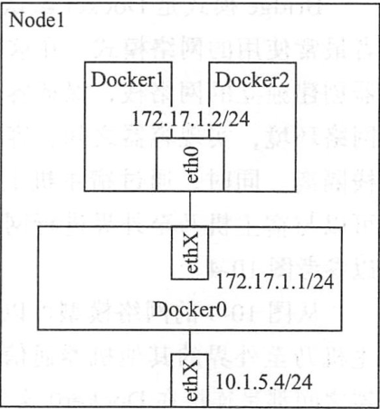
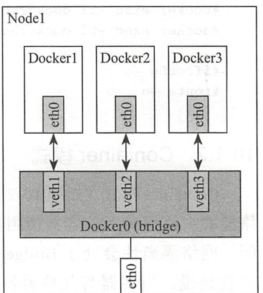

# Docker使用网络
## 1.单主机Docker网络通信

我们在使用docker run创建docker容器时，可以用--net选项指定容器的网络模式。Docker有以下4中网络模式：

1. host模式：使用--net=host指定，不支持多主机
2. container模式：使用--net=container：NAME_or_ID指定，不支持多主机
3. none模式：使用--net=none指定，不支持多主机
4. bridge模式：使用--net=bridge指定，不支持多主机，默认模式


### 1.1 host模式

容器不会虚拟直接的网卡、配置直接的IP等，使用宿主机的IP和端口。

在容器中执行ifconfig命令查看网络环境时，显示的都是宿主机的信息。

Host模式下的网络空间与宿主机相同，文件系统、进程列表等和宿主机隔离。


`host模式`


```
# docker run -tid --net=host --name dockerhost1 ubantu

# docker run -tid --net=host --name dockerhost2 ubantu
# docker exec -it dockerhost1 /bin/bash
# docker exec -it dockerhost2 /bin/bash
# ifconfig -a
# route -n
```


### 1.2 Container模式

Container模式是一种特殊的网络模式，该模式下的容器使用其他容器的网络命名空间，隔离性处于bridge模式与Host模式之间。

Container模式的容器可以通过localhost来与同一网络命名空间下的其他容器通信，传输效率高，可以节约一定数量的网络资源，但没有改变容器与外界的通信方式。

Kubernetes下的Pod中的容器与其他容器都以Container模式共享这个基础设施容器的网络命名空间，互相以localhost访问，构成一个统一的整体。



### 1.3 None模式

None模式docker容器拥有自己的Network Namespace空间，但并不为Docker容器进行网络配置，也就是说Docker容器没有网卡、IP、路由等信息，需要用户为Docker容器添加网卡、配置IP。


### 1.4 Bridge模式

Bridge模式是Docker默认的网络模式，也是开发常使用的网络模式，这种模式下，docker为容器创建独立的网络栈，保证容器内的进程使用独立的网络环境，实现容器之间、容器与宿主机之间的网络栈隔离。

通过宿主机的Docker0网桥，容器可以与宿主机乃至外界进行网络通信。




常见的就是使用NAT，将宿主机的端口流量转发到容器端口上，这样外界就可以与容器中的进程进行通信了。


## 2.外部访问网络 

```shell
#容器中可以运行一些网络应用，要让外部也可以访问这些应用，可以通过  -P  或-p  参数来指定端口映射
 -P 标记时，Docker 会随机映射一个  49000~49900  的端口到内部容器开放的网络端口
 -p（小写的）则可以指定要映射的端口，并且，在一个指定端口上只可以绑定一个容器。支持的格式如下：
    ip:hostPort:containerPort 
    ip::containerPort 
    hostPort:containerPort 
```

### 2.1 使用-P 映射到本地的随机端口 
``` shell
#举例
[root@bogon backup]# sudo docker run -d -P training/webapp python app.py

[root@bogon backup]# docker ps -l
CONTAINER ID        IMAGE               COMMAND             CREATED             STATUS              PORTS                     NAMES
970c816ffcec        training/webapp     "python app.py"     3 minutes ago       Up 3 minutes        0.0.0.0:32768->5000/tcp   clever_thompson

[root@bogon backup]# curl http://127.0.0.1:32768
Hello world!

#使用docker logs查看应用信息
[root@bogdocker logs  clever_thompson
 * Running on http://0.0.0.0:5000/ (Press CTRL+C to quit)
172.17.0.1 - - [31/May/2019 02:15:23] "GET / HTTP/1.1" 200 -
192.168.20.107 - - [31/May/2019 02:15:39] "GET / HTTP/1.1" 200 -
192.168.20.107 - - [31/May/2019 02:15:39] "GET /favicon.ico HTTP/1.1" 404 -

#tail -f类似，动态查看容器信息
[root@bogon backup]# docker logs -f clever_thompson
 * Running on http://0.0.0.0:5000/ (Press CTRL+C to quit)
172.17.0.1 - - [31/May/2019 02:15:23] "GET / HTTP/1.1" 200 -
192.168.20.107 - - [31/May/2019 02:15:39] "GET / HTTP/1.1" 200 -
192.168.20.107 - - [31/May/2019 02:15:39] "GET /favicon.ico HTTP/1.1" 404 -
192.168.20.107 - - [31/May/2019 02:16:51] "GET / HTTP/1.1" 200 -
192.168.20.107 - - [31/May/2019 02:16:51] "GET / HTTP/1.1" 200 -
192.168.20.107 - - [31/May/2019 02:16:51] "GET / HTTP/1.1" 200 -

```

### 2.2 映射所有接口地址
``` shell
格式：hostPort:containerPort 

# 默认会绑定本地所有接口上的所有地址
[root@bogon backup]# docker run -d -p 5000:5000 training/webapp python app.py
98867d4e72ed8004bf6f9cae6861db4fa096ecc417a146e016401622e6b3b4b2

[root@bogon backup]# docker ps -l
CONTAINER ID        IMAGE               COMMAND             CREATED             STATUS              PORTS                    NAMES
98867d4e72ed        training/webapp     "python app.py"     6 seconds ago       Up 5 seconds        0.0.0.0:5000->5000/tcp   mystifying_beaver
```

### 2.3 映射到指定地址的指定端口
``` shell
格式：ip:hostPort:containerPort 
	
# 可以使用  ip:hostPort:containerPort  格式指定映射使用一个特定地址，比如localhost 地址 127.0.0.1
[root@bogon backup]# docker run -d -p 127.0.0.1:5000:5000 training/webapp python app.py
f76317ec76a468bac94c27f5ce43dedc6e63529ae4d925bb9d6d203cf616c3af

[root@bogon backup]# docker ps -l
CONTAINER ID        IMAGE               COMMAND             CREATED             STATUS              PORTS                      NAMES
f76317ec76a4        training/webapp     "python app.py"     7 seconds ago       Up 6 seconds        127.0.0.1:5000->5000/tcp   vigilant_franklin
```

### 2.4 映射到指定地址的任意端口
``` shell
格式：ip::containerPort 

#使用  ip::containerPort  绑定 localhost 的任意端口到容器的 5000 端口，本地主机会自动分配一个端口。
[root@bogon backup]# docker run -d -p 127.0.0.1::5000 training/webapp python app.py
4178c69e0fd8ec6f5dbcf5c0af9e6faaf23f917a0aca529a9c35ab6b04aeff4e
[root@bogon backup]# docker ps -l
CONTAINER ID        IMAGE               COMMAND             CREATED             STATUS              PORTS                       NAMES
4178c69e0fd8        training/webapp     "python app.py"     4 seconds ago       Up 3 seconds        127.0.0.1:32768->5000/tcp   eloquent_noether
```

### 2.5 指定udp端口
``` shell
[root@bogon backup]# docker run -d -p 5000:5000/udp training/webapp python app.py
26bea2dd7daeb783a55750e07c422162b3e8d9a93eca0a9f13dca60788f1a32c

[root@bogon backup]# docker ps -l
CONTAINER ID        IMAGE               COMMAND             CREATED             STATUS              PORTS                              NAMES
26bea2dd7dae        training/webapp     "python app.py"     4 seconds ago       Up 3 seconds        5000/tcp, 0.0.0.0:5000->5000/udp   fervent_zhukovsky
```

### 2.6 查看映射端口配置
``` shell
[root@bogon backup]# docker port 26bea 5000/udp
0.0.0.0:5000
```

### 2.7 绑定多个端口
``` shell
[root@bogon backup]# sudo docker run -d -p 5000:5000 -p 3000:80 training/webapp python app.py
da7164cb26582f37fe54be941d7fe90bde039b2c53946f105ae77123f700890a

[root@bogon backup]# docker ps -l
CONTAINER ID        IMAGE               COMMAND             CREATED             STATUS              PORTS                                          NAMES
da7164cb2658        training/webapp     "python app.py"     4 seconds ago       Up 3 seconds        0.0.0.0:5000->5000/tcp, 0.0.0.0:3000->80/tcp   serene_dhawan
[root@bogon backup]#
```

>提示
>容器有自己的内部网络和IP地址，使用docker[container]inspect+容器ID可以获取容器的具体信息。

## 3.容器互联

### 3.1 自定义容器命名
``` shell
自定义命名容器有2个好处:
	1.自己好记
	2.连接其他容器，可以作为参考点，比如web容器连接到db容器
	
	
使用  --name  标记可以为容器自定义命名。
[root@bogon backup]# docker run -d -p 5000:5000 --name web training/webapp python app.py
5e5578cfd316f6b7c557168578618e90503bedab7a21decb8d8087364686ae3a

[root@bogon backup]# docker ps -l
CONTAINER ID        IMAGE               COMMAND             CREATED             STATUS              PORTS                    NAMES
5e5578cfd316        training/webapp     "python app.py"     4 seconds ago       Up 3 seconds        0.0.0.0:5000->5000/tcp   web


#可以使用docker inspect来查看容器的名字
[root@bogon backup]# sudo docker inspect -f "{{ .Name }}" 5e5578c
/web
### 注意：容器的名字是唯一的，如果名称被定义了，要再次使用需先docker rm掉之前创建的同名容器


# 下载一个数据库并命名为db
sudo docker run -d --name db training/postgres

### docker run  的时候如果添加  --rm  标记，则容器在终止后会立刻删除。注意，--rm 和 -d 参数不能同时使用
# 下载一个web，将web和db进行关联
[root@bogon backup]# docker run --rm --name web2 --link db:db training/webapp
 * Running on http://0.0.0.0:5000/ (Press CTRL+C to quit)
 
^C[root@bogon backup]# docker ps -a
CONTAINER ID        IMAGE               COMMAND                  CREATED             STATUS                        PORTS                     NAMES
c9dbe104b1a7        training/webapp     "python app.py"          6 minutes ago       Up 6 minutes                  0.0.0.0:32769->5000/tcp   web
761b5c162cc6        training/postgres   "su postgres -c '/us…"   8 minutes ago       Up 8 minutes                  5432/tcp                  db
26bea2dd7dae        training/webapp     "python app.py"          45 minutes ago      Exited (137) 41 minutes ago                             fervent_zhukovsky
```

### 3.2 容器互联
``` shell
# 使用--link参数可以让容器之间安全的进行交互。

先创建一个新的数据库容器。
[root@bogon backup]# docker run -d --name db training/postgres

# 强制删除运行中，之前的web容器
[root@bogon backup]# docker rm -f web
web

#然后创建一个新的 web 容器，并将它连接到 db 容器
[root@bogon backup]# docker run -d -P --name web --link db:db training/webapp python app.py
c9dbe104b1a7955b7c957e07c70f98fd23913e1db95ecf219378c637845360f2

#使用docker ps来查看容器的连接
[root@bogon backup]# docker ps
CONTAINER ID        IMAGE               COMMAND                  CREATED             STATUS              PORTS                     NAMES
c9dbe104b1a7        training/webapp     "python app.py"          27 seconds ago      Up 25 seconds       0.0.0.0:32769->5000/tcp   web
761b5c162cc6        training/postgres   "su postgres -c '/us…"   2 minutes ago       Up 2 minutes        5432/tcp                  db
```

Docker通过2种方式为容器公开连接信息

1. 环境变量

2. 更新/etc/hosts 文件

使用env命令查看web容器的环境变量 

``` shell
#使用 env 命令来查看 web 容器的环境变量
[root@bogon backup]# docker run --rm --name web2 --link db:db training/webapp env
PATH=/usr/local/sbin:/usr/local/bin:/usr/sbin:/usr/bin:/sbin:/bin
HOSTNAME=bb6b5ac2dfe8
DB_PORT=tcp://172.17.0.3:5432
DB_PORT_5432_TCP=tcp://172.17.0.3:5432
DB_PORT_5432_TCP_ADDR=172.17.0.3
DB_PORT_5432_TCP_PORT=5432
DB_PORT_5432_TCP_PROTO=tcp
DB_NAME=/web2/db
DB_ENV_PG_VERSION=9.3
HOME=/root

# 其中DB_开头的环境变量是供web容器连接db容器使用,前缀采用大写的连接别名
```

查看父容器的/etc/hosts的文件

``` shell
sudo docker run -it --rm --link db:db training/webapp /bin/bash

#有2个hosts，第一个是web容器，web容器用id作为他的主机名,第二个是db容器的ip和主机名
root@3ff92a05fd63:/opt/webapp# cat /etc/hosts
127.0.0.1       localhost
::1     localhost ip6-localhost ip6-loopback
fe00::0 ip6-localnet
ff00::0 ip6-mcastprefix
ff02::1 ip6-allnodes
ff02::2 ip6-allrouters
172.17.0.3      db 761b5c162cc6
172.17.0.4      3ff92a05fd63

root@3ff92a05fd63:/opt/webapp# ping 172.17.0.3
PING 172.17.0.3 (172.17.0.3) 56(84) bytes of data.
64 bytes from 172.17.0.3: icmp_seq=1 ttl=64 time=0.178 ms
64 bytes from 172.17.0.3: icmp_seq=2 ttl=64 time=0.058 ms
64 bytes from 172.17.0.3: icmp_seq=3 ttl=64 time=0.069 ms


#用户可以链接多个父容器到子容器，比如可以链接多个web到db容器上。
```

