.. contents::
   :depth: 3
..

实战案例
========

操作系统
--------

目前常用的Linux发行版主要包括Debian/Ubuntu系列和CentOS/Fedora系列。前者以自带软件包版本较新而出名；后者则宣称运行更稳定一些。选择哪个操作系统取决于读者的具体需求。同时，社区还推出了精简版的Busybox和Alphine。

使用Docker，只需要一个命令就能快速获取一个Linux发行版镜像，这是以往各种虚拟化技术都难以实现的。这些镜像一般都很精简，但是可以支持完整Linux系统的大部分功能。

BusyBox
~~~~~~~

BusyBox是一个集成了一百多个最常用Linux命令（如cat、echo、grep、mount、telnet等）的精简工具箱，它只有不到2
MB大小，被誉为“Linux系统的瑞士军刀”。BusyBox可运行于多款POSIX环境的操作系统中，如Linux（包括Android）、Hurd、FreeBSD等。

.. image:: ../_static/docker_busyBox.png

**1.获取官方镜像**

::

   [root@swarm1 centos]# docker search busybox
   NAME                      DESCRIPTION                                     STARS               OFFICIAL            AUTOMATED
   busybox                   Busybox base image.                             1805                [OK]                
   progrium/busybox                                                          71                                      [OK]
   radial/busyboxplus        Full-chain, Internet enabled, busybox made f…   26                                      [OK]
   arm32v7/busybox           Busybox base image.                             8                                       
   yauritux/busybox-curl     Busybox with CURL                               6                                       
   armhf/busybox             Busybox base image.                             6                                       
   odise/busybox-curl                                                        4                                       [OK]
   arm64v8/busybox           Busybox base image.                             3                                       
   prom/busybox              Prometheus Busybox Docker base images           2                                       [OK]

读者可以看到最受欢迎的镜像同时带有OFFICIAL标记，说明它是官方镜像。可使用docker
pull指令下载镜像busybox：latest：

::

   $ docker pull busybox:latest

下载后，可以看到busybox镜像只有1.22MB：

::

   [root@192 ~]# docker images|grep busybox
   busybox                 latest              be5888e67be6        13 days ago         1.22MB

**2.运行busybox**

::

   [root@192 ~]# docker run -it busybox
   / # grep

查看容器内的挂载信息

::

   / # mount
   rootfs on / type rootfs (rw)
   overlay on / type overlay (rw,relatime,lowerdir=/var/lib/docker/overlay2/l/UI4OXIW6TOJHVYVGCPVHXPH6HU:/var/lib/docker/overlay2/l/NPBGQ34AKVDOUYEXCQIDYMYBNW,up
   perdir=/var/lib/docker/overlay2/a5bc45412d146530f69332687a54568484580cedd5b8ebc8b91310d5aec92e54/diff,workdir=/var/lib/docker/overlay2/a5bc45412d146530f69332687a54568484580cedd5b8ebc8b91310d5aec92e54/work)proc on /proc type proc (rw,nosuid,nodev,noexec,relatime)
   tmpfs on /dev type tmpfs (rw,nosuid,size=65536k,mode=755)
   ......

bosybox镜像虽然小巧，但包括了大量常见的Linux命令。可以用它快速熟悉Linux命令。

**相关资源**

BusyBox 的相关资源如下：

-  BusyBox官网：https://busybox.net/
-  BusyBox官方仓库：https://git.busybox.net/busybox/
-  BusyBox官方镜像：https://hub.docker.com/_/busybox/
-  BusyBox官方镜像仓库：https://github.com/docker-library/busybox

Alpine
~~~~~~

**1.简介**

Alpine操作系统是一个面向安全的轻型Linux发行版，关注安全，性能和资源效能。不同于其他发行版，Alpine采用了musl
libc和BusyBox以减小系统的体积和运行时资源消耗，比BusyBox功能上更完善。在保持瘦身的同时，Alpine还提供了包管理工具apk查询和安装软件包。

Alpine Docker镜像继承了Alpine
Linux发行版的这些优势。相比于其他镜像，它的容量非常小，仅仅只有5
MB左右（Ubuntu系列镜像接近200 MB）。官方镜像来自docker-alpine项目。

目前Docker官方推荐使用Alpine作为默认的基础镜像环境，这可以带来多个优势，如镜像下载速度加快、镜像安全性提高、主机之间的切换更方便、占用更少磁盘空间等。

下面是官方镜像的大小比较， 可以看出Alpine 镜像的显著优势：

::

   REPOSITORY          TAG           IMAGE ID          VIRTUAL SIZE
   alpine              latest        4e38e38c8ce0      4.799 MB
   debian              latest        4d6ce913b130      84.98 MB
   ubuntu              latest        b39b81afc8ca      188.3 MB
   centos              latest        8efe422e6104      210 MB

2.\ **获取并使用官方镜像**

::

   $ docker run alpine echo '123'
   123

本地在没有提前pull镜像的情况下，直接执行echo命令，仅需要3秒左右

::

   $ time docker run alpine echo '123'
   Unable to find image 'alpine:latest' locallylatest: Pulling from library/alpine
   e110a4a17941: Pull completeDigest: sha256:3dcdb92d7432d56604d4545cbd324b14e647b313626d99b889d0626de158f73aStatus: Downloaded newer image for alpine:latest123
   real 0m3.367s user 0m0.040s sys 0m0.007s

**3.迁移至Alpine基础镜像**

目前，大部分Docker官方镜像都已经支持Alpine作为基础镜像，可以很容易进行迁移。

例如：

::

   ·ubuntu/debian->alpine

   ·python：2.7->python：3.6-alpine

   ·ruby：2.6->ruby：2.6-alpine

如果使用Aline镜像，安装软件包时可以使用apk工具，则如：

::

   $ apk add --no-cache <package>

Alpine中软件安装包的名字可能会与其他发行版有所不同，可以在\ https://pkgs.alpinelinux.org/packages
网站搜索并确定安装包名称。如果需要的安装包不在主索引内，但是在测试或社区索引中。那么首先需要更新仓库列表，如下所示。

.. code:: shell

   $ echo "http://dl-4.alpinelinux.org/alpine/edge/testing" >> /etc/apk/repositories
   $ apk --update add --no-cache <package>

例子如下：

::

   [root@swarm1 centos]# docker run -it alpine
   / # echo "http://mirrors.ustc.edu.cn/alpine/v3.5/main" >> /etc/apk/repositories 
   / # apk --update add --no-cache git
   / # apk --update add --no-cache wget
   / # apk --update add --no-cache <package>

**相关资源：**

Apline的相关资源如下：

-  Apline官网：http://alpinelinux.org/
-  Apline官方仓库：https://github.com/alpinelinux
-  Apline官方镜像：https://hub.docker.com/_/alpine/
-  Apline官方镜像仓库：https://github.com/gliderlabs/docker-alpine

Debian/Ubantu
~~~~~~~~~~~~~

Debian
^^^^^^

Debian和Ubuntu都是目前较为流行的Debian系的服务器操作系统，十分适合研发场景。Docker
Hub上提供了它们的官方镜像，国内各大容器云服务都提供了完整的支持。

**1.Debian系统简介及官方镜像使用**

Debian是基于GPL授权的开源操作系统，是目前个人电脑与服务器中最受欢迎的开源操作系统之一，由Debian计划（Debian
Project）组织维护。Debian以其坚守Unix和自由软件的精神，及给予用户的众多选择而闻名。目前Debian包括超过25
000个软件包并支持12个计算机系统结构。

在Docker Hub中搜索debian相关的镜像

::

   $ docker search debian
   NAME DESCRIPTION                                        STARS OFFICIAL AUTOMATED
   ubuntu Ubuntu is a Debian-based Linux operating sys…   7664                 [OK]
   debian Debian is a Linux distribution that's compos…   2569                 [OK]
   ...

使用docker run命令直接运行Debian镜像。

::

   $ docker run -it debian bash
   root@668e178d8d69:/# cat /etc/issue
   Debian GNU/Linux 8

可以将Debian镜像作为基础镜像来构建自定义镜像。如需要进行本地化配置，如UTF-8支持，可参考:

::

   RUN apt-get update && apt-get install -y locales && rm -rf /var/lib/apt/lists/* \
       && localedef -i en_US -c -f UTF-8 -A /usr/share/locale/locale.alias en_US.UTF-8
   ENV LANG en_US.utf8

Ubantu
^^^^^^

Ubuntu是以桌面应用为主的GNU/Linux开源操作系统，其名称来自非洲南部祖鲁语或豪萨语的“ubuntu”一词。官方译名“友帮拓”，另有“乌班图”等译名。Ubuntu每6个月会发布一个新版本，每两年推出一个长期支持（Long
Term Support，LTS）版本，一般支持3年时间。

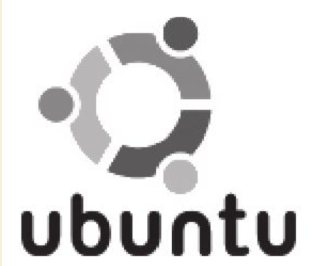

Ubuntu相关的镜像有很多，这里只搜索那些评星50以上的镜像：

::

   docker search --filter=stars=50 ubuntu
   root@3b42e05dfae5:/# cat /etc/lsb-release 
   DISTRIB_ID=Ubuntu
   DISTRIB_RELEASE=18.04
   DISTRIB_CODENAME=bionic
   DISTRIB_DESCRIPTION="Ubuntu 18.04.4 LTS"

   # 执行apt-get update命令更新仓库信息
   apt-get update

   # 安装curl工具
   apt-get install -y curl

   # 安装apache服务
   apt-get install -y apache2

   # 启动apache服务
   service apache2 start

配合使用-p参数对外映射服务器端口，可以允许容器来访问该服务。

**相关资源**

Debian 的相关资源如下：

-  Debian官网：https://www.debian.org/
-  Debian官方镜像：https://hub.docker.com/_/debian/

Ubuntu的相关资源如下：

-  Ubuntu官网：http://www.ubuntu.org.cn/global
-  Ubuntu官方镜像：https://hub.docker.com/_/ubuntu/

CentOS/Fedora
~~~~~~~~~~~~~

CentOS和Fedora都是基于Redhat的Linux发行版。CentOS是目前企业级服务器的常用操作系统；Fedora则主要面向个人桌面用户。

1.CentOS系统简介及官方镜像使用
^^^^^^^^^^^^^^^^^^^^^^^^^^^^^^

​ CentOS（Community Enterprise Operating
System，社区企业操作系统）基于Red Hat Enterprise
Linux源代码编译而成。由于CentOS与RedHat
Linux源于相同的代码基础，所以很多成本敏感且需要高稳定性的公司就使用CentOS来替代商业版Red
Hat Enterprise Linux。CentOS自身不包含闭源软件。

::

   # 使用docker search命令来搜索标星至少50的相关镜像
   docker search --filter=stars=50 centos

   # 使用docker run 直接运行centos，并登录bash
   docker run -it centos bash

2.Fedora系统简介及官方镜像使用
^^^^^^^^^^^^^^^^^^^^^^^^^^^^^^

​ Fedora是由Fedora Project社区开发，Red
Hat公司赞助的Linux发行版。它的目标是创建一套新颖、多功能并且自由和开源的操作系统。

::

   # 使用docker search命令来搜索标星至少50的相关镜像
   docker search --filter=stars=50 fedora

   # 使用docker run 直接运行fedora，并登录bash
   docker run -it fedora bash

**相关资源**

Fedora 的相关资源如下：

-  Fedora官网：https://getfedora.org/
-  Fedora官方镜像：https://hub.docker.com/_/fedora/

CentOS 的相关资源如下：

-  CentOS 官网： https://www.centos.org/
-  CentOS 官方镜像： https://hub.docker.com/_/centos/

为镜像添加SSH服务
~~~~~~~~~~~~~~~~~

介绍两种创建容器的方法：基于docker commit命令创建和基于Dockerfile创建。

基于commit命令创建
^^^^^^^^^^^^^^^^^^

**1.准备工作** 首先，获取ubuntu：18.04镜像，并创建一个容器：

::

   $ docker pull ubuntu:18.04
   $ docker run -it ubuntu:18.04 /bin/bash
   root@fc1936ea8ceb:/#

**2.配置软件源** 检查软件源，并使用apt-get update命令来更新软件源信息：

::

   root@fc1936ea8ceb:/# apt-get update
   root@fc1936ea8ceb:/# apt-get install vim net-tools

如果默认的官方源速度慢的话，也可以替换为国内163、sohu等镜像的源。以163源为例，在容器内创建/etc/apt/sources.list.d/163.list文件：

::

   root@fc1936ea8ceb:/# vi /etc/apt/sources.list.d/163.list

添加如下内容到文件中：

::

   deb http://mirrors.163.com/ubuntu/ bionic main restricted universe multiverse
   deb http://mirrors.163.com/ubuntu/ bionic-security main restricted universe multiverse
   deb http://mirrors.163.com/ubuntu/ bionic-updates main restricted universe multiverse
   deb http://mirrors.163.com/ubuntu/ bionic-proposed main restricted universe multiverse
   deb http://mirrors.163.com/ubuntu/ bionic-backports main restricted universe multiverse
   deb-src http://mirrors.163.com/ubuntu/ bionic main restricted universe multiverse
   deb-src http://mirrors.163.com/ubuntu/ bionic-security main restricted universe multiverse
   deb-src http://mirrors.163.com/ubuntu/ bionic-updates main restricted universe multiverse
   deb-src http://mirrors.163.com/ubuntu/ bionic-proposed main restricted universe multiverse
   deb-src http://mirrors.163.com/ubuntu/ bionic-backports main restricted universe multiverse

之后重新执行apt-get update命令即可。

**3.安装和配置SSH服务**

更新软件包缓存后可以安装SSH服务了，选择主流的openssh-server作为服务端。可以看到需要下载安装众多的依赖软件包：

::

   root@fc1936ea8ceb:/# apt-get install openssh-server

如果需要正常启动SSH服务，则目录/var/run/sshd必须存在。下面手动创建它，并启动SSH服务：

::

   root@fc1936ea8ceb:/# mkdir -p /var/run/sshd
   root@fc1936ea8ceb:/# /usr/sbin/sshd -D &
   [1] 3254

此时查看容器的22端口（SSH服务默认监听的端口），可见此端口已经处于监听状态：

::

   root@fc1936ea8ceb:/# netstat -tunlp
   Active Internet connections (only servers)
   Proto Recv-Q Send-Q Local Address      Foreign Address     State    PID/Program name
   tcp        0      0 0.0.0.0:22         0.0.0.0:*           LISTEN   -
   tcp6       0      0 :::22              :::*                LISTEN   -

修改SSH服务的安全登录配置，取消pam登录限制：

::

   root@fc1936ea8ceb:/# sed -ri 's/session    required     pam_loginuid.so/#session    required     pam_loginuid.so/g' /etc/pam.d/sshd

   root@fc1936ea8ceb:/# cat /etc/pam.d/sshd | grep pam_loginuid.so
   #session    required     pam_loginuid.so

在root用户目录下创建.ssh目录，并复制需要登录的公钥信息（一般为本地主机用户目录下的.ssh/id_rsa.pub文件，可由ssh-keygen-t
rsa命令生成）到authorized_keys文件中：

::

   #配置登录秘钥
   １:主机(client)生成公钥
   ubuntu@ubuntu:~$ ssh-keygen -trsa
   Generating public/private rsa key pair.
   Enter file in which to save the key (/home/ubuntu/.ssh/id_rsa):
   Enter passphrase (empty for no passphrase):
   Enter same passphrase again:
   Your identification has been saved in /home/ubuntu/.ssh/id_rsa.
   Your public key has been saved in /home/ubuntu/.ssh/id_rsa.pub.
   The key fingerprint is:
   SHA256:cCJNE3EeRpucmyTAN4tJ1diGO9TVuaNJ4LkPsJisMOE ubuntu@ubuntu
   The key's randomart image is:
   +---[RSA 3072]----+
   |   ...X=... .   |
   |    o+**=  o    |
   |   ..==*Oo   .   |
   |.   o.=*oo. o    |
   |.. . o +So o .   |
   |oE  + . o o      |
   | o .     o       |
   |  .       .      |
   |                 |
   +----[SHA256]-----+

   一直敲回车就行了

::

   ２：在容器中(server)中创建/root/.ssh目录
   root@fc1936ea8ceb:/# mkdir root/.ssh
   root@fc1936ea8ceb:/# vi /root/.ssh/authorized_keys

::

   ３：将client的公钥复制到server的authorized_keys文件中
   ubuntu@ubuntu:~$ cat  /home/ubuntu/.ssh/id_rsa.pub
   ssh-rsa AAAAB3NzaC1yc2EAAAADAQABAAABAQDxEH+/DRAITMdyTkVpIiLgvEWm5g03n+1qrN0pYAc78KM/T3Ktxn7e/kO8iqS+42NQIgEtgDq7DcUryxcgizBzeNuqJfjsfUjkiQplwnj7hjC3qfsAu8Re1pRmK
   24eEtz4HxIwd9BepYakl8NLm99PCiTkOtnDFuxNh+u4BbI6tBxmfvrrqRFC8BC5pJRmr7FooOMruzhpXbOnvTLDFaOFJU5ecQX//nBI4uj8UbXoU/ytzkcGBxJ/JXza8fNxRD4sAmQZJ9tJIqeNUBHmn1+KD0y/h5
   xh6xn8LcBASI4cGHo3azGviuWNreSxarOUvxZDWDyHxT3AI+KPvvlKP8gh root@192.168.1.106

   root@92cf48876d4c:~# vi /root/.ssh/authorized_keys
   root@92cf48876d4c:~# cat /root/.ssh/authorized_keys
   ssh-rsa AAAAB3NzaC1yc2EAAAADAQABAAABAQDxEH+/DRAITMdyTkVpIiLgvEWm5g03n+1qrN0pYAc78KM/T3Ktxn7e/kO8iqS+42NQIgEtgDq7DcUryxcgizBzeNuqJfjsfUjkiQplwnj7hjC3qfsAu8Re1pRmK
   24eEtz4HxIwd9BepYakl8NLm99PCiTkOtnDFuxNh+u4BbI6tBxmfvrrqRFC8BC5pJRmr7FooOMruzhpXbOnvTLDFaOFJU5ecQX//nBI4uj8UbXoU/ytzkcGBxJ/JXza8fNxRD4sAmQZJ9tJIqeNUBHmn1+KD0y/h5
   xh6xn8LcBASI4cGHo3azGviuWNreSxarOUvxZDWDyHxT3AI+KPvvlKP8gh root@192.168.1.106

创建自动启动SSH服务的可执行文件run.sh，并添加可执行权限：

::

   root@fc1936ea8ceb:/# vi /run.sh
   root@fc1936ea8ceb:/# chmod +x run.sh

run.sh脚本内容如下：

::

   #!/bin/bash
   /usr/sbin/sshd -D

最后，退出容器：

::

   root@fc1936ea8ceb:/# exit
   exit

**4.保存镜像**

将所退出的容器用docker commit命令保存为一个新的sshd：ubuntu镜像。

.. code:: shell

   [root@192 ~]# docker ps -a
   CONTAINER ID        IMAGE               COMMAND             CREATED             STATUS                      PORTS               NAMES
   4d8ac554cdb9        ubuntu:18.04        "/bin/bash"         8 minutes ago       Exited (0) 18 seconds ago                       musing_colden
   [root@192 ~]# docker commit 4d8ac sshd:ubuntu
   sha256:53edb4a83015c2f88e67c2f87199a1f72b13a563fe7902f8e0ec17e1e5964b5e

   #使用sshd:ubuntu镜像,添加端口映射10022-->22
   [root@192 ~]# docker run -p 10022:22 -d sshd:ubuntu /run.sh
   d562ef6176c31d01524a47f74182a719c0f0a91e2c8c82fda063414daa7893d8

启动成功后，可以在宿主主机上看到容器运行的详细信息。

.. code:: shell

   [root@192 ~]# docker ps -al
   CONTAINER ID        IMAGE               COMMAND             CREATED             STATUS              PORTS                   NAMES
   d562ef6176c3        sshd:ubuntu         "/run.sh"           20 seconds ago      Up 19 seconds       0.0.0.0:10022->22/tcp   elegant_dubinsky

在宿主主机（192.168.1.200）或其他主机上上，可以通过SSH访问10022端口来登录容器：

::

   $ ssh 192.168.1.200 -p 10022
   The authenticity of host '[192.168.1.200]:10022 ([192.168.1.200]:10022)' can't be established.
   ECDSA key fingerprint is 5f:6e:4c:54:8f:c7:7f:32:c2:38:45:bb:16:03:c9:e8.
   Are you sure you want to continue connecting (yes/no)? yes
   Warning: Permanently added '[192.168.1.200]:10022' (ECDSA) to the list of known hosts.
   root@3ad7182aa47f:~#

使用Dockerfile创建
^^^^^^^^^^^^^^^^^^

**1.创建工作目录** 首先，创建一个sshd_ubuntu工作目录：

::

   $ mkdir sshd_ubuntu
   $ ls
   sshd_ubuntu

在其中，创建Dockerfile和run.sh文件：

::

   $ cd sshd_ubuntu/
   $ touch Dockerfile run.sh
   $ ls
   Dockerfile run.sh

**2.编写run.sh脚本和authorized_keys文件**
脚本文件run.sh的内容与上一小节中一致：

::

   #!/bin/bash
   /usr/sbin/sshd -D

在宿主主机上生成SSH密钥对，并创建authorized_keys文件：

::

   $ ssh-keygen -t rsa
   ...
   $ cat ~/.ssh/id_rsa.pub >authorized_keys

**3.编写Dockerfile**
下面是Dockerfile的内容及各部分的注释，可以对比上一节中利用docker
commit命令创建镜像过程，所进行的操作基本一致：

::

   #设置继承镜像
   FROM ubuntu:18.04
   #提供一些作者的信息
   MAINTAINER docker_user (user@docker.com)
   #下面开始运行命令,此处更改ubuntu的源为国内163的源
   RUN echo "deb http://mirrors.163.com/ubuntu/ bionic main restricted universe multiverse" > /etc/apt/sources.list
   RUN echo "deb http://mirrors.163.com/ubuntu/ bionic-security main restricted universe multiverse" >> /etc/apt/sources.list
   RUN echo "deb http://mirrors.163.com/ubuntu/ bionic-updates main restricted universe multiverse" >> /etc/apt/sources.list
   RUN echo "deb http://mirrors.163.com/ubuntu/ bionic-proposed main restricted universe multiverse" >> /etc/apt/sources.list
   RUN echo "deb http://mirrors.163.com/ubuntu/ bionic-backports main restricted universe multiverse" >> /etc/apt/sources.list
   RUN apt-get update
   #安装 ssh 服务
   RUN apt-get install -y openssh-server
   RUN mkdir -p /var/run/sshd
   RUN mkdir -p /root/.ssh
   #取消pam限制
   RUN sed -ri 's/session    required     pam_loginuid.so/#session    required     pam_loginuid.so/g' /etc/pam.d/sshd
   #复制配置文件到相应位置,并赋予脚本可执行权限
   ADD authorized_keys /root/.ssh/authorized_keys
   ADD run.sh /run.sh
   RUN chmod 755 /run.sh
   #开放端口
   EXPOSE 22
   #设置自启动命令
   CMD ["/run.sh"]

**4.创建镜像**

在sshd_ubuntu目录下，使用docker
build命令来创建镜像。这里用户需要注意在最后还有一个“.”，表示使用当前目录中的Dockerfile：

::

   $ cd sshd_ubuntu
   $ docker build -t sshd:dockerfile .

如果读者使用Dockerfile创建自定义镜像，那么需要注意的是Docker会自动删除中间临时创建的层，还需要注意每一步的操作和编写的Dockerfile中命令的对应关系。

命令执行完毕后，如果读者看见“Successfully built
XXX”字样，则说明镜像创建成功。可以看到，以上命令生成的镜像ID是570c26a9de68。

在本地查看sshd：dockerfile镜像已存在：

::

   $ docker images
   REPOSITORY      TAG              IMAGE ID            CREATED             VIRTUAL SIZE
   sshd            dockerfile       570c26a9de68        4 minutes ago       246.5 MB
   sshd            ubuntu           7aef2cd95fd0        12 hours ago        255.2 MB
   busybox         latest           e72ac664f4f0        3 weeks ago         2.433 MB
   ubuntu          16.04            ba5877dc9bec        3 months ago        192.7 MB
   ubuntu          latest           ba5877dc9bec        3 months ago        192.7 MB

**5.测试镜像，运行容器**

下面使用刚才创建的sshd：dockerfile镜像来运行一个容器。

直接启动镜像，映射容器的22端口到本地的10122端口：

::

   $ docker run -d -p 10122:22 sshd:dockerfile
   890c04ff8d769b604386ba4475253ae8c21fc92d60083759afa77573bf4e8af1
   $ docker ps
   CONTAINER ID  IMAGE    COMMAND     CREATED      STATUS       PORTS           NAMES
   890c04ff8d76  sshd:dockerfile     "/run.sh"   4 seconds ago       Up 3 seconds        0.0.0.0:10122->22/tcp   high_albattani

在宿主主机新打开一个终端，连接到新建的容器：

::

   $ ssh 192.168.1.200 -p 10122
   The authenticity of host '[192.168.1.200]:10122 ([192.168.1.200]:10122)' can't be established.
   ECDSA key fingerprint is d1:59:f1:09:3b:09:79:6d:19:16:f4:fd:39:1b:be:27.
   Are you sure you want to continue connecting (yes/no)? yes
   Warning: Permanently added '[192.168.1.200]:10122' (ECDSA) to the list of known hosts.
   root@890c04ff8d76:~#

镜像创建成功。

Web服务与应用
-------------

下面将重点介绍如何使用Docker来运行常见的Web服务器（包括Apache、Nginx、Tomcat等），以及一些常用应用（包括LAMP和CI/CD）

Apache
~~~~~~

Apache是一个高稳定性的、商业级别的开源Web服务器，是目前世界使用排名第一的Web服务器软件。由于其良好的跨平台和安全性，Apache被广泛应用在多种平台和操作系统上。Apache作为软件基金会支持的项目，其开发者社区完善而高效，自1995年发布至今，一直以高标准进行维护与开发。Apache音译为阿帕奇，源自美国西南部一个印第安人部落的名称（阿帕奇族）。

1.使用DockerHub镜像
^^^^^^^^^^^^^^^^^^^

DockerHub官方提供的Apache镜像，并不带PHP环境。如果读者需要PHP环境支持，可以选择PHP镜像（\ https://registry.hub.docker.com/_/php/
），并请使用含-apache标签的镜像，如7.0.7-apache。如果仅需要使用Apache运行静态HTML文件，则使用默认官方镜像即可。

编写Dockerfile文件，内容如下：

::

   FROM httpd:2.4
   COPY ./public-html /usr/local/apache2/htdocs/

同目录下：\ ``public-html/index.html``

::

   <!DOCTYPE html>
       <html>
           <body>
               
Hello, Docker!

           </body>
   </html>

构建自定义镜像

.. code:: shell

   $ docker build -t apache2-image .
   ......
   Successfully built 881d3fd0d574

启动镜像(``-d 在后台启动``)

.. code:: shell

   [root@192 apache]# docker run -p 80:80 -d apache2-image
   059b9d66b860583634d8001c640b34e0d1b2bc20c9c349e8ee2c424da1ec8c83

通过本地的80即可访问静态页面

::

   [root@192 apache]# curl 127.0.0.1
   <!DOCTYPE html>
       <html>
           <body>
               
Hello, Docker!

           </body>
   </html>

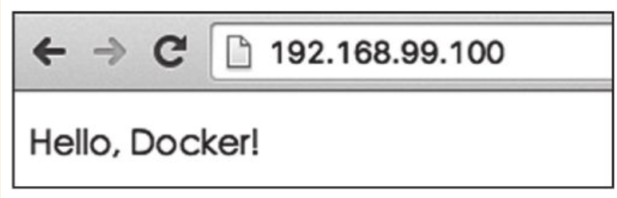

也可以不创建自定义镜像，直接通过映射目录方式运行Apache容器：

.. code:: shell

   [root@192 apache]# docker run -it --rm --name my-apache-app -p 80:80 -v "$PWD":/usr/local/apache2/htdocs/ httpd:2.4
   AH00558: httpd: Could not reliably determine the server's fully qualified domain name, using 172.17.0.2. Set the 'ServerName' directive globally to suppress this
    messageAH00558: httpd: Could not reliably determine the server's fully qualified domain name, using 172.17.0.2. Set the 'ServerName' directive globally to suppress this
    message[Tue Apr 28 13:37:52.753783 2020] [mpm_event:notice] [pid 1:tid 140658846499968] AH00489: Apache/2.4.43 (Unix) configured -- resuming normal operations
   [Tue Apr 28 13:37:52.754159 2020] [core:notice] [pid 1:tid 140658846499968] AH00094: Command line: 'httpd -D FOREGROUND'

再次打开浏览器，可以再次看到页面输出。

2.使用自定义镜像
^^^^^^^^^^^^^^^^

首先，创建一个apache_ubuntu工作目录，在其中创建Dockerfile文件、run.sh文件和sample目录：

::

   $ mkdir apache_ubuntu && cd apache_ubuntu
   $ touch Dockerfile run.sh
   $ mkdir sample

下面是Dockerfile的内容和各个部分的说明：

.. code:: dockerfile

   FROM sshd:dockerfile
   #设置继承自用户创建的 sshd 镜像
   MAINTAINER docker_user (user@docker.com)
   #创建者的基本信息
   #设置环境变量，所有操作都是非交互式的
   ENV DEBIAN_FRONTEND noninteractive
   #安装
   RUN apt-get -yq install apache2&&\
       rm -rf /var/lib/apt/lists/*
   RUN echo "Asia/Shanghai" > /etc/timezone && \
           dpkg-reconfigure -f noninteractive tzdata
   #注意这里要更改系统的时区设置，因为在Web应用中经常会用到时区这个系统变量，默认Ubuntu的设置会
   　让你的应用程序发生不可思议的效果哦
   # 添加用户的脚本，并设置权限，这会覆盖之前放在这个位置的脚本
   ADD run.sh /run.sh
   RUN chmod 755 /*.sh
   # 添加一个示例的Web站点，删掉默认安装在apache文件夹下面的文件，并将用户添加的示例用软链接链
   　 到/var/www/html目录下面
   RUN mkdir -p /var/lock/apache2 &&mkdir -p /app && rm -fr /var/www/html && ln -s /app /var/www/html
   COPY sample/ /app
   # 设置apache相关的一些变量，在容器启动的时候可以使用-e参数替代
   ENV APACHE_RUN_USER www-data
   ENV APACHE_RUN_GROUP www-data
   ENV APACHE_LOG_DIR /var/log/apache2
   ENV APACHE_PID_FILE /var/run/apache2.pid
   ENV APACHE_RUN_DIR /var/run/apache2
   ENV APACHE_LOCK_DIR /var/lock/apache2
   ENV APACHE_SERVERADMIN admin@localhost
   ENV APACHE_SERVERNAME localhost
   ENV APACHE_SERVERALIAS docker.localhost
   ENV APACHE_DOCUMENTROOT /var/www
   EXPOSE 80
   WORKDIR /app
   CMD ["/run.sh"]

此sample站点的内容为输出Hello
Docker！。下面用户在sample目录下创建index.html文件，内容为：

::

   <!DOCTYPE html>
       <html>
           <body>
               
Hello, Docker!

           </body>
   </html>

run.sh脚本内容也很简单，只是启动apache服务：

.. code:: shell

   $ cat run.sh
   #!/bin/bash
   exec apache2 -D FOREGROUND

此时，apache_ubuntu目录下面的文件结构为：

.. code:: shell

   [root@192 apache_ubuntu]# tree .
   .
   ├── Dockerfile
   ├── run.sh
   └── sample
       └── index.html

   1 directory, 3 files

下面，开始创建apache：ubuntu镜像。

使用docker build命令创建apache：ubuntu镜像，注意命令最后的“.”：

.. code:: shell

   $ docker build -t apache:ubuntu .
   ......
   Successfully built 1d865e3032d

此时镜像已经创建成功了。用户可使用docker
images指令查看本地新增的apache：ubuntu镜像：

.. code:: shell

   $ docker images
   REPOSITORY TAG IMAGE ID CREATED             VIRTUAL SIZE
   apache ubuntu 1d865e3032d7 46 seconds ago      263.8 MB

接下来，使用docker
run指令测试镜像。用户可以使用-P参数映射需要开放的端口（22和80端口）：

.. code:: shell

   $ docker run -d -P apache:ubuntu
   64681e2ae943f18eae9f599dbc43b5f44d9090bdca3d8af641d7b371c124acfd
   $ docker ps -a
   CONTAINER ID   IMAGE             COMMAND        CREATED    STATUS   PORTS   NAMES
   64681e2ae943 apache:ubuntu   "/run.sh"   2 seconds ago   Up 1 seconds   0.0.0.0:49171->22/tcp, 0.0.0.0:49172->80/tcp   naughty_poincare
   890c04ff8d76   sshd:dockerfile   "/run.sh"   9 hours ago   Exited (0) 3 hours ago   0.0.0.0:101->22/tcp   high_albattani
   3ad7182aa47f   sshd:ubuntu   "/run.sh"   21 hours ago   Exited (0) 3 hours ago   0.0.0.0:100->22/tcp   focused_ptolemy

在本地主机上用curl抓取网页来验证刚才创建的sample站点：

.. code:: shell

   $ curl 127.0.0.1:49172
   Hello Docker!

读者也可以在其他设备上通过访问宿主主机ip：49172来访问sample站点。

下面，用户看看Dockerfile创建的镜像拥有继承的特性。不知道有没有细心的读者发现，在apache镜像的Dockerfile中只用EXPOSE定义了对外开放的80端口，而在docker
ps-a命令的返回中，却看到新启动的容器映射了2个端口：22和80。

但是实际上，当尝试使用SSH登录到容器时，会发现无法登录。这是因为在run.sh脚本中并未启动SSH服务。这说明在使用Dockerfile创建镜像时，会继承父镜像的开放端口，但却不会继承启动命令。因此，需要在run.sh脚本中添加启动sshd的服务的命令：

.. code:: shell

   $ cat run.sh
   #!/bin/bash
   /usr/sbin/sshd &
   exec apache2 -D FOREGROUND

再次创建镜像：

.. code:: shell

   $ docker build -t apache:ubuntu .

这次创建的镜像，将默认会同时启动SSH和Apache服务。

下面，用户看看如何映射本地目录。用户可以通过映射本地目录的方式，来指定容器内Apache服务响应的内容，例如映射本地主机上当前目录下的www目录到容器内的/var/www目录：

.. code:: shell

   $ docker run -i -d -p 80:80 -p 103:22 -e APACHE_SERVERNAME=test  -v 'pwd'/www:/var/www:ro apache:ubuntu

在当前目录内创建www目录，并放上自定义的页面index.html，内容为：

.. code:: shell

   <!DOCTYPE HTML PUBLIC "-//IETF//DTD HTML 2.0//EN">
   <html><head>
   <title>Hi Docker</title>
   </head><body>
   <h1>Hi Docker</h1>
   
This is the first day I meet the new world.

   
How are you?

   

   <address>Apache/2.4.7 (Ubuntu) Server at 127.0.0.1 Port 80</address>
   </body></html>

在本地主机上可访问测试容器提供的Web服务，查看获取内容为新配置的index.html页面信息。

3.相关资源
^^^^^^^^^^

Apache的相关资源如下：

-  Apache官网：https://httpd.apache.org/
-  Apache官方仓库：https://github.com/apache/httpd

Nginx
~~~~~

Nginx（发音为“engine-x”）是一款功能强大的开源反向代理服务器，支持HTTP、HTTPS、SMTP、POP3、IMAP等协议。它也可以作为负载均衡器、HTTP缓存或Web服务器。Nginx一开始就专注于高并发和高性能的应用场景。它使用类BSD开源协议，支持Linux、BSD、Mac、Solaris、AIX等类Unix系统，同时也有Windows上的移植版本。

Nginx特性如下：

::

   ·热部署：采用master管理进程与worker工作进程的分离设计，支持热部署。在不间断服务的前提下，可以直接升级版本。也可以在不停止服务的情况下修改配置文件，更换日志文件等。

   ·高并发连接：Nginx可以轻松支持超过100K的并发，理论上支持的并发连接上限取决于机器内存。

   ·低内存消耗：在一般的情况下，10K个非活跃的HTTP Keep-Alive连接在Nginx中仅消耗2.5 MB的内存，这也是Nginx支持高并发连接的基础。

   ·响应快：在正常的情况下，单次请求会得到更快的响应。在高峰期，Nginx可以比其他的Web服务器更快地响应请求。

   ·高可靠性：Nginx是一个高可靠性的Web服务器，这也是用户为什么选择Nginx的基本条件，现在很多的网站都在使用Nginx，足以说明Nginx的可靠性。高可靠性来自其核心框架代码的优秀设计和实现。

本节将首先介绍Nginx官方发行版本的镜像生成，然后介绍第三方发行版Tengine镜像的生成。

.. _使用dockerhub镜像-1:

1.使用DockerHub镜像
^^^^^^^^^^^^^^^^^^^

用户可以使用docker run指令直接运行官方Nginx镜像：

.. code:: shell

   $ docker run -d -p 80:80 --name webserver nginx
   ...
   34bcd01998a76f67b1b9e6abe5b7db5e685af325d6fafb1acd0ce84e81e71e5d

然后使用docker ps指令查看当前运行的容器：

.. code:: shell

   [root@192 Docker]# docker ps
   CONTAINER ID        IMAGE               COMMAND                  CREATED              STATUS              PORTS                NAMES
   a3454b58a5dc        nginx               "nginx -g 'daemon of…"   About a minute ago   Up About a minute   0.0.0.0:80->80/tcp   webserver

目前Nginx容器已经在0.0.0.0：80启动，并映射了80端口，此时可以打开浏览器访问此地址，就可以看到Nginx输出的页面。

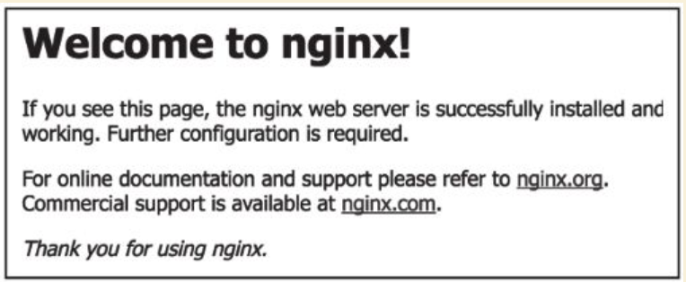

1.9.8版本后的镜像支持debug模式，镜像包含nginx-debug，可以支持更丰富的log信息：

.. code:: shell

   $ docker run --name my-nginx -v /host/path/nginx.conf:/etc/nginx/nginx.conf:ro -d nginx nginx-debug -g 'daemon off;'

相应的docker-compose.yml配置如下：

::

   web:
       image: nginx
       volumes:
           - ./nginx.conf:/etc/nginx/nginx.conf:ro
       command: [nginx-debug, '-g', 'daemon off;']

2.自定义Web页面
^^^^^^^^^^^^^^^

首先，新建index.html文件，内容如下：

::

   <html>
       <title>text<title>
       <body>
           

               hello world
           

       </body>
   </html>

然后使用docker[container]run指令运行，并将index.html文件挂载至容器中，即可看到显示自定义的页面。

.. code:: shell

   $ docker run --name nginx-container -p 80:80 -v index.html:/usr/share/nginx/html:ro -d nginx

另外，也可以使用Dockerfile来构建新镜像。Dockerfile内容如下：

::

   FROM nginx
   COPY ./index.html /usr/share/nginx/html

开始构建镜像my-nginx：

.. code:: shell

   $ docker build -t my-nginx .

构建成功后执行docker[container]run指令，如下所示：

.. code:: shell

   $ docker run -p 80:80 --name nginx-container -d my-nginx

（1）使用自定义Dockerfile

代码如下：

::

   #设置继承自创建的sshd镜像
   FROM sshd:dockerfile
   #下面是一些创建者的基本信息
   MAINTAINER docker_user (user@docker.com)
   #安装nginx，设置nginx以非daemon方式启动。
   RUN \
       apt-get install -y nginx && \
       rm -rf /var/lib/apt/lists/* && \
       echo "\ndaemon off;" >> /etc/nginx/nginx.conf && \
       chown -R www-data:www-data /var/lib/nginx
   RUN echo "Asia/Shanghai" > /etc/timezone && \
       dpkg-reconfigure -f noninteractive tzdata
   # 注意这里要更改系统的时区设置，因为在Web应用中经常会用到时区这个系统变量，默认ubuntu的设置
     会让你的应用程序发生不可思议的效果哦
   # 添加用户的脚本，并设置权限，这会覆盖之前放在这个位置的脚本
   ADD run.sh /run.sh
   RUN chmod 755 /*.sh
   # 定义可以被挂载的目录，分别是虚拟主机的挂载目录、证书目录、配置目录、和日志目录
   VOLUME ["/etc/nginx/sites-enabled", "/etc/nginx/certs", "/etc/nginx/conf.d", "/var/log/nginx"]
   # 定义工作目录
   WORKDIR /etc/nginx
   # 定义输出命令
   CMD ["/run.sh"]
   # 定义输出端口
   EXPOSE 80
   EXPOSE 443

（2）查看run.sh脚本文件内容

代码如下：

.. code:: shell

   $ cat run.sh
   #!/bin/bash
   /usr/sbin/sshd &
   /usr/sbin/nginx

（3）创建镜像

使用docker build命令，创建镜像nginx：stable：

::

   $ docker build -t nginx:stable .
   ...
   Successfully built 4e3936e36e3

（4）测试

启动容器，查看内部的80端口被映射到本地的49193端口：

::

   $ docker run -d -P nginx:stable
   08c456536e69c8e36670f3bc6b496020e76d28fc9d33a8bcd01ff6d61bc72c4a
   $ docker ps
   CONTAINER ID IMAGE COMMAND CREATED STATUS PORTS NAMES
   08c456536e69 nginx:stable "/run.sh" 8 seconds ago Up 8 seconds 0.0.0.0:49191->22/tcp, 0.0.0.0:49192->443/tcp, 0.0.0.0:49193->80/tcp

访问本地的49193端口：

::

   $ curl 127.0.0.1:49193

再次看到Nginx的欢迎页面，说明Nginx已经正常启动了。

3.参数优化
^^^^^^^^^^

为了能充分发挥Nginx的性能，用户可对系统内核参数做一些调整。下面是一份常见的适合运行Nginx服务器的内核优化参数：

::

   net.ipv4.ip_forward = 0
   net.ipv4.conf.default.rp_filter = 1
   net.ipv4.conf.default.accept_source_route = 0
   kernel.sysrq = 0
   kernel.core_uses_pid = 1
   net.ipv4.tcp_syncookies = 1
   kernel.msgmnb = 65536
   kernel.msgmax = 65536
   kernel.shmmax = 68719476736
   kernel.shmall = 4294967296
   net.ipv4.tcp_max_tw_buckets = 6000
   net.ipv4.tcp_sack = 1
   net.ipv4.tcp_window_scaling = 1
   net.ipv4.tcp_rmem = 4096 87380 4194304
   net.ipv4.tcp_wmem = 4096 16384 4194304
   net.core.wmem_default = 8388608
   net.core.rmem_default = 8388608
   net.core.rmem_max = 16777216
   net.core.wmem_max = 16777216
   net.core.netdev_max_backlog = 262144
   net.core.somaxconn = 262144
   net.ipv4.tcp_max_orphans = 3276800
   net.ipv4.tcp_max_syn_backlog = 262144
   net.ipv4.tcp_timestamps = 0
   net.ipv4.tcp_synack_retries = 1
   net.ipv4.tcp_syn_retries = 1
   net.ipv4.tcp_tw_recycle = 1
   net.ipv4.tcp_tw_reuse = 1
   net.ipv4.tcp_mem = 94500000 915000000 927000000
   net.ipv4.tcp_fin_timeout = 1
   net.ipv4.tcp_keepalive_time = 30
   net.ipv4.ip_local_port_range = 1024 65000

**相关资源**

Nginx 的相关资源如下：

囗 Nginx官网： https://www.nginx.com 囗 Nginx官方仓库：
https://github.com/nginx/nginx 囗 Nginx官方镜像：
https://hub.docker.com/_/nginx/ 囗 Nginx官方镜像仓库：
https://github.com/nginxinc/docker-nginx

.. _相关资源-1:

4.相关资源
^^^^^^^^^^

Nginx的相关资源如下：

-  Nginx官网：https://www.nginx.com
-  Nginx官方仓库：https://github.com/nginx/nginx
-  Nginx官方镜像：https://hub.docker.com/_/nginx/
-  Nginx官方镜像仓库：https://github.com/nginxinc/docker-nginx

Tomcat
~~~~~~

Tomcat是由Apache软件基金会下属的Jakarta项目开发的一个Servlet容器，按照Sun
Microsystems提供的技术规范，实现了对Servlet和JavaServer
Page（JSP）的支持。同时，它提供了作为Web服务器的一些特有功能，如Tomcat管理和控制平台、安全域管理和Tomcat阀等。由于Tomcat本身也内含了一个HTTP服务器，也可以当作单独的Web服务器来使用。

下面将以sun_jdk 1.6、tomcat 7.0、ubuntu
18.04环境为例介绍如何定制Tomcat镜像。

1.准备工作
^^^^^^^^^^

创建tomcat7.0_jdk1.6文件夹，从www.oracle.com网站上下载sun_jdk
1.6压缩包，解压为jdk目录。

创建Dockerfile和run.sh文件：

.. code:: shell

   $ mkdir tomcat7.0_jdk1.6
   $ cd tomcat7.0_jdk1.6/
   $ touch Dockerfile run.sh

下载Tomcat，可以到官方网站下载最新的版本，也可以直接使用下面链接中给出的版本：

.. code:: shell

   $ wget http://mirror.bit.edu.cn/apache/tomcat/tomcat-7/v7.0.103/bin/apache-tomcat-7.0.103.zip

   --2020-04-29 16:55:22--  http://mirror.bit.edu.cn/apache/tomcat/tomcat-7/v7.0.103/bin/apache-tomcat-7.0.103.zip
   正在解析主机 mirror.bit.edu.cn (mirror.bit.edu.cn)... 2001:da8:204:1205::22, 114.247.56.117
   正在保存至: “apache-tomcat-7.0.103.zip”

解压后，tomcat7.0_jdk1.6目录结构应如下所示（多余的压缩包文件已经被删除）：

.. code:: shell

   $ ls
   Dockerfile  apache-tomcat-7.0.56   jdk  run.sh

2.Dockerfile文件和其他脚本文件
^^^^^^^^^^^^^^^^^^^^^^^^^^^^^^

Dockerfile文件内容如下：

.. code:: shell

   FROM sshd:dockerfile
   #设置继承自用户创建的sshd镜像
   MAINTAINER docker_user (user@docker.com)
   #下面是一些创建者的基本信息
   #设置环境变量，所有操作都是非交互式的
   ENV DEBIAN_FRONTEND noninteractive
   RUN echo "Asia/Shanghai" > /etc/timezone && \
       dpkg-reconfigure -f noninteractive tzdata
   #注意这里要更改系统的时区设置，因为在Web应用中经常会用到时区这个系统变量，默认ubuntu的设置会
   　让你的应用程序发生不可思议的效果哦
   #安装跟tomcat用户认证相关的软件
   RUN apt-get install -yq --no-install-recommends wget pwgen ca-certificates && \
       apt-get clean && \
       rm -rf /var/lib/apt/lists/*
   #设置tomcat的环境变量，若读者有其他的环境变量需要设置，也可以在这里添加
   ENV CATALINA_HOME /tomcat
   ENV JAVA_HOME /jdk
   #复制tomcat和jdk文件到镜像中
   ADD apache-tomcat-7.0.56 /tomcat
   ADD jdk /jdk
   ADD create_tomcat_admin_user.sh /create_tomcat_admin_user.sh
   ADD run.sh /run.sh
   RUN chmod +x /*.sh
   RUN chmod +x /tomcat/bin/*.sh
   EXPOSE 8080
   CMD ["/run.sh"]
   #创建tomcat用户和密码脚本文件create_tomcat_admin_user.sh文件，内容为：
   #!/bin/bash
   if [ -f /.tomcat_admin_created ]; then
       echo "Tomcat 'admin' user already created"
       exit 0
   fi
   #generate password
   PASS=${TOMCAT_PASS:-$(pwgen -s 12 1)}
   _word=$( [ ${TOMCAT_PASS} ] && echo "preset" || echo "random" )
   echo "=> Creating and admin user with a ${_word} password in Tomcat"
   sed -i -r 's/<\/tomcat-users>//' ${CATALINA_HOME}/conf/tomcat-users.xml
   echo '<role rolename="manager-gui"/>' >> ${CATALINA_HOME}/conf/tomcat-users.xml
   echo '<role rolename="manager-script"/>' >> ${CATALINA_HOME}/conf/tomcat-users.xml
   echo '<role rolename="manager-jmx"/>' >> ${CATALINA_HOME}/conf/tomcat-users.xml
   echo '<role rolename="admin-gui"/>' >> ${CATALINA_HOME}/conf/tomcat-users.xml
   echo '<role rolename="admin-script"/>' >> ${CATALINA_HOME}/conf/tomcat-users.xml
   echo "<user username=\"admin\" password=\"${PASS}\" roles=\"manager-gui,manager-script,manager-jmx,admin-gui, admin-script\"/>" >> ${CATALINA_HOME}/conf/tomcat-users.xml
   echo '</tomcat-users>' >> ${CATALINA_HOME}/conf/tomcat-users.xml
   echo "=> Done!"
   touch /.tomcat_admin_created
   echo "========================================================================"
   echo "You can now configure to this Tomcat server using:"
   echo ""
   echo "    admin:${PASS}"
   echo ""
   echo "========================================================================"

编写run.sh脚本文件，内容为：

.. code:: shell

   #!/bin/bash
   if [ ! -f /.tomcat_admin_created ]; then
       /create_tomcat_admin_user.sh
   fi
   /usr/sbin/sshd -D &
   exec ${CATALINA_HOME}/bin/catalina.sh run

3.创建和测试镜像
^^^^^^^^^^^^^^^^

通过下面的命令创建镜像tomcat7.0：jdk1.6：

.. code:: shell

   $ docker build -t tomcat7.0:jdk1.6 .
   …
   Successfully built ce78537c247d

启动一个tomcat容器进行测试：

.. code:: shell

   $ docker run -d -P tomcat7.0:jdk1.6
   3cd4238cb32a713a3a1c29d93fbfc80cba150653b5eb8bd7629bee957e7378ed

通过docker logs得到tomcat的密码aBwN0CNCPckw：

.. code:: shell

   $ docker logs 3cd
   => Creating and admin user with a random password in Tomcat
   => Done!
   ========================================================================
   You can now configure to this Tomcat server using:
       admin:aBwN0CNCPckw
   ========================================================================

查看映射的端口信息：

.. code:: shell

   $ docker ps
   CONTAINER ID   IMAGE               COMMAND     CREATED          STATUS    PORTS    NAMES
   3cd4238cb32a   tomcat7.0:jdk1.6   "/run.sh"   4 seconds ago   Up 3 seconds   0.0.0.0: 49157->22/tcp, 0.0.0.0:49158->8080/tcp   cranky_wright

在本地使用浏览器登录Tomcat管理界面，访问本地的49158端口，即\ `http://127.0.0.1:49158 <http://127.0.0.1:49158/>`__
，可以看见启动页面。

Tomcat启动页面 |image1|

输入从docker logs中得到的密码

Tomcat登录

.. image:: ../_static/docker_tomcat0003.png

成功进入管理界面。

管理界面

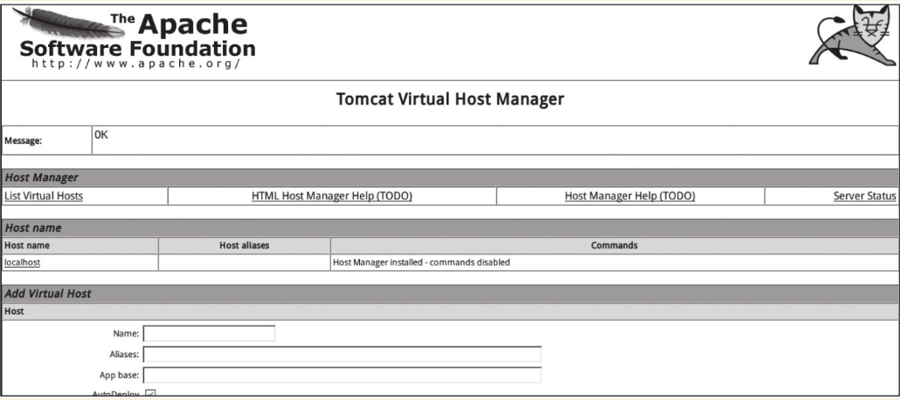

``注意``
在实际环境中，可以通过使用-v参数来挂载Tomcat的日志文件、程序所在目录、以及与Tomcat相关的配置。

.. _相关资源-2:

4.相关资源
^^^^^^^^^^

Tomcat的相关资源如下：

-  Tomcat官网：http://tomcat.apache.org/
-  Tomcat官方仓库：https://github.com/apache/tomcat
-  Tomcat官方镜像：https://hub.docker.com/_/tomcat/
-  Tomcat官方镜像仓库：https://github.com/docker-library/tomcat

Jetty
~~~~~

Jetty是一个优秀的开源servlet容器，以其高效、小巧、可嵌入式等优点深得人心，它为基于Java的Web内容（如JSP和servlet）提供运行环境。Jetty基于Java语言编写，它的API以一组JAR包的形式发布。开发人员可以将Jetty容器实例化成一个对象，可以迅速为一些独立运行（stand-alone）的Java应用提供Web服务。

与相对老牌的Tomcat比，Jetty架构更合理，性能更优。尤其在启动速度上，让Tomcat望尘莫及。Jetty目前在国内外互联网企业中应用广泛。

1.使用官方镜像
^^^^^^^^^^^^^^

DockerHub官方提供了Jetty镜像，直接运行docker[container]run指令即可：

.. code:: shell

   $ docker run -d jetty
   f7f1d70f2773be12b54c40e3222c4e658fd7c39f22337e457984b13fbc64a54c

使用docker ps指令查看正在运行中的Jetty容器：

.. code:: shell

   $ docker ps
   CONTAINER ID  IMAGE COMMAND              CREATED  STATUS PORTS      NAMES
   f7f1d70f2773  jetty "/docker-entrypoint.b" x ago   Up     8080/tcp    lonely_poitras

当然，还可以使用-p参数映射运行端口：

.. code:: shell

   $ docker run -d -p 80:8080 -p 443:8443 jetty
   7bc629845e8b953e02e31caaac24744232e21816dcf81568c029eb8750775733

使用宿主机的浏览器访问container-ip：8080，即可获得Jetty运行页面，由于当前没有内容，会提示错误信息。如图：

.. image:: ../_static/docker_jetty02.png

.. _相关资源-3:

2.相关资源
^^^^^^^^^^

Jetty的相关资源如下：

-  Jetty官网：http://www.eclipse.org/jetty/
-  Jetty官方仓库：https://github.com/eclipse/jetty.project
-  Jetty官方镜像：https://hub.docker.com/_/jetty/
-  Jetty官方镜像仓库：https://github.com/appropriate/docker-jetty

LAMP
~~~~

LAMP（Linux-Apache-MySQL-PHP）是目前流行的Web工具栈，其中包括：Linux操作系统，Apache网络服务器，MySQL数据库，Perl、PHP或者Python编程语言。其组成工具均是成熟的开源软件，被大量网站所采用。和Java/J2EE架构相比，LAMP具有Web资源丰富、轻量、快速开发等特点；和微软的.NET架构相比，LAMP更具有通用、跨平台、高性能、低价格的优势。因此LAMP技术栈得到了广泛的应用。

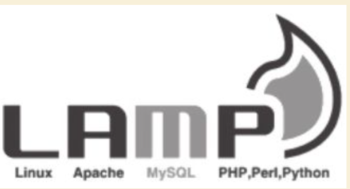

``注意``
现在也有人用Nginx替换Apache，称为LNMP或LEMP，是十分类似的技术栈，并不影响整个技术框架的选型原则。

.. _使用官方镜像-1:

1.使用官方镜像
^^^^^^^^^^^^^^

用户可以使用自定义Dockerfile或者Compose方式运行LAMP，同时社区也提供了十分成熟的linode/lamp和tutum/lamp镜像。

（1）使用linode/lamp镜像
^^^^^^^^^^^^^^^^^^^^^^^^

首先，执行docker[container]run指令，直接运行镜像，并进入容器内部bash
shell：

.. code:: bash

   $ docker run -p 80:80 -t -i linode/lamp /bin/bash
   root@e283cc3b2908:/#

在容器内部shell启动Apache以及MySQL服务：

.. code:: shell

   $ root@e283cc3b2908:/# service apache2 start
     * Starting web server apache2
   $ root@e283cc3b2908:/# service mysql start
     * Starting MySQL database server mysqld                                 [ OK ]
     * Checking for tables which need an upgrade, are corrupt or were
   not closed cleanly.

此时镜像中Apache、MySQL服务已经启动，可使用docker
ps指令查看运行中的容器：

::

   [root@desktop-pmjtngi ~]# docker ps
   CONTAINER ID        IMAGE               COMMAND             CREATED             STATUS              PORTS                NAMES
   52531235e745        linode/lamp         "/bin/bash"         46 seconds ago      Up 46 seconds       0.0.0.0:80->80/tcp   practical_meninsky

此时通过浏览器访问本地80端口即可看到默认页面。如图

linode/lamp默认页面

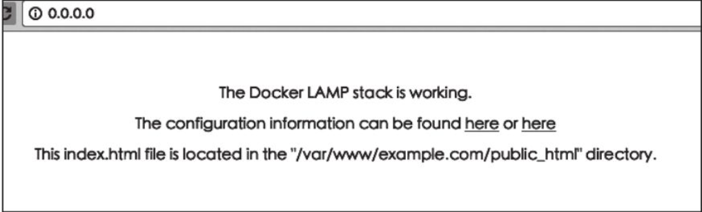

（2）使用tutum/lamp镜像
^^^^^^^^^^^^^^^^^^^^^^^

首先，执行docker[container]run指令，直接运行镜像：

.. code:: shell

   $ docker run -d -p 80:80 -p 3306:3306 tutum/lamp
   51e231878d3d61d4fd28874e22261f5cd740082826e870ac5568d6f2d77850e7

容器启动成功后，打开浏览器，访问demo页面，如图

LAMP容器Demo页面

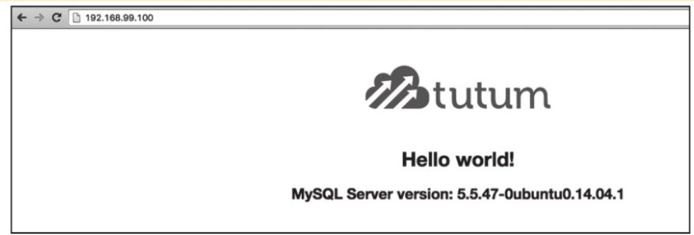

（3）部署自定义PHP应用
^^^^^^^^^^^^^^^^^^^^^^

默认的容器启动了一个helloword应用。读者可以基于此镜像，编辑Dockerfile来创建自定义LAMP应用镜像。

在宿主主机上创建新的工作目录lamp：

.. code:: shell

   $ mkdir lamp
   $ cd lamp
   $ touch Dockerfile

在php目录下里面创建Dockerfile文件，内容为：

.. code:: shell

   FROM tutum/lamp:latest
   RUN rm -fr /app && git clone https://github.com/username/customapp.git /app
   #这里替换 https://github.com/username/customapp.git 地址为你自己的项目地址
   EXPOSE 80 3306
   CMD ["/run.sh"]

创建镜像，命名为my-lamp-app：

::

   $ docker build -t my-lamp-app .

利用新创建镜像启动容器，注意启动时候指定-d参数，让容器后台运行：

.. code:: shell

   $ docker run -d -p 8080:80 -p 3306:3306 my-lamp-app

在本地主机上使用curl命令测试应用程序是不是已经正常响应：

--------------

.. code:: shell

   $ curl http://127.0.0.1:8080/

.. _相关资源-4:

2.相关资源
^^^^^^^^^^

LAMP的相关资源如下：

-  tutum LAMP镜像：https://hub.docker.com/r/tutum/lamp/
-  linode LAMP镜像：https://hub.docker.com/r/linode/lamp/

持续开发与管理
--------------

信息行业日新月异，如何响应不断变化的需求，快速适应和保证软件的质量？持续集成（Continuous
Integration，CI）正是针对解决这类问题的一种开发实践，它倡导开发团队定期进行集成验证。集成通过自动化的构建来完成，包括自动编译、发布和测试，从而尽快地发现错误。

持续集成的特点包括：

·鼓励自动化的周期性的过程，从检出代码、编译构建、运行测试、结果记录、测试统计等都是自动完成的，减少人工干预；

·需要有持续集成系统的支持，包括代码托管机制支持，以及集成服务器等。

持续交付（Continuous
Delivery，CD）则是经典的敏捷软件开发方法的自然延伸，它强调产品在修改后到部署上线的流程要敏捷化、自动化。甚至一些较小的改变也要尽早地部署上线，这与传统软件在较大版本更新后才上线的思路不同。

1.Jenkins及官方镜像
~~~~~~~~~~~~~~~~~~~

Jenkins是一个得到广泛应用的持续集成和持续交付的工具。作为开源软件项目，它旨在提供一个开放易用的持续集成平台。Jenkins能实时监控集成中存在的错误，提供详细的日志文件和提醒功能，并用图表的形式形象地展示项目构建的趋势和稳定性。Jenkins特点包括安装配置简单、支持详细的测试报表、分布式构建等。

Jenkis自2.0版本推出了“Pipeline as
Code”，帮助Jenkins实现对CI和CD更好的支持。通过Pipeline，将原本独立运行的多个任务连接起来，可以实现十分复杂的发布流程。

Jenkins Pipeline示意图

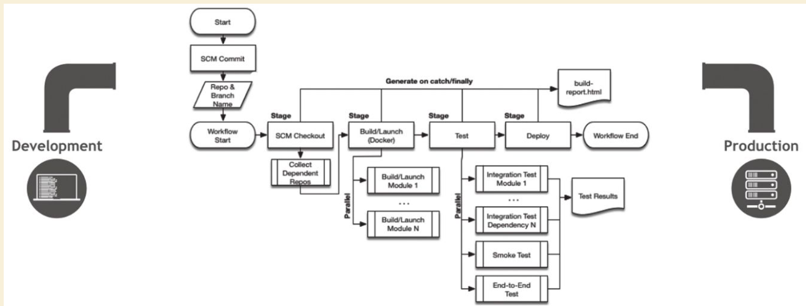

Jenkins官方在DockerHub上提供了全功能的基于官方发布版的Docker镜像。

可以方便地使用docker[container]run指令一键部署Jenkins服务：

.. code:: shell

   $ docker run -p 8080:8080 -p 50000:50000 jenkins
   Apr 30, 2020 4:57:50 AM jenkins.install.SetupWizard init
   INFO: 

   *************************************************************
   *************************************************************
   *************************************************************

   Jenkins initial setup is required. An admin user has been created and a password generated.
   Please use the following password to proceed to installation:

   f05ae5368fd74ee68b34ae41dbc4eaed

   This may also be found at: /var/jenkins_home/secrets/initialAdminPassword

再打开一个控制台终端查看jenkins的密码：

.. code:: shell

   [root@desktop-pmjtngi lamp]# docker ps
   CONTAINER ID        IMAGE               COMMAND                  CREATED             STATUS              PORTS                                              NAMES
   4991a17aaed0        jenkins             "/bin/tini -- /usr/l…"   2 minutes ago       Up 2 minutes        0.0.0.0:8080->8080/tcp, 0.0.0.0:50000->50000/tcp   admiring_
   einstein[root@desktop-pmjtngi lamp]# docker exec -it 4991a17aaed0 cat /var/jenkins_home/secrets/initialAdminPassword
   f05ae5368fd74ee68b34ae41dbc4eaed

Jenkins容器启动成功后，可以打开浏览器访问8080端口，查看Jenkins管理界面，如图:

.. image:: ../_static/docker_jenkins004.png

目前运行的容器中，数据会存储在工作目录/var/jenkins_home中，这包括Jenkins中所有的数据，如插件和配置信息等。如果需要数据持久化，读者可以使用数据卷机制：

.. code:: shell

   $ docker run -p 8080:8080 -p 50000:50000 -v /your/home:/var/jenkins_home jenkins
   e25d995cc4a44d08a5d81af10aed0cf6

以上指令会将Jenkins数据存储于宿主机的/your/home目录（需要确保/your/home目录对于容器内的Jenkins用户是可访问的）下。当然也可以使用数据卷容器：

.. code:: shell

   $ docker run --name myjenkins -p 8080:8080 -p 50000:50000 -v /var/jenkins_home jenkins

参考文献：

`DevOps -
以Docker方式启动Jenkins <https://www.cnblogs.com/anliven/p/11893316.html>`__

`基于docker搭建jenkins <https://www.cnblogs.com/xiao987334176/p/13373198.html>`__

`jenkins 调用Rancher2.x
api实现CI/CD <https://www.cnblogs.com/xiao987334176/p/13180819.html>`__

`python调用jenkinsAPI <https://www.cnblogs.com/xiao987334176/p/13140005.html>`__

`基于Jenkins+Gitlab+Harbor+Rancher+k8s
CI/CD实现 <https://www.cnblogs.com/xiao987334176/p/13074198.html>`__

`Jenkins+harbor+gitlab+k8s
部署maven项目 <https://www.cnblogs.com/xiao987334176/p/11434849.html>`__

2.GitLab及其官方镜像
~~~~~~~~~~~~~~~~~~~~

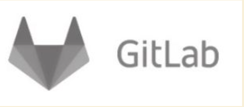

GitLab是一款非常强大的开源源码管理系统。它支持基于Git的源码管理、代码评审、issue跟踪、活动管理、wiki页面、持续集成和测试等功能。基于GitLab，用户可以自己搭建一套类似于Github的开发协同平台。

GitLab官方提供了社区版本（GitLab CE）的DockerHub镜像，可以直接使用docker
run指令运行：

.. code:: shell

   $ docker run --detach \
       --hostname gitlab.example.com \
       --publish 443:443 --publish 80:80 --publish 23:23 \
       --name gitlab \
       --restart always \
       --volume /srv/gitlab/config:/etc/gitlab \
       --volume /srv/gitlab/logs:/var/log/gitlab \
       --volume /srv/gitlab/data:/var/opt/gitlab \
       gitlab/gitlab-ce:latest
       
   dbae485d24492f656d2baf18526552353cd55aac662e32491046ed7fa033be3a

成功运行镜像后，可以打开浏览器访问GitLab服务管理界面，如图

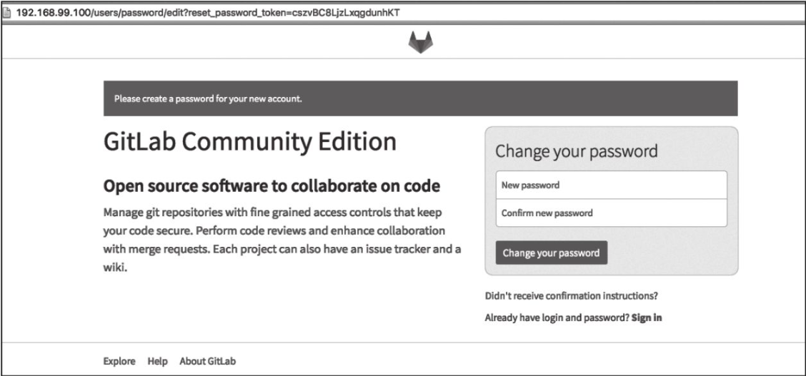

参考文献：

`DevOps -
以Docker方式启动GitLab <https://www.cnblogs.com/anliven/p/12070966.html>`__

`基于docker搭建gitlab <https://www.cnblogs.com/xiao987334176/p/13372837.html>`__

docker-compose部署gitlab中文版

参考：

https://www.jianshu.com/p/2d76092ebf53

参考：

https://www.jb51.net/article/152570.htm

.. _相关资源-5:

3.相关资源
~~~~~~~~~~

Jenkins的相关资源如下：

-  Jenkins官网：https://jenkins.io/
-  Jenkins官方仓库：https://github.com/jenkinsci/jenkins/
-  Jenkins官方镜像：https://hub.docker.com/r/jenkinsci/jenkins/
-  Jenkins官方镜像仓库：https://github.com/jenkinsci/docker

GitLab的相关资源如下：

-  GitLab官网：https://github.com/gitlabhq/gitlabhq
-  GitLab官方镜像：https://hub.docker.com/r/gitlab/gitlab-ce/

本章小结
~~~~~~~~

本章首先介绍了常见的Web服务工具，包括Apache、Nginx、Tomcat、Jetty，以及大名鼎鼎的LAMP组合，然后对目前流行的持续开发模式和工具的快速部署进行了讲解。通过这些例子，读者可以快速入门Web开发，并再次体验到基于容器模式的开发和部署模式为何如此强大。

笔者认为，包括Web服务在内的中间件领域十分适合引入容器技术：

中间件服务器是除数据库服务器外的主要计算节点，很容易成为性能瓶颈，所以通常需要大批量部署，而Docker对于批量部署有着许多先天的优势；

中间件服务器结构清晰，在剥离了配置文件、日志、代码目录之后，容器几乎可以处于零增长状态，这使得容器的迁移和批量部署更加方便；

中间件服务器很容易实现集群，在使用硬件的F5、软件的Nginx等负载均衡后，中间件服务器集群变得非常容易。

在实践过程中，读者需要注意数据的持久化。对于程序代码、资源目录、日志、数据库文件等需要实时更新和保存的数据一定要启用数据持久化机制，避免发生数据丢失。

数据库应用
----------

目前，主流数据库包括关系型（SQL）和非关系型（NoSQL）两种。关系数据库是建立在关系模型基础上的数据库，借助于集合代数等数学概念和方法来处理数据库中的数据，支持复杂的事物处理和结构化查询。代表实现有MySQL、Oracle、PostGreSQL、MariaDB、SQLServer等。

非关系数据库是新兴的数据库技术，它放弃了传统关系型数据库的部分强一致性限制，带来性能上的提升，使其更适用于需要大规模并行处理的场景。非关系型数据库是关系型数据库的良好补充，代表产品有MongoDB、Redis等。

本章选取了最具代表性的数据库如MySQL、Oracle、MongoDB、Redis、Cassandra等，来讲解基于Docker创建相关镜像并进行应用的过程。

MySQL
~~~~~

MySQL是全球最流行的开源关系型数据库之一，由于其具有高性能、成熟可靠、高适应性、易用性而得到广泛应用。

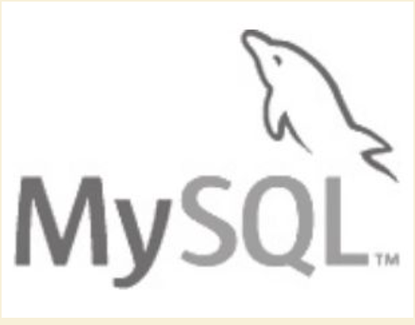

.. _使用官方镜像-2:

1.使用官方镜像
^^^^^^^^^^^^^^

用户可以使用官方镜像快速启动一个MySQL Server实例：

.. code:: shell

   $ docker run --name hi-mysql -e MYSQL_ROOT_PASSWORD=my-pwd -d mysql:latest
   e6cb906570549812c798b7b3ce46d669a8a4e8ac62a3f3c8997e4c53d16301b6

以上指令中的hi-mysql是容器名称，\ ``my-pwd为数据库的root用户密码``\ 。

使用docker ps指令可以看到现在运行中的容器：

.. code:: shell

   $ docker ps
   CONTAINER ID        IMAGE               COMMAND                  CREATED             STATUS              PORTS                 NAMES
   6f4aa173b2aa        mysql:latest        "docker-entrypoint.s…"   31 seconds ago      Up 30 seconds       3306/tcp, 33060/tcp   hi-mysql

当然，还可以使用–link标签将一个应用容器连接至MySQL容器：

.. code:: shell

   $ docker run --name some-app --link some-mysql:mysql -d application-that-uses-mysql

MySQL服务的标准端口是3306，用户可以通过CLI工具对配置进行修改：

.. code:: shell

   $ docker run -it --link some-mysql:mysql --rm mysql sh -c 'exec mysql -h"$MYSQL_PORT_3306_TCP_ADDR" -P"$MYSQL_PORT_3306_TCP_PORT" -uroot -p"$MYSQL_ENV_MYSQL_ROOT_PASSWORD"'

官方MySQL镜像还可以作为客户端，连接非Docker或者远程的MySQL实例：

.. code:: shell

   $ docker run -it --rm mysql mysql -hsome.mysql.host -usome-mysql-user -p

（1）系统与日志访问
^^^^^^^^^^^^^^^^^^^

用户可以使用docker exec指令调用内部系统中的bash
shell，以访问容器内部系统：

::

   $ docker exec -it some-mysql bash

MySQL Server日志可以使用docker logs指令查看：

::

   $ docker logs some-mysql

（2）使用自定义配置文件
^^^^^^^^^^^^^^^^^^^^^^^

如果用户希望使用自定义MySQL配置，则可以创建一个目录，内置cnf配置文件，然后将其挂载至容器的/etc/mysql/conf.d目录。比如，自定义配置文件为/my/custom/config-file.cnf，则可以使用以下指令：

.. code:: shell

   $ docker run --name some-mysql -v /my/custom:/etc/mysql/conf.d -e MYSQL_ROOT_PASSWORD=my-secret-pw -d mysql:tag

这时新的容器some-mysql启动后，就会结合使用/etc/mysql/my.cnf和/etc/mysql/conf.d/config-file.cnf两个配置文件。

参考文献
`docker封装mysql镜像 <https://www.cnblogs.com/xiao987334176/p/11984692.html>`__

（3）脱离cnf文件进行配置
^^^^^^^^^^^^^^^^^^^^^^^^

很多的配置选项可以通过标签（flags）传递至mysqld进程，这样用户就可以脱离cnf配置文件，对容器进行弹性的定制。比如，用户需要改变默认编码方式，将所有表格的编码方式修改为uft8mb4，则可以使用如下指令：

.. code:: shell

   $ docker run --name some-mysql -e MYSQL_ROOT_PASSWORD=my-secret-pw -d mysql:tag --character-set-server=utf8mb4 --collation-server=utf8mb4_unicode_ci

如果需要查看可用选项的完整列表，可以执行如下指令：

.. code:: shell

   $ docker run -it --rm mysql:tag --verbose --help

（4）通过docker stack deploy或docker-compose运行
^^^^^^^^^^^^^^^^^^^^^^^^^^^^^^^^^^^^^^^^^^^^^^^^

MySQL的示例\ ``stack.yml``\ 如下：

::

   # Use root/example as user/password credentials
   version: '3.1'
   services:
       db:
           image: mysql
           restart: always
           environment:
               MYSQL_ROOT_PASSWORD: example
       adminer:
           image: adminer
           restart: always
           ports:
               - 8080:8080

docker-compose部署mysql5.6

::

   version: '3.8'

   services:
     mysql:
       image: hub.gitee.cc/library/mysql:5.6.48
       restart: always
       command: --character-set-server=utf8mb4 --collation-server=utf8mb4_unicode_ci
       environment:
         - MYSQL_ROOT_PASSWORD=oschina123
         - MYSQL_DATABASE=gitlabhq_production
         - MYSQL_USER=giteeci
         - MYSQL_PASSWORD=123456
         - MYSQL_HOST=%
       user: 1000:1000
       ports:
         - 3306:3306
       volumes:
         - /data/mysql:/var/lib/mysql
         - ./mysql.cnf:/etc/mysql/conf.d/mysql.cnf

docker-compose部署mysql5.7

::

   version: "3"
   services:
     mysql:
       image: mysql:5.7
       restart: always
       hostname: mysql-master
       container_name: "mysql57-giteeci"
       ports:
         - 33006:3306
       environment:
         TZ: Asia/Shanghai
         MYSQL_ROOT_PASSWORD: oschina123
         MYSQL_DATABASE: gitlabhq_production
         MYSQL_USER: giteeci
         MYSQL_PASSWORD: 123456
         MYSQL_HOST: "%"
       volumes:
         - /data/mysql57:/var/lib/mysql
         - ./mysql.cnf:/etc/mysql/conf.d/mysql.cnf
       command:
         --server_id=100
         --log-bin=mysql-bin
         --sync_binlog=1
         --binlog-ignore-db=mysql
         --binlog_format=mixed
         --expire_logs_days=7
         --default-authentication-plugin=mysql_native_password
         --character-set-server=utf8mb4
         --collation-server=utf8mb4_general_ci
         --explicit_defaults_for_timestamp=true
         --lower_case_table_names=1
         --sql_mode=NO_ENGINE_SUBSTITUTION,STRICT_TRANS_TABLES
         #--sql_mode=STRICT_TRANS_TABLES,NO_ZERO_IN_DATE,NO_ZERO_DATE,ERROR_FOR_DIVISION_BY_ZERO,NO_AUTO_CREATE_USER,NO_ENGINE_SUBSTITUTION

docker安装mysql8.0

http://oudezhinu.site/%e6%8a%80%e6%9c%af%e6%80%bb%e7%bb%93/%e6%93%8d%e4%bd%9c%e7%b3%bb%e7%bb%9f/linux%e6%8a%80%e5%b7%a7/docker%e5%ae%89%e8%a3%85mysql8-0/

.. _相关资源-6:

2.相关资源
^^^^^^^^^^

MySQL的相关资源如下：

-  MySQL官网：https://www.mysql.com/
-  MySQL官方镜像：https://hub.docker.com/_/mysql/
-  MySQL官方镜像仓库：https://github.com/docker-library/mysql/

Oracle Database XE
~~~~~~~~~~~~~~~~~~

Oracle Database 11g快捷版（Oracle Database XE）是一款基于Oracle Database
11g第2版代码库的小型入门级数据库，具备以下优点：

·免费开发、部署和分发； ·体积较小，下载速度快； ·管理配置简单。

作为一款优秀的入门级数据库，它适合以下用户使用：

·致力于PHP、Java、.NET、XML和开源应用程序的开发人员；
·需要免费的入门级数据库进行培训和部署的DBA；
·需要入门级数据库进行免费分发的独立软件供应商（ISV）和硬件供应商；
·需要在课程中使用免费数据库的教育机构和学生。

Oracle Database
XE对安装主机的规模和CPU数量不作限制（每台计算机一个数据库），但XE将最多存储11
GB的用户数据，同时最多使用1 GB内存和主机上的一个CPU。

1.搜索Oracle镜像
^^^^^^^^^^^^^^^^

直接在DockerHub上搜索镜像，并下载wnameless/oracle-xe-11g镜像：

.. code:: shell

   $ docker search --filter=stars=50 oracle
   NAME                              DESCRIPTION                                STARS               OFFICIAL            AUTOMATED
   oraclelinux                       Official Docker builds of Oracle Linux.    646                 [OK]                
   jaspeen/oracle-11g                Docker image for Oracle 11g database       157                                     [OK]
   oracleinanutshell/oracle-xe-11g                                              93                                      
   oracle/graalvm-ce                 GraalVM Community Edition Official Image   66                                      [OK]

2.启动和使用容器
^^^^^^^^^^^^^^^^

启动容器，并分别映射22和1521端口到本地的49160和49161端口：

.. code:: shell

   $ docker run -d -p 49160:22 -p 49161:1521 wnameless/oracle-xe-11g

使用下列参数可以连接oracle数据库：

.. code:: shell

   hostname: localhost
   port: 49161
   sid: xe
   username: system
   password: oracle
   Password for SYS

使用SSH登录容器，默认的用户名为root，密码为admin：

.. code:: shell

   $ ssh root@localhost -p 49160
   password: admin

.. _相关资源-7:

3.相关资源
^^^^^^^^^^

Oracle的相关资源如下：

::

   ·Oracle XE官网：http://www.oracle.com/technetwork/database/database-technologies/express-edition/overview/index.html

   ·Oracle XE官方镜像：https://github.com/wnameless/docker-oracle-xe-11g

MongoDB
~~~~~~~

MongoDB是一款可扩展、高性能的开源文档数据库（Document-Oriented），是当今最流行的NoSQL数据库之一。它采用C++开发，支持复杂的数据类型和强大的查询语言，提供了关系数据库的绝大部分功能。由于其高性能、易部署、易使用等特点，MongoDB已经在很多领域都得到了广泛的应用。

.. _使用官方镜像-3:

1.使用官方镜像
^^^^^^^^^^^^^^

用户可以使用docker[container]run指令直接运行官方mongoDB镜像：

.. code:: shell

   $ docker run --name mongo-container -d mongo
   ade2b5036f457a6a2e7574fd68cf7a3298936f27280833769e93392015512735

之后，可以通过docker ps指令查看正在运行的mongo-container的容器ID：

.. code:: shell

   $ docker ps
   CONTAINER ID IMAGE COMMAND                CREATED     STATUS      PORTS     NAMES
   ade2b5036f45 mongo "/entrypoint.sh mongo" 1 hours ago Up 22 hours 27017/tcp mongo-container

在此，mongo-contariner启动一个bash进程，并通过mongo指令启动mongodbDB交互命令行，再通过db.stats()指令查看数据库状态：

.. code:: shell

   $ docker exec -it ade2b5036f45 sh
   # mongo
   MongoDB shell version: 3.2.6
   connecting to: test
   Server has startup warnings:
   I CONTROL  [initandlisten]
   I CONTROL  [initandlisten] ** WARNING: /sys/kernel/mm/transparent_hugepage/enabled is 'always'.
   I CONTROL  [initandlisten] **        We suggest setting it to 'never'
   I CONTROL  [initandlisten]
   I CONTROL  [initandlisten] ** WARNING: /sys/kernel/mm/transparent_hugepage/defrag is 'always'.
   I CONTROL  [initandlisten] **        We suggest setting it to 'never'
   I CONTROL  [initandlisten]
   > show dbs
   local  0.000GB
   > db.stats()
   {
       "db" : "test",
       "collections" : 1,
       "objects" : 1,
       "avgObjSize" : 39,
       "dataSize" : 39,
       "storageSize" : 16384,
       "numExtents" : 0,
       "indexes" : 1,
       "indexSize" : 16384,
       "ok" : 1
   }

这里可以通过env指令查看环境变量的配置：

::

   root@e4e9120bb00e:/# env
   PWD=/
   HOME=/root
   GOSU_VERSION=1.12
   MONGO_VERSION=4.2.6
   MONGO_REPO=repo.mongodb.org
   TERM=xterm
   MONGO_PACKAGE=mongodb-org
   SHLVL=1
   MONGO_MAJOR=4.2
   JSYAML_VERSION=3.13.1
   PATH=/usr/local/sbin:/usr/local/bin:/usr/sbin:/usr/bin:/sbin:/bin
   _=/usr/bin/env

镜像默认暴露了mongoDB的服务端口:27017，可以通过该端口访问服务。

（1）连接mongoDB容器
^^^^^^^^^^^^^^^^^^^^

使用–link参数，连接新建的mongo-container容器：

.. code:: shell

   $ docker run -it --link mongo-container:db alpine sh
   / # ls

进入alpine系统容器后，可以使用ping指令测试mongo-container容器的连通性：

.. code:: shell

   / # ping db
   PING db (172.17.0.5): 56 data bytes
   64 bytes from 172.17.0.5: seq=0 ttl=64 time=0.093 ms
   64 bytes from 172.17.0.5: seq=1 ttl=64 time=0.104 ms
   ^C
   --- db ping statistics ---
   2 packets transmitted, 2 packets received, 0% packet loss
   round-trip min/avg/max = 0.093/0.098/0.104 ms

（2）直接使用mongo cli指令
^^^^^^^^^^^^^^^^^^^^^^^^^^

如果用户想直接在宿主机器上使用mongoDB，可以在docker[container]run指令后面加入entrypoint指令，这样就可以非常方便地直接进入mongo
cli了：

.. code:: shell

   $ docker run -it --link mongo-container:db --entrypoint mongo mongo --host db
   MongoDB shell version: 3.2.6
   connecting to: db:27017/test
   Welcome to the MongoDB shell.
   For interactive help, type "help".
   For more comprehensive documentation, see
       http://docs.mongodb.org/
   Questions? Try the support group
       http://groups.google.com/group/mongodb-user
   ......
   > db.version();
   3.2.6
   >  db.stats();
   {
       "db" : "test",
       "collections" : 0,
       "objects" : 0,
       "avgObjSize" : 0,
       "dataSize" : 0,
       "storageSize" : 0,
       "numExtents" : 0,
       "indexes" : 0,
       "indexSize" : 0,
       "fileSize" : 0,
       "ok" : 1
   }
   > show dbs
   local  0.000GB

最后，用户还可以使用–storageEngine参数来设置储存引擎：

.. code:: shell

   $ docker run --name mongo-container -d mongo --storageEngine wiredTiger

2.使用自定义Dockerfile
^^^^^^^^^^^^^^^^^^^^^^

第一步，准备工作。新建项目目录，并在根目录新建Dockerfile，内容如下：

.. code:: shell

   # 设置从用户之前创建的sshd镜像继承
   FROM sshd
   MAINTAINER docker_user (user@docker.com)
   RUN apt-get update && \
       apt-get install -y mongodb pwgen && \
       apt-get clean && \
       rm -rf /var/lib/apt/lists/*
   # 创建mongoDB存放数据文件的文件夹
   RUN mkdir -p /data/db
   VOLUME /data/db
   ENV AUTH yes
   # 添加脚本
   ADD run.sh /run.sh
   ADD set_mongodb_password.sh /set_mongodb_password.sh
   RUN chmod 755 ./*.sh
   EXPOSE 27017
   EXPOSE 28017
   CMD ["/run.sh"]

新建set_mongodb_password.sh脚本，此脚本主要负责配置数据库的用户名和密码：

.. code:: shell

   #!/bin/bash
   # 这个脚本主要是用来设置数据库的用户名和密码
   # 判断是否已经设置过密码
   if [ -f /.mongodb_password_set ]; then
           echo "MongoDB password already set!"
           exit 0
   fi
   /usr/bin/mongod --smallfiles --nojournal &
   PASS=${MONGODB_PASS:-$(pwgen -s 12 1)}
   _word=$( [ ${MONGODB_PASS} ] && echo "preset" || echo "random" )
   RET=1
   while [[ RET -ne 0 ]]; do
       echo "=> Waiting for confirmation of MongoDB service startup"
       sleep 5
       mongo admin --eval "help" >/dev/null 2>&1
       RET=$?
   done
   # 通过docker logs + id可以看到下面的输出
   echo "=> Creating an admin user with a ${_word} password in MongoDB"
   mongo admin --eval "db.addUser({user: 'admin', pwd: '$PASS', roles: [ 'userAdminAnyDatabase', 'dbAdminAnyDatabase' ]});"
   mongo admin --eval "db.shutdownServer();"
   echo "=> Done!"
   touch /.mongodb_password_set
   echo "========================================================================"
   echo "You can now connect to this MongoDB server using:"
   echo ""
   echo "    mongo admin -u admin -p $PASS --host <host> --port <port>"
   echo ""
   echo "Please remember to change the above password as soon as possible!"
   echo "========================================================================"

新建run.sh，此脚本是主要的mongoDB启动脚本：

.. code:: shell

   #!/bin/bash
   if [ ! -f /.mongodb_password_set ]; then
           /set_mongodb_password.sh
   fi
   if [ "$AUTH" == "yes" ]; then
   # 这里读者可以自己设定 MongoDB 的启动参数
       export mongodb='/usr/bin/mongod --nojournal --auth --httpinterface --rest'
   else
       export mongodb='/usr/bin/mongod --nojournal --httpinterface --rest'
   fi
   if [ ! -f /data/db/mongod.lock ]; then
       eval $mongodb
   else
       export mongodb=$mongodb' --dbpath /data/db'
       rm /data/db/mongod.lock
       mongod --dbpath /data/db --repair && eval $mongodb
   fi

::

   chmod 755 set_mongodb_password.sh run.sh

第二步，使用docker build指令构建镜像：

.. code:: shell

   $ docker build  -t mongodb-image .
   $docker images
   REPOSITORY                TAG                 IMAGE ID            CREATED             SIZE
   mongodb-image             latest              67b174371e57        13 minutes ago      287MB

第三步，启动后台容器，并分别映射27017和28017端口到本地：

.. code:: shell

   $ docker run -d -p 27017:27017 -p 28017:28017 mongodb-image

通过docker logs来查看默认的admin账户密码：

.. code:: shell

   $ docker logs sa9
       ========================================================================
           You can now connect to this MongoDB server using:
               mongo admin -u admin -p 5elsT6KtjrqV --host <host> --port <port>
           Please remember to change the above password as soon as possible!
       ========================================================================

屏幕输出中的5elsT6KtjrqV就是admin用户的密码。

也可以利用环境变量在容器启动时指定密码：

.. code:: shell

   $  docker run -d -p 27017:27017 -p 28017:28017 -e MONGODB_PASS="mypass" mongodb

甚至，设定不需要密码即可访问：

.. code:: shell

   $  docker run -d -p 27017:27017 -p 28017:28017 -e AUTH=no mongodb

同样，读者也可以使用-v参数来映射本地目录到容器。

mongoDB的启动参数有很多，包括：

::

   --quiet                # 安静输出
   --port arg             # 指定服务端口号，默认端口27017
   --bind_ip arg          # 绑定服务IP，若绑定127.0.0.1，则只能本机访问，不指定默认本地所有IP
   --logpath arg          # 指定MongoDB日志文件，注意是指定文件不是目录
   --logappend            # 使用追加的方式写日志
   --pidfilepath arg       # PID File 的完整路径，如果没有设置，则没有 PID文件
   --keyFile arg          # 集群的私钥的完整路径，只对于Replica Set架构有效
   --unixSocketPrefix arg # UNIX域套接字替代目录(默认为 /tmp)
   --fork                 # 以守护进程的方式运行MongoDB，创建服务器进程
   --auth                 # 启用验证
   --cpu                  # 定期显示CPU的利用率和iowait
   --dbpath arg           # 指定数据库路径
   --diaglog arg          # diaglog选项：0=off,1=W,2=R,3=both,7=W+some reads
   --directoryperdb       # 设置每个数据库将被保存在一个单独的目录
   --journal              # 启用日志选项，MongoDB的数据操作将会写入到journal文件夹的文件里
   --journalOptions arg   # 启用日志诊断选项
   --ipv6                 # 启用IPv6选项
   --jsonp                # 允许JSONP形式通过HTTP访问（有安全影响）
   --maxConns arg         # 最大同时连接数，默认2000
   --noauth               # 不启用验证
   --nohttpinterface      # 关闭HTTP接口，默认关闭27018端口访问
   --noprealloc           # 禁用数据文件预分配(往往影响性能)
   --noscripting          # 禁用脚本引擎
   --notablescan          # 不允许表扫描
   --nounixsocket         # 禁用Unix套接字监听
   --nssize arg (=16)     # 设置信数据库.ns文件大小(MB)
   --objcheck             # 在收到客户数据，检查有效性
   --profile arg          # 档案参数：0=off, 1=slow, 2=all
   --quota                # 限制每个数据库的文件数，设置默认为8
   --quotaFiles arg       # 限制单个数据库允许的文件
   --rest                 # 开启简单的 Rest API
   --repair               # 修复所有数据库，如run repair on all dbs
   --repairpath arg       # 修复生成的文件目录,默认为目录名称dbpath
   --slowms arg (=100)    # profile和日志输出延迟
   --smallfiles            # 使用较小的默认文件
   --syncdelay arg (=60)  # 数据写入磁盘的时间秒数(0=never,不推荐)
   --sysinfo              # 打印一些诊断系统信息
   --upgrade              # 升级数据库，* Replicaton 参数
   --------------------------------------------------------------------------------
   --fastsync # 从一个dbpath里启用从库复制服务，该dbpath的数据库是主库的快照，可用于快速启用同步
   --autoresync       # 如果从库与主库同步数据差得多，自动重新同步
   --oplogSize arg   # 设置oplog 的大小(MB), * 主/从参数
   --------------------------------------------------------------------------------
   --master          # 主库模式
   --slave           # 从库模式
   --source arg      # 从库端口号
   --only arg        # 指定单一的数据库复制
   --slavedelay arg  # 设置从库同步主库的延迟时间, * Replica set（副本集）选项
   --------------------------------------------------------------------------------
   --replSet arg     # 设置副本集名称,  * Sharding(分片)选项
   --------------------------------------------------------------------------------
   --configsvr       # 声明这是一个集群的config服务,默认端口27019，默认目录/data/configdb
   --shardsvr        # 声明这是一个集群的分片,默认端口27018
   --noMoveParanoia  # 关闭偏执为moveChunk数据保存

上述参数也可以直接在mongod.conf配置文件中配置，例如：

::

   dbpath = /data/mongodb
   logpath = /data/mongodb/mongodb.log
   logappend = true
   port = 27017
   fork = true
   auth = true

.. _相关资源-8:

3.相关资源
^^^^^^^^^^

MongoDB相关资源如下：

-  MongoDB官网：https://www.mongodb.org
-  MongoDB官方镜像：https://hub.docker.com/_/mongo/
-  MongoDB官方镜像实现：https://github.com/docker-library/mongo

Redis
~~~~~

Redis是一个开源（BSD许可）的基于内存的数据结构存储系统，可以用作数据库、缓存和消息中间件。Redis使用ANSI
C实现，2013年起由Pivotal公司资助。Redis的全称意为：REmote DIctionary
Server。

Redis支持多种类型的数据结构，如string（字符串）、hash（散列）、list（列表）、set（集合）、sorted
set（有序集合）与范围查询、bitmaps、hyperloglogs和geospatial索引半径查询，Redis同时支持replication、LUA脚本、LRU驱动事件、事务和不同级别的持久化支持等，通过哨兵机制和集群机制提供高可用性。

.. _使用官方镜像-4:

1.使用官方镜像
^^^^^^^^^^^^^^

用户可以通过docker[container]run指令直接启动一个redis-container容器：

.. code:: shell

   $ docker run --name redis-container -d redis
   6f7d16f298e9c505f35ae28b61b4015877a5b0b75c60797fa4583429e4a14e24

之后可以通过docker ps指令查看正在运行的redis-container容器的容器ID：

.. code:: shell

   [root@desktop-pmjtngi mongodb]# docker ps
   CONTAINER ID        IMAGE               COMMAND                  CREATED             STATUS              PORTS               NAMES
   4a910eb38557        redis               "docker-entrypoint.s…"   9 seconds ago       Up 7 seconds        6379/tcp            redis-container

下面，在此redis容器启动bash，并查看容器的运行时间和内存状况：

.. code:: shell

   $ docker exec -it 4a910e /bin/bash
   root@3010492a16cd:/# uptime
    08:29:53 up  5:16,  0 users,  load average: 0.03, 0.11, 0.09
   root@3010492a16cd:/# free
                 total        used        free      shared  buff/cache   available
   Mem:         995732      275488      230920        2692      489324      568320
   Swap:       2097148       52992     2044156

同样，可以通过env指令查看环境变量的配置：

.. code:: shell

   root@4a910eb38557:/data# env
   HOSTNAME=4a910eb38557
   REDIS_DOWNLOAD_SHA=53d0ae164cd33536c3d4b720ae9a128ea6166ebf04ff1add3b85f1242090cb85
   PWD=/data
   HOME=/root
   REDIS_VERSION=5.0.9
   GOSU_VERSION=1.12
   TERM=xterm
   REDIS_DOWNLOAD_URL=http://download.redis.io/releases/redis-5.0.9.tar.gz
   SHLVL=1
   PATH=/usr/local/sbin:/usr/local/bin:/usr/sbin:/usr/bin:/sbin:/bin
   _=/usr/bin/env

用户也可以通过ps指令查看当前容器运行的进程信息：

.. code:: shell

   root@6f7d16f298e9:/data# ps -ef
   UID        PID  PPID  C STIME TTY          TIME CMD
   redis        1     0  0 12:16 ?        00:00:02 redis-server *:6379
   root        30     0  0 12:51 ?        00:00:00 sh
   root        39    30  0 12:52 ?        00:00:00 ps -ef

（1）连接Redis容器
^^^^^^^^^^^^^^^^^^

用户可以使用–link参数，连接创建的redis-container容器：

.. code:: shell

   [root@desktop-pmjtngi mongodb]# docker run -it --link redis-container:db alpine sh
   / # ls
   bin    dev    etc    home   lib    media  mnt    opt    proc   root   run    sbin   srv    sys    tmp    usr    var
   / # ping db
   PING db (172.17.0.2): 56 data bytes
   64 bytes from 172.17.0.2: seq=0 ttl=64 time=0.288 ms
   64 bytes from 172.17.0.2: seq=1 ttl=64 time=0.075 ms
   64 bytes from 172.17.0.2: seq=2 ttl=64 time=0.085 ms

还可以使用nc指令（即NetCat）检测Redis服务的可用性：

::

   / # nc db 6379
   PING
   +PONG

官方镜像内也自带了Redis客户端，可以使用以下指令直接使用：

.. code:: shell

   [root@desktop-pmjtngi mongodb]# docker run -it --link redis-container:db --entrypoint redis-cli redis -h db
   db:6379> ping
   PONG
   db:6379> set 1 2
   OK
   db:6379> get 1
   "2"

（2）使用自定义配置
^^^^^^^^^^^^^^^^^^^

如果需要使用自定义的Redis配置，有以下两种操作：

·通过Dockerfile构建自定义镜像；

·使用数据卷。

下面首先介绍第一种方式。首先，新建项目目录并新建Dockerfile文件：

::

   FROM redis
   RUN mkdir -p /var/lib/redis && mkdir -p /usr/local/etc/redis && mkdir -p /var/run/redis && chmod 777 /var/run/redis && chown -R 999 /var/run/redis && chmod 777 /var/lib/redis && chown -R999 /var/lib/redis
   COPY redis.conf /usr/local/etc/redis/redis.conf
   CMD [ "redis-server", "/usr/local/etc/redis/redis.conf" ]

``redis.conf``\ 配置文件内容如下：

::

   root@3010492a16cd:/# cat /etc/redis/redis.conf | grep -v "^#"|sed '/^$/d'   
   protected-mode no
   port 6379
   tcp-backlog 511
   unixsocket /var/run/redis/redis-server.sock
   unixsocketperm 777
   timeout 0
   tcp-keepalive 300
   daemonize no
   supervised no
   pidfile /var/run/redis/redis-server.pid
   loglevel notice
   databases 16
   always-show-logo yes
   save 900 1
   save 300 10
   save 60 10000
   stop-writes-on-bgsave-error yes
   rdbcompression yes
   rdbchecksum yes
   dbfilename dump.rdb
   dir /var/lib/redis
   slave-serve-stale-data yes
   slave-read-only yes
   repl-diskless-sync no
   repl-diskless-sync-delay 5
   repl-disable-tcp-nodelay no
   slave-priority 100
   lazyfree-lazy-eviction no
   lazyfree-lazy-expire no
   lazyfree-lazy-server-del no
   slave-lazy-flush no
   appendonly no
   appendfilename "appendonly.aof"
   appendfsync everysec
   no-appendfsync-on-rewrite no
   auto-aof-rewrite-percentage 100
   auto-aof-rewrite-min-size 64mb
   aof-load-truncated yes
   aof-use-rdb-preamble no
   lua-time-limit 5000
   slowlog-log-slower-than 10000
   slowlog-max-len 128
   latency-monitor-threshold 0
   notify-keyspace-events ""
   hash-max-ziplist-entries 512
   hash-max-ziplist-value 64
   list-max-ziplist-size -2
   list-compress-depth 0
   set-max-intset-entries 512
   zset-max-ziplist-entries 128
   zset-max-ziplist-value 64
   hll-sparse-max-bytes 3000
   activerehashing yes
   client-output-buffer-limit normal 0 0 0
   client-output-buffer-limit slave 256mb 64mb 60
   client-output-buffer-limit pubsub 32mb 8mb 60
   hz 10
   aof-rewrite-incremental-fsync yes

然后可以使用docker build指令，构建使用自定义配置的Redis镜像。

.. code:: shell

   $ docker build -t redis-con .
   $ docker run --name redis-container -d redis-con
   009dac31534c676070855219a7ab9b8d690ff9c1c792507af1b7489646e3e92f

   $ docker ps
   CONTAINER ID        IMAGE               COMMAND                  CREATED             STATUS              PORTS               NAMES
   009dac31534c        redis-con           "docker-entrypoint.s…"   2 seconds ago       Up 1 second         6379/tcp            redis-container

如果使用第二种方式，即通过数据卷实现自定义Redis配置，可以通过以下指令完成：

.. code:: shell

   $ docker run -v /myredis/conf/redis.conf:/usr/local/etc/redis/redis.conf --name myredis redis redis-server /usr/local/etc/redis/redis.conf

参考文献
`docker封装redis镜像 <https://www.cnblogs.com/xiao987334176/p/11984713.html>`__

.. _相关资源-9:

2.相关资源
^^^^^^^^^^

Redis的相关资源如下：

-  Redis官方网站：http://redis.io/
-  Redis官方镜像：https://hub.docker.com/_/redis/
-  Redis官方镜像仓库：https://github.com/docker-library/redis

Cassandra
~~~~~~~~~

Apache Cassandra是个开源（Apache License
2.0）的分布式数据库，支持分布式高可用数据存储，可以提供跨数据中心的容错能力且无单点故障，
并通过异步无主复制实现所有客户端的低延迟操作。Cassandra在设计上引入了P2P技术，具备大规模可分区行存储能力，并支持Spark、Storm、Hadoop系统集成。
目前Facebook、Twitter、Instagram、eBay、Github、Reddit、Netflix等多家公司都在使用Cassandra。类似系统还有HBase等。

.. _使用官方镜像-5:

1.使用官方镜像
^^^^^^^^^^^^^^

首先可以使用docker run指令基于Cassandra官方镜像启动容器：

.. code:: shell

   $ docker run --name my-cassandra -d cassandra:latest
   1dde81cddc53322817f8c6e67022c501759d8d187a2de40f1a25710a5f2dfa53

这里的–name标签指定容器名称。cassandra：tag中的标签指定版本号，标签名称可以参考官方仓库的标签说明：\ https://hub.docker.com/r/library/cassandra/tags/
。

之后用户可以将另一个容器中的应用与Cassandra容器连接起来。此应用容器要暴露Cassandra需要使用的端口（Cassandra默认服务端口rpc_port：9160；CQL默认本地服务端口native_transport_port：9042），这样就可以通过容器link功能来连接Cassandra容器与应用容器。

.. code:: shell

   $ docker run --name my-app --link my-cassandra:cassandra -d app-that-uses-cassandra

2.搭建Cassandra集群
^^^^^^^^^^^^^^^^^^^

Cassandra有两种集群模式：

单机模式（所有实例集中于一台机器）和多机模式（实例分布于多台机器）。单机模式下，可以按照上文描述的方法启动容器即可，如果需要启动更多实例，则需要在指令中配置首个实例信息：

.. code:: shell

   $ docker run --name my-cassandra2 -d -e CASSANDRA_SEEDS="$(docker inspect --format='{{ .NetworkSettings.IPAddress }}' my-cassandra)" cassandra:latest

其中my-cassandra就是首个Cassandra
Server的实例名称。在这里使用了docker[container]inspect指令，以获取首个实例的IP地址信息。还可以使用docker
run的–link标签来连接这两个Cassandra实例：

.. code:: shell

   $ docker run --name my-cassandra2 -d --link my-cassandra:cassandra cassandra:latest

多机模式下，由于容器网络基于Docker
bridge，所以需要通过环境变量，配置Cassandra
Server容器的IP广播地址（即使用-e标签）。假设第一台虚拟机的IP是10.22.22.22，第二台虚拟机的IP是10.23.23.23，Gossip端口是7000，那么启动第一台虚拟机中的Cassandra容器时的指令如下：

.. code:: shell

   $ docker run --name my-cassandra -d -e CASSANDRA_BROADCAST_ADDRESS=10.42.42.42 -p 7000:7000 cassandra:latest

启动第二台虚拟机的Cassandra容器时，同样需要暴露Gossip端口，并通过环境变量声明第一台Cassandra容器的IP地址：

.. code:: shell

   $ docker run --name my-cassandra -d -e CASSANDRA_BROADCAST_ADDRESS=10.43.43.43 -p 7000:7000 -e CASSANDRA_SEEDS=10.42.42.42 cassandra:latest

3.使用cqlsh连接至Cassandra
^^^^^^^^^^^^^^^^^^^^^^^^^^

cqlsh是指Cassandra Query Language Shell。在Cassandra
1.x版后，除了cassandra-cli之外，官方在/cassandra_install_folder/bin里加入了cqlsh指令。该指令与cassandra-cli一样，是client端工具，它可联机至server端进行数据维护与查询。cqlsh支持CQL操作，可以方便地维护数据。

以下指令启动了一个Cassandra容器并运行cqlsh：

.. code:: shell

   $ docker run -it --link my-cassandra:cassandra --rm cassandra sh -c 'exec cqlsh "$CASSANDRA_PORT_9042_TCP_ADDR"'
   Connected to Test Cluster at 172.17.0.4:9042.
   [cqlsh 5.0.1 | Cassandra 3.7 | CQL spec 3.4.2 | Native protocol v4]
   Use HELP for help.
   cqlsh> CREATE KEYSPACE demodb WITH REPLICATION = { 'class' : 'SimpleStrategy', 'replication_factor' : 1 } AND durable_writes = true;
   cqlsh> USE demodb;
   cqlsh:demodb> desc demodb;
   CREATE KEYSPACE demodb WITH replication = {'class': 'SimpleStrategy', 'replication_factor': '1'}  AND durable_writes = true;

或者如下方式，my-cassandra是我们的Cassandra Server容器的name：

.. code:: shell

   $ docker run -it --link my-cassandra:cassandra --rm cassandra cqlsh cassandra

4.访问系统与日志
^^^^^^^^^^^^^^^^

用户可以使用docker
exec指令直接访问Cassandra系统，以下指令会在Cassandra容器中开启bash
shell：

::

   $ docker exec -it my-cassandra bash
   root@1dde81cddc53:/# ls -l /etc/cassandra/
   total 100
   -rw-r--r-- 1 cassandra cassandra 11636 Jul 28 22:10 cassandra-env.sh
   -rw-r--r-- 1 cassandra cassandra  1200 Jun  6 18:50 cassandra-rackdc.properties
   -rw-r--r-- 1 cassandra cassandra  1358 Jun  6 18:50 cassandra-topology.properties
   -rw-r--r-- 1 cassandra cassandra 49826 Aug 30 04:35 cassandra.yaml
   -rw-r--r-- 1 cassandra cassandra  2082 Jun  6 18:50 commitlog_archiving.properties
   -rw-r--r-- 1 cassandra cassandra  9074 Jun  6 18:50 jvm.options
   -rw-r--r-- 1 cassandra cassandra  1193 Jun  6 18:50 logback-tools.xml
   -rw-r--r-- 1 cassandra cassandra  3785 Jun  6 18:50 logback.xml
   drwxr-xr-x 2 cassandra cassandra  4096 Aug 30 04:35 triggers

使用docker logs指令访问日志：

::

   $ docker logs my-cassandra
   ocker logs my-cassandra
   INFO  04:35:36 Configuration location: file:/etc/cassandra/cassandra.yaml
   ...
   INFO  04:35:37 DiskAccessMode 'auto' determined to be mmap, indexAccessMode is mmap
   INFO  04:35:37 Global memtable on-heap threshold is enabled at 245MB
   INFO  04:35:37 Global memtable off-heap threshold is enabled at 245MB
   WARN  04:35:37 Only 56.105GiB free across all data volumes. Consider adding more capacity to your cluster or removing obsolete snapshots
   INFO  04:35:38 Hostname: 1dde81cddc53
   INFO  04:35:38 JVM vendor/version: OpenJDK 64-Bit Server VM/1.8.0_91
   INFO  04:35:38 HeapINFO  04:36:08 Starting listening for CQL clients on /0.0.0.0:9042 (unencrypted)...
   INFO  04:36:08 Not starting RPC server as requested. Use JMX (StorageService->startRPCServer()) or nodetool (enablethrift) to start it
   INFO  04:36:10 Scheduling approximate time-check task with a precision of 10 milliseconds
   INFO  04:36:10 Created default superuser role 'cassandra'
   INFO  05:08:21 ConcurrentMarkSweep GC in 201ms.  CMS Old Gen: 32959928 -> 11374920; Code Cache: 13636096 -> 13633792; Metaspace: 38164344 -> 38164408;
   INFO  05:13:32 Create new Keyspace: KeyspaceMetadata{name=demodb, params=KeyspaceParams{durable_writes=true, replication=ReplicationParams{class=org.apache.cassandra.locator.SimpleStrategy, replication_factor=1}}, tables=[], views=[], functions=[], types=[]}size: 980.000MiB/980.000MiB
   ...

.. _相关资源-10:

5.相关资源
^^^^^^^^^^

Cassandra的相关资源如下：

-  Cassandra官网：\ http://cassandra.apache.org/
-  Cassandra官方文档：\ http://docs.datastax.com/
-  Cassandra官方仓库：\ https://github.com/apache/cassandra
-  Cassandra官方镜像：\ https://hub.docker.com/_/cassandra/
-  Cassandra官方镜像仓库：\ https://github.com/docker-library/cassandra

.. _本章小结-1:

本章小结
~~~~~~~~

本章讲解了常见数据库软件镜像的使用过程，包括MySQL、Oracle、MongoDB、Redis、Cassandra等。读者通过阅读本章内容，应该能够掌握如何在生产环境中部署和使用数据库容器。

在使用数据库容器时，建议将数据库文件映射到宿主主机，一方面减少容器文件系统带来的性能损耗，另一方面实现数据的持久化。

阅读本章需要对特定数据库的特性和配置有一定的了解，建议读者结合各个数据库的使用文档进行更深入的学习。

分布式处理与大数据平台
----------------------

分布式系统和大数据处理平台是目前业界关注的热门技术。本章将重点介绍热门的大数据分布式处理的三大重量级武器：Hadoop、Spark、Storm，以及新一代的数据采集和分析引擎Elasticsearch。

Hadoop
~~~~~~

Hadoop是Apache软件基金会旗下的一个开源分布式计算平台。

作为当今大数据处理领域的经典分布式平台，Hadoop主要基于Java语言实现，由三个核心子系统组成：HDFS、YARN、MapReduce，其中，HDFS是一套分布式文件系统；YARN是资源管理系统，MapReduce是运行在YARN上的应用，负责分布式处理管理。如果从操作系统的角度看，HDFS相当于Linux的ext3/ext4文件系统，而Yarn相当于Linux的进程调度和内存分配模块。

Hadoop的核心子系统说明如下：

·HDFS：一个高度容错性的分布式文件系统，适合部署在大量廉价的机器上，提供高吞吐量的数据访问。

·YARN（Yet Another Resource
Negotiator）：资源管理器，可为上层应用提供统一的资源管理和调度，兼容多计算框架。

·MapReduce：是一种分布式编程模型，把对大规模数据集的处理分发（Map）给网络上的多个节点，之后收集处理结果进行规约（Reduce）。

Hadoop还包括HBase（列数据库）、Cassandra（分布式数据库）、Hive（支持SQL语句）、Pig（流处理引擎）、Zookeeper（分布式应用协调服务）等相关项目，其生态系统如图

Apache Hadoop生态系统 |image2|

.. _使用官方镜像-6:

1.使用官方镜像
^^^^^^^^^^^^^^

用户可以通过docker pull指令直接使用Hadoop 2.7.0镜像：

.. code:: shell

   $ docker pull sequenceiq/hadoop-docker:2.7.0
   2.7.0: Pulling from sequenceiq/hadoop-docker
   ...
   046b321f8081: Pull complete
   Digest: sha256:a40761746eca036fee6aafdf9fdbd6878ac3dd9a7cd83c0f3f5d8a0e6350c76a
   Status: Downloaded newer image for sequenceiq/hadoop-docker:2.7.0

完成镜像拉取后，使用docker run指令运行镜像，同时打开bash命令行：

.. code:: shell

   $ docker run -it sequenceiq/hadoop-docker:2.7.0 /etc/bootstrap.sh -bash
   /
   Starting sshd:                                             [  OK  ]
   Starting namenodes on [d4e1e9d8f24f]
   d4e1e9d8f24f: starting namenode, logging to /usr/local/hadoop/logs/hadoop-root-namenode-d4e1e9d8f24f.out
   localhost: starting datanode, logging to /usr/local/hadoop/logs/hadoop-root-datanode-d4e1e9d8f24f.out
   Starting secondary namenodes [0.0.0.0]
   0.0.0.0: starting secondarynamenode, logging to /usr/local/hadoop/logs/hadoop-root-secondarynamenode-d4e1e9d8f24f.out
   starting yarn daemons
   starting resourcemanager, logging to /usr/local/hadoop/logs/yarn--resourcemanager-d4e1e9d8f24f.out
   localhost: starting nodemanager, logging to /usr/local/hadoop/logs/yarn-root-nodemanager-d4e1e9d8f24f.out
   bash-4.1#

用户此时可以查看各种配置信息和执行操作，例如查看namenode日志等信息：

.. code:: shell

   bash-4.1# cat /usr/local/hadoop/logs/hadoop-root-namenode-48db675a662b.out 
   ulimit -a for user root
   core file size          (blocks, -c) unlimited
   data seg size           (kbytes, -d) unlimited
   scheduling priority             (-e) 0
   file size               (blocks, -f) unlimited
   pending signals                 (-i) 3796
   max locked memory       (kbytes, -l) 64
   max memory size         (kbytes, -m) unlimited
   open files                      (-n) 1048576
   pipe size            (512 bytes, -p) 8
   POSIX message queues     (bytes, -q) 819200
   real-time priority              (-r) 0
   stack size              (kbytes, -s) 8192
   cpu time               (seconds, -t) unlimited
   max user processes              (-u) unlimited
   virtual memory          (kbytes, -v) unlimited
   file locks                      (-x) unlimited

用户需要验证Hadoop环境是否安装成功。首先进入Hadoop容器的bash命令行环境，进入Hadoop目录：

.. code:: shell

   bash-4.1# cd $HADOOP_PREFIX 
   bash-4.1# pwd
   /usr/local/hadoop

然后通过运行Hadoop内置的实例程序来进行测试：

.. code:: shell

   bash-4.1# bin/hadoop jar share/hadoop/mapreduce/hadoop-mapreduce-examples-2.7.0.jar grep input output 'dfs[a-z.]+'
   20/04/30 06:14:47 INFO client.RMProxy: Connecting to ResourceManager at /0.0.0.0:8032
   20/04/30 06:14:49 INFO input.FileInputFormat: Total input paths to process : 31
   20/04/30 06:14:50 INFO mapreduce.JobSubmitter: number of splits:31
   20/04/30 06:14:50 INFO mapreduce.JobSubmitter: Submitting tokens for job: job_1588241417898_0001
   20/04/30 06:14:51 INFO impl.YarnClientImpl: Submitted application application_1588241417898_0001
   20/04/30 06:14:51 INFO mapreduce.Job: The url to track the job: http://48db675a662b:8088/proxy/application_1588241417898_0001/
   20/04/30 06:14:51 INFO mapreduce.Job: Running job: job_1588241417898_0001

最后用户可以使用hdfs指令检查输出结果：

.. code:: shell

   bash-4.1# bin/hdfs dfs -cat output/*

.. _相关资源-11:

2.相关资源
^^^^^^^^^^

Hadoop的相关资源如下：

-  Hadoop官网：http://hadoop.apache.org
-  Hadoop镜像：https://hub.docker.com/r/sequenceiq/hadoop-docker/
-  Hadoop镜像仓库：https://github.com/sequenceiq/hadoop-docker
-  Hadoop
   Dockerfile：https://hub.docker.com/r/sequenceiq/hadoop-docker/~/dockerfile/

Spark
~~~~~

Apache
Spark是一个围绕速度、易用性和复杂分析构建的大数据处理框架，基于Scala开发。最初在2009年由加州大学伯克利分校的AMPLab开发，并于2010年成为Apache的开源项目之一。与Hadoop和Storm等其他大数据及MapReduce技术相比，Spark支持更灵活的函数定义，可以将应用处理速度提升1～2个数量级，并且提供了众多方便的实用工具，包括SQL查询、流处理、机器学习和图处理等：

Spark目前支持Scala、Java、Python、Clojure、R程序设计语言编写应用。除了Spark核心API之外，Spark生态系统中还包括其他附加库，可以在大数据分析和机器学习领域提供更多的能力。这些库包括：Spark
Streaming（用于构建弹性容错的流处理App），Spark
SQL（支持SQL语句以及结构化数据处理），Spark MLlib（用于机器学习），Spark
GraphX（用于图数据处理）。除了这些库以外，还有一些其他的库，如BlinkDB和Tachyon。

Spark典型架构包括三个主要组件：驱动程序、集群管理器、工作者节点，如图

Spark的典型架构

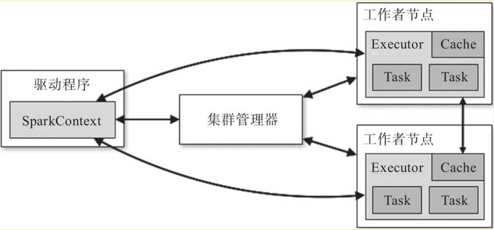

目前Spark推出了2.2版本，性能大幅度提升，并在数据流支持方面推出了很多新功能。

.. _使用官方镜像-7:

1.使用官方镜像
^^^^^^^^^^^^^^

用户可以使用sequenceiq/spark镜像，版本方面支持Hadoop 2.6.0、Apache Spark
v1.6.0（CentOS）。同时此镜像还包含Dockerfile，用户可以基于它构建自定义的Apache
Spark镜像。

可使用docker pull指令直接获取镜像：

--------------

::

   $ docker pull sequenceiq/spark:1.6.0
   1.6.0: Pulling from sequenceiq/spark
   ...
   9d406b080497: Pull complete
   Digest: sha256:64fbdd1a9ffb6076362359c3895d089afc65a533c0ef021ad4ae6da3f8b2a413
   Status: Downloaded newer image for sequenceiq/spark:1.6.0

也可以使用docker build指令构建spark镜像：

--------------

::

   $ docker build --rm -t sequenceiq/spark:1.6.0 .

--------------

另外，用户在运行容器时，需要映射YARN UI需要的端口：

--------------

.. code:: shell

   $ docker run -it -p 8088:8088 -p 8042:8042 -h sandbox sequenceiq/spark:1.6.0 bash
   /
   Starting sshd:                                             [  OK  ]
   Starting namenodes on [sandbox]
   sandbox: starting namenode, logging to /usr/local/hadoop/logs/hadoop-root-namenode-sandbox.out
   localhost: starting datanode, logging to /usr/local/hadoop/logs/hadoop-root-datanode-sandbox.out
   Starting secondary namenodes [0.0.0.0]
   0.0.0.0: starting secondarynamenode, logging to /usr/local/hadoop/logs/hadoop-root-secondarynamenode-sandbox.out
   starting yarn daemons
   starting resourcemanager, logging to /usr/local/hadoop/logs/yarn--resourcemanager-sandbox.out
   localhost: starting nodemanager, logging to /usr/local/hadoop/logs/yarn-root-nodemanager-sandbox.out
   bash-4.1#

--------------

启动后，可以使用bash命令行来查看namenode日志等信息：

.. code:: shell

   bash-4.1# cat /usr/local/hadoop/logs/hadoop-root-namenode-sandbox.out
   ulimit -a for user root
   core file size          (blocks, -c) 0
   data seg size           (kbytes, -d) unlimited
   scheduling priority             (-e) 0
   file size               (blocks, -f) unlimited
   pending signals                 (-i) 7758
   max locked memory       (kbytes, -l) 64
   max memory size         (kbytes, -m) unlimited
   open files                      (-n) 1048576
   pipe size            (512 bytes, -p) 8
   POSIX message queues     (bytes, -q) 819200
   real-time priority              (-r) 0
   stack size              (kbytes, -s) 8192
   cpu time               (seconds, -t) unlimited
   max user processes              (-u) unlimited
   virtual memory          (kbytes, -v) unlimited
   file locks                      (-x) unlimited

用户还可以使用daemon模式运行此Spark环境：

--------------

::

   $ docker run -d -h sandbox sequenceiq/spark:1.6.0 -d
   e2c26d1bb97439081ad1956faaed3346fcb6335ae774e1177021706dc5887e55

--------------

继续使用docker ps指令查看运行详情：

--------------

::

   $ docker ps -a
   CONTAINER ID IMAGE                   COMMAND                  
   e2c26d1bb974 sequenceiq/spark:1.6.0  "/etc/bootstrap.sh -d"   
   CREATED  STATUS      PORTS       
   x ago    Up x minute 22/tcp, 8030-8033/tcp, 8040/tcp, 8042/tcp, 8088/tcp, 49707/tcp, 50010/tcp, 50020/tcp, 50070/tcp, 50075/tcp, 50090/tcp

--------------

2.验证
^^^^^^

基于YARN部署Spark系统时，用户有两种部署方式可选：YARN客户端模式和YARN集群模式。下面将分别论述两种部署方式。

（1）YARN客户端模式

在YARN客户端模式中，SparkContext（或称为驱动程序）运行在客户端进程中，主（master）应用仅处理来自YARN的资源管理请求：

--------------

::

   # 运行 spark shell
   spark-shell \
   --master yarn-client \
   --driver-memory 1g \
   --executor-memory 1g \
   --executor-cores 1
   # 执行以下指令，若返回1000则符合预期
   scala> sc.parallelize(1 to 1000).count()

--------------

（2）YARN集群模式

在YARN集群模式中，Spark驱动程序运行于主应用的进程中，即由YARN从集群层面进行管理。下面，以Pi值计算为例子，展示两种模式的区别：

Pi计算（YARN集群模式）：

--------------

::

   # 执行以下指令，成功后，日志中会新增记录"Pi is roughly 3.1418" 
   # 集群模式下用户必须指定 --files 参数，以开启metrics
   spark-submit \
   --class org.apache.spark.examples.SparkPi \
   --files $SPARK_HOME/conf/metrics.properties \
   --master yarn-cluster \
   --driver-memory 1g \
   --executor-memory 1g \
   --executor-cores 1 \
   $SPARK_HOME/lib/spark-examples-1.6.0-hadoop2.6.0.jar

--------------

Pi计算（YARN客户端模式）：

--------------

::

   # 执行以下指令，成功后，命令行将显示"Pi is roughly 3.1418" 
   spark-submit \
   --class org.apache.spark.examples.SparkPi \
   --master yarn-client \
   --driver-memory 1g \
   --executor-memory 1g \
   --executor-cores 1 \
   $SPARK_HOME/lib/spark-examples-1.6.0-hadoop2.6.0.jar

--------------

（3）容器外访问Spark

如果用户需要从容器外访问Spark环境，则需要设置YARN_CONF_DIR环境变量。参见相关资源部分的Spark镜像仓库，即可见yarn-remote-client文件夹。此文件夹内置远程访问的配置信息：

--------------

::

   export YARN_CONF_DIR="`pwd`/yarn-remote-client"

--------------

用户只能使用根用户访问Docker的HDFS环境。当用户从容器集群外部使用非根用户访问Spark环境时，则需要配置HADOOP_USER_NAME环境变量：

--------------

::

   export HADOOP_USER_NAME=root

.. _相关资源-12:

3.相关资源
^^^^^^^^^^

Spark的相关资源如下：

::

   ·Spark官网：http://spark.apache.org/
   ·Spark官方仓库：https://github.com/apache/spark
   ·Spark 2.0更新点：http://spark.apache.org/releases/spark-release-2-0-0.html
   ·Spark镜像：https://hub.docker.com/r/sequenceiq/spark/
   ·Spark镜像仓库：https://github.com/sequenceiq/docker-spark

Storm
~~~~~

Apache Storm是一个实时流计算框架，由Twitter在2014年正式开源，遵循Eclipse
Public License 1.0，基于Clojure等语言实现。

.. image:: ../_static/docker_storm0001.png

Storm集群与Hadoop集群在工作方式上十分相似，唯一区别在于Hadoop上运行的是MapReduce任务，在Storm上运行的则是topology。MapReduce任务完成处理即会结束，而topology则永远在等待消息并处理（直到停止）。

Storm集群中有两种节点：主节点和工作节点，主节点运行一个叫“Nimbus”的守护进程（daemon），与Hadoop的“任务跟踪器”（Jobtracker）类似。Nimbus负责向集群中分发代码，向各机器分配任务，以及监测故障。工作节点运行“Supervisor”守护进程，负责监听Nimbus指派到机器的任务，根据指派信息来管理工作者进程（worker
process），每一个工作者进程执行一个topology的任务子集。

Nimbus和Supervisors之间的所有协调调度通过Zookeeper集群来完成。另外，Nimbus守护进程和Supervisor守护进程都是快速失败和无状态的，实现极高的稳定度。

1.使用Compose搭建Storm集群
^^^^^^^^^^^^^^^^^^^^^^^^^^

利用Docker Compose模板，用户可以在本地单机Docker环境快速地搭建一个Apache
Storm集群，进行应用开发测试。

（1）Storm示例架构

Storm示例架构如图

Storm示例架构

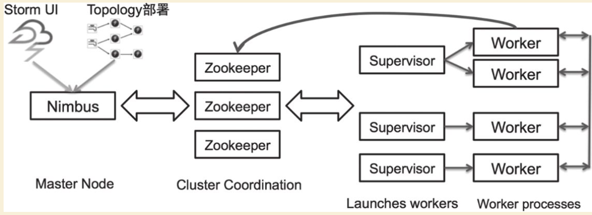

其中包含如下容器：

·zookeeper：Apache Zookeeper三节点部署；

·nimbus：Storm Nimbus；

·ui：Storm UI；

·supervisor：Storm Supervisor(一个或多个)；

·topology：Topology部署工具，其中示例应用基于官方示例storm-starter代码构建。

本节的Docker
Compose文件和示例应用等可以从\ https://github.com/denverdino/docker-storm
获得。

（2）本地开发测试

首先从Github下载需要的代码：

--------------

.. code:: shell

   $ git clone https://github.com/denverdino/docker-storm.git
   $ cd docker-swarm/local

--------------

代码库中的docker-compose.yml文件描述了典型的Storm应用架构：

--------------

.. code:: shell

   version: '2'
   services:
       zookeeper1:
           image: baqend/storm:3.4.8
           container_name: zk1.cloud
           environment:
               - SERVER_ID=1
               - ADDITIONAL_ZOOKEEPER_1=server.1=0.0.0.0:2888:3888
               - ADDITIONAL_ZOOKEEPER_2=server.2=zk2.cloud:2888:3888 
               - ADDITIONAL_ZOOKEEPER_3=server.3=zk3.cloud:2888:3888
       zookeeper2:
           image: baqend/storm:3.4.8
           container_name: zk2.cloud
           environment:
               - SERVER_ID=2
               - ADDITIONAL_ZOOKEEPER_1=server.1=zk1.cloud:2888:3888
               - ADDITIONAL_ZOOKEEPER_2=server.2=0.0.0.0:2888:3888 
               - ADDITIONAL_ZOOKEEPER_3=server.3=zk3.cloud:2888:3888
       zookeeper3:
           image: baqend/storm:3.4.8
           container_name: zk3.cloud
           environment:
               - SERVER_ID=3
               - ADDITIONAL_ZOOKEEPER_1=server.1=zk1.cloud:2888:3888
               - ADDITIONAL_ZOOKEEPER_2=server.2=zk2.cloud:2888:3888 
               - ADDITIONAL_ZOOKEEPER_3=server.3=0.0.0.0:2888:3888
       ui:
           image: baqend/storm:1.0.0
           command: ui -c nimbus.host=nimbus
           environment:
               - STORM_ZOOKEEPER_SERVERS=zk1.cloud,zk2.cloud,zk3.cloud
           restart: always
           container_name: ui
           ports:
               - 8080:8080
           depends_on:
               - nimbus
       nimbus:
           image: baqend/storm:1.0.0
           command: nimbus -c nimbus.host=nimbus
           restart: always
           environment:
               - STORM_ZOOKEEPER_SERVERS=zk1.cloud,zk2.cloud,zk3.cloud
           container_name: nimbus
           ports:
               - 6627:6627
       supervisor:
           image: baqend/storm:1.0.0
           command: supervisor -c nimbus.host=nimbus -c supervisor.slots.ports= [6700,6701,6702,6703]
           restart: always
           environment:
               - affinity:role!=supervisor
               - STORM_ZOOKEEPER_SERVERS=zk1.cloud,zk2.cloud,zk3.cloud
           depends_on:
               - nimbus
       topology:
           build: ../storm-starter
           command: -c nimbus.host=nimbus jar /topology.jar org.apache.storm.starter. RollingTopWords production-topology remote
           depends_on:
               - nimbus
   networks:
       default:
           external: 
               name: test-storm

--------------

用户可以直接运行下列命令构建测试镜像：

--------------

.. code:: shell

   $ docker-compose build  

--------------

现在可以用下面的命令来一键部署一个Storm应用：

--------------

.. code:: shell

   $ docker-compose up -d

--------------

部署完毕，检查Storm应用状态：

--------------

.. code:: shell

   $ docker-compose ps

当UI容器启动后，用户可以访问容器的8080端口来打开操作界面，如图

Storm UI

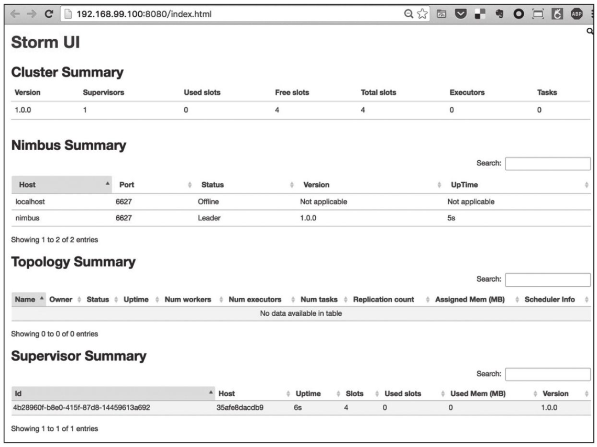

利用如下命令，可以伸缩supervisor的数量，比如伸缩到3个实例：

--------------

::

   $ docker-compose scale supervisor=3

--------------

用户也许会发现Web界面中并没有运行中的topology。这是因为Docker
Compose目前只能保证容器的启动顺序，无法确保所依赖容器中的应用是否已经完全启动并可以正常访问。

为了解决这个问题，用户需要运行下面的命令来再次启动“topolgoy”服务应用来提交更新的拓扑：

--------------

::

   $ docker-compose start topology

--------------

稍后刷新Storm UI，可以发现Storm应用已经部署成功了。

.. _相关资源-13:

2.相关资源
^^^^^^^^^^

Storm的相关资源如下：

::

   ·Storm官网：http://storm.apache.org/
   ·Storm镜像：https://hub.docker.com/r/baqend/storm/

Elasticsearch
~~~~~~~~~~~~~

Elasticsearch是基于Lucene的开源搜索服务（Java实现）。它是分布式、多租户的全文搜索引擎，支持RESTful
Web接口。Elasticse
arch支持实时分布式数据存储和分析查询功能，可以轻松扩展到上百台服务器，同时支持处理PB级结构化或非结构化数据。如果配合Logstash、Kibana等组件，可以快速构建一套日志消息分析平台。

.. _使用官方镜像-8:

1.使用官方镜像
^^^^^^^^^^^^^^

可以使用官方镜像，快速运行Elasticsearch容器：

--------------

.. code:: shell

   $ docker run -d elasticsearch
   937c1cb21b39a322ab6c5697e31af22a5329f08408d40f64e27465fed6597e34

--------------

也可以在启动时传入一些额外的配置参数：

--------------

.. code:: shell

   $ docker run -d elasticsearch elasticsearch -Des.node.name="TestNode"
   2c0ae96f73ca01779c60f7c6103481696c34c510266f5c503610a2640dc6f50a

--------------

目前使用的镜像内含默认配置文件，包含预先定义好的默认配置。如果要使用自定义配置，可以使用数据卷，挂载自定义配置文件至/usr/share/elasticsearch/config：

--------------

.. code:: shell

   $ docker run -d -v "$PWD/config":/usr/share/elasticsearch/config elasticsearch
   43333bfdbbfe156512ba9786577ca807c676f9a767353222c106453020ac7020

--------------

如果需要数据持久化，可以使用数据卷指令，挂载至/usr/share/elasticsearch/data：

--------------

.. code:: shell

   $ docker run -d -v "$PWD/esdata":/usr/share/elasticsearch/data elasticsearch
   3feddf6a8454534b209b32df06c2d65022d772a8f511593371218f6bd064e80e

--------------

此镜像会暴露9200和9300两个默认的HTTP端口，可以通过此端口进行服务访问。9200端口是对外提供服务的API使用的端口，9300端口是内部通信端口，这些通信包括心跳、集群内部信息同步。

如果通过docker stack
deploy或docker-compose使用Elasticsearch，则可以参考以下stack.yml：

--------------

.. code:: yaml

   version: '3.1'
   services:
       elasticsearch:
           image: elasticsearch
       kibana:
           image: kibana
           ports:
               - 5601:5601

--------------

运行docker stack deploy-c stack.yml elasticsearch或docker-compose-f
stack.yml
up，等待初始化完成后，直接访问\ `http://swarm-ip:5601 <http://swarm-ip:5601/>`__
、\ `http://localhost:5601 <http://localhost:5601/>`__
或\ `http://host-ip:5601 <http://host-ip:5601/>`__ 。

.. _相关资源-14:

2.相关资源
^^^^^^^^^^

Elasticsearch的相关资源如下：

::

   ·Elasticsearch官网：https://www.elastic.co/products/elasticsearch/

   ·Elasticsearch官方仓库：https://github.com/elastic/elasticsearch

   ·Elasticsearch官方镜像：https://hub.docker.com/_/elasticsearch/

   ·Elasticsearch官方镜像仓库：https://www.docker.elastic.co/

.. _本章小结-2:

本章小结
~~~~~~~~

本章介绍了分布式处理与大数据处理领域的典型热门工具，包括Hadoop、Spark、Storm和Elasticsearch等。这些开源项目的出现，极大地降低了开发者进行分布式处理和数据分析的门槛。

实际上，摩尔定律的失效，必将导致越来越多的复杂任务必须采用分布式架构进行处理。在新的架构和平台下，如何实现高性能、高可用性，如何让应用容易开发、方便调试都是十分复杂的问题。已有的开源平台项目提供了很好的实现参考，方便用户将更多的精力放到核心业务的维护上。通过基于容器的部署和使用，极大地简化了对复杂系统的使用和维护。

编程开发
--------

本章主要介绍如何使用Docker快速部署主流编程语言的开发、编译环境及其常用框架，包括C/C++、Java、Python、Javascript、Go等。通过本章学习，读者在今后采用编程语言开发和测试时，将再也不用花费大量时间进行环境配置了，只需要简单获取容器镜像，即可快速拥有相关的环境。

本章内容需要读者事先对相关语言的基础概念和工具栈有所了解，可自行查看语言相应的技术文档。

C/C++
~~~~~

C是一门古老的语言，在今天仍然是系统领域和高性能计算的主要选择，在1969年由贝尔实验室设计开发。C语言具有高效、灵活、功能丰富、表达力强和較高的可移植性等特点。C++在C的基础上，支持了数据的抽象与封装、面向对象和泛型编程。功能与性能的平衡使C++成为了目前应用最广泛的系统编程语言之一。

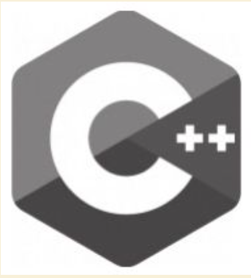

本节将介绍三款流行的C/C++开发工具：GCC、LLVM和Clang。

1.关于GCC
^^^^^^^^^

GCC（GNU Compiler
Collection）是一套由GNU开发的编程语言编译器，是一套以GPL及LGPL许可证所发行的自由软件，也是GNU计划的关键部分。GCC（特别是其中的C语言编译器）通常被认为是跨平台编译器的事实标准。GCC可处理C/C++，以及Fortran、Pascal、Objective-C、Java、Ada等多种语言。

.. _使用官方镜像-9:

（1）使用官方镜像
^^^^^^^^^^^^^^^^^

将C/C++代码运行在容器内的最简方法，就是将编译指令写入Dockerfile中，然后使用此Dockerfile构建自定义镜像，最后直接运行此镜像，即可启动程序。

如果对GCC版本有要求，可以在以上命令中加入镜像标签，并在下一步的Dockerfile的FROM指令中明确GCC版本号。然后，在Dockerfile中，加入需要执行的GCC编译命令：

.. code:: dockerfile

   FROM gcc:4.9
   COPY . /usr/src/myapp
   WORKDIR /usr/src/myapp
   RUN gcc -o myapp main.c
   CMD ["./myapp"]

编辑main.c，内容如下：

--------------

.. code:: cpp

   #include<stdio.h>
   int main()
   {
       printf("Hello World\n");
       return 0;
   }

--------------

现在，就可以使用Dockerfile来构建镜像my-gcc-app：

--------------

.. code:: shell

   $ docker build -t gcc-image .
   ……
   Successfully built 881d3fd0d574

用户可以使用docker images指令查看生成的镜像：

--------------

.. code:: shell

   $ docker images
   REPOSITORY  TAG     IMAGE ID      CREATED          VIRTUAL SIZE
   gcc-image   latest  881d3fd0d574  35 seconds ago   1.129 GB

--------------

创建并运行此容器，会编译并运行程序，输出Hello World语句：

--------------

.. code:: shell

   $ docker run -it --rm --name gcc-container gcc-image
   Hello World

--------------

如果只需要容器编译程序，而不需要运行它，可以使用如下命令：

--------------

.. code:: shell

   $ docker run --rm -v "$(pwd)":/usr/src/myapp -w /usr/src/myapp gcc gcc -o myapp main.c

--------------

以上命令会将当前目录（“$（pwd）”）挂载到容器的/usr/src/myapp目录，并执行gcc-o
myapp
myapp.c.。GCC将会编译myapp.c代码，并将生成的可执行文件输出至/usr/src/myapp文件夹。

如果项目已经编写好了Makefile，也可以在容器中直接执行make命令：

--------------

.. code:: shell

   $ docker run --rm -v "$(pwd)":/usr/src/myapp -w /usr/src/myapp gcc make`

（2）定制镜像
^^^^^^^^^^^^^

下面，笔者给出了基于buildpack-deps：wheezy镜像创建GCC镜像的Dockerfile供读者参考：

.. code:: shell

   # https://registry.hub.docker.com/u/snormore/llvm/dockerfile/
   FROM buildpack-deps:wheezy
   # https://gcc.gnu.org/mirrors.html
   RUN gpg --keyserver pgp.mit.edu --recv-key \
       B215C1633BCA0477615F1B35A5B3A004745C015A \
       B3C42148A44E6983B3E4CC0793FA9B1AB75C61B8 \
       90AA470469D3965A87A5DCB494D03953902C9419 \
       80F98B2E0DAB6C8281BDF541A7C8C3B2F71EDF1C \
       7F74F97C103468EE5D750B583AB00996FC26A641 \
       33C235A34C46AA3FFB293709A328C3A2C3C45C06
   ENV GCC_VERSION 4.9.1
   # 下载需要的 tar 格式源码并解压安装
   RUN apt-get update \
       && apt-get install -y curl flex wget \
       && rm -r /var/lib/apt/lists/* \
       && curl -SL "http://ftpmirror.gnu.org/gcc/gcc-$GCC_VERSION/gcc-$GCC_VERSION.tar.bz2" -o gcc.tar.bz2 \
       && curl -SL "http://ftpmirror.gnu.org/gcc/gcc-$GCC_VERSION/gcc-$GCC_VERSION.tar.bz2.sig" -o gcc.tar.bz2.sig \
       && gpg --verify gcc.tar.bz2.sig \
       && mkdir -p /usr/src/gcc \
       && tar -xvf gcc.tar.bz2 -C /usr/src/gcc --strip-components=1 \
       && rm gcc.tar.bz2* \
       && cd /usr/src/gcc \
       && ./contrib/download_prerequisites \
       && { rm *.tar.* || true; } \
       && dir="$(mktemp -d)" \
       && cd "$dir" \
       && /usr/src/gcc/configure \
           --disable-multilib \
           --enable-languages=c,c++ \
       && make -j"$(nproc)" \
       && make install-strip \
       && cd .. \
       && rm -rf "$dir" \
       && apt-get purge -y --auto-remove curl gcc g++ wget

2.LLVM
^^^^^^

LLVM（Low Level Virtual
Machine）是美国伊利诺伊大学的一个研究项目，试图提供一个现代化的、基于SSA的编译策略，同时支持静态和动态编程语言。和之前为大家所熟知的JVM以及.net
Runtime这样的虚拟机不同，这个虚拟系统提供了一套中立的中间代码和编译基础设施，并围绕这些设施提供了一套全新的编译策略（使得优化能够在编译、连接、运行环境执行过程中，以及安装之后以有效的方式进行）和其他一些非常有意思的功能。

LLVM包括若干重要的子项目，其中Clang将在后面讲解。

DockerHub中已经有用户提供了LLVM镜像，读者可以直接下载使用，不再赘述：

--------------

.. code:: shell

   $ docker pull imiell/llvm

--------------

还可以基于前面提到的SSHD基础镜像来定制GCC镜像，构建后直接运行。也可以使用Docker
Hub中提供的第三方Dockerfile，定制或修改后构建镜像，然后运行容器即可。

3.Clang
^^^^^^^

Clang是一个由Apple公司用C++实现、基于LLVM的C/C++/Objective-C/Objective-C++编译器，其目标就是超越GCC成为标准的C/C++编译器，它遵循LLVM
BSD许可。Clang很好地兼容了GCC。

Clang特性包括：

·快：在OS X上的测试中，Clang比GCC 4.0快2.5倍；

·内存占用小：Clang内存占用一般比GCC要小的多；

·诊断信息可读性强：Clang对于错误的语法不但有源码提示，还会在错误的调用和相关上下文上有更好的提示；

·基于库的模块化设计：Clang将编译过程分成彼此分离的几个阶段，将大大增强IDE对于代码的操控能力。

在DockerHub中已经有用户提供了Clang的镜像，读者可以直接下载使用：

--------------

.. code:: shell

   $ docker pull bowery/clang

--------------

还可以基于SSHD镜像自定义Dockerfile。也可以使用DockerHub中的第三方镜像构建Clang容器。这里以ubuntu：bionic系统为例，给出了示例Dockerfile文件：

--------------

.. code:: shell

   # https://registry.hub.docker.com/u/rsmmr/clang/dockerfile
   FROM ubuntu:bionic
   # 设置环境变量
   ENV PATH /opt/llvm/bin:$PATH
   # 确定默认的启动命令
   CMD bash
   # 安装依赖包Setup packages.
   RUN apt-get update && apt-get -y install cmake git build-essential vim python
   # 将 install-clang 拷贝至本目录
   ADD . /opt/install-clang
   # 编译和安装 LLVM/clang
   RUN /opt/install-clang/install-clang -j 4 -C /opt/llvm

.. _相关资源-15:

4.相关资源
^^^^^^^^^^

GCC和LLVM的相关资源如下：

::

   ·官网：https://gcc.gnu.org/
   ·GCC官方镜像：https://hub.docker.com/_/gcc/
   ·GCC官方镜像仓库：https://github.com/docker-library/gcc
   ·LLVM官网：http://llvm.org/

Java
~~~~

Java是一种跨平台、面向对象、泛型编程的编译型语言，广泛应用于企业级应用开发和移动应用开发领域，由SUN公司在1995年推出。Java是基于类的面向对象的高级语言，其设计理念是尽可能地减少部署依赖，致力于允许Java应用的开发者“开发一次，到处运行”。这就意味着Java的二进制编码不需要再次编译，即可运行在异构的JVM上。Java在大型互联网项目，特别是互联网金融和电子商务项目中非常受欢迎。OpenJDK（Open
Java Development Kit）是免费开源的Java平台，支持Java SE（Standard
Edition）。从Java 7开始，OpenJDK就是官方的Java SE环境。

.. _使用官方镜像-10:

1.使用官方镜像
^^^^^^^^^^^^^^

在容器中运行Java代码最简单的方法就是将Java编译指令直接写入Dockerfile，然后使用此Dockerfile构建并运行此镜像，即可启动程序。具体步骤如下。

首先，从官方仓库获取某版本Java基础镜像

::

   $ docker pull java:7

然后，在本地新建一个空目录，在其中创建Dockerfile文件。在Dockerfile中，加入需要执行的Java编译命令，例如：

--------------

.. code:: yaml

   FROM openjdk:7
   COPY . /usr/src/javaapp
   WORKDIR /usr/src/javaapp
   RUN javac HelloWorld.java
   CMD ["java", "HelloWorld"]

--------------

如果我们希望使用最新的Java 10，可以修改基础镜像为FROM
openjdk：10。下面我们继续使用此Dockerfile构建镜像java-image：

--------------

::

   $ docker build -t java-image .
   ……
   Successfully built 406d480c8fde

--------------

可以通过docker images指令查看生成的镜像：

--------------

.. code:: shell

   $ docker images
   REPOSITORY TAG IMAGE ID CREATED VIRTUAL SIZE
   java-image latest 406d480c8fde 56 seconds ago 587.7 MB

--------------

然后，运行此镜像即自动编译程序并执行：

--------------

.. code:: shell

   $ docker run -it --rm --name java-container java-image
   Hello, World

--------------

如果只需要容器中编译Java程序，而不需要运行，则可以使用如下命令：

--------------

.. code:: shell

   $ docker run --rm -v "$(pwd)":/usr/src/javaapp -w /usr/src/javaapp java:7 javac HelloWorld.java

--------------

以上命令会将当前目录（“$（pwd）”）挂载为容器的工作目录，并执行javac
Hello
World.java命令编译HelloWorld.java代码，然后生成的HelloWorld.class类文件至当前目录下：

--------------

.. code:: shell

   $ ls -la
   total 24
   drwxr-xr-x  5 faxi  staff  170 Feb  2 12:35 .
   drwxr-xr-x  3 faxi  staff  102 Feb  2 11:52 ..
   -rw-r--r--  1 faxi  staff  114 Feb  2 12:01 Dockerfile
   -rw-r--r--  1 faxi  staff  426 Feb  2 12:29 HelloWorld.class
   -rw-r--r--  1 faxi  staff  182 Feb  2 11:59 HelloWorld.java

使用Docker搭建Java开发环境

Dockerfile

.. code:: yaml

   # 基于Java 9
   FROM java:openjdk-8

   # 设置工作目录
   WORKDIR /app

   # 复制文件到工作目录
   COPY . /app

   # 设置Java环境变量
   ENV PATH=$PATH:$JAVA_HOME/bin
   ENV JRE_HOME=${JAVA_HOME}/jre
   ENV CLASSPATH=.:${JAVA_HOME}/lib:${JRE_HOME}/lib

   # 编译
   RUN ["/usr/lib/jvm/java-8-openjdk-amd64/bin/javac","Hello.java"]

   # 运行
   ENTRYPOINT ["/usr/lib/jvm/java-8-openjdk-amd64/bin/java", "Hello"]

Hello.java

.. code:: java

   //引入命名空间
   import java.util.*;
   //类
   public class Hello{
       //程序入口
       public static void main(String[] args){
           //打印字符串（控制台）
           System.out.println("Hello World!");
           //打印当前时间
           System.out.println(new Date());

       }
   }

构建Docker镜像

.. code:: shell

   [root@docker java]# docker build -t java-hello:latest . --rm -f "Dockerfile"

运行镜像

.. code:: shell

   [root@docker java]# docker run java-hello:latest

Docker
Linux容器使用Linux内核的CGroup机制来实现限制容器的资源使用。CGroup（Control
Groups）是Linux内核提供的一种可以限制、记录、隔离进程组所使用的物理资源（如CPU、MEMORY、磁盘I/O等）的机制，被LXC、Docker等很多项目用于实现进程资源控制。

资源限制

.. code:: shell

   [root@docker java]# docker run java-hello:latest --cpu 4 --memory 100m

2.关于Spring Boot
^^^^^^^^^^^^^^^^^

Spring
Boot是由Pivotal团队开发的框架，其设计目的是用来简化新Spring应用的初始搭建以及开发过程。该框架使用了特定的方式进行配置，从而使开发人员不再需要定义样板化的配置。Spring
Boot致力于在蓬勃发展的快速应用开发领域成为领导者。

Spring
Boot项目旨在简化创建产品级的Spring应用和服务，通过它来选择不同的Spring平台。可创建独立的Java应用和Web应用，同时提供了命令行工具来支持spring
scripts。

下图显示Spring Boot在Spring生态中的位置。

Spring生态

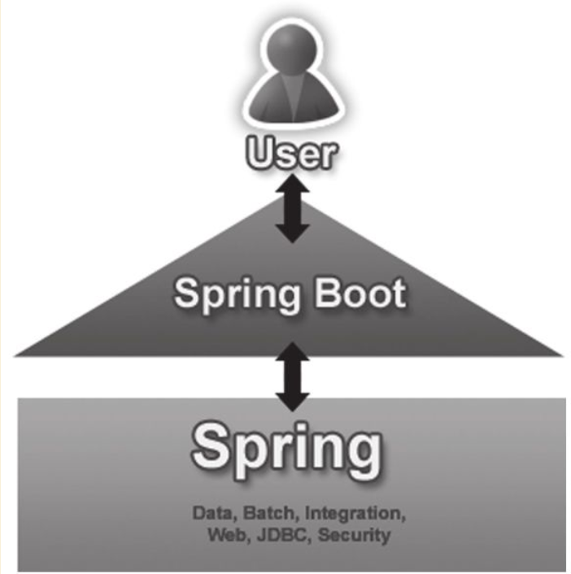

Spring Boot特性包括：

·创建独立Spring应用；

·内嵌Tomcat，Jetty或Undertow（无须部署WAR文件）；

·提供starter POM，简化Maven配置；

·尽可能地实现Spring项目配置自动化；

·提供工业级特性，如metrics，健康检查等；

·不生成代码，不需要XML配置。

下面介绍如何使用compose来搭建Spring
Boot应用，环境要求是JDK1.8或以上版本，Maven3.0或以上版本。

第一步 ，创建一个Spring Boot应用。

首先，下载并解压Spring Boot应用模板代码：

--------------

.. code:: shell

   git clone https://github.com/spring-guides/gs-spring-boot-docker.git'
   'cd gs-spring-boot-docker

--------------

然后，编辑代码文件src/main/java/hello/Application.java，内容如下：

--------------

.. code:: shell

   package hello;
   import org.springframework.boot.SpringApplication;
   import org.springframework.boot.autoconfigure.SpringBootApplication;
   import org.springframework.boot.bind.RelaxedPropertyResolver;
   import org.springframework.web.bind.annotation.RequestMapping;
   import org.springframework.web.bind.annotation.RestController;
   @SpringBootApplication
   @RestController
   public class Application {
       @RequestMapping("/")
       public String home() {
           return "Hello Docker World";
       }
       public static void main(String[] args) {
           SpringApplication.run(Application.class, args);
       }
   }

--------------

@SpringBootApplication和@RestController注解表示Java类Application已经准备好被spring
MVC所调用，并提供HTTP服务。注解@RequestMapping（“/”）表示context
path“/”的请求路由到方法home中进行处理，main方法中的SpringApplication.run（）用来启动一个Spring
Boot应用。

第二步 ，容器化Spring Boot应用。

首先，新建src/main/docker/Dockerfile，内容如下：

--------------

.. code:: shell

   FROM java:8
   VOLUME /tmp
   ADD gs-spring-boot-docker-0.1.0.jar app.jar
   RUN bash -c 'touch /app.jar'
   ENTRYPOINT ["java","-Djava.security.egd=file:/dev/./urandom","-jar","/app.jar"]

--------------

然后，使用docker-maven-plugin构建镜像，pom.xml文件内容如下：

--------------

.. code:: shell

   <properties>
         <docker.image.prefix>registry.aliyuncs.com/linhuatest</docker.image.prefix>
   </properties>
   <build>
       <plugins>
           <plugin>
               <groupId>com.spotify</groupId>
               <artifactId>docker-maven-plugin</artifactId>
               <version>0.2.3</version>
               <configuration>
                   <imageName>${docker.image.prefix}/${project.artifactId}</imageName>
                   <dockerDirectory>src/main/docker</dockerDirectory>
                   <resources>
                       <resource>
                           <targetPath>/</targetPath>
                           <directory>${project.build.directory}</directory>
                           <include>${project.build.finalName}.jar</include>
                       </resource>
                   </resources>
               </configuration>
           </plugin>
       </plugins>
   </build>

--------------

pom.xml中指定了以下属性：

·镜像的名称，此处为registry.aliyuncs.com/linhuatest/gs-spring-boot-docker其中registry.aliyuncs.com是阿里云镜像仓库的域名，linhuatest是用户的命名空间，gs-spring-boot-docker是用户某个仓库的名称，此处没有镜像tag，默认为latest；

·Dockerfile文件所在的目录，该目录可以理解为Dockerfile的context，保存Dockerfile依赖的资源；

·将何种资源拷贝到Dockerfile文件所在的目录，即context中，此处用户只需要编译出来的jar文件。

最后，可以构建和推送镜像到任何一个镜像仓库，如下所示：

--------------

.. code:: shell

   $ mvn package docker:build # 此处必须要有docker 客户端连接到docker daemon 方能构建
   $ docker push springio/gs-spring-boot-docker

.. _相关资源-16:

3.相关资源
^^^^^^^^^^

Java和Spring Boot的相关资源如下：

::

   ·Java官方镜像：https://registry.hub.docker.com/_/java/
   ·Java官方镜像标签：https://registry.hub.docker.com/_/java/tags/manage/
   ·Spring Boot官网：http://projects.spring.io/spring-boot/

Python
~~~~~~

Python是一种解释型动态语言，是功能强大的面向对象语言，集成了模块（modules）、异常处理（exceptions）、动态类型（dynamic
typing）、高级数据结构（元组、列表、序列）、类（classes）等高级特性。Python设计精良，语法简约，表达能力很强。目前，所有主流操作系统（Windows、Linux、类Unix系统）都支持Python。

.. image:: ../_static/docker_python000001.png

下面我们看下如何使用Docker部署Python环境，以及部署Python技术栈中的主流框架。

使用Python官方镜像
^^^^^^^^^^^^^^^^^^

首先推荐用户使用Docker官方提供的Python镜像作为基础镜像，主要步骤如下。

第一步，新建项目目录py-official，进入此目录，然后使用docker
pull命令拉取官方镜像：

--------------

.. code:: shell

   $ docker pull python

--------------

接下来，在项目中新建一个Dockerfile文件，内容如下：

--------------

.. code:: shell

   FROM python:3

   WORKDIR /usr/src/app

   COPY requirements.txt ./
   RUN pip install --no-cache-dir -r requirements.txt

   COPY . .

   CMD [ "python", "./your-daemon-or-script.py" ]

--------------

新建\ ``your-daemon-or-script.py``\ 文件，计算Fibonacci数列：

--------------

.. code:: shell

   def fib(n):
       a, b = 0, 1
       while a < n:
           print(a, end=' ')
           a, b = b, a+b
       print()
   fib(1000)

--------------

新建requirements.txt依赖文件，读者可以在此文件中加入项目依赖程序，如Django等。此处仅新建空文件：

--------------

.. code:: shell

   $ touch requirements.txt
   $ cat requirements.txt 
   flask

--------------

第二步，使用docker build命令构建名为py2.7-sample-app的镜像：

--------------

.. code:: shell

   $ docker build -t my-python-app .
   Sending build context to Docker daemon  4.096kB
   Step 1/6 : FROM python:3
   3: Pulling from library/python
   Digest: sha256:ad7fb5bb4770e08bf10a895ef64a300b288696a1557a6d02c8b6fba98984b86a
   Status: Downloaded newer image for python:3
    ---> 4f7cd4269fa9
   Step 2/6 : WORKDIR /usr/src/app
    ---> Running in d0ace5d37598
   Removing intermediate container d0ace5d37598
    ---> 2dcdb2d50d17
   Step 3/6 : COPY requirements.txt ./
    ---> 8a32641bd95a
   Step 4/6 : RUN pip install --no-cache-dir -r requirements.txt
    ---> Running in d771acccb728
   Collecting flask
     Downloading Flask-1.1.2-py2.py3-none-any.whl (94 kB)
   Collecting itsdangerous>=0.24
   Removing intermediate container 5b38a07152b7
    ---> 6dd5fea5db98
   Successfully built 6dd5fea5db98
   Successfully tagged my-python-app:latest

--------------

可见至此用户已经成功构建了镜像，用户可以通过docker images命令进行查看：

--------------

.. code:: shell

   $ docker images
   REPOSITORY       TAG            IMAGE ID         CREATED            VIRTUAL SIZE
   py3-image        latest         23edbf58654a     12 seconds ago    693.1 MB

--------------

第三步，通过docker[container]run命令创建并运行容器：

--------------

.. code:: shell

   $ docker run -it --rm --name my-running-app my-python-app
   0 1 1 2 3 5 8 13 21 34 55 89 144 233 377 610 987 

--------------

如果读者只需要运行单个Python脚本，那么无须使用Dockerfile构建自定义镜像，而是通过以下命令直接使用官方Python镜像，带参数运行容器：

--------------

.. code:: shell

   docker run -it --rm --name my-running-script -v "$(pwd)":/usr/src/myapp -w /usr/src/myapp python:3 python your-daemon-or-script.py

--------------

如果读者希望深入了解Python的官方镜像，包括镜像的原始Dockerfile、ONBUILD指令的具体执行内容等，\ ``可以参考Github上的docker-library/official-images仓库。``

使用PyPy
^^^^^^^^

PyPy是一个Python实现的Python解释器和即时编译（JIT）工具，它专注于速度、效率，与CPython完全兼容。PyPy通过JIT技术可以使得Python运行速度提高近十倍，同时保证兼容性。下面介绍如何使用官方镜像。

首先，设置项目目录，并新建hi.py实例程序：

--------------

::

   for animal in ["dog", "cat", "mouse"]:
       print "%s is a mammal" % animal

--------------

然后，在根目录新建Dockerfile，基于pypy3的onbuild版本镜像如下：

--------------

::

   FROM pypy:3-onbuild
   CMD [ "pypy3", "./hi.py" ]

--------------

如果用户需要使用pypy2，则可以使用：FROM pypy：2-onbuild。

onbuild版本的镜像内含若干onbuild触发器，它们可以在镜像构建期间完成一些必要的初始化操作，便于项目的直接运行。pypy的onbuild镜像会拷贝一个requirements.txt依赖文件，运行RUN
pip install安装依赖程序，然后将当前目录拷贝至/usr/src/app。

下面，开始构建和运行此镜像：

--------------

::

   $ docker build -t my-python-app .
   $ docker run -it --rm --name my-running-app my-python-app

--------------

如果用户只需要运行单个pypy脚本，并希望避免新建Dockerfile，那么可以直接使用如下指令：

--------------

::

   $ docker run -it --rm --name my-running-script -v "$PWD":/usr/src/myapp -w /usr/src/myapp pypy:3 pypy3 your-daemon-or-script.py

--------------

如果需要使用pypy2运行，则可以使用如下指令：

--------------

::

   $ docker run -it --rm --name my-running-script -v "$PWD":/usr/src/myapp -w /usr/src/myapp pypy:2 pypy your-daemon-or-script.py

使用Flask
^^^^^^^^^

Flask是一个使用Python编写的轻量级Web应用框架。基于Werkzeug
WSGI工具箱和Jinja2模板引擎，Flask使用BSD授权。Flask也被称为“microframework”，因为它仅仅使用简单的核心，使用extension来增加其他功能。

Flask的特色如下：

·内置开发用服务器和debugger；

·集成单元测试（unit testing）；

·RESTful request dispatching；

·使用Jinja2模板引擎；

·支持secure cookies（client side sessions）；

·100%WSGI 1.0兼容；

·基于Unicode

·详细的文件、教学；

·Google App Engine兼容；

·可用Extensions增加其他功能。

Flask是目前广受欢迎的常用Python Web方案之一。

.. _使用dockerhub镜像-2:

1.使用Dockerhub镜像
'''''''''''''''''''

第一步，项目准备工作：构建Flask App目录：

--------------

.. code:: shell

   $ tree
   .
   └── src
       ├── app
       │   ├── __init__.py
       │   ├── __init__.pyc
       │   ├── static
       │   ├── templates
       │   ├── views.py
       │   └── views.pyc
       └── run.py

--------------

run.py内容如下：

--------------

.. code:: python

   #!flask/bin/python
   from app import app

   @app.route("/")
   def hello():
       return "Hello World! Yes I do  Yeey"

   @app.route("/hujianli")
   def index():
       return "This is index! ......"

   if __name__ == '__main__':
       app.run(host='0.0.0.0', port=5000, debug=True)

--------------

\_init.py内容如下：

--------------

.. code:: python

   from flask import Flask
   app = Flask(__name__)
   from app import views

--------------

第二步，获取Docker Hub的Flask镜像：

--------------

.. code:: shell

   $ docker pull verdverm/flask

--------------

第三步，创建并运行Flask容器（Flask的App代码作为Docker数据卷）：

--------------

.. code:: shell

   $ docker run -d --name flask-app \
       -v /path/to/app/src:/src \
       -p 5000:5000 \
       verdverm/flask

--------------

2.使用Compose构建Flask+MongoDB服务
''''''''''''''''''''''''''''''''''

MongoDB是一个基于分布式文件存储的数据库，旨在为Web应用提供可扩展的高性能数据存储解决方案。MongoDB是一个介于关系数据库和非关系数据库之间的产品，是非关系数据库当中功能最丰富，最像关系数据库的。Flask与MongoDB结合使用，是一种简单高效的Web服务架构，可以以较高的性能支撑图片服务等各种常见Web服务。

第一步，新建mongo-flask项目文件夹，并新建flask框架的核心文件app.py，内容如下：

--------------

::

   import os
   from flask import Flask, redirect, url_for, request, render_template
   from pymongo import MongoClient
   app = Flask(__name__)
   client = MongoClient(
           os.environ['DB_PORT_27017_TCP_ADDR'],
           27017)
   db = client.tododb
   @app.route('/')
   def todo():
       _items = db.tododb.find()
       items = [item for item in _items]
       return render_template('index.html', items=items)
   @app.route('/new', methods=['POST'])
   def new():
       item_doc = {
           'name': request.form['name'],
           'description': request.form['description']
       }
       db.tododb.insert_one(item_doc)
       return redirect(url_for('todo'))
   if __name__ == "__main__":
       app.run(host='0.0.0.0', port=80, debug=True)

--------------

新建templates文件夹，放置Flask框架的前端模版文件index.html，内容如下：

--------------

::

   <form action="/new" method="POST">
       <input type="text" name="name"></input>
       <input type="text" name="description"></input>
       <input type="submit"></input>
   </form>
   
   <h1> {{ item.name }} </h1>
   
 {{ item.description }} 

   

--------------

回到项目根目录，新建requirements.txt文件，内容如下：

--------------

::

   flask
   pymongo

--------------

新建Dockerfile文件，内容如下：

--------------

.. code:: yaml

   #基础镜像
   FROM python:2.7 
   ADD . /webdir
   #确定工作目录
   WORKDIR /webdir 
   #安装依赖程序
   RUN pip install -r requirements.txt 
   #暴露80端口
   EXPOSE 80 
   #确定`flask`运行指令
   ENTRYPOINT ["python", "-u", "/webdir/app.py"] 

--------------

新建docker-compose.yml文件，内容如下：

.. code:: shell

   $ cat docker-compose.yml 
   web:
       build: .
       ports:
           - "80"
       links:
           - db
   db:
       image: registry.aliyuncs.com/wangbs/mongodb
       ports:
           - "27017"

镜像已经上传到阿里云，可直接使用的docker-compose.yml文件如下：

--------------

.. code:: yaml

   web:
       image: registry.aliyuncs.com/wangbs/mongo-flask:master
       ports:
           - "80"
       links:
           - db
   db:
       image: registry.aliyuncs.com/wangbs/mongodb
       ports:
           - "27017"

.. _相关资源-17:

相关资源
^^^^^^^^

Python的相关资源如下：

::

   ·Python官网：https://www.python.org/
   ·PyPy官网：http://pypy.org/
   ·Flask官网：http://flask.pocoo.org/
   ·uwsgi官方仓库：https://github.com/unbit/uwsgi

JavaScript
~~~~~~~~~~

JavaScript是目前所有主流浏览器上唯一支持的脚本语言，这也是早期JavaScript的唯一用途。Node.js自2009年发布，使用Google
Chrome浏览器的V8引擎。Node.js的出现，让服务端应用也可以基于JavaScript进行编写，它采用事件驱动，性能优异，同时还提供了很多系统级API，如文件操作，Socket、HTTP网络编程等，支持主流操作系统。Node.js应用通过非驻塞IO和异步事件将系统吞吐能力和效率最大化。

下面，笔者将简述如何使用Docker搭建和使用Node.js环境。

使用Node.js
^^^^^^^^^^^

在Node环境中，用户可以快速运行一个Node.js的简单应用。

首先，创建一个helloworld.js文件：

--------------

::

   console.log("Hello World");

--------------

然后通过node指令执行即可启动Node.js的hello world：

--------------

::

   $ node helloworld.js

--------------

1.使用DockerHub镜像

Node.js拥有3种官方镜像：node：、node：onbuild、node：slim。其中常用的是带有版本标签的，以及带有onbuild标签的node镜像。

首先，在Node.js项目中新建一个Dockerfile：

--------------

::

   FROM node:4-onbuild
   EXPOSE 8888

--------------

然后，新建server.js文件，内容如下：

--------------

::

   'use strict';
   var connect = require('connect');
   var serveStatic = require('serve-static');
   var app = connect();
   app.use('/', serveStatic('.', {'index': ['index.html']}));
   app.listen(8080);
   console.log('MyApp is ready at http://localhost:8080');

--------------

之后，通过npm init命令来新建node项目必须的package.json文件：

--------------

::

   $ npm init
   This utility will walk you through creating a package.json file.
   It only covers the most common items, and tries to guess sensible defaults.
   See 'npm help json' for definitive documentation on these fields
   and exactly what they do.
   Use 'npm install <pkg> --save' afterwards to install a package and
   save it as a dependency in the package.json file.
   Press ^C at any time to quit.
   name: (node) node
   version: (1.0.0) 
   description: node-sample
   entry point: (index.js) 
   test command: 
   git repository: 
   keywords: 
   author: 
   license: (ISC) 
   About to write to /Users/faxi/Docker/js/node/package.json:
   {
       "name": "node",
       "version": "1.0.0",
       "description": "node-sample",
       "main": "index.js",
       "scripts": {
           "test": "echo \"Error: no test specified\" && exit 1"
       },
       "author": "",
       "license": "ISC"
   }
   Is this ok? (yes) yes

--------------

下面使用docker build指令构建node镜像：

--------------

::

   $ docker build -t node-image .
   …
   Successfully built f698a32b5d9b

--------------

用户可以通过docker images指令查看已创建的node镜像：

--------------

::

   $ docker images
   REPOSITORY        TAG        IMAGE ID          CREATED              VIRTUAL SIZE
   node-image        latest     f698a32b5d9b      29 seconds ago       642.7 MB

--------------

最后，创建并运行node容器：

--------------

::

   $ docker run -it -P node-image
   MyApp is ready at http://localhost:8080

--------------

此时可以使用浏览器查看到MyApp应用的服务页面，如图14-2所示。

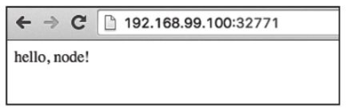

图14-2　Node.js容器启动页面

首先，使用docker ps指令查看端口绑定情况：

--------------

::

   $ docker ps
   CONTAINER ID  IMAGE      COMMAND     CREATED   STATUS PORTS                   NAMES
   7b6f666d4808  node-image "npm start" xxxago    Up xx  0.0.0.0:32771->8888/tcp node-container

--------------

也可以使用curl指令访问：

--------------

::

   $ curl http://192.168.99.100:32771/
   hello, node!

--------------

如果出现无法访问等问题，可以使用entrypoint参数进入容器进行操作：

--------------

::

   $ docker run --entrypoint bash -it node-image
   root@3d845d373a04:/usr/src/app# ls
   Dockerfile  index.html    node_modules  package.json  server.js

--------------

如果需要netstat等网络工具，可以在容器内使用以下指令进行安装：

--------------

::

   # apt-get update && apt-get install net-tools

--------------

如果需要查看容器日志，可以使用docker log指令：

--------------

::

   $ docker logs <container id>

--------------

如果用户只需要运行单个node脚本的容器，则无须通过Dockerfile构建镜像，用户可以使用以下指令：

--------------

.. code:: shell

   $ docker run -it --rm --name my-running-script -v "$(pwd)":/usr/src/myapp -w /usr/src/myapp node:0.10 node your-daemon-or-script.js

--------------

读者也可以参考node官方提供的最佳实践：\ https://github.com/nodejs/docker-node/blob/master/docs/BestPractices.md
。

2.使用alpine精简版node镜像

随着Docker官方提供基于alpine精简系统的各类镜像，这种平均大小只有10MB的镜像可以方便地应用于各种开发测试或生产环境中。

首先，新建项目目录并新建Dockerfile：

--------------

::

   FROM alpine:3.3
   # ENV VERSION=v0.10.44 CFLAGS="-D__USE_MISC" NPM_VERSION=2
   # ENV VERSION=v0.12.13 NPM_VERSION=2
   ENV VERSION=v4.4.4 NPM_VERSION=2
   # ENV VERSION=v5.11.1 NPM_VERSION=3
   # ENV VERSION=v6.1.0 NPM_VERSION=3
   # For base builds
   # ENV CONFIG_FLAGS="--without-npm" RM_DIRS=/usr/include
   ENV CONFIG_FLAGS="--fully-static --without-npm" DEL_PKGS="libgcc libstdc++" RM_DIRS=/usr/include
   RUN apk add --no-cache curl make gcc g++ binutils-gold python linux-headers paxctl libgcc libstdc++ gnupg && \
       gpg --keyserver pool.sks-keyservers.net --recv-keys 9554F04D7259F04124DE6B476D5A82AC7E37093B && \
       ...
       curl -o node-${VERSION}.tar.gz -sSL https://nodejs.org/dist/${VERSION}/node-${VERSION}.tar.gz && \
       curl -o SHASUMS256.txt.asc -sSL https://nodejs.org/dist/${VERSION}/SHASUMS256.txt.asc && \
       gpg --verify SHASUMS256.txt.asc && \
       grep node-${VERSION}.tar.gz SHASUMS256.txt.asc | sha256sum -c - && \
       tar -zxf node-${VERSION}.tar.gz && \
       cd /node-${VERSION} && \
       ./configure --prefix=/usr ${CONFIG_FLAGS} && \
       make -j$(grep -c ^processor /proc/cpuinfo 2>/dev/null || 1) && \
       make install && \
   ...

--------------

然后，用户使用docker build指令构建镜像：

--------------

::

   $ docker build -t apline-node .
   ...
   Successfully built 881d3fd0d574

--------------

最后，通过docker[container]run指令运行：

--------------

::

   $ docker run alpine-node node --version
   v6.1.0
   $ docker run alpine-node npm --version
   3.8.8

.. _相关资源-18:

相关资源
^^^^^^^^

JavaScript和Node.js相关资源如下：

::

   ·JavaScript入门：http://www.w3schools.com/js/
   ·Node.js官网：http://www.nodejs.org/
   ·Node.js官方镜像：https://registry.hub.docker.com/_/node/
   ·Node.js官方镜像标签：https://registry.hub.docker.com/_/node/tags/manage/

Go
~~

Go语言（也称Golang）是一个由Google主导研发的编程语言，于2009年推出。它的语法清晰明了，设计精良，拥有一些先进的特性，还有一个庞大的标准库。Go的基本设计理念是：编译效率、运行效率和开发效率要三者兼顾。使用Go开发，一方面有很多灵活的语法支持，另一方面可以媲美C/C++的运行和编译效率。此外，Go提供了轻量级的协程，支持大规模并发的场景。

.. _使用官方镜像-11:

1.使用官方镜像
^^^^^^^^^^^^^^

运行Go语言环境的最简方法是使用官方Golang镜像。用户可以使用docker
run指令直接启动Go语言的交互环境：

--------------

.. code:: shell

   $ docker run -it golang /bin/bash
   root@79afc2b64b06:/go# go versiongo version go1.7 linux/amd64

--------------

用户还可以将Go编译指令写入Dockerfile中，基于此Dockerfile构建自定义镜像。具体步骤如下。

第一步，新建项目文件夹，并在根目录新建Dockerfile：

FROM golang：1.6-onbuild#显示声明基础镜像版本，利于后期维护。

onbuild版本Dockerfile的具体内容如下：

--------------

::

   FROM golang:1.6
   RUN mkdir -p /go/src/app
   WORKDIR /go/src/app
   # 通过 'go-wrapper' 程序执行当前目录下的主函数ONBUILD 
   CMD ["go-wrapper", "run"] 
   # 拷贝当前项目代码至运行目录ONBUILD
   COPY . /go/src/app 
   # 下载依赖，具体实现参考 'go-wrapper'源码ONBUILD 
   RUN go-wrapper download 
   # 安装依赖，具体实现参考 'go-wrapper'源码
   RUN go-wrapper install
   # `go-wrapper`源码地址：`https://github.com/docker-library/golang/blob/master/go-wrapper`
   # Dockerfile 源码地址: `https://github.com/docker-library/golang/blob/master/1.6/onbuild/Dockerfile`

--------------

第二步，新建自定义Go程序go-sample.go：

--------------

.. code:: go

   package main
   import "fmt"
   func main() {
       fmt.Println("Hello, 世界")
   }

--------------

第三步，使用docker build指令构建镜像：

--------------

.. code:: shell

   $ docker build -t golang-image .
   ……
   Successfully built d1328c2d5e04

--------------

可以使用docker images指令查看构建成功的镜像：

--------------

.. code:: shell

   $ docker images
   REPOSITORY    TAG    IMAGE ID      CREATED              VIRTUAL SIZE
   golang-image  latest d1328c2d5e04  About a minute ago   499.2 MB

--------------

第四步，使用docker[container]run指令运行Go容器：

--------------

.. code:: shell

   $ docker run -it --rm --name golang-container golang-image
   + exec app
   Hello, 世界

--------------

至此用户已经成功运行了Go语言的实例容器。如果用户需要在容器中编译Go代码，但是不需要在容器中运行它，那么可以执行：

--------------

.. code:: shell

   $ docker run --rm -v "$(pwd)":/usr/src/myapp -w /usr/src/myapp golang go build -v
   _/usr/src/myapp

--------------

以上指令会将Go项目文件夹作为Docker数据卷挂载起来并作为运行目录。然后，Docker会在工作目录中编译代码，执行go
build并输出可执行文件至myapp。

如果项目含有Makefile，那么用户可以在容器中执行：

--------------

.. code:: shell

   $ docker run --rm -v "$(pwd)":/usr/src/myapp -w /usr/src/myapp golang make

--------------

如果此时Go没有找到Makefile，则会显示：

--------------

::

   make: *** No targets specified and no makefile found.  Stop.

如果需要在常用的\ ``linux\amd64``\ 架构之外的其他架构的平台（如windows/386）编译Go应用，则可以在指令中加入cross标签：

::

   shell
   $ docker run --rm -v "$(pwd)":/usr/src/myapp -w /usr/src/myapp -e GOOS=windows -e GOARCH=386 golang:1.3.1-cross go build -v

--------------

2.Go项目容器化
^^^^^^^^^^^^^^

上一节，用户讲述了如何运行一个Go语言的hello
world容器。下面用户讲述如何将一个标准的Go语言项目容器化。首先，用户下载Golang官方提供的outyet示例项目：

--------------

.. code:: shell

   $ mkdir outyet
   $ cd outyet
   # 使用 go get 下载：
   $ go get github.com/golang/example/outyet
   # 或者直接使用wget下载：
   $ wget https://github.com/golang/example/archive/master.zip
   $ unzip master.zip
   $ cd example-master/outyet
   $ ls
   Dockerfile      containers.yaml main.go         main_test.go

--------------

示例项目搭建成功后，用户可以按照以下模板去自定义项目的Dockerfile：

--------------

.. code:: shell

   # 使用golang基础镜像。基于Debian系统，安装最新版本的golang环境。工作空间（GOPATH）配置是"/go"
   FROM golang
   # 将本地的包文件拷贝至容器工作目录。
   ADD . /go/src/github.com/golang/example/my-go
   # 在容器中构建my-go。用户可以在这里手动或者自动（godep）的管理依赖关系。
   RUN go install github.com/golang/example/my-go
   # 设定容器自动时自动运行my-go。
   ENTRYPOINT /go/bin/my-go-app
   # 监听8080端口。
   EXPOSE 8080

--------------

如果使用onbuild版本的基础镜像，那么源文件拷贝，构建与配置等过程就会自动完成，无须在Dockerfile中逐一配置：

--------------

.. code:: shell

   FROM golang:onbuild 
   EXPOSE 8080

--------------

下面用户开始构建与运行此Golang项目。用户在outyet项目根目录执行docker
build指令，使用本地目录下的Dockerfile：

--------------

.. code:: shell

    docker build -t outyet .
   ...
   Successfully built 96e19c2cf942

--------------

构建过程中，Docker会从DockerHub中获取Golang基础镜像，拷贝本地包文件，构建项目并给镜像打上outyet标签。下面，用户使用docker
run指令运行此镜像：

--------------

.. code:: shell

   $ docker run --publish 6060:8080 --name test --rm outyet
   #  --publish 标签配置端口映射，将容器的8080端口映射至外部6060端口。
   #  --name 标签给容器命名，易于调用。
   #  --rm 标签配置运行状态，如果 outyet 服务退出则删除镜像。

--------------

此时，用户的实例项目的容器已经在运行状态。用户打开浏览器访问\ http://localhost:6060/
即可看到运行界面。

Golang示例项目运行界面

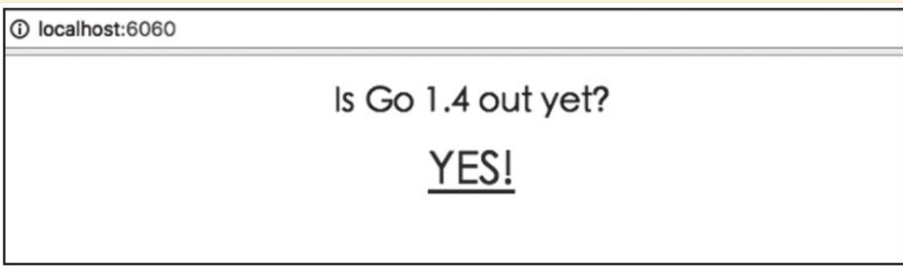

需要结束容器时，打开新的命令行窗口，输入docker stop
test即可。如果需要了解更多Golang项目容器化细节，可以参考Golang官方提供的容器化指引：\ https://blog.golang.org/docker
。

.. _相关资源-19:

3.相关资源
^^^^^^^^^^

Go语言相关资源如下：

::

   ·Go语言官站：https://golang.org
   ·Go官方镜像：https://registry.hub.docker.com/_/golang/
   ·Google Go镜像：https://registry.hub.docker.com/u/google/golang/

Portainer容器管理面板
---------------------

Portainer是一个全面的Docker UI监控管理工具，非常轻量，只有4MB大小。

.. _本章小结-3:

本章小结
~~~~~~~~

在本章中，笔者主要介绍了如何使用Docker搭建主流编程语言及其常用开发框架环境，包括C/C++、Java、Python、JavaScript、Go等。

一方面，读者可以很容易地从Dockerhub获取官方镜像并使用；另一方面，也可以基于基础镜像定制所需的镜像文件。通过这些实践案例，相信读者能学习到合理使用容器化方案的技巧，给开发和部署带来更多便利。

容器与云服务
------------

Docker目前已经得到了众多公有云平台的支持，并成为除虚拟机之外的核心云业务。除了AWS、Google、Azure、Docker官方云服务等，国内的各大公有云厂商，基本上也都已支持了容器服务，有些甚至还专门推出了容器云业务。

本章将介绍国际和国内知名的公共云容器服务以及容器云的现状、功能与特性，并以阿里云和时速云为例讲解具体使用过程，方便希望使用云服务的读者进行选型。

公有云容器服务
~~~~~~~~~~~~~~

​ 公有云（Public Cloud）是标准云计算（Cloud
Computing）的一种服务模式。服务供应商创造公有计算资源，如网络和存储资源。公众与企业可以通过公共网络获取这些资源。目前国内已经有很多公有云厂商，他们都提供可以运行Docker环境的虚拟机，同时一部分公有云厂商已经发布了自己的容器服务。

AWS
^^^

AWS（Amazon Web
Services）是亚马逊公司的IaaS和PaaS平台服务。AWS提供了一整套基础设施和应用程序服务，使用户几乎能够在云中运行一切应用程序：从企业应用程序和大数据项目，到社交游戏和移动应用程序。AWS面向用户提供包括弹性计算、存储、数据库、应用程序在内的一整套云计算服务，能够帮助企业降低IT投入成本和维护成本。

自2006年初起，亚马逊AWS开始在云中为各种规模的公司提供技术服务平台。利用亚马逊AWS，软件开发人员可以轻松购买计算、存储、数据库和其他基于Internet的服务来支持其应用程序。开发人员能够灵活选择任何开发平台或编程环境，以便于其尝试解决问题。由于开发人员只需按使用量付费，无须前期资本支出，亚马逊AWS是向最终用户交付计算资源、保存的数据和其他应用程序的一种经济划算的方式。

2015年AWS正式发布了EC2容器服务（ECS），如图15-1所示。ECS的目的是让Docker容器变得更加简单，它提供了一个集群和编排的层，用来控制主机上的容器部署，以及部署之后集群内的容器生命周期管理。ECS是诸如Docker
Swarm、Kubernetes、Mesos等工具的替代，都工作在同一个层，但ECS是作为一个服务来提供的。这些工具和ECS不同的地方在于，前者需要用户自己来部署和管理，而ECS是“作为服务”来提供的。

AWS容器服务

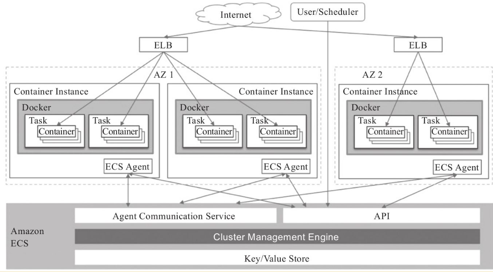

Google Cloud Platform
^^^^^^^^^^^^^^^^^^^^^

谷歌云（Google Cloud
Platform，GCP）提供了丰富全面的云产品，可以让企业专注于自己的业务，而将IT底层架构托管给谷歌。谷歌云平台支持App引擎、容器引擎、容器仓库，还支持丰富的数据库、网络、安全、大数据，甚至机器学习产品。Google云平台发布了Google容器引擎，图15-2描述了如何在开发场景中使用Google容器引擎。

Google容器引擎有以下特性：

·自动化容器管理：Google容器引擎是一个强大的集群管理和编排系统，可以按需将Docker容器编排至集群中自动运行，同时可以自定义CPU和内存等配置。此引擎基于Kubernetes，可以提供弹性、高可用的云基础服务；

·分钟级构建集群：使用谷歌容器服务，用户可以在分钟级别构建完整的集群，包含健康检查、日志服务以及应用管理系统；

·弹性与开源：Red Hat、Microsoft、IBM、Mirantis
OpenStack以及VMware都完成了它们的系统与Kubernetes的兼容或集成。用户可以平滑搭建混合云，也可以平滑迁移系统到云上。

GCP容器服务的开发场景

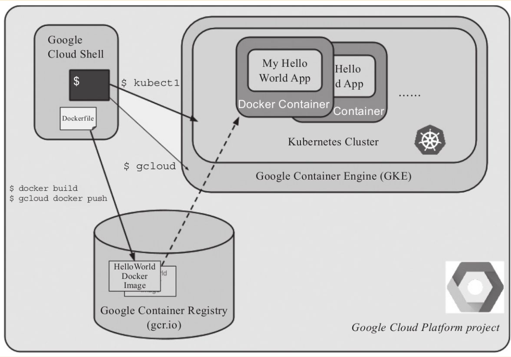

Azure
^^^^^

微软Azure在国内是由世纪互联运营的，它是在中国大陆独立运营的公有云平台，与全球其他地区由微软运营的Azure服务在物理上和逻辑上是独立的。采用微软服务于全球的Azure技术，为客户提供全球一致的服务质量保障。位于上海和北京的数据中心在距离相隔1000公里以上的地理位置提供异地复制，为Azure服务提供了业务连续性支持，实现了数据的可靠性。

在容器方面，从2014年开始，Azure首先采取了在Linux虚拟机上兼容Docker的方式来吸引社区的开发者。2014年进一步宣布与Google和Docker合作，以此支持Kubernetes和Swarm开源项目在其云平台上的运行。Docker官方也推出了Docker
Machine的Azure版本。2015年，Azure发布了容器服务（Azure Container
Service，ACS），同时支持Docker Swarm和Apache Mesos集群编排工具。

ACS具有以下特点：

·创建托管解决方案的优化型容器：为Azure优化了常用开源工具和技术的配置，获得的开放解决方案为容器和应用程序配置提供可移植性。用户只需选择大小、主机数和Orchestrator工具选项，容器服务会自动处理所有其他事项；

·使用熟悉的工具管理容器应用程序：将容器工作负荷迁移到云时，无须更改现有的管理措施。使用用户所熟悉的应用程序管理工具，通过标准的适用于所选Orchestrator的API终结点进行连接；

·使用DC/OS或Docker
Swarm进行缩放和协调：选择最能满足Docker容器业务流程和缩放操作需求的工具和解决方案。使用基于Mesos的DC/OS，或者使用Docker
Swarm和Compose以获得纯粹的Docker体验；

·使用常用的开源工具：使用用户了解的开源工具。因为ACS公开了业务流程引擎的标准API终结点，所以最常用的工具将与Azure容器服务兼容，且大多数情况是现成可用的，包括可视化工具、监视工具、持续集成工具、命令行工具甚至未来将推出的工具；

·通过Azure来回迁移容器工作负荷：单个容器可移植并不意味着应用程序可移植。Azure容器服务在业务流程层中仅使用开放源组件为完整应用程序（而不仅是单个容器）提供可移植性，以便用户能随意与Azure进行无缝来回迁移。

腾讯云
^^^^^^

腾讯云在架构方面经过多年积累，有着多年对海量互联网服务的经验。不管是社交、游戏还是其他领域，都有多年的成熟产品来提供产品服务。腾讯在云端完成重要部署，为开发者及企业提供云服务、云数据、云运营等整体一站式服务方案。

具体包括云服务器、云存储、云数据库和弹性Web引擎等基础云服务；腾讯云分析（MTA）、腾讯云推送（信鸽）等腾讯整体大数据能力；以及QQ互联、QQ空间、微云、微社区等云端链接社交体系。这些正是腾讯云可以提供给这个行业的差异化优势，造就了可支持各种互联网使用场景的高品质的腾讯云技术平台。

2015年1月6日，腾讯云正式宣布成支持Docker
Machine，并将自身定位于Docker基础设施的服务商。与此同时，在支持Docker
Machine前提下，腾讯云也推出了常用系统的标准版Docker镜像，方便用户创建容器。

阿里云
^^^^^^

阿里云创立于2009年，是中国较早的云计算平台。阿里云致力于提供安全、可靠的计算和数据处理能力。阿里云的客户群体中，活跃着微博、知乎、魅族、锤子科技、小咖秀等一大批明星互联网公司。在天猫双11全球狂欢节等极富挑战的应用场景中，阿里云保持着良好的运行纪录。

阿里云容器服务提供了高性能、可伸缩的容器应用管理服务，支持在一组云服务器上通过Docker容器来进行应用生命周期管理。容器服务极大简化了用户对容器管理集群的搭建工作，无缝整合了阿里云虚拟化、存储、网络和安全能力。容器服务提供了多种应用发布方式和流水线般的持续交付能力，原生支持微服务架构，助力用户无缝上云和跨云管理。

华为云
^^^^^^

华为云已经正式推出了云容器服务CCE（Cloud Container
Engine，云容器引擎），该服务基于以Docker为代表的容器技术，旨在提供从开发、构建、部署/托管、监控、弹性伸缩、故障恢复等全生命周期的一站式解决方案。CCE容器引擎自上线以来，已经在多个行业市场取得重大进展，在互联网、金融、政企等领域与多家合作伙伴达成合作。

通过CCE容器引擎，可以创建自己的私有集群，系统支持容器集群的全生命周期管理和可视化监控运维。还可以秒级构建不同形态和规模的应用程序，兼容业界Docker等生态，并支持应用的弹性伸缩和丰富的监控告警服务，参见图

华为云CCE产品架构

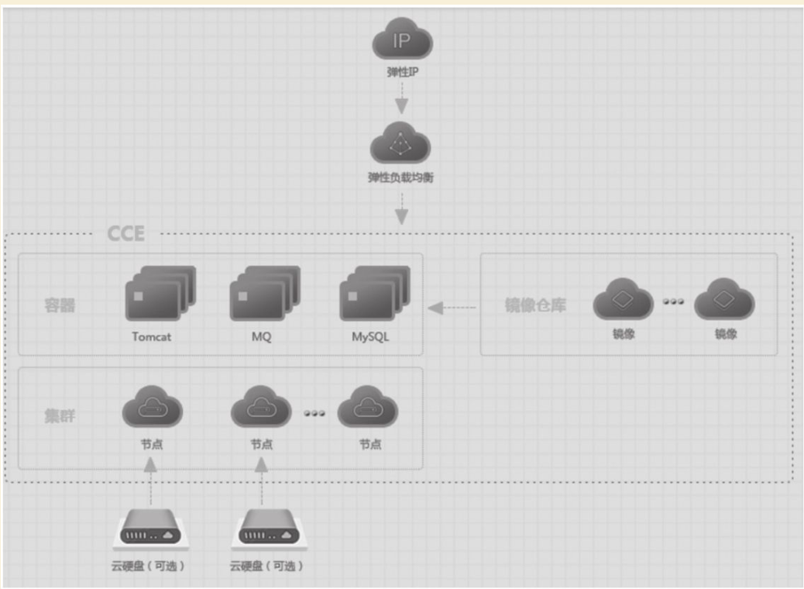

CCE主要功能包括：

·容器镜像仓库：支持私有、公有镜像仓库；

·容器集群管理：支持大规模集群和高性能并发部署；

·图形化编排工具：图形化编排部署，轻松拖拽定义复杂应用的容器编排部署，降低用户使用门槛；

·自动化运维管理：基于容器服务实现自动化运维，基于实时日志快速定位问题，界面化操作和短信通知实现24小时自动监控。

CCE容器引擎具有以下特点：

·敏捷高效：一键创建容器集群，秒级启动海量Docker容器；

·高安全性：用户私享专属容器集群，量身打造容器安全解决方案；

·简单易用：提供简单、直观的图形化编排工具，可视化设计各种应用；

·容器监控：支持自动化的容器管理、故障自动恢复；支持容器弹性伸缩，以满足用户对计算能力和容量的需求，对业务不产生任何影响。

UCloud
^^^^^^

UCloud是基础云计算服务提供商，长期专注于移动互联网领域，深度了解移动互联网业务场景和用户需求。针对特定场景，UCloud通过自主研发提供一系列专业解决方案，包括计算资源、存储资源和网络资源等企业必须的基础IT架构服务，满足互联网研发团队在不同场景下的各类需求。已有数千家移动互联网团队将其核心业务迁移至UCloud云计算服务平台上。依托位于国内、亚太、北美的全球10大数据中心以及北、上、广、深、杭等全国11地线下服务站，UCloud已为近4万家企业级客户提供服务。

UCloud容器集群服务是可灵活便捷使用的容器服务，资源可分布于多个可用区，具有更高容灾能力。支持用户自由创建管理，可以灵活绑定一个或多个EIP并具有独立的内网IP及独立的防火墙。

主要优势如下：

·独立内网IP：每个容器均有独立内网IP，与云主机、物理机、数据库等的内网通信方便快捷；

·独立公网IP：容器允许绑定外网EIP，甚至多个EIP，需要时可直接对外提供服务；

·独立防火墙：每个容器可独立绑定防火墙，更具业务灵活性；

·跨可用区容灾：容器集群为地域级产品，资源可分布于多个可用区，具有更高容灾能力。

UDocker的功能如下：

·资源池管理：允许创建和管理多个资源池，资源池可以添加和删除节点，允许不同配置的节点资源池支持外网且多个资源池可共享外网带宽；

·节点管理：允许创建和添加多个节点，允许不同配置的节点，节点支持开启、关闭、删除等操作；

·容器管理：允许在节点上批量创建和删除容器，每个容器都拥有独立内网IP，容器可以绑定EIP，容器可以配制防火墙；

·监控信息：节点和容器都拥有独立完整的监控信息，如CPU利用率、内存利用率、磁盘IO、网络IO等。
#### 1.基本要素与关键特性

一般而言，CaaS应该可以提供容器运行的平台，并管理容器所需资源；基于IaaS提供灵活的网络与部署能力，支持多租户，支持高弹性。具体而言，CaaS有以下基本要素：

·容器调度：调度和管理容器；

·服务发现：将容器化的服务，注册到服务发现工具，确保服务之间的通信；

·网络配置：用户可访问容器，并实现跨主机容器通信；

·安全配置：只开放容器监听的端口；

·负载均衡：避免单点过载；

·数据持久化：容器内数据云端持久化；

·容错与高可用：日志与管理，容器监控。

CaaS的关键特性：

·开发角色和运维角色的进一步有机融合；

·容器化应用程序生命周期的所有阶段；

·让开发者更加关注构建应用本身，而无须关注运行环境；

·支持多种底层基础设施，包括多种操作系统和平台；

·API变得越来越重要，不同服务之间通过API相互调用

2.网易蜂巢
^^^^^^^^^^

网易蜂巢是网易基于自研IaaS平台深度优化，推出的一款采用Docker容器化技术的新一代云计算平台，全面助力加速研发全流程，架构图参见图15-5。拥有BGP多线接入，全万兆网络，全SSD存储等优质硬件资源，自底向上确保安全、极速、稳定的研发体验。网易蜂巢主要提供三大产品：

.. image:: ../_static/docker_wangyifengcao00001.png

·容器云：蜂巢提供企业级的容器云平台，支持应用集群一键部署，云计算资源弹性扩展，Docker官方镜像加速。此外蜂巢还支持负载均衡以及镜像仓库服务；

·平台服务：蜂巢提供高性能、高可用、高可靠的数据库和缓存服务，与容器云相辅相成，让开发者可以专注于应用开发和业务发展。此外蜂巢平台服务还提供对象存储以及安全服务；

·运维工具：蜂巢提供性能监控、报警，日志采集等运维工具，提升开发、运维效率，同时提供OpenAPI，灵活管理资源。

容器是蜂巢提供的计算资源最小单位，而要实现一个可水平扩展的产品服务端架构，则需要引入集群的概念，在网易蜂巢中称之为“服务”，集群的运维如发布、回滚、扩容、缩容以及集群的成员管理需要引入编排服务来实现。网易蜂巢的编排服务基于开源项目Kubernetes，编排服务将受控的资源抽象为三个层次：

·容器：软件及运行环境；

·Pod：相关联的容器的组合，相互间通信无须跨网络，例如应用服务器和本地缓存，可以容纳一个或多个容器；

·Node：提供计算、网络、存储的资源节点，可以容纳一个或多个Pod。

3.时速云
^^^^^^^^

时速云是国内领先的容器云平台和解决方案提供商。基于Docker为代表的容器技术，为开发者和企业提供应用的镜像构建、发布、持续集成/交付、容器部署、运维管理的新一代云计算平台。其中包括标准化、高可用的镜像构建，存储服务、大规模、可伸缩的容器托管服务，及自有主机集群混合云服务。时速云致力打造下一代以应用为中心的云计算平台，帮助客户优化开发运维环节，提高业务效率，降低IT成本，实现持续创新。

网易蜂巢CaaS架构示意图

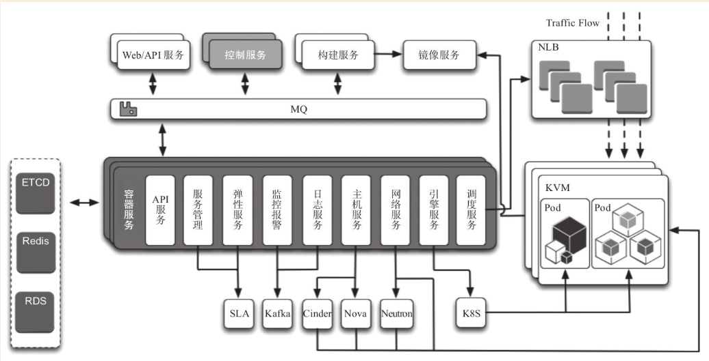

时速云做基于Kubernetes的CaaS平台，以容器化应用作为交付的标准，立足于公有云，为开发者和企业提供了一个快速构建、集成、部署、运行容器化应用的平台，帮助开发者和企业提高应用开发的迭代效率，简化运维环节，降低运维成本。客户包括华大基因、京东方、中国移动、新浪、腾讯等重量级用户。

时速云拥有四大核心产品线，包括：

·企业级容器云平台：兼具IaaS的便利，PaaS的简单，原生集群快速创建，上千节点集群的快速调度、部署；

·企业级镜像仓库：集群化部署、多角色权限控制、集成企业LDAP、增强扩展组件、可视化管理；

·持续集成和持续交付（CI/CD）：轻松云端构建、定制集成、部署规则、事件触发定义、关键环节审核；

·镜像及安全服务中心：多层次镜像扫描、服务安全防护、可视化审查、第三方规则接入。

4.DaoCloud
^^^^^^^^^^

DaoCloud成立于2014年末，是新一代容器云计算领域的知名企业。DaoCloud产品线涵盖互联网应用的开发、交付、运维和运营全生命周期，并提供公有云、混合云和私有云等多种交付方式。核心团队由来自微软、EMC、VMware等知名企业的高管和技术专家组成，公司总部位于中国上海。

除了公有云服务开始商用之外，DaoCloud还公布了面向大型企业用户，以混合云方式交付的托管云和私有云服务。在企业既有IT框架内，针对具体企业业务需求，定制高度可控的跨云跨网的混合式容器云平台（参见图15-6），帮助企业打造支撑互联网级业务的基础设施。

DaoCloud对国内容器技术社区有不间断的技术和资源投入，Docker
Hub加速器在国内被开发者广泛使用，并承诺为开发者提供永久免费的社区资源服务。

DaoCloud CaaS平台 |image3|

5.灵雀云
^^^^^^^^

灵雀云（Alauda）成立于2014年10月，总部位于美国西雅图市，是微软创投加速器成员。云雀科技致力于提供简单快捷的云平台和服务，帮助客户提高开发部署效率，降低客户IT成本，并使客户可以专注于核心业务。云雀科技产品线以容器这个新一代应用交付件为中心，全方位支持云端应用创建、编译、集成、部署、运行的每一个环节。

灵雀云产品线包括Docker托管服务和镜像服务。Docker托管服务提供高效、高可用的运行环境，并支持自动化部署，还提供自动修复、自动扩展、负载均衡等服务，并在此基础之上提供可扩展的监控、日志管理系统。镜像服务提供高性能本地Registry服务用于创建私有、公有镜像仓库，提供上传、下载、构建及托管的全方位镜像服务。目前，灵雀云已经在北京区，上海区和香港区搭建了基于Azure的CaaS服务体系，其架构参见图

灵雀云容器服务架构

.. image:: ../_static/docker_lingque00001.png

6.数人云
^^^^^^^^

数人云由原Google架构师王璞博士于2014年创立，其核心团队来自于Google、RedHat和HP。数人科技致力于打造下一代轻量级PaaS平台（DCOS），将应用弹性做到极致，DCOS架构参见图15-8。“数人云”是一款部署在公有云、私有云以及混合云之上的企业级云操作系统，旨在帮助用户在云端快速建立并稳定运行一个高性能生产环境，将应用弹性做到极致，实现一站式的微服务架构集群系统。

“数人云”的云操作系统是一款部署在公有云或者私有云（IDC）之上的应用运维软件，旨在帮助用户在云端快速建立并稳定运维一个高性能生产环境。基于领先的Mesos和Docker技术，数人云可为用户的业务系统带来高可用的服务质量、快速的性能伸缩、高效的资源利用以及便捷的可视化管理和监控；同时，数人云保证用户的计算资源和数据完全为用户私有可控。

数人云DCOS

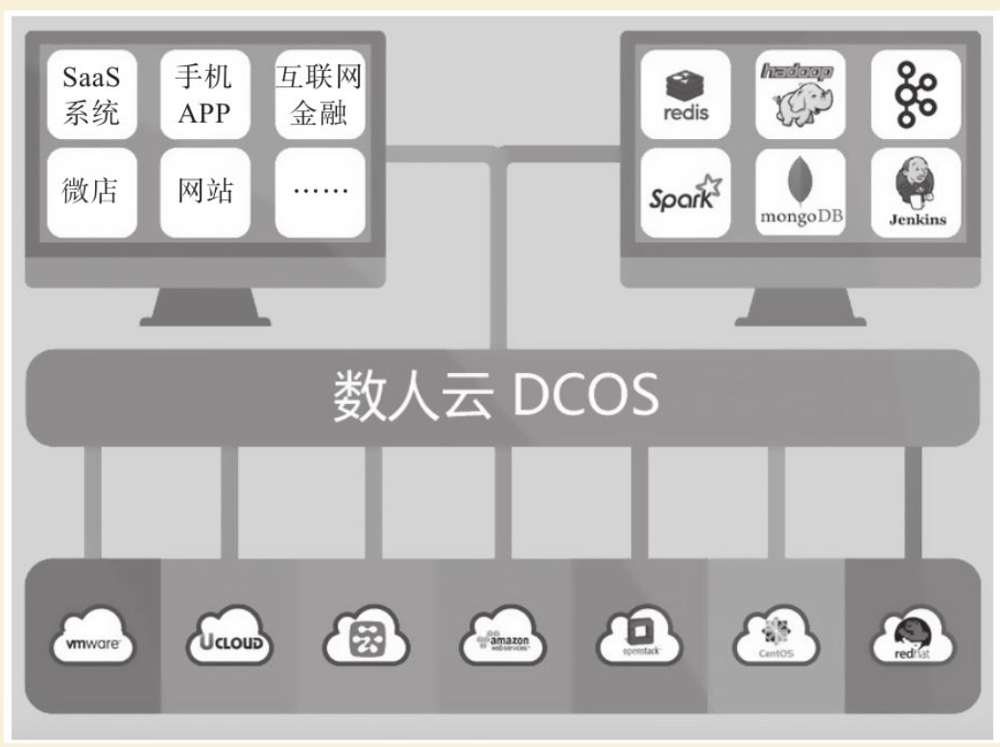

阿里云容器服务
~~~~~~~~~~~~~~

ACS（Alicloud Container
Service，阿里云容器服务）是一种高性能可伸缩的容器管理服务，支持在一组云服务器上通过Docker容器来运行或编排应用。ACS让用户可以轻松地进行容器管理集群的搭建。此外，ACS整合了负载均衡、专有网络等丰富的阿里云工具，足以支撑企业级IT架构的云化、容器化、微服务化。用户还可以通过阿里云控制台或Restful
API（兼容Docker API）进行容器生命周期管理。

ACS容器服务具有以下优势：

·简单易用：一键创建容器集群，全兼容Docker
Compose模板编排应用，支持图形化界面和Open
API，一站式网络、存储、日志、监控、调度、路由和持续发布管理；

·安全可控：用户拥有并独占云服务器，支持定制安全组和专有网络VPC安全规则，集群级别基于证书的认证体系，支持证书刷新，容器级别的资源隔离和流控，支持集群级别和子账号级别的权限管理；

·协议兼容：兼容标准Docker Swarm
API，支持应用无缝迁云、混合云场景，兼容Docker
Compose模板协议，支持通过API对接实现第三方的调度下发和系统集成；

·高效可靠：支持海量容器秒级启动，支持容器的异常恢复和自动伸缩，支持跨可用区的高可用。

1.Web应用容器化部署

主要功能包括：

Web应用容器化部署架构

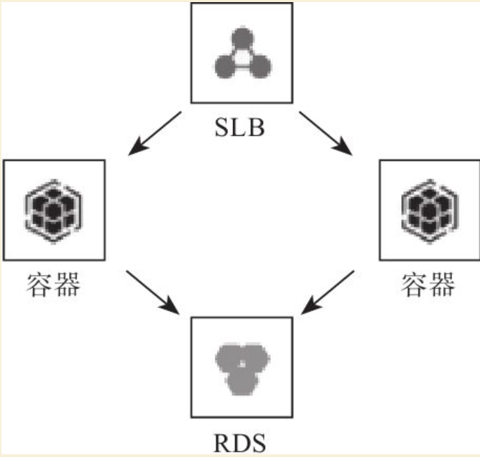

·容器服务支持自动化地配置负载均衡SLB和后端云服务器ECS，通过选择Web应用对应的Docker镜像，一键部署；

·支持多种灰度发布策略，包括蓝绿发布和金丝雀发布，保证应用平滑升级；

·支持查看容器和系统等不同维度的监控，并配置扩容和弹性伸缩的策略；

·支持通过声明的方式配置后端的数据库等云服务。

2.持续集成系统构建

主要功能架构参见图15-10，说明如下：

·在阿里云容器镜像服务创建一个自动构建类型的镜像仓库，选择关联代码源到Github或云Code。当代码提交后，会触发Docker镜像的自动构建。

·在镜像Webhook里配置容器服务的trigger
API，这样当镜像构建完毕后，就会触发容器的自动部署，实现流水线般的持续集成和持续交付。

持续集成架构

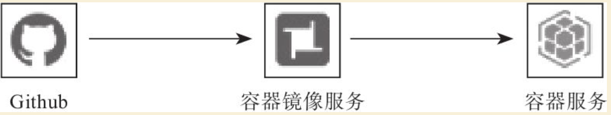

3.微服务架构系统构建

微服务架构系统构建架构参见图

15-11，说明如下：

·将用户现有的系统从业务领域或横向扩展等维度拆分成多个微服务，每个微服务的内容用一个镜像管理；

·通过Docker
Compose编排模板描述微服务之间的依赖关系和配置，在容器服务选择编排模板一键创建应用。

微服务架构系统构建架构

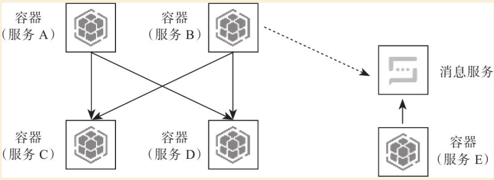

4.常用工具

为了进一步提高容器服务的易用性和可用性，阿里云容器服务提供了许多常用工具，如阿里云版本docker-machine、阿里云容器加速器、阿里云容器Hub服务等。

如果想要了解更多信息，可以访问阿里云官方网站：\ `https://www.aliyun.com <https://www.aliyun.com/>`__
。

时速云介绍
~~~~~~~~~~

时速云成立于2014年10月，是新一代容器云计算领域的领军企业，业务涵盖容器PaaS平台、DevOps、微服务治理、AIOps等领域。时速云是国内首个基于Kubernetes的企业级容器PaaS平台，2018年1月公司完成近亿元B轮融资，公司的核心使命是通过容器云计算帮助企业实现数字化转型。时速云拥有金融、能源、运营商、制造、广电、汽车等领域的诸多大型企业及世界500强客户。时速云总部位于中国北京，并设立了上海、深圳、广州、武汉等分支机构。

时速云是全球云原生应用CNCF基金会银牌会员，也是Linux基金会会员，以及开源容器编排技术Kubernetes、容器引擎Docker、分布式存储Ceph等的贡献者。2017年3月，时速云成功加入中国开源云联盟组织以及超融合联盟。公司拥有多名Kubernetes、Docker等开源技术的核心源码贡献者，是国内第一家从事Kubernetes研发与应用的公司。

时速云的产品体系以容器技术为核心，围绕PaaS、DevOps、微服务帮助企业IT提升业务应用的快速交付，给企业应用架构带来更高的灵活性和敏捷性，其架构如图15-12所示。包含如下解决方案。

1.企业级容器PaaS平台
^^^^^^^^^^^^^^^^^^^^

基于容器技术打造云原生的容器PaaS产品，立足企业开发、测试及IT管理需求，提供一站式容器云平台，从而帮助企业IT数字化转型，为企业提供轻量、快速、高效、更友好的服务运行及开发环境。

2.开发运维一体化DevOps
^^^^^^^^^^^^^^^^^^^^^^

提供自动化的持续集成能力（包括代码构建、代码分析、自动测试、编译环境、文档生成、事件通知、定时器、人工审核等），帮助用户尽早发现集成错误，实现人工干预，让开发运维协调一致，优化企业应用交付流程。

时速云架构

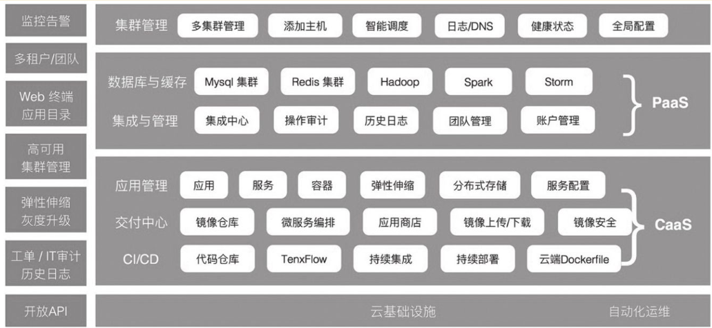

3.微服务治理
^^^^^^^^^^^^

时速云微服务治理平台是基于Spring
Cloud和Pinpoint等开源组件开发的面向企业的容器化微服务架构应用托管平台，帮助企业简化部署、监控、运维、治理与微服务生命周期的管理，并实现不同环境之间的跨系统、跨协议的服务互通。

4.容器超融合一体机
^^^^^^^^^^^^^^^^^^

超融合基础架构（Hyper-Converged
Infrastructure，HCI）是指在同一套单元设备中不仅仅具备计算、网络、存储和服务器虚拟化等资源和技术，形成统一的资源池。目前超融合一体机产品更适合部署在企业内部的IT系统中，在为企业提供相关IT服务的同时，为企业降低运维综合成本，提供更加高可靠、高可用的IT基础设施。

如果希望了解关于时速云的更多信息，可以访问其官方网站：\ `https://www.tenxcloud.com <https://www.tenxcloud.com/>`__
。

.. _本章小结-4:

本章小结
~~~~~~~~

本章介绍了公有云服务对Docker的积极支持，以及新出现的容器云平台。事实上，Docker技术的出现自身就极大地推动了云计算行业的发展。

通过整合公有云的虚拟机和Docker方式，可能获得更多的好处，包括：

·更快速的持续交付和部署能力；

·利用内核级虚拟化，对公有云中服务器资源进行更加高效地利用；

·利用公有云和Docker的特性更加方便的迁移和扩展应用。

同时，容器将作为与虚拟机类似的业务直接提供给用户使用，极大地丰富了应用开发和部署的场景。

容器实战思考
------------

在开发和运维实践中大量使用容器技术之后，相信读者都会产生或多或少的心得体会。此时进行经验总结十分有必要。

在本章中，笔者将分享自己在容器实践中的一些思考体会，包括Docker之所以能成功的根本原因，作为开发人员该如何看待容器，DevOps团队该如何使用容器，以及生产环境中部署容器的一些技巧等。

希望读者在阅读完本章内容后，对容器的理解能更上一层楼，在实践应用上也能融会贯通。

Docker为什么会成功
~~~~~~~~~~~~~~~~~~

Docker实现所依赖的各种基础技术（cgroups、namespace、分层文件系统等）在Docker之前已经存在很多年。并且，其前身的LXC也在诸多企业的生产环境中得到了大量的应用实践，并得到了极为明显的性能优势。Google大规模容器集群的性能比传统虚拟机要高很多，接近于Bare
Metal。与传统虚拟机相比，容器集群让这些公司拥有秒级而非分钟级的弹性计算伸缩能力，同时使用更少的机器运行更多实例。

既然容器技术有如此大的优势，为什么Docker之前，容器并没有引发广泛的关注呢？核心问题在于易用性。前人走完了九十九步，而Docker迈出了最后的一步，引发了从量变到质变的突破。

Docker首次创造了一种简单易行并且覆盖应用全生命周期的工作流。用户可以通过简单的指令或Restful
API来拉取、打包、运行和维护容器。这种简化从根本上降低了应用程序部署的难度，极大地提高了应用运行时环境的部署与维护的效率。用户可以不依赖类似于Ansible、Chef、Puppet这类配置管理和发布系统，不需要一次部署中同时关注基础系统与软件的安装配置，以及应用的安装调试。

Docker提供了一种统一的实践方法，每个服务（或应用）维护一个Dockerfile文件。即便使用编排工具如Docker
Compose，一个服务（或应用）也只需维护一个docker-compose.yml文件。应用程序及其运行时环境全部打包到一个简单易读的Dockerfile或Compose文件中，开发团队和运维团队都可以透明地合作维护这个文件，极大地降低了沟通成本与部署成本，满足了研发团队与DevOps团队、运维团队之间的沟通需求，清晰划分了责任边界。

Docker正以一种前所未有的方式让用户可以在各种Linux发行版、各种开发环境中快速切换，这对应用开发者来说真是一种福音。使用各种开发环境的用户，再也不必担心破坏主机的系统环境（如环境变量）和应用程序。系统架构师们也可以使用Docker来快速搭建各种网络架构的系统，且可以方便地管理这些系统之间的数据连接和共享。目前Docker发展迅速，基于Docker的PaaS平台也层出不穷。这让技术创业者无须折腾服务器部署，只需专注业务代码的实现即可。

完整解决用户痛点，真正带来效率的提升，正是一个产品和技术能最终成功的关键！

研发人员该如何看待容器
~~~~~~~~~~~~~~~~~~~~~~

很多研发工程师经常会问：我是搞开发的，不做运维，容器技术跟我有关吗？其实，笔者在实践过程中发现，合理应用容器技术，不仅能提升开发效率，而且还能提升技术水平。

1.快速上手新技术
^^^^^^^^^^^^^^^^

众所周知，新技术的学习往往从学习简单示例（例如Hello
World）开始，这是学习新知识的标准思路：最小系统原则，即从变量最少的最小系统开始，循序渐进地学习。

现实生活中，简单的事物背后往往蕴含着复杂的机制。用户在构建最小系统的时候，首先面对的就是环境（或者说前置条件）的搭建。虽然随着程序语言自身的发展，周边工具越来越多，但学习成本仍然居高不下，各大技术论坛中关于环境安装的问题总是层出不穷。

通过Docker的使用，用户可以将精力和注意力都尽快地放在语言本身的学习上，而无须折腾系统环境的各种配置。Docker官网的口号就包含了以上含义：Build，Ship
and Run Any
App，Anywhere，即“任何应用都可以自动构建、发布、运行于任何环境”，将环境的影响因素降至最低，全面掌控应用整个生命周期。

目前Docker官方支持的编程语言镜像已达几十种，涵盖所有的主流编程语言的开发环境。除此之外，常用数据库、缓存系统、主流Web框架等都有官方的镜像。除此之外，Docker
Hub还提供了丰富的第三方镜像。

2.容器化的代码仓库提升开发速度
^^^^^^^^^^^^^^^^^^^^^^^^^^^^^^

经常整理和收集常用代码库是软件工程师实现高效交付的“秘诀”。

在技术团队中，为何行业新人和资深工程师之间的生产力可以有几十倍的差距呢？暂且不论基础技能和经验的差距，同样是做一件任务，新人首先面对的就是工具的选择，然后需要解决工程实践中的各种“坑”。而资深工程师接手后，可以快速规划所需要的资源，并在最短时间内利用积累的模块搭建起系统，从而可以快速完成任务。

另外，研发过程中的各种发布版本，也可以用Docker容器的方式保存。以后遇到类似的需求，可以直接运行、调试并复用代码。

3.面向业务编程
^^^^^^^^^^^^^^

软件开发，除非是算法比赛，否则本质上还是要能解决业务问题，满足需求方的要求。最近几年，各种新的技术和工具层出不穷，虽然万变不离其宗，但能快速掌握新的业务需求和新的技术栈，是对一个优秀技术人员的迫切要求。

笔者根据Docker的特性，给出一个可行方案：使用Docker快速掌握新技术要点并完成适当的技术储备。下面，举一个简单的例子，假定读者是Python技术栈的后端工程师，熟悉常规网站的后台建设，那么如何快速实现移动应用的Restful
API Sever呢？可以去Docker
Hub搜索适合做API服务器的Python快速开发框架，根据自身业务需求修改Dockerfile，定制符合要求的镜像，然后快速启动一套能满足相关API的系统。

可见，容器技术可以帮助软件工程师更加专注地面向业务需求，快速启用新技能。

4.使用Docker Hub发布开源项目
^^^^^^^^^^^^^^^^^^^^^^^^^^^^

技术人员从社区借鉴和学习各种好用的工具和技能时，也需要积极反馈社区，共同营造一个良好的生态环境。

笔者在此建议：读者如果参与开源项目的建设，那么可以通过Docker完成程序的打包、测试、发布和部署，通过Docker
Hub来管理和维护镜像，这样可以统一又清晰地管理整个开源项目。

容器化开发模式
~~~~~~~~~~~~~~

传统开发模式会涉及多种环境和团队。开发团队在开发环境中完成软件开发，本地完成单元测试，测试通过，则可提交到代码版本管理库；测试团队打包进行进一步测试。运维团队把应用部署到测试环境，开发团队或测试团队再次进行测试，通过后通知部署人员发布到生产环境。

在上述过程中涉及的三个环境（开发、测试和生产）以及三个团队（开发、测试、运维），彼此之间需要进行大量人工交互，很容易出现由于环境不一致而导致出错的情况，浪费不必要的人力物力。

在容器化开发模式中，应用是以容器的形式存在，所有和该应用相关的依赖都会在容器中，因此移植非常方便，避免了因为环境不一致而出错的风险。

图16-1比较了两种模式下的不同流程。

图16-1　传统模式vs容器模式下的工作流程比较

.. image:: ../_static/docker_vs_chuantong001.png

1.操作流程
^^^^^^^^^^

在容器化的应用中，项目架构师和开发人员的作用贯穿整个开发、测试、生产三个环节。

项目伊始，架构师根据项目预期创建好基础的base镜像，如Nginx、Tomcat、MySQL镜像，或者将Dockerfile分发给所有开发人员。开发人员根据Dockerfile创建的容器或者从内部仓库下载的镜像来进行开发，达到开发环境的充分一致。若开发过程中需要添加新的软件，只需要向架构师申请修改基础的base镜像的Dockerfile即可。

开发任务结束后，架构师调整Dockerfile或者Docker镜像，然后分发给测试部门，测试部门马上就可以进行测试，消除了部署困难等难缠的问题。

2.场景示例
^^^^^^^^^^

假如有一个200人左右的软件企业，主要使用Java作为开发语言，使用Tomcat、WebLogic作为中间件服务器，后台数据库使用Oracle、MySQL等。在应用容器之前，开发到测试的流程如图16-2所示。

可见，因为环境不一样，开发、测试、运维三个部门做了很多重复的工作。

而容器化开发正好可以解决这个问题，大大简化工作流程，如图16-3所示。

　传统的开发流程

.. image:: ../_static/docker_vs_chuantong00002.png

利用容器环境开发的流程

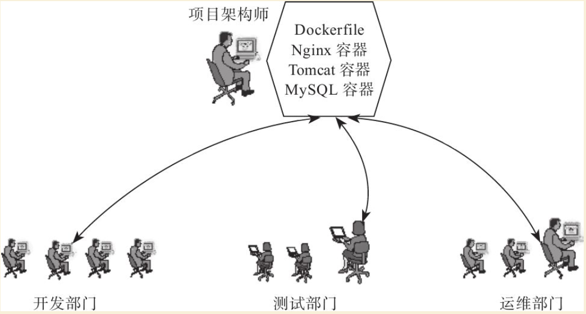

3.注意事项
^^^^^^^^^^

首先，在开发和测试环境中，推荐使用-v共享文件夹来存储开发人员的程序代码，避免频繁打包操作。

其次，利用基础的base镜像的继承特性来调整镜像的轻微变更。例如当需要测试程序对不同版本的JDK的支持情况时，只需改变base镜像的JDK设置，然后其他依赖它的镜像在重新创建的过程中就可以自动完成更新。

最后，测试部门应当注意Docker以及镜像的版本，并经常对部署后的应用程序进行性能上的测试。

容器与生产环境
~~~~~~~~~~~~~~

对于生产环境，不同的产品技术团队可能有不同的解读。在这里，生产环境是指企业运行其商业应用的IT环境，是相对于开发环境、预发布环境和测试环境而言的。

在生产环境中，容器既可以作为API后端服务器，也可以作为业务应用的Web服务器，还可以作为微服务中的服务节点。但是不管用户将容器用于哪种场景，在生产环境中运行容器与其他环境相比，对安全性与稳定性等方面都有更高的要求。

Docker算是IT生产环境与基础设施的新成员。近些年，Docker在DevOps和基础设施领域中快速风靡起来。Google、IBM、Amazon、Microsoft，以及几乎所有云计算供应商都宣布支持Docker。很多容器领域中的创业公司都在2014年或2015年初获得了风险投资。同时，Docker公司在2015年的估值也达到了10亿美元。

尽管Docker获得广大公有云厂商的大力支持，但是目前容器技术生态中已经存在许多分支与分歧，如rkt项目。为了解决容器生态中的差异化问题，为了从根本上解决生产环境中运用Docker的风险，Google、Intel、Microsoft、IBM、Amazon、VMware、Oracle、HPE、Facebook等IT巨头于2015年6月共同宣布成立OCI（Open
Container Initiative）组织
[`1] <http://reader.epubee.com/books/mobile/5e/5ed586449ceaa3f619488a147cd76a01/text00126.html#ch1_back>`__
。OCI组织的目标在于建立通用的容器技术标准。除了保障与延续既有容器服务的生命周期外，还通过不断推出标准的、创新的容器解决方案赋能开发者。而OCI成员企业也会秉持开放、安全、弹性等核心价值观来发展容器生态。客观而言，OCI组织的出现确立了容器技术的标准，避免容器技术被单一厂商垄断。统一技术标准后，广大企业不用担心未来新兴的容器技术不兼容Docker。

2016年开始，大量企业应用开始云化，部分已经云化的企业，开始实施全面容器化和微服务化。不过，用户不应该把容器当作“银弹”，并不是所有应用和服务都适合容器化。对于“12
factor”类型应用
[`2] <http://reader.epubee.com/books/mobile/5e/5ed586449ceaa3f619488a147cd76a01/text00126.html#ch2_back>`__
，容器化是非常容易和平滑的。因为这些应用是无状态的，而且它们在微服务架构中可以在很短时间内完成启停，高度保证了整个服务的可用性。传统数据库或有状态的应用、对网络吞吐性能有高要求的应用，并不适合容器化。

可以说，绝大部分分层架构的企业架构，都可以平滑地在生产环境中容器化。而绝大部分完成容器化的企业架构，都可以通过代码重构完成微服务化，这样可以从服务层面进一步提高可用性，进一步降低IT固定成本。降低持续集成与部署成本。

现在越来越多的企业正在生产环境中使用Docker。2016年，DockerHub镜像下载量超过100亿次。最近某容器服务的研究显示，八成的IT从业者了解和接触过Docker，四成的组织目前正在生产环境中使用Docker，预计这个比例会在未来两年内还会继续上升。

在生产环境中使用容器，这里提供一些基本建议供大家参考：

·如果Docker出现不可控的风险，是否考虑了备选的解决方案；

·是否需要对Docker容器做资源限制，以及如何限制，如CPU、内存、网络、磁盘等；

·目前，Docker对容器的安全管理做得不够完善，在应用到生产环境之前可以使用第三方工具来加强容器的安全管理，如使用apparmor对容器的能力进行限制，使用更加严格的iptable规则，禁止root用户登录，限制普通用户权限以及做好系统日志的记录；

·公司内部私有仓库的管理、镜像的管理问题是否解决。目前官方提供的私有仓库管理工具功能并不十分完善，若在生产环境中使用还需要更多的完善措施。

[`1] <http://reader.epubee.com/books/mobile/5e/5ed586449ceaa3f619488a147cd76a01/text00126.html#ch1>`__
OCI组织官网：https://www.opencontainers.org/

[`2] <http://reader.epubee.com/books/mobile/5e/5ed586449ceaa3f619488a147cd76a01/text00126.html#ch2>`__
12Factor App：https://12factor.net/

.. _本章小结-5:

本章小结
~~~~~~~~

本章主要介绍了在实战中使用容器技术的一些思考。信息技术行业是前所未有的一个快速变革的行业，极其注重效率和可靠性。一直以来，产品研发流程中最让人头痛的一点就是研发周期管理。无论是传统模式还是快速迭代、瀑布流，都需要有完善的代码周期支持。容器化毫无疑问地契合了这一需求，为产品研发带来了生产力的提升。

笔者认为，自容器之后，信息产业将会上升到一个更高的阶段，更多的生产力将被解放出来，可以去攻克更核心的技术问题。在这个过程中，技术人员要主动拥抱变化，掌握全新的工作模式和核心技能，推动科技进步的浪潮。

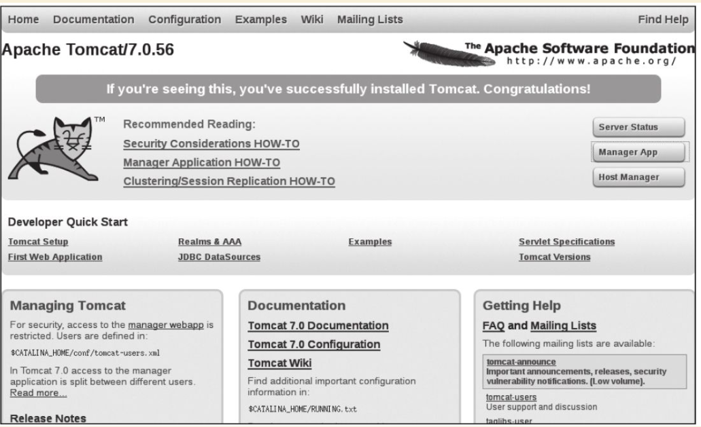
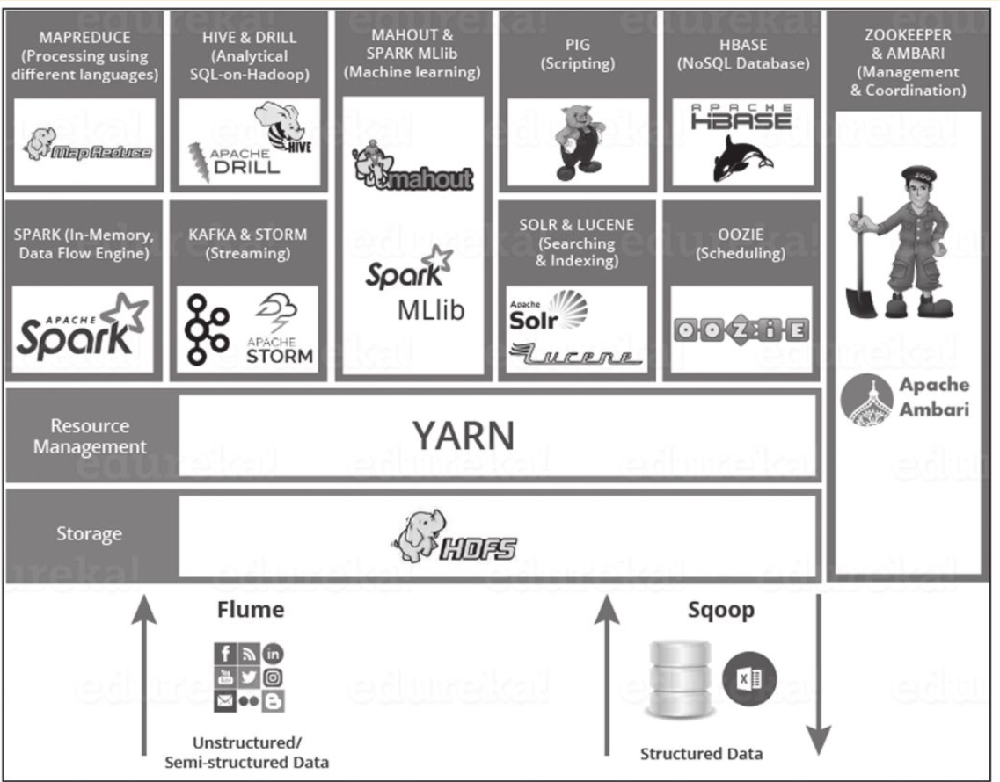
.. |image3| image:: ../_static/docker_daocloud_caas001.png
