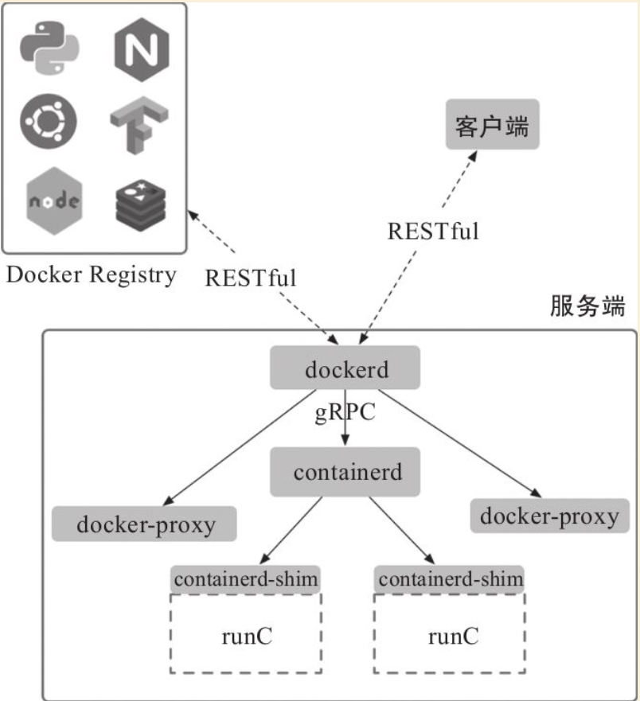
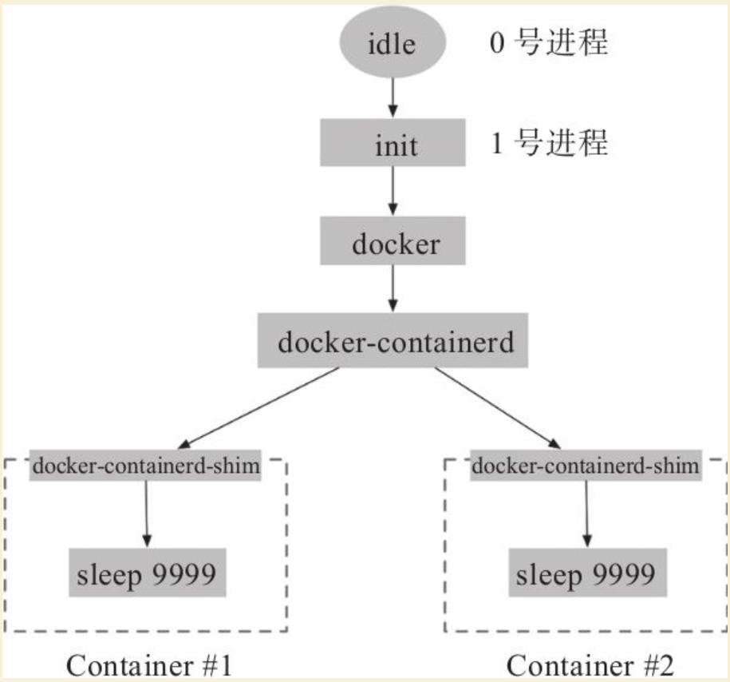
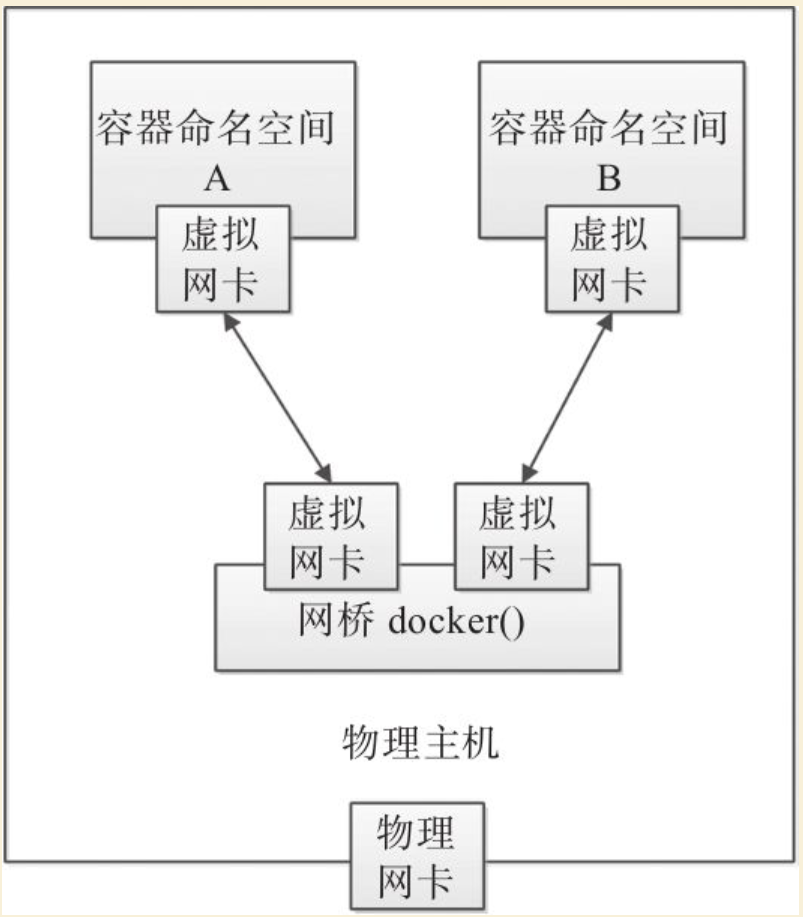
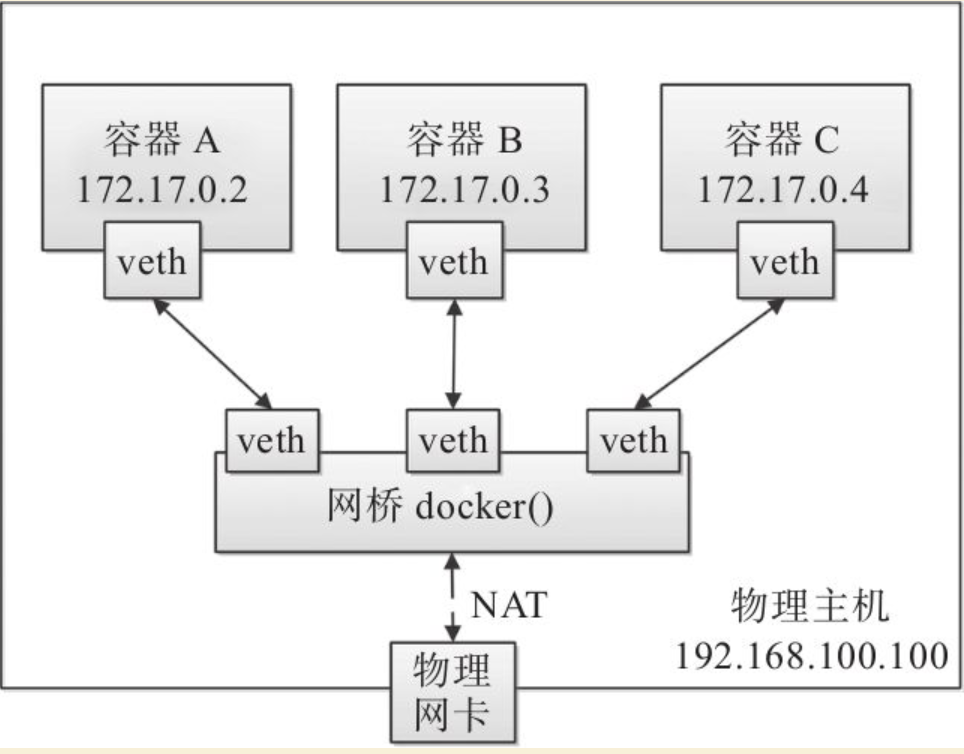

# Docker核心实现技术

## 1.基本架构

作为最流行的容器虚拟化手段，Docker深度应用了操作系统相关领域的多项底层技术。

最早期版本的Docker基于已经相对成熟的Linux Container（LXC）技术快速实现。自0.9版本起，Docker逐渐摆脱传统LXC的限制，转移到全新设计的libcontainer之上，后来更是以此为基础推出了开放容器运行时支持runc（<https://github.com/opencontainers/runc> ）项目。2015年6月，Docker公司将runc捐赠出来，牵头成立了Linux基金会支持的Open Containers Initiative（OCI），专注于容器技术的运行时规范（runtime-spec）和镜像规范（image-spec），试图打造更通用、更开放的容器技术规范。

当然，Docker容器运行在操作系统上，需要来自操作系统的支持。本章将以容器领域最流行的Linux宿主系统为例，介绍Docker底层依赖的核心技术：包括Docker基本架构、Linux操作系统的命名空间（namespace）、控制组（control group）、联合文件系统（union file system）和网络虚拟化支持等。


Docker目前采用了标准的C/S架构，包括客户端、服务端两大核心组件，同时通过镜像仓库来存储镜像。客户端和服务端既可以运行在一个机器上，也可通过socket或者RESTful API来进行通信。如图:

Docker基本架构



### 1.服务端

Docker服务端一般在宿主主机后台运行，dockerd作为服务端接受来自客户的请求，并通过containerd具体处理与容器相关的请求，包括创建、运行、删除容器等。服务端主要包括四个组件：

·dockerd：为客户端提供RESTful API，响应来自客户端的请求，采用模块化的架构，通过专门的Engine模块来分发管理各个来自客户端的任务。可以单独升级；

·docker-proxy：是dockerd的子进程，当需要进行容器端口映射时，docker-proxy完成网络映射配置；

·containerd：是dockerd的子进程，提供gRPC接口响应来自dockerd的请求，对下管理runC镜像和容器环境。可以单独升级；

·containerd-shim：是containerd的子进程，为runC容器提供支持，同时作为容器内进程的根进程。

runC是从Docker公司开源的libcontainer项目演化而来的，目前作为一种具体的开放容器标准实现加入Open Containers Initiative（OCI）。runC已经支持了Linux系统中容器相关技术栈，同时正在实现对其他操作系统的兼容。用户也可以通过使用docker-runc命令来直接使用OCI规范的容器。

dockerd默认监听本地的unix：///var/run/docker.sock套接字，只允许本地的root用户或docker用户组成员访问。可以通过-H选项来修改监听的方式。例如，让dockerd监听本地的TCP连接1234端口，代码如下：

------

```
$ sudo dockerd -H 127.0.0.1:1234
WARN [!] DON'T BIND ON ANY IP ADDRESS WITHOUT setting --tlsverify IF YOU DON'T KNOW WHAT YOU'RE DOING [!]
INFO libcontainerd: started new docker-containerd process  pid=760
INFO[0000] starting containerd                           module=containerd revision=992280e8e265f491f7a624ab82f3e238be086e49 version=v1.0.0-beta.2-53-g992280e
INFO[0000] changing OOM score to -500                    module=containerd
INFO[0000] loading plugin "io.containerd.content.v1.content"...  module=containerd type=io.containerd.content.v1
INFO[0000] loading plugin "io.containerd.snapshotter.v1.btrfs"...  module=containerd type=io.containerd.snapshotter.v1
...
```

------

此外，Docker还支持通过TLS认证方式来验证访问。

docker-proxy只有当启动容器并且使用端口映射时候才会执行，负责配置容器的端口映射规则：

------

```shell
$ docker run -itd -p 80:80 ubuntu:latest /bin/sh
ef42ab1dda78f43ac67f8fdd88b319ff1d60e8771a160afea36a7528e10adfd3
$ ps -ef |grep docker
root      3084   934  0 03:15 ?        00:00:00 /usr/bin/docker-proxy -proto tcp -host-ip 0.0.0.0 -host-port 80 -container-ip 172.17.0.2 -container-port 80
```

### 2.客户端

Docker客户端为用户提供一系列可执行命令，使用这些命令可实现与Docker服务端交互。

用户使用的Docker可执行命令即为客户端程序。与Docker服务端保持运行方式不同，客户端发送命令后，等待服务端返回；一旦收到返回后，客户端立刻执行结束并退出。用户执行新的命令，需要再次调用客户端命令。

客户端默认通过本地的unix：///var/run/docker.sock套接字向服务端发送命令。如果服务端没有监听在默认的地址，则需要客户端在执行命令的时候显式地指定服务端地址。例如，假定服务端监听在本地的TCP连接1234端口为tcp：//127.0.0.1：1234，只有通过-H参数指定了正确的地址信息才能连接到服务端：

------

```shell
$ docker -H tcp://127.0.0.1:1234 info
Containers: 1
    Running: 0
    Paused: 0
    Stopped: 1
Images: 52
...
```

------

### 3.镜像仓库

镜像是使用容器的基础，Docker使用镜像仓库（Registry）在大规模场景下存储和分发Docker镜像。镜像仓库提供了对不同存储后端的支持，存放镜像文件，并且支持RESTful API，接收来自dockerd的命令，包括拉取、上传镜像等。

用户从镜像仓库拉取的镜像文件会存储在本地使用；用户同时也可以上传镜像到仓库，方便其他人获取。使用镜像仓库可以极大地简化镜像管理和分发的流程。镜像仓库目前作为Docker分发项目，已经开源在Github（<https://github.com/docker/distribution> ），目前支持API版本为2.0。


## 2.命名空间

命名空间（namespace）是Linux内核的一个强大特性，为容器虚拟化的实现带来极大便利。利用这一特性，每个容器都可以拥有自己单独的命名空间，运行在其中的应用都像是在独立的操作系统环境中一样。命名空间机制保证了容器之间彼此互不影响。

在操作系统中，包括内核、文件系统、网络、进程号（Process ID，PID）、用户号（User ID，UID）、进程间通信（InterProcess Communication，IPC）等资源，所有的资源都是应用进程直接共享的。要想实现虚拟化，除了要实现对内存、CPU、网络IO、硬盘IO、存储空间等的限制外，还要实现文件系统、网络、PID、UID、IPC等的相互隔离。前者相对容易实现一些，后者则需要宿主主机系统的深入支持。

随着Linux系统对于命名空间功能的逐步完善，现在已经可以实现这些需求，让进程在彼此隔离的命名空间中运行。虽然这些进程仍在共用同一个内核和某些运行时环境（runtime，例如一些系统命令和系统库），但是彼此是不可见的，并且认为自己是独占系统的。

Docker容器每次启动时候，通过调用func setNamespaces（daemon*Daemon，s*specs.Spec，c*container.Container）error方法来完成对各个命名空间的配置。

### 1.进程命名空间

Linux通过进程命名空间管理进程号，对于同一进程（同一个task_struct），在不同的命名空间中，看到的进程号不相同。每个进程命名空间有一套自己的进程号管理方法。进程命名空间是一个父子关系的结构，子空间中的进程对于父空间是可见的。新fork出的一个进程，在父命名空间和子命名空间将分别对应不同的进程号。例如，查看Docker服务主进程（dockerd）的进程号是3393，它作为父进程启动了docker-containerd进程，进程号为3398，代码如下所示：

------

```shell
$ ps -ef |grep docker
root      3393     1  0 Jan18 ?        00:43:02 /usr/bin/dockerd -H fd:// -H tcp:// 127.0.0.1:2375 -H unix:///var/run/docker.sock
root      3398  3393  0 Jan18 ?        00:34:31 docker-containerd --config /var/run/ docker/containerd/containerd.toml
```

------

新建一个Ubuntu容器，执行sleep命令。此时，docker-containerd进程作为父进程，会为每个容器启动一个docker-containerd-shim进程，作为该容器内所有进程的根进程：

------

```shell
$ docker run --name test -d ubuntu:16.04 sleep 9999
3a4a3769a68cb157b5741c3ab2e0ba5ddc6a009e4690df4038512d95a40c5ea6
$ ps -ef |grep docker
root     21535  3398  0 06:57 ?        00:00:00 docker-containerd-shim --namespace moby --workdir /var/lib/docker/containerd/daemon/io.containerd.runtime.v1.linux/moby/3a4a3769a68cb157b5741c3ab2e0ba5ddc6a009e4690df4038512d95a40c5ea6 --address /var/run/docker/containerd/docker-containerd.sock --runtime-root /var/run/docker/runtime-runc
```

------

从宿主机上查看新建容器的进程的父进程，正是docker-containerd-shim进程：

------

```shell
$ ps -ef |grep sleep
root     21569 21535  0 06:57 ?        00:00:00 sleep 9999
```

------

而在容器内的进程空间中，则把docker-containerd-shim进程作为0号根进程（类似宿主系统中0号根进程idle），while进程的进程号则变为1（类似宿主系统中1号初始化进程/sbin/init）。容器内只能看到docker-containerd-shim进程往下的子进程空间，而无法获知宿主机上的进程信息：

------

```shell
$ docker exec -it 3a bash -c 'ps -ef'
UID        PID  PPID  C STIME TTY          TIME CMD
root         1     0  0 06:57 ?        00:00:00 sleep 9999
```

------

通过pstree命令，可以直接看到完整的进程树结构：

------

```
$ pstree -l -a -A 3393
dockerd -H fd:// -H tcp://127.0.0.1:2375 -H unix:///var/run/docker.sock
    |-docker-containe --config /var/run/docker/containerd/containerd.toml
    |   |-docker-containe --namespace moby --workdir /var/lib/docker/containerd/daemon/io.containerd.runtime.v1.linux/moby/4d35b0a7346106073f87868221648621d7edae4130a3703db850b4a582a3d42e --address /var/run/docker/containerd/docker-containerd.sock --runtime-root /var/run/docker/runtime-runc
    |   |   |-sleep 9999
    |   |   '-10*[{docker-containe}]
    |   '-8*[{docker-containe}]
    '-24*[{dockerd}]
```

------

一般情况下，启动多个容器时，宿主机与容器内进程空间的关系如图17-2所示。

宿主机与容器内进程空间的关系



图17-2　宿主机与容器内进程空间的关系

### 2.IPC命名空间

容器中的进程交互还是采用了Linux常见的进程间交互方法（Interprocess Communication，IPC），包括信号量、消息队列和共享内存等方式。PID命名空间和IPC命名空间可以组合起来一起使用，同一个IPC命名空间内的进程可以彼此可见，允许进行交互；不同空间的进程则无法交互。

### 3.网络命名空间

有了进程命名空间后，不同命名空间中的进程号可以相互隔离，但是网络端口还是共享本地系统的端口。

通过网络命名空间，可以实现网络隔离。一个网络命名空间为进程提供了一个完全独立的网络协议栈的视图。包括网络设备接口、IPv4和IPv6协议栈、IP路由表、防火墙规则、sockets等，这样每个容器的网络就能隔离开来。

Docker采用虚拟网络设备（Virtual Network Device，VND）的方式，将不同命名空间的网络设备连接到一起。默认情况下，Docker在宿主机上创建多个虚机网桥（如默认的网桥docker0），容器中的虚拟网卡通过网桥进行连接，如图17-3所示。

Docker将不同命名空间的网络设备连接起来



使用docker network ls命令可以查看到当前系统中的网桥：

------

```shell
$ docker network ls
NETWORK ID NAME DRIVER SCOPE
337120b7e82e 10_default bridge local
7b0bc9cdc8a0 bridge bridge local
8f57993d438b host host local
6d9342f43ffc none null local
```

使用brctl工具（需要安装bridge-utils工具包），还可以看到连接到网桥上的虚拟网口的信息。每个容器默认分配一个网桥上的虚拟网口，并将docker0的IP地址设置为默认的网关，容器发起的网络流量通过宿主机的iptables规则进行转发：

```shell
$ brctl show
bridge name     bridge id               STP enabled     interfaces
br-337120b7e82e         8000.0242eaa3f641       no
docker0         8000.0242cf315ef7       no              veth07186d3
                                                        vethd7f0101
```

### 4.挂载命名空间

类似于chroot，挂载（Mount，MNT）命名空间可以将一个进程的根文件系统限制到一个特定的目录下。

挂载命名空间允许不同命名空间的进程看到的本地文件位于宿主机中不同路径下，每个命名空间中的进程所看到的文件目录彼此是隔离的。例如，不同命名空间中的进程，都认为自己独占了一个完整的根文件系统（rootfs），但实际上，不同命名空间中的文件彼此隔离，不会造成相互影响，同时也无法影响宿主机文件系统中的其他路径。

### 5.UTS命名空间

UTS（UNIX Time-sharing System）命名空间允许每个容器拥有独立的主机名和域名，从而可以虚拟出一个有独立主机名和网络空间的环境，就跟网络上一台独立的主机一样。

如果没有手动指定主机名称，Docker容器的主机名就是返回的容器ID的前6字节前缀，否则为指定的用户名：

```shell
$ docker run --name test1 -d ubuntu:16.04 /bin/sh -c "while true; do echo hello world; sleep 1; done"
a1b7bdc9609ad52c6ca7cd39d169d55ae32f85231ee22da0631a20c94d7aa8db
$ docker [container] inspect -f {{".Config.Hostname"}} test1
a1b7bdc9609a
$ docker run --hostname test2 --name test2 -d ubuntu:16.04 /bin/sh -c "while true; do echo hello world; sleep 1; done"
140573f8582584d8e331368288a96a8838f4a7ed0ff7ee50824f81bc0459677a
$ docker [container] inspect -f {{".Config.Hostname"}} test2
test2
```

### 6.用户命名空间 

每个容器可以有不同的用户和组id，也就是说，可以在容器内使用特定的内部用户执行程序，而非本地系统上存在的用户。

每个容器内部都可以有最高权限的root帐号，但跟宿主主机不在一个命名空间。通过使用隔离的用户命名空间，可以提高安全性，避免容器内的进程获取到额外的权限；同时通过使用不同用户也可以进一步在容器内控制权限。

例如，下面的命令在容器内创建了test用户，只有普通权限，无法访问更高权限的资源：

------

```shell
$ docker run --rm -it ubuntu:16.04 bash
root@6da1370b22a0:/# cat /proc/1/environ
PATH=/usr/local/sbin:/usr/local/bin:/usr/sbin:/usr/bin:/sbin:/bin/HOSTNAME=6da1370b22a0TERM=xtermHOME=/root
root@6da1370b22a0:/# useradd -ms /bin/bash test
root@6da1370b22a0:/# su test
test@6da1370b22a0:/$ cat /proc/1/environ
cat: /proc/1/environ: Permission denied
```

## 3.控制组

控制组（CGroups）是Linux内核的一个特性，主要用来对共享资源进行隔离、限制、审计等。只有将分配到容器的资源进行控制，才能避免多个容器同时运行时对宿主机系统的资源竞争。每个控制组是一组对资源的限制，支持层级化结构。

控制组技术最早是由Google的程序员在2006年提出的，Linux内核自2.6.24开始原生支持，可以提供对容器的内存、CPU、磁盘IO等资源进行限制和计费管理。最初的设计目标是为不同的应用情况提供统一的接口，从控制单一进程（比如nice工具）到系统级虚拟化（包括OpenVZ，Linux-VServer，LXC等）。

具体来看，控制组提供如下功能：

·资源限制（resource limiting）：可将组设置一定的内存限制。比如：内存子系统可以为进程组设定一个内存使用上限，一旦进程组使用的内存达到限额再申请内存，就会出发Out of Memory警告。

·优先级（prioritization）：通过优先级让一些组优先得到更多的CPU等资源。

·资源审计（accounting）：用来统计系统实际上把多少资源用到适合的目的上，可以使用cpuacct子系统记录某个进程组使用的CPU时间。

·隔离（isolation）：为组隔离命名空间，这样使得一个组不会看到另一个组的进程、网络连接和文件系统。

·控制（control）：执行挂起、恢复和重启动等操作。


Docker容器每次启动时候，通过调用func setCapabilities（s*specs.Spec，c*container.Container）error方法来完成对各个命名空间的配置。安装Docker后，用户可以在/sys/fs/cgroup/memory/docker/目录下看到对Docker组应用的各种限制项，包括全局限制和位于子目录中对于某个容器的单独限制：

------

```shell
$ ls /sys/fs/cgroup/memory/docker
140573f8582584d8e331368288a96a8838f4a7ed0ff7ee50824f81bc0459677a  memory.kmem.limit_in_bytes          memory.kmem.usage_in_bytes       memory.soft_limit_in_bytes
cgroup.clone_children                                             memory.kmem.max_usage_in_bytes      memory.limit_in_bytes            memory.stat
cgroup.event_control                                              memory.kmem.slabinfo                memory.max_usage_in_bytes        memory.swappiness
cgroup.procs                                                      memory.kmem.tcp.failcnt             memory.move_charge_at_immigrate  memory.usage_in_bytes
memory.failcnt                                                    memory.kmem.tcp.limit_in_bytes      memory.numa_stat                 memory.use_hierarchy
memory.force_empty                                                memory.kmem.tcp.max_usage_in_bytes  memory.oom_control               notify_on_release
memory.kmem.failcnt                                               memory.kmem.tcp.usage_in_bytes      memory.pressure_level            tasks
```
------

用户可以通过修改这些文件值来控制组，从而限制Docker应用资源。例如，通过下面的命令可限制Docker组中的所有进程使用的物理内存总量不超过100 MB：

------

```shell
$ sudo echo 104857600 >/sys/fs/cgroup/memory/docker/memory.limit_in_bytes
```

进入对应的容器文件夹，可以看到对应容器的限制和目前的使用状态：

```shell
$ cd 140573f8582584d8e331368288a96a8838f4a7ed0ff7ee50824f81bc0459677a/
$ ls
cgroup.clone_children  memory.kmem.failcnt             memory.kmem.tcp.limit_in_bytes      memory.max_usage_in_bytes        memory.soft_limit_in_bytes  notify_on_release
cgroup.event_control   memory.kmem.limit_in_bytes      memory.kmem.tcp.max_usage_in_bytes  memory.move_charge_at_immigrate  memory.stat                 tasks
cgroup.procs           memory.kmem.max_usage_in_bytes  memory.kmem.tcp.usage_in_bytes      memory.numa_stat                 memory.swappiness
memory.failcnt         memory.kmem.slabinfo            memory.kmem.usage_in_bytes          memory.oom_control               memory.usage_in_bytes
memory.force_empty     memory.kmem.tcp.failcnt         memory.limit_in_bytes               memory.pressure_level            memory.use_hierarchy
$ cat memory.stat
cache 0
rss 172032
rss_huge 0
shmem 0
mapped_file 0
dirty 0
writeback 0
pgpgin 17002
pgpgout 16960
pgfault 42227
pgmajfault 0
inactive_anon 0
active_anon 172032
inactive_file 0
active_file 0
unevictable 0
hierarchical_memory_limit 9223372036854771712
total_cache 0
total_rss 172032
total_rss_huge 0
total_shmem 0
total_mapped_file 0
total_dirty 0
total_writeback 0
total_pgpgin 17002
total_pgpgout 16960
total_pgfault 42227
total_pgmajfault 0
total_inactive_anon 0
total_active_anon 172032
total_inactive_file 0
total_active_file 0
total_unevictable 0
```

同时，可以在创建或启动容器时为每个容器指定资源的限制，例如使用-c|--cpu-shares[=0]参数可调整容器使用CPU的权重；使用-m|--memory[=MEMORY]参数可调整容器最多使用内存的大小。

## 4.联合文件系统

联合文件系统（UnionFS）是一种轻量级的高性能分层文件系统，它支持将文件系统中的修改信息作为一次提交，并层层叠加，同时可以将不同目录挂载到同一个虚拟文件系统下，应用看到的是挂载的最终结果。联合文件系统是实现Docker镜像的技术基础。

Docker镜像可以通过分层来进行继承。例如，用户基于基础镜像（用来生成其他镜像的基础，往往没有父镜像）来制作各种不同的应用镜像。这些镜像共享同一个基础镜像层，提高了存储效率。此外，当用户改变了一个Docker镜像（比如升级程序到新的版本），则会创建一个新的层（layer）。因此，用户不用替换整个原镜像或者重新建立，只需要添加新层即可。用户分发镜像的时候，也只需要分发被改动的新层内容（增量部分）。这让Docker的镜像管理变得十分轻量和快速。

### 1.Docker存储原理

Docker目前通过插件化方式支持多种文件系统后端。Debian/Ubuntu上成熟的AUFS（Another Union File System，或v2版本往后的Advanced multi layered Unification File System），就是一种联合文件系统实现。AUFS支持为每一个成员目录（类似Git的分支）设定只读（readonly）、读写（readwrite）或写出（whiteout-able）权限，同时AUFS里有一个类似分层的概念，对只读权限的分支可以逻辑上进行增量地修改（不影响只读部分的）。

Docker镜像自身就是由多个文件层组成，每一层有基于内容的唯一的编号（层ID）。可以通过docker history查看一个镜像由哪些层组成。例如查看ubuntu：16.04镜像由6层组成，每层执行了不同的命令，如下所示：

```shell
[root@template ~]# docker history ubuntu:16.04
IMAGE               CREATED             CREATED BY                                      SIZE                COMMENT
005d2078bdfa        3 weeks ago         /bin/sh -c #(nop)  CMD ["/bin/bash"]            0B                  
<missing>           3 weeks ago         /bin/sh -c mkdir -p /run/systemd && echo 'do…   7B                  
<missing>           3 weeks ago         /bin/sh -c set -xe   && echo '#!/bin/sh' > /…   745B                
<missing>           3 weeks ago         /bin/sh -c rm -rf /var/lib/apt/lists/*          0B                  
<missing>           3 weeks ago         /bin/sh -c #(nop) ADD file:4fe14d9555e739e4d…   125MB    
```

对于Docker镜像来说，这些层的内容都是不可修改的、只读的。而当Docker利用镜像启动一个容器时，将在镜像文件系统的最顶端再挂载一个新的可读写的层给容器。容器中的内容更新将会发生在可读写层。当所操作对象位于较深的某层时，需要先复制到最上层的可读写层。当数据对象较大时，往往意味着较差的IO性能。因此，对于IO敏感型应用，一般推荐将容器修改的数据通过volume方式挂载，而不是直接修改镜像内数据。

另外，对于频繁启停Docker容器的场景下，文件系统的IO性能也将十分关键。

### 2.Docker存储结构

所有的镜像和容器都存储都在Docker指定的存储目录下，以Ubuntu宿主系统为例，默认路径是`/var/lib/docker`。在这个目录下面，存储由Docker镜像和容器运行相关的文件和目录，可能包括builder、containerd、containers、image、network、aufs/overlay2、plugins、runtimes、swarm、tmp、trust、volumes等。

其中，如果使用AUFS存储后端，则最关键的就是aufs目录，保存Docker镜像和容器相关数据和信息。包括layers、diff和mnt三个子目录。1.9版本和之前的版本中，命名跟镜像层的ID是匹配的；而自1.10开始，层数据相关的文件和目录名与层ID不再匹配。

layers子目录包含层属性文件，用来保存各个镜像层的元数据：某镜像的某层下面包括哪些层。例如：某镜像由5层组成，则文件内容应该如下：

```shell
# cat aufs/layers/78f4601eee00b1f770b1aecf5b6433635b99caa5c11b8858dd6c8cec03b4584f-init
d2a0ecffe6fa4ef3de9646a75cc629bbd9da7eead7f767cb810f9808d6b3ecb6
29460ac934423a55802fcad24856827050697b4a9f33550bd93c82762fb6db8f
b670fb0c7ecd3d2c401fbfd1fa4d7a872fbada0a4b8c2516d0be18911c6b25d6
83e4dde6b9cfddf46b75a07ec8d65ad87a748b98cf27de7d5b3298c1f3455ae4
# cat aufs/layers/d2a0ecffe6fa4ef3de9646a75cc629bbd9da7eead7f767cb810f9808d6b3ecb6
29460ac934423a55802fcad24856827050697b4a9f33550bd93c82762fb6db8f
b670fb0c7ecd3d2c401fbfd1fa4d7a872fbada0a4b8c2516d0be18911c6b25d6
83e4dde6b9cfddf46b75a07ec8d65ad87a748b98cf27de7d5b3298c1f3455ae4
```

diff子目录包含层内容子目录，用来保存所有镜像层的内容数据。例如：

------

```shell
# ls aufs/diff/78f4601eee00b1f770b1aecf5b6433635b99caa5c11b8858dd6c8cec03b4584f-init/
dev  etc
```

------

mnt子目录下面的子目录是各个容器最终的挂载点，所有相关的AUFS层在这里挂载到一起，形成最终效果。一个运行中容器的根文件系统就挂载在这下面的子目录上。同样，1.10版本之前的Docker中，子目录名和容器ID是一致的。其中，还包括容器的元数据、配置文件和运行日志等。

### 3.多种文件系统比较

Docker目前支持的联合文件系统种类包括AUFS、btrfs、Device Mapper、overlay、over-lay2、vfs、zfs等。多种文件系统目前的支持情况总结如下：

```shell
·AUFS：最早支持的文件系统，对Debian/Ubuntu支持好，虽然没有合并到Linux内核中，但成熟度很高；

·btrfs：参考zfs等特性设计的文件系统，由Linux社区开发，试图未来取代Device Mapper，成熟度有待提高；

·Device Mapper：RedHat公司和Docker团队一起开发用于支持RHEL的文件系统，内核支持，性能略慢，成熟度高；

·overlay：类似于AUFS的层次化文件系统，性能更好，从Linux 3.18开始已经合并到内核，但成熟度有待提高；

·overlay 2：Docker 1.12后推出，原生支持128层，效率比OverlayFS高，较新版本的Docker支持，要求内核大于4.0；

·vfs：基于普通文件系统（ext、nfs等）的中间层抽象，性能差，比较占用空间，成熟度也一般。

·zfs：最初设计为Solaris 10上的写时文件系统，拥有不少好的特性，但对Linux支持还不够成熟。
```

目前，AUFS应用最为广泛，支持也相对成熟，推荐生产环境考虑。对于比较新的内核，可以尝试overlay2，作为Docker最新推荐使用的文件系统，将具有更多的特性和潜力。

## 5.Linux网络虚拟化

Docker的本地网络实现其实就是利用了Linux上的网络命名空间和虚拟网络设备（特别是veth pair）。熟悉这两部分的基本概念有助于理解Docker网络的实现过程。

### 1.基本原理

直观上看，要实现网络通信，机器需要至少一个网络接口（物理接口或虚拟接口）与外界相通，并可以收发数据包；此外，如果不同子网之间要进行通信，还需要额外的路由机制。

Docker中的网络接口默认都是虚拟接口。虚拟接口的最大优势就是转发效率极高。这是因为Linux通过在内核中进行数据复制来实现虚拟接口之间的数据转发，即发送接口的发送缓存中的数据包将被直接复制到接收接口的接收缓存中，而无须通过外部物理网络设备进行交换。对于本地系统和容器内系统来看，虚拟接口跟一个正常的以太网卡相比并无区别，只是它的速度要快得多。

Docker容器网络就很好地利用了Linux虚拟网络技术，它在本地主机和容器内分别创建一个虚拟接口veth，并连通（这样的一对虚拟接口叫做veth pair），如图17-4所示。

容器网络的基本原理



### 2.网络创建过程


一般情况下，Docker创建一个容器的时候，会具体执行如下操作：

1）创建一对虚拟接口，分别放到本地主机和新容器的命名空间中；

2）本地主机一端的虚拟接口连接到默认的docker0网桥或指定网桥上，并具有一个以veth开头的唯一名字，如veth1234；

3）器一端的虚拟接口将放到新创建的容器中，并修改名字作为eth0。这个接口只在容器的命名空间可见；

4）从网桥可用地址段中获取一个空闲地址分配给容器的eth0（例如172.17.0.2/16），并配置默认路由网关为docker0网卡的内部接口docker0的IP地址（例如172.17.42.1/16）。

完成这些之后，容器就可以使用它所能看到的eth0虚拟网卡来连接其他容器和访问外部网络。

用户也可以通过docker network命令来手动管理网络，这将在后续章节中介绍。

在使用docker[container]run命令启动容器的时候，可以通过--net参数来指定容器的网络配置。有5个可选值bridge、none、container、host和用户定义的网络：

·--net=bridge：默认值，在Docker网桥docker0上为容器创建新的网络栈；

·--net=none：让Docker将新容器放到隔离的网络栈中，但是不进行网络配置。之后，用户可以自行配置；

·--net=container：NAME_or_ID：让Docker将新建容器的进程放到一个已存在容器的网络栈中，新容器进程有自己的文件系统、进程列表和资源限制，但会和已存在的容器共享IP地址和端口等网络资源，两者进程可以直接通过lo环回接口通信；

·--net=host：告诉Docker不要将容器网络放到隔离的命名空间中，即不要容器化容器内的网络。此时容器使用本地主机的网络，它拥有完全的本地主机接口访问权限。容器进程跟主机其他root进程一样可以打开低范围的端口，可以访问本地网络服务（比如D-bus），还可以让容器做一些影响整个主机系统的事情，比如重启主机。因此使用这个选项的时候要非常小心。如果进一步使用--privileged=true参数，容器甚至会被允许直接配置主机的网络栈；

·--net=user_defined_network：用户自行用network相关命令创建一个网络，之后将容器连接到指定的已创建网络上去。

### 3.手动配置网络

用户使用--net=none后，Docker将不对容器网络进行配置。下面，介绍手动完成配置网络的整个过程。通过这个过程，可以了解到Docker配置网络的更多细节。

首先，启动一个ubuntu：16.04容器，指定--net=none参数：

------

```
$ docker run -i -t --rm --net=none ubuntu:16.04 /bin/bash
root@63f36fc01b5f:/#
```

------

在本地主机查找容器的进程id，并为它创建网络命名空间：

------

```
$ docker [container] inspect -f '{{.State.Pid}}' 63f36fc01b5f
2778
$ pid=2778
$ sudo mkdir -p /var/run/netns
$ sudo ln -s /proc/$pid/ns/net /var/run/netns/$pid
```

------

检查桥接网卡的IP和子网掩码信息：

------

```
$ ip addr show docker0
21: docker0: ...
inet 172.17.42.1/16 scope global docker0
...
```

------

创建一对“veth pair”接口A和B，绑定A接口到网桥docker0，并启用它：

------

```
$ sudo ip link add A type veth peer name B
$ sudo brctl addif docker0 A
$ sudo ip link set A up
```

------

将B接口放到容器的网络命名空间，命名为eth0，启动它并配置一个可用IP（桥接网段）和默认网关：

------

```
$ sudo ip link set B netns $pid
$ sudo ip netns exec $pid ip link set dev B name eth0
$ sudo ip netns exec $pid ip link set eth0 up
$ sudo ip netns exec $pid ip addr add 172.17.42.99/16 dev eth0
$ sudo ip netns exec $pid ip route add default via 172.17.42.1
```

------

以上，就是Docker配置网络的具体过程。

当容器终止后，Docker会清空容器，容器内的网络接口会随网络命名空间一起被清除，A接口也被自动从docker0卸载并清除。此外，在删除/var/run/netns/下的内容之前，用户可以使用ip netns exec命令在指定网络命名空间中进行配置，从而更新容器内的网络配置。


## 本章小结

本章具体剖析了Docker实现的一些核心技术，包括Docker基本架构、runc，以及实现所依赖的操作系统中的命名空间、控制组、联合文件系统、虚拟网络支持等各种特性。

从本章的讲解中，读者可以看到，Docker的优秀特性跟操作系统自身的支持，特别是Linux上成熟的已有容器技术支持是分不开的。在实际使用Docker容器的过程中，还将涉及如何调整系统配置来优化容器性能，这些都需要有丰富的Linux系统运维知识和实践经验。通过runc等更通用的容器运行时技术标准，Docker目前已经可以移植到Linux之外的多种平台上，这将使得它的应用范围更为广泛。

此外，通过引入插件化组件（如网络插件），Docker还可以支持更丰富的功能，这将在后续章节中介绍。