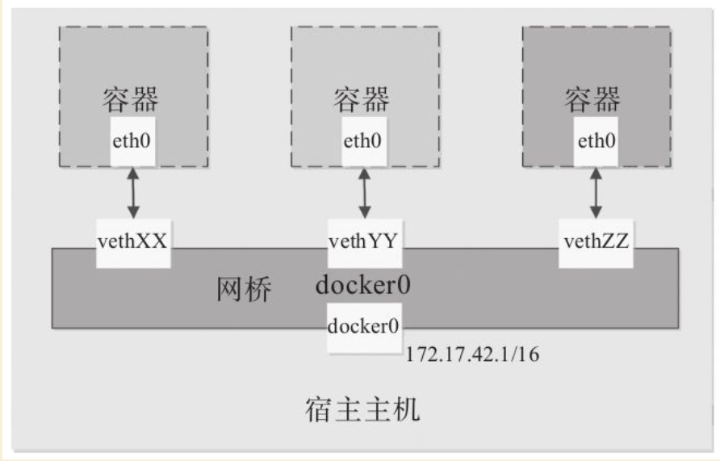

.. contents::
   :depth: 3
..

高级网络功能
============

1.启动与配置参数
----------------

1.网络启动过程

Docker服务启动时会首先在主机上自动创建一个docker0虚拟网桥，实际上是一个Linux网桥。网桥可以理解为一个软件交换机，负责挂载其上的接口之间进行包转发。

同时，Docker随机分配一个本地未占用的私有网段（在RFC1918中定义）中的一个地址给docker0接口。比如典型的172.17.0.0/16网段，掩码为255.255.0.0。此后启动的容器内的网口也会自动分配一个该网段的地址。

当创建一个Docker容器的时候，同时会创建了一对veth
pair互联接口。当向任一个接口发送包时，另外一个接口自动收到相同的包。互联接口的一端位于容器内，即eth0；另一端在本地并被挂载到docker0网桥，名称以veth开头（例如vethAQI2QT）。通过这种方式，主机可以与容器通信，容器之间也可以相互通信。如此一来，Docker就创建了在主机和所有容器之间一个虚拟共享网络，如图20-1所示

Docker网络连接原理示意图

|image0|

2.网络相关参数

下面是与Docker网络相关的命令参数。其中部分命令选项只有在Docker服务启动的时候才能配置，修改后重启生效，包括：

::

   ·-b BRIDGE or--bridge=BRIDGE：指定容器挂载的网桥；
   ·--bip=CIDR：定制docker0的掩码；
   ·-H SOCKET...or--host=SOCKET...：Docker服务端接收命令的通道；
   ·--icc=true|false：是否支持容器之间进行通信；
   ·--ip-forward=true|false：启用net.ipv4.ip_forward，即打开转发功能；

   ·--iptables=true|false：禁止Docker添加iptables规则；
   ·--mtu=BYTES：容器网络中的MTU。

下面的命令选项既可以在启动服务时指定，也可以Docker容器启动（使用docker[con-tainer]run命令）时候指定。在Docker服务启动的时候指定则会成为默认值，后续执行该命令时可以覆盖设置的默认值：

::

   ·--dns=IP_ADDRESS：使用指定的DNS服务器；
   ·--dns-opt=""：指定DNS选项；
   ·--dns-search=DOMAIN：指定DNS搜索域。

还有些选项只能在docker[container]run命令执行时使用，因为它针对容器的配置：

::

   ·-h HOSTNAME or--hostname=HOSTNAME：配置容器主机名；

   ·-ip=""：指定容器内接口的IP地址；

   ·--link=CONTAINER_NAME：ALIAS：添加到另一个容器的连接；

   ·--net=bridge|none|container：NAME_or_ID|host|user_defined_network：配置容器的桥接模式；

   ·--network-alias：容器在网络中的别名；

   ·-p SPEC or--publish=SPEC：映射容器端口到宿主主机；

   ·-P or--publish-all=true|false：映射容器所有端口到宿主主机。

   其中，--net选项支持以下五种模式：

   ·--net=bridge：默认配置。为容器创建独立的网络命名空间，分配网卡、IP地址等网络配置，并通过veth接口对将容器挂载到一个虚拟网桥（默认为docker0）上；

   ·--net=none：为容器创建独立的网络命名空间，但不进行网络配置，即容器内没有创建网卡、IP地址等；

   ·--net=container：NAME_or_ID：新创建的容器共享指定的已存在容器的网络命名空间，两个容器内的网络配置共享，但其他资源（如进程空间、文件系统等）还是相互隔离的；

   ·--net=host：不为容器创建独立的网络命名空间，容器内看到的网络配置（网卡信息、路由表、Iptables规则等）均与主机上的保持一致。注意其他资源还是与主机隔离的；

   ·--net=user_defined_network：用户自行用network相关命令创建一个网络，同一个网络内的容器彼此可见，可以采用更多类型的网络插件。

2.配置容器DNS和主机名
---------------------

Docker服务启动后会默认启用一个内嵌的DNS服务，来自动解析同一个网络中的容器主机名和地址，如果无法解析，则通过容器内的DNS相关配置进行解析。用户可以通过命令选项自定义容器的主机名和DNS配置，下面分别介绍。

1.相关配置文件

容器中主机名和DNS配置信息可以通过三个系统配置文件来管理：/etc/resolv.conf、/etc/hostname和/etc/hosts。

启动一个容器，在容器中使用mount命令可以看到这三个文件挂载信息：

.. code:: shell

   $ docker run -it ubuntu
   root@75dbd6685305:/# mount
   ...
   /dev/sda on /etc/resolv.conf type ext4 (rw,noatime,errors=remount-ro, data= ordered)
   /dev/sda on /etc/hostname type ext4 (rw,noatime,errors=remount-ro,data=ordered)
   /dev/sda on /etc/hosts type ext4 (rw,noatime,errors=remount-ro,data=ordered)
   ...

Docker启动容器时，会从宿主机上复制/etc/resolv.conf文件，并删除掉其中无法连接到的DNS服务器：

.. code:: shell

   root@75dbd6685305:/# cat /etc/resolv.conf
   nameserver 8.8.8.8
   search my-docker-cloud.com

/etc/hosts文件中默认只记录了容器自身的地址和名称：

::

   root@75dbd6685305:/# cat /etc/hosts
   172.17.0.2  75dbd6685305
   ::1 localhost ip6-localhost ip6-loopback
   127.0.0.1   localhost

/etc/hostname文件则记录了容器的主机名：

::

   root@75dbd6685305:/# cat /etc/hostname
   75dbd6685305

2.容器内修改配置文件

容器运行时，可以在运行中的容器里直接编辑/etc/hosts、/etc/hostname和/etc/resolve.conf文件。但是这些修改是临时的，只在运行的容器中保留，容器终止或重启后并不会被保存下来，也不会被docker
commit提交。

3.通过参数指定

如果用户想要自定义容器的配置，可以在创建或启动容器时利用下面的参数指定，注意一般不推荐与-net=host一起使用，会破坏宿主机上的配置信息：

-  指定主机名-h
   HOSTNAME或者–hostname=HOSTNAME：设定容器的主机名。容器主机名会被写到容器内的/etc/hostname和/etc/hosts。但这个主机名只有容器内能中看到，在容器外部则看不到，既不会在docker
   ps中显示，也不会在其他容器的/etc/hosts中看到；

-  –link=CONTAINER_NAME：ALIAS：记录其他容器主机名。在创建容器的时候，添加一个所连接容器的主机名到容器内/etc/hosts文件中。这样，新建容器可以直接使用主机名与所连接容器通信；

-  –dns=IP_ADDRESS：指定DNS服务器。添加DNS服务器到容器的/etc/resolv.conf中，容器会用指定的服务器来解析所有不在/etc/hosts中的主机名；

-  –dns-option list：指定DNS相关的选项；

-  –dns-search=DOMAIN：指定DNS搜索域。设定容器的搜索域，当设定搜索域为.example.com时，在搜索一个名为host的主机时，DNS不仅搜索host，还会搜索host.example.com。

3.容器访问控制
--------------

容器的访问控制主要通过Linux上的iptables防火墙软件来进行管理和实现。iptables是Linux系统流行的防火墙软件，在大部分发行版中都自带。

1.容器访问外部网络

从前面的描述中，我们知道容器默认指定了网关为docker0网桥上的docker0内部接口。docker0内部接口同时也是宿主机的一个本地接口。因此，容器默认情况下可以访问到宿主机本地网络。如果容器要想通过宿主机访问到外部网络，则需要宿主机进行辅助转发。

在宿主机Linux系统中，检查转发是否打开，代码如下：

::

   $ sudo sysctl net.ipv4.ip_forward
   net.ipv4.ip_forward = 1

如果为0，说明没有开启转发，则需要手动打开：

::

   $ sudo sysctl -w net.ipv4.ip_forward=1

Docker服务启动时会默认开启–ip-forward=true，自动配置宿主机系统的转发规则。

2.容器之间访问

容器之间相互访问需要两方面的支持：

·网络拓扑是否已经连通。默认情况下，所有容器都会连接到docker0网桥上，这意味着默认情况下拓扑是互通的；

·本地系统的防火墙软件iptables是否允许访问通过。这取决于防火墙的默认规则是允许（大部分情况）还是禁止。

下面分两种情况介绍容器间的访问。

（1）访问所有端口

当启动Docker服务时候，默认会添加一条“允许”转发策略到iptables的FORWARD链上。通过配置–icc=true|false（默认值为true）参数可以控制默认的策略。

为了安全考虑，可以在Docker配置文件中配置DOCKER_OPTS=–icc=false来默认禁止容器之间的相互访问。

同时，如果启动Docker服务时手动指定–iptables=false参数，则不会修改宿主机系统上的iptables规则。

（2）访问指定端口

在通过-icc=false禁止容器间相互访问后，仍可以通过–link=CONTAINER_NAME：ALIAS选项来允许访问指定容器的开放端口。

例如，在启动Docker服务时，可以同时使用icc=false–iptables=true参数来配置容器间禁止访问，并允许Docker自动修改系统中的iptables规则。此时，系统中的iptables规则可能是类似如下规则，禁止所有转发流量：

::

   $ sudo iptables -nL
   ...
   Chain FORWARD (policy ACCEPT)
   target     prot opt source               destination
   DROP       all  --  0.0.0.0/0            0.0.0.0/0
   ...

之后，启动容器（docker[container]run）时使用–link=CONTAINER_NAME：ALIAS选项。Docker会在iptable中为两个互联容器分别添加一条ACCEPT规则，允许相互访问开放的端口（取决于Dockerfile中的EXPOSE行）。

此时，iptables的规则可能是类似如下规则：

::

   $ sudo iptables -nL
   ...
   Chain FORWARD (policy ACCEPT)
   target     prot opt source               destination
   ACCEPT     tcp  --  172.17.0.2           172.17.0.3           tcp spt:80
   ACCEPT     tcp  --  172.17.0.3           172.17.0.2           tcp dpt:80
   DROP       all  --  0.0.0.0/0            0.0.0.0/0

注意

–link=CONTAINER_NAME：ALIAS中的CONTAINER_NAME目前必须是Docker自动分配的容器名，或使用–name参数指定的名字。不能为容器-h参数配置的主机名。

4.映射容器端口到宿主主机的实现
------------------------------

默认情况下，容器可以主动访问到外部网络的连接，但是外部网络无法访问到容器。

1.容器访问外部实现

假设容器内部的网络地址为172.17.0.2，本地网络地址为10.0.2.2。容器要能访问外部网络，源地址不能为172.17.0.2，需要进行源地址映射（Source
NAT，SNAT），修改为本地系统的IP地址10.0.2.2。

映射是通过iptables的源地址伪装操作实现的。查看主机nat表上POSTROUTING链的规则。该链负责网包要离开主机前，改写其源地址：

::

   $ sudo iptables -t nat -nvL POSTROUTING
   Chain POSTROUTING (policy ACCEPT 12 packets, 738 bytes)
   pkts bytes target     prot opt in     out     source               destination
   ...
   0     0 MASQUERADE  all  --  *      !docker0  172.17.0.0/16        0.0.0.0/0
   ...

其中，上述规则将所有源地址在172.17.0.0/16网段，且不是从docker0接口发出的流量（即从容器中出来的流量），动态伪装为从系统网卡发出。MASQUERADE行动与传统SNAT行动相比，好处是能动态地从网卡获取地址。

2.外部访问容器实现

容器允许外部访问，可以在docker[container]run时候通过-p或-P参数来启用。

不管用哪种办法，其实也是在本地的iptable的nat表中添加相应的规则，将访问外部IP地址的包进行目标地址DNAT，将目标地址修改为容器的IP地址。

以一个开放80端口的Web容器为例，使用-P时，会自动映射本地49000～49900范围内的随机端口到容器的80端口：

::

   $ iptables -t nat -nvL
   Chain PREROUTING (policy ACCEPT 236 packets, 33317 bytes)
    pkts bytes target    prot opt in     out     source               destination
     567 30236 DOCKER     all  --  *      *        0.0.0.0/0             0.0.0.0/0
               ADDRTYPE match dst-type LOCAL
   Chain DOCKER (2 references)
    pkts bytes target     prot opt in     out           source          destination
     0   0     RETURN    all  --  docker0 *            0.0.0.0/0       0.0.0.0/0
     0   0     RETURN    all  --  br-337120b7e82e *    0.0.0.0/0       0.0.0.0/0
     0   0     DNAT       tcp  --  !docker0 *            0.0.0.0/0       0.0.0.0/0
    tcp dpt:49153 to:172.17.0.2:80
   ...

可以看到，nat表中涉及两条链：PREROUTING链负责包到达网络接口时，改写其目的地址，其中规则将所有流量都转发到DOCKER链；而DOCKER链将所有不是从docker0进来的包（意味着不是本地主机产生），同时目标端口为49153的修改其目标地址为172.17.0.2，目标端口修改为80。

使用-p 80：80时，与上面类似，只是本地端口也为80：

::

   $ iptables -t nat -nvL
   ...
   Chain PREROUTING (policy ACCEPT 236 packets, 33317 bytes)
    pkts bytes target     prot opt in     out     source               destination
     567 30236 DOCKER     all  --  *      *       0.0.0.0/0
               0.0.0.0/0            ADDRTYPE match dst-type LOCAL
   Chain DOCKER (2 references)
    pkts bytes target     prot opt in     out     source               destination
       0     0 DNAT       tcp  --  !docker0 *     0.0.0.0/0            0.0.0.0/0
   tcp dpt:80 to:172.17.0.2:80
   ...

这里有两点需要注意：

-  规则映射地址为0.0.0.0，意味着将接受主机来自所有网络接口上的流量。用户可以通过-p
   IP：host_port：container_port或-p
   IP：：port来指定绑定的外部网络接口，以制定更严格的访问规则；

-  如果希望映射绑定到某个固定的宿主机IP地址，可以在Docker配置文件中指定DOCKER_OPTS=“–ip=IP_ADDRESS”，之后重启Docker服务即可生效。

2.外部访问容器实现

容器允许外部访问，可以在docker[container]run时候通过-p或-P参数来启用。

不管用哪种办法，其实也是在本地的iptable的nat表中添加相应的规则，将访问外部IP地址的包进行目标地址DNAT，将目标地址修改为容器的IP地址。

以一个开放80端口的Web容器为例，使用-P时，会自动映射本地49000～49900范围内的随机端口到容器的80端口：

::

   $ iptables -t nat -nvL
   Chain PREROUTING (policy ACCEPT 236 packets, 33317 bytes)
    pkts bytes target    prot opt in     out     source               destination
     567 30236 DOCKER     all  --  *      *        0.0.0.0/0             0.0.0.0/0
               ADDRTYPE match dst-type LOCAL
   Chain DOCKER (2 references)
    pkts bytes target     prot opt in     out           source          destination
     0   0     RETURN    all  --  docker0 *            0.0.0.0/0       0.0.0.0/0
     0   0     RETURN    all  --  br-337120b7e82e *    0.0.0.0/0       0.0.0.0/0
     0   0     DNAT       tcp  --  !docker0 *            0.0.0.0/0       0.0.0.0/0
    tcp dpt:49153 to:172.17.0.2:80
   ...

可以看到，nat表中涉及两条链：PREROUTING链负责包到达网络接口时，改写其目的地址，其中规则将所有流量都转发到DOCKER链；而DOCKER链将所有不是从docker0进来的包（意味着不是本地主机产生），同时目标端口为49153的修改其目标地址为172.17.0.2，目标端口修改为80。

使用-p 80：80时，与上面类似，只是本地端口也为80：

::

   $ iptables -t nat -nvL
   ...
   Chain PREROUTING (policy ACCEPT 236 packets, 33317 bytes)
    pkts bytes target     prot opt in     out     source               destination
     567 30236 DOCKER     all  --  *      *       0.0.0.0/0
               0.0.0.0/0            ADDRTYPE match dst-type LOCAL
   Chain DOCKER (2 references)
    pkts bytes target     prot opt in     out     source               destination
       0     0 DNAT       tcp  --  !docker0 *     0.0.0.0/0            0.0.0.0/0
   tcp dpt:80 to:172.17.0.2:80
   ...

这里有两点需要注意：

-  规则映射地址为0.0.0.0，意味着将接受主机来自所有网络接口上的流量。用户可以通过-p
   IP：host_port：container_port或-p
   IP：：port来指定绑定的外部网络接口，以制定更严格的访问规则；

-  如果希望映射绑定到某个固定的宿主机IP地址，可以在Docker配置文件中指定DOCKER_OPTS=“–ip=IP_ADDRESS”，之后重启Docker服务即可生效。

5.配置容器网桥
--------------

Docker服务默认会创建一个名称为docker0的Linux网桥（其上有一个docker0内部接口），它在内核层连通了其他的物理或虚拟网卡，这就将所有容器和本地主机都放到同一个物理网络。

用户使用Docker创建多个自定义网络时可能会出现多个容器网桥。

Docker默认指定了docker0接口的IP地址和子网掩码，让主机和容器之间可以通过网桥相互通信，它还给出了MTU（接口允许接收的最大传输单元），通常是1500
B，或宿主主机网络路由上支持的默认值。

这些值都可以在服务启动的时候进行配置：

-  –bip=CIDR：IP地址加掩码格式，例如192.168.1.5/24；
-  –mtu=BYTES：覆盖默认的Docker mtu配置。

也可以在配置文件中配置DOCKER_OPTS，然后重启服务。由于目前Docker网桥是Linux网桥，用户可以使用brctl
show来查看网桥和端口连接信息：

::

   $ sudo brctl show
   bridge name     bridge id               STP enabled     interfaces
   docker0         8000.3a1d7362b4ee       no              veth65f9
                                                vethdda6

``注意``

如果系统中没有自带brctl命令，可以使用\ ``sudo apt-get install bridge-utils``\ 命令来安装（Debian、Ubuntu系列系统）。

每次创建一个新容器的时候，Docker从可用的地址段中选择一个空闲的IP地址分配给容器的eth0端口，并且使用本地主机上docker0接口的IP作为容器的默认网关：

::

   $ docker run -it --rm debian:stable bash
   # ip addr show eth0
   66: eth0@if67: <BROADCAST,MULTICAST,UP,LOWER_UP> mtu 1500 qdisc noqueue state UP group default
       link/ether 02:42:ac:11:00:03 brd ff:ff:ff:ff:ff:ff link-netnsid 0
       inet 172.17.0.3/16 scope global eth0
          valid_lft forever preferred_lft forever
   # ip route
   default via 172.17.0.1 dev eth0
   172.17.0.0/16 dev eth0 proto kernel scope link src 172.17.0.3

目前，Docker不支持在启动容器时候指定IP地址。

   注意

   容器默认使用Linux网桥，用户也可以替换为OpenvSwitch等功能更强大的网桥实现，支持更多的软件定义网络特性。

6.自定义网桥
------------

除了默认的docker0网桥，用户也可以指定其他网桥来连接各个容器。在启动Docker服务的时候，可使用-b
BRIDGE或–bridge=BRIDGE来指定使用的网桥。

如果服务已经运行，就需要先停止服务，并删除旧的网桥：

::

   $ sudo service docker stop
   $ sudo ip link set dev docker0 down
   $ sudo brctl delbr docker0

然后创建一个网桥bridge0：

::

   $ sudo brctl addbr bridge0
   $ sudo ip addr add 192.168.5.1/24 dev bridge0
   $ sudo ip link set dev bridge0 up

查看确认网桥创建并启动：

::

   $ ip addr show bridge0
   4: bridge0: <BROADCAST,MULTICAST> mtu 1500 qdisc noop state UP group default
       link/ether 66:38:d0:0d:76:18 brd ff:ff:ff:ff:ff:ff
       inet 192.168.5.1/24 scope global bridge0
           valid_lft forever preferred_lft forever

配置Docker服务，默认桥接到创建的网桥上：

::

   $ echo 'DOCKER_OPTS="-b=bridge0"' >> /etc/default/docker
   $ sudo service docker start

启动Docker服务：

新建一个容器，可以看到它已经桥接到了bridge0上。

可以继续用brctl show命令查看桥接的信息。另外，在容器中可以使用ip
addr和ip route命令来查看IP地址配置和路由信息。

7.使用OpenvSwitch网桥
---------------------

Docker默认使用的是Linux自带的网桥实现，可以替换为使用功能更强大的Openv-Switch虚拟交换机实现。

1.环境

在debian：stable系统中进行测试。操作流程也适用于RedHat/CentOS系列系统，但少数命令和配置文件可能略有差异。

2.安装Docker

安装最近版本的Docker并启动服务。默认情况下，Docker服务会创建一个名为docker0的Linux网桥，作为连接容器的本地网桥。

可以通过如下命令查看：

.. code:: shell

   $ sudo brctl show
   bridge name     bridge id               STP enabled     interfaces
   docker0         8000.000000000000       no

网桥上内部接口的默认地址一般为172.17.0.1：

.. code:: shell

   $ ifconfig docker0
   docker0   Link encap:Ethernet  HWaddr 02:42:cf:31:5e:f7
             inet addr:172.17.0.1  Bcast:0.0.0.0  Mask:255.255.0.0
             inet6 addr: fe80::42:cfff:fe31:5ef7/64 Scope:Link
             UP BROADCAST RUNNING MULTICAST  MTU:1500  Metric:1
             RX packets:604 errors:0 dropped:0 overruns:0 frame:0
             TX packets:740 errors:0 dropped:0 overruns:0 carrier:0
             collisions:0 txqueuelen:0
             RX bytes:19636 (19.6 KB)  TX bytes:39072 (39.0 KB)

3.安装OpenvSwitch

通过如下命令安装OpenvSwitch：

::

   $ sudo aptitude install openvswitch-switch

测试添加一个网桥br0并查看：

::

   $ sudo ovs-vsctl add-br br0
   $ sudo ovs-vsctl show
   20d0b972-e323-4e3c-9e66-1d8bb57c7ff5
       Bridge ovs-br
           Port ovs-br
               Interface br0
                   type: internal
       ovs_version: "2.0.2"

4.配置容器连接到OpenvSwitch网桥

目前OpenvSwitch网桥还不能直接支持挂载容器，需要手动在OpenvSwitch网桥上创建虚拟网口并挂载到容器中。操作方法如下。

（1）创建无网口容器

启动一个容器，并指定不创建网络，后面我们手动添加网络。较新版本的Docker默认不允许在容器内修改网络配置，需要在run的时候指定参数-privileged=true：

::

   $ docker run --net=none --privileged=true -it debian:stable bash
   root@298bbb17c244:/#

记住这里容器的id为298bbb17c244。

此时在容器内查看网络信息，只能看到一个本地网卡lo：

::

   root@298bbb17c244:/# ifconfig
   lo        Link encap:Local Loopback
             inet addr:127.0.0.1  Mask:255.0.0.0
             inet6 addr: ::1/128 Scope:Host
             UP LOOPBACK RUNNING  MTU:65536  Metric:1
             RX packets:0 errors:0 dropped:0 overruns:0 frame:0
             TX packets:0 errors:0 dropped:0 overruns:0 carrier:0
             collisions:0 txqueuelen:0
             RX bytes:0 (0.0 B)  TX bytes:0 (0.0 B)

（2）手动为容器添加网络

下载OpenvSwitch项目提供的支持Docker容器的辅助脚本ovs-docker：

::

   $ wget https://github.com/openvswitch/ovs/raw/master/utilities/ovs-docker
   $ sudo chmod a+x ovs-docker

为容器添加网卡，并挂载到br0上，命令如下：

::

   $ sudo ./ovs-docker add-port br0 eth0 298bbb17c244 --ipaddress=172.17.0.2/16

添加成功后，在容器内查看网络信息，多了一个新添加的网卡eth0，以及对应添加的IP地址：

::

   root@298bbb17c244:/# ifconfig
   eth0      Link encap:Ethernet  HWaddr ae:3d:75:2c:18:ba
             inet addr:172.17.0.2  Bcast:172.17.255.255  Mask:255.255.0.0
             inet6 addr: fe80::ac3d:75ff:fe2c:18ba/64 Scope:Link
             UP BROADCAST RUNNING MULTICAST  MTU:1500  Metric:1
             RX packets:187 errors:0 dropped:2 overruns:0 frame:0
             TX packets:11 errors:0 dropped:0 overruns:0 carrier:0
             collisions:0 txqueuelen:1000
             RX bytes:33840 (33.8 KB)  TX bytes:1170 (1.1 KB)
   lo        Link encap:Local Loopback
             inet addr:127.0.0.1  Mask:255.0.0.0
             inet6 addr: ::1/128 Scope:Host
             UP LOOPBACK RUNNING  MTU:65536  Metric:1
             RX packets:0 errors:0 dropped:0 overruns:0 frame:0
             TX packets:0 errors:0 dropped:0 overruns:0 carrier:0
             collisions:0 txqueuelen:0
             RX bytes:0 (0.0 B)  TX bytes:0 (0.0 B)

在容器外，配置OpenvSwitch的网桥br0内部接口地址为172.17.0.1/16（只要与所挂载容器IP在同一个子网内即可）：

::

   $ sudo ifconfig br0 172.17.0.1/16

（3）测试连通

经过上面步骤，容器已经连接到了网桥br0上了，拓扑如下所示：

::

   容器（172.17.0.2/16）<-> br0网桥<-> br0内部端口（172.17.0.1/16）

此时，在容器内就可以测试是否连通到网桥br0上了：

::

   root@298bbb17c244:/# ping 172.17.0.1
   PING 172.17.0.1 (172.17.0.1) 56(84) bytes of data.
   64 bytes from 172.17.0.1: icmp_seq=1 ttl=64 time=0.874 ms
   64 bytes from 172.17.0.1: icmp_seq=2 ttl=64 time=0.079 ms
   ^C
   --- 172.17.0.1 ping statistics ---
   2 packets transmitted, 2 received, 0% packet loss, time 1001ms
   rtt min/avg/max/mdev = 0.079/0.476/0.874/0.398 ms

在容器内也可以配置默认网关为br0接口地址：

::

   root@298bbb17c244:/# route add default gw 172.17.0.1

删除该接口的命令为：

::

   $ sudo ./ovs-docker del-port br0 eth0 <CONTAINER_ID>

另外，用户也可以直接使用支持OpenvSwitch的容器云平台（如Kubernetes、OpenStack等）来自动化这一过程。

8.创建一个点到点连接
--------------------

在默认情况下，Docker会将所有容器连接到由docker0提供的虚拟网络中。

用户有时候需要两个容器之间可以直连通信，而不用通过主机网桥进行桥接。解决办法很简单：创建一对peer接口，分别放到两个容器中，配置成点到点链路类型即可。

下面笔者将通过手动操作完成Docker配置容器网络的过程。

首先启动两个容器：

::

   $ docker run -i -t --rm --net=none debian:stable /bin/bash
   root@1f1f4c1f931a:/#
   $ docker run -i -t --rm --net=none debian:stable /bin/bash
   root@12e343489d2f:/#

找到进程号，然后创建网络命名空间的跟踪文件：

::

   $ docker [container] inspect -f '{{.State.Pid}}' 1f1f4c1f931a
   2989
   $ docker [container] inspect -f '{{.State.Pid}}' 12e343489d2f
   3004
   $ sudo mkdir -p /var/run/netns
   $ sudo ln -s /proc/2989/ns/net /var/run/netns/2989
   $ sudo ln -s /proc/3004/ns/net /var/run/netns/3004

创建一对peer接口：

::

   $ sudo ip link add A type veth peer name B

添加IP地址和路由信息：

::

   $ sudo ip link set A netns 2989
   $ sudo ip netns exec 2989 ip addr add 10.1.1.1/32 dev A
   $ sudo ip netns exec 2989 ip link set A up
   $ sudo ip netns exec 2989 ip route add 10.1.1.2/32 dev A
   $ sudo ip link set B netns 3004
   $ sudo ip netns exec 3004 ip addr add 10.1.1.2/32 dev B
   $ sudo ip netns exec 3004 ip link set B up
   $ sudo ip netns exec 3004 ip route add 10.1.1.1/32 dev B

现在这两个容器就可以相互ping通，并成功建立连接。点到点链路不需要子网和子网掩码。此外，也可以不指定–net=none来创建点到点链路。这样容器还可以通过原先的网络来通信。

利用类似的办法，可以创建一个只跟主机通信的容器。但是一般情况下，更推荐使用–icc=false命令来关闭容器之间的通信。

本章小结
--------

本章具体讲解了使用Docker网络的一些高级部署和操作配置，包括配置启动参数、DNS、容器的访问控制管理等。并介绍了Docker网络相关的一些工具和项目。

网络是一个十分复杂的领域，所涉及的学科和技术门类众多，包括软件、硬件、系统、协议等等。要在大规模复杂场景下提供稳定的网络服务，要求运营者对于整个网络栈的管理都要到位。

Docker最初基于操作系统上的本地网络支持技术，较快提供了基本的网络支持。随着Docker越来越多地应用在各种分布式环境，网络方面的需求越来越复杂，容器网络目前已经成为了云计算领域的关键技术。

如何结合已有的网络虚拟化技术来解决容器网络的问题，仍将是未来云计算领域值得持续探讨的重点技术话题。下一章将介绍Docker标准化的插件式网络方案：libnetwork。

