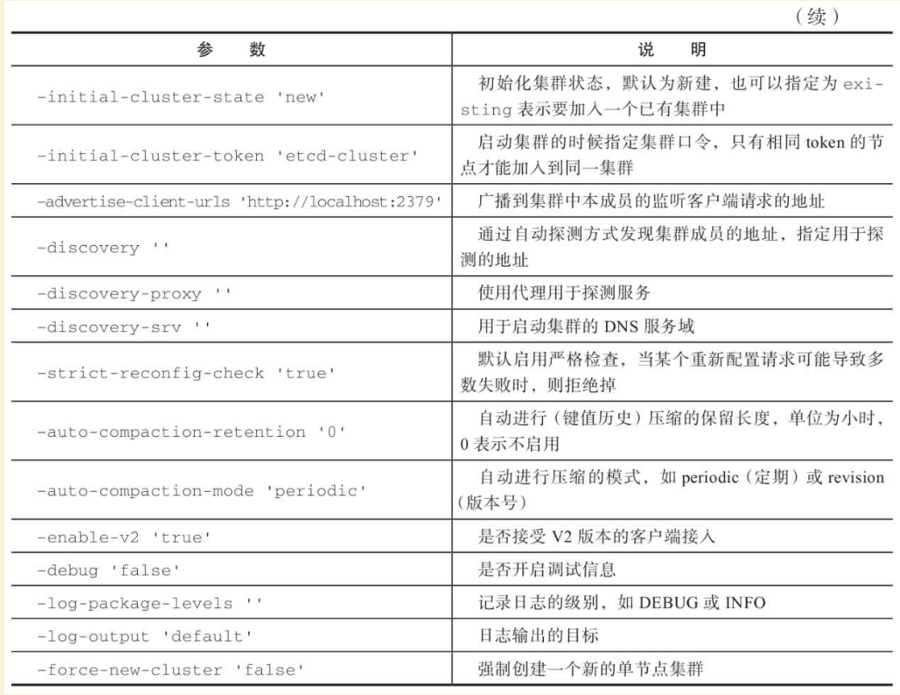
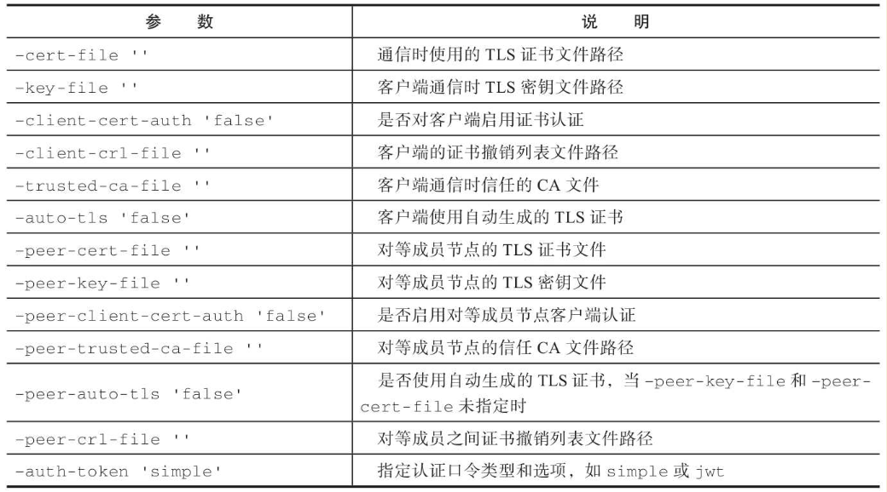
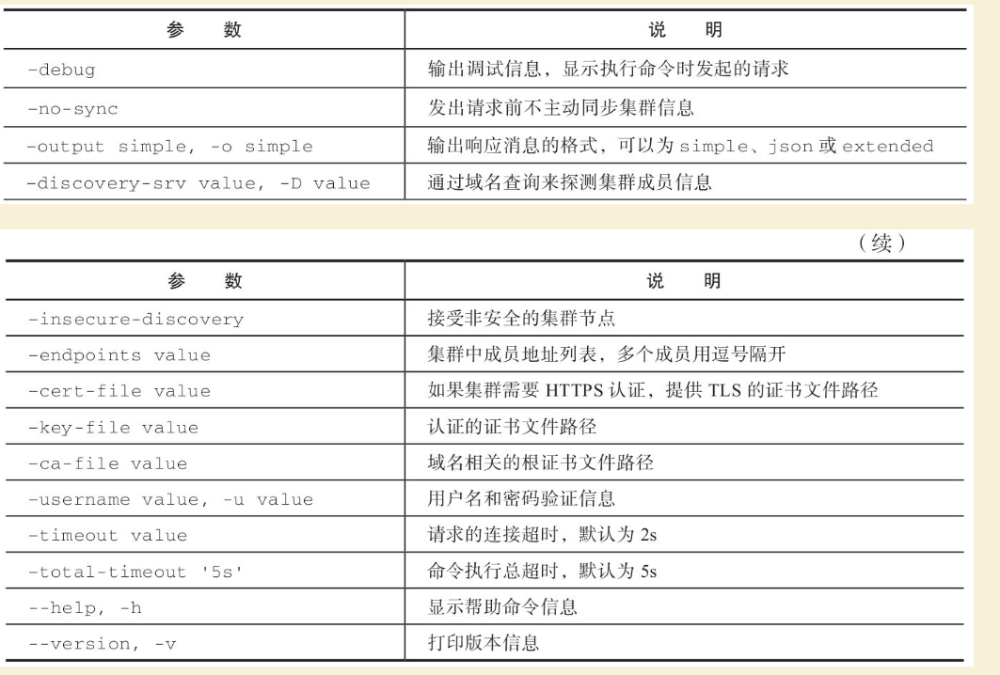

# Etcd高可用的键值数据库

Etcd是CoreOS团队（同时发起了CoreoS、Rocket等热门项目）发起的一个开源分布式键值仓库项目，可以用于分布式系统中的配置信息管理和服务发现（service discovery），目前已经被广泛应用到大量开源项目中，包括Kubernetes、CloudFoundry、CoreOS Fleet和Salesforce等。

在这一章里面，笔者将详细介绍该项目的相关知识，包括安装和使用，以及集群管理的相关知识等。


## 1.Etcd简介

Etcd是CoreOS团队于2013年6月发起的开源项目，它的目标是构建一个高可用的分布式键值（key-value）仓库，遵循Apache v2许可，基于Go语言实现。


接触过分布式系统的读者应该知道，分布式系统中最基本的问题之一就是实现信息的共识，在此基础上才能实现对服务配置信息的管理、服务的发现、更新、同步，等等。而要解决这些问题，往往需要利用一套能保证一致性的分布式数据库系统，比如经典的Apache ZooKeeper项目 [[1\]](http://reader.epubee.com/books/mobile/5e/5ed586449ceaa3f619488a147cd76a01/text00171.html#ch1_back) ，采用了Paxos算法来实现数据的强一致性。

Etcd专门为集群环境设计，采用了更为简洁的Raft共识算法 [[2\]](http://reader.epubee.com/books/mobile/5e/5ed586449ceaa3f619488a147cd76a01/text00171.html#ch2_back) ，同样可以实现数据强一致性，并支持集群节点状态管理和服务自动发现等。

Etcd目前在github.com/coreos/etcd进行维护，最新为3.x系列版本。

受到Apache ZooKeeper项目和doozer项目（doozer是一个一致性分布式数据库实现，主要面向少量数据，更多信息可以参考<https://github.com/ha/doozerd> ）的启发，Etcd在进行设计的时候重点考虑了下面四个要素：

·简单：支持RESTful API和gRPC API；

·安全：基于TLS方式实现安全连接访问；

·快速：支持每秒一万次的并发写操作，超时控制在毫秒量级；

·可靠：支持分布式结构，基于Raft算法实现一致性。

通常情况下，用户使用Etcd可以在多个节点上启动多个实例，并将它们添加为一个集群。同一个集群中的Etcd实例将会自动保持彼此信息的一致性，这意味着分布在各个节点上的应用也将获取到一致的信息。


[[1\]](http://reader.epubee.com/books/mobile/5e/5ed586449ceaa3f619488a147cd76a01/text00171.html#ch1) Apache ZooKeeper是一套知名的分布式系统中进行同步和一致性管理的工具。

[[2\]](http://reader.epubee.com/books/mobile/5e/5ed586449ceaa3f619488a147cd76a01/text00171.html#ch2) Raft是一套通过选举主节点来实现分布式系统一致性的算法，相比于大名鼎鼎的Paxos算法，它的算法过程相对容易理解，由Stanford大学的Diego Ongaro和John Ousterhout 提出。更多细节可以参考https://raftconsensus.github.io。


## 2.安装和使用Etcd

Etcd基于Go语言实现，因此，用户可以从项目主页：<https://github.com/coreos/etcd> 下载源代码自行编译（最新版本需要Go 1.9以上版本），也可以下载编译好的二进制文件，甚至直接使用制作好的Docker镜像文件来体验。

下面分别讲解基于二进制文件和Docker镜像两种方式，步骤都十分简单。

1.二进制文件方式

（1）下载和安装

编译好的二进制文件都在github.com/coreos/etcd/releases页面，用户可以选择需要的版本，或通过下载工具下载。

例如，下面的命令使用curl工具下载压缩包，并解压到本地：

   

```shell
$ curl -L https://github.com/coreos/etcd/releases/download/v3.3.1/etcd-v3.3.1-linux-amd64.tar.gz | tar xzvf
```

   

解压后，可以看到文件包括若干二进制文件和文档文件：

   

```shell
$ cd etcd-v3.3.1-linux-amd64
$ ls
Documentation  etcd  etcdctl  README-etcdctl.md  README.md  READMEv2-etcdctl.md
```

   

其中etcd是服务主文件，etcdctl是提供给用户的命令客户端，其他都是文档文件。

 注意

某些版本中还含有etcd-migrate二进制文件，可以协助进行旧版本的迁移。

通过下面的命令将所需要的二进制文件都放到系统可执行路径/usr/local/bin/下：

   

```shell
$ sudo cp etcd* /usr/local/bin/
```

   

Etcd安装到此完成。

（2）使用Etcd

下面将先以单节点模式为例讲解Etcd支持的功能和操作。

可通过如下命令查看etcd的版本信息：

   

```shell
$ etcd --version
etcd Version: 3.3.1
Git SHA: 28f3f26c0
Go Version: go1.9.4
Go OS/Arch: linux/amd64
```

   

接下来，直接执行Etcd命令，将启动一个服务节点，监听在本地的2379（客户端请求端口）和2380（其他节点连接端口）。

显示类似如下的信息：

   

```shell
$ etcd
13:20:36.559979 I | etcdmain: etcd Version: 3.3.1
13:20:36.560467 I | etcdmain: Git SHA: 28f3f26c0
13:20:36.560687 I | etcdmain: Go Version: go1.9.4
13:20:36.560890 I | etcdmain: Go OS/Arch: linux/amd64
13:20:36.561118 I | etcdmain: setting maximum number of CPUs to 1, total number of available CPUs is 1
13:20:36.561414 W | etcdmain: no data-dir provided, using default data-dir ./default.etcd
13:20:36.562055 I | embed: listening for peers on http://localhost:2380
13:20:36.562414 I | embed: listening for client requests on localhost:2379
13:20:36.572548 I | etcdserver: name = default
...
```

   

此时，可以通过REST API直接查看集群健康状态：

   

```shell
$ curl -L http://127.0.0.1:2379/health
{"health": "true"}
```

   

当然，也可以使用自带的etcdctl命令进行查看（实际上是封装了REST API调用）：

   

```shell
$ etcdctl cluster-health
member ce2a822cea30bfca is healthy: got healthy result from http://localhost:2379
cluster is healthy
```

   

通过etcdctl设置和获取键值也十分方便，例如设置键值对testkey："hello world"：

   

```shell
$ etcdctl set testkey "hello world"
hello world
$ etcdctl get testkey
hello world
```

   

说明键值对已经设置成功了。

当然，除了etcdctl命令外，也可以直接通过HTTP访问本地2379端口的方式来进行操作，例如查看testkey的值：

   

```shell
$ curl -L -X PUT http://localhost:2379/v2/keys/testkey -d value="hello world"
{"action":"set","node":{"key":"/testkey","value":"hello world","modifiedIndex":5, "createdIndex":5},"prevNode":{"key":"/testkey","value":"hello world","modifiedIndex":4,"createdIndex":4}}
$ curl -L http://localhost:2379/v2/keys/testkey
{"action":"get","node":{"key":"/testkey","value":"hello world","modifiedIndex":5, "createdIndex":5}}
```

   

注意目前API版本为v2，将来出了新版本后，API路径中则对应为新版本号。

2.Docker镜像方式下载

以Etcd 3.3.1为例，镜像名称为quay.io/coreos/etcd：v3.3.1，可以通过下面的命令启动etcd服务监听到本地的2379和2380端口：

   

```shell
$ docker run \
    -p 2379:2379 \
    -p 2380:2380 \
    -v /etc/ssl/certs/:/etc/ssl/certs/
    quay.io/coreos/etcd:v3.3.1
```

   

3.数据目录

作为数据库，最重要的自然是数据存放位置。Etcd默认创建的本地数据目录为${name}.etcd，其中${name}为节点别名。默认情况下本地数据路径为default.etcd。

用户也可以通过--data-dir选项来指定本地数据存放的位置，下面命令指定Etcd节点别名为test，数据存放目录为test.etcd：

   

```
$ etcd --name "test" --data-dir test.etcd
```

   

查看数据目录下内容：

   

```
$ tree test.etcd
test.etcd
└── member
    ├── snap
    │   └── db
    └── wal
        ├── 0000000000000000-0000000000000000.wal
        └── 0.tmp
3 directories, 3 files
```

   

其中，snap目录下将定期记录节点的状态快照信息，wal目录下则记录数据库的操作日志信息（可以通过--wal-dir参数来指定存放到特定目录）。

4.服务启动参数

Etcd服务启动的时候支持一些参数，用户可以通过这些参数来调整服务和集群的行为。

另外，参数可以通过环境变量形式传入，命名全部为大写并且加ETCD_前缀，例如ETCD_NAME='etcd-cluster'。主要参数包括：通用参数、节点参数、集群参数、代理参数、安全参数。

（1）通用参数

这些参数主要跟节点自身配置相关，参见表22-1。

表22-1　Etcd通用参数


（2）节点参数

这些参数跟节点行为有关，参见表22-2。

表22-2　Etcd节点参数


（3）集群参数

这些参数跟集群行为有关，参见表22-3。

表22-3　Etcd集群参数




（4）代理参数

这些参数主要是当Etcd服务自身仅作为代理模式时候使用，即转发来自客户端的请求到指定的Etcd集群。此时，Etcd服务本身并不参与集群中去，不保存数据和参加选举。其中的参数参见表22-4。

表22-4　Etcd代理参数


（5）安全参数

这些参数主要用于指定通信时候的TLS证书、密钥配置，参见表22-5。

表22-5　Etcd安全参数



## 3.使用客户端命令

etcdctl是Etcd官方提供的命令行客户端，它支持一些基于HTTP API封装好的命令，供用户直接跟Etcd服务打交道，而无须基于API的方式。当然，这些命令跟API实际上是对应的，最终效果上并无不同之处。

某些情况下使用etcdctl十分方便。例如用户需要对Etcd服务进行简单测试或者手动来修改数据库少量内容；也推荐在刚接触Etcd时通过etcdctl命令来熟悉服务相关功能。

Etcd项目二进制发行包中已经包含了etcdctl工具，没有的话，可以从github.com/coreos/etcd/releases手动下载。

etcdctl的命令格式为：

   

```
$ etcdctl [ 全局选项] 命令 [ 命令选项] [ 命令参数]
```

   

全局选项参数见表22-6。

表22-6　etcdctl命令全局选项参数



支持的命令大体上分为：数据类操作和非数据类操作。

Etcd作为一个分布式数据库，与ZooKeeper类似，采用了类似文件目录的结构，数据类操作基本围绕对文件（即某个键）或目录进行。大家可以对比Linux的文件和目录操作命令，可以发现两者之间的相似性。

数据类操作命令见表22-7。

表22-7　Etcd数据类操作命令


非数据类操作命令见表22-8，主要是Etcd提供的系统配置、权限管理等。

表22-8　Etcd非数据类操作命令


下面分别来看各个操作的主要用法和功能。

## 4.数据类操作

数据类操作围绕对键值和目录的CRUD（符合REST风格的一套操作：Create）完整生命周期的管理。

Etcd在键的组织上十分灵活。用户指定的键可以为只有一级的名字，如testkey，此时实际上都直接放在根目录/下面，也可以为指定层次化目录结构（类似于ZooKeeper），如cluster1/node2/testkey，则将创建相应的目录结构。

` 提示`

CRUD即Create，Read，Update，Delete，是符合REST风格的一套API操作规范。

1.set

设置某个键的值为给定值。例如：

   

```shell
$ etcdctl set /testdir/testkey "Hello world"
Hello world
```

   

支持的选项包括：

·-ttl value：键值的超时时间（单位为秒），不配置（默认为0）则永不超时；

·-swap-with-value value：若该键现在的值是value，则进行设置操作；

·-swap-with-index value：若该键现在的索引值是指定索引，则进行设置操作，默认值为0。

` 注意`

--ttl选项十分有用。在分布式环境中，系统往往是不可靠的，在基于Etcd设计分布式锁的时候，可以通过超时时间避免出现发生死锁的情况。

2.get

获取指定键的值。例如：

   

```shell
$ etcdctl set testkey hello
hello
$ etcdctl update testkey world
world
```

   

当键不存在时，则会报错。例如：

   

```shell
$ etcdctl get testkey2
Error: 100: Key not found (/testkey2) [1]
```

   

支持的选项为：

·-sort：对返回结果进行排序；

·-quorum，-q：需要从大多数处得到结果。

3.update

当键存在时，更新值内容。例如：

   

```shell
$ etcdctl set testkey hello
hello
$ etcdctl update testkey world
world
```

   

当键不存在时，则会报错。例如：

   

```shell
$ etcdctl update testkey2 world
Error:  100: Key not found (/testkey2) [1]
```

   

支持的选项为-ttl‘0’：超时时间（单位为秒），默认为0，意味着永不超时。

4.mk

如果给定的键不存在，则创建一个新的键值。例如：

   

```shell
$ etcdctl mk /testdir/testkey "Hello world"
Hello world
```

   

当键存在的时候，执行该命令会报错，例如：

   

```shell
$ etcdctl set testkey "Hello world"
Hello world
$ ./etcdctl mk testkey "Hello world"
Error:  105: Key already exists (/testkey) [2]
```

   

支持的选项为：

·-in-order：创建按顺序的键值；

·-ttl'0'：超时时间（单位为秒），默认值为0，意味着永不超时。

5.rm

删除某个键值。例如：

   

```shell
$ etcdctl rm testkey
```

   

当键不存在时，则会报错。例如：

   

```shell
$ etcdctl rm testkey2
Error: 100: Key not found (/testkey2) [8]
```

   

支持的选项为：

```
·-dir：如果键是个空目录或者是键值对则删除；
·-recursive，-r：删除目录和所有子键；
·-with-value value：检查现有的值是否匹配；
·-with-index value：检查现有的index是否匹配，默认值为0。
```

6.watch

监测一个键值的变化，一旦键值发生更新，就会输出最新的值并退出。

例如，用户更新testkey键值为Hello world：

   

```shell
$ etcdctl watch testkey
Hello world
```

   

支持的选项包括：

```shell
·-forever，-f：一直监测，直到用户按CTRL+C退出；
·-after-index value：在指定index之前一直监测，默认为0；
·-recursive，-r：返回所有的键值和子键值。
```

7.exec-watch

监测一个键值的变化，一旦键值发生更新，就执行给定命令。这个功能十分强大，很多时候可以用于实时根据键值更新本地服务的配置信息，并重新加载服务。可以实现分布式应用配置的自动分发。

例如，一旦检测到testkey键值被更新，则执行ls命令：

   

```shell
$ etcdctl exec-watch testkey -- sh -c 'ls'
default.etcd
Documentation
etcd
etcdctl
etcd-migrate
README-etcdctl.md
README.md
```

   

支持的选项包括：

```
·-after-index value：在指定index之前一直监测，默认为0；
·-recursive，-r：返回所有的键值和子键值。
```

8.ls

列出目录（默认为根目录）下的键或者子目录，默认不显示子目录中内容。例如：

   

```shell
$ etcdctl set testkey 'hi'
hi
$ etcdctl set dir/test 'hello'
hello
$ etcdctl ls
/testkey
/dir
$ etcdctl ls dir
/dir/test
```

   

支持的选项包括：

```
·-sort：将输出结果排序；
·-recursive，-r：如果目录下有子目录，则递归输出其中的内容；
·-p：对于输出为目录，在最后添加/进行区分；
·-quorum，-q：需要从大多数节点返回结果。
```

9.mkdir

如果给定的键目录不存在，则创建一个新的键目录。例如：

   

```shell
$ etcdctl mkdir testdir
```

   

当键目录存在的时候，执行该命令会报错，例如：

   

```shell
$ etcdctl mkdir testdir
$ etcdctl mkdir testdir
Error:  105: Key already exists (/testdir) [7]
```

   

支持的选项为-ttl value：超时时间（单位为秒），默认值为0，意味着永不超时。

10.rmdir

删除一个空目录，或者键值对。若目录不空，会报错，例如：

   

```shell
$ etcdctl set /dir/testkey hi
hi
$ etcdctl rmdir /dir
Error:  108: Directory not empty (/dir) [13]
```

   

11.setdir

创建一个键目录，无论存在与否。实际上，目前版本当目录已经存在的时候会报错，例如：

   

```shell
$ etcdctl setdir /test/test
$ etcdctl ls --recursive
/test
/test/test
```

   

支持的选项为-ttl value：超时时间（单位为秒），默认值为0，意味着永不超时。

12.updatedir

更新一个已经存在的目录的属性（目前只有存活时间），例如：

   

```shell
$ etcdctl mkdir /test/test --ttl 100
$ etcdctl updatedir /test/test --ttl 200
```

   

支持的选项为-ttl value：超时时间（单位为秒），默认值为0，意味着永不超时。

## 5.非数据类操作

非数据类操作不直接对数据本身进行管理，而是负责围绕集群自身的一些配置。

1.backup

备份Etcd的配置状态数据目录。

支持的选项包括：

```shell
·-data-dir value：要进行备份的Etcd的数据存放目录；
·-wal-dir value：要进行备份的Etcd wal数据路径；
·-backup-dir value：备份数据到指定路径；
·-backup-wal-dir value：备份wal数据到指定路径；
·-with-v3：备份v3版本数据。
```

例如，备份默认配置的信息到当前路径下的tmp子目录：

   

```
$ etcdctl backup --data-dir default.etcd --backup-dir tmp
```

   

可以查看tmp目录下面多了一个member目录：

   

```
$ ls tmp/member
snap wal
```

   

其中，snap为快照目录，保存节点状态快照文件（注意这些快照文件定期生成）；wal保存了数据库预写日志（write ahead log）信息。

`注意`

预写日志要求数据库在发生实际提交前必须先将操作写入日志，可以保障系统在崩溃后根据日志回复状态。


2.cluster-health

查看Etcd集群的健康状态。例如：

   

```
$ etcdctl cluster-health
member ce2a822cea30bfca is healthy: got healthy result from http://localhost:2379
cluster is healthy
```

   

支持的选项包括-forever，-f：每隔10秒钟检查一次，直到手动终止(通过Ctrl+C命令)。


3.member

通过list、add、remove等子命令列出、添加、删除Etcd实例到Etcd集群中。例如，本地启动一个Etcd服务实例后，可以用如下命令进行查看默认的实例成员：

   

```
$ etcdctl member list
ce2a822cea30bfca: name=default peerURLs=http://localhost:2380,http://local-host:7001 clientURLs=http://localhost:2379,http://localhost:4001
```

   

4.user

对用户进行管理，包括一系列子命令：

·add：添加一个用户；

·get：查询用户细节；

·list：列出所有用户；

·remove：删除用户；

·grant：添加用户到角色；

·revoke：删除用户的角色；

·passwd：修改用户的密码。

默认情况下，需要先创建（启用）root用户作为etcd集群的最高权限管理员：

   

```shell
$ etcdctl user add root
New password:
```

   

创建一个testuser用户，会提示输入密码：

   

```shell
$ etcdctl user add testuser
New password:
```

   

分配某些已有角色给用户：

   

```shell
$ etcdctl user grant testuser -roles testrole
```

   

5.role

对用户角色进行管理，包括一系列子命令：

```
·add：添加一个角色；
·get：查询角色细节；
·list：列出所有用户角色；
·remove：删除用户角色；
·grant：添加路径到角色控制，可以为read、write或者readwrite；
·revoke：删除某路径的用户角色信息。
```

默认带有root、guest两种角色，前者为全局最高权限，后者为不带验证情况下的用户。例如：

   

```shell
$ etcdctl role add testrole
$ etcdctl role grant testrole -path '/key/*' -read
```

   

6.auth

是否启用访问验证。enable为启用，disable为禁用。例如，在root用户创建后，启用认证：

   

```shell
$ etcdctl auth enable
```

## 6.Etcd集群管理

Etcd的集群也采用了典型的“主-从”模型，通过Raft协议来保证在一段时间内有一个节点为主节点，其他节点为从节点。一旦主节点发生故障，其他节点可以自动再重新选举出新的主节点。

与其他分布式系统类似，集群中节点个数推荐为奇数个，最少为3个，此时quorum为2，越多节点个数自然能提供更多的冗余性，但同时会带来写数据性能的下降。

**注意**

在分布式系统中有一个很重要的概念：quorum，意味着一个集群正常工作需要能参加投票的节点个数的最小值，非拜占庭容错情况下为集群的一半再加一。

### 6.1构建集群

构建集群无非是让节点们知道自己加入了哪个集群，其他对等节点的访问信息是啥。

Etcd支持两种模式来构建集群：静态配置和动态发现。

#### 1.静态配置集群信息

顾名思义，静态配置就是提取写好集群中的有关信息。例如，假设读者想要用三个节点来构建一个集群，地址分别为：

| 节点  | 地址     |
| ----- |    -- |
| Node1 | 10.0.0.1 |
| Node2 | 10.0.0.2 |
| Node3 | 10.0.0.3 |

首先在各个节点上将地址和别名信息添加到/etc/hosts：

   

```shell
10.0.0.1 Node1
10.0.0.2 Node2
10.0.0.3 Node3
```

   

可以通过如下命令来启动各个节点上的etcd服务，分别命名为n1、n2和n3。

在节点1上，执行如下命令：

   

```shell
$ etcd --name n1 \
    --initial-cluster-token cluster1 \
    --initial-cluster-state new \
    --listen-client-urls http://Node1:2379,http://localhost:2379 \
    --listen-peer-urls http://Node1:2380 \
    --advertise-client-urls http://Node1:2379 \
    --initial-advertise-peer-urls http://Node1:2380 \
    --initial-cluster n1=http://Node1:2380,n2=http://Node2:2380,n3=http://Node3:2380
```

   

在节点2上，执行：

   

```shell
$ etcd --name n2 \
    --initial-cluster-token cluster1 \
    --initial-cluster-state new \
    --listen-client-urls http://Node2:2379,http://localhost:2379 \
    --listen-peer-urls http://Node2:2380 \
    --advertise-client-urls http://Node2:2379 \
    --initial-advertise-peer-urls http://Node2:2380 \
    --initial-cluster n1=http://Node1:2380,n2=http://Node2:2380,n3=http://Node3:2380
```

   

在节点3上，执行：

   

```shell
$ etcd --name n3 \
    --initial-cluster-token cluster1 \
    --initial-cluster-state new \
    --listen-client-urls http://Node3:2379,http://localhost:2379 \
    --listen-peer-urls http://Node3:2380 \
    --advertise-client-urls http://Node3:2379 \
    --initial-advertise-peer-urls http://Node3:2380 \
    --initial-cluster n1=http://Node1:2380,n2=http://Node2:2380,n3=http://Node3:2380
```

   

成功后，可以在任一节点上通过etcdctl来查看当前集群中的成员信息：

   

```shell
$ etcdctl member list 228428dce5a59f3b: name=n3 peerURLs=http://Node3:2380 client-URLs=http://Node3:2379
5051932762b33d8e: name=n1 peerURLs=http://Node1:2380 clientURLs=http://Node1:2379
8ee612d82821a4e7: name=n2 peerURLs=http://Node2:2380 clientURLs=http://Node2:2379
```

#### 2.动态发现

静态配置的方法虽然简单，但是如果节点信息需要变动的时候，就需要手动进行修改。

很自然想到，可以通过动态发现的方法，让集群自动更新节点信息。要实现动态发现，首先需要一套支持动态发现的服务。

CoreOS提供了一个公开的Etcd发现服务，地址在[https://discovery.etcd.io](https://discovery.etcd.io/) 。使用该服务的步骤也十分简单，介绍如下。

首先，为要创建的集群申请一个独一无二的uuid，需要提供的唯一参数为集群中节点的个数：

   

```
$ curl https://discovery.etcd.io/new?size=3
https://discovery.etcd.io/7f66dc8d468a1c940969a8c329ee329a
```

   

返回的地址就是该集群要实现动态发现的独一无二的地址。分别在各个节点上指定服务发现地址信息，替代掉原先动态指定的节点列表。

在节点1上，执行：

   

```
$ etcd --name n1 \
    --initial-cluster-token cluster1 \
    --initial-cluster-state new \
    --listen-client-urls http://Node1:2379,http://localhost:2379 \
    --listen-peer-urls http://Node1:2380 \
    --advertise-client-urls http://Node1:2379 \
    --initial-advertise-peer-urls http://Node1:2380 \
    --discovery https://discovery.etcd.io/7f66dc8d468a1c940969a8c329ee329a
```

   

在节点2上，执行：

   

```
$ etcd --name n2 \
    --initial-cluster-token cluster1 \
    --initial-cluster-state new \
    --listen-client-urls http://Node2:2379,http://localhost:2379 \
    --listen-peer-urls http://Node2:2380 \
    --advertise-client-urls http://Node2:2379 \
    --initial-advertise-peer-urls http://Node2:2380 \
    --discovery https://discovery.etcd.io/7f66dc8d468a1c940969a8c329ee329a
```

   

在节点3上，执行：

   

```
$ etcd --name n3 \
    --initial-cluster-token cluster1 \
    --initial-cluster-state new \
    --listen-client-urls http://Node3:2379,http://localhost:2379 \
    --listen-peer-urls http://Node3:2380 \
    --advertise-client-urls http://Node3:2379 \
    --initial-advertise-peer-urls http://Node3:2380 \
    --discovery https://discovery.etcd.io/7f66dc8d468a1c940969a8c329ee329a
```

   

当然，用户也可以配置私有的服务。

另外一种实现动态发现的机制是通过DNS域名，即为每个节点指定同一个子域的域名，然后通过域名发现来自动注册。例如，三个节点的域名分别为：

·n1.mycluster.com

·n2.mycluster.com

·n3.mycluster.com

则启动参数中的集群节点列表信息可以替换为-discovery-srv mycluster.com。

### 6.2集群参数配置

影响集群性能的因素可能有很多，包括时间同步、网络抖动、存储压力、读写压力，等等，需要通过优化配置尽量减少这些因素的影响。

#### 1.时钟同步

对于分布式集群来说，各个节点上的同步时钟十分重要，Etcd集群需要各个节点时钟差异不超过1s，否则可能会导致Raft协议的异常。

因此，各个节点要启动同步时钟协议。以Ubuntu系统为例：

   

```
$ sudo aptitude install ntp
$ sudo service ntp restart
```

   

用户也可以修改/etc/ntp.conf文件，来指定NTP服务器地址，建议多个节点采用统一的配置。

#### 2.心跳消息时间间隔和选举时间间隔

对于Etcd集群来说，有两个因素十分重要：心跳消息时间间隔和选举时间间隔。前者意味着主节点每隔多久通过心跳消息来通知从节点自身的存活状态；后者意味着从节点多久没收到心跳通知后可以尝试发起选举自身为主节点。显然，后者要比前者大，一般建议设为前者的5倍以上。时间越短，发生故障后恢复越快，但心跳信息占用的计算和网络资源也越多。

默认情况下，心跳消息间隔为100ms。选举时间间隔为1s（上限为50s，但完全没必要这么长）。这个配置在本地局域网环境下是比较合适的，但是对于跨网段的情况，需要根据节点之间的RTT适当进行调整。

可以在启动服务时候通过-heartbeat-interval和-election-timeout参数来指定。

例如，一般情况下，跨数据中心的集群可以配置为：

   

```
$ etcd -heartbeat-interval=200 -election-timeout=2000
```

   

也可通过环境变量指定：

   

```
$ ETCD_HEARTBEAT_INTERVAL=100 ETCD_ELECTION_TIMEOUT=500 etcd
```

   

对于跨地域的网络（例如中美之间的数据中心RTT往往在数百ms），还可以适当延长。

#### 3.snapshot频率

Etcd会定期将数据的修改存储为snapshot，默认情况下每10 000次修改才会存一个snapshot。在存储的时候会有大量数据进行写入，影响Etcd的性能。建议将这个值调整的小一些，例如每提交2000个事务就做一次snapshot：

   

```
$ etcd -snapshot-count=2000
```

   

也可通过环境变量指定：

   

```
ETCD_SNAPSHOT_COUNT=2000 etcd
```

   

#### 4.修改节点

无论是添加、删除还是迁移节点，都要一个一个地进行，并且确保先修改配置信息（包括节点广播的监听地址、集群中节点列表等），然后再进行操作。

例如要删除多个节点，当有主节点要被删除时，需要先删掉一个，等集群中状态稳定（新的主节点重新生成）后，再删除另外节点。

要迁移或替换节点的时候，先将节点从集群中删除掉，等集群状态重新稳定后，再添加上新的节点。当然，使用旧节点的数据目录文件会加快新节点的同步过程，但是要保证这些数据是完整的，且是比较新的。

#### 5.节点恢复

Etcd集群中的节点会通过数据目录来存放修改信息和集群配置。

一般来说，当某个节点出现故障时候，本地数据已经过期甚至格式破坏。如果只是简单地重启进程，容易造成数据的不一致。这个时候，保险的做法是先通过命令（例如etcdctl member rm[member]）来删除该节点，然后清空数据目录，再重新作为空节点加入。

Etcd提供了-strict-reconfig-check选项，确保当集群状态不稳定时候（例如启动节点数还不够达到quorum）拒绝对配置状态的修改。

#### 6.重启集群

极端情况下，集群中大部分节点都出现问题，需要重启整个集群。

这个时候，最保险的办法是找到一个数据记录完整且比较新的节点，先以它为唯一节点创建新的集群，然后将其他节点一个一个地添加进来，添加过程中注意保证集群的稳定性。

## 本章小结

本章介绍了强大的分布式键值仓库Etcd，包括如何利用它进行读写数据等操作，以及Etcd集群管理的一些要点。Etcd提供了很多有用的功能，包括数据监听、定期快照等。

通过实践案例，可以看出Etcd的功能十分类似于ZooKeeper，但作为后起之秀，它在REST接口支持、访问权限管理、大量数据存储方面表现更为优秀。同时，提供了多种语言（目前包括Python、Go、Java等）实现的客户端支持。基于Etcd，用户可以很容易实现集群中的配置管理和服务发现等复杂功能。类似的项目还包括Consul等。