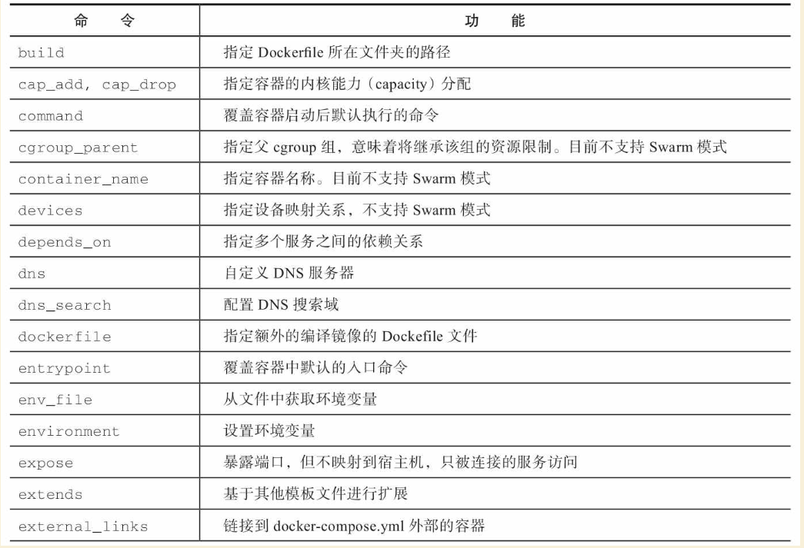
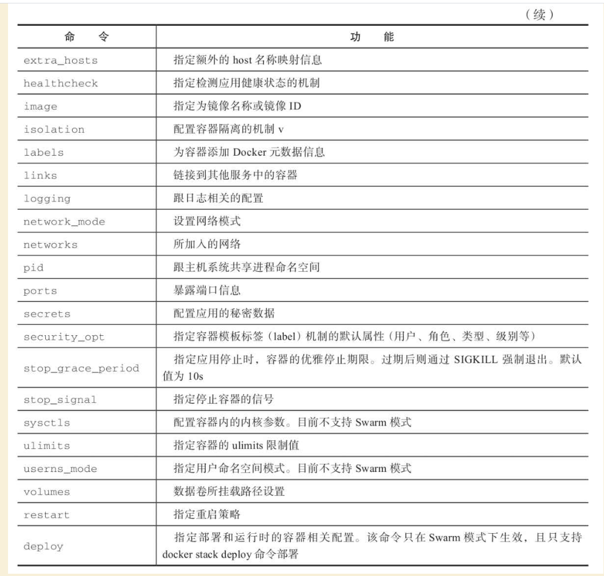
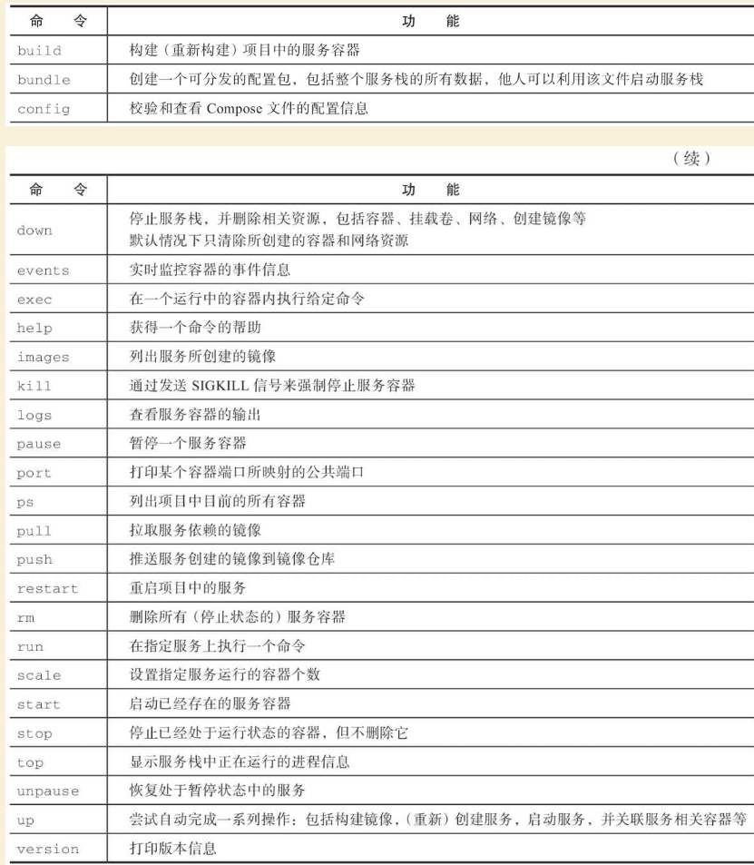
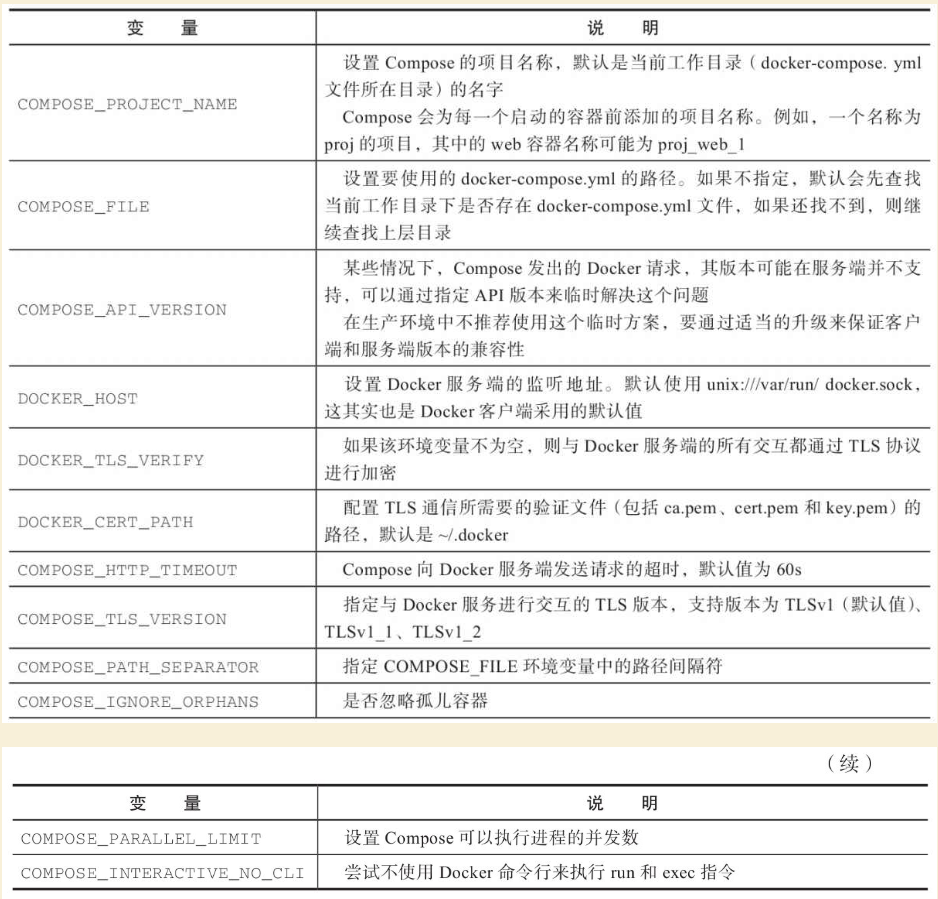

# Docker三剑客之Docker-Compose
Compose项目是Docker官方的开源项目，负责实现对基于Docker容器的多应用服务的快速编排。从功能上看，跟OpenStack中的Heat十分类似。其代码目前在<https://github.com/docker/compose> 上开源。


## 简介
Compose定位是“定义和运行多个Docker容器的应用”，其前身是开源项目Fig，目前仍然兼容Fig格式的模板文件。

通过第一部分中的介绍，读者已经知道使用一个Dockerfile模板文件，可以让用户很方便地定义一个单独的应用容器。然而，在日常工作中，经常会碰到需要多个容器相互配合来完成某项任务的情况。例如要实现一个Web项目，除了Web服务容器本身，往往还需要再加上后端的数据库服务容器，甚至还包括前端的负载均衡容器等。

Compose恰好满足了这样的需求。它允许用户通过一个单独的docker-compose.yml模板文件（YAML格式）来定义一组相关联的应用容器为一个服务栈（stack）。


Compose中有几个重要的概念：

·任务（task）：一个容器被称为一个任务。任务拥有独一无二的ID，在同一个服务中的多个任务序号依次递增。

·服务（service）：某个相同应用镜像的容器副本集合，一个服务可以横向扩展为多个容器实例。

·服务栈（stack）：由多个服务组成，相互配合完成特定业务，如Web应用服务、数据库服务共同构成Web服务栈，一般由一个docker-compose.yml文件定义。

Compose的默认管理对象是服务栈，通过子命令对栈中的多个服务进行便捷的生命周期管理。

Compose项目由Python编写，实现上调用了Docker服务提供的API来对容器进行管理。因此，只要所操作的平台支持Docker API，就可以在其上利用Compose来进行编排管理。


## Docker Compose常见场景

（1）开发或本地环境运行多个服务。

Compose命令行工具可用于创建环境并与之交互。比如通过Compose文件，配置所有应用程序的服务依赖（数据库、消息队列、高速缓存、Web服务的API等），然后使用单个命令（docker-compose up）为每个依赖项创建和启动一个或多个容器，使整个程序能够正常运行起来。


（2）自动化测试环境。任何持续部署或持续集成过程的一个重要部分都是自动化测试套件。自动化端到端测试需要一个运行测试的环境。Compose提供了一种方便的方法来创建和销毁隔离的测试环境。我们只需要通过Compose文件即可定义完整环境，并且可以在几个命令中创建和销毁这些环境。

```
# 执行compose启动命令
docker-compose up -d

# 执行自动化测试脚本
./run_tests

# 执行compose销毁命令
docker-compose down
```


## 安装与卸载

Compose目前支持Linux和Mac OS平台，两者的安装过程大同小异。安装Compose之前，要先安装Docker引擎，请参考第一部分中章节，在此不再赘述。

Compose可以通过Python的pip工具进行安装，可以直接下载编译好的二进制文件使用，甚至直接运行在Docker容器中。前两种方式是传统方式，适合本地环境下安装使用；最后一种方式则不破坏系统环境，更适合云计算场景。

### 1.pip安装

这种方式是将Compose当作一个Python应用从PyPI源中安装。

执行安装命令：

------

```shell
$ sudo pip install -U docker-compose
```

------

可以看到类似如下输出，说明安装成功：

------

```shell
Collecting docker-compose
    Downloading docker_compose-1.19.0-py2.py3-none-any.whl (115kB)
...
Successfully installed cached-property-1.3.1 certifi-2018.1.18 chardet-3.0.4 docker-2.7.0 docker-compose-1.19.0 docker-pycreds-0.2.2 idna-2.6 ipaddress-1.0.19 requests-2.18.4 six-1.10.0 texttable-0.9.1 urllib3-1.22 websocket-client-0.47.0
```

------

安装成功后，可以查看docker-compose命令的基本用法：

------

```shell
$ docker-compose -h
Define and run multi-container applications with Docker.
Usage:
    docker-compose [-f <arg>...] [options] [COMMAND] [ARGS...]
    docker-compose -h|--help
Options:
    -f, --file FILE             Specify an alternate compose file (default: docker-compose.yml)
    -p, --project-name NAME     Specify an alternate project name (default: dir-ectory name)
    --verbose                   Show more output
    --no-ansi                   Do not print ANSI control characters
    -v, --version               Print version and exit
    -H, --host HOST             Daemon socket to connect to
    --tls                       Use TLS; implied by --tlsverify
    --tlscacert CA_PATH         Trust certs signed only by this CA
    --tlscert CLIENT_CERT_PATH  Path to TLS certificate file
    --tlskey TLS_KEY_PATH       Path to TLS key file
    --tlsverify                 Use TLS and verify the remote
    --skip-hostname-check       Don't check the daemon's hostname against the name specified
                                in the client certificate (for example if your docker host
                                is an IP address)
    --project-directory PATH    Specify an alternate working directory
                                (default: the path of the Compose file)
Commands:
    build              Build or rebuild services
    bundle             Generate a Docker bundle from the Compose file
    config             Validate and view the Compose file
    create             Create services
    down               Stop and remove containers, networks, images, and volumes
    events             Receive real time events from containers
    exec               Execute a command in a running container
    help               Get help on a command
    images             List images
    kill               Kill containers
    logs               View output from containers
    pause              Pause services
    port               Print the public port for a port binding
    ps                 List containers
    pull               Pull service images
    push               Push service images
    restart            Restart services
    rm                 Remove stopped containers
    run                Run a one-off command
    scale              Set number of containers for a service
    start              Start services
    stop               Stop services
    top                Display the running processes
    unpause            Unpause services
    up                 Create and start containers
    version            Show the Docker-Compose version information
```

------

之后，可以添加bash补全命令：

------

```shell
$ curl -L https://raw.githubusercontent.com/docker/compose/1.19.0/contrib/com-pletion/bash/docker-compose > /etc/bash_completion.d/docker-compose
```

------

### 2.二进制包

官方定义编译好二进制包，供大家使用。这些发布的二进制包可以在<https://github.com/docker/compose/releases> 页面找到。

将这些二进制文件下载后直接放到执行路径下，并添加执行权限即可。例如，在Linux平台上：

------

```shell
$ sudo curl -L "https://github.com/docker/compose/releases/download/1.26.0/docker-compose-$(uname -s)-$(uname -m)" -o /usr/local/bin/docker-compose

$ sudo chmod a+x /usr/local/bin/docker-compose
```

------

可以使用docker-compose version命令来查看版本信息，以测试是否安装成功：

------

```shell
$ docker-compose version
docker-compose version 1.19.0, build 9e633ef
docker-py version: 2.7.0
CPython version: 2.7.12
OpenSSL version: OpenSSL 1.0.2g  1 Mar 2016
```

------

参考文献
[centos7安装docker-compose](https://www.cnblogs.com/xiao987334176/p/12377113.html)


### 3.容器中执行

Compose既然是一个Python应用，自然也可以直接用容器来执行它：

------

```shell
$ curl -L https://github.com/docker/compose/releases/download/1.19.0/run.sh > /usr/local/bin/docker-compose
$ chmod +x /usr/local/bin/docker-compose
```

------

实际上，查看下载的run.sh脚本内容，如下：

------

```shell
set -e
VERSION="1.19.0"
IMAGE="docker/compose:$VERSION"
# Setup options for connecting to docker host
if [ -z "$DOCKER_HOST" ]; then
    DOCKER_HOST="/var/run/docker.sock"
fi
if [ -S "$DOCKER_HOST" ]; then
    DOCKER_ADDR="-v $DOCKER_HOST:$DOCKER_HOST -e DOCKER_HOST"
else
    DOCKER_ADDR="-e DOCKER_HOST -e DOCKER_TLS_VERIFY -e DOCKER_CERT_PATH"
fi
# Setup volume mounts for compose config and context
if [ "$(pwd)" != '/' ]; then
    VOLUMES="-v $(pwd):$(pwd)"
fi
if [ -n "$COMPOSE_FILE" ]; then
    compose_dir=$(dirname $COMPOSE_FILE)
fi
# TODO: also check --file argument
if [ -n "$compose_dir" ]; then
    VOLUMES="$VOLUMES -v $compose_dir:$compose_dir"
fi
if [ -n "$HOME" ]; then
    VOLUMES="$VOLUMES -v $HOME:$HOME -v $HOME:/root" # mount $HOME in /root to share docker.config
fi
# Only allocate tty if we detect one
if [ -t 1 ]; then
    DOCKER_RUN_OPTIONS="-t"
fi
if [ -t 0 ]; then
    DOCKER_RUN_OPTIONS="$DOCKER_RUN_OPTIONS -i"
fi
exec docker run --rm $DOCKER_RUN_OPTIONS $DOCKER_ADDR $COMPOSE_OPTIONS $VOLUMES -w "$(pwd)" $IMAGE "$@"
```

------

可以看到，它其实是下载了docker/compose镜像并运行。


如果下载很慢，可以去 daocloud 上面下载：

> http://get.daocloud.io/


### 4.卸载

如果是二进制包方式安装的，删除二进制文件即可：

------

```shell
$ sudo rm /usr/local/bin/docker-compose
```

------

如果是通过Python pip工具安装的，则可以执行如下命令删除：

------

```shell
$ sudo pip uninstall docker-compose
```

## Compose模板文件

模板文件是使用Compose的核心，涉及的指令关键字也比较多。但大家不用担心，这里的大部分指令与docker[container]create|run相关参数的含义都是类似的。

默认的模板文件名称为docker-compose.yml，格式为YAML格式，目前最新的版本为v3。

版本1的Compose文件结构十分简单，每个顶级元素为服务名称，次级元素为服务容器的配置信息，例如：

------

```
webapp:
    image: examples/web
    ports:
        - "80:80"
    volumes:
        - "/data"
```

------

版本2和3扩展了Compose的语法，同时尽量保持跟旧版本的兼容，除了可以声明网络和存储信息外，最大的不同一是添加了版本信息，另一个是需要将所有的服务放到services根下面。

例如，上面例子改写为版本3，并启用资源限制，内容如下：

------

```yaml
version:"3"
services:
    webapp:
        image: examples/web
        deploy:
            replicas: 2
            resources:
                limits:
                    cpus: "0.1"
                    memory: 100M
                restart_policy:
                    condition: on-failure
        ports:
            - "80:80"
        networks:
            - mynet
        volumes:
            - "/data"
networks:
    mynet:
```

------

注意每个服务都必须通过image指令指定镜像或build指令（需要Dockerfile）等来自动构建生成镜像。

如果使用build指令，在Dockerfile中设置的选项（例如：CMD、EXPOSE、VOLUME、ENV等）将会自动被获取，无须在docker-compose.yml中再次设置。

命令列表参见表24-1。

表24-1　Compose模板文件主要命令








Compose 文件格式有几个版本——1、2、2.x 和3. x

此表显示了哪些撰写文件版本支持特定的 Docker 版本。

参考文献：
https://docs.docker.com/compose/compose-file/compose-versioning/


下面介绍部分指令的用法。

可以参考菜鸟教程：
https://www.runoob.com/docker/docker-compose.html

1.build

指定Dockerfile所在文件夹的路径（可以是绝对路径，或者相对docker-compose.yml文件的路径）。Compose将会利用它自动构建应用镜像，然后使用这个镜像，例如：

------

```yaml
version: '3'
services:
    app:
        build: /path/to/build/dir
```

------

build指令还可以指定创建镜像的上下文、Dockerfile路径、标签、Shm大小、参数和缓存来源等，例如：

------

```yaml
version: '3'
services:
    app:
        build:
            context: /path/to/build/dir
            dockerfile: Dockerfile-app
            labels:
                version: "2.0"
                released: "true"
            shm_size: '2gb'
            args:
                key: value
                name: myApp
            cache_from:
                - myApp:1.0
```

------

2.cap_add，cap_drop

指定容器的内核能力（capacity）分配。例如，让容器拥有所有能力可以指定为：

------

```
cap_add:
    - ALL
```

------

去掉NET_ADMIN能力可以指定为：

------

```
cap_drop:
    - NET_ADMIN
```

------

3.command

覆盖容器启动后默认执行的命令，可以为字符串格式或JSON数组格式。例如：

------

```shell
command: echo "hello world"
```

------

或者：

------

```shell
command: ["bash", "-c", "echo", "hello world"]
```

------

4.configs

在Docker Swarm模式下，可以通过configs来管理和访问非敏感的配置信息。支持从文件读取或外部读取。例如：

------

```yaml
version: "3.3"
services:
    app:
        image: myApp:1.0
        deploy:
            replicas: 1
        configs:
            - file_config
            - external_config
configs:
    file_config:
        file: ./config_file.cfg
    external_config:
        external: true
```

------

5.cgroup_parent

指定父cgroup组，意味着将继承该组的资源限制。目前不支持在Swarm模式中使用。例如，创建了一个cgroup组名称为cgroups_1：

------

```
cgroup_parent: cgroups_1
```

------

6.container_name

指定容器名称。默认将会使用“项目名称_服务名称_序号”这样的格式。目前不支持在Swarm模式中使用。例如：

------

```
container_name: docker-web-container
```

------

需要注意，指定容器名称后，该服务将无法进行扩展，因为Docker不允许多个容器实例重名。

7.devices

指定设备映射关系，不支持Swarm模式。例如：

------

```
devices:
    - "/dev/ttyUSB1:/dev/ttyUSB0"
```

------

8.depends_on

指定多个服务之间的依赖关系。启动时，会先启动被依赖服务。例如，可以指定依赖于db服务：

------

```
depends_on: db
```

------

9.dns

自定义DNS服务器。可以是一个值，也可以是一个列表。例如：

------

```
dns: 8.8.8.8
dns:
    - 8.8.8.8
    - 9.9.9.9
```

------

10.dns_search

配置DNS搜索域。可以是一个值，也可以是一个列表。例如：

------

```yaml
dns_search: example.com
dns_search:
    - domain1.example.com
    - domain2.example.com
```

------

11.dockerfile

如果需要，指定额外的编译镜像的Dockefile文件，可以通过该指令来指定。例如：

------

```shell
dockerfile: Dockerfile-alternate
```

------

注意

该指令不能跟image同时使用，否则Compose将不知道根据哪个指令来生成最终的服务镜像。

12.entrypoint

覆盖容器中默认的入口命令。注意，也会取消掉镜像中指定的入口命令和默认启动命令。例如，覆盖为新的入口命令：

------

```
entrypoint: python app.py
```

------


13.env_file

从文件中获取环境变量，可以为单独的文件路径或列表。如果通过docker-compose-f FILE方式来指定Compose模板文件，则env_file中变量的路径会基于模板文件路径。如果有变量名称与environment指令冲突，则按照惯例，以后者为准。例如：

------

```yaml
env_file: .env
env_file:
    - ./common.env
    - ./apps/web.env
    - /opt/secrets.env
```

------

环境变量文件中每一行必须符合格式，支持#开头的注释行，例如：

------

```
# common.env: Set development environment
PROG_ENV=development
```

------

14.environment

设置环境变量，可以使用数组或字典两种格式。只给定名称的变量会自动获取运行Compose主机上对应变量的值，可以用来防止泄露不必要的数据。例如：

------

```yaml
environment:
    RACK_ENV: development
    SESSION_SECRET:
```

------

或者：

------

```yaml
environment:
    - RACK_ENV=development
    - SESSION_SECRET
```

------

注意，如果变量名称或者值中用到true|false，yes|no等表达布尔含义的词汇，最好放到引号里，避免YAML自动解析某些内容为对应的布尔语义：

<http://yaml.org/type/bool.html>中给出了这些特定词汇，包括

------

```
y|Y|yes|Yes|YES|n|N|no|No|NO
|true|True|TRUE|false|False|FALSE
|on|On|ON|off|Off|OFF
```

------

15.expose

暴露端口，但不映射到宿主机，只被连接的服务访问。仅可以指定内部端口为参数，如下所示：

------

```yaml
expose:
    - "3000"
    - "8000"
```

------

16.extends

基于其他模板文件进行扩展。例如，我们已经有了一个webapp服务，定义一个基础模板文件为common.yml，如下所示：

------

```yaml
# common.yml
webapp:
    build: ./webapp
    environment:
        - DEBUG=false
        - SEND_EMAILS=false
```

------

再编写一个新的development.yml文件，使用common.yml中的webapp服务进行扩展：

------

```yaml
# development.yml
web:
    extends:
        file: common.yml
        service: webapp
    ports:
        - "8000:8000"
    links:
        - db
    environment:
        - DEBUG=true
db:
    image: postgres
```

------

后者会自动继承common.yml中的webapp服务及环境变量定义。使用extends需要注意以下两点：

·要避免出现循环依赖，例如A依赖B，B依赖C，C反过来依赖A的情况。

·extends不会继承links和volumes_from中定义的容器和数据卷资源。

一般情况下，推荐在基础模板中只定义一些可以共享的镜像和环境变量，在扩展模板中具体指定应用变量、链接、数据卷等信息。

17.external_links

链接到docker-compose.yml外部的容器，甚至并非Compose管理的外部容器。参数格式跟links类似。

------

```yaml
external_links:
    - redis_1
    - project_db_1:mysql
    - project_db_1:postgresql
```

------

18.extra_hosts

类似Docker中的--add-host参数，指定额外的host名称映射信息。

例如：

------

```yaml
extra_hosts:
    - "googledns:8.8.8.8"
    - "dockerhub:52.1.157.61"
```

------

会在启动后的服务容器中/etc/hosts文件中添加如下两条条目。

------

```yaml
8.8.8.8 googledns
52.1.157.61 dockerhub
```

------

19.healthcheck

指定检测应用健康状态的机制，包括检测方法（test）、间隔（interval）、超时（timeout）、重试次数（retries）、启动等待时间（start_period）等。

例如，指定检测方法为访问8080端口，间隔为30秒，超时为15秒，重试3次，启动后等待30秒再做检查。

------

```yaml
healthcheck:
    test: ["CMD", "curl", "-f", "http://localhost:8080"]
    interval: 30s
    timeout: 15s
    retries: 3
    start_period: 30s
```

------

20.image

指定为镜像名称或镜像ID。如果镜像在本地不存在，Compose将会尝试拉去这个镜像。

例如：

------

```
image: ubuntu
image: orchardup/postgresql
image: a4bc65fd
```

------

21.isolation

配置容器隔离的机制，包括default、process和hyperv。

22.labels

为容器添加Docker元数据（metadata）信息。例如可以为容器添加辅助说明信息。

------

```
labels:
    com.startupteam.description: "webapp for a startup team"
    com.startupteam.department: "devops department"
    com.startupteam.release: "rc3 for v1.0"
```

------

23.links

注意：links命令属于旧的用法，可能在后续版本中被移除。

链接到其他服务中的容器。使用服务名称（同时作为别名）或服务名称：服务别名（SERVICE：ALIAS）格式都可以。

------

```
links:
    - db
    - db:database
    - redis
```

------

使用的别名将会自动在服务容器中的/etc/hosts里创建。例如：

------

```
172.17.2.186  db
172.17.2.186  database
172.17.2.187  redis
```

------

被链接容器中相应的环境变量也将被创建。

24.logging

跟日志相关的配置，包括一系列子配置。

logging.driver：类似于Docker中的--log-driver参数，指定日志驱动类型。目前支持三种日志驱动类型：

------

```
driver: "json-file"
driver: "syslog"
driver: "none"
```

------

logging.options：日志驱动的相关参数。例如：

------

```
logging:
    driver: "syslog"
    options:
        syslog-address: "tcp://192.168.0.42:123"
```

------

或：

------

```
logging:
    driver: "json-file"
    options:
        max-size: "1000k"
        max-file: "20"
```

------

25.network_mode

设置网络模式。使用和docker client的--net参数一样的值。

------

```
network_mode: "none"
network_mode: "bridge"
network_mode: "host"
network_mode: "service:[service name]"
network_mode: "container:[name or id]"
```

------

26.networks

所加入的网络。需要在顶级的networks字段中定义具体的网络信息。

例如，指定web服务的网络为web_net，并添加服务在网络中别名为web_app。

------

```yaml
services:
    web:
        networks:
            web_net：
                aliases: web_app
            ipv4_address: 172.16.0.10
networks:
    web_net:
        driver: bridge
        enable_ipv6: true
        ipam:
            driver: default
            config:
                subnet: 172.16.0.0/24
```

------

27.pid

跟主机系统共享进程命名空间。打开该选项的容器之间，以及容器和宿主机系统之间可以通过进程ID来相互访问和操作。

------

```
pid: "host"
```

------

28.ports

暴露端口信息。

使用宿主：容器（HOST：CONTAINER）格式，或者仅仅指定容器的端口（宿主将会随机选择端口）都可以。

------

```yaml
ports:
    - "3000"
    - "8000:8000"
    - "49100:22"
    - "127.0.0.1:8001:8001"
```

------

或者：

------

```
ports:
    - target: 80
      published: 8080
      protocol: tcp
      mode: ingress
```

注意

当使用HOST：CONTAINER格式来映射端口时，如果你使用的容器端口小于60并且没放到引号里，可能会得到错误结果，因为YAML会自动解析xx：yy这种数字格式为60进制。为避免出现这种问题，建议数字串都采用引号包括起来的字符串格式。

29.secrets

配置应用的秘密数据。

可以指定来源秘密、挂载后名称、权限等。

例如：

------

```
version: "3.1"
services:
    web:
        image: webapp:stable
        deploy:
            replicas: 2
        secrets:
            - source: web_secret
              target: web_secret
              uid: '103'
              gid: '103'
              mode: 0444
secrets:
    web_secret:
        file: ./web_secret.txt
```

------

30.security_opt

指定容器模板标签（label）机制的默认属性（用户、角色、类型、级别等）。

例如，配置标签的用户名和角色名：

------

```
security_opt:
    - label:user:USER
    - label:role:ROLE
```

------

31.stop_grace_period

指定应用停止时，容器的优雅停止期限。过期后则通过SIGKILL强制退出。

默认值为10s。

32.stop_signal

指定停止容器的信号，默认为SIGTERM。

33.sysctls

配置容器内的内核参数。Swarm模式中不支持。

例如，指定连接数为4096和开启TCP的syncookies：

------

```
sysctls:
    net.core.somaxconn: 4096
    net.ipv4.tcp_syncookies: 1
```

------

34.ulimits

指定容器的ulimits限制值。

例如，指定最大进程数为65535，指定文件句柄数为20000（软限制，应用可以随时修改，不能超过硬限制）和40000（系统硬限制，只能root用户提高）。

------

```
ulimits:
    nproc: 65535
    nofile:
      soft: 20000
      hard: 40000
```

------

35.userns_mode

指定用户命名空间模式。Swarm模式中不支持。例如，使用主机上的用户命名空间：

------

```
userns_mode: "host"
```

------

36.volumes

数据卷所挂载路径设置。可以设置宿主机路径（HOST：CONTAINER）或加上访问模式（HOST：CONTAINER：ro）。

支持driver、driver_opts、external、labels、name等子配置。

该指令中路径支持相对路径。例如

------

```
volumes:
    - /var/lib/mysql
    - cache/:/tmp/cache
    - ~/configs:/etc/configs/:ro
```

------

或者可以使用更详细的语法格式：

------

```
volumes:
    - type: volume
        source: mydata
        target: /data
        volume:
            nocopy: true
volumes:
    mydata:
```

------

37.restart

指定重启策略，可以为no（不重启）、always（总是）、on-failure（失败时）、unless-stopped（除非停止）。

注意Swarm模式下要使用restart_policy。在生产环境中推荐配置为always或者unless-stopped。

例如，配置除非停止：

------

```
restart: unless-stopped
```

------

38.deploy

指定部署和运行时的容器相关配置。该命令只在Swarm模式下生效，且只支持docker stack deploy命令部署。

例如：

------

```
version: '3'
services:
    redis:
        image: web:stable
        deploy:
            replicas: 3
            update_config:
                parallelism: 2
                delay: 10s
            restart_policy:
                condition: on-failure
```

------

deploy命令中包括endpoint_mode、labels、mode、placement、replicas、resources、restart_policy、update_config等配置项。

（1）endpoint_mode

指定服务端点模式。包括两种类型：

vip：Swarm分配一个前端的虚拟地址，客户端通过给地址访问服务，而无须关心后端的应用容器个数；

dnsrr：Swarm分配一个域名给服务，用户访问域名时候回按照轮流顺序返回容器地址。

例如：

------

```yaml
version: '3'
services:
    redis:
        image: web:stable
        deploy:
            mode: replicated
            replicas: 3
            endpoint_mode: vip
```

------

（2）labels

指定服务的标签。注意标签信息不会影响到服务内的容器。

例如：

------

```yaml
version: "3"
services:
    web:
        image: web:stable
        deploy:
            labels:
                description: "This is a web application service."
```

------

（3）mode

定义容器副本模式，可以为：

global：每个Swarm节点上只有一个该应用容器；

replicated：整个集群中存在指定份数的应用容器副本，默认值。

例如，指定集群中web应用保持3个副本：

------

```yaml
version: "3"
services:
    web:
        image: web:stable
        deploy:
            mode: replicated
            replicas: 3
```

------

（4）placement

定义容器放置的限制（constraints）和配置（preferences）。限制可以指定只有符合要求的节点上才能运行该应用容器；配置可以指定容器的分配策略。例如，指定集群中web应用容器只存在于高安全的节点上，并且在带有zone标签的节点上均匀分配。：

------

```yaml
version: '3'
services:
    db:
        image: web:stable
        deploy:
            placement:
                constraints:
                    - node.labels.security==high
                preferences:
                    - spread: node.labels.zone
```

------

（5）replicas

容器副本模式为默认的replicated时，指定副本的个数。

（6）resources

指定使用资源的限制，包括CPU、内存资源等。例如，指定应用使用的CPU份额为10%～25%，内存为200 MB到500 MB。

------

```yaml
version: '3'
services:
    redis:
        image: web:stable
        deploy:
            resources:
                limits:
                    cpus: '0.25'
                    memory: 500M
                reservations:
                    cpus: '0.10'
                    memory: 200M
```

------

（7）restart_policy

指定容器重启的策略。例如，指定重启策略为失败时重启，等待2s，重启最多尝试3次，检测状态的等待时间为10s。

------

```yaml
version: "3"
services:
    redis:
        image: web:stable
        deploy:
            restart_policy:
                condition: on-failure
                delay: 2s
                max_attempts: 3
                window: 10s
```

------

（8）update_config

有些时候需要对容器内容进行更新，可以使用该配置指定升级的行为。包括每次升级多少个容器（parallelism）、升级的延迟（delay）、升级失败后的行动（failure_action）、检测升级后状态的等待时间（monitor）、升级后容忍的最大失败比例（max_failure_ratio）、升级顺序（order）等。例如，指定每次更新两个容器、更新等待10s、先停止旧容器再升级。

------

```yaml
version: "3.4"
services:
    redis:
        image: web:stable
        deploy:
            replicas: 2
            update_config:
                parallelism: 2
                delay: 10s
                order: stop-first
```

------

39.其他指令

此外，还有包括domainname、hostname、ipc、mac_address、privileged、read_only、shm_size、stdin_open、tty、user、working_dir等指令，基本跟docker-run中对应参数的功能一致。例如，指定容器中工作目录：

------

```shell
working_dir: /code
```

------

指定容器中搜索域名、主机名、mac地址等：

------

```shell
domainname: your_website.com
hostname: test
mac_address: 08-00-27-00-0C-0A
```

------

允许容器中运行一些特权命令：

------

```shell
privileged: true
```

------

40.读取环境变量

从1.5.0版本开始，Compose模板文件支持动态读取主机的系统环境变量。例如，下面的Compose文件将从运行它的环境中读取变量${MONGO_VERSION}的值（不指定时则采用默认值3.2），并写入执行的指令中。

------

```shell
db:
    image: "mongo:${MONGO_VERSION-3.2}"
```

------

如果直接执行docker-compose up则会启动一个mongo：3.2镜像的容器；如果执行MONGO_VERSION=2.8 docker-compose up则会启动一个mongo：2.8镜像的容器。

41.扩展特性

从3.4开始，Compose还支持用户自定义的扩展字段。利用YAML语法里的锚点引用功能来引用自定义字段内容。例如：

------

```yaml
version: '3.4'
x-logging:
    &default-logging
    options:
        max-size: '10m'
        max-file: '10'
    driver: json-file
services:
    web:
        image: webapp:stable
        logging: *default-logging
```

## Compose命令说明

对于Compose来说，大部分命令的对象既可以是项目本身，也可以指定为项目中的服务或者容器。如果没有特别的说明，命令对象将是项目，这意味着项目中所有的服务都会受到命令影响。

执行docker-compose[COMMAND]--help或者docker-compose help[COMMAND]可以查看具体某个命令的使用格式。

Compose命令的基本的使用格式是：

------

```
docker-compose [-f=<arg>...] [options] [COMMAND] [ARGS...]
```

------

命令选项如下：

```


·-f，--file FILE：指定使用的Compose模板文件，默认为docker-compose.yml，可以多次指定；

·-p，--project-name NAME：指定项目名称，默认将使用所在目录名称作为项目名；

·--verbose：输出更多调试信息；

·-v，--version：打印版本并退出；

·-H，-host HOST：指定所操作的Docker服务地址；

·-tls：启用TLS，如果指定-tlsverify则默认开启；

·-tlscacert CA_PATH：信任的TLS CA的证书；

·-tlscert CLIENT_CERT_PATH：客户端使用的TLS证书；

·-tlskey TLS_KEY_PATH：TLS的私钥文件路径；

·-tlsverify：使用TLS校验连接对方；

·-skip-hostname-check：不使用TLS证书校验对方的主机名；

·-project-directory PATH：指定工作目录，默认为Compose文件所在路径。
```


命令列表见表24-2。

表24-2　Compose命令



### Compose命令使用说明如下

#### 1.build

格式为`docker-compose build [options] [SERVICE...]`。

构建（重新构建）项目中的服务容器。

服务容器一旦构建后，将会带上一个标记名，例如对于Web项目中的一个db容器，可能是web_db。

可以随时在项目目录下运行docker-compose build来重新构建服务。

选项包括：

```
·--force-rm：强制删除构建过程中的临时容器；
·--no-cache：构建镜像过程中不使用cache（这将加长构建过程）；
·--pull：始终尝试通过pull来获取更新版本的镜像；
·-m，-memory MEM：指定创建服务所使用的内存限制；
·-build-arg key=val：指定服务创建时的参数。
```


#### 2.bundle

格式为`docker-compose bundle [options]`。

创建一个可分发（Distributed Application Bundle，DAB）的配置包，包括整个服务栈的所有数据，他人可以利用该文件启动服务栈。

支持选项包括：

```
·-push-images：自动推送镜像到仓库；
·-o，-output PATH：配置包的导出路径。
```


#### 3.config

格式为`docker-compose config [options]`。

校验和查看Compose文件的配置信息。

支持选项包括：

```
·-resolve-image-digests：为镜像添加对应的摘要信息；
·-q，-quiet：只检验格式正确与否，不输出内容；
·-services：打印出Compose中所有的服务信息；
·-volumes：打印出Compose中所有的挂载卷信息；
```


#### 4.down

格式为`docker-compose down [options]`。

停止服务栈，并删除相关资源，包括容器、挂载卷、网络、创建镜像等。

默认情况下只清除所创建的容器和网络资源。

支持选项包括：

```
·-rmi type：指定删除镜像的类型，包括all（所有镜像），local（仅本地）；
·-v，-volumes：删除挂载数据卷；
·-remove-orphans：清除孤儿容器，即未在Compose服务中定义的容器；
·-t，-timeout TIMEOUT：指定超时时间，默认为10s。
```


#### 5.events

格式为`docker-compose events [options] [SERVICE...]`。

实时监控容器的事件信息。

支持选项包括-json：以Json对象流格式输出事件信息。

#### 6.exec

格式为`docker-compose exec [options] [-e KEY=VAL...] SERVICE COMMAND[ARGS...]`。

在一个运行中的容器内执行给定命令。

支持选项包括：

```
·-d：在后台运行命令；
·-privileged：以特权角色运行命令；
·-u，-user USER：以给定用户身份运行命令；
·-T：不分配TTY伪终端，默认情况下会打开；
·-index=index：当服务有多个容器实例时指定容器索引，默认为第一个；
·-e，-env KEY=VAL：设置环境变量。
```

#### 7.help

获得一个命令的帮助。

#### 8.images

格式为`docker-compose images [options] [SERVICE...]。`

列出服务所创建的镜像。

支持选项为：

```
·-q：仅显示镜像的ID。
```

#### 9.kill

格式为`docker-compose kill [options] [SERVICE...]。`

通过发送SIGKILL信号来强制停止服务容器。

支持通过-s参数来指定发送的信号，例如通过如下指令发送SIGINT信号。

------

```
$ docker-compose kill -s SIGINT
```

------

#### 10.logs

格式为`docker-compose logs [options] [SERVICE...]。`

查看服务容器的输出。默认情况下，docker-compose将对不同的服务输出使用不同的颜色来区分。可以通过--no-color来关闭颜色。

该命令在调试问题的时候十分有用。

支持选项为：

```
·-no-color：关闭彩色输出；

·-f，-follow：持续跟踪输出日志消息；

·-t，-timestamps：显示时间戳信息；

·-tail="all"：仅显示指定行数的最新日志消息。
```


#### 11.pause

格式为`docker-compose pause [SERVICE...]。`

暂停一个服务容器。

#### 12.port

格式为`docker-compose port [options] SERVICE PRIVATE_PORT。`

打印某个容器端口所映射的公共端口。

选项：

```
·--protocol=proto：指定端口协议，tcp（默认值）或者udp；

·--index=index：如果同一服务存在多个容器，指定命令对象容器的序号（默认为1）。
```

#### 13.ps

格式为`docker-compose ps [options] [SERVICE...]。`

列出项目中目前的所有容器。

选项包括-q：只打印容器的ID信息。

#### 14.pull

格式为`docker-compose pull [options] [SERVICE...]。`

拉取服务依赖的镜像。

选项包括`--ignore-pull-failures：忽略拉取镜像过程中的错误。`

#### 15.push

格式为`docker-compose push [options] [SERVICE...]。`

推送服务创建的镜像到镜像仓库。

选项包括-`-ignore-push-failures：忽略推送镜像过程中的错误。`


#### 16.restart

格式为`docker-compose restart [options] [SERVICE...]。`

重启项目中的服务。

选项包括`-t，--timeout TIMEOUT：指定重启前停止容器的超时（默认为10秒）。`


#### 17.rm

格式为`docker-compose rm [options] [SERVICE...]。`

删除所有（停止状态的）服务容器。推荐先执行docker-compose stop命令来停止容器。

选项：

```
·-f，--force：强制直接删除，包括非停止状态的容器。一般尽量不要使用该选项。

·-v：删除容器所挂载的数据卷。
```


#### 18.run

格式为`docker-compose run [options] [-p PORT...] [-e KEY=VAL...] SERVICE [COMMAND] [ARGS...]。`

在指定服务上执行一个命令。

例如：

------

```
$ docker-compose run ubuntu ping docker.com
```

------

将会启动一个ubuntu服务容器，并执行ping docker.com命令。

默认情况下，如果存在关联，则所有关联的服务将会自动被启动，除非这些服务已经在运行中。

该命令类似启动容器后运行指定的命令，相关卷、链接等等都将会按照配置自动创建。

两个不同点：

·给定命令将会覆盖原有的自动运行命令；

·会自动创建端口，以避免冲突。

如果不希望自动启动关联的容器，可以使用--no-deps选项，例如

------

```
$ docker-compose run --no-deps web python manage.py shell
```

------

将不会启动web容器所关联的其他容器。

选项：

```
·-d：后台运行容器；
·--name NAME：为容器指定一个名字；
·--entrypoint CMD：覆盖默认的容器启动指令；
·-e KEY=VAL：设置环境变量值，可多次使用选项来设置多个环境变量；
·-u，--user=""：指定运行容器的用户名或者uid；
·--no-deps：不自动启动关联的服务容器；
·--rm：运行命令后自动删除容器，d模式下将忽略；
·-p，--publish=[]：映射容器端口到本地主机；
·--service-ports：配置服务端口并映射到本地主机；
·-T：不分配伪tty，意味着依赖tty的指令将无法运行。
```


#### 19.scale

格式为`docker-compose scale[options] [SERVICE=NUM...]。`

设置指定服务运行的容器个数。

通过service=num的参数来设置数量。例如：

------

```
$ docker-compose scale web=3 db=2
```

------

将启动3个容器运行web服务，2个容器运行db服务。

一般的，当指定数目多于该服务当前实际运行容器，将新创建并启动容器；反之，将停止容器。

选项包括-t，--timeout TIMEOUT：停止容器时候的超时（默认为10秒）。

#### 20.start

格式为`docker-compose start [SERVICE...]。`

启动已经存在的服务容器。

#### 21.stop

格式为`docker-compose stop[options] [SERVICE...]。`

停止已经处于运行状态的容器，但不删除它。通过docker-compose start可以再次启动这些容器。

选项包括-t，--timeout TIMEOUT：停止容器时候的超时（默认为10秒）。

#### 22.top

格式为`docker-compose top [SERVICE...]。`

显示服务栈中正在运行的进程信息。

#### 23.unpause

格式为`docker-compose unpause [SERVICE...]。`

恢复处于暂停状态中的服务。

#### 24.up

格式为`docker-compose up[options] [SERVICE...]。`

该命令十分强大，它将尝试自动完成包括构建镜像，（重新）创建服务，启动服务，并关联服务相关容器的一系列操作。

链接的服务都将会被自动启动，除非已经处于运行状态。

可以说，大部分时候都可以直接通过该命令来启动一个项目。

默认情况，docker-compose up启动的容器都在前台，控制台将会同时打印所有容器的输出信息，可以很方便进行调试。

当通过Ctrl-C停止命令时，所有容器将会停止。

如果使用`docker-compose up -d`，将会在后台启动并运行所有的容器。一般推荐生产环境下使用该选项。

默认情况，如果服务容器已经存在，docker-compose up将会尝试停止容器，然后重新创建（保持使用volumes-from挂载的卷），以保证新启动的服务匹配docker-compose.yml文件的最新内容。如果用户不希望容器被停止并重新创建，可以使用`docker-compose up--no-recreate`。这样将只会启动处于停止状态的容器，而忽略已经运行的服务。如果用户只想重新部署某个服务，可以使用`docker-compose up--no-deps-d<SERVICE_NAME>`来重新创建服务并后台停止旧服务，启动新服务，并不会影响到其所依赖的服务。

选项：

```
·-d：在后台运行服务容器；
·--no-color：不使用颜色来区分不同的服务的控制台输出；
·--no-deps：不启动服务所链接的容器；
·--force-recreate：强制重新创建容器，不能与--no-recreate同时使用；
·--no-recreate：如果容器已经存在了，则不重新创建，不能与--force-recreate同时使用；

·--no-build：不自动构建缺失的服务镜像；
·--abort-on-container-exit：当有容器停止时中止整个服务，与-d选项冲突。

·-t，--timeout TIMEOUT：停止容器时候的超时（默认为10秒），与-d选项冲突；
·--remove-orphans：删除服务中未定义的孤儿容器；
·--exit-code-from SERVICE：退出时返回指定服务容器的退出符；
·--scale SERVICE=NUM：扩展指定服务实例到指定数目。
```

#### 25.version

格式为docker-compose version。

打印版本信息。

## docker-compose.yml文件配置项

https://docs.docker.com/compose/compose-file/#reference-and-guidelines

## Compose环境变量

环境变量可以用来配置Compose的行为，参见表24-3。

表24-3　Compose环境变量




## Compose应用案例一：Web负载均衡

负载均衡器+Web应用是十分经典的应用结构。下面，笔者将创建一个该结构的Web项目：一个Haproxy作为负载均衡器，后端挂载三个Web容器。

首先创建一个haproxy_web目录，作为项目工作目录，并在其中分别创建两个子目录：web和haproxy。

### 1.web子目录

在web子目录下将放置所需Web应用代码和Dockerfile，一会将生成需要的Web镜像。

这里用Python程序来实现一个简单的Web应用，该应用能响应HTTP请求，返回的页面将打印出访问者的IP和响应请求的后端容器的IP。

编写一个index.py作为服务器文件，代码为：

```shell
#!/usr/bin/python
#authors: yeasy.github.com
import sys
import BaseHTTPServer
from SimpleHTTPServer import SimpleHTTPRequestHandler
import socket
import fcntl
import struct
import pickle
from datetime import datetime
from collections import OrderedDict
class HandlerClass(SimpleHTTPRequestHandler):
    def get_ip_address(self,ifname):
        s = socket.socket(socket.AF_INET, socket.SOCK_DGRAM)
        return socket.inet_ntoa(fcntl.ioctl(
            s.fileno(),
            0x8915,  # SIOCGIFADDR
            struct.pack('256s', ifname[:15])
        )[20:24])
    def log_message(self, format, *args):
        if len(args) < 3 or "200" not in args[1]:
            return
        try:
            request = pickle.load(open("pickle_data.txt","r"))
        except:
            request=OrderedDict()
        time_now = datetime.now()
        ts = time_now.strftime('%Y-%m-%d %H:%M:%S')
        server = self.get_ip_address('eth0')
        host=self.address_string()
        addr_pair = (host,server)
        if addr_pair not in request:
            request[addr_pair]=[1,ts]
        else:
            num = request[addr_pair][0]+1
            del request[addr_pair]
            request[addr_pair]=[num,ts]
        file=open("index.html", "w")
        file.write("<!DOCTYPE html> <html> <body><center><h1><font color=\"blue\" face=\"Georgia, Arial\" size=8><em>HA</em></font> Webpage Visit Results</h1></center>");
        for pair in request:
            if pair[0] == host:
                guest = "LOCAL: "+pair[0]
            else:
                guest = pair[0]
            if (time_now-datetime.strptime(request[pair][1],'%Y-%m-%d %H:%M:%S')).seconds < 3:
                file.write("<p style=\"font-size:150%\" >#"+ str(request[pair][1]) +": <font color=\"red\">"+str(request[pair][0])+ "</font> requests " + "from &lt<font color=\"blue\">"+guest+"</font>&gt to WebServer &lt<font color=\"blue\">"+pair[1]+"</font>&gt</p>")
            else:
                file.write("<p style=\"font-size:150%\" >#"+ str(request[pair][1]) +": <font color=\"maroon\">"+str(request[pair][0])+ "</font> requests " + "from &lt<font color=\"navy\">"+guest+"</font>&gt to WebServer &lt<font color=\"navy\">"+pair[1]+"</font>&gt</p>")
        file.write("</body> </html>");
        file.close()
        pickle.dump(request,open("pickle_data.txt","w"))
if __name__ == '__main__':
    try:
        ServerClass  = BaseHTTPServer.HTTPServer
        Protocol     = "HTTP/1.0"
        addr = len(sys.argv) < 2 and "0.0.0.0" or sys.argv[1]
        port = len(sys.argv) < 3 and 80 or int(sys.argv[2])
        HandlerClass.protocol_version = Protocol
        httpd = ServerClass((addr, port), HandlerClass)
        sa = httpd.socket.getsockname()
        print "Serving HTTP on", sa[0], "port", sa[1], "..."
        httpd.serve_forever()
    except:
        exit()
```

------

生成一个临时的index.html文件，其内容会被index.py来更新：

------


```
$ touch index.html
```

------

生成一个Dockerfile，部署该Web应用，内容为：

------

```shell
FROM python:2.7
WORKDIR /code
ADD . /code
EXPOSE 80
CMD python index.py
```

------

### 2.haproxy目录

该目录将配置haproxy镜像。在其中生成一个haproxy.cfg文件，内容为：

------

```shell
global
    log 127.0.0.1 local0
    log 127.0.0.1 local1 notice
    maxconn 4096
defaults
    log global
    mode http
    option httplog
    option dontlognull
    timeout connect 5000ms
    timeout client 50000ms
    timeout server 50000ms
listen stats
    bind 0.0.0.0:70
    mode http
    stats enable
    stats hide-version
    stats scope .
    stats realm Haproxy\ Statistics
    stats uri /
    stats auth user:pass
frontend balancer
    bind 0.0.0.0:80
    mode http
    default_backend web_backends
backend web_backends
    mode http
    option forwardfor
    balance roundrobin
    server weba weba:80 check
    server webb webb:80 check
    server webc webc:80 check
    option httpchk GET /
    http-check expect status 200
```

------

3.docker-compose.yml

在haproxy_web目录下编写一个docker-compose.yml文件，该文件是Compose使用的主模板文件。其中，指定启动3个Web容器（weba、webb、webc），以及1个haproxy容器：

------

```shell
# This will start a haproxy and three web services. haproxy will act as a loadbalancer.
# Authors: yeasy.github.com
weba:
    build: ./web
    expose:
        - 80
webb:
    build: ./web
    expose:
        - 80
webc:
    build: ./web
    expose:
        - 80
haproxy:
    image: haproxy:1.6
    volumes:
        - ./haproxy:/haproxy-override
        - ./haproxy/haproxy.cfg:/usr/local/etc/haproxy/haproxy.cfg:ro
    links:
        - weba
        - webb
        - webc
    ports:
        - "80:80"
        - "70:70"
```

------

4.运行compose项目

现在haproxy_web目录应该长成下面的样子：

------

```shell
[root@k8s-node1 haproxy_web]# tree -L 3
.
├── docker-compose.yml
├── haproxy
│   └── haproxy.cfg
└── web
    ├── Dockerfile
    ├── index.html
    └── index.py

2 directories, 5 files
```

------

在该目录下执行sudo docker-compose up命令，控制台会整合打印出所有容器的输出信息：

------

```shell
$ sudo docker-compose up
Recreating haproxyweb_webb_1...
Recreating haproxyweb_webc_1...
Recreating composehaproxyweb_weba_1...
Recreating composehaproxyweb_haproxy_1...
Attaching to composehaproxyweb_webb_1, composehaproxyweb_webc_1, composeha-proxyweb_weba_1, composehaproxyweb_haproxy_1
```

------

此时通过浏览器访问本地的80端口，会获取到页面信息，如图所示。


图24-1　访问本地80端口

经过haproxy自动转发到后端的某个Web容器上，刷新页面，可以观察到访问的容器地址的变化。

访问本地70端口，可以查看到haproxy的统计信息，如图所示。


查看本地的镜像，会发现Compose自动创建的haproxyweb_weba、haproxyweb_webb、haproxyweb_webc镜像：

------

```shell
$ docker images
REPOSITORY         TAG         IMAGE ID         CREATED            VIRTUAL SIZE
haproxyweb_webb    latest      33d5e6f5e20b     44 minutes ago     675.2 MB
haproxyweb_weba    latest      33d5e6f5e20b     44 minutes ago     675.2 MB
haproxyweb_webc    latest      33d5e6f5e20b     44 minutes ago     675.2 MB
```

------

当然，还可以进一步使用consul等方案来实现服务自动发现，这样就可以不用手动指定后端的Web容器了，更为灵活。

Docker快速搭建一套PHP、Nginx、MySQL、Redis、Xdebug、Memcached 开发环境并演进。

python2.X上会出现一个问题，出现的问题如下：

```shell
webb_1     | Traceback (most recent call last):
webb_1     |   File "/usr/local/lib/python2.7/SocketServer.py", line 290, in _handle_request_noblock
webb_1     |     self.process_request(request, client_address)
webb_1     |   File "/usr/local/lib/python2.7/SocketServer.py", line 318, in process_request
webb_1     |     self.finish_request(request, client_address)
webb_1     |   File "/usr/local/lib/python2.7/SocketServer.py", line 331, in finish_request
webb_1     |     self.RequestHandlerClass(request, client_address, self)
webb_1     |   File "/usr/local/lib/python2.7/SocketServer.py", line 654, in __init__
webb_1     |     self.finish()
webb_1     |   File "/usr/local/lib/python2.7/SocketServer.py", line 713, in finish
webb_1     |     self.wfile.close()
webb_1     |   File "/usr/local/lib/python2.7/socket.py", line 283, in close
webb_1     |     self.flush()
webb_1     |   File "/usr/local/lib/python2.7/socket.py", line 307, in flush
webb_1     |     self._sock.sendall(view[write_offset:write_offset+buffer_size])
webb_1     | error: [Errno 32] Broken pipe
```


为了能够显示一下效果，在网上找了个python3的http服务代码(https://blog.csdn.net/aaa000830/article/details/79579579)替换上面的index.py:

```python
#!/usr/bin/python3
from wsgiref.simple_server import make_server
def application(environ, start_response):
    start_response('200 OK', [('Content-Type', 'text/html')])
    return ['<h1>Hello, web!</h1>'.encode()]

httpd = make_server("127.0.0.1",80,application)
httpd.serve_forever()
```


## Compose应用案例二：大数据Spark集群
Spark是Berkeley开发的分布式计算的框架，相对于Hadoop来说，Spark可以缓存中间结果到内存而提高某些需要迭代的计算场景的效率，目前收到广泛关注。

熟悉Hadoop的同学也不必担心，Spark很多设计理念和用法都跟Hadoop保持一致和相似，并且在使用上完全兼容HDFS。但是Spark的安装并不容易，依赖包括Java、Scala、HDFS等。

通过使用Docker Compose，可以快速的在本地搭建一套Spark环境，方便大家开发Spark应用，或者扩展到生产环境。

1.准备工作

这里，笔者采用热门的sequenceiq/docker-spark镜像，这个镜像已经安装了对Spark的完整依赖。由于镜像比较大（2 GB多），推荐先下载镜像到本地：

```bash
$ docker pull sequenceiq/spark:1.4.0
```

（1）docker-compose.yml文件

首先新建一个spark_cluster目录，并在其中创建一个docker-compose.yml文件。文件内容如下：
```yaml
master:
  image: sequenceiq/spark:1.4.0
  hostname: master
  ports:
    - "4040:4040"
      - "8042:8042"
      - "7077:7077"
      - "8088:8088"
      - "8080:8080"
  restart: always
  deploy:
    resources:
      limits:
        cpus: '0.50'
        memory: 1024M
      reservations:
        cpus: '0.25'
        memory: 256M
  command: bash /usr/local/spark/sbin/start-master.sh && ping localhost > /dev/null
  
worker:
  image: sequenceiq/spark:1.4.0
  links:
    - master:master
  expose:
    - "8081"
  restart: always
  command: bash /usr/local/spark/sbin/start-slave.sh spark://master:7077 && ping localhost >/dev/null
```


docker-compose.yml中定义了两种类型的服务：master和slave。master类型的服务容器将负责管理操作，worker则负责具体处理。

（2）master服务

master服务映射了好几组端口到本地，分别功能为：

·4040：Spark运行任务时候提供web界面观测任务的具体执行状况，包括执行到哪个阶段、在哪个executor上执行；

·8042：Hadoop的节点管理界面；

·7077：Spark主节点的监听端口，用户可以提交应用到这个端口，worker节点也可以通过这个端口连接到主节点构成集群；

·8080：Spark的监控界面，可以看到所有的worker、应用整体信息；

·8088：Hadoop集群的整体监控界面


参考文献

[利用Docker Compose 搭建Spark 集群](https://www.baidu.com/link?url=3hLuzRGHWeIvI2SxPNDZlLcW9wLFV1JFi7QE-Hg-1vG-cD_Thcch1KzpY3AsIQ2PIbCYZEH0sNxCikJTW2pN5B4l4gnboqmAF8n6ujGJueVaStvmC2sfT9wkRc3rVGtW&wd=&eqid=8fb8b4530000cff4000000025efc2b95)


## Compose应用案例三：一键部署LNMP

<https://www.cnblogs.com/xiangsikai/p/9843930.html>


## Compose应用案例四： 一键部署Nginx代理Tomcat集群

https://www.cnblogs.com/xiangsikai/p/9850425.html


  ## Compose应用案例五 : 一键部署多节点爬虫程序

https://www.cnblogs.com/xiangsikai/p/9850945.html


## Compose应用案例六: -WordPress部署

```
mkdir WordPress && cd WordPress && mkdir data && touch docker-compose.yaml
```

`docker-compose.yaml`

```
version: '3'

services:
  db:
    image: mysql:5.7
    volumes:
      - "./data/db:/var/lib/mysql"
    restart: always
    environment:
      MYSQL_ROOT_PASSWORD: wordpress
      MYSQL_DATABASE: wordpress
      MYSQL_USER: wordpress
      MYSQL_PASSWORD: wordpress
  wordpress:
    depends_on:
      - db

    image: wordpress:latest
    links:
      - db
    ports:
      - "8000:80"
    restart: always
    environment:
      WORDPRESS_DB_HOST: db:3306
      WORDPRESS_DB_PASSWORD: wordpress
```


打开浏览器，输入http://localhost:8000，你可以看到WordPress的安装界面了。上面配置文件中定义了两个服务，一个是db，另一个是wordpress，两个服务基于现成的镜像（数据库使用mysql:5.7 , wordpress在Docker Hub有官方镜像），因此没有构建过程，所以启动速度很快。

数据库使用了一个数据卷来保存数据，宿主机目录是./data/db，数据库文件被保存在这里，environment标签定义了多个数据库变量。Wordpress服务连接到数据库中，将容器的80端口映射到本地的8000端口中。更详细的WordPress镜像使用方法可以看Docker Hub的WordPress页面：`https://hub.docker.com/r/_/wordpress/`


## Compose应用案例七：Django框架部署

1.使用Dockerfile创建基础开发环境

`Dockerfile`

```
FROM python:3
ENV PYTHONUNBUFFERED 1
RUN mkdir /code
WORKDIR /code
ADD requirements.txt /code/
RUN pip install -r requirements.txt -i "https://pypi.doubanio.com/simple/"
ADD . /code/
```


根据依赖编写requirements.txt文件

`requirements.txt`

```
cat >requirements.txt<<EOF
Django>=1.8,<2.0
psycopg2
EOF
```

编写编排文件docker-compose.yaml文件

`docker-compose.yaml`

```
version: '3'

services:
  db:
    image: postgres
    environment:
      - POSTGRES_USER=postgres
      - POSTGRES_PASSWORD=postgres
      - POSTGRES_HOST_AUTH_METHOD=trust

  app:
    build: .
    command: python3 manage.py runserver 0.0.0.0:8100
    volumes:
      - .:/code
    ports:
      - "8100:8100"
    depends_on:
      - db
```


利用docker-compose生成Django项目

```
[root@jenkins Django-demo]# docker-compose run app django-admin.py startproject compose_example .
```

执行完毕之后可以看到创建了一个Django项目，查看项目文件夹

```
.
[root@jenkins Django-demo]# ll
total 16
drwxr-xr-x 2 root root  74 Dec 28 01:24 compose_example
-rw-r--r-- 1 root root 336 Dec 28 01:11 docker-compose.yaml
-rw-r--r-- 1 root root 183 Dec 28 01:00 Dockerfile
-rwxr-xr-x 1 root root 813 Dec 28 01:24 manage.py
-rw-r--r-- 1 root root  26 Dec 28 01:10 requirements.txt

```

注意：

此项目是在root下创建的，默认属主属组都是root，如果是使用其他用户，可以使用如下命令

```
sudo chown -R $USER:$USER
```


修改`compose_example/setting.py`文件，修改DATABASES=....的内容如下

```

ALLOWED_HOSTS = ["*"]

DATABASES = {
    'default': {
        'ENGINE': 'django.db.backends.postgresql',
        'NAME': 'postgres',
        'USER': 'postgres',
        'HOST': 'db',
        'PORT': 5432,
    }
}

```

启动项目，docker-compose会启动两个容器，并连接它们

```
[root@jenkins Django-demo]# docker-compose up -d
Starting django-demo_db_1 ... done
Starting django-demo_app_1 ... done
```

打开浏览器输入地址进行访问http://ip:8100.至此django项目在docker-compose上部署完毕。


## compose应用案例八：Flask框架部署，将数值记入Redis

https://www.cnblogs.com/zhuochong/p/10075360.html


## compose应用案例：docker-compose搭建zookeeper集群

https://zhuanlan.zhihu.com/p/121728783

https://blog.csdn.net/qq_41813208/article/details/105870261?ops_request_misc=%257B%2522request%255Fid%2522%253A%2522162429259416780269880050%2522%252C%2522scm%2522%253A%252220140713.130102334.pc%255Fcode.%2522%257D&request_id=162429259416780269880050&biz_id=&utm_medium=distribute.pc_search_result.none-task-code-2~code~first_rank_v2~code_v2-1-105870261-3.research_pc_code_v2&utm_term=docker-compose%E6%90%AD%E5%BB%BAzookeeper%E9%9B%86%E7%BE%A4


## compose应用案例： Docker Compose Redis Cluster 集群环境

https://blog.csdn.net/weixin_43995372/article/details/108504939?ops_request_misc=%257B%2522request%255Fid%2522%253A%2522162429262616780262596371%2522%252C%2522scm%2522%253A%252220140713.130102334.pc%255Fcode.%2522%257D&request_id=162429262616780262596371&biz_id=&utm_medium=distribute.pc_search_result.none-task-code-2~code~first_rank_v2~code_v2-1-108504939-6.research_pc_code_v2&utm_term=docker-compose%E6%90%AD%E5%BB%BAredis%E9%9B%86%E7%BE%A4


参考文献：

https://blog.csdn.net/weixin_30507269/article/details/97539603?utm_medium=distribute.pc_relevant.none-task-blog-baidujs_title-2&spm=1001.2101.3001.4242


## 参考资料
https://blog.csdn.net/luanpeng825485697/article/details/102620131

https://docs.docker.com/compose/install/

https://www.ctolib.com/topics-141386.html

相关博客

<https://github.com/PI-KA-CHU/PIKACHU-JAVA-Notebook/issues/76>

[Docker Compose菜鸟教程](https://www.runoob.com/docker/docker-compose.html)

[docker-compose.yml 配置文件编写详解](https://blog.csdn.net/qq_36148847/article/details/79427878)


### 本章小结

本章介绍了Docker的官方工具Compose的安装和使用，以及模板文件的语法和命令，并结合两个具体案例展示Compose带来的编排能力。

在Docker三剑客中，Compose掌管运行时的编排能力，位置十分关键。使用Compose模板文件，用户可以编写包括若干服务的一个模板文件快速启动服务栈；如果分发给他人，也可快速创建一套相同的服务栈。

推荐读者在日常工作中注意使用Compose来编写服务模板，并注意对常见工具栈的模板文件进行积累。


