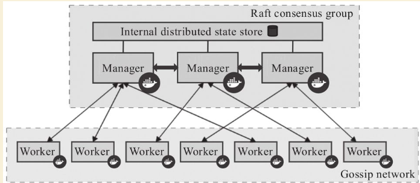

# Docker三剑客之Docker-Swarm

## 1. Docker-swarm
Docker Swarm是Docker官方编排(Orchestration)项目之一,负责对Docker集群进行管理。


作为容器集群管理器,swarm 最大的优势之一就是原生支持API,给用户使用带来极大的便利。
各种基于标准API的工具比如Compose、Docker SDK、各种管理软件， 

甚至Docker本身等都可以很容易的与swarm进行集成。这大大方便了用户将原先基于单节点的
系统移植到Swarm上。同时swarm内置了对Docker网络插件的支持,用户可以很容易地部署跨主机的容器集群服务。


Swarm采用了经典的“主从”结构，通过Raft协议来在多个管理节点（Manager）中实现共识,
工作节点(Worker)上运行agent接受管理节点的统一管理和任务分配。


用户提交服务请求只需要发给管理节点即可，管理节点会安装调度策略在机器中分配节点来运行服务相关的任务。




## 2.基本概念

### 1.1 Swarm 集群
Swarm 集群（ Cluster ） 为一组被统一管理起来的Docker 主机。

集群是Swarm 所管理的对象。这些主机通过Docker 引擎的模式相互沟通,其中部分主机可能作为管理节点
（ manager) 响应外部的管理请求,其他主机作为工作节点（ worker) 来实际运行Docker 容器。

当然,同一个主机也可以即作为管理节点， 同时作为工作节点。当用户使用swarm 集群时,首先定义一个服务（ 指定状态、复制个数、网络、存储、暴露端口等）,然后通过管理节点发出启动服务的指令， 管理节点随后会按照指定的服务规则进行调度,在集群中启动起来整个服务,并确保它正常运行。

### 1.2 节点
节点（ Node ） 是Swarm 集群的最小资源单位。每个节点实际上都是一台Docker 主机。
Swarm 集群中节点分为两种：

- 管理节点（ manager node ） ： 负责响应外部对集群的操作请求， 并维持集群中资源， 分发任务给工作节点。同时， 多个管理节点之间通过R 祖协议构成共识。一般推荐每个集群设置5 个或7 个管理节点；
- 工作节点（ worker node ） ： 负责执行管理节点安排的具体任务。默认情况下， 管理节点自身也同时是工作节点。每个工作节点上运行代理（ agent ） 来汇报任务完成情况。用户可以通过docker node promote 命令来提升一个工作节点为管理节点； 或者通过docker node demote 命令来将一个管理节点降级为工作节点。

### 1.3 服务
服务（ Service ） 是Docker 支持复杂多容器协作场景的利器。
一个服务可以由若干个任务组成， 每个任务为某个具体的应用。服务还包括对应的存储、网络、端口映射、副本个数、访问配置、升级配置等附加参数。

一般来说， 服务需要面向特定的场景， 例如一个典型的web 服务可能包括前端应用、后端应用， 以及数据库等。这些应用都属于该服务的管理范畴。

Swarm 集群中服务类型也分为两种（ 可以通过-mode 指定） ：

- 复制服务（ replicated services ） 模式： 默认模式， 每个任务在集群中会存在若干副本，这些副本会被管理节点按照调度策略分发到集群中的工作节点上。此模式下可以使用-replicas 参数设置副本数量；
- 全局服务（ global services ） 模式： 调度器将在每个可用节点都执行一个相同的任务。
  该模式适合运行节点的检查， 如监控应用等。

### 1.4 任务
任务是swarm 集群中最小的调度单位， 即一个指定的应用容器。例如仅仅运行前端业务的前端容器。

任务从生命周期上将可能处于创建（ NEW) 、等待（ PENDING) 、分配（ ASSIGNED) 、接受（ ACCEPTED) 、准备（ PREPARING ） 、开始（ STARTING) 、运行(RUNNING ） 、完成(COMPLETE ） 、失败(FAILED ） 、关闭（ SHUTDOWN) 、拒绝(REJECTED ） 、孤立（ ORPHANED ） 等不同状态。

swarm 集群中的管理节点会按照调度要求将任务分配到工作节点上。例如指定副本为2时， 可能会被分配到两个不同的工作节点上。一旦当某个任务被分配到一个工作节点， 将无法被转移到另外的工作节点， 即swarm 中的任务不支持迁移。

### 1.5 服务的外部访问
swarm 集群中的服务要被集群外部访问， 必须要能允许任务的响应端口映射出来。
swarm 中支持人口负载均衡（ ingress load balancing ） 的映射模式。

该模式下， 每个服务都会被分配一个公开端口（ PublishedPort) ， 该端口在集群中任意节点上都可以访问到， 并被保留给该服务。

当有请求发送到任意节点的公开端口时， 该节点若并没有实际执行服务相关的容器， 则会通过路由机制将请求转发给实际执行了服务容器的工作节点。


## 2.使用Swarm

用户在安装Docker 1.12或更新的版本后，即可直接尝试Swarm模式的相关功能。假定分别准备两个Linux主机，作为管理节点（实际上也同时具备工作节点功能）和工作节点。

Swarm集群的主要操作，包括：

``` 
囗 swarm init: 在管理节点上创建一个集群；
囗 node 1ist： 列出集群中的节点信息；
囗 swarm join: 加人一个新的节点到已有集群中；
囗 swarm update ： 更新一个Swarm 集群；
囗 swarm leave ： 离开一个Swarm 集群。
```

此外， 还可以使用docker service命令部署Docker应用服务到集群中。

### 2.1 创建集群

修改/etc/docker/daemon.json文件内容

```
$ cat /etc/docker/daemon.json
{
“live-restore”: false
}

$ systemctl restart docker
```


``` 
$ docker swarm init --advertise-addr 192.168.1.132

Swarm initialized: current node (kt2rfnf20kewfbk7ca0lmtkdy) is now a manager.

To add a worker to this swarm, run the following command:

    docker swarm join --token SWMTKN-1-4i80eo6fvvaqc2zin10fc30g42jfliqcf42dzbsefjqu1u93x1-4zlvwzzghgy4qchqix40hiax7 192.168.1.132:2377

To add a manager to this swarm, run 'docker swarm join-token manager' and follow the instructions.

```
swarm初始化，集群初始化子命令的相关选项：`docker swarm init`


### 2.2 查看集群信息
``` 
$ docker info
.....
Swarm: active
 NodeID: qtbcvtilbdk1yry0y3ji0jejm
 Is Manager: true
 ClusterID: 6s6x1shrxc7d2y30j9rj12tep
 Managers: 1
 Nodes: 1
 Orchestration:
  Task History Retention Limit: 5
 Raft:
  Snapshot Interval: 10000
  Number of Old Snapshots to Retain: 0
  Heartbeat Tick: 1
  Election Tick: 10
 Dispatcher:
  Heartbeat Period: 5 seconds
 CA Configuration:
  Expiry Duration: 3 months
  Force Rotate: 0
 Autolock Managers: false
 Root Rotation In Progress: false
 Node Address: 172.16.72.20
 Manager Addresses:
  172.16.72.20:2377
Runtimes: runc
Default Runtime: runc
Init Binary: docker-init
containerd version: 773c489c9c1b21a6d78b5c538cd395416ec50f88
runc version: 4fc53a81fb7c994640722ac585fa9ca548971871
init version: 949e6fa
Security Options:
 seccomp
  Profile: default
Kernel Version: 3.10.0-957.27.2.el7.x86_64
Operating System: CentOS Linux 7 (Core)
OSType: linux
Architecture: x86_64
CPUs: 4
Total Memory: 7.638GiB
Name: 172-16-72-20
ID: 2OOX:3QAW:QVBG:6ZHF:RPNM:IHXF:ZC2F:QWFO:5JTT:CZMQ:P7WZ:U7XZ
Docker Root Dir: /var/lib/docker
Debug Mode (client): false
Debug Mode (server): false
Registry: https://index.docker.io/v1/
Labels:
Experimental: false
Insecure Registries:
 119.254.93.246:15005
 127.0.0.0/8
Live Restore Enabled: false

WARNING: bridge-nf-call-ip6tables is disabled
```

### 2.3 加入集群
``` 
$ docker swarm join --token SWMTKN-1-4i80eo6fvvaqc2zin10fc30g42jfliqcf42dzbsefjqu1u93x1-4zlvwzzghgy4qchqix40hiax7 192.168.1.132:2377
This node joined a swarm as a worker.

$ docker swarm join --token SWMTKN-1-4i80eo6fvvaqc2zin10fc30g42jfliqcf42dzbsefjqu1u93x1-4zlvwzzghgy4qchqix40hiax7 192.168.1.132:2377
This node joined a swarm as a worker.
```

加入集群的子命令：`docker swarm join`包含是个子选项


### 2.4 管理添加节点的口令
``` 
$ docker swarm join-token --rotate manager
Successfully rotated manager join token.

To add a manager to this swarm, run the following command:

    docker swarm join --token SWMTKN-1-0ug4ffl4d918qa8xc3q3ynujvqoby5qjhug6mdyq03c1lgg64w-cdserqy6fyxlzd6pgapkjewd4 172.16.74.33:2377


$ docker swarm join-token -q manager
SWMTKN-1-0ug4ffl4d918qa8xc3q3ynujvqoby5qjhug6mdyq03c1lgg64w-cdserqy6fyxlzd6pgapkjewd4

```


在管理节点上查看集群中节点的情况，可以看到新加入的工作节点。
``` 
$ docker node ls
ID                            HOSTNAME            STATUS              AVAILABILITY        MANAGER STATUS      ENGINE VERSION
8w1cozqwakizb1vnxuzkvn6dn     172-16-72-15        Ready               Active                                  18.03.1-ce
qtbcvtilbdk1yry0y3ji0jejm *   172-16-72-20        Ready               Active              Leader              18.03.1-ce
4lt3j0n671tiswnt3kigazf58     172-16-72-29        Ready               Active                                  18.03.1-ce

============================================ 下线节点 ===========================================
温馨提示：更改节点的availablity状态
swarm集群中node的availability状态可以为 active或者drain，其中：
active状态下，node可以接受来自manager节点的任务分派；
drain状态下，node节点会结束task，且不再接受来自manager节点的任务分派（也就是下线节点）

$ docker node update --availability drain ftnode-172-16-72-8
ftnode-172-16-72-8

$ docker node ls
ID                            HOSTNAME              STATUS              AVAILABILITY        MANAGER STATUS      ENGINE VERSION
3d1iieyvw8q7q2u2i95schbkn *   172-16-72-19          Ready               Active              Leader              19.03.5
kdp5b8ja34x52a4v2xc5byhrd     ftnode-172-16-72-8    Ready               Drain                                   19.03.5
3pqduino59ug7ujhokzph874t     ftnode-172-16-72-20   Ready               Active    

============================================ 上线节点 ===========================================
如上，当node1的状态改为drain后，那么该节点就不会接受task任务分发，就算之前已经接受的任务也会转移到别的节点上。
再次修改为active状态（及将下线的节点再次上线）
$ docker node update --availability active ftnode-172-16-72-8
ftnode-172-16-72-8

$ docker node ls
ID                            HOSTNAME              STATUS              AVAILABILITY        MANAGER STATUS      ENGINE VERSION
3d1iieyvw8q7q2u2i95schbkn *   172-16-72-19          Ready               Active              Leader              19.03.5
kdp5b8ja34x52a4v2xc5byhrd     ftnode-172-16-72-8    Ready               Active                                  19.03.5
3pqduino59ug7ujhokzph874t     ftnode-172-16-72-20   Ready               Active                                  19.03.5

```

### 2.6 离开集群

节点可以在任何时候通过swarm leave 命令离开一个集群。命令格式为`docker swarm leave [OPTIONS)` ,支持 -f, --force 意味着强制离开集群。

``` 
# node上离开集群
$ docker swarm leave
Node left the swarm.

# leader上删除node信息
$ docker node rm namoa44dyu2g8eexmfzygwo4u
```


### 2.7 使用集群服务
使用swarm 提供的服务实际上有两种方法， 

- 一种是使用Docker 原来的客户端命令， 只要指定使用Swarm manager 服务的监听地址即可。
  例如,manager服务监听的地址为<manager iP>:2377则可以通过指定-H <manager iP>:2377选项来继续使用Docker客户端,
  执行任意Docker命令， 例如ps 、info 、run 等。

- 另外一种方法， 也是推荐的做法， 是使用新的docker service 命令， 可以获得包括多主机网络等更高级的特性支持。

service命令及说明


(1)快速创建一个应用服务


``` 
# 快速创建一个应用服务，2副本
$ docker service create --replicas 2 --name ping_app debian:jessie ping docker.com
yfkves1nfm3j3hjvojwvybjnu
overall progress: 2 out of 2 tasks 
1/2: running   [==================================================>] 
2/2: running   [==================================================>] 
verify: Service converged


# 查看服务
$ docker service ls
ID                  NAME                MODE                REPLICAS            IMAGE               PORTS
yfkves1nfm3j        ping_app            replicated          2/2                 debian:jessie    


使用docker service inspect命令查看服务的具体信息
$ docker service inspect --pretty ping_app

ID:		yfkves1nfm3j3hjvojwvybjnu
Name:		ping_app
Service Mode:	Replicated
 Replicas:	2
Placement:
UpdateConfig:
 Parallelism:	1
 On failure:	pause
 Monitoring Period: 5s
 Max failure ratio: 0
 Update order:      stop-first
RollbackConfig:
 Parallelism:	1
 On failure:	pause
 Monitoring Period: 5s
 Max failure ratio: 0
 Rollback order:    stop-first
ContainerSpec:
 Image:		debian:jessie@sha256:8fc7649643ca1acd3940706613ea7b170762cfce6e7955a6afb387aa40e9f9ea
 Args:		ping docker.com 
Resources:
Endpoint Mode:	vip


可以看到管理节点和工作节点都运行了一个容器，镜像为debian:jessie，命令为：ping docker.com
$ docker service ps ping_app
ID                  NAME                IMAGE               NODE                DESIRED STATE       CURRENT STATE           ERROR               PORTS
kxv54iqeaoik        ping_app.1          debian:jessie       172-16-72-20        Running             Running 2 minutes ago                       
jwpovkw9t2tv        ping_app.2          debian:jessie       172-16-72-29        Running             Running 2 minutes ago    
```

(2)扩展服务
用户还可以通过docker service scale <SERVICE-ID>=<NUMBER-OF-TASKS> 命令来对服务进行伸缩，例如将服务复制个数从2改为1：
``` 
$ docker service scale ping_app=1
ping_app scaled to 1
overall progress: 1 out of 1 tasks 
1/1: running   [==================================================>] 
verify: Service converged 

再次查看，仅剩下管理节点运行了此容器
$ docker service ps ping_app
ID                  NAME                IMAGE               NODE                DESIRED STATE       CURRENT STATE           ERROR               PORTS
kxv54iqeaoik        ping_app.1          debian:jessie       172-16-72-20        Running             Running 5 minutes ago 

```
服务使用完成后可以通过`docker service rm  <SERVERCE-ID>` 命令来进行删除。
服务命令更多的参数可以通过docker service help 进行查看。

删除容器

``` 
$ docker service ls
ID                  NAME                MODE                REPLICAS            IMAGE               PORTS
yfkves1nfm3j        ping_app            replicated          1/1                 debian:jessie       

$ docker service rm yfkves1nfm3j
yfkves1nfm3j
```

(3)使用外部服务地址
Swarm通过路由机制支持服务对外映射到指定端口，该端口可以在集群中任意节点上进行访问，即使该节点上没有运行服务实例，
需要在创建服务时使用--publih参数。

``` 
docker servi ce \
—name <Service name> \
—publ i sh publ i shed=<pub port>,target=<container port> \
< IMAGE>
```
### 2.8 更新集群
``` 
用户可以使用docker s warm update [OPT 工ONS] 命令来更新一个集群， 主要包
括如下配置信息：
    囗   -autolock: 启动或关闭自动锁定；
    口   -cert-expiry duration: 根证书的过期时长， 默认为90 天；
    囗   -dispatcher-heartbeat duration ： 分配组件的心跳时长， 默认为5 秒；
    囗   -external-ca external-ca ： 指定使用外部的证书签名服务地址；
    囗   -max-snapshots uint ： Raft 协议快照保留的个数；
    囗   -snapshot-interval uint ： Raft 协议进行快照的间隔（ 单位为事务个数） ， 默认为10 000 个事物；
    囗   -task-history-limlt int ： 任务历史的保留个数,默认为5 。

```


## 3.使用服务命令
### 3.1 Docker Stack命令
Docker栈的命令，它一共包含五个子命令，
```
$ docker stack --help

Usage:	docker stack [OPTIONS] COMMAND

Manage Docker stacks

Options:
      --orchestrator string   Orchestrator to use (swarm|kubernetes|all)

Commands:
  deploy      Deploy a new stack or update an existing stack
  ls          List stacks
  ps          List the tasks in the stack
  rm          Remove one or more stacks
  services    List the services in the stack

```

部署Docker栈

用法：`docker stack deoloy [OPTIONS] STACK`

选项解释如下：

```
· -- bundle-file：指定一个分布式应用程序包的文件路径。
· -- compose-file：-c ：指定一个Compose文件路径。
· -- with-registry-auth: 将镜像仓库的认证信息发送给Swarm代理程序，用于指定部署时可以从私有仓库拉取镜像（默认为false）。
```


### 3.2 在Swarm中部署服务

```
## 查看docker网络
$ docker network ls
NETWORK ID          NAME                    DRIVER              SCOPE
6bb766eb4b70        bridge                  bridge              local
m5y53850puxn        deplpy_deamon_default   overlay             swarm
8d8ffd50eaf9        host                    host                local
4oal2fahquva        ingress                 overlay             swarm
bbfafab744b8        none                    null                local
```

1) 创建网络在部署服务


```
# 创建网络
$ docker network create -d overlay nginx_net
weqsqoenuhr1qt6o30odfp83n

# 部署服务
$ docker network ls | grep nginx_net
weqsqoenuhr1        nginx_net           overlay             swarm

#在manager-node节点上使用上面这个覆盖网络创建nginx服务：
#其中，--replicas 参数指定服务由几个实例组成。
#注意：不需要提前在节点上下载nginx镜像，这个命令执行后会自动下载这个容器镜像（比如此处创建tomcat容器，就将下面命令中的镜像改为tomcat镜像）。
$ docker service create --name hu_nginx --replicas 3 nginx
xmmwyaw2dkovyk1iy42n0zi68
overall progress: 3 out of 3 tasks 
1/3: running   [==================================================>] 
2/3: running   [==================================================>] 
3/3: running   [==================================================>] 

# 使用 docker service ls 查看正在运行服务的列表
$ docker service ls
ID                  NAME                MODE                REPLICAS            IMAGE               PORTS
xmmwyaw2dkov        hu_nginx            replicated          3/3                 nginx:latest   
```

### 3.3 查询Swarm中服务的信息

```
-pretty 使命令输出格式化为可读的格式，不加 --pretty 可以输出更详细的信息

$ docker service inspect --pretty hu_nginx

ID:		xmmwyaw2dkovyk1iy42n0zi68
Name:		hu_nginx
Service Mode:	Replicated
 Replicas:	3
Placement:
UpdateConfig:
 Parallelism:	1
 On failure:	pause
 Monitoring Period: 5s
 Max failure ratio: 0
 Update order:      stop-first
RollbackConfig:
 Parallelism:	1
 On failure:	pause
 Monitoring Period: 5s
 Max failure ratio: 0
 Rollback order:    stop-first
ContainerSpec:
 Image:		nginx:latest@sha256:b2d89d0a210398b4d1120b3e3a7672c16a4ba09c2c4a0395f18b9f7999b768f2
 Init:		false
Resources:
Endpoint Mode:	vip


# 查询到哪个节点正在运行该服务。如下该容器被调度到manager-node节点上启动了，然后访问http://192.168.31.43即可访问这个容器应用（如果调度到其他节点，访问也是如此）
$ docker service ps hu_nginx
ID                  NAME                IMAGE               NODE                  DESIRED STATE       CURRENT STATE           ERROR               PORTS
p08tcvzbhlt6        hu_nginx.1          nginx:latest        ftnode-172-16-72-8    Running             Running 2 minutes ago                       
jcqgq8fjsi6m        hu_nginx.2          nginx:latest        172-16-72-19          Running             Running 2 minutes ago                       
d4vsmgnk7n0e        hu_nginx.3          nginx:latest        ftnode-172-16-72-20   Running             Running 2 minutes ago       
```

温馨提示：如果上面命令执行后，上面的 STATE 字段中刚开始的服务状态为 Preparing，需要等一会才能变为 Running 状态，其中最费时间的应该是下载镜像的过程。

### 3.4 动态扩容缩容服务(scale)

```
当然，如果只是通过service启动容器，swarm也算不上什么新鲜东西了。Service还提供了复制（类似kubernetes里的副本）功能。可以通过 docker service scale 命令来设置服务中容器的副本数
比如将上面的my_nginx容器动态扩展到4个

$ docker service scale hu_nginx=4


同理，swarm还可以缩容，同样是使用scale命令
如下，将hu_nginx容器变为2个
$ docker service scale hu_nginx=2
hu_nginx scaled to 2
overall progress: 2 out of 2 tasks 
1/2: running   [==================================================>] 
2/2: running   [==================================================>] 
verify: Service converged 


# 通过docker service ps my_nginx 可以看到node节点上已经为Shutdown状态了

# 登录node节点，使用docker ps -a 查看，会发现容器被stop而非rm
[root@172-16-72-19 compose]# docker ps -a
CONTAINER ID        IMAGE               COMMAND                  CREATED             STATUS                     PORTS               NAMES
91376bb956b3        nginx:latest        "nginx -g 'daemon of…"   13 minutes ago      Exited (0) 7 minutes ago                       hu_nginx.3.mijhlis5ap3zzscieunqxk2h8
```

### 3.5 容器自动迁移

如果出现node节点宕机，docker容器会自动迁移

```
# 先保证每个节点上启动一个docker
$ docker service ps hu_nginx
ID                  NAME                IMAGE               NODE                  DESIRED STATE       CURRENT STATE            ERROR               PORTS
p08tcvzbhlt6        hu_nginx.1          nginx:latest        ftnode-172-16-72-8    Running             Running 10 minutes ago                       
jcqgq8fjsi6m        hu_nginx.2          nginx:latest        172-16-72-19          Running             Running 9 minutes ago                        
ruq4sr0s5xx0        hu_nginx.3          nginx:latest        ftnode-172-16-72-20   Running             Running 27 seconds ago 


# 在node 20这台机器上，模拟宕机
$ systemctl stop docker


[root@172-16-72-19 compose]# docker node ls
ID                            HOSTNAME              STATUS              AVAILABILITY        MANAGER STATUS      ENGINE VERSION
3d1iieyvw8q7q2u2i95schbkn *   172-16-72-19          Ready               Active              Leader              19.03.5
kdp5b8ja34x52a4v2xc5byhrd     ftnode-172-16-72-8    Ready               Active                                  19.03.5
3pqduino59ug7ujhokzph874t     ftnode-172-16-72-20   Down                Active                                  19.03.5


# 过一会儿查看docker容器的列表，发现容器已经迁移到19上了。
$ docker service ps hu_nginx
ID                  NAME                IMAGE               NODE                  DESIRED STATE       CURRENT STATE            ERROR               PORTS
p08tcvzbhlt6        hu_nginx.1          nginx:latest        ftnode-172-16-72-8    Running             Running 11 minutes ago                       
jcqgq8fjsi6m        hu_nginx.2          nginx:latest        172-16-72-19          Running             Running 11 minutes ago                       
mijhlis5ap3z        hu_nginx.3          nginx:latest        172-16-72-19          Running             Running 28 seconds ago                       
ruq4sr0s5xx0         \_ hu_nginx.3      nginx:latest        ftnode-172-16-72-20   Shutdown            Running 47 seconds ago 

$ docker ps -a
CONTAINER ID        IMAGE               COMMAND                  CREATED             STATUS              PORTS               NAMES
91376bb956b3        nginx:latest        "nginx -g 'daemon of…"   3 minutes ago       Up 3 minutes        80/tcp              hu_nginx.3.mijhlis5ap3zzscieunqxk2h8
60cad56c7845        nginx:latest        "nginx -g 'daemon of…"   13 minutes ago      Up 13 minutes       80/tcp              hu_nginx.2.jcqgq8fjsi6mmltj3ozc65rgw


# 将转移过来的docker容器关闭，模拟容器故障。因为设置了--replicas 3 nginx,所以集群无论如何都要保证3个容器在运行
$ docker ps
CONTAINER ID        IMAGE               COMMAND                  CREATED             STATUS              PORTS               NAMES
91376bb956b3        nginx:latest        "nginx -g 'daemon of…"   5 minutes ago       Up 5 minutes        80/tcp              hu_nginx.3.mijhlis5ap3zzscieunqxk2h8
60cad56c7845        nginx:latest        "nginx -g 'daemon of…"   16 minutes ago      Up 16 minutes       80/tcp              hu_nginx.2.jcqgq8fjsi6mmltj3ozc65rgw


$ docker stop 91376bb956b3 
91376bb956b3
```

可以看到，当docker容器出现故障时，集群会自动再次拉起一个容器，保证有3个容器运行。图上是从自身node上拉起了一个docker容器。

结论：即在swarm cluster集群中启动的容器，在worker node节点上删除或停用后，该容器会自动转移到其他的worker node节点上


## 4.Docker Swarm volume 数据持久化

https://www.cnblogs.com/xiangsikai/p/9938670.html


## 5.Docker Swarn参考文献

https://www.cnblogs.com/zhujingzhi/p/9792432.html


## 6.多集群compose.yml文件部署

示例1

1) 编写docker-compose.yml文件

```yaml
[root@manager43 ~]# mkdir testswarm
[root@manager43 ~]# cd testswarm/
[root@manager43 testswarm]# cat docker-compose.yml
version: "3"
services:
  nginx:
    image: nginx
    ports:
      - 8888:80
    deploy:
      mode: replicated
      replocas: 3
 
  visualizer:
    image: dockersamples/visualizer
    ports:
      - "8080:8080"
    volumes:
      - "/var/run/docker.sock:/var/run/docker.sock"
    deploy:
      replicas: 1
      placement:
        constraints: [node.role == manager]
 
  portainer:
    image: portainer/portainer
    ports:
      - "9000:9000"
    volumes:
      - "/var/run/docker.sock:/var/run/docker.sock"
    deploy:
      replicas: 1
      placement:
        constraints: [node.role == manager]
```

2) 通过这个yml文件部署服务

```shell
$ docker stack deploy -c docker-compose.yml deploy_deamon
Creating network deploy_deamon_default
Creating service deploy_deamon_portainer
Creating service deploy_deamon_nginx
Creating service deploy_deamon_visualizer
 
通过上面的执行过程可以看出这样创建会默认创建一个网络并使用它，名字都是我们给的名字的前缀加上服务名
 
# 查看创建服务
$ docker service ls
ID                  NAME                       MODE                REPLICAS            IMAGE                             PORTS
xj2f1t5ax3nm        deploy_deamon_nginx        replicated          3/3                 nginx:latest                      *:8888->80/tcp
ky9qpldr5abb        deploy_deamon_portainer    replicated          1/1                 portainer/portainer:latest        *:9000->9000/tcp
r47ff177x1ir        deploy_deamon_visualizer   replicated          1/1                 dockersamples/visualizer:latest   *:8080->8080/tcp
 
$ docker service ps deploy_deamon_nginx    
$ docker service ps deploy_deamon_portainer                
$ docker service ps deploy_deamon_visualizer
```


示例2

```yaml
version: "3"		# 版本号，deploy功能是3版本及以上才有的
services:			# 服务，每个服务对应配置相同的一个或者多个docker容器
  redis:			# 服务名，自取
    image: redis:alpine		# 创建该服务所基于的镜像。使用stack部署，只能基于镜像
    ports: 			# 容器内外的端口映射情况
      - "1883:1883"
      - "9001:9001"
    networks:		# 替代了命令行模式的--link选项
      - fiware
    volumes: 		# 容器内外数据传输的对应地址
      - "/srv/mqtt/config:/mqtt/config:ro"
      - "/srv/mqtt/log:/mqtt/log"
      - "/srv/mqtt/data/:/mqtt/data/"
    command: -dbhost stack_mongo # 命令行模式中跟在最后的参数，此条没有固定的格式，建议参照所部署的docker镜像的说明文档来确定是否需要该项、需要写什么
    deploy:
      mode: replicated
      replicas: 6			# replicas模式， 副本数目为1
      endpoint_mode: vip
      labels: 
        description: "This redis service label"
      resources:
        limits:
          cpus: '0.50'
          memory: 50M
        reservations:
          cpus: '0.25'
          memory: 20M
      restart_policy:
        condition: on-failure
        delay: 5s
        max_attempts: 3
        window: 120s
      placement:
        constraints:
          - "node.role==worker"		# 部署位置，只在工作节点部署
          - "engine.labels.operatingsystem==ubuntu 18.04"
        preferences:
          - spread: node.labels.zone
      update_config:
        parallelism: 2
        delay: 10s
        order: stop-first

networks:		 # 定义部署该项目所需要的网络
  fiware:
```


参考文献:


https://www.cnblogs.com/vinsent/p/11691562.html


## 7.Docker Compose 配置文件详解


https://www.jianshu.com/p/748416621013


https://blog.csdn.net/qq_36148847/article/details/79427878


## 本章小结

本章介绍了Docker Swarm的安装、使用和主要功能。通过使用Swarm，用户可以将若干Docker主机节点组成的集群当作一个大的虚拟Docker主机使用。并且，原先基于单机的Docker应用，可以无缝地迁移到Swarm上来。通过使用服务，Swarm集群可以支持多个应用构建的复杂业务，并很容易对其进行升级等操作。

在生产环境中，Swarm的管理节点要考虑高可用性和安全保护，一方面多个管理节点应该分配到不同的容灾区域，另一方面服务节点应该配合数字证书等手段限制访问。

Swarm功能已经被无缝嵌入到了Docker 1.12+版本中，用户今后可以直接使用Docker命令来完成相关功能的配置，对Swarm集群的管理更加简便。