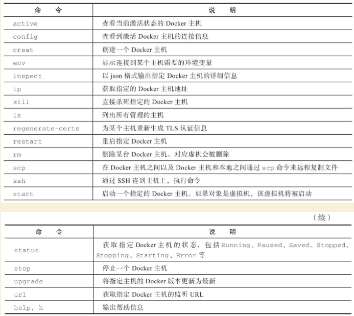

# Docker三剑客之Docker-Machine

Docker Machine是Docker官方三剑客项目之一，负责使用Docker容器的第一步：在多种平台上快速安装和维护Docker运行环境。它支持多种平台，让用户可以在很短时间内在本地或云环境中搭建一套Docker主机集群。

本章将介绍Docker Machine项目的具体情况，以及安装和使用的相关命令。

Machine项目是Docker官方的开源项目，负责实现对Docker运行环境进行安装和管理，特别在管理多个Docker环境时，使用Machine要比手动管理高效得多。


Machine的定位是“在本地或者云环境中创建Docker主机”。其代码在<https://github.com/docker/machine> 上开源，遵循Apache-2.0许可，目前最新版本为0.13.0。

Machine项目主要由Go语言编写，用户可以在本地任意指定由Machine管理的Docker主机，并对其进行操作。


其基本功能包括：

·在指定节点或平台上安装Docker引擎，配置其为可使用的Docker环境；

·集中管理（包括启动、查看等）所安装的Docker环境。

Machine连接不同类型的操作平台是通过对应驱动来实现的，目前已经集成了包括AWS、IBM、Google，以及OpenStack、VirtualBox、vSphere等多种云平台的支持。

Docker Machine可以在多种操作系统平台上安装，包括Linux、Mac OS以及Windows，下面分别介绍。

## 安装Machine

### 1.Linux平台上的安装

在Linux平台上的安装十分简单，推荐从官方Release库（<https://github.com/docker/ma-chine/releases> ）直接下载编译好的二进制文件即可。

例如，在Linux 64位系统上直接下载对应的二进制包，以最新的0.13.0为例：

------

```
$ sudo curl -L https://github.com/docker/machine/releases/download/v0.13.0/docker-machine-'uname -s'-'uname -m' > docker-machine
$ sudo mv docker-machine /usr/local/bin/docker-machine
$ sudo chmod +x /usr/local/bin/docker-machine
```

------

安装完成后，查看版本信息，验证运行正常：

------

```
$ docker-machine -v
docker-machine version 0.13.0, build 9ba6da9
```

------

为了支持命令自动补全，还可以安装补全脚本：

------

```
$ scripts=( docker-machine-prompt.bash docker-machine-wrapper.bash docker-machine.bash ); for i in "${scripts[@]}"; do sudo wget https://raw.githubuser-content.com/docker/machine/v0.13.0/contrib/completion/bash/${i} -P /etc/bash_completion.d; done
```

------

### 2.Mac OS系统上的安装

Mac OS平台上的安装跟Linux平台十分类似，唯一不同的是下载二进制文件的路径不同。例如，同样是0.13.0版本，Mac OS平台上的安装命令为：

------

```
$ curl -L https://github.com/docker/machine/releases/download/v0.13.0/docker-machine-'uname -s'-'uname -m' >/usr/local/bin/docker-machine
$ chmod +x /usr/local/bin/docker-machine
```

------

### 3.Windows系统上的安装

Windows平台的安装要复杂一些，首先需要安装git-bash（[https://git-for-windows.github.io](https://git-for-windows.github.io/) ）。git-bash是Windows下的git客户端软件包，会提供类似Linux下的一些基本的工具，例如bash、curl、ssh命令等，最新版本为2.16。

安装之后，启动一个git-bash的命令行界面，仍然通过下载二进制包方式安装Docker Machine：

------

```
$ if [[ ! -d "$HOME/bin" ]]; then mkdir -p "$HOME/bin"; fi
$ curl -L https://github.com/docker/machine/releases/download/v0.13.0/docker-machine-Windows-x86_64.exe > "$HOME/bin/docker-machine.exe" && \
chmod +x "$HOME/bin/docker-machine.exe"
```

## 使用Machine

Docker Machine通过多种后端驱动来管理不同的资源，包括虚拟机、本地主机和云平台等。通过-d选项可以选择支持的驱动类型。

### 1.虚拟机

可以通过virtualbox驱动支持本地（需要已安装virtualbox）启动一个虚拟机环境，并配置为Docker主机：

------

```
$ docker-machine create --driver=virtualbox test
```

------

将启动一个全新的虚拟机，并安装Docker引擎。

安装成功后，可以通过docker-machine env命令查看访问所创建Docker环境所需要的配置信息：

------

```
$ docker-machine env test
    export DOCKER_TLS_VERIFY="1"
    export DOCKER_HOST="tcp://192.168.56.101:2376"
    export DOCKER_CERT_PATH="/Users/<yourusername>/.docker/machine/machines/default"
    export DOCKER_MACHINE_NAME="test"
    # Run this command to configure your shell:
    # eval "$(docker-machine env test)"
```

------

使用完毕后，可以通过如下命令来停止Docker主机：

------

```
$ docker-machine stop test
```

------

此外，Machine还支持Microsoft Hyper-V虚拟化平台。

### 2.本地主机

这种驱动适合主机操作系统和SSH服务都已经安装好，需要对其安装Docker引擎。

首先确保本地主机可以通过user账号的key直接ssh到目标主机。使用generic类型的驱动，注册一台Docker主机，命名为test：

------

```
$ docker-machine create -d generic --generic-ip-address=10.0.100.102 --generic-ssh-user=user test
Running pre-create checks...
Creating machine...
(test) OUT | Importing SSH key...
Waiting for machine to be running, this may take a few minutes...
Machine is running, waiting for SSH to be available...
Detecting operating system of created instance...
Detecting the provisioner...
Provisioning created instance...
...
```

------

从命令输出上可以看到，Machine通过SSH连接到指定节点，并在上面安装Docker引擎。

创建主机成功后，可以通过docker-machine ls命令来查看注册到本地管理列表中的Docker主机：

------

```
$ docker-machine ls
NAME   ACTIVE  DRIVER   STATE   URL                      SWARM  DOCKER   ERRORS
test   -       generic  Running tcp://10.0.100.102:2376           v18.3
```

------

还可以通过inspect命令查看指定Docker主机的具体信息。

### 3.云平台驱动

以Amazon Web Services云平台为例，配置其上的虚拟机为Docker主机。

需要指定Access Key ID、Secret Access Key、VPC ID等信息。例如：

------

```
$ docker-machine create --driver amazonec2 --amazonec2-access-key AKI******* --amazonec2-secret-key 8T93C********* --amazonec2-vpc-id vpc-****** aws_instance
```

------

其他支持的云平台还包括Microsoft Azure、Digital Ocean、Exoscale、Google Compute Engine、Rackspace、IBM Softlayer等，用户可根据自身情况选择使用。

### 4.客户端配置

默认情况下，所有的客户端配置数据都会自动存放在~/.docker/machine/machines/路径下。用户可以定期备份这一目录以避免出现客户端连接配置丢失。

当然，该路径下内容仅为客户端侧的配置和数据，删除其下内容并不会影响到已经创建的Docker环境。

### Machine命令

Machine提供了一系列的子命令，每个命令都带有一系列参数，可以通过如下命令查看具体用法：

------

```
$ docker-machine <COMMAND> -h
```

------

命令参见表23-1。

表23-1　Machine命令列表



下面具体介绍部分命令的用法。

#### 1.active

格式为`docker-machine active[arg...]`。

支持-timeout，-t"10"选项，代表超时时间，默认为10s。查看当前激活状态的Docker主机。激活状态意味着当前的DOCKER_HOST环境变量指向该主机。例如，下面命令列出当前激活主机为dev主机：

------

```
$ docker-machine ls
NAME      ACTIVE   DRIVER         STATE     URL
dev                virtualbox     Running   tcp://192.168.56.102:2376
staging   *        digitalocean   Running   tcp://104.236.60.101:2376
$ echo $DOCKER_HOST
tcp://104.236.60.101:2376
$ docker-machine active
staging
```

------

#### 2.config

格式为`docker-machine config[OPTIONS] [arg...]`。

支持-swarm参数，表示打印Swarm集群信息，而不是Docker信息。查看到Docker主机的连接配置信息。例如，下面显示dev主机的连接信息：

------

```
$ docker-machine config dev
--tlsverify --tlscacert="/home/docker_user/.docker/machines/dev/ca.pem" --tl-scert="/home/docker_user/.docker/machines/dev/cert.pem" --tlskey="/home/docker_user/.docker/machines/dev/key.pem" -H tcp://192.168.56.102:2376
```

------

#### 3.create

格式为`docker-machine create[OPTIONS`][arg...]。创建一个Docker主机环境。支持的选项包括：

·-driver，-d"virtualbox"：指定驱动类型；

·-engine-install-url"[https://get.docker.com](https://get.docker.com/) "：配置Docker主机时的安装URL；

·-engine-opt option：以键值对格式指定所创建Docker引擎的参数；

·-engine-insecure-registry option：以键值对格式指定所创建Docker引擎允许访问的不支持认证的注册仓库服务；

·-engine-registry-mirror option：指定使用注册仓库镜像；

·-engine-label option：为所创建的Docker引擎添加标签；

·-engine-storage-driver：存储后端驱动类型；

·-engine-env option：指定环境变量；

·-swarm：配置Docker主机加入到Swarm集群中；

·-swarm-image"swarm：latest"：使用Swarm时候采用的镜像；

·-swarm-master：配置机器作为Swarm集群的master节点；

·-swarm-discovery：Swarm集群的服务发现机制参数；

·-swarm-strategy“spread”：Swarm默认调度策略；

·-swarm-opt option：任意传递给Swarm的参数；

·-swarm-host"tcp：//0.0.0.0：3376"：指定地址将监听Swarm master节点请求；

·-swarm-addr：从指定地址发送广播加入Swarm集群服务。

例如，通过如下命令可以创建一个Docker主机的虚拟机镜像：

------

```
$ docker-machine create -d virtualbox \
    --engine-storage-driver overlay \
    --engine-label name=testmachine \
    --engine-label year=2018 \
    --engine-opt dns=8.8.8.8 \
    --engine-env HTTP_PROXY=http://proxy.com:3128 \
    --engine-insecure-registry registry.private.com \
    mydockermachine
```

------

所创建Docker主机虚拟机中的Docker引擎将：

·使用overlay类型的存储驱动；

·带有name=testmachine和year=2015两个标签；

·引擎采用8.8.8.8作为默认DNS；

·环境变量中指定HTTP代理服务`http://proxy.com:3128/`。

·允许使用不带验证的注册仓库服务registry.private.com。

#### 4.env

格式为`docker-machine env[OPTIONS] [arg...]`。

显示连接到某个主机需要的环境变量。支持的选项包括：

·-swarm：显示Swarm集群配置；

·-shell：指定所面向的Shell环境，默认为当前自动探测；

·-unset，-u：取消对应的环境变量；

·-no-proxy：添加对象主机地址到NO_PROXY环境变量。

例如，显示连接到default主机所需要的环境变量：

------

```
$ docker-machine env default
export DOCKER_TLS_VERIFY="1"
export DOCKER_HOST="tcp://192.168.56.102:2376"
export DOCKER_CERT_PATH="/home/docker_user/.docker/machine/certs"
export DOCKER_MACHINE_NAME="default"
```

------

#### 5.inspect

格式为`docker-machine inspect[OPTIONS] [arg...]`。

以json格式输出指定Docker主机的详细信息。支持-format，-f选项使用指定的Go模板格式化输出。例如：

------

```
$ docker-machine inspect default
{
    "DriverName": "virtualbox",
    "Driver": {
        "MachineName": "docker-host-128be8d287b2028316c0ad5714b90bcfc11f998056f2f790f7c1f43f3d1e6eda",
        "SSHPort": 22,
        "Memory": 1024,
        "DiskSize": 20000,
        "Boot2DockerURL": "",
        "IPAddress": "192.168.56.102"
    },
    ...
}
```

------

#### 6.ip

获取指定Docker主机地址。例如，获取default主机的地址，可以用如下命令：

------

```
$ docker-machine ip default
192.168.56.102
```

------

#### 7.kill

直接杀死指定的Docker主机。

指定Docker主机会强行停止。

#### 8.ls

列出所有管理的主机。格式为`docker-machine ls[OPTIONS] [arg...]`。例如：

------

```
$ docker-machine ls
NAME       ACTIVE   DRIVER       STATE      URL
default    -        virtualbox   Stopped
test0      -        virtualbox   Running    tcp://192.168.56.105:2376
test1      -        virtualbox   Running    tcp://192.168.56.106:2376
test2      *        virtualbox   Running    tcp://192.168.56.107:2376
```

------

可以通过--filter只输出某些Docker主机，支持过滤器包括名称正则表达式、驱动类型、Swarm管理节点名称、状态等。例如：

------

```
$ docker-machine ls --filter state=Stopped
NAME   ACTIVE   DRIVER       STATE     URL   SWARM
default    -        virtualbox   Stopped
```

------

支持选项包括：

·--quiet，-q：减少无关输出信息；

·--filter[--filter option--filter option]：只输出符合过滤条件主机；

·-timeout，-t"10"：命令执行超时时间，默认为10s；

·-format，-f：使用所指定的Go模板格式化输出。

### 本章小结

本章介绍了Docker三剑客之一：Docker Machine项目。通过介绍可以看出，当要对多个Docker主机环境进行安装、配置和管理时，采用Docker Machine的方式将远比手动方式快捷。不仅提高了操作速度，更通过批量统一的管理减少了出错的可能。尤其在大规模集群和云平台环境中推荐使用。

当然，读者也可以考虑使用Ansible等DevOps工具来实现对Docker环境的自动化管理工作。

安装完成Docker环境后，配合Compose和Swarm，可以实现完整的Docker容器生命周期管理。

## 参考文献

https://www.cnblogs.com/zhujingzhi/p/9760198.html

https://www.runoob.com/docker/docker-machine.html