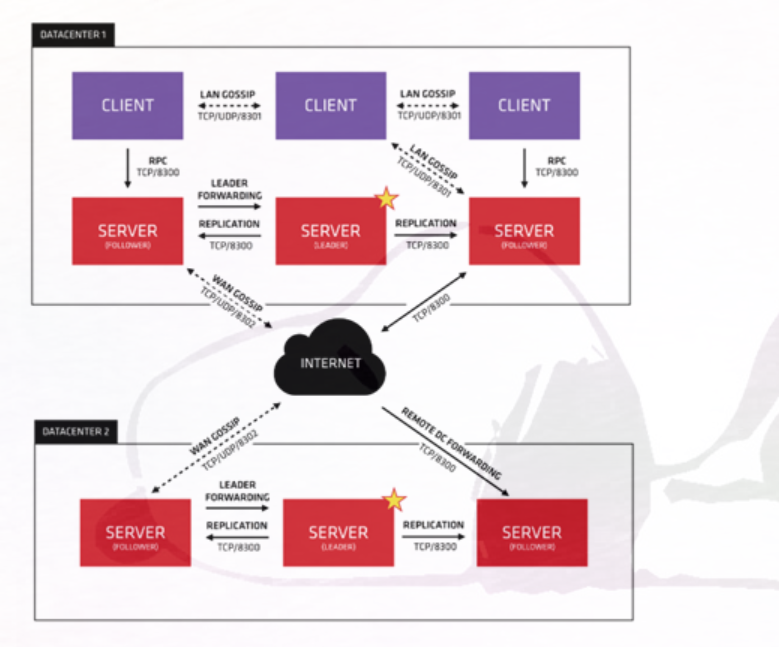

# 服务发现
服务发现是一种容许计算机网络上的任意服务均可以找到它所需要通信的其他服务的机制。

它是大多数分布式系统的核心组件。
如果用户的基础设施是运行或者遵循的面向服务的架构（Service Oriented Architecture，SOA），那么毫无疑问，
用户需要部署某种服务发现方案。
同时，服务发现也是软件应用设计方面的一个新兴概念，
这和传统的SOA有许多的相似之处，而如今它有一个更广为人知的名字叫做微服务。


一个客户端如何才能找到它想要与之通信的IP地址和服务端口？
如图所示



服务注册的过程其实比我们上述所提到的情况要复杂许多。一般来说，有以下两种实现方式。

 ```
 ·把服务注册的模块直接嵌入到应用服务的源代码里。 
 
 ·使用一个伙伴进程（或者说是协同进程）来帮忙处理注册的任务。
 ```

## 1.consul

consul是一款由HashiCorp公司编写的多功能分布式系统工具。同之前介绍过的etcd一样，consul也是使用Go语言实现。consul很好地将它所有的特性集成为一个可定制化软件，并易于使用和运维。在这里，我们不会花太多篇幅去介绍什么是consul，关于这一点读者可以在它的官方网站上找到一个非常全面的文档，里面包含了大量的实际案例。取而代之的是，我们将会去总结它的主要特性并且探讨在Docker基础设施里如何借助它来实现服务发现。最后，在本章的末尾我们将会介绍一个实际案例，它利consul提供的功能特性，将consul作为一个插件式的后端服务，为运行在Docker容器里的应用提供了即插即用的服务发现功能。

我们选择用多功能一词来描述consul的目的正是在于consul的确可以无需花费其他任何额外的精力，
作为一款单独运行的工具提供下述任意一项功能：
 ```
分布式键值存储； 
分布式监控工具；
DNS服务器。
 ```
consul，同etcd类似，也是基于Raft一致性算法实现的，
这也就是说，它所在的集群里的节点部署数量同样应该满足2n+1（n表示一个正整数）以保证其正常工作。
和etcd一样，consul也提供了一个远程的JSON API，这使得各种不同的编程语言实现的客户端访问该服务更加简单。
通过提供远程API的支持，consul允许用户自行在其之上构建新服务或直接使用它原生提供的开箱即用的功能。


就部署而言，consul定义了一个代理（agent）的概念。该代理能够在以下两种模式运行： 
```
服务端——提供分布式键值存储和DNS服务器； 
客户端——提供服务的注册、运行健康监测以及转发请求给服务器。
```

服务端和客户端代理共同组成一个完整的集群。consul通过利用HashiCorp编写的另外一款名为serf的工具来实现集群成员身份和节点发现。serf是基于SWIM一致性协议实现的，并且在一些性能方面做了优化。您可以通过consul官网来了解consul中的gossip详细的内部实现原理。利用gossip协议并通过将它和本地服务的健康检测结合到一起，这使得consul可以实现一个简单但是异常强大的分布式故障检测机制。这对于开发
者和运维人员而言实在是一个巨大的福音。
```
开发人员可以在他们的应用程序里公开健康检测的端点然后轻松地将应用服务添加到consul的分布式服务集合里。

运维人员也可以编写简单的工具，使用consul的API来监控服务的健康性，或者他们只是使用consul原生提供的Web UI去操作。
```

这里讨论到的只是consul一些基本的内容，实际上它所提供的还远不止这些，因此强烈建议读者去细读一下consul强大的官方文档。如果想知道consul和市面上其他工具的差异，不要犹豫，赶紧去看一下专门讨论这一话题的官方文档吧。接下来，让我们一起来看看我们该如何将consul用于基础设施里的服务发现。

### 1.1 基于consul的服务发现

迄今为止，在我们介绍过的工具中，作为一款可定制的服务发现解决方案，consul无疑是最容易上手的一个。
用户可以通过以下几种方式将自己的服务注册到consul的服务目录里： 

- 利用consul的远程API将服务注册嵌入到用户的应用代码里； 
- 使用一个简单的伙伴脚本/客户端工具，在应用服务启动时通过远程API来完成注册； 
- 创建一个简单的声明服务的配置文件，consul代理可以在服务启动或重新加载服务后读取该配置。


已注册的服务可以通过consul的远程API直接去查找，当然用户也可以使用consul提供的开箱即用的DNS服务来检索它们的信息。

这一点尤其方便，因为用户不必再受限于一个特定的服务查找方案，而且甚至可以不费任何力气地同时使用这两套方案。此外，consul还允许用户为自己的应用服务设计一些自定义的健康检测机制。
如此一来，用户不必再像之前的Zookeeper那样和TCP会话周期绑定到一起，也不必像etcd那样和TTL值挂钩。

consul代理程序会持续不断地在本地监控已注册服务的健康性并且一旦健康检测失败它会立马自动将其从服务目录中抹除。


Consul提供了一个非常完备的服务发现解决方案，并且令人意外的是它的成本其实非常低。
在consul中，应用服务可以通过远程API或DNS来定位和检索。
为了完成服务的注册，需要避免使用远程API而可以采用更简单的基于JSON的配置文件来实现这一点。
这使得consul能够很方便地和传统配置管理工具集成在一起。
使用consul会给用户的基础设施引入一些额外的复杂度，但是作为回报，用户也从中获得了大量的收益。

与etcd相比，consul集群无疑是更易于维护和管理的。
Consul在多数据中心方面也具备很好的扩展能力，事实上，consul提供了一些额外的工具专门负责多数据中心的扩容工作。
Consul可以作为一个单独的工具使用，也可以作为构建一个复杂的分布式系统的基本组件。

如今，业界围绕它已然形成了一个新的完整的工具生态圈。
在下一节里，我们将会介绍一款名为registrator的工具，它使用consul作为它的一个可插拔的后端服务，它为运行在Docker容器里的应用提供了一个非常易于上手的、自动服务注册的解决方案。

### 1.2 registrator

从整体上来说，registrator会去监听Docker的Unix套接字来获取Docker容器启动和消亡时的事件，并且它会通过在事先配置好的一个可插拔的后端服务中创建新记录的形式自动完成容器的服务注册。这就意味着它必须以一个Docker容器的身份来运行。读者可以在Docker Hub上找到registrator的Docker镜像。registrator提供了相当多的配置参数选择，因此，尽情去GitHub项目页面的文档库里去查找关于它们的详细解释吧。


我们一起来看一个简短的实际案例。
我们将会使用registrator把redis内存数据库打包到Docker容器里运行，用户可以很方便地通过consul发现它在网络上所提供的服务。
当然，用户也可以使用类似的方法在Docker基础设施里运行任意的应用服务。

首先我们需要启动一个consul容器。这里，需要用到registrator之父Jeff Lindsay创建的镜像来实例化具体的容器： 
```shell
[root@swarm3 centos]# docker run -d -p 8400:8400 -p 8500:8500 -p 8600:53/udp -h node1 progrium/consul -server -bootstrap
Unable to find image 'progrium/consul:latest' locally
latest: Pulling from progrium/consul
.....
```

现在，后端的发现服务已经开始运行，接下来我们将会启动一个registrator容器，并且同时传给它一个consul的连接URL作为参数：
``` shell
[root@swarm3 centos]# docker run -d -v /var/run/docker.sock:/tmp/docker.sock -h $HOSTNAME gliderlabs/registrator consul://$CONSUL_IP:8500
Unable to find image 'gliderlabs/registrator:latest' locally
latest: Pulling from gliderlabs/registrator
....
```

如下所示，我们可以看到容器均已成功启动，并且我们假定所有容器都是注册的redis服务：
``` shell
[root@swarm3 centos]# docker ps
CONTAINER ID        IMAGE                    COMMAND                  CREATED             STATUS              PORTS                                                                                                        NAMES
4b08729db33f        gliderlabs/registrator   "/bin/registrator co…"   3 seconds ago       Up 2 seconds                                                                                                                     nervous_euclid
819fb32dc846        progrium/consul          "/bin/start -server …"   5 minutes ago       Up 5 minutes        53/tcp, 0.0.0.0:8400->8400/tcp, 8300-8302/tcp, 8301-8302/udp, 0.0.0.0:8500->8500/tcp, 0.0.0.0:8600->53/udp   jovial_wozniak
```

考虑到整个例子的完整性，我们不妨介绍一下最初的情况，
下列命令展示了我们正在运行的只有一个节点的consul集群并且在该时刻没有任何已注册的服务运行：

``` shell
[root@swarm3 centos]# curl 172.16.74.22:8500/v1/catalog/nodes
[{"Node":"node1","Address":"172.17.0.4"}]

[root@swarm3 centos]# curl 172.16.74.22:8500/v1/catalog/services
{"consul":[],"consul-53":["udp"],"consul-8400":[],"consul-8500":[]}
```

现在，让我们先启动一个redis容器，然后公开它所有需要对外提供服务的端口：
``` shell
[root@swarm3 centos]# docker run -d -P redis
Unable to find image 'redis:latest' locally
latest: Pulling from library/redis
.....
```

如果一切顺利，我们应该可以在consul的服务目录里找到该redis服务的信息：
``` 
[root@swarm3 centos]# curl -s localhost:8500/v1/catalog/service/redis |python -m json.tool
[
    {
        "Address": "172.17.0.4",
        "Node": "node1",
        "ServiceAddress": "",
        "ServiceID": "swarm3:heuristic_chaum:6379",
        "ServiceName": "redis",
        "ServicePort": 5001,
        "ServiceTags": null
    }
]

```
，consul提供了一个原生的开箱即用的DNS服务的支持，因此所有已注册的服务可以很轻松地通过DNS来查找和定位。
要验证这一点也非常简单。

首先，我们需要找出consul提供的DNS服务器将哪些端口映射到了宿主机上：
``` shell
[root@swarm3 centos]# docker port 819fb32
8400/tcp -> 0.0.0.0:8400
8500/tcp -> 0.0.0.0:8500
53/udp -> 0.0.0.0:8600
```

太棒了，我们可以看到容器的DNS服务被映射到了宿主机的所有网络接口上，并且监听了8600端口。

现在，我们可以使用Linux上著名的dig工具来完成一些DNS的查询操作。

从consul的官方文档中我们可以了解到，consul里已注册服务对应的默认的DNS记录会以NAME.service.consul的格式命名。
因此，在这个例子中，当注册一个新服务时registrator使用的Docker镜像名便会是redis.service.consul（当然，必要的话也可以修改这个设置）。

那么，现在让我们来试着运行一下DNS的查询吧：
``` 
[root@swarm3 centos]# dig @172.16.74.22 -p 8600 redis.service.consul +short
172.17.0.4
```

如今我们已经获得了redis服务器的IP地址，但是同该服务通信所需的信息还远不止这些。
我们还需要找出该服务器监听的TCP端口。幸运的是，这一点很容易办到。
我们需要做的只是通过查询查询consul的DNS来寻找对应的使用相同的DNS名称的SRV记录。
如果一切顺利，我们应该可以看到返回的端口号是32769，当然我们也可以通过它提供的远程API以检索consul服务目录的方式来获取这个信息：

``` 
[root@swarm3 centos]# dig @172.16.74.22 -p 8600 -t SRV redis.service.consul +short
1 1 5001 node1.node.dc1.consul.
```

真的是太棒了！借助consul，我们成功地为我们的Docker容器实施了一整套完备的服务发现方案，
而且所有我们需要做的配置只是运行两个简单的命令而已！我们甚至无需编写任何代码。
真的是太棒了！借助consul，我们成功地为我们的Docker容器实施了一整套完备的服务发现方案，
而且所有我们需要做的配置只是运行两个简单的命令而已！我们甚至无需编写任何代码。


如果我们现在停止redis容器，consul会将它标记为已停止的状态，
如此一来，它将不会再响应我们的任何请求。这一点同样也非常容易验证：

``` shell
[root@swarm3 centos]# docker stop 271a3d
271a3d

[root@swarm3 centos]# dig @172.16.74.22 -p 8600 redis.service.consul

; <<>> DiG 9.11.4-P2-RedHat-9.11.4-9.P2.el7 <<>> @172.16.74.22 -p 8600 redis.service.consul
; (1 server found)
;; global options: +cmd
;; Got answer:
;; ->>HEADER<<- opcode: QUERY, status: NXDOMAIN, id: 62207
;; flags: qr aa rd ra; QUERY: 1, ANSWER: 0, AUTHORITY: 0, ADDITIONAL: 0

;; QUESTION SECTION:
;redis.service.consul.		IN	A

;; Query time: 1 msec
;; SERVER: 172.16.74.22#8600(172.16.74.22)
;; WHEN: Tue Feb 25 05:07:01 UTC 2020
;; MSG SIZE  rcvd: 38


[root@swarm3 centos]# dig @172.16.74.22 -p 8600 -t SRV redis.service.consul +short
[root@swarm3 centos]# dig @172.16.74.22 -p 8600 redis.service.consul +short
```

如果正在寻找一个简单而容易上手的服务发现的解决方案，registrator无疑是一个非常省力的选择，
尽管它仍然需要用户运行一些像consul或者etcd这样的存储后端。

然而，由于其本身具备简单部署的优势以及它提供的对Docker的原生集成支持，选用它无疑是利大于弊的。

