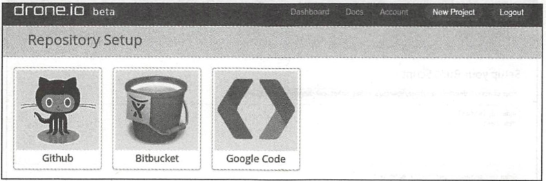
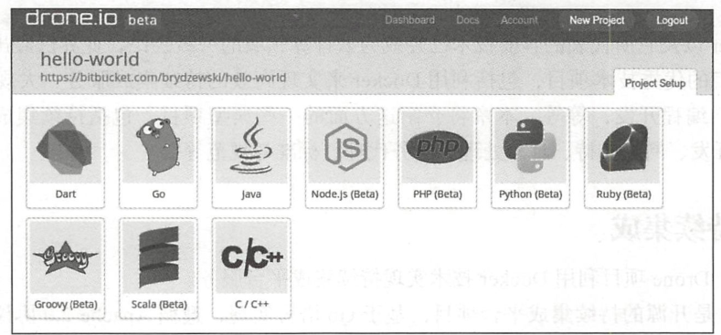
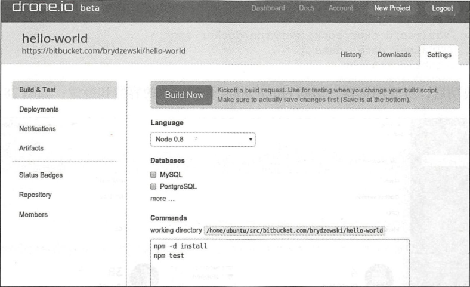

# 其他相关项目


## 1.持续集成

目前，Drone项目利用Docker技术实现持续集成平台服务。

Drone是开源的持续集成平台项目，基于Go语言实现，遵循Apache 2.0协议。项目官方网站为http://drone.io，代码在https://github.com/drone/drone维护。该项目最初由Drone公司在2014年2月发起，目前还处于开发阶段。Drone公司基于它，提供支持Github、Bitbucket和Google Code等第三方代码托管平台的持续集成服务，如图

Drone公司主页



Drone基于Docker和AUFS实现，为用户提供基于网站的操作。用户登录网站后，可以选择源码的存放服务。

此处选择Github服务，进入Github仓库，如图所示。然后从仓库列表中选择项目。

Github仓库


配置项目的语言种类，如图

配置项目的语言



接下来需要检查创建命令是否正确，并根据具体情况进行调整，如图

创建命令


最后，项目就可以在Drone平台上进行持续集成管理了，如图所示。

在Drone平台进行持续集成管理



## 2.容器管理

Docker官方工具已经提供了十分强大的管理功能。目前，已经有若干开源项目试图实现更为强大和便捷的Docker管理工具，包括Portainer、Panamax等。


### 2.1 Portainer

Portainer项目前身为DockerUI项目，定位于管理本地或远端（需要开启网络访问）的容器资源。官方网站为https://portainer.io/，目前支持对Docker和Swarm进行管理。

该项目最早于2013年12月发起，主要基于HTML/JS语言实现，遵循MIT许可。用户可以通过下面的命令简单测试该工具：

```shell
$ docker volume create portainer_data
$ docker run -d -p 9000:9000 \
    -v /var/run/docker.sock:/var/run/docker.sock \
    -v portainer_data:/data \
    portainer/portainer
```

运行成功后，打开浏览器，访问http://:9000管理本地的容器和镜像,如图:


`docker-compose.yaml`

```
version: '3'

services:
  Portainer:
    image: portainer/portainer:latest
    restart: always
    container_name: portainer-ui
    volumes:
      - "/var/run/docker.sock:/var/run/docker.sock"
      - "./portainer_data:/data"
      - "./public:/public"
    ports:
      - 9000:9000
```


### 2.2 Panamax

 项目官方网站为http://panamax.io，代码在https://github.com/CenturyLinkLabs/panamax-ui维护。

Panamax项目诞生于2014年3月，由CenturyLink实验室发起（是该实验室孵化出的第一个开源项目），希望通过一套优雅的界面来实现对复杂的Docker容器应用的管理，例如利用简单拖曳来完成操作。Panamax项目基于Docker、CoreOS和Fleet，可以提供对容器的自动化管理和任务调度，其主页如图所示。

Panamax官方网站


Panamax项目基于Ruby语言，遵循Apache 2许可，可以部署在Google、Amazon等云平台甚至本地环境。此外，Panamax还提供了开源应用的模板库来集中管理不同应用的配置和架构。


### 2.3 Seagull

Seagull是由小米团队发起的Docker容器和镜像的Web界面监控工具，支持同时监控多个Docker环境，代码已开源在https://github.com/tobegit3hub/seagull。

如图

Seagull官方网站


seagull基于Go和JavaScript实现，集成了Beego、AngularJS、Bootstrap、Bower、JQuery和Docker等工具。它在本地运行一个Web服务，通过Beego实现的API服务器不断请求Docker本地套接字以管理Docker。使用方法介绍如下。

下载镜像：

```shell
$ docker pull tobegit3hub/seagull
```

运行镜像：

```shell
$ docker run -d -p 10086:10086 -v /var/run/docker.sock:/var/run/docker.socktobegit3hub/seagull
```

然后就可以通过浏览器访问地址http://127.0.0.1:10086登录管理界面。

安装Go语言环境后，可以通过如下步骤来本地编译和安装：

```shell
$ go get github.com/astaxie/beego
$ go get github.com/tobegit3hub/seagull
$ go build seagull.go
$ sudo ./seagull
```


## 3.编程开发

由于Docker服务端提供了REST风格的API，通过对这些API进一步的封装，可以提供给各种开发语言作为Docker的SDK。这里以docker-py项目为例，介绍在Python语言中对Docker相关资源进行操作。

### 3.1 安装docker-py

docker-py项目是基于Python语言的Docker客户端，代码开源在https://github.com/docker/docker-py上。最新的稳定版本也已经推送到PyPI上，可以通过pip命令快速安装：

```
$ sudo pip install docker[tls]
```

安装后，查看源代码可以发现，代码结构十分清晰，主要提供了Client类，用来封装提供用户可以用Docker命令执行的各种操作，包括build、run、commit、create_container、info等等接口。

对REST接口的调用使用了request库。对于这些API，用户也可以通过curl来进行调用测试。

### 3.2 使用示例

打开Python的终端，首先创建一个Docker客户端连接：

```
$ sudo python
>>> import docker
>>> c = docker.DockerClient(base_url='unix://var/run/docker.sock',version='auto', timeout=10)
```

通过info()方法查看Docker系统信息：

```
>>> c.info()
{'ID': 'RXBF:A62S:BTI5:...:YAUG:VQ3N', 'Containers': 0, 'ContainersRunning': 0, 'ContainersPaused': 0, 'ContainersStopped': 0, 'Images': 95, 'Driver': 'overlay2', 'DriverStatus': [['Backing Filesystem', 'extfs'],...}
```

通过images和containers属性可以查看和操作本地的镜像和容器资源：

```
>>> c.images.list()
[<Image: 'node:slim'>, <Image: 'node:latest'>, <Image: 'docs/docker.github.io:latest'>, ...,]
```

通过create_container()方法来创建一个容器，之后启动它：

```
>>> container = c.containers.create(image='ubuntu:latest', command='bash')
>>> print(container)
{u'Id': u'a8439e4c8e64a94a287d408fdc3ff9a0b4a8577fe3b5e32975b790afb41414af', u'Warnings': None}
>>> container.start()
```

或者更简单地通过如下代码直接运行容器：

```
import docker
client = docker.from_env()
print client.containers.run("ubuntu:16.04", ["echo", "Hello", "World"])
```

可见，所提供的方法与Docker提供的命令十分类似。实际上，在使用SDK执行Docker命令的时候，也是通过Docker服务端提供的API进行了封装。

## 4.网络支持


