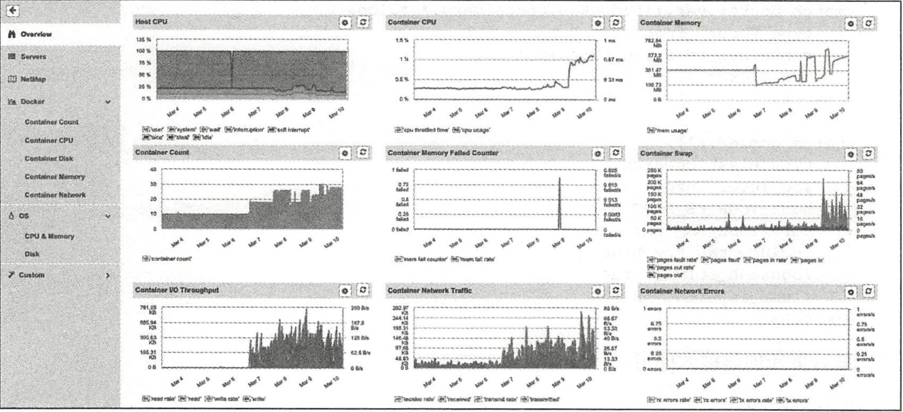

# 其他相关项目


## 1.持续集成

目前，Drone项目利用Docker技术实现持续集成平台服务。

Drone是开源的持续集成平台项目，基于Go语言实现，遵循Apache 2.0协议。项目官方网站为http://drone.io，代码在https://github.com/drone/drone维护。该项目最初由Drone公司在2014年2月发起，目前还处于开发阶段。Drone公司基于它，提供支持Github、Bitbucket和Google Code等第三方代码托管平台的持续集成服务，如图

Drone公司主页


Drone基于Docker和AUFS实现，为用户提供基于网站的操作。用户登录网站后，可以选择源码的存放服务。

此处选择Github服务，进入Github仓库，如图所示。然后从仓库列表中选择项目。

Github仓库


配置项目的语言种类，如图

配置项目的语言


接下来需要检查创建命令是否正确，并根据具体情况进行调整，如图

创建命令


最后，项目就可以在Drone平台上进行持续集成管理了，如图所示。

在Drone平台进行持续集成管理


## 2.容器管理

Docker官方工具已经提供了十分强大的管理功能。目前，已经有若干开源项目试图实现更为强大和便捷的Docker管理工具，包括Portainer、Panamax等。


### 2.1 Portainer

Portainer项目前身为DockerUI项目，定位于管理本地或远端（需要开启网络访问）的容器资源。官方网站为https://portainer.io/，目前支持对Docker和Swarm进行管理。

该项目最早于2013年12月发起，主要基于HTML/JS语言实现，遵循MIT许可。用户可以通过下面的命令简单测试该工具：

```shell
$ docker volume create portainer_data
$ docker run -d -p 9000:9000 \
    -v /var/run/docker.sock:/var/run/docker.sock \
    -v portainer_data:/data \
    portainer/portainer
```

运行成功后，打开浏览器，访问http://:9000管理本地的容器和镜像,如图:


`docker-compose.yaml`

```
version: '3'

services:
  Portainer:
    image: portainer/portainer:latest
    restart: always
    container_name: portainer-ui
    volumes:
      - "/var/run/docker.sock:/var/run/docker.sock"
      - "./portainer_data:/data"
      - "./public:/public"
    ports:
      - 9000:9000
```


### 2.2 Panamax

 项目官方网站为http://panamax.io，代码在https://github.com/CenturyLinkLabs/panamax-ui维护。

Panamax项目诞生于2014年3月，由CenturyLink实验室发起（是该实验室孵化出的第一个开源项目），希望通过一套优雅的界面来实现对复杂的Docker容器应用的管理，例如利用简单拖曳来完成操作。Panamax项目基于Docker、CoreOS和Fleet，可以提供对容器的自动化管理和任务调度，其主页如图所示。

Panamax官方网站


Panamax项目基于Ruby语言，遵循Apache 2许可，可以部署在Google、Amazon等云平台甚至本地环境。此外，Panamax还提供了开源应用的模板库来集中管理不同应用的配置和架构。


### 2.3 Seagull

Seagull是由小米团队发起的Docker容器和镜像的Web界面监控工具，支持同时监控多个Docker环境，代码已开源在https://github.com/tobegit3hub/seagull。

如图

Seagull官方网站


seagull基于Go和JavaScript实现，集成了Beego、AngularJS、Bootstrap、Bower、JQuery和Docker等工具。它在本地运行一个Web服务，通过Beego实现的API服务器不断请求Docker本地套接字以管理Docker。使用方法介绍如下。

下载镜像：

```shell
$ docker pull tobegit3hub/seagull
```

运行镜像：

```shell
$ docker run -d -p 10086:10086 -v /var/run/docker.sock:/var/run/docker.socktobegit3hub/seagull
```

然后就可以通过浏览器访问地址http://127.0.0.1:10086登录管理界面。

安装Go语言环境后，可以通过如下步骤来本地编译和安装：

```shell
$ go get github.com/astaxie/beego
$ go get github.com/tobegit3hub/seagull
$ go build seagull.go
$ sudo ./seagull
```


## 3.编程开发

由于Docker服务端提供了REST风格的API，通过对这些API进一步的封装，可以提供给各种开发语言作为Docker的SDK。这里以docker-py项目为例，介绍在Python语言中对Docker相关资源进行操作。

### 3.1 安装docker-py

docker-py项目是基于Python语言的Docker客户端，代码开源在https://github.com/docker/docker-py上。最新的稳定版本也已经推送到PyPI上，可以通过pip命令快速安装：

```
$ sudo pip install docker[tls]
```

安装后，查看源代码可以发现，代码结构十分清晰，主要提供了Client类，用来封装提供用户可以用Docker命令执行的各种操作，包括build、run、commit、create_container、info等等接口。

对REST接口的调用使用了request库。对于这些API，用户也可以通过curl来进行调用测试。

### 3.2 使用示例

打开Python的终端，首先创建一个Docker客户端连接：

```
$ sudo python
>>> import docker
>>> c = docker.DockerClient(base_url='unix://var/run/docker.sock',version='auto', timeout=10)
```

通过info()方法查看Docker系统信息：

```
>>> c.info()
{'ID': 'RXBF:A62S:BTI5:...:YAUG:VQ3N', 'Containers': 0, 'ContainersRunning': 0, 'ContainersPaused': 0, 'ContainersStopped': 0, 'Images': 95, 'Driver': 'overlay2', 'DriverStatus': [['Backing Filesystem', 'extfs'],...}
```

通过images和containers属性可以查看和操作本地的镜像和容器资源：

```
>>> c.images.list()
[<Image: 'node:slim'>, <Image: 'node:latest'>, <Image: 'docs/docker.github.io:latest'>, ...,]
```

通过create_container()方法来创建一个容器，之后启动它：

```
>>> container = c.containers.create(image='ubuntu:latest', command='bash')
>>> print(container)
{u'Id': u'a8439e4c8e64a94a287d408fdc3ff9a0b4a8577fe3b5e32975b790afb41414af', u'Warnings': None}
>>> container.start()
```

或者更简单地通过如下代码直接运行容器：

```
import docker
client = docker.from_env()
print client.containers.run("ubuntu:16.04", ["echo", "Hello", "World"])
```

可见，所提供的方法与Docker提供的命令十分类似。实际上，在使用SDK执行Docker命令的时候，也是通过Docker服务端提供的API进行了封装。

## 4.网络支持

围绕Docker网络的管理和使用，现在已经诞生了一些方便用户操作的工具和项目，具有代表性的包括pipework、Flannel、Weave以及Calico项目。

### 4.1 Pipework

Jérôme Petazzoni编写了一个叫Pipework的shell脚本，代码托管在https://github.com/jpetazzo/pipework上，该工具封装了底层通过ip、brctl等网络设备操作的命令，可以简化在比较复杂的场景中对容器连接的操作命令。


使用该工具，可以轻松地配置容器的IP地址、为容器划分VLan等功能。

例如，分别启动两个终端，在其中创建两个测试容器c1和c2，并查看默认网卡配置。利用Pipework为容器c1和c2添加新的网卡eth1，并将它们连接到新创建的br1网桥上：

```shell
$ sudo pipework br1 c1 192.168.1.1/24
$ sudo pipework br1 c2 192.168.1.2/24
```

此时在主机系统中查看网桥信息，会发现新创建的网桥br1，并且有两个veth端口连接上去：

```shell
$ sudo brctl show
bridge name     bridge id               STP enabled     interfaces
br1             8000.868b605fc7a4       no              veth1pl17805
                                                        veth1pl17880
docker0         8000.56847afe9799       no              veth89934d8
```

此时，容器c1和c2可以通过子网192.168.1.0/16相互连通。

另外，Pipework还支持指定容器内的网卡名称、MAC地址、网络掩码和网关等配置，甚至可以通过macvlan连接容器到本地物理网卡，实现跨主机通信。

pipework代码只有200多行，建议阅读这些代码以理解如何利用Linux系统上的iproute等工具实现容器连接的配置。


### 4.2 Flannel项目

Flannel由CoreOS公司推出，现在主要面向Kubernetes，为其提供底层的网络虚拟化方案，代码托管在https://github.com/coreos/flannel上。

Flannel采用了典型的覆盖网络的思路，在每个主机上添加一个隧道端点，所有跨主机的流量会经过隧道端点进行隧道封包（典型为VXLAN协议，Docker Swarm也支持），直接发送到对端，如图

Flannel的设计思路


与传统的基于覆盖网络的网络虚拟化方案类似，这种设计的优势在于有很好的扩展性，只要IP连通的主机即可构成同一个虚拟网络，甚至可以跨数据中心。

问题也很明显，一个是隧道协议目前还比较难追踪，另一个是解包和封包处理负载重，如果没有硬件进行处理则往往性能会有损耗。另外，当中间路径存在负载均衡设备时，要避免均衡失效。


### 4.3 Weave Net项目

Weave Net是由Weave公司开发的面向容器的网络虚拟化方案，项目托管在https://git-hub.com/weaveworks/weave上。解决容器网络跨主机问题的思路主要是打通跨主机容器之间的通信，手段无非是用覆盖网络建立隧道，或者通过更改包头进行转发。

Weave Net的设计比较有意思，在每个主机上添加一个路由器，在混杂模式下使用pcap在网桥上截获网络数据包。如果该数据包是要发送到其他主机上的，则通过UDP进行转发，到目的主机所在的路由器上。目的路由器执行相反的过程利用pcap解析网包再发送给网桥。整个过程模拟了一种隧道方式，如图


Weave Net项目的设计思路

这样设计的好处是可以进行细粒度的管理，整个转发过程很容易追踪；潜在的问题是对管理平面（特别是路由器的自动收敛和学习）要求比较复杂，并且执行pcap过程会比较消耗计算资源。

实际部署中要考虑结合软件定义网络和硬件处理等手段来缓解这两个问题。

​	

### 4.4 Calico项目

项目官方网站在https://www.projectcalico.org/。

https://projectcalico.docs.tigera.io/about/about-calico

Calico的设计则更为直接，干脆不支持网络虚拟化，直接采用传统的路由转发机制，也是在每个节点上配置一个vRouter，负责处理跨主机的流量。vRouter之间通过BGP自动学习转发策略,详细内容查看官方文档。

由于Calico不采用隧道格式，而是依赖于传统的IP转发，这就限制了它的应用场景，无法跨数据中心，无法保障中间路径安全。但反之带来了容易管理、转发性能会好的一些优势。

Calico目前支持VM、Docker、Kubernetes、Openstack等多个项目的容器网络功能。

Calico项目目前正在与Flannel项目共同发起Canal项目，整合了两者的优势，项目地址在https://github.com/projectcalico/canal。

## 5.日志处理

Docker默认将日志输出到标准输出，也支持包括syslog等标准的日志协议，因此很容易跟已有的日志采集工具进行整合。本节介绍三个日志处理项目。

### 5.1 Docker-Fluentd

代码托管在https://github.com/kiyoto/docker-fluentd。Docker-Fluentd以容器运行，使用fluentd收集其他容器的运行日志，重定向到文件或者第三方的分析引擎中。

使用方法很简单，直接启动一个本地采集容器即可：

```shell
$ docker run -d -v /var/lib/docker/containers:/var/lib/docker/containers kiyoto/docker-fluentd
```

如果要重定向到其他分析引擎，比如Elasticsearch，可以更改dockerfile，加入如下内容：

```
RUN ["apt-get", "update"]
RUN ["apt-get", "install", "--yes", "make", "libcurl4-gnutls-dev"]
RUN ["/usr/local/bin/gem", "install", "fluent-plugin-elasticsearch", "--no-rdoc", "--no-ri"]
```

同时修改fluent.conf如下：

```
<source>
    type tail
    path /var/lib/docker/containers/*/*-json.log
    pos_file /var/log/fluentd-docker.pos
    time_format %Y-%m-%dT%H:%M:%S
    tag docker.*
    type record_reformer
    container_id ${tag_parts[5]}
    tag docker.all
</match>
<match docker.all>
    type elasticsearch
    log_level info
    host YOUR_ES_HOST
    port YOUR_ES_PORT
    include_tag_key true
    logstash_format true
    flush_intercal 5s
</match>
```

最后重新创建镜像即可。

### 5.2 logspout

logspout由gliderlabs推出，基于Golang实现，代码托管在https://github.com/gliderlabs/logspout。与Fluentd类似，logspout也是提供一个本地的agent，采集主机上所有容器的标准输出，然后发送到采集端。

logspout支持对所采集的容器进行筛选，并且支持Syslog、Kafka、Redis、Logstash等多种采集后端。

典型的应用是发送到远端的syslog服务器，执行命令也十分简单。需要注意，如果用容器方式启动，则把本地的docker.sock句柄映射到容器内：

```shell
$ docker run --name="logspout" \
    --volume=/var/run/docker.sock:/var/run/docker.sock \
    gliderlabs/logspout \
    syslog+tls://your_syslog_server:5000
```

### 5.3 Sematext-agent-docker

Sematext Docker Agent通过Docker API为SPM Docker Monitor收集状态统计、事件和日志等信息，它支持多种平台，CoreOS、Rancher OS、Docker Swarm、Kubernetes等。

代码托管在https://github.com/sematext/sematext-agent-docker。

Sematext提供了丰富的前端显示功能，如图

Sematext的显示功能




## 6.服务代理

服务代理（又叫反向代理）是指以代理服务器接受Internet上的连接请求，然后将请求转发给内部网络上的服务器，并将从服务器上得到的结果返回给Internet上请求连接的客户端，此时代理服务器对外就表现为一个服务器。

服务代理服务器也可以作为负载均衡器，隐藏后端真正服务器的细节，提高统一访问接口地址，原理如图


服务代理的原理


下面介绍支持Docker环境的一些服务代理开源项目。


### 6.1 Traefik

项目官方网址：https://traefik.io/。

代码网址：https://github.com/containous/traefik。

Traefix是一个可以用来简化微服务部署的HTTP代理服务器和负载均衡服务器，支持多种后端服务（Docker、Swarm、Mesos、Marathon、Kubernetes、Consul、Etcd、ZooKeeper、BoltDB、Rest API、file等）。

传统的代理服务器不适应于动态环境，配置的动态改变一般难以实现，而微服务架构恰恰是动态的，服务的添加、去除和升级经常发生。

Traefix可以监听服务注册/编排的API，当服务状态发生改变时，动态更新反向代理服务器的配置。功能逻辑如图

Traefix的功能逻辑


同时提供可视化的WebUI进行配置和状态监测，如图


运行方式包括二进制模式和容器模式。

二进制模式的方法为：

下载binary和配置文件：https://github.com/containous/traefik/releases和https://raw.githubusercontent.com/containous/traefik/master/traefik.sample.toml，然后直接运行：

```shell
$ ./traefik -c traefik.toml
```

容器模式的方法为：

```shell
$ docker run -d -p 8080:8080 -p 80:80 -v $PWD/traefik.toml:/etc/traefik/traefik.toml traefik
```

> traefik最新中文文档
>
> https://www.traefik.tech/

### 6.2 Muguet

Muguet提供服务代理和自动DNS解析功能，这样应用可以使用域名来访问容器，而不需要在使用静态端口和IP。

代码网址：https://github.com/mattallty/muguet。功能逻辑如图


安装和使用都比较简单。

安装Muguet：

```
$ npm install -g muguet
```

启动Muguet（as root）：

```
$ sudo muguet up
```

Muguet提供WebUI，默认域名http://muguet.docker，如图

Muguet的可视化界面


### 6.3 nginx-proxy

Nginx除了是强大的Web服务器之外，还是个优秀的代理工具。

nignx-proxy以容器方式自动运行Nginx和docker-gen命令，其中docker-gen负责产生代理配置文件并在容器启动时进行加载。

代码网址：https://github.com/jwilder/nginx-proxy。使用方法如下。

首先，运行nignx-proxy：

```shell
$ docker run -d -p 80:80 -v /var/run/docker.sock:/tmp/docker.sock:ro jwilder/nginx-proxy
```

之后，启动要被代理的容器即可：

```shell
$ docker run -d -e VIRTUAL_HOST=mywebsite.local --expose 8080 tomcat
```

`docker-compose.yaml`

```
version: '2'

services:
  nginx-proxy:
    image: nginxproxy/nginx-proxy
    ports:
      - "80:80"
    volumes:
      - /var/run/docker.sock:/tmp/docker.sock:ro

  whoami:
    image: jwilder/whoami
    expose:
      - "8000"
    environment:
      # 如果您的DNS设置为将whoami.local转发到运行nginx-proxy的主机，则请求将被路由到设置了VIRTUAL_HOST的容器。
      # 不支持在VIRTUAL_HOST中提供端口号,可以是容器名
      - VIRTUAL_HOST=whoami.local
      - VIRTUAL_PORT=8000
```


## 7.标准与规范

随着Docker带来的容器技术爆发，社区在不断增强容器技术易用性的同时，也在思考如何更长远地发展容器技术，如兼容不同的容器标准，适应更多类型的操作系统平台以及设计应用等。

目前沿着这个方向努力，已经有了一些组织（如开放容器倡议OCI）在倡导成立一些推荐大家都遵守的容器标准和规范，同时也总结了一些面向云应用的设计实践经验。

### 7.1 runC标准

runC标准最早由Docker公司在2014年2月左右推出，项目地址为https://github.com/opencontainers/runc，它的目标是打造一套轻量级的标准化的容器运行环境。

通过它，容器可以在多种平台上得到统一的运行时环境以及更好的资源隔离。目前，runC已经贡献成为开放容器标准的重要实现，得到了包括Docker、Google、IBM在内的众多厂家的支持。目前，Docker 1.11+版本中已经默认集成了runC机制的支持。


### 7.2 appC标准

appC来自于另外一家容器领域的积极贡献者CoreOS公司，最早在2014年11月左右提出，项目地址为https://github.com/appc。除了对运行时环境进行了一些定义，appC还对容器如何进行打包、如何保持对环境的配置（挂载点、环境变量）、如何验证镜像、如何传输镜像等尝试进行规定。

遵循appC标准，CoreOS公司实现了rkt容器机制。目前，appC也已经贡献给了开放容器倡议组织，尝试推出更开放规范的标准。


### 7.3 开放容器规范

为了推动容器标准化，2015年6月22日，AWS、EMC、IBM、谷歌、Docker、CoreOS、redhat等数十家公司共同牵头成立了开放容器倡议组织（Open Container Initiative，OCI），旨在建立一套通用的容器规范OCF。该组织现在受到Linux基金会的支持，其官方网站为https://www.opencontainers.org。

目前，OCI正在推动所提出的开放容器规范（Open Container Format，OCF），融合了来自runC、appC等多家容器规范，试图打造一套移植性好、开放统一的容器标准。目前已经有了对容器运行时、镜像格式等方面的规范草案。


OCF对标准容器运行时规范制定了5条原则：

- 标准化操作（Standard operations）：包括创建、删除、打包容器等操作都必须标准化；
- 内容无关性（Content agnostic）：操作应该跟内容无关，保持行为上的一致性；
- 平台无关性（Infrastructure agnostic）：在任何支持OCI的平台上，操作都必须能同等执行；
- 设计考虑自动化（Designed for automation）：标准容器是为自动化而生，其规范必须考虑自动化条件；
- 企业级交付（Industrial grade delivery）：标准容器需要适用于企业级流水线的交付任务。


### 7.4 云应用12要素

在云计算时代，应用的整个生命周期将在数据中心里度过，这与传统软件模式极大不同。云应用实际上意味着：代码+配置+运行时环境。那么就会有如下问题：

- 什么样的软件才是可用性和可维护性好的软件？

- 什么样的代码才能避免后续开发的上手障碍？

- 什么样的实施才能可靠地运行在分布式的环境中？

Heroku（一家PaaS服务提供者，2010年被Salesforce收购）平台创始人Adam Winggins提出了“云应用12要素”，对开发者设计和实现云时代（特别是PaaS和SaaS上）高效的应用都有很好的参考意义

（1）Codebase——代码仓库

One codebase tracked in revision control，many deploys.

每个子系统都用独立代码库管理，使用版本管理，实现独立的部署。

即拆分系统为多个分布式应用，每个应用使用自己的代码库进行管理。多个应用之间共享的代码用依赖库的形式提供。


（2）Dependencies——依赖

Explicitly declare and isolate dependencies.

显式声明依赖，通过环境来严格隔离不同依赖。所依赖的跟所声明的要保持一致。并且声明要包括依赖库的版本信息。


（3）Config——配置

Store config in the environment.

在环境变量中保存配置信息，而避免放在源码或配置文件中。


（4）Backing Services——后端服务

Treat backing services as attached resources.

后端服务（数据库、消息队列、缓存等）作为可挂载资源来使用，这样系统跟外部依赖尽量松耦合。


（5）Build，release，run——生命周期管理

Strictly separate build and run stages.

区分不同生命周期的运行环境，包括创建（代码编译为运行包）、发布（多个运行包和配置放一起打包，打包是一次性的，每次修改都是新的release）、运行，各个步骤的任务都很明确，要相互隔离。例如，绝对不允许在运行时去改代码和配置信息（见过太多工程师直接SSH到生产环境修bug了）。


（6）Processes——进程

Execute the app as one or more stateless processes.

以一个或多个无状态的进程来运行应用，即尽量实现无状态，不要在进程中保存数据。尽量通过数据库来共享数据。


（7）Port binding——端口

Export services via port binding.

通过端口绑定来对外提供服务。

可以是HTTP、XMPP、Redis等协议。多个应用之间通过URL来使用彼此的服务。


（8）Concurrency——并发模型

Scale out via the process model.

通过进程控制来扩展，即尽量以多进程模型进行扩展。


（9）Disposability——任意存活

Maximize robustness with fast startup and graceful shutdown.

快速启动（秒级响应），优雅关闭（收到SIGTERM信号后结束正在处理请求，然后退出），并尽量鲁棒（随时kill，随时crash都不应该导致问题）。


（10）Dev/prod parity——减少开发与生产环境的差异性

Keep development，staging，and production as similar as possible.

尽量保持从开发、演练到生产部署环境的相似性。

这点很不容易，要求工程师既懂研发，还得懂运维。


（11）Logs——日志

Treat logs as event streams.

将日志当作事件流来进行统一的管理和维护（使用Logstash等工具）。

应用只需要将事件写出来，例如到标准输出stdout，剩下的由采集系统处理。


（12）Admin processes——管理

Run admin/management tasks as one-off processes.

将管理（迁移数据库、查看状态等）作为一次性的系统服务来使用。

管理代码跟业务代码要放在一起进行代码管理。


