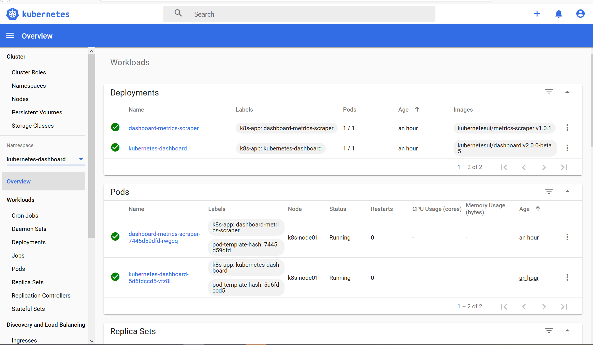

.. contents::
   :depth: 3
..

通过Kubeadm部署kubernetes
=========================

公司大部分线下测试环境均采用Kubeadm安装，这也是目前官方默认的安装方式，比二进制安装方式更加简单，可以让初学者快速上手并测试。目前GitHub上也有很多基于Ansible的自动化安装方式，但是为了更好地学习Kubernetes，还是建议体验一下Kubernetes的手动安装过程，以熟悉Kubernetes的各个组件。

基本环境配置
------------

+--------------+-----------------+--------------+
| 主机名       | IP地址          | 说明         |
+==============+=================+==============+
| k8s-master   | 172.16.60.236   | k8s-master   |
+--------------+-----------------+--------------+
| k8s-node1    | 172.16.60.178   | k8s-node1    |
+--------------+-----------------+--------------+
| k8s-node2    | 172.16.60.226   | k8s-node2    |
+--------------+-----------------+--------------+
| k8s-node3    | 172.16.60.9     | k8s-node3    |
+--------------+-----------------+--------------+

部署步骤
--------

    以下不做特殊说明默认所有机子都执行

准备工作
~~~~~~~~

各节点通信采用主机名的方式，这种方式与IP地址相比较更具有扩展性。以下介绍具体的安装步骤。所有节点配置hosts，修改/etc/hosts如下：

.. code:: shell

    # 更新系统和软件包
    yum update

    # 设置主机名(master node 名字分开)
    hostnamectl set-hostname k8s-master

    # 同步时间
    systemctl restart chronyd

    # 添加host
    # 以下ip是所有机器的内网ip
    cat >> /etc/hosts <<'EOF'
    172.16.60.236   k8s-master
    172.16.60.178   k8s-node1 
    172.16.60.226   k8s-node2 
    172.16.60.9     k8s-node3 
    EOF

    cat >>/etc/resolv.conf <<'EOF'
    nameserver 8.8.8.8
    EOF

    # 设置所有机器间无密码访问
    ssh-keygen -t rsa
    for i in k8s-master k8s-node1 k8s-node2 k8s-node3;do ssh-copy-id -i /root/.ssh/id_rsa.pub $i;done

    # 关闭防火墙和iptables
    systemctl stop firewalld.service
    systemctl disable firewalld.service
    systemctl stop iptables.service
    systemctl disable iptables.service

    # 关闭SELinux
    setenforce 0
    sed -i "s/SELINUX=enforcing/SELINUX=disabled/g" /etc/selinux/config

    # 关闭swap
    swapoff -a && sysctl -w vm.swappiness=0
    sed -i '/ swap / s/^\(.*\)$/#\1/g' /etc/fstab 

注释swap挂载选项：

.. code:: shell

    # grep "swap" /etc/fstab 
    #UUID=a5ace1f8-ddcd-434d-afef-b5a73c7ef8e8 swap                    swap    defaults        0 0

所有节点同步时间。所有节点同步时间是必须的，并且需要加到开机自启动和计划任务中，如果节点时间不同步，会造成Etcd存储Kubernetes信息的键－值（key-value）数据库同步数据不正常，也会造成证书出现问题。时间同步配置如下：

.. code:: shell

    yum -y install ntp
    ln -sf /usr/share/zoneinfo/Asia/Shanghai /etc/localtime 
    echo "Asia/Shanghai" > /etc/timezone
    ntpdate time2.aliyun.com
    # 加入计划任务
    crontab -l
    */5 * * * * ntpdate time2.aliyun.com

    # 加入开机自启动
    cat /etc/rc.local 
    ntpdate time2.aliyun.com

    # 将桥接的IPv4流量传递到iptables的链
    cat > /etc/sysctl.d/k8s.conf << EOF
    net.bridge.bridge-nf-call-ip6tables = 1
    net.bridge.bridge-nf-call-iptables = 1
    EOF
    sysctl --system  # 生效

所有节点配置limit：

::

    ulimit -SHn 65535

所有节点都配置国内仓库源

.. code:: shell

    wget -O CentOS-Base.repo http://mirrors.aliyun.com/repo/Centos-7.repo

    wget -O /etc/yum.repos.d/epel.repo http://mirrors.aliyun.com/repo/epel-7.repo

加载 ipvs 内核模块
~~~~~~~~~~~~~~~~~~

-  安装 IPVS 模块

.. code:: shell

    yum -y install ipvsadm ipset sysstat conntrack libseccomp

-  设置开机加载配置文件

.. code:: shell

    cat >>/etc/modules-load.d/ipvs.conf<<EOF
    ip_vs_dh
    ip_vs_ftp
    ip_vs
    ip_vs_lblc
    ip_vs_lblcr
    ip_vs_lc
    ip_vs_nq
    ip_vs_pe_sip
    ip_vs_rr
    ip_vs_sed
    ip_vs_sh
    ip_vs_wlc
    ip_vs_wrr
    nf_conntrack_ipv4
    EOF

-  设置开机加载 IPVS 模块

.. code:: shell

    # 设置开机加载内核模块
    systemctl enable systemd-modules-load.service   

    # 重启后检查 ipvs 模块是否加载
    lsmod | grep -e ip_vs -e nf_conntrack_ipv4     

-  如果集群已经部署在了 iptables 模式下，可以通过下面命令修改，修改 mode
   为 ipvs 重启集群即可。

::

    kubectl edit -n kube-system configmap kube-proxy

安装docker
~~~~~~~~~~

.. code:: shell

    # master执行以下转到repo目录
    cd /etc/yum.repos.d/

    # master执行下载docker阿里云镜像
    wget http://mirrors.aliyun.com/docker-ce/linux/centos/docker-ce.repo

    # master同步到其他服务器
    [root@k8s-master yum.repos.d]# for i in k8s-master k8s-node1 k8s-node2 k8s-node3;do scp docker-ce.repo $i:/etc/yum.repos.d/;done
    docker-ce.repo                                                                                                             100% 2640   162.5KB/s   00:00    
    docker-ce.repo                                                                                                             100% 2640     3.5MB/s   00:00    
    docker-ce.repo                                                                                                             100% 2640     3.7MB/s   00:00 

    # 安装docker(各个都要装)
    yum -y install docker-ce

    # 修改配置
    nano /usr/lib/systemd/system/docker.service

    # master增加一行如下
    ExecStartPost=/usr/sbin/iptables -P FORWARD ACCEPT

    # 配置阿里云镜像加速
    sudo mkdir -p /etc/docker
    sudo tee /etc/docker/daemon.json <<-'EOF'
    {
      "registry-mirrors": ["https://25bxwt20.mirror.aliyuncs.com"]
    }
    EOF

    # 重启docker
    sudo systemctl daemon-reload
    sudo systemctl restart docker
    systemctl enable docker
    systemctl restart docker

安装kubeadm, kubectl, kubelet
~~~~~~~~~~~~~~~~~~~~~~~~~~~~~

.. code:: shell

    # master执行以下
    cat >> /etc/yum.repos.d/kubernetes.repo <<'EOF'
    [kubernetes]
    name=Kubernetes Repository
    baseurl=https://mirrors.aliyun.com/kubernetes/yum/repos/kubernetes-el7-x86_64/
    gpgcheck=1
    gpgkey=https://mirrors.aliyun.com/kubernetes/yum/doc/rpm-package-key.gpg https://mirrors.aliyun.com/kubernetes/yum/doc/yum-key.gpg
    EOF

    # master检查仓库
    yum repolist
    yum list all | grep "^kube"

    # master执行安装
    yum install kubeadm kubelet kubectl -y

    # 检查安装
    rpm -ql kubectl 
    rpm -ql kubeadm

    # master上把仓库拷贝过去
    cd /etc/yum.repos.d/
    for i in k8s-master k8s-node1 k8s-node2 k8s-node3;do scp  kubernetes.repo $i:/etc/yum.repos.d/

    # 所有node安装kubelet kubeadm
    yum install kubelet kubeadm -y

    # master和node执行以下
    systemctl enable kubelet.service

    # master查看所需的镜像
    kubeadm config images list

    # 所有机器都执行以下的拉取镜像的操作
    # 由于kubeadm依赖国外的k8s.gcr.io的镜像，国内被墙所以这边的解决方案是下载国内的镜像重新打tag的方式
    cat > images_pull_k8s.sh <<'EOF'
    #!/bin/bash
    k8s_Version="v1.18.3"

    images=(  
        # 下面的镜像应该去除"k8s.gcr.io/"的前缀
        kube-apiserver:${k8s_Version}
        kube-controller-manager:${k8s_Version}
        kube-scheduler:${k8s_Version}
        kube-proxy:${k8s_Version}
        pause:3.2
        etcd:3.4.3-0
        coredns:1.6.7
    )
     
    for imageName in ${images[@]} ; do
        docker pull mirrorgcrio/$imageName
        docker tag mirrorgcrio/$imageName k8s.gcr.io/$imageName
        docker rmi mirrorgcrio/$imageName
    done
    EOF

    chmod 755 images_pull_k8s.sh
    ./images_pull_k8s.sh

或者直接手动拉取镜像

.. code:: shell

    docker pull mirrorgcrio/kube-apiserver:v1.18.3
    docker pull mirrorgcrio/kube-controller-manager:v1.18.3
    docker pull mirrorgcrio/kube-scheduler:v1.18.3
    docker pull mirrorgcrio/kube-proxy:v1.18.3
    docker pull mirrorgcrio/pause:3.2
    docker pull mirrorgcrio/etcd:3.4.3-0
    docker pull mirrorgcrio/coredns:1.6.7
     
    docker tag mirrorgcrio/kube-apiserver:v1.18.3 k8s.gcr.io/kube-apiserver:v1.18.3
    docker tag mirrorgcrio/kube-controller-manager:v1.18.3 k8s.gcr.io/kube-controller-manager:v1.18.3
    docker tag mirrorgcrio/kube-scheduler:v1.18.3 k8s.gcr.io/kube-scheduler:v1.18.3
    docker tag mirrorgcrio/kube-proxy:v1.18.3 k8s.gcr.io/kube-proxy:v1.18.3
    docker tag mirrorgcrio/pause:3.2 k8s.gcr.io/pause:3.2
    docker tag mirrorgcrio/etcd:3.4.3-0 k8s.gcr.io/etcd:3.4.3-0
    docker tag mirrorgcrio/coredns:1.6.7 k8s.gcr.io/coredns:1.6.7
     
    docker image rm mirrorgcrio/kube-apiserver:v1.18.3
    docker image rm mirrorgcrio/kube-controller-manager:v1.18.3
    docker image rm mirrorgcrio/kube-scheduler:v1.18.3
    docker image rm mirrorgcrio/kube-proxy:v1.18.3
    docker image rm mirrorgcrio/pause:3.2
    docker image rm mirrorgcrio/etcd:3.4.3-0
    docker image rm mirrorgcrio/coredns:1.6.7

Master初始化kubeadm
-------------------

    本小节的所有的操作，只在 Master 节点上进行

.. code:: shell

    # master执行init初始化
    kubeadm init \
    --kubernetes-version="v1.18.3" \
    --pod-network-cidr="10.244.0.0/16" \
    --ignore-preflight-errors="NumCPU"

    # 在当前用户家目录下创建.kube目录并配置访问集群的config 文件
    mkdir -p $HOME/.kube
    sudo cp -i /etc/kubernetes/admin.conf $HOME/.kube/config
    sudo chown $(id -u):$(id -g) $HOME/.kube/config

    # 应用网络插件flannle
    [root@k8s-master home]# kubectl apply -f https://raw.githubusercontent.com/coreos/flannel/master/Documentation/kube-flannel.yml

    # 查看 kube-system 命名空间中运行的 pods
    kubectl get pods -n kube-system

    # 查看 k8s 集群组件的状态
    kubectl get ComponentStatus

    # 配置命令补全
    yum install -y bash-completion
    source /usr/share/bash-completion/bash_completion
    source <(kubectl completion bash)
    echo "source <(kubectl completion bash)" >> ~/.bashrc

node加入集群
------------

.. code:: shell

    [root@k8s-node1 home]# kubeadm join 172.16.60.236:6443 --token 950v9y.z3lz25askvjw33ou \
    >     --discovery-token-ca-cert-hash sha256:e84f8923f43878b530c6d5879c258ccdd5caec1d02ee8d89d1d75b9bdf4d753e
    ......
    Run 'kubectl get nodes' on the control-plane to see this node join the cluster

-  如果初始化过程被中断可以使用下面命令来恢复

::

    kubeadm reset

-  下面是最后执行成功显示的结果，需要保存这个执行结果，以让 node
   节点加入集群

::

    Your Kubernetes control-plane has initialized successfully!

    To start using your cluster, you need to run the following as a regular user:

      mkdir -p $HOME/.kube
      sudo cp -i /etc/kubernetes/admin.conf $HOME/.kube/config
      sudo chown $(id -u):$(id -g) $HOME/.kube/config

    You should now deploy a pod network to the cluster.
    Run "kubectl apply -f [podnetwork].yaml" with one of the options listed at:
      https://kubernetes.io/docs/concepts/cluster-administration/addons/

    Then you can join any number of worker nodes by running the following on each as root:

    kubeadm join 172.16.100.9:6443 --token 2dyd69.hrfsjkkxs4stim7n \
        --discovery-token-ca-cert-hash sha256:4e30c1f41aefb177b708a404ccb7e818e31647c7dbdd2d42f6c5c9894b6f41e7

获得 join命令参数
~~~~~~~~~~~~~~~~~

**在 master 节点上执行**

::

    # 只在 master 节点执行
    kubeadm token create --print-join-command
     
        
    可获取kubeadm join 命令及参数，如下所示

    # kubeadm token create 命令的输出
    kubeadm join apiserver.demo:6443 --token mpfjma.4vjjg8flqihor4vt     --discovery-token-ca-cert-hash sha256:6f7a8e40a810323672de5eee6f4d19aa2dbdb38411845a1bf5dd63485c43d303

    有效时间

    该 token 的有效时间为 2 个小时，2小时内，您可以使用此 token
    初始化任意数量的 worker 节点。

查看部署状态
------------

.. code:: shell

    # master查看node节点状态
    kubectl get nodes

    # master查看kube-system命名空间下的pod启动的状态
    kubectl get po -n kube-system

    # 如果有pod一直启动不起来，通过describe查看状态
    kubectl describe po/{具体的pod名字} -n kube-system

安装 Ingress Controller
-----------------------

**安装**

::

    # 只在 master 节点执行
    kubectl apply -f https://kuboard.cn/install-script/v1.19.x/nginx-ingress.yaml

**卸载**

只在您想选择其他 Ingress Controller 的情况下卸载

::

    # 只在 master 节点执行
    kubectl delete -f https://kuboard.cn/install-script/v1.19.x/nginx-ingress.yaml

**定制化ingress**

::

    # 如果打算用于生产环境，请参考 https://github.com/nginxinc/kubernetes-ingress/blob/v1.5.5/docs/installation.md 并根据您自己的情况做进一步定制

查看ingress运行状态

::

    [root@k8s-master ~]# kubectl get pods --all-namespaces
    NAMESPACE       NAME                                       READY   STATUS    RESTARTS   AGE
    kube-system     calico-kube-controllers-6c89d944d5-th2k7   1/1     Running   0          3h25m
    kube-system     calico-node-j4g9n                          0/1     Running   0          45m
    kube-system     calico-node-qt6sk                          0/1     Running   0          3h25m
    kube-system     coredns-59c898cd69-2tnvl                   1/1     Running   1          3h25m
    kube-system     coredns-59c898cd69-cdxxq                   1/1     Running   0          3h25m
    kube-system     etcd-k8s-master                            1/1     Running   0          3h25m
    kube-system     kube-apiserver-k8s-master                  1/1     Running   1          3h25m
    kube-system     kube-controller-manager-k8s-master         1/1     Running   6          3h25m
    kube-system     kube-proxy-ptd7x                           1/1     Running   0          3h25m
    kube-system     kube-proxy-t97cs                           1/1     Running   0          45m
    kube-system     kube-scheduler-k8s-master                  1/1     Running   6          3h25m
    nginx-ingress   nginx-ingress-fzntf                        1/1     Running   0          6m21s

    [root@k8s-master ~]# kubectl get pod -n nginx-ingress
    NAME                  READY   STATUS    RESTARTS   AGE
    nginx-ingress-fzntf   1/1     Running   0          6m37s

安装Kubernetes Dashboard
------------------------

**安装**

执行如下命令，以安装 Kubernetes Dashboard

::

    kubectl apply -f https://raw.githubusercontent.com/kubernetes/dashboard/v2.0.0-beta5/aio/deploy/recommended.yaml

    // 可以直接下载
    $ wget https://raw.githubusercontent.com/kubernetes/dashboard/v2.0.0-beta8/aio/deploy/recommended.yaml

    如果访问不了该 yaml 文件，请使用下面的命令，效果是等价的

    ::

        kubectl apply -f https://kuboard.cn/install-script/k8s-dashboard/v2.0.0-beta5.yaml

**访问**

Kubernetes Dashboard 当前，只支持使用 Bearer Token登录。 由于 Kubernetes
Dashboard 默认部署时，只配置了最低权限的 RBAC。因此，我们要创建一个名为
``admin-user`` 的 ServiceAccount，再创建一个
ClusterRolebinding，将其绑定到 Kubernetes 集群中默认初始化的
``cluster-admin`` 这个 ClusterRole。

执行如下命令可创建 ServiceAccount 和 ClusterRoleBinding

::

    kubectl apply -f https://kuboard.cn/install-script/k8s-dashboard/auth.yaml

获取Bearer Token

执行命令：

::

    kubectl -n kubernetes-dashboard describe secret $(kubectl -n kubernetes-dashboard get secret | grep admin-user | awk '{print $1}')

因为Service是ClusterIP类型，为了方便使用，我们可通过\ ``kubectl --namespace=kubernetes-dashboard edit service kubernetes-dashboard``\ 修改成NodePort类型

::

    spec:
      clusterIP: 10.96.187.186
      externalTrafficPolicy: Cluster
      ports:
      - nodePort: 31966
        port: 443
        protocol: TCP
        targetPort: 8443
      selector:
        k8s-app: kubernetes-dashboard
      sessionAffinity: None
      type: NodePort        //修改这里

::

    [root@k8s-master ~]# kubectl get service -n kubernetes-dashboard
    NAME                        TYPE        CLUSTER-IP      EXTERNAL-IP   PORT(S)         AGE
    dashboard-metrics-scraper   ClusterIP   10.96.205.156   <none>        8000/TCP        70m
    kubernetes-dashboard        NodePort    10.96.187.186   <none>        443:31966/TCP   70m

使用 Firefox 浏览器访问，并忽略 HTTPS 校验错误。

给匿名用户授权

::

    $ kubectl create clusterrolebinding test:anonymous --clusterrole=cluster-admin --user=system:anonymous

安装Kuboard Kubernetes
----------------------

Kubernetes 容器编排已越来越被大家关注，然而使用 Kubernetes
的门槛却依然很高，主要体现在这几个方面：

-  集群的安装复杂，出错概率大
-  Kubernetes相较于容器化，引入了许多新的概念，学习难度高
-  需要手工编写 YAML 文件，难以在多环境下管理
-  缺少好的实战案例可以参考

Kuboard，是一款免费的 Kubernetes 图形化管理工具，Kuboard
力图帮助用户快速在 Kubernetes 上落地微服务。

参考文献：

https://www.cnblogs.com/xiao987334176/p/12060855.html

kubectl管理工具
---------------

kubectl管理工具远程连接集群
~~~~~~~~~~~~~~~~~~~~~~~~~~~

Kubectl客户端工具的主要功能是管理Kubernetes集群中的资源，使用kuberctl工具可以对资源进行创建、删除和更改等操作。

查看master上的kube-api server地址

::

    [root@k8s-m2 ~]# cat /etc/kubernetes/manifests/kube-apiserver.yaml |grep server
        kubeadm.kubernetes.io/kube-apiserver.advertise-address.endpoint: 192.168.1.73:8443
        component: kube-apiserver
      name: kube-apiserver
        - kube-apiserver
        - --etcd-certfile=/etc/kubernetes/pki/apiserver-etcd-client.crt
        - --etcd-keyfile=/etc/kubernetes/pki/apiserver-etcd-client.key
        - --etcd-servers=https://127.0.0.1:2379
        - --kubelet-client-certificate=/etc/kubernetes/pki/apiserver-kubelet-client.crt
        - --kubelet-client-key=/etc/kubernetes/pki/apiserver-kubelet-client.key
        - --tls-cert-file=/etc/kubernetes/pki/apiserver.crt
        - --tls-private-key-file=/etc/kubernetes/pki/apiserver.key
        image: hub.gitee.cc/google_containers/kube-apiserver:v1.18.2
        name: kube-apiserver

查看api-server的另一种方式

::

    # APISERVER=$(kubectl config view |grep server|cut -f 2- -d ":" | tr -d " ")
    # echo $APISERVER

    参考文献：

    https://my.oschina.net/u/1464083/blog/3065433

参考文献中写了，需要生成admin.pem等证书文件最后合并成一个config文件，在此我使用之前生成的config文件。直接从master上拷贝过去。

::

    [root@ci-base ~]# scp .kube/config root@192.168.1.40:~/ 

在客户端节点上进行如下操作：

::

    [root@jenkins ~]# mkdir /root/.kube/
    [root@jenkins ~]# mv config /root/.kube/
    [root@jenkins ~]# ll /root/.kube/config
    -rw------- 1 root root 5459 Dec 29 03:35 /root/.kube/config

    [root@jenkins ~]# kubectl get nodes
    NAME     STATUS   ROLES    AGE   VERSION
    k8s-m1   Ready    master   63d   v1.18.2
    k8s-m2   Ready    master   63d   v1.18.2
    k8s-m3   Ready    master   63d   v1.18.2
    k8s-n1   Ready    <none>   63d   v1.19.3
    k8s-n2   Ready    <none>   63d   v1.19.3
    k8s-w1   Ready    <none>   63d   v1.18.2
    k8s-w2   Ready    <none>   63d   v1.18.2
    k8s-w3   Ready    <none>   63d   v1.18.2
    k8s-w4   Ready    <none>   63d   v1.18.2
    k8s-w5   Ready    <none>   63d   v1.18.2
    k8s-w6   Ready    <none>   63d   v1.18.2
    k8s-w7   Ready    <none>   63d   v1.18.2

上面节点的介绍：

::

    k8s-m1、k8s-m2、k8s-m3                 #master节点，使用keepalived vip进行热备
    k8s-n1、k8s-n2                         #node节点，对外映射发布服务，安装了ingress插件
    k8s-w1~w7                             #worker节点，运行容器和存储镜像

在kuberct基础上安装helm
~~~~~~~~~~~~~~~~~~~~~~~

直接拷贝heml二进制文件到远程机器上

::

    [root@ci-base bin]# scp helm root@192.168.1.40:/usr/local/bin/
    root@192.168.1.40's password:
    helm                                                                                                            100%   39MB   8.4MB/s   00:04

或者下载方式

.. code:: shell

    curl https://raw.githubusercontent.com/kubernetes/helm/master/scripts/get | bash
    # 或者
    wget https://get.helm.sh/helm-v3.4.0-linux-amd64.tar.gz
    tar -xf helm-v3.4.0-linux-amd64.tar.gz
    mv linux-amd64/helm/usr/bin/

::

    [root@jenkins ~]# helm version
    version.BuildInfo{Version:"v3.2.1", GitCommit:"fe51cd1e31e6a202cba7dead9552a6d418ded79a", GitTreeState:"clean", GoVersion:"go1.13.10"}

参考文献：

Kubernetes 远程工具连接k8s集群

https://www.cnblogs.com/xiangsikai/p/11412864.html

诊断分析
--------

1．查看日志
~~~~~~~~~~~

（1）使用journalctl查看服务日志

::

    [root@k8s-master manifests]# journalctl -u docker

查看并追踪kubelet的日志：

::

    journalctl -u kubelet -f

（2）使用“kubectl logs”查看容器日志

::

    kubectl logs -f etcd-k8s-master -n kube-system

2．查看资源详情和事件
~~~~~~~~~~~~~~~~~~~~~

kubectl
describe命令用于查看一个或多个资源的详细情况，包括相关资源和事件，语法如下：

（1）查看节点

::

    kubectl describe nodes k8s-master

查看所有节点：

::

    kubectl describe nodes

查看指定节点以及事件：

::

    kubectl describe nodes k8s-node01 --show-events

2）查看Pod查看指定Pod：

::

    kubectl describe pod calico-node-j4g9n -n kube-system

查看指定文件描述的所有资源：

::

    kubectl describe -f teamcity.yml

可以使用describe命令查看资源事件的类型，类型可以是deploy、rs和po。

::

    kubectl describe po/nginx-2131232
    kubectl describe deploy/nginx
    kubectl describe rs/nginx-2131232
    kubectl describe svc
    kubectl describe svc nginx-service

Kubernetes v1.19.0 高可用安装部署
---------------------------------

参考文献：

https://www.cloudcared.cn/3126.html

参考文献
--------

`kubeadm安装k8s
1.13版本 <https://www.cnblogs.com/yangxiaochu/p/10683951.html>`__

`ubuntu18.04 kubeadm 安装kubernetes
v1.18.3 <https://blog.csdn.net/happyworld1/article/details/106383464/>`__
