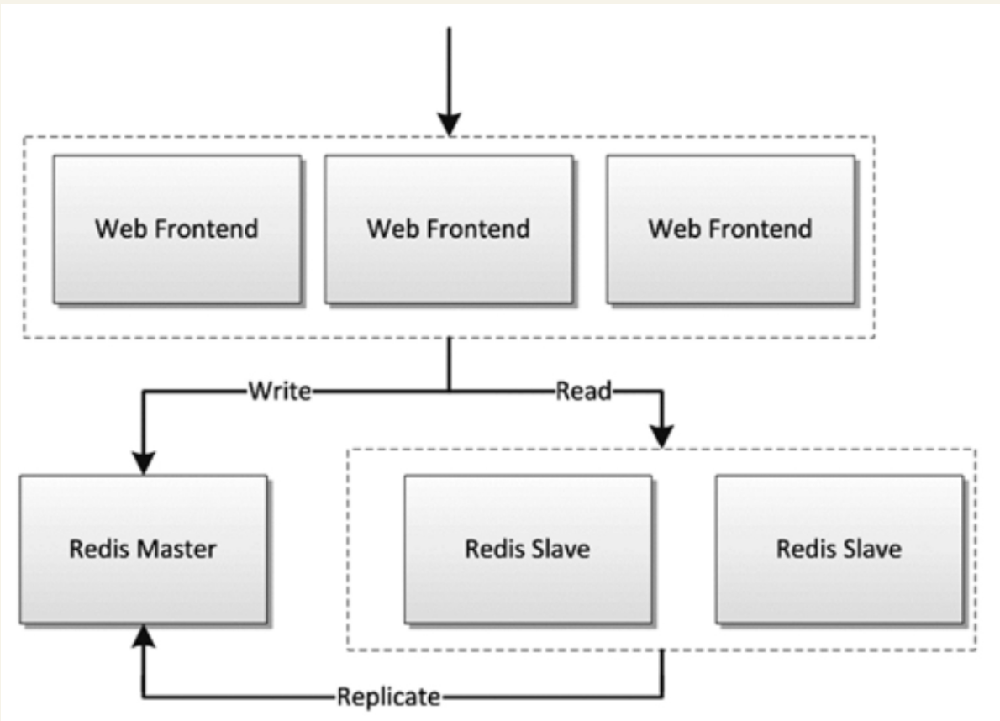
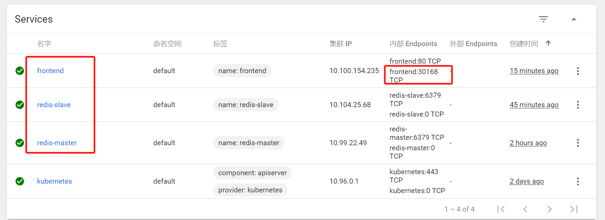

# Kubernetes基础

Kubernetes致力于提供跨主机集群的自动部署、扩展、高可用以及运行应用程序容器的平台，其遵循主从式架构设计，其组件可以分为管理单个节点（Node）组件和控制平面组件。Kubernetes Master是集群的主要控制单元，用于管理其工作负载并指导整个系统的通信。Kubernetes控制平面由各自的进程组成，每个组件都可以在单个主节点上运行，也可以在支持高可用集群的多个节点上运行。


## Master节点

Master节点是Kubernetes集群的控制节点，在生产环境中不建议部署集群核心组件外的任何Pod，**公司业务的Pod更是不建议部署到Master节点上，以免升级或者维护时对业务造成影响**。Master节点的组件包括：

### APIServer

```
APIServer是整个集群的控制中枢，提供集群中各个模块之间的数据交换，并将集群状态和信息存储到分布式键－值（key-value）存储系统Etcd集群中。同时它也是集群管理、资源配额、提供完备的集群安全机制的入口，为集群各类资源对象提供增删改查以及watch的REST API接口。

APIServer作为Kubernetes的关键组件，使用Kubernetes API和JSON overHTTP提供Kubernetes的内部和外部接口。
```

### Scheduler

```
Scheduler是集群Pod的调度中心，主要是通过调度算法将Pod分配到最佳的节点（Node），它通过APIServer监听所有Pod的状态，一旦发现新的未被调度到任何Node节点的Pod（PodSpec.NodeName为空），就会根据一系列策略选择最佳节点进行调度，对每一个Pod创建一个绑定（binding），然后被调度的节点上的Kubelet负责启动该Pod。Scheduler是集群可插拔式组件，它跟踪每个节点上的资源利用率以确保工作负载不会超过可用资源。因此Scheduler必须知道资源需求、资源可用性以及其他约束和策略，例如服务质量、亲和力／反关联性要求、数据位置等。Scheduler将资源供应与工作负载需求相匹配以维持系统的稳定和可靠，因此Scheduler在调度的过程中需要考虑公平、资源高效利用、效率等方面的问题。
```

### Controller Manager

```
Controller Manager是集群状态管理器（它的英文直译名为控制器管理器），以保证Pod或其他资源达到期望值。

当集群中某个Pod的副本数或其他资源因故障和错误导致无法正常运行，没有达到设定的值时，Controller Manager会尝试自动修复并使其达到期望状态。

Controller Manager包含NodeController、ReplicationController、EndpointController、NamespaceController、ServiceAccountController、ResourceQuotaController、ServiceController和TokenController，该控制器管理器可与API服务器进行通信以在需要时创建、更新或删除它所管理的资源，如Pod、服务断点等。
```

### Etcd

```
Etcd由CoreOS开发，用于可靠地存储集群的配置数据，是一种持久性、轻量型、分布式的键－值（key-value）数据存储组件。

Etcd作为Kubernetes集群的持久化存储系统，集群的灾难恢复和状态信息存储都与其密不可分，所以在Kubernetes高可用集群中，Etcd的高可用是至关重要的一部分，在生产环境中建议部署为大于3的奇数个数的Etcd，以保证数据的安全性和可恢复性。Etcd可与Master组件部署在同一个节点上，大规模集群环境下建议部署在集群外，并且使用高性能服务器来提高Etcd的性能和降低Etcd同步数据的延迟。
```


## Node节点


Node节点也被称为Worker或Minion，是主要负责部署容器（工作负载）的单机（或虚拟机），集群中的每个节点都必须具备容器的运行环境（runtime），比如Docker及其他组件等。Kubelet作为守护进程运行在Node节点上，负责监听该节点上所有的Pod，同时负责上报该节点上所有Pod的运行状态，确保节点上的所有容器都能正常运行。当Node节点宕机（NotReady状态）时，该节点上运行的Pod会被自动地转移到其他节点上。


Node节点包括：

### Kubelet

```
负责与Master通信协作，管理该节点上的Pod。
```

### Kube-Proxy

```
负责各Pod之间的通信和负载均衡。
```

### Docker Engine

```
Docker引擎，负载对容器的管理。
```


## kubernetes的资源对象

kubernetes常用资源对象


**无状态的应用程序使用的Pod控制器**

- ~~ReplicationController~~	（已经几乎废弃，被ReplicaSet和Deployment代替）
- ReplicaSet
- Deployment

**有状态的应用程序使用的Pod控制器**

- StatefulSet


**集群的存储守护进程**

- DaemonSet

确保每个节点都运行了pod的一个副本，新增的节点也会被添加此类Pod，节点被移除之后，也会对Pod进行回收。

- DaemonSet常用于运行集群存储守护进程。如glusterd和ceph
- 日志收集进程--fluentd和logstash。
- 监控进程-- prometheus的Node Exporter、Ingress等

## 查询Kubernetes的健康状态

```shell
# kubectl cluster-info 
Kubernetes master is running at https://172.16.60.236:6443
KubeDNS is running at https://172.16.60.236:6443/api/v1/namespaces/kube-system/services/kube-dns:dns/proxy

To further debug and diagnose cluster problems, use 'kubectl cluster-info dump'.

# kubectl -s https://172.16.60.236:6443 get componentstatuses 
NAME                 STATUS    MESSAGE             ERROR
controller-manager   Healthy   ok                  
scheduler            Healthy   ok                  
etcd-0               Healthy   {"health":"true"}  


# kubectl -s https://172.16.60.236:6443 get node
NAME         STATUS   ROLES    AGE   VERSION
k8s-master   Ready    master   46h   v1.18.3
k8s-node1    Ready    <none>   45h   v1.18.3
k8s-node2    Ready    <none>   45h   v1.18.3
k8s-node3    Ready    <none>   45h   v1.18.3

```


## kubectl命令与资源管理

Kubernetes API是管理各种资源对象的唯一入口，它提供了一个RESTful风格的CRUD（Create、Read、Update和Delete）接口用于查询和修改集群状态，并将结果存储在集群状态存储系统etcd中。事实上，API Server也是用于更新etcd中资源对象状态的唯一途径，Kubernetes的其他所有组件和客户端都要通过它完成查询或修改操作。


### 1.资源管理的操作

Kubernetes API资源管理的操作可简单归结为增、删、改、查这4种，

kubectl提供了一系列子命令用于执行此类任务，例如create、delete、patch、apply、replace、edit、get等。


#### 1.1 kubectl命令常用操作示例

##### 1.1.1 创建资源对象

```
// 新增
[root@ci-base k8s_yaml]# kubectl create namespace dev
namespace/dev created

[root@ci-base k8s_yaml]# kubectl create deployment demoapp --image="ikubernetes/demoapp:v1.0" -n dev
deployment.apps/demoapp created

[root@ci-base k8s_yaml]# kubectl create service clusterip demoapp --tcp=80 -n dev
service/demoapp created

// 查询
[root@ci-base example01]# kubectl get deployment -n dev

[root@ci-base example01]# kubectl get pod -n dev

[root@ci-base example01]# kubectl get svc -n dev

// 删除
kubectl delete deployment demoapp -n dev
kubectl delete svc demoapp -n dev
kubectl delete ns dev
```

将资源导出为命令配置文件

```
// 打印资源对象的详细信息
kubectl get pod metrics-server-7477b75789-xlx4b -n kube-system  -o yaml

// 导出资源对象的详细信息
kubectl get ns dev -o yaml > dev-ns.yaml
kubectl get pod -n dev -o yaml > demo-pod.yaml
kubectl get service -n dev -o yaml > demo-svc.yaml
```

使用命令式对象配置文件方式创建部署

```
[root@ci-base example01]# ll
total 16
-rw-r--r-- 1 root root 5349 Apr  2 10:47 demo-pod.yaml
-rw-r--r-- 1 root root 1189 Apr  2 10:47 demo-svc.yaml


[root@ci-base example01]# kubectl create ns dev

[root@ci-base example01]# kubectl create -f demo-pod.yaml

[root@ci-base example01]# kubectl create -f demo-svc.yaml

// 删除所有资源
kubectl delete -f example01/

[root@ci-base example01]# kubectl create ns dev

[root@ci-base k8s_yaml]# kubectl apply -f example01/
pod/demoapp-6c5d545684-bn5t8 created
service/demoapp created

[root@ci-base k8s_yaml]# kubectl delete ns dev
```

##### 1.1.2 查看资源对象

```
[root@ci-base k8s_yaml]# kubectl get ns

[root@ci-base k8s_yaml]# kubectl get pod,svc -o wide

//下面的命令能够取出kube-system名称空间中带有k8s-app=kube-dns标签的Pod对象的资源名称。
[root@ci-base k8s_yaml]# kubectl get pods -l k8s-app -n kube-system
```

kubectl describe命令还能显示当前对象相关的其他资源对象，如Event或Controller等。

```
kubectl describe pod metrics-server-7477b75789-xlx4b -n kube-system
```


打印容器中的日志信息

```
[root@ci-base example01]# kubectl logs pod/demoapp -n dev
 * Running on http://0.0.0.0:80/ (Press CTRL+C to quit)
```

##### 1.1.3 使用yaml文件

使用和查看命令如下

```
[root@ci-base example01]# kubectl apply -f .
deployment.apps/demoapp created
service/demoapp created

[root@ci-base example01]# kubectl get pod,svc,ep -n dev
.....
```


yaml文件如下

`demo-deployment.yaml`

```
---
apiVersion: apps/v1
kind: Deployment
metadata:
  labels:
    k8s.kuboard.cn/layer: web
    k8s.kuboard.cn/name: demoapp
  name: demoapp
  namespace: dev
spec:
  replicas: 1
  selector:
    matchLabels:
      k8s.kuboard.cn/layer: web
      k8s.kuboard.cn/name: demoapp

  template:
    metadata:
      labels:
        k8s.kuboard.cn/layer: web
        k8s.kuboard.cn/name: demoapp
    spec:
      containers:
        - image: 'ikubernetes/demoapp:v1.0'
          imagePullPolicy: Always
          name: demoapp-pod
      dnsPolicy: ClusterFirst
      restartPolicy: Always

```

`demo-svc.yaml`

```
---
apiVersion: v1
kind: Service
metadata:
  labels:
    k8s.kuboard.cn/layer: web
    k8s.kuboard.cn/name: demoapp

  name: demoapp
  namespace: dev

spec:
  externalTrafficPolicy: Cluster
  ports:
    - name: dijebj
      nodePort: 30001
      port: 8080
      protocol: TCP
      targetPort: 80
  selector:
    k8s.kuboard.cn/layer: web
    k8s.kuboard.cn/name: demoapp
  type: NodePort
```


##### 1.1.4  在容器中执行命令

```
[root@ci-base example01]# kubectl exec -it demoapp-5f8989b6c5-hpq9w sh -n dev
[root@demoapp-5f8989b6c5-hpq9w /]#
```


##### 1.1.5 删除资源

```
kubectl delete svc demoapp -n dev
kubectl delete deployment demoapp -n dev
kubectl delete ns dev

// 删除命名空间中的所有pod对象
kubectl delete pods --all -n dev

//强制删除pod对象
 kubectl delete pods demoapp --force --grace-period=0
```

需要特别说明的是，对于受控于控制器的对象来说，仅删除受控对象自身，其控制器可能会重建出类似的对象，例如Deployment控制器下的Pod对象被删除时即会被重建。


### 2. kubectl插件

kubectl插件是指能够由kubectl调用的外部独立应用程序，这类应用程序都以kubectl-$plugin_name格式命名，表现为kubectl的名字是$plugin_name的子命令。例如，应用程序/usr/bin/kubectl-whoami就是whoami插件，我们可以使用kubectl whoami的格式来运行它。因此，可为kubectl插件添加新的可用子命令，丰富kubectl的功能。

Kubernetes SIG CLI社区还提供了一个插件管理器——Krew，它能够帮助用户打包、分发、查找、安装和管理kubectl插件，

项目地址为https://krew.sigs.k8s.io/。Krew以跨平台的方式打包和分发插件，因此单一打包格式即能适配主流的系统平台（Linux、Windows或macOS等）。为了便于插件分发，Krew还维护有一个插件索引，以方便用户发现主流的可用插件。

Krew自身也表现为kubectl的一个插件，需要以手动方式独立安装。下面的脚本（krew-install.sh）能自动完成Krew插件的安装，该脚本仅适用于类UNIX系统平台，并以bash解释器运行，其他平台上的部署方式请参考Krew项目的官方文档。

`krew-install.sh`

```
# 安装kubectl插件krew
curl -fsSLO "https://storage.googleapis.com/krew/v0.2.1/krew.{tar.gz,yaml}"

tar zxvf krew.tar.gz
./krew-linux_amd64 install --manifest=krew.yaml --archive=krew.tar.gz
echo "export PATH=\"\${KREW_ROOT:-\$HOME/.krew}/bin:\$PATH\"" >>/etc/profile
source /etc/profile

# 更新插件列表
kubectl krew update

# 查看插件列表
kubectl krew list
```


编辑$HOME/.bash_profile文件，将export一行命令添加其中，并重启当前shell解释器。

```

[root@k8smaster1 krew]# echo 'export PATH="${PATH}:${HOME}/.krew/bin"' >> $HOME/.bash_profile
[root@k8smaster1 krew]# source $HOME/.bash_profile
[root@k8smaster1 krew]# exec $SHELL
```


设定完成后，kubectl krew子命令便能执行Krew插件管理器的相关功能，例如查找和安装所需要的插件，它拥有help、list、search、info、install、upgrade和uninstall等二级子命令。

下面的命令搜索Krew索引中包含字符串who的插件。

```
[root@k8smaster1 krew]# kubectl krew update
Updated the local copy of plugin index.

[root@k8smaster1 krew]# kubectl krew search who
NAME          DESCRIPTION                                         INSTALLED
view-webhook  Visualize your webhook configurations               no
who-can       Shows who has RBAC permissions to access Kubern...  no
whoami        Show the subject that's currently authenticated...  no

// 安装whoami插件
kubectl krew install whoami 
kubectl krew install ns ctx rbac-view
// 使用插件
kubectl whoami
```

Krew索引中的各插件几乎都从更便捷、更丰富或更完整等角度进一步完善了kubectl功能。例如status能够以更加简便、直观的方式返回资源的简要状态，ctx以更便捷的方式完成kubeconfig中的context切换等。


### 3. Kubernetes的扩展插件

**安装Cluster DNS**

参考文献：

<https://www.cnblogs.com/xiangsikai/p/11413970.html>


## kubectl部署应用 示例1

本章要演示的示例应用是一个名叫Guestbook的应用，Guestbook是一个典型的Web应用。Guestbook的部署运行结构如图所示。

Guestbook结构



Guestbook包含两部分。

• Frontend

Guestbook的Web前端部分，无状态节点，可以方便伸缩，本例中将运行3个实例。

• Redis

Guestbook的存储部分，Redis采用主备模式，即运行1个Redis Master和2个Redis Slave，Redis Slave会从Redis Master同步数据。

Guestbook提供一个非常简单的功能：在Frontend页面提交数据，Frontend则将数据保存到Redis Master，然后从Redis Slave读取数据显示到页面上。

Guestbook定义文件在Kubernetes发布包的examples/guestbook目录下：

```shell
$ wget https://github.com/kubernetes/kubernetes/releases/download/v1.1.1/kubernetes.tar.gz 
$ tar zxvf kubernetes.tar.gz 
$ cd kubernetes/examples/guestbook 
```

### 运行Redis

首先在Kubernetes上部署运行Redis，包括Redis Master和Redis Slave。


#### 创建Redis Master Pod

Redis Master Replication Controller的定义文件redis-master-controller.yaml：

```yaml
apiVersion: v1
kind: ReplicationController
metadata:
  name: redis-master
  labels:
    name: redis-master
spec:
  replicas: 1
  selector:
    name: redis-master
  template:
    metadata:
      labels:
        name: redis-master
    spec:
      containers:
        - name: master
          image: redis
          ports:
            - containerPort: 6379
```

通过定义文件创建Redis Master Replication Controller：

```shell
$ kubectl create -f redis-master-controller.yaml 
replicationcontroller "redis-master" created 
```


创建成功后，可查询Redis Master Replication Controller：

```shell
$ kubectl get replicationcontroller redis-master 
CONTROLLER     CONTAINER(S)  IMAGE(S)  SELECTOR              REPLICAS AGE 
redis-master   master         redis      name=redis-master   1            15s 
```


Redis Master Replication Controller将会创建1个Redis Master Pod，创建出来的Pod就会带上Label name=redis-master：

```shell
$ kubectl get pod --selector name=redis-master 
NAME                     READY     STATUS    RESTARTS   AGE 
redis-master-vdkfp   1/1        Running   0           31s 
```

Replication Controller在创建出Pod以后，将会保证Pod按照指定副本数目持续运行，而通过Replication Controller也可以对Pod进行一系列操作，包括滚动升级和弹性伸缩等。

#### 创建Redis Master Service

Kubernetes中Pod是变化的，特别是当受到Replication Controller控制的时候，而当Pod发生变化的时候，Pod的IP也是变化的。

这就导致了一个问题：在Kubernetes集群中，Pod之间如何互相发现并访问呢?比如我们已经运行了Redis Master Pod，那么Redis Slave Pod如何获取Redis Master Pod的访问地址呢？为此Kubernetes提供了Service来实现服务发现。

Kubernetes中Service是真实应用的抽象，将用来代理Pod，对外提供固定IP作为访问入口，这样通过访问Service便能访问到相应的Pod，而对访问者来说只需知道Service的访问地址，而不需要感知Pod的变化。

上一步中已经运行起Redis Master Pod，现在创建Redis Master Service来代理Redis Master Pod，Redis Master Service的定义文件redis-master-service.yaml：

```shell
apiVersion: v1
kind: Service
metadata:
  name: redis-master
  labels:
    name: redis-master
spec:
  ports:
  # the port that this service should serve on 
  - port: 6379
    targetPort: 6379
  selector:
    name: redis-master
```

Service是通过Label来关联Pod的，在Service的定义中，设置.spec.selector为name= redis-master，将关联上Redis Master Pod。

通过定义文件创建Redis Master Service：

```shell
$ kubectl create -f redis-master-service.yaml 
service "redis-master" created 
```

创建成功后查看Redis Master Service：

```shell
$ kubectl get service redis-master 
NAME           TYPE        CLUSTER-IP    EXTERNAL-IP   PORT(S)    AGE
redis-master   ClusterIP   10.99.22.49   <none>        6379/TCP   11m
```

Redis Master Service的查询信息中显示属性CLUSTER_IP为 10.99.22.49，属性PORT(S)为6379/TCP，其中 10.99.22.49是Kubernetes分配给Redis Master Service的虚拟IP，6379/TCP则是Service会转发的端口（通过Service定义文件中的.spec.ports[0].port指定），Kubernetes会将所有访问 10.99.22.49:6379的TCP请求转发到Redis Master Pod中，目标端口是6379/TCP（通过Service定义文件中的spec.ports[0].targetPort指定）。

因为创建了Redis Master Service来代理Redis Master Pod，所以Redis Slave Pod通过Redis Master Service的虚拟IP  10.99.22.49就可以访问到Redis Master Pod，但是如果只是硬配置Service的虚拟IP到Redis Slave Pod中，这样还不是真正的服务发现，Kubernetes提供了两种发现Service的方法。


+ 环境变量
当Pod运行的时候，Kubernetes会将之前存在的Service的信息通过环境变量写到Pod中，以Redis Master Service为例，它的信息会被写到Pod中：

```shell
REDIS_MASTER_SERVICE_HOST=10.99.22.49 
REDIS_MASTER_PORT_6379_TCP_PROTO=tcp 
REDIS_MASTER_SERVICE_PORT=6379 
REDIS_MASTER_PORT=tcp://10.99.22.49 
REDIS_MASTER_PORT_6379_TCP=tcp://10.99.22.49 
REDIS_MASTER_PORT_6379_TCP_PORT=6379 
REDIS_MASTER_PORT_6379_TCP_ADDR=10.99.22.49
```


这种方法要求Pod必须在Service之后启动，之前启动的Pod没有这些环境变量。采用DNS方式就没有这个限制。

+ DNS
当有新的Service创建时，就会自动生成一条DNS记录，以Redis Master Service为例，有一条DNS记录：

```
redis-master => 10.99.22.49
```


#### 创建Redis Slave Pod

redisslave镜像Dockerfile下载链接地址

```
https://github.com/kubernetes/kubernetes/tree/v1.1.1/examples/guestbook/redis-slave
```


通过Replication Controller可创建Redis Slave Pod，将创建两个Redis Slave Pod。Redis Slave Replication Controller的定义文件redis-slave-controller.yaml：

```
apiVersion: v1
kind: ReplicationController
metadata:
  name: redis-slave
  labels:
    name: redis-slave
spec:
  replicas: 2
  selector:
    name: redis-slave
  template:
    metadata:
      labels:
        name: redis-slave
    spec:
      containers:
      - name: worker
        image: 1879324764/hjl-redisslave:v1
        env:
        - name: GET_HOSTS_FROM
          value: dns

        ports:
          - containerPort: 6379
```


查看Pod信息

```shell
#通过自定义文件创建  Redis Slave Replication Controller
$ kubectl create -f redis-slave-controller.yaml 
replicationcontroller/redis-slave created

#创建成功后，查询Redis Slave Replication Controller
$ kubectl get replicationcontroller redis-slave
NAME          DESIRED   CURRENT   READY   AGE
redis-slave   2         2         0       6s

#Redis Slave Replication Controller创建运行两个Redis Slave Pod
$ kubectl get pod --selector name=redis-slave
NAME                READY   STATUS    RESTARTS   AGE
redis-slave-dzdjc   1/1     Running   0          100s
redis-slave-qpzn4   1/1     Running   0          100s
```


#### 创建Redis Slave Service

创建Redis Salve Service来代理Redis Salve Pod，Redis Salve Service的定义文件redis-slave-service.yaml：

```yaml
apiVersion: v1
kind: Service
metadata:
  name: redis-slave
  labels:
    name: redis-slave
spec:
  ports:
    # the port that this service should serve on
  - port: 6379
  selector:
    name: redis-slave
```

查看service信息

```shell
# 通过定义文件创建Redis Salve Service
$ kubectl create -f redis-slave-service.yaml 
service/redis-slave created

# 查询Redis Salve Service
$ kubectl get service redis-slave
NAME          TYPE        CLUSTER-IP       EXTERNAL-IP   PORT(S)    AGE
redis-slave   ClusterIP   10.109.114.132   <none>        6379/TCP   16s
```

### 运行Frontend

#### 创建Frontend Pod

通过Frontend Replication Controller来创建Frontend Pod，将创建3个Frontend Pod。

gb-frontend:v3的Dockerfile下载链接

```
https://github.com/kubernetes/kubernetes/blob/v1.1.1/examples/guestbook/php-redis/Dockerfile
```


Frontend Replication Controller的定义文件frontend-controller.yaml：

```yaml
apiVersion: v1
kind: ReplicationController
metadata:
  name: frontend
  labels:
    name: frontend
spec:
  replicas: 3
  selector:
    name: frontend
  template:
    metadata:
      labels:
        name: frontend
    spec:
      containers:
      - name: php-redis
        image: 1879324764/hjl-frontend:v3
        env:
        - name: GET_HOSTS_FROM
          value: dns

        ports:
          - containerPort: 80
```

查看Pod信息

```shell
#通过自定义文件创建Frontend Replication Controller
$ kubectl create -f frontend-controller.yaml 
replicationcontroller/frontend created

#创建成功后，查询Frontend Replication Controller
$ kubectl get replicationcontroller frontend
NAME       DESIRED   CURRENT   READY   AGE
frontend   3         3         0       18s

#Frontend Replication Controller创建运行3个Frontend Pod
$ kubectl get pod --selector name=frontend
NAME             READY   STATUS    RESTARTS   AGE
frontend-8bfcq   1/1     Running   0          2m51s
frontend-8c2cp   1/1     Running   0          2m51s
frontend-mflxl   1/1     Running   0          2m51s
```

#### 创建Frontend Service

创建Frontend Service代理Frontend Pod，Frontend Service的定义文件frontend-service.yaml：

```yaml
apiVersion: v1
kind: Service
metadata:
  name: frontend
  labels:
    name: frontend
spec:
  ports:
  # the port that this service should serve on 
  - port: 80
  selector:
    name: frontend
```

查看service信息

```shell
# 通过定义文件创建Frontend Service
$ kubectl create -f frontend-service.yaml 
service/frontend created

# 查询Frontend Service
$ kubectl get service frontend
NAME       TYPE        CLUSTER-IP      EXTERNAL-IP   PORT(S)   AGE
frontend   ClusterIP   10.98.214.195   <none>        80/TCP    10s
```

#### 设置Guesbook外网访问

Service的虚拟IP是由Kubernetes虚拟出来的内部网络，而外部网络是无法寻址到的，这时候就需要增加一层网络转发，即外网到内网的转发。实现方式有很多种，我们这里采用一种叫作NodePort的方式来实现。即Kubernetes将会在每个Node上设置端口，称为NodePort，通过NodePort端口可以访问到Pod。

修改Frontend Service的定义文件frontend-service.yaml，设置spec.type为NodePort：

```yaml
apiVersion: v1
kind: Service
metadata:
  name: frontend
  labels:
    name: frontend
spec:
  type: NodePort
  ports:
    - port: 80
  selector:
    name: frontend
```


查看service信息

```shell
# 重新创建Frontend Service
$ kubectl replace -f frontend-service.yaml --force
service/frontend replaced

# 查看frontend对外映射的端口
$ kubectl get service frontend
NAME       TYPE       CLUSTER-IP   EXTERNAL-IP   PORT(S)        AGE
frontend   NodePort   10.96.36.2   <none>        80:30610/TCP   
```

###  查看所有的service信息




### 清理Guestbook
清理Guestbook，只需要分别删除创建出的Replication Controller和Service：

```shell
$ kubectl delete replicationcontroller redis-master redis-slave frontend  
replicationcontroller "redis-master" deleted 
replicationcontroller "redis-slave" deleted 
replicationcontroller "frontend" deleted 

$ kubectl delete service redis-master redis-slave  frontend 
service "redis-master" deleted 
service "redis-slave" deleted 
service "frontend" deleted 
```


## kubectl部署应用 示例2

### 部署一个简单的Demo网站

#### 1．编写Deployment对象的配置文件

我们定义一个简单的Deployment配置

`deployment-demo.yaml`

```
[root@k8s-master pod_deamon]# cat deployment-demo.yaml
#API对象版本，可通过“kubectl api-versions”命令查看
apiVersion: apps/v1 
#资源类型，区分大小写，可通过“kubectl api-resources”命令查看，这里使用Deployment对象
kind: Deployment
#标准的元数据
metadata:
   #当前Deployment对象名称，同一个命名空间下必须唯一
  name: demo-deployment  
#部署规范（目标），Deployment控制器会根据此模板调整当前Pod到最终的期望状态
spec:
# Pod数量，这里指运行2个Pod
  replicas: 2
  #选择器，其定义了Deployment控制器如何找到要管理的Pod
  selector:
  	#匹配标签
    matchLabels:
     #待匹配的标签键值对
      app: demo
  template:   # Pod模板定义
    metadata: #标准的元数据
      labels: #Pod标签
        app: demo #定义Pod标签，由键值对组成
    spec: #Pod规范
      containers: #容器列表，Pod中至少有一个容器
      - name: demo  #容器名称
        image: microsoft/dotnet-samples:aspnetapp #镜像地址
        ports:  #端口列表
        - containerPort: 80 #设置容器端口

```


#### 2．使用“kubectl create”执行资源创建

```
[root@k8s-master pod_deamon]# kubectl create -f deployment-demo.yaml

//检查部署对象是否已经创建、部署是否已经完成
[root@k8s-master pod_deamon]# kubectl get Deployment demo-deployment
NAME              READY   UP-TO-DATE   AVAILABLE   AGE
demo-deployment   2/2     2            2           87m

// 查看副本集（ReplicaSet）对象
[root@k8s-master pod_deamon]# kubectl get rs -lapp=demo
NAME                         DESIRED   CURRENT   READY   AGE
demo-deployment-68b59dd5b8   2         2         2       87m

[root@k8s-master pod_deamon]# kubectl get rs -lapp=demo --show-labels
NAME                         DESIRED   CURRENT   READY   AGE   LABELS
demo-deployment-68b59dd5b8   2         2         2       88m   app=demo,pod-template-hash=68b59dd5b8
```


#### 3. 通过Service访问应用

正常可以访问pod的ip。

```
[root@k8s-node01 ~]# curl --head http://10.100.85.197
HTTP/1.1 200 OK
Date: Tue, 22 Dec 2020 08:44:20 GMT
Content-Type: text/html; charset=utf-8
Server: Kestrel


[root@k8s-node01 ~]# curl --head http://10.100.85.196
HTTP/1.1 200 OK
Date: Tue, 22 Dec 2020 08:44:32 GMT
Content-Type: text/html; charset=utf-8
Server: Kestrel
```


删除pod后会重建，此时pod的ip地址已经发生改变

```
[root@k8s-master pod_deamon]# kubectl delete pods -lapp=demo
pod "demo-deployment-68b59dd5b8-5gw7q" deleted
pod "demo-deployment-68b59dd5b8-hd9pm" deleted

[root@k8s-master pod_deamon]# kubectl get pods -lapp=demo -o wide
NAME                               READY   STATUS    RESTARTS   AGE   IP              NODE         NOMINATED NODE   READINESS GATES
demo-deployment-68b59dd5b8-gtf45   1/1     Running   0          48s   10.100.85.200   k8s-node01   <none>           <none>
demo-deployment-68b59dd5b8-r6c9s   1/1     Running   0          48s   10.100.85.199   k8s-node01   <none>           <none>
```


##### 3.1 通过ClusterIP Service在集群内部访问

`clusterIPService.yaml`

```
apiVersion: v1
kind: Service #资源类型
metadata: #标准元数据
  name: demo-service #服务名称
spec: #规范定义
  type: ClusterIP #服务类型，不填写此字段则默认为ClusterIP类型，也就是集群IP类型
  selector: #标签选择器
    app: demo #标签
  ports:  #端口
  - protocol: TCP #协议，能够支持TCP和UDP
    port: 80  #当前端口
    targetPort: 80 #目标端口
```

+ 执行Service的创建并分别查询Service和EndPoints

```
[root@k8s-master pod_deamon]# kubectl create -f clusterIPService.yaml
service/demo-service created
[root@k8s-master pod_deamon]# kubectl get svc demo-service -o wide
NAME           TYPE        CLUSTER-IP     EXTERNAL-IP   PORT(S)   AGE   SELECTOR
demo-service   ClusterIP   10.96.212.33   <none>        80/TCP    12s   app=demo


[root@k8s-master pod_deamon]# kubectl get endpoints demo-service -o wide
NAME           ENDPOINTS                           AGE
demo-service   10.100.85.199:80,10.100.85.200:80   72s
```


我们可以在集群内部进行访问了。如下：

```
[root@k8s-node01 ~]# curl --head 10.96.212.33
HTTP/1.1 200 OK
Date: Tue, 22 Dec 2020 08:58:14 GMT
Content-Type: text/html; charset=utf-8
Server: Kestrel
```


##### 3.2 通过NodePort Service在外部访问集群应用

`nodePortService.yaml`

```
kind: Service #资源类型
apiVersion: v1
metadata: #标准元数据
  name: nodeport-service  #服务名称
spec:  #规范定义
  type: NodePort #服务类型，这里是节点端口
  ports:  #端口列表
    - port: 80  #Pod端口
      nodePort: 31001 #节点端口，注意默认的端口范围为“30000-32767”，注意不要冲突
  selector: #标签选择器
    app: demo

```


+ 执行Service的创建并分别查询Service和EndPoints

```
[root@k8s-master pod_deamon]# kubectl create -f nodePortService.yaml
service/nodeport-service created

[root@k8s-master pod_deamon]# kubectl get svc nodeport-service
NAME               TYPE       CLUSTER-IP   EXTERNAL-IP   PORT(S)        AGE
nodeport-service   NodePort   10.96.30.5   <none>        80:31001/TCP   11s

[root@k8s-master pod_deamon]# kubectl get svc
NAME               TYPE        CLUSTER-IP   EXTERNAL-IP   PORT(S)        AGE
kubernetes         ClusterIP   10.96.0.1    <none>        443/TCP        7h12m
nodeport-service   NodePort    10.96.30.5   <none>        80:31001/TCP   20s
```

我们创建了名为“nodeport-service”的Service。该Service映射“31001”节点端口，并且创建了“10.96.30.5”的集群IP。也就是说，Service可以通过“节点IP：节点端口”或“集群IP（spec.clusterIp）：端口”进行访问。

虽然我们可以在外部访问集群中的应用，但是也可以看到该方案有不少不足之处：

```
（1）每个端口仅能支持一个服务，不能冲突。

（2）端口范围必须为“30000-32767”，非常不友好。

（3）如果节点IP发生变化，服务也将无法访问。
```


##### 3.3 通过LoadBalancer Service在外部访问集群应用

`LoadBalancer_Service.yaml`

```
apiVersion: v1  #api版本
kind: Service #Service
metadata: #标准元数据
  name: demo  #名称
  namespace: default #命名空间
spec: #规范
  clusterIP: 10.3.255.28 #集群IP
  loadBalancerIP: 106.52.99.55 #负载均衡IP
  ports:  #端口列表
  - name: tcp-80-80
    nodePort: 31504 #节点IP
    port: 80 #Pod端口
    protocol: TCP #协议
    targetPort: 80 #服务端口
  selector: #选择器
    app: demo
    k8s-app: demo
    qcloud-app: demo
  type: LoadBalancer #服务类型，这里为负载均衡服务类型
```


如上述定义所示，我们创建了Service，设置集群IP为“10.3.255.28”、负载均衡IP（loadBalancerIP）为“106.52.99.55”、节点端口为“31504”。Service定义好了以后对负载均衡服务进行配置：配置一个TCP监听器.


## kubectl部署应用 示例3

使用示例镜像ikubernetes/demoapp:v1.0演示容器应用编排的基础操作：应用部署、访问、查看，服务暴露和应用扩缩容等。

Kubernetes之上应用程序的基础管理操作由如下几个部分组成:

1）通过合用的控制器类的资源（例如Deployment或ReplicationController）创建并管控Pod对象以运行特定的应用程序：

- 无状态（stateless）应用的部署和控制通常使用Deployment控制器
- 有状态应用则需要使用StatefulSet控制器或扩展的Operator。


2）为Pod对象创建Service对象，以便向客户端提供固定的访问端点，并能够借助KubeDNS进行服务发现。


3）随时按需获取各资源对象的简要或详细信息，以了解其运行状态。


4）如有需要，对支持扩缩容的应用按需进行扩容或缩容；


5）应用程序的镜像出现新版本时，对其执行更新操作，若相应的控制器支持，修改指定的控制器资源中Pod模板的容器镜像为指定的新版本即可自动触发更新过程。


下面示例仅演示的部分功能，即应用部署、访问、查看，以及服务暴露。


### 应用编排

#### 1. 创建Deployment控制器对象

下面的命令会创建一个名为demoapp的Deployment控制器对象，它使用镜像ikubernetes/demoapp:v1.0创建Pod对象，但仅用于测试，运行后即退出。

```
[root@ci-base ~]# kubectl create deployment demoapp --image="ikubernetes/demoapp:v1.0" --dry-run=client
deployment.apps/demoapp created (dry run)
```

确认测试命令无误后，可在移除--dry-run选项后再次执行命令以完成资源对象的

```
[root@ci-base ~]# kubectl create deployment demoapp --image="ikubernetes/demoapp:v1.0"
deployment.apps/demoapp created
```

该命令创建的Deployment/demoapp对象会借助指定的镜像生成一个Pod，并自动为其添加app=demoapp标签，

而控制器对象自身也将使用该标签作为标签选择器。镜像ikubernetes/demoapp:v1.0中定义的容器主进程为默认监听于80端口的Web应用程序demoapp。


#### 2.打印资源对象的相关信息

```
[root@ci-base ~]# kubectl get deployments/demoapp
NAME      READY   UP-TO-DATE   AVAILABLE   AGE
demoapp   1/1     1            1           84s
```

Deployment/demoapp创建的唯一Pod对象运行正常与否、该对象被调度至哪个节点运行，以及当前是否就绪等也是用户在创建完成后应该关注的重点信息。由控制器创建的Pod对象的名称通常是以其隶属的ReplicaSet对象的名称为前缀，以随机字符为后缀，例如下面命令以app=demoapp为标签选择器打印筛选出的Pod对象的相关信息。

```
[root@ci-base ~]# kubectl get pods -l app=demoapp -o wide
NAME                       READY   STATUS    RESTARTS   AGE     IP             NODE    NOMINATED NODE   READINESS GATES
demoapp-6c5d545684-59mx6   1/1     Running   0          2m35s   10.244.38.30   k8-w8   <none>           <none>
```

接下来，我们可在集群中任意一个节点上使用curl命令

```
[root@ci-base ~]# POD_IP=$(kubectl get pods -l app=demoapp -o jsonpath={.items[0].status.podIP})
[root@ci-base ~]# echo $POD_IP
10.244.38.30
[root@k8s-w1 ~]# curl 10.244.38.30
iKubernetes demoapp v1.0 !! ClientIP: 10.244.228.64, ServerName: demoapp-6c5d545684-59mx6, ServerIP: 10.244.38.30!
```


#### 3.部署Service对象

Service对象就是一组Pod的逻辑组合，它通过称为ClusterIP的地址和服务端口接收客户端请求，并将这些请求代理至使用标签选择器来过滤一个符合条件的Pod对象。


```
[root@ci-base ~]# kubectl create service nodeport demoapp --tcp=80
service/demoapp created

```

nodeport是指Service对象的类型，它会在集群中各节点上随机选择一个节点端口（hostPort）为该Service对象接入集群外部的访问流量，集群内部流量则由Service资源通过ClusterIP直接接入。

```
[root@ci-base ~]# kubectl get pod,svc,ep
NAME                           READY   STATUS    RESTARTS   AGE
pod/demoapp-6c5d545684-59mx6   1/1     Running   0          9m19s

NAME                 TYPE        CLUSTER-IP      EXTERNAL-IP   PORT(S)        AGE
service/demoapp      NodePort    10.100.89.254   <none>        80:32140/TCP   2m41s
service/kubernetes   ClusterIP   10.96.0.1       <none>        443/TCP        57d

NAME                   ENDPOINTS                                               AGE
endpoints/demoapp      10.244.38.30:80                                         2m41s
endpoints/kubernetes   192.168.1.72:8443,192.168.1.73:8443,192.168.1.74:8443   57d
```

在节点之间可以使用

```
[root@k8s-w1 ~]# curl 10.244.38.30
iKubernetes demoapp v1.0 !! ClientIP: 10.244.228.64, ServerName: demoapp-6c5d545684-59mx6, ServerIP: 10.244.38.30!
[root@k8s-w1 ~]# curl 10.100.89.254
iKubernetes demoapp v1.0 !! ClientIP: 10.244.228.64, ServerName: demoapp-6c5d545684-59mx6, ServerIP: 10.244.38.30!
```

节点外使用

```
nodeIP:32140进行访问
```


#### 4.扩容与缩容

kubectl scale命令就是专用于变动控制器应用规模的命令，它支持对Deployment、ReplicaSet、StatefulSet等类型资源对象的扩容和缩容操作。

```
[root@ci-base ~]# kubectl scale deployment/demoapp --replicas=3
deployment.apps/demoapp scaled

[root@ci-base ~]# kubectl get pods -l app=demoapp
NAME                       READY   STATUS    RESTARTS   AGE
demoapp-6c5d545684-59mx6   1/1     Running   0          12m
demoapp-6c5d545684-6thgq   1/1     Running   0          52s
demoapp-6c5d545684-8m8w7   1/1     Running   0          52s

```

```
[root@ci-base ~]# kubectl describe deployment/demoapp
Name:                   demoapp
Namespace:              default
CreationTimestamp:      Sun, 04 Apr 2021 17:32:03 +0800
Labels:                 app=demoapp
Annotations:            deployment.kubernetes.io/revision: 1
Selector:               app=demoapp
Replicas:               3 desired | 3 updated | 3 total | 3 available | 0 unavailable
......
  ----           ------  ------
  Progressing    True    NewReplicaSetAvailable
  Available      True    MinimumReplicasAvailable
OldReplicaSets:  <none>
NewReplicaSet:   demoapp-6c5d545684 (3/3 replicas created)
Events:
  Type    Reason             Age    From                   Message
  ----    ------             ----   ----                   -------
  Normal  ScalingReplicaSet  14m    deployment-controller  Scaled up replica set demoapp-6c5d545684 to 1
  Normal  ScalingReplicaSet  2m14s  deployment-controller  Scaled up replica set demoapp-6c5d545684 to 3

```

由命令结果可以看出，其Pod副本数量的各项指标都已经转换为新的目标数量，而其事件信息中也有相应事件显示其扩增操作已成功完成。

Service对象demoapp的标签选择器动态纳入的新Pod副本也将成为该Service对象可用的代理后端，所有流量会被调度至其后端的所有Pod对象之上。每个能够接收流量的后端称为一个端点，它通常表现为相应主机或容器上可接收特定流量的访问入口（套接字），如下面命令结果中的Endpoints字段所示

```
[root@ci-base ~]# kubectl describe svc/demoapp
Name:                     demoapp
Namespace:                default
Labels:                   app=demoapp
Annotations:              <none>
Selector:                 app=demoapp
Type:                     NodePort
IP:                       10.100.89.254
Port:                     80  80/TCP
TargetPort:               80/TCP
NodePort:                 80  32140/TCP
Endpoints:                10.244.14.22:80,10.244.228.68:80,10.244.38.30:80
Session Affinity:         None
External Traffic Policy:  Cluster
Events:                   <none>

[root@ci-base ~]# kubectl get endpoints
NAME         ENDPOINTS                                               AGE
demoapp      10.244.14.22:80,10.244.228.68:80,10.244.38.30:80        9m29s
kubernetes   192.168.1.72:8443,192.168.1.73:8443,192.168.1.74:8443   57d
```

我们可以通过任何客户端对Service/demoapp的服务发起访问请求进行测试，这次我们在集群外的主机172.29.0.1上通过NodePort对该服务发起持续访问，以测试Service对象的流量调度机制是否能够正常工作。

```
18793@DESKTOP-PMJTNGI ~
$ while true;do curl http://192.168.1.75:32140;sleep 0.5;done
iKubernetes demoapp v1.0 !! ClientIP: 10.244.215.64, ServerName: demoapp-6c5d545684-59mx6, ServerIP: 10.244.38.30!
iKubernetes demoapp v1.0 !! ClientIP: 10.244.215.64, ServerName: demoapp-6c5d545684-59mx6, ServerIP: 10.244.38.30!
iKubernetes demoapp v1.0 !! ClientIP: 10.244.215.64, ServerName: demoapp-6c5d545684-59mx6, ServerIP: 10.244.38.30!
```

应用规模缩容的方式和扩容相似，只不过是将Pod副本的数量调至比原来小的数字。例如，将demoapp的Pod副本缩减至2个，可以使用类似如下命令进行。

```
[root@ci-base ~]# kubectl scale deployment/demoapp --replicas=2
```

#### 5.修改与删除对象

下面的命令能够删除service/demoapp资源对象：

```
[root@ci-base ~]# kubectl delete service/demoapp
service "demoapp" deleted
```


有时候需要清空某一类型下的所有对象，此时只需要将上面命令对象名称换成--all选项便能实现。例如，删除dafault名称空间中所有的Deployment控制器：

```
[root@ci-base ~]# kubectl delete deployment --all
deployment.apps "demoapp" deleted
```

需要注意的是，受控于控制器的Pod对象在删除后会被重建，因而删除此类对象需要直接删除其控制器对象。默认情况下，删除Deployment一类的工作负载型控制器资源会级联删除相关的所有Pod对象，若要禁用该功能，需要在删除命令中使用--cascade=false选项。


## 小结

```
▪kubeadm是由Kubernetes原生提供的集群部署工具，支持高可用控制平面；kubeadminit可快速拉起一个控制平面，而kubeadm join则用于将节点加入集群之中。


▪Pod是运行容器化应用及调度的原子单元，同一个Pod中可同时运行多个容器，这些容器共享Mount、UTS及Network等Linux内核名称空间，并能够访问同一组存储卷。


▪Deployment是最常用的无状态应用控制器，它支持应用的扩缩容、滚动更新等操作，为容器化应用赋予了极具弹性的功能。


▪Service为弹性变动且存在生命周期的Pod对象提供了一个固定的访问接口，用于服务发现和服务访问。


▪kubectl是Kubernetes API Server最常用的客户端程序之一，它功能强大、特性丰富，几乎能完成除了安装部署之外的所有管理操作。
```