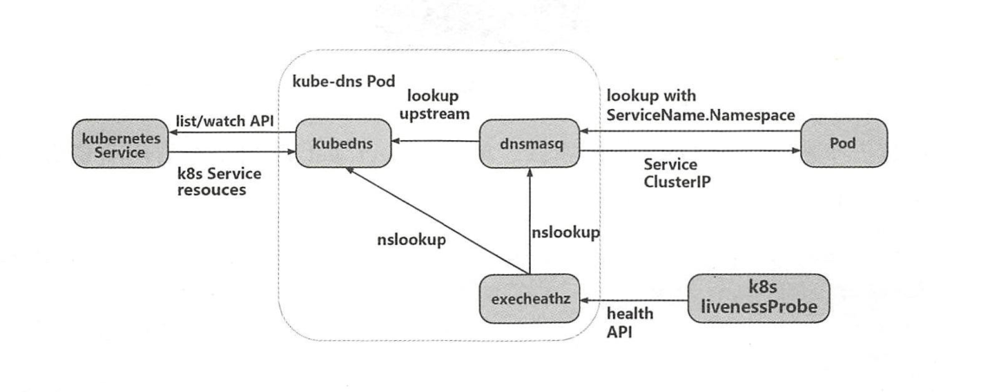
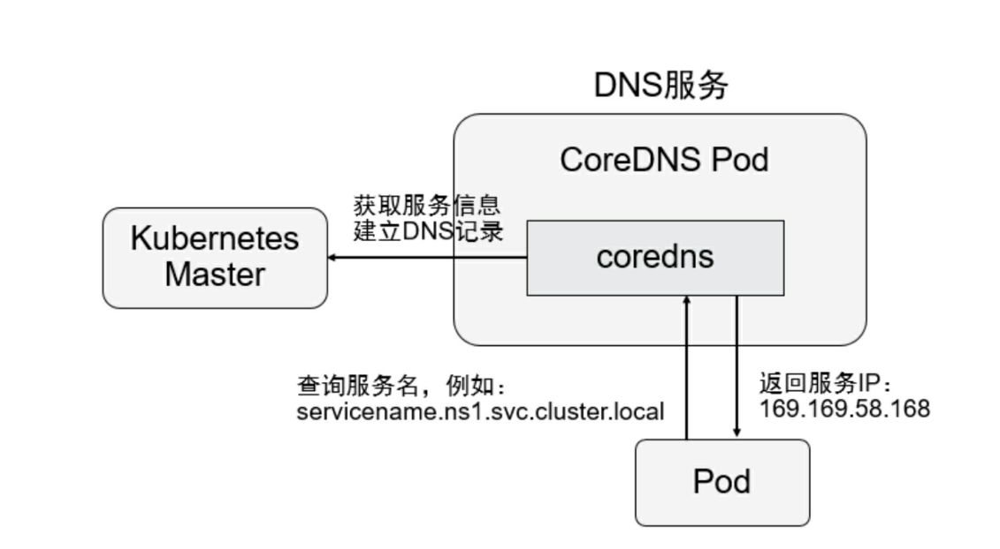
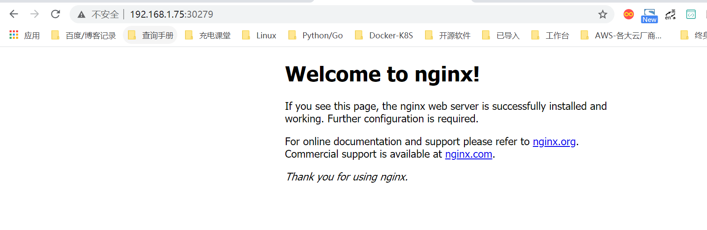

# Serveice

Service在kubernetes集群中是非常重要的，它将请求转发到后端具体Pod中，对外有负载均衡功能，提供一个统一的入口，以此来代理所有应用的Pod。


## 服务代理

创建Service时需要创建Service对象，代码如下

`Service02.yaml`

```
---
apiVersion: v1
kind: Service
metadata:
  annotations:
    k8s.kuboard.cn/workload: hu-nginx
  labels:
    k8s.kuboard.cn/layer: cloud
    k8s.kuboard.cn/name: hu-nginx

  name: hu-nginx
  namespace: default

spec:
  ports:
    - name: http
      port: 80
      protocol: TCP
      targetPort: 80
    - name: https
      port: 443
      protocol: TCP
      targetPort: 443
  selector:
    k8s.kuboard.cn/layer: cloud
    k8s.kuboard.cn/name: hu-nginx
  type: ClusterIP
```

```
[root@ci-base pod]# kubectl create -f service02.yaml
service/my-service created

[root@ci-base pod]# kubectl get svc
NAME         TYPE        CLUSTER-IP     EXTERNAL-IP   PORT(S)          AGE
hu-nginx     ClusterIP   10.98.124.82   <none>        80/TCP,443/TCP   46s

```

my-service是刚创建的，默认类型是ClusterIP,也会被分配一个ClusterIP

使用`kubectl get endpoints`命令可以查看具体的Service后端的Pod的IP。命令如下：

```
[root@ci-base pod]# kubectl get ep
NAME         ENDPOINTS                                               AGE
hu-nginx     <none>                                                  14s

```

my-service并没有Pod的IP，这是因为在`Service.yaml`文件中并没有匹配到某个Deployment可以为它代理，它唯一的匹配就是标签选择器，所以，一般创建一个项目并部署到集群中，首先需要创建一个Deployment，再创建一个Service，他们之间通过标签进行关联。


So，我们来创建一个Deployment。

`deploy-nginx.yaml`

```
---
apiVersion: v1
kind: Service
metadata:
  annotations:
    k8s.kuboard.cn/workload: hu-nginx
  labels:
    k8s.kuboard.cn/layer: cloud
    k8s.kuboard.cn/name: hu-nginx

  name: hu-nginx
  namespace: default

spec:
  ports:
    - name: http
      port: 80
      protocol: TCP
      targetPort: 80
    - name: https
      port: 443
      protocol: TCP
      targetPort: 443
  selector:
    k8s.kuboard.cn/layer: cloud
    k8s.kuboard.cn/name: hu-nginx
  type: ClusterIP
```


```
[root@ci-base pod]# kubectl create -f deploy-nginx.yaml
deployment.apps/mynginx created


[root@ci-base pod]# kubectl get deployment
NAME       READY   UP-TO-DATE   AVAILABLE   AGE
hu-nginx   2/2     2            2           16s

[root@ci-base pod]# kubectl get pod
NAME                        READY   STATUS    RESTARTS   AGE
hu-nginx-6584bd694c-2n22w   1/1     Running   0          27s
hu-nginx-6584bd694c-pvfbb   1/1     Running   0          27s
```


再次查看`kubectl get endpoints`发现IP映射在了hu-nginx中，Service在前面就相当于一个负载均衡器的作用。

```
[root@ci-base pod]# kubectl get ep
NAME         ENDPOINTS                                                          AGE
hu-nginx     10.244.228.65:443,10.244.23.106:443,10.244.228.65:80 + 1 more...   2m53s
```


> 注意：
>
> 任意节点都可以通过Cluster-IP访问后端负载均衡的Pod


## 服务发现


### 1.环境变量

当一个Pod运行到节点时，kubelet会为每个容器添加一组环境变量，Pod容器中的程序就可以使用这些环境变量发现Service。

`busybox.yaml`

```
apiVersion: v1
kind: Pod
metadata:
  name: busybox
  namespace: default

spec:
  containers:
    - image: busybox
      command:
        - sleep
        - "3600"
      imagePullPolicy: IfNotPresent
      name: busybox
  restartPolicy: Always
```


```
[root@ci-base pod]# kubectl create -f busybox.yaml
pod/busybox created

[root@ci-base pod]# kubectl get pod
NAME      READY   STATUS    RESTARTS   AGE
busybox   1/1     Running   0          2s

[root@ci-base pod]# kubectl exec -it busybox sh
/ # env
KUBERNETES_PORT=tcp://10.96.0.1:443
KUBERNETES_SERVICE_PORT=443
HOSTNAME=busybox
SHLVL=1
HOME=/root
HU_NGINX_PORT_80_TCP=tcp://10.102.125.25:80
HU_NGINX_PORT_443_TCP_ADDR=10.102.125.25
HU_NGINX_PORT_443_TCP_PORT=443
HU_NGINX_PORT_443_TCP_PROTO=tcp
HU_NGINX_SERVICE_PORT_HTTP=80
TERM=xterm
KUBERNETES_PORT_443_TCP_ADDR=10.96.0.1
HU_NGINX_SERVICE_PORT_HTTPS=443
HU_NGINX_PORT_443_TCP=tcp://10.102.125.25:443
PATH=/usr/local/sbin:/usr/local/bin:/usr/sbin:/usr/bin:/sbin:/bin
HU_NGINX_SERVICE_HOST=10.102.125.25
KUBERNETES_PORT_443_TCP_PORT=443
KUBERNETES_PORT_443_TCP_PROTO=tcp
HU_NGINX_SERVICE_PORT=80
HU_NGINX_PORT=tcp://10.102.125.25:80
KUBERNETES_PORT_443_TCP=tcp://10.96.0.1:443
KUBERNETES_SERVICE_PORT_HTTPS=443
KUBERNETES_SERVICE_HOST=10.96.0.1
PWD=/
HU_NGINX_PORT_80_TCP_ADDR=10.102.125.25
HU_NGINX_PORT_80_TCP_PORT=80
HU_NGINX_PORT_80_TCP_PROTO=tcp

/ # echo ${HU_NGINX_SERVICE_HOST}
10.102.125.25
/ # echo ${HU_NGINX_SERVICE_PORT}
80

```

```
[root@ci-base pod]# kubectl get svc
NAME         TYPE        CLUSTER-IP      EXTERNAL-IP   PORT(S)          AGE
hu-nginx     ClusterIP   10.102.125.25   <none>        80/TCP,443/TCP   7m52s
```


> 注意：
>
> 1. Pod和Service的创建顺序是有要求的，Service必须在Pod创建之前创建，新创建的Pod会自动注入Service的环境变量。必须先声明Service为Pod做代理，再创建Pod，这样Pod就有了Service的环境变量
> 2. Pod只能获取同一Namespace中的Service的环境变量，如果Service和Pod跨命名空间，则无法获取环境变量。

### 2.KubeDNS

集群中运行了DNS服务，创建的每个Service都有DNS记录，所有的Pod可以通过DNS名称解析相应的Service IP，所以在实际生产环境中，一般都会采用DNS。

Kube-dns的工作原理如下图：



已经没有使用了，被CoreDns替换了，所以这里不进行拓展。

### 3.CoreDns

从Kubernetes 1.11版本开始，Kubernetes集群的DNS服务由CoreDNS
提供。CoreDNS是CNCF基金会的一个项目，是用Go语言实现的高性能、插件式、易扩展的DNS服务端。CoreDNS解决了KubeDNS的一些问题，例如dnsmasq的安全漏洞、externalName不能使用stubDomains设置，等等。


CoreDNS的总体架构：



部署官网：https://github.com/kubernetes/kubernetes/tree/master/cluster/addons/dns/coredns

为服务提供名称域名的访问。

- DNS服务监视Kubernetes API，为每一个Service创建DNS记录用于域名解析。
-  ClusterIP A记录格式：`<service-name>.<namespace-name>.svc.cluster.local`
  示例：`my-svc.my-namespace.svc.cluster.local`


#### 1.查看已有解析service

```
[root@ci-base pod]# kubectl get svc
NAME         TYPE        CLUSTER-IP      EXTERNAL-IP   PORT(S)          AGE
hu-nginx     ClusterIP   10.102.125.25   <none>        80/TCP,443/TCP   6h2m
kubernetes   ClusterIP   10.96.0.1       <none>        443/TCP          59d

[root@ci-base pod]# kubectl get ep
NAME         ENDPOINTS                                                         AGE
hu-nginx     10.244.14.61:443,10.244.228.115:443,10.244.14.61:80 + 1 more...   6h3m
kubernetes   192.168.1.72:8443,192.168.1.73:8443,192.168.1.74:8443             59d
```

#### 2.测试dns是否正常

**2.1 启用一个临时容器**

```
kubectl run -it --image=busybox:1.28.4 --rm --restart=Never sh
```

**2.2 进入容器并进行解析**

```
[root@ci-base pod]# kubectl exec -it sh /bin/sh
kubectl exec [POD] [COMMAND] is DEPRECATED and will be removed in a future version. Use kubectl kubectl exec [POD] -- [COMMAND] instead.
/ # nslookup hu-nginx
Server:    10.96.0.10
Address 1: 10.96.0.10 kube-dns.kube-system.svc.cluster.local

Name:      hu-nginx
Address 1: 10.102.125.25 hu-nginx.default.svc.cluster.local
/ # nslookup kubernetes
Server:    10.96.0.10
Address 1: 10.96.0.10 kube-dns.kube-system.svc.cluster.local

Name:      kubernetes
Address 1: 10.96.0.1 kubernetes.default.svc.cluster.local
```

**2.3 创建另一个容器测试**

```
# 查看ns在kube-system中的svc信息
[root@ci-base pod]# kubectl get svc -n kube-system
NAME             TYPE        CLUSTER-IP       EXTERNAL-IP   PORT(S)                  AGE
calico-typha     ClusterIP   10.99.96.27      <none>        5473/TCP                 59d
kube-dns         ClusterIP   10.96.0.10       <none>        53/UDP,53/TCP,9153/TCP   59d
kuboard          NodePort    10.105.236.9     <none>        80:32567/TCP             34h
metrics-server   ClusterIP   10.109.213.146   <none>        443/TCP                  58d
```


```
# 创建一个ns在kube-system中的容器
[root@ci-base pod]# kubectl run -it --image=busybox:1.28.4 --rm --restart=Never sh -n kube-system
If you don't see a command prompt, try pressing enter.

# 查看同一个ns中的svc，直接使用svc名称
/ # nslookup kuboard
Server:    10.96.0.10
Address 1: 10.96.0.10 kube-dns.kube-system.svc.cluster.local

Name:      kuboard
Address 1: 10.105.236.9 kuboard.kube-system.svc.cluster.local

# 查看同一个ns中的svc，直接使用svc名称
/ # nslookup metrics-server
Server:    10.96.0.10
Address 1: 10.96.0.10 kube-dns.kube-system.svc.cluster.local

Name:      metrics-server
Address 1: 10.109.213.146 metrics-server.kube-system.svc.cluster.local
/ # nslookup hu-nginx.default
Server:    10.96.0.10
Address 1: 10.96.0.10 kube-dns.kube-system.svc.cluster.local

# Service域名格式：$(service name).$(namespace).svc.cluster.local，其中 cluster.local 为指定的集群的域名
# 查看不同ns中的svc，使用svc.<namespace-name>.svc.cluster.local

/ # nslookup hu-nginx.default.svc.cluster.local
Server:    10.96.0.10
Address 1: 10.96.0.10 kube-dns.kube-system.svc.cluster.local

Name:      hu-nginx.default.svc.cluster.local
Address 1: 10.102.125.25 hu-nginx.default.svc.cluster.local
```


**# 注意事项**

```
注：在api的service证书签发内留下dns的ip地址

# 报错：Failed to list *v1.Namespace: Get https://10.0.0.1:443/api/v1/namespaces?limit=500&resourceVersion=0: dial tcp 10.0.0.1:443: i/o timeout

解决方案：重启Node上的kube-proxy、重新创建coredns。
```

参考文献：

[Kubernetes 部署集群内部DNS服务](https://www.cnblogs.com/xiangsikai/p/11413970.html)


## 发布服务

发布服务的类型有：**ClusterIP、NodePort和LoadBalancer**

- ClusterIP：分配的一个内部集群的IP地址，只能在集群内部访问 ，同Namespace类的Pod，默认是ServiceType。
- NodePort：分配的一个内部集群的IP地址，每个节点启用一个端口来暴露服务，可以在集群外部访问，默认启动的端口是30000+、访问地址是：`<NodeIP>：<NodePort>`。
- LoadBalancer：分配的一个内部集群的IP地址，每个节点上启用一个端口来暴露服务，除此之外，K8S会请求云平台上的负载均衡器，将每个节点（`<NodeIP>：<NodePort>`）作为后端添加进去。


示例文件

```
apiVersion: v1
kind: Pod
metadata:
  name: mypod
spec:
  containers:
    - name: nginx
      image: nginx:1.16.1
      imagePullPolicy: Always
---
apiVersion: v1
kind: Service
metadata:
  name: nginx-service
  labels:
    app: nginx
spec:
  type: NodePort		# 随机暴露Node上一个30000+端口
  ports:
  - port: 80
    targetPort: 80
  selector:
    app: mypod

```


```
[root@ci-base pod]# kubectl get pod,svc
NAME                               READY   STATUS    RESTARTS   AGE
pod/cloud-nginx-6b68f94dc5-l549j   1/1     Running   0          14s

NAME                 TYPE        CLUSTER-IP      EXTERNAL-IP   PORT(S)        AGE
service/kubernetes   ClusterIP   10.96.0.1       <none>        443/TCP        58d
service/nginx        NodePort    10.106.89.158   <none>        80:30279/TCP   5s
```


在node节点上可以访问CLUSTER-IP，如下

```
[root@k8s-w1 ~]# curl 10.106.89.158
<!DOCTYPE html>
<html>
<head>
<title>Welcome to nginx!</title>
<style>
    body {
        width: 35em;
        margin: 0 auto;
        font-family: Tahoma, Verdana, Arial, sans-serif;
    }
</style>
</head>
<body>
<h1>Welcome to nginx!</h1>
<p>If you see this page, the nginx web server is successfully installed and
working. Further configuration is required.</p>

<p>For online documentation and support please refer to
<a href="http://nginx.org/">nginx.org</a>.<br/>
Commercial support is available at
<a href="http://nginx.com/">nginx.com</a>.</p>

<p><em>Thank you for using nginx.</em></p>
</body>
</html>
```

在集群节点外，访问如下：

`Node节点IP+30279`





NodePort端口范围是可以自定义的，在apiserver中可以看到，默认是30000+，可以值得1000~65535端口的范围，只要在/opt/kubernetes/cfg/kube-apiserver文件中定义即可。

```
spec:
  ports:
    - name: h2tji5
      port: 8089			#暴露端口
      protocol: TCP
      targetPort: 80		# 容器端口
```

如上所示，可以将容器中的80端口对应服务的8089端口。

查看具体Serveice后端Pod的IP

```
[root@ci-base pod]# kubectl get ep|grep nginx
nginx        10.244.228.106:80                                       37m
```


参考文献：

https://www.cnblogs.com/xiangsikai/p/11413913.html