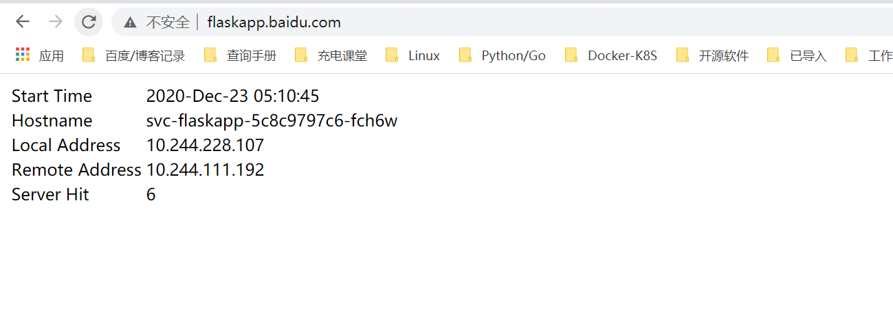

# 使用Ingress负载分发微服务

NodePort Service存在太多缺陷，不适合生产环境。LoadBlancer Service则不太灵活，比如针对微服务架构，那么不同服务是否需要多个负载均衡服务呢？我们还有其他选择么？有，那就是Ingress。

Ingress将集群外部的HTTP和HTTPS路由暴露给集群中的Service，相当于集群的入口，而入口规则由Ingress定义的规则来控制。

在使用Ingress之前，我们需要有一个Ingress Controller（入口控制器），例如ingress-nginx。Ingress负责定义抽象的规则，而Ingress Controller负责具体实现。通常情况下，Ingress搭配负载均衡一起使用。接下来，结合一个简单的微服务Demo来使用Ingress进行负载分发。

## 1.简介


示意图如下：


## 2.Demo示例

为了便于大家理解，我们先做一个简单的规划。整体规划图如图


Demo规划的整体步骤如下所示：

（1）开发两个应用，分别为apidemo1和apidemo2，并提供不同的接口服务。

（2）将两个应用分别部署到k8s集群，并且分别创建不同的Service。

（3）创建Ingress，配置不同的转发规则。

（4）为了访问方便，我们需要配置域名映射。


### 2.1 准备Demo并完成部署

+ apidemo1

```
apidemo1的访问路径为https://{hostname}:{port}/api/demo1，输出JSON“["value1", "value2"]”。
```

* apidemo2

```
apidemo2的访问路径为https://{hostname}:{port}/api/demo2，输出JSON“["value3", "value4"]”。
```


> apidemo1和apidemo2均需支持80端口和443端口访问。


### 2.2  创建部署资源
[demo1.yaml](https://github.com/hujianli94/k8s-yaml-example/blob/master/ingress_demo/apidemo1-svc.yaml)

[demo2.yaml](https://github.com/hujianli94/k8s-yaml-example/blob/master/ingress_demo/apidemo2-svc.yaml)


### 2.3 创建服务资源
[apidemo1-svc.yaml](https://github.com/hujianli94/k8s-yaml-example/blob/master/ingress_demo/apidemo1-svc.yaml)

[apidemo2-svc.yaml](https://github.com/hujianli94/k8s-yaml-example/blob/master/ingress_demo/apidemo2-svc.yaml)


### 2.4 创建Ingress资源并配置转发规则
接下来我们需要创建Ingress并配置好转发规则达成如下目标：

```
● 使用同一个IP访问多个API服务，这里对应的是“apidemo1”和“apidemo2”。
● 通过地址http://demo.xin-lai.com/api/demo1访问应用“apidemo1”。
● 通过地址http://demo.xin-lai.com/api/demo2访问应用“apidemo2”。
```

[demo-ingress.yaml](https://github.com/hujianli94/k8s-yaml-example/blob/master/ingress_demo/demo-ingress.yaml)


## 3.Ingress实战

Ingress 是 Kubernetes 的一种 API 对象，将集群内部的 Service 通过 HTTP/HTTPS 方式暴露到集群外部，并通过规则定义 HTTP/HTTPS 的路由。Ingress 具备如下特性：集群外部可访问的 URL、负载均衡、SSL Termination、按域名路由（name-based virtual hosting）。

在 master 节点上执行

```
kubectl apply -f https://kuboard.cn/install-script/v1.17.x/nginx-ingress.yaml
```

配置域名解析

将域名 *.demo.yourdomain.com 解析到 demo-worker-a-2 的 IP 地址 z.z.z.z （也可以是 demo-worker-a-1 的地址 y.y.y.y）

验证配置

在浏览器访问 a.demo.yourdomain.com，将得到 404 NotFound 错误页面


### 3.1 应用yaml

这里以flaskapp为例

#### 3.1.1  创建namespace
[flask-namespace.yaml](https://github.com/hujianli94/k8s-yaml-example/blob/master/flask-app-ingress/flask-namespace.yaml)

#### 3.1.2 创建deployment
[flask-app.yaml](https://github.com/hujianli94/k8s-yaml-example/blob/master/flask-app-ingress/flask-app.yaml)


#### 3.1.3 创建Ingress
[flask-ingress.yaml](https://github.com/hujianli94/k8s-yaml-example/blob/master/flask-app-ingress/flask-ingress.yaml)


执行yaml

```
kubectl apply -f flask-app.yaml
kubectl apply -f flask-ingress.yaml
```


查看pod

```
[root@ci-base flask-app]# kubectl get pod -o wide -n web-demo
NAME                            READY   STATUS    RESTARTS   AGE   IP               NODE     NOMINATED NODE   READINESS GATES
svc-flaskapp-5c8c9797c6-fch6w   1/1     Running   0          39m   10.244.228.107   k8s-w1   <none>           <none>
```

查看svc

```
[root@ci-base flask-app]# kubectl get svc  -n web-demo
NAME           TYPE        CLUSTER-IP    EXTERNAL-IP   PORT(S)    AGE
svc-flaskapp   ClusterIP   10.99.43.18   <none>        5000/TCP   39m
```


查看ingresses

```
[root@ci-base flask-app]# kubectl get ingresses.extensions -n web-demo
NAME           CLASS    HOSTS                ADDRESS   PORTS   AGE
svc-flaskapp   <none>   flaskapp.baidu.com             80      36m
```


## 设置域名解析

如果没有dns，修改windows 10的hosts，添加一条记录

```
192.168.1.75 flaskapp.baidu.com
```

注意：解析到任意node节点都可以！

访问页面

```
http://flaskapp.baidu.com/
```


效果如下：

