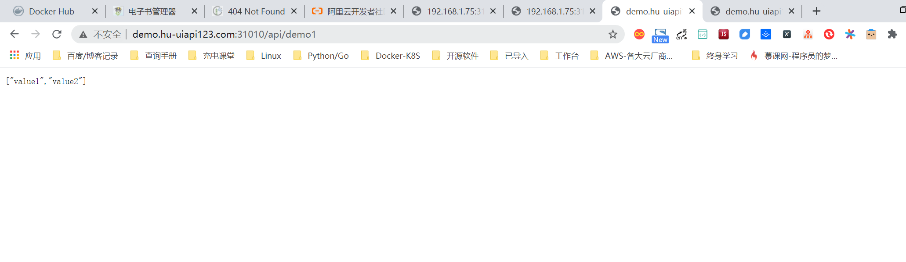
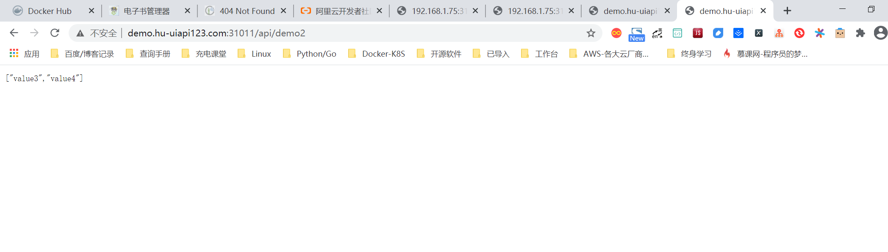
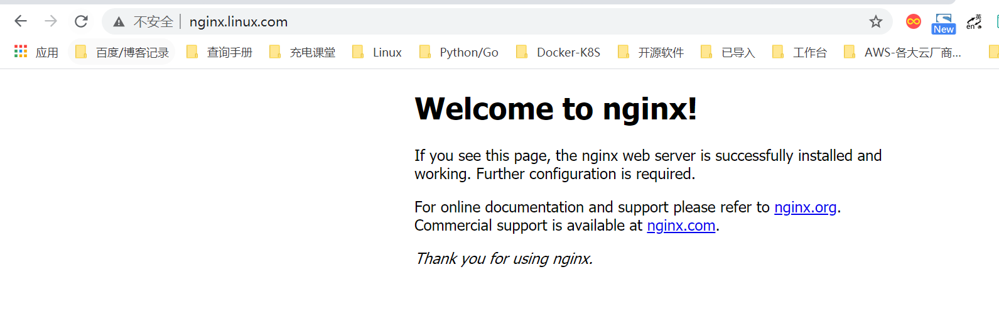
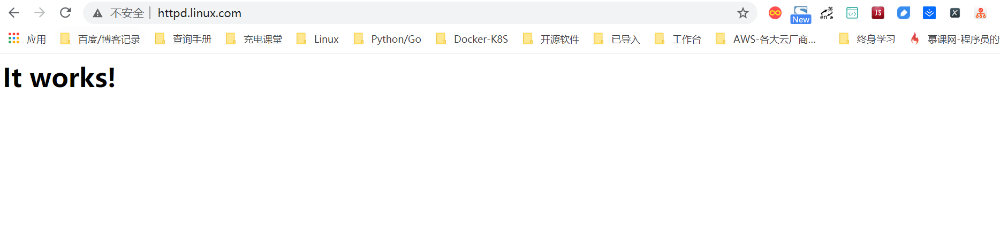

# 使用Ingress负载分发微服务

NodePort Service存在太多缺陷，不适合生产环境。LoadBlancer Service则不太灵活，比如针对微服务架构，那么不同服务是否需要多个负载均衡服务呢？我们还有其他选择么？有，那就是Ingress。

Ingress将集群外部的HTTP和HTTPS路由暴露给集群中的Service，相当于集群的入口，而入口规则由Ingress定义的规则来控制。

在使用Ingress之前，我们需要有一个Ingress Controller（入口控制器），例如ingress-nginx。Ingress负责定义抽象的规则，而Ingress Controller负责具体实现。通常情况下，Ingress搭配负载均衡一起使用。接下来，结合一个简单的微服务Demo来使用Ingress进行负载分发。

## 1.简介


示意图如下：


## 2.Demo示例

为了便于大家理解，我们先做一个简单的规划。整体规划图如图


Demo规划的整体步骤如下所示：

（1）开发两个应用，分别为apidemo1和apidemo2，并提供不同的接口服务。

（2）将两个应用分别部署到k8s集群，并且分别创建不同的Service。

（3）创建Ingress，配置不同的转发规则。

（4）为了访问方便，我们需要配置域名映射。


### 2.1 准备Demo并完成部署

+ apidemo1

```
apidemo1的访问路径为https://{hostname}:{port}/api/demo1，输出JSON“["value1", "value2"]”。

如下方式访问：
nodeIP:31010/api/demo1
```

* apidemo2

```
apidemo2的访问路径为https://{hostname}:{port}/api/demo2，输出JSON“["value3", "value4"]”。
如下方式访问：
nodeIP:31011/api/demo2
```


> apidemo1和apidemo2均需支持80端口和443端口访问。


### 2.2  创建部署资源
`demo1-deploy.yaml`

```
---
apiVersion: apps/v1 #api版本
kind: Deployment #使用部署对象
metadata:
  labels: #标签列表
    app: apidemo1
  name: apidemo1 #部署名称
  namespace: demo-ingress-test01 #命名空间
spec:
  replicas: 1 #副本数
  selector: #选择器
    matchLabels:
      app: apidemo1
  template: #Pod模板
    metadata:
      labels:
        app: apidemo1
    spec:
      containers: #容器列表
      - env: #环境变量设置
        - name: PATH
          value: /usr/local/sbin:/usr/local/bin:/usr/sbin:/usr/bin:/sbin:/bin
        - name: ASPNETCORE_URLS
          value: http://+:80
        - name: DOTNET_RUNNING_IN_CONTAINER
          value: "true"
        - name: ASPNETCORE_VERSION
          value: 2.2.6
        image: ccr.ccs.tencentyun.com/magicodes/apidemo1:latest #镜像地址
        imagePullPolicy: Always #镜像拉取策略，Always表示总是拉取最新镜像，IfNotPresent表示如果本地存在则不拉取，Never则表示只使用本地镜像
        name: apidemo1  #容器名称
        resources:  #资源限制
          limits: #最高限制
            cpu: 500m
            memory: 256Mi
          requests: #预分配
            cpu: 250m
            memory: 64Mi
        workingDir: /app  #工作目录
      dnsPolicy: ClusterFirst #DNS策略
      restartPolicy: Always #重启策略
      terminationGracePeriodSeconds: 30 #删除需要时间

---

apiVersion: v1
kind: Service #资源类型
metadata:
  name: apidemo1  #服务名称
  namespace: demo-ingress-test01
spec:
  ports: #端口列表
  - name: tcp-80-80
    nodePort: 31010 #节点端口
    port: 80  #当前端口
    protocol: TCP #协议
    targetPort: 80  #目标端口
  selector: #标签选择器
    app: apidemo1
  type: NodePort  #NodePort 类型的Service
```


### 2.3 创建服务资源

`demo2-deploy.yaml`

```
apiVersion: apps/v1 #api版本
kind: Deployment #使用部署对象
metadata:
  labels: #标签列表
    app: apidemo2
  name: apidemo2 #部署名称
  namespace: demo-ingress-test01 #命名空间
spec:
  replicas: 1 #副本数
  selector: #选择器
    matchLabels:
      app: apidemo2
  template: #Pod模板
    metadata:
      labels:
        app: apidemo2
    spec:
      containers: #容器列表
      - env: #环境变量设置
        - name: PATH
          value: /usr/local/sbin:/usr/local/bin:/usr/sbin:/usr/bin:/sbin:/bin
        - name: ASPNETCORE_URLS
          value: http://+:80
        - name: DOTNET_RUNNING_IN_CONTAINER
          value: "true"
        - name: ASPNETCORE_VERSION
          value: 2.2.6
        image: ccr.ccs.tencentyun.com/magicodes/apidemo2:latest #镜像地址
        imagePullPolicy: Always #镜像拉取策略，Always表示总是拉取最新镜像，IfNotPresent表示如果本地存在则不拉取，Never则表示只使用本地镜像
        name: apidemo2  #容器名称
        resources:  #资源限制
          limits: #最高限制
            cpu: 500m
            memory: 256Mi
          requests: #预分配
            cpu: 250m
            memory: 64Mi
        workingDir: /app  #工作目录
      dnsPolicy: ClusterFirst #DNS策略
      restartPolicy: Always #重启策略
      terminationGracePeriodSeconds: 30 #删除需要时间
---
apiVersion: v1
kind: Service #资源类型
metadata:
  name: apidemo2  #服务名称
  namespace: demo-ingress-test01
spec:
  ports: #端口列表
  - name: tcp-80-80
    nodePort: 31011 #节点端口
    port: 80  #当前端口
    protocol: TCP #协议
    targetPort: 80  #目标端口
  selector: #标签选择器
    app: apidemo2
  type: NodePort  #NodePort 类型的Service
```


**检查创建的资源信息**

```
[root@ci-base ingress-demo1]# kubectl get ingress -n demo-ingress-test01
NAME   CLASS    HOSTS                                       ADDRESS   PORTS   AGE
demo   <none>   demo.hu-uiapi123.com,demo.hu-uiapi123.com             80      32s


[root@ci-base ingress-demo1]# kubectl get pods,svc -n demo-ingress-test01
NAME                            READY   STATUS    RESTARTS   AGE
pod/apidemo1-5d5d799856-nr7mn   1/1     Running   0          30m
pod/apidemo2-58b784fb9c-dz2lc   1/1     Running   0          27m

NAME               TYPE       CLUSTER-IP      EXTERNAL-IP   PORT(S)        AGE
service/apidemo1   NodePort   10.102.61.7     <none>        80:31010/TCP   30m
service/apidemo2   NodePort   10.111.218.86   <none>        80:31011/TCP   26m
```


### 2.4 创建Ingress资源并配置转发规则
接下来我们需要创建Ingress并配置好转发规则达成如下目标：

```
● 使用同一个IP访问多个API服务，这里对应的是“apidemo1”和“apidemo2”。
● 通过地址http://demo.hu-uiapi123.com:31010/api/demo1访问应用“apidemo1”。
● 通过地址http://demo.hu-uiapi123.com:31011/api/demo2访问应用“apidemo2”。
```

`ingress-demo.yaml`

```
# create ingree
apiVersion: networking.k8s.io/v1beta1
kind: Ingress
metadata:
  annotations:
    kubernetes.io/ingress.class: qcloud #注释,不同的Ingress控制器支持不同的注释
    kubernetes.io/ingress.http-rules: '[{"host":"demo.hu-uiapi123.com","path":"/api/demo1","backend":{"serviceName":"apidemo1","servicePort":80}},{"host":"demo.hu-uiapi123.com","path":"/api/demo2","backend":{"serviceName":"apidemo2","servicePort":80}}]' #HTTP转发规则
    kubernetes.io/ingress.https-rules: "null"
    kubernetes.io/ingress.rule-mix: "true"
  name: demo
  namespace: demo-ingress-test01
spec:
  rules: #规则列表
  - host: demo.hu-uiapi123.com #主机名，可选。如不填写，则使用IP地址。
    http: #HTTP规则
      paths: #路径列表
      - backend: #后端配置
          serviceName: apidemo1 #后端服务名称
          servicePort: 80 #服务端口
        path: /api/demo1 #路径，同一个域名路径需不同
  - host: demo.hu-uiapi123.com #主机名，可选。如不填写，则使用IP地址。
    http:
      paths:
      - backend:
          serviceName: apidemo2 #后端服务名称
          servicePort: 80 #服务端口
        path: /api/demo2  #路径，同一个域名路径需不同
```


```
[root@ci-base ingress-demo1]# kubectl get ingress -n demo-ingress-test01
NAME   CLASS    HOSTS                                       ADDRESS   PORTS   AGE
demo   <none>   demo.hu-uiapi123.com,demo.hu-uiapi123.com             80      32s
```







## 3.Ingress实战

Ingress 是 Kubernetes 的一种 API 对象，将集群内部的 Service 通过 HTTP/HTTPS 方式暴露到集群外部，并通过规则定义 HTTP/HTTPS 的路由。Ingress 具备如下特性：集群外部可访问的 URL、负载均衡、SSL Termination、按域名路由（name-based virtual hosting）。

在 master 节点上执行

```
kubectl apply -f https://kuboard.cn/install-script/v1.17.x/nginx-ingress.yaml
```

配置域名解析

将域名 *.demo.yourdomain.com 解析到 demo-worker-a-2 的 IP 地址 z.z.z.z （也可以是 demo-worker-a-1 的地址 y.y.y.y）

验证配置

在浏览器访问 a.demo.yourdomain.com，将得到 404 NotFound 错误页面


### 3.1 应用yaml

这里以flaskapp为例

#### 3.1.1  创建namespace
`flask-namespace.yaml`

```
apiVersion: v1
kind: Namespace
metadata:
  name: web-demo
```


#### 3.1.2 创建deployment
`flask-app.yaml`

```
---
apiVersion: apps/v1
kind: Deployment
metadata:
  annotations:
    k8s.eip.work/displayName: flaskapp
    k8s.eip.work/ingress: 'false'
    k8s.eip.work/service: ClusterIP
    k8s.eip.work/workload: svc-flaskapp
  labels:
    k8s.eip.work/layer: svc
    k8s.eip.work/name: svc-flaskapp
  name: svc-flaskapp
  namespace: web-demo
spec:
  replicas: 1
  selector:
    matchLabels:
      k8s.eip.work/layer: svc
      k8s.eip.work/name: svc-flaskapp
  template:
    metadata:
      labels:
        k8s.eip.work/layer: svc
        k8s.eip.work/name: svc-flaskapp
    spec:
      containers:
        -
          image: jcdemo/flaskapp
          imagePullPolicy: Always
          name: flaskapp
      restartPolicy: Always

---
apiVersion: v1
kind: Service
metadata:
  annotations:
    k8s.eip.work/displayName: flaskapp
    k8s.eip.work/workload: svc-flaskapp
  labels:
    k8s.eip.work/layer: svc
    k8s.eip.work/name: svc-flaskapp
  name: svc-flaskapp
  namespace: web-demo
spec:
  ports:
    - name: wjaz2a
      nodePort: 0
      port: 5000
      protocol: TCP
      targetPort: 5000
  selector:
    k8s.eip.work/layer: svc
    k8s.eip.work/name: svc-flaskapp
  type: ClusterIP
```


#### 3.1.3 创建Ingress
`flask-ingress.yaml`

```
apiVersion: networking.k8s.io/v1beta1
kind: Ingress
metadata:
  name: svc-flaskapp
  namespace: web-demo
  annotations:
    kubernetes.io/ingress.class: "Deployment-nginx"
spec:
  rules:
  - host: flaskapp.baidu.com
    http:
      paths:
      - backend:
          serviceName: svc-flaskapp
          servicePort: 5000
```


执行yaml

```
kubectl apply -f flask-app.yaml
kubectl apply -f flask-ingress.yaml
```


查看pod

```
[root@ci-base flask-app]# kubectl get pod -o wide -n web-demo
NAME                            READY   STATUS    RESTARTS   AGE   IP               NODE     NOMINATED NODE   READINESS GATES
svc-flaskapp-5c8c9797c6-fch6w   1/1     Running   0          39m   10.244.228.107   k8s-w1   <none>           <none>
```

查看svc

```
[root@ci-base flask-app]# kubectl get svc  -n web-demo
NAME           TYPE        CLUSTER-IP    EXTERNAL-IP   PORT(S)    AGE
svc-flaskapp   ClusterIP   10.99.43.18   <none>        5000/TCP   39m
```


查看ingresses

```
[root@ci-base flask-app]# kubectl get ingresses.extensions -n web-demo
NAME           CLASS    HOSTS                ADDRESS   PORTS   AGE
svc-flaskapp   <none>   flaskapp.baidu.com             80      36m
```


#### 3.1.4 设置域名解析

如果没有dns，修改windows 10的hosts，添加一条记录

```
192.168.1.75 flaskapp.baidu.com
```

注意：解析到任意node节点都可以！

访问页面

```
http://flaskapp.baidu.com/
```


效果如下：


## 4. Ingress：HTTP 7层路由机制


### 4.1  应用yaml

#### 4.1.1 nginx 的deployment

`nginx-deployment.yaml`

```
---
apiVersion: apps/v1
kind: Deployment
metadata:
  labels:
    k8s.kuboard.cn/layer: cloud
    k8s.kuboard.cn/name: cloud-nginx

  name: cloud-nginx
  namespace: ingress-web-test
spec:
  progressDeadlineSeconds: 600
  replicas: 1
  revisionHistoryLimit: 10
  selector:
    matchLabels:
      k8s.kuboard.cn/layer: cloud
      k8s.kuboard.cn/name: cloud-nginx
  strategy:
    rollingUpdate:
      maxSurge: 25%
      maxUnavailable: 25%
    type: RollingUpdate
  template:
    metadata:
      labels:
        k8s.kuboard.cn/layer: cloud
        k8s.kuboard.cn/name: cloud-nginx
    spec:
      containers:
        - image: nginx
          imagePullPolicy: Always
          name: nginx
          terminationMessagePath: /dev/termination-log
          terminationMessagePolicy: File
      dnsPolicy: ClusterFirst
      restartPolicy: Always
      schedulerName: default-scheduler
      terminationGracePeriodSeconds: 30


---
apiVersion: v1
kind: Service
metadata:
  annotations:
    k8s.kuboard.cn/workload: cloud-nginx
  labels:
    k8s.kuboard.cn/layer: cloud
    k8s.kuboard.cn/name: cloud-nginx
  name: cloud-nginx
  namespace: ingress-web-test

spec:
  ports:
    - name: m84rkz
      port: 8088
      protocol: TCP
      targetPort: 80
  selector:
    k8s.kuboard.cn/layer: cloud
    k8s.kuboard.cn/name: cloud-nginx
  sessionAffinity: None
  type: ClusterIP
```


#### 4.1.2 http的deployment

`http-deployment.yaml`

```
---
apiVersion: apps/v1
kind: Deployment
metadata:

  labels:
    k8s.kuboard.cn/layer: cloud
    k8s.kuboard.cn/name: cloud-httpd

  name: cloud-httpd
  namespace: ingress-web-test

spec:
  progressDeadlineSeconds: 600
  replicas: 1
  revisionHistoryLimit: 10
  selector:
    matchLabels:
      k8s.kuboard.cn/layer: cloud
      k8s.kuboard.cn/name: cloud-httpd
  strategy:
    rollingUpdate:
      maxSurge: 25%
      maxUnavailable: 25%
    type: RollingUpdate
  template:
    metadata:
      labels:
        k8s.kuboard.cn/layer: cloud
        k8s.kuboard.cn/name: cloud-httpd
    spec:
      containers:
        - image: httpd
          imagePullPolicy: Always
          name: httpd
      dnsPolicy: ClusterFirst
      restartPolicy: Always
      schedulerName: default-scheduler
      terminationGracePeriodSeconds: 30


---
apiVersion: v1
kind: Service
metadata:
  annotations:
    k8s.kuboard.cn/workload: cloud-httpd

  labels:
    k8s.kuboard.cn/layer: cloud
    k8s.kuboard.cn/name: cloud-httpd
  name: cloud-httpd
  namespace: ingress-web-test

spec:
  ports:
    - name: h2tji5
      port: 8089
      protocol: TCP
      targetPort: 80
  selector:
    k8s.kuboard.cn/layer: cloud
    k8s.kuboard.cn/name: cloud-httpd
  sessionAffinity: None
  type: ClusterIP

```

#### 4.1.3 检查pod和sevice状态

```
// 应用yaml文件，生成deployment
[root@ci-base ingress-demo2]# kubectl create -f http-deployment.yaml nginx-deployment.yaml


[root@ci-base ingress-demo2]# kubectl get deployment -n ingress-web-test
NAME          READY   UP-TO-DATE   AVAILABLE   AGE
cloud-httpd   1/1     1            1           8m23s
cloud-nginx   1/1     1            1           5m13s
[root@ci-base ingress-demo2]# kubectl get pod,svc -n ingress-web-test
NAME                               READY   STATUS    RESTARTS   AGE
pod/cloud-httpd-6f74985dd7-fn2nk   1/1     Running   0          9m14s
pod/cloud-nginx-76cdc4498c-spzsh   1/1     Running   0          5m38s

NAME                  TYPE        CLUSTER-IP       EXTERNAL-IP   PORT(S)    AGE
service/cloud-httpd   ClusterIP   10.107.170.205   <none>        8089/TCP   8m48s
service/cloud-nginx   ClusterIP   10.103.8.159     <none>        8088/TCP   5m38s

```


#### 4.1.4 node上访问nginx和http的server（ClusterIP）

```
[root@k8s-w1 ~]# curl 10.107.170.205:8089
<html><body><h1>It works!</h1></body></html>
[root@k8s-w1 ~]# curl 10.103.8.159:8088
<!DOCTYPE html>
<html>
<head>
<title>Welcome to nginx!</title>
```


#### 4.1.5 创建ingress规则

`ingress.yaml`

```
apiVersion: networking.k8s.io/v1beta1
kind: Ingress
metadata:
  name: ingress-httpd
  namespace: ingress-web-test

spec:
  rules:
    - host: nginx.linux.com     #测试域名
      http:
        paths:
          - backend:
              serviceName: cloud-nginx
              servicePort: 8088

    - host: httpd.linux.com     #测试域名
      http:
        paths:
          - backend:
              serviceName: cloud-httpd
              servicePort: 8089
```

应用ingress规则

```
[root@ci-base ingress-demo2]# kubectl create -f ingress-web.yaml
[root@ci-base ingress-demo2]# kubectl get ingress -n ingress-web-test
NAME            CLASS    HOSTS                             ADDRESS   PORTS   AGE
ingress-httpd   <none>   nginx.linux.com,httpd.linux.com             80      2m4s
```


#### 4.1.6  模拟dns解析

修改主机hosts文件 

> 192.168.1.75 为node节点的IP信息

```
192.168.1.75 nginx.linux.com
192.168.1.75 httpd.linux.com
```

查看解析结果



