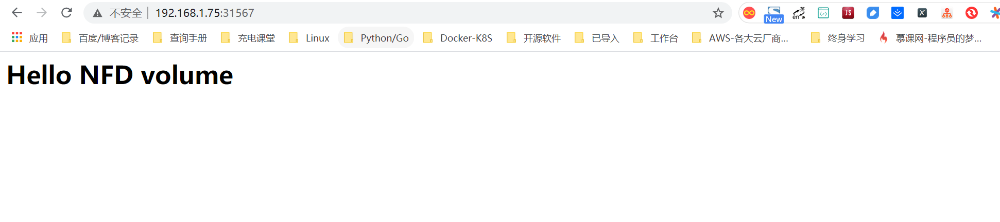

# Kubernetest数据管理

Volume对Kubernetes集群应用数据进行管理，常见的类型有：

- emptyDir
- hostPath
- NFS
- ClusterFS


## 1. emptyDir

- 当Pod分配到Node时，首先创建一个空卷，并挂载到Pod中的容器。
- Pod中的容器可以读取和写入卷中的文件。
- 当Pod从节点中删除emptyDir时，该数据也会被删除。
- 注：适用于容器之间的数据共享。

### 1.1 创建emptydir实例

**1、管理节点：创建yaml文件**

`vim emptydir.yaml`

```
apiVersion: v1
kind: Pod
metadata:
  name: test-pd
spec:
  containers:
    - image: nginx:1.12
      name: test-container
      volumeMounts:
        - mountPath: /cache
          name: cache-volume
  volumes:
    - name: cache-volume
      emptyDir: { }
```

```
# api版本
apiVersion: v1
# 指定创建资源对象
kind: Pod
# 源数据、可以写name，命名空间，对象标签
metadata:
# 服务名称
  name: test-pd
# 容器资源信息
spec:
# 容器管理
  containers:
# 镜像名称
  - image: nginx:1.12
# 容器名称
    name: test-container
# 容器数据卷管理
    volumeMounts:
# 容器内挂载目录
    - mountPath: /cache
# 容器挂载数据名称
      name: cache-volume
# 宿主数据卷管理
  volumes:
# 创建数据卷名称
  - name: cache-volume
# emptydir标准语法
    emptyDir: {}
```

**2、管理节点：创建Pod**

```
kubectl create -f emptydir.yaml
```

**3、测试**

```
命令：kubectl exec test-pd -it bash

root@test-pd:/# cd /cache/
root@test-pd:/cache# ls
root@test-pd:/cache# 
```

```
命令：kubectl describe pods test-pd

    Mounts:
      /cache from cache-volume (rw)
Conditions:
  Type           Status
  Initialized    True 
  Ready          True 
  PodScheduled   True 
Volumes:
  cache-volume:
    Type:        EmptyDir (a temporary directory that shares a pod's lifetime)
    Medium:      
QoS Class:       BestEffort
Node-Selectors:  <none>
Tolerations:     <none>
```

emptyDir是在主机上创建临时目录，优点是能够方便地位Pod中容器提供共享存储，而不需要进行额外的配置，但是它不具有持久性，如果Pod不存在了，emptyDir也会随之删除，所以emptyDir适合Pod中的容器需要临时共享存储空间的场景。


## 2. hostPath

- 一个hostPath卷挂载Node文件系统上的文件或目录到Pod中的容器。
- 注：指定宿主级的数据目录挂载到容器中。


**1、管理节点：创建yaml文件**

`hostpath.yaml`

```yaml
apiVersion: v1
kind: Pod
metadata:
  name: test-pd2
spec:
  containers:
    - image: nginx:1.12
      name: test-container
      volumeMounts:
        - mountPath: /data
          name: test-volume
  volumes:
    - name: test-volume
      hostPath:
        path: /etc/default
        type: Directory
```

> 注解

```
# api版本
apiVersion: v1
# 指定创建资源对象
kind: Pod
# 源数据、可以写name，命名空间，对象标签
metadata:
# 服务名称
  name: test-pd2
# 容器资源信息
spec:
# 容器管理
  containers:
# 镜像名称
  - image: nginx:1.12
    name: test-container
# 容器数据卷管理
    volumeMounts:
# 容器挂载目录
    - mountPath: /data
# 容器挂载数据名称
      name: test-volume
# 宿主数据卷管理
  volumes:
# 创建数据卷名称
  - name: test-volume
# 数据卷地址
    hostPath:
# 挂载到容器的宿主目录
      path: /etc/default
# 类型为目录文件
      type: Directory
```

**2、管理节点：创建Pod**

```
kubectl create -f hostpath.yaml
```

**3、测试**

```
命令：kubectl exec test-pd2 -it bash

root@test-pd2:/# cd /data
root@test-pd2:/data# ls
grub  nss  useradd  yyy
```

日常工作中可能降宿主机上的目录或文件挂载到容器中，而这些文件和目录在每个节点上都要有，所以容器就起到了收集信息的作用，这也是hostPath的主要应用场景。即使Pod被销毁了，hostPath对应目录依然存在，这样看来hostPath持久性要比emptyDir持久性好很多。但是一旦宿主机崩溃，hostPath目录自然也无法访问。


## 3. NFS

NFS是网络存储，通过挂载去访问里面的资源。

Kubernetes内置了多种类型的网络存储卷插件，它们支持的存储服务包括传统的NAS或SAN设备（例如NFS、iscsi和FC等）、分布式存储（例如GlusterFS、CephFS和RBD等）、云存储（例如gcePersistentDisk、azureDisk、Cinder和awsElasticBlockStore等）以及构建在各类存储系统之上的抽象管理层（例如flocker、portworxVolume和vSphereVolume等）。

这类服务通常都是独立运行的存储系统，因相应的存储卷可以支持超越节点生命周期的数据持久性。


### 3.1 搭建NFS服务与客户端

**1、管理节点：安装nfs服务端、配置nfs主配置文件、添加权限、启动**

```
yum install nfs-utils -y
vim /etc/exports
# 添加目录给相应网段访问并添加读写权限
/data/nfs/nginx 192.168.1.0/24(insecure,rw,async,no_root_squash)
# 创建共享目录，添加权限
mkdir -p /data/nfs/nginx
chmod 777 /data/nfs/nginx
# 开启rpc服务
systemctl start rpcbind	&& systemctl enable rpcbind	# 启动服务并设置开机自启
systemctl start nfs &&  systemctl enable nfs
```


在nfs服务器的`/data/nfs/nginx`下创建index文件

```
[root@jenkins nginx]# cd /data/nfs/nginx/ && echo "<h1>Hello NFD volume</h1>" > index.html

[root@jenkins nginx]# cat index.html
<h1>Hello NFD volume</h1>
```


**2、工作节点：安装nfs客户端、启动服务**

```
yum install nfs-utils -y
# 开启rpc服务并且启动服务并设置开机自启
systemctl start rpcbind	&& systemctl enable rpcbind	# 启动服务并设置开机自启
systemctl start nfs &&  systemctl enable nfs
```


### 3.2 共享NFS网络数据卷

**1、管理节点：创建yaml文件**

`vim nginx-nfs.yaml`

```yaml
---
apiVersion: apps/v1
kind: Deployment
metadata:
  name: nginx-deploy-nfs
spec:
  replicas: 2
  selector:
    matchLabels:
      app: nginx
  template:
    metadata:
      labels:
        app: nginx
    spec:
      containers:
      - name: nginx
        image: nginx
        volumeMounts:
        - name: www                           # 数据卷名称
          mountPath: /usr/share/nginx/html    # 容器数据卷挂载路径
        ports:
        - containerPort: 80
      volumes:
      - name: www                             # 数据卷名称两边需要相同
        nfs:
          server: 192.168.1.40          # nfs服务器地址
          path: /data/nfs/nginx         # 服务端共享路径

---
apiVersion: v1
kind: Service
metadata:
  name: nginx-service
  labels:
    app: nginx
spec:
  type: NodePort
  ports:
  - port: 80
    targetPort: 80
  selector:
    app: nginx
```

**2、管理节点：创建Deployment**

查看创建情况

```yaml
[root@ci-base nfs-demo]# kubectl create -f nfs-deployment.yaml
deployment.apps/nginx-deploy-nfs created
service/nginx-service created

[root@ci-base nfs-demo]# kubectl get deployment
NAME               READY   UP-TO-DATE   AVAILABLE   AGE
nginx-deploy-nfs   2/2     2            2           8s

[root@ci-base nfs-demo]# kubectl get pod
NAME                                READY   STATUS    RESTARTS   AGE
nginx-deploy-nfs-59874f45fd-t8dxw   1/1     Running   0          22s
nginx-deploy-nfs-59874f45fd-xz8jk   1/1     Running   0          22s

[root@ci-base nfs-demo]# kubectl get svc
NAME            TYPE        CLUSTER-IP      EXTERNAL-IP   PORT(S)          AGE
hu-nginx        ClusterIP   10.102.125.25   <none>        80/TCP,443/TCP   21h
kubernetes      ClusterIP   10.96.0.1       <none>        443/TCP          59d
nginx-service   NodePort    10.106.58.112   <none>        80:31567/TCP     42s

[root@ci-base nfs-demo]# kubectl get ep
NAME            ENDPOINTS                                               AGE
hu-nginx        <none>                                                  21h
kubernetes      192.168.1.72:8443,192.168.1.73:8443,192.168.1.74:8443   59d
nginx-service   10.244.228.74:80,10.244.23.114:80                       19s
```

查看详细信息

```yaml
[root@ci-base nfs-demo]# kubectl describe deployment nginx-deploy-nfs
Name:                   nginx-deploy-nfs
Namespace:              default
CreationTimestamp:      Fri, 25 Dec 2020 12:51:33 +0800
Labels:                 <none>
Annotations:            deployment.kubernetes.io/revision: 1
Selector:               app=nginx
Replicas:               2 desired | 2 updated | 2 total | 2 available | 0 unavailable
StrategyType:           RollingUpdate
MinReadySeconds:        0
RollingUpdateStrategy:  25% max unavailable, 25% max surge
Pod Template:
  Labels:  app=nginx
  Containers:
   nginx:
    Image:        nginx
    Port:         80/TCP
    Host Port:    0/TCP
    Environment:  <none>
    Mounts:
      /usr/share/nginx/html from www (rw)
  Volumes:
   www:
    Type:      NFS (an NFS mount that lasts the lifetime of a pod)
    Server:    192.168.1.40
    Path:      /data/nfs/nginx
    ReadOnly:  false
Conditions:
  Type           Status  Reason
  ----           ------  ------
  Available      True    MinimumReplicasAvailable
  Progressing    True    NewReplicaSetAvailable
OldReplicaSets:  <none>
NewReplicaSet:   nginx-deploy-nfs-59874f45fd (2/2 replicas created)
Events:
  Type    Reason             Age   From                   Message
  ----    ------             ----  ----                   -------
  Normal  ScalingReplicaSet  77s   deployment-controller  Scaled up replica set nginx-deploy-nfs-59874f45fd to 2
```


**3、测试**

```
# 1、宿主端nfs共享文件内创建文件
命令：
[root@jenkins nginx]# touch /data/nfs/nginx/hujianli{1..3}.txt


# 2、进入容器内查看文件是否共享
命令：[root@ci-base nfs-demo]# kubectl get pod
NAME                                READY   STATUS    RESTARTS   AGE
nginx-deploy-nfs-59874f45fd-t8dxw   1/1     Running   0          3m14s
nginx-deploy-nfs-59874f45fd-xz8jk   1/1     Running   0          3m14s

[root@ci-base nfs-demo]# kubectl exec -it nginx-deploy-nfs-59874f45fd-t8dxw /bin/bash

root@nginx-deploy-nfs-59874f45fd-t8dxw:/# ls /usr/share/nginx/html/
hujianli1.txt  hujianli2.txt  hujianli3.txt  index.html
```

访问网站，显示如下：



**kubernetes NFS官方的例子如下：**

https://github.com/kubernetes/examples/tree/master/staging/volumes/nfs


## 4. GlusterFS

GlusterFS是分布式存储，可以保证数据的可靠性，提高处理性能。

GlusterFS是企业主流的分布式存储。

在此不做扩展，可以自行百度

参考文献：

[Kubernetes使用GlusterFS实现数据持久化](https://www.cnblogs.com/guigujun/p/10789142.html)


## 5. 存储卷

### 5.1 PersistentVolume

PersistentVolume即持久化存储数据卷，在企业中使用广泛的一种存储方式，PersistentVolume与数据卷的区别在于，PersistentVolume会在后端存储上做一定的抽象管理，这种抽象管理归属于集群调用，会将抽象管理作为集群的资源进行分配。


PersistentVolume有两个概念：

- PV

```
PV是对后端存储的一种抽象，后端可以是NFS，也可以是GlusterFS
```

- PVC

```
PVC会消费PV,也就是消费后端存储，将存储进行抽象作为集群的资源进行管理，那么就要创建PVC去消费PV。
```

有了这种抽象概念，在使用过程中就不需要考虑后端是什么类型的存储，只要考虑如何使用PVC去消费PV的资源就可以了。


PersistenVolume（PV）：对存储资源创建和使用的抽象，使得存储作为集群中的资源管理，分为有静态与动态。
PersistentVolumeClaim（PVC）：让用户不需要关心具体的Volume实现细节

```
PV：提供者、提供存储容量

PVC：消费者、消费容量
注：PV与PVC成绑定关系。

容器应用-->卷需求模板-->数据卷定义
```

PersistentVolume工作流程是：		

- Pod申请PVC作为卷来使用，集群通过PVC查找相对应的PV，最终挂载给Pod。

PersistentVolume支持的PV类型如下：

```
GCEPersistentDisk
AWSElasticBlockStore
AzureFile
AzureDisk
FC (Fibre Channel)
FlexVolume
Flocker
NFS
iSCSI
RBD (Ceph Block Device)
CephFS
Cinder (OpenStack block storage)
Glusterfs
VsphereVolume
Quobyte Volumes
HostPath
VMware Photon
Portworx Volumes
ScaleIO Volumes
StorageOS
```


#### 5.1.1 创建NFS-PV存储

NFS

使用NFS网络文件系统提供的共享目录存储数据时，我们需要在系统中部署一个NFS Server。定义NFS类型的Volume的示例如下：

```yaml
volumes:
 - name: nfs
   nfs:
     # 改为你的NFS服务器地址
     server: nfs-server.localhost
     path: "/"
```

`vim nfs-pv.yaml`

```yaml
apiVersion: v1
kind: PersistentVolume
metadata:
  name: nfs-pv
spec:
  capacity:
    storage: 5Gi
  accessModes:
    - ReadWriteMany
  persistentVolumeReclaimPolicy: Recycle    # 回收策略，自动回收
  nfs:
    path: /data/nfs/nginx
    server: 192.168.1.40
```

`kubectl get pv`查看

```yaml
[root@ci-base PersistenVolume-demo]# kubectl create -f nfs-pv.yaml
[root@ci-base PersistenVolume-demo]# kubectl get pv
NAME         CAPACITY   ACCESS MODES   RECLAIM POLICY   STATUS      CLAIM              STORAGECLASS   REASON   AGE
nfs-pv       5Gi        RWX            Recycle          Available                                              33s

```

单独创建的PV是不能直接使用的，需要通过pvc去消费PV，创建PVC如下：

`nfs-pvc.yaml`

```
apiVersion: v1
kind: PersistentVolumeClaim
metadata:
  name: my-pvc
spec:
  accessModes:
    - ReadWriteMany
  resources:
    requests:
      storage: 5Gi
```

查看pv和pvc状态

```
[root@ci-base PersistenVolume-demo]# kubectl create -f nfs-pvc.yaml
[root@ci-base PersistenVolume-demo]# kubectl get pv,pvc
NAME                          CAPACITY   ACCESS MODES   RECLAIM POLICY   STATUS   CLAIM              STORAGECLASS   REASON   AGE
persistentvolume/mysql-data   2Gi        RWX            Recycle          Bound    mysql/mysql-data   nfs                     2d6h
persistentvolume/nfs-pv       5Gi        RWX            Recycle          Bound    default/my-pvc                             6m14s

NAME                                                    STATUS    VOLUME   CAPACITY   ACCESS MODES   STORAGECLASS   AGE
persistentvolumeclaim/my-pvc                            Bound     nfs-pv   5Gi        RWX                           95s
```

PVC是统一的，无需考虑后端存储是什么类型的。PV和PVC之间的绑定是通过存储容量进行匹配的，当PV有5G 10G 20G时，若申请的PVC是3G，默认会优先匹配5G的空间，若PV和PVC中创建模式一致，则会进行匹配。

有了PVC之后就可以开始使用了。


#### 5.1.2 使用PVC

`nfs-deployment.yaml`

```
---
apiVersion: apps/v1
kind: Deployment
metadata:
  name: nginx-pvc-deploy
spec:
  replicas: 2
  selector:
    matchLabels:
      app: nginx
  template:
    metadata:
      labels:
        app: nginx
    spec:
      containers:
      - name: nginx
        image: nginx
        volumeMounts:
        - name: www                           # 数据卷名称
          mountPath: /usr/share/nginx/html    # 容器数据卷挂载路径
        ports:
        - containerPort: 80
      volumes:
      - name: www                             # 数据卷名称两边需要相同
        persistentVolumeClaim:
          claimName: my-pvc

---
apiVersion: v1
kind: Service
metadata:
  name: nginx-service
  labels:
    app: nginx
spec:
  type: NodePort
  ports:
  - port: 80
    targetPort: 80
  selector:
    app: nginx

```


开始应用deployment

```

[root@ci-base PersistenVolume-demo]# kubectl create -f nfs-deployment.yaml
deployment.apps/nginx-pvc-deploy created
service/nginx-service created

[root@ci-base PersistenVolume-demo]# kubectl get pod
NAME                                READY   STATUS    RESTARTS   AGE
nginx-pvc-deploy-5694fb96f9-m7m9d   1/1     Running   0          54s
nginx-pvc-deploy-5694fb96f9-wfdt7   1/1     Running   0          54s
[root@ci-base PersistenVolume-demo]# kubectl get pv,pvc
NAME                          CAPACITY   ACCESS MODES   RECLAIM POLICY   STATUS   CLAIM              STORAGECLASS   REASON   AGE
persistentvolume/mysql-data   2Gi        RWX            Recycle          Bound    mysql/mysql-data   nfs                     2d6h
persistentvolume/nfs-pv       5Gi        RWX            Recycle          Bound    default/my-pvc                             11m

NAME                                                    STATUS    VOLUME   CAPACITY   ACCESS MODES   STORAGECLASS   AGE
persistentvolumeclaim/my-pvc                            Bound     nfs-pv   5Gi        RWX                   
```


检查访问状态，如下

```
// 查看内网pod的ip地址
[root@ci-base PersistenVolume-demo]# kubectl get pod -o wide
NAME                                READY   STATUS    RESTARTS   AGE    IP               NODE     NOMINATED NODE   READINESS GATES
nginx-pvc-deploy-5694fb96f9-m7m9d   1/1     Running   0          8m7s   10.244.228.120   k8s-w1   <none>           <none>
nginx-pvc-deploy-5694fb96f9-wfdt7   1/1     Running   0          8m7s   10.244.23.112    k8s-w4   <none>           <none>

// 在内网机器上访问
[root@k8s-w2 ~]# curl 10.244.228.120
<h1>Hello NFD volume</h1>
[root@k8s-w2 ~]#
```


GlusterFS的PV和PVC类型，在此不再举例，主要是知识点的掌握。

参考文献：

https://www.cnblogs.com/linuxk/p/9760363.html


## 6. StorageClass

### 创建静态PV
静态创建PV的方法，先要创建各种固定大小的PV，而这些PV都是手动创建的，过程非常麻烦。

有时开发人员在申请PVC资源时，不一定有匹配条件的PV可用，这又带来了新的问题。

### 创建动态PV
为了解决这类问题，Kubernetes提供了StorageClass抽象来动态创建PV，StorageClass大大简化了PV的创建过程。当申请PVC资源时，如果匹配到满足条件的StorageClass，就会自动为PVC创建对应大小的PV并进行绑定。


StorageClass是通过存储分配器（provisioner）来动态分配PV的，但是Kubernetes官方内置的存储分配器并不支持NFS，所以需要额外安装NFS存储分配器。NFS存储分配器的安装过程并不复杂。首先，执行以下命令，下载NFS存储分配器的deployment.yaml配置。


### 部署NFS服务器
``` 
yum -y install nfs-utils rpcbind

[root@Gitee-Go app]# cat /etc/exports
/data/nfs 192.168.1.0/24(rw,sync,insecure,no_subtree_check,no_root_squash)

service rpcbind restart
service nfs restart
showmount -e localhost
```

### Node节点部署NFS客户端
``` 
yum -y install nfs-utils
systemctl restart nfs

# 测试到NFS服务器的连接
showmount -e 192.168.1.46
```

### kubectl方式部署nfs-server-provisioner

#### 1.下载NFS存储分配器

``` 
git clone https://github.com/kubernetes-retired/external-storage.git
cd external-storage/nfs-client/deploy
vim deployment.yaml
```
修改文件中的部分配置，然后保存。

`deployment.yaml`

``` 
apiVersion: apps/v1
kind: Deployment
metadata:
  name: nfs-client-provisioner
  labels:
    app: nfs-client-provisioner
  # replace with namespace where provisioner is deployed
  namespace: default
spec:
  replicas: 1
  strategy:
    type: Recreate
  selector:
    matchLabels:
      app: nfs-client-provisioner
  template:
    metadata:
      labels:
        app: nfs-client-provisioner
    spec:
      serviceAccountName: nfs-client-provisioner
      containers:
        - name: nfs-client-provisioner
          image: quay.io/external_storage/nfs-client-provisioner:latest
          volumeMounts:
            - name: nfs-client-root
              mountPath: /persistentvolumes
          env:
            - name: PROVISIONER_NAME
              value: managed-nfs-storage
            - name: NFS_SERVER
              value: 192.168.1.46
            - name: NFS_PATH
              value: /data/nfs
      volumes:
        - name: nfs-client-root
          nfs:
            server: 192.168.1.46
            path: /data/nfs
```


`class.yaml`中的provisioner要与`deployment.yaml`中一致

```
[root@ci-base deploy]# cat class.yaml
apiVersion: storage.k8s.io/v1
kind: StorageClass
metadata:
  name: managed-nfs-storage
provisioner: managed-nfs-storage # or choose another name, must match deployment's env PROVISIONER_NAME'
parameters:
  archiveOnDelete: "false"
```


接下来，执行以下命令，创建NFS存储分配器的相关资源。

``` 
kubectl apply -f external-storage/nfs-client/deploy/
kubectl get deployment
```

#### 2.使用StorageClass

test-claim.yaml
```
kind: PersistentVolumeClaim
apiVersion: v1
metadata:
  name: test-claim
  annotations:
    volume.beta.kubernetes.io/storage-class: "managed-nfs-storage"
spec:
  accessModes:
    - ReadWriteMany
  resources:
    requests:
      storage: 1Mi
```

test-pod.yaml
``` 
kind: Pod
apiVersion: v1
metadata:
  name: test-pod
spec:
  containers:
  - name: test-pod
    image: gcr.io/google_containers/busybox:1.24
    command:
      - "/bin/sh"
    args:
      - "-c"
      - "touch /mnt/SUCCESS && exit 0 || exit 1"
    volumeMounts:
      - name: nfs-pvc
        mountPath: "/mnt"
  restartPolicy: "Never"
  volumes:
    - name: nfs-pvc
      persistentVolumeClaim:
        claimName: test-claim
```


查看集群中storageclass信息

```shell
$ k get sc
NAME   PROVISIONER     RECLAIMPOLICY   VOLUMEBINDINGMODE   ALLOWVOLUMEEXPANSION   AGE
cds1   csi-cdsplugin   Delete          Immediate           false                  5s

$ k describe storageclass cds1
Name:            cds1
IsDefaultClass:  No
Annotations:     kubectl.kubernetes.io/last-applied-configuration={"apiVersion":"storage.k8s.io/v1","kind":"StorageClass","metadata":{"annotations":{},"name":"cds1"},"parameters":{"paymentTiming":"Postpaid","reservationLength":"","storageType":"hdd"},"provisioner":"csi-cdsplugin","reclaimPolicy":"Delete"}

Provisioner:           csi-cdsplugin
Parameters:            paymentTiming=Postpaid,reservationLength=,storageType=hdd
AllowVolumeExpansion:  <unset>
MountOptions:          <none>
ReclaimPolicy:         Delete
VolumeBindingMode:     Immediate
Events:                <none>
```


在kubernetes1.20.1版本以上，出现一个bug

1.20.4版本，解决方法
 /etc/kubernetes/manifests/kube-apiserver.yaml 添加"--feature-gates=RemoveSelfLink=false"
 link: [https://github.com/kubernetes-sigs/nfs-subdir-external-provisioner/issues/25](https://links.jianshu.com/go?to=https%3A%2F%2Fgithub.com%2Fkubernetes-sigs%2Fnfs-subdir-external-provisioner%2Fissues%2F25)

```
provision "default/test-claim" class "managed-nfs-storage": unexpected error getting claim reference: selfLink was empty, can't make reference
```


> 解决方案如下
>
> https://stackoverflow.com/questions/65376314/kubernetes-nfs-provider-selflink-was-empty
>


> 参考文献
> https://www.wqblogs.com/2021/01/27/k8s%E5%AF%B9%E6%8E%A5nfs%E5%AD%98%E5%82%A8/
>
> https://blog.csdn.net/networken/article/details/86697018
>


> Kubernetes 持久化数据存储 StorageClass
>
> https://www.cnsre.cn/posts/210908023010/
>
> https://chenjiandongx.me/2021/02/06/k8s-nfs-storageclass/


### helm方式部署nfs-server-provisioner

nfs-server-provisioner部署一个nfs server，然后创建pv与nfs进行绑定，所有其他使用nfs的storageclass的pvc所动态创建的pv都会在这个pv下进行挂载。


> github地址：https://github.com/helm/charts/tree/master/stable/nfs-server-provisioner


#### 1.下载nfs-client-provisioner

```shell
helm repo add azure http://mirror.azure.cn/kubernetes/charts/
helm repo update

helm pull  azure/nfs-client-provisioner  --version 1.2.8
tar xvf nfs-client-provisioner-*.tgz
```


#### 2. 使用helm安装 nfs-client-provisioner

- nfs.server 参数指定 nfs 服务地址
- nfs.path 参数指定 nfs 对应目录
- storageClass.name 此配置用于绑定 PVC 和 PV
- storageClass.reclaimPolicy 回收策略，默认是删除
- 安装到 nfs 命名空间
  \> 重点：nfs.path 让数据存储到单独的目录，这样好归档区分数据


> 重点：storageClass.name 这里填写 EFK 专属名称，用于 EFK PVC 自动绑定专属动态 PV 上。

```shell
#   安装 nfs-client-provisioner
helm install efk-nfs-storage azure/nfs-client-provisioner -n nfs \
--set nfs.server=192.168.1.60 \
--set nfs.path=/efk \
--set storageClass.name=efk-nfs-client,storageClass.reclaimPolicy=Retain \
--set storageClass.defaultClass=true


# 或者下载到本地再安装
helm pull azure/nfs-client-provisioner
tar xvf nfs-client-provisioner-*.tgz


helm install efk-nfs-storage -n nfs \
--set nfs.server=192.168.1.60 \
--set nfs.path=/efk  \
--set storageClass.name=efk-nfs,storageClass.reclaimPolicy=Retain \
--set storageClass.defaultClass=true \
nfs-client-provisioner
```


> 参考文献：
>
> https://blog.csdn.net/ai524719755/article/details/116712967
>
> https://zhuanlan.zhihu.com/p/113629660


> 参考文献
>
> https://blog.csdn.net/networken/article/details/105945174


## 8. Kubernetes Secret（机密存储）

https://www.cnblogs.com/xiangsikai/p/11424286.html


## 9. Kubernetes configMap（配置文件存储）

https://www.cnblogs.com/xiangsikai/p/11424321.html