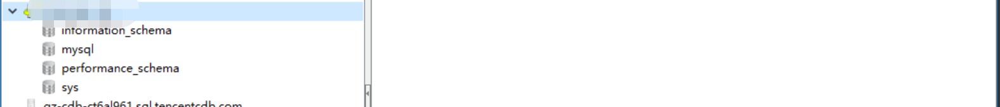
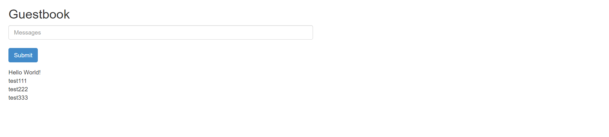
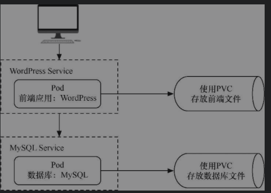
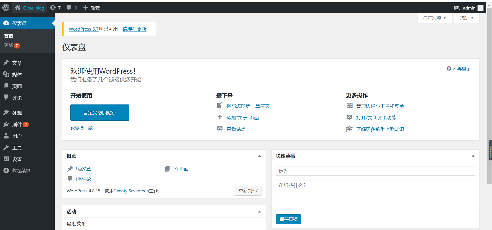

# Kubernetes实战案例


> 可以参考kubernetes的官方example中的例子

https://github.com/kubernetes/examples


## 1.kubernetes mysql 持久化实战

安装nfs服务器，将nfs服务器的`/data/mysql_nfs`路径进行共享。

这里nfs服务器地址为：`192.168.1.40`

### 1.1  创建mysql的namespaces

`mysql-namespaces.yaml`

```
apiVersion: v1
kind: Namespace
metadata:
  name: mysql
```


### 1.2  创建pv

`mysql-pv.yaml`

```
apiVersion: v1
kind: PersistentVolume
metadata:
  name: mysql-data
  namespace: mysql
spec:
  capacity:
    storage: 2Gi
  accessModes:
  - ReadWriteMany
  nfs:
    path: /data      #nfs共享目录
    server: 192.168.186.129     #nfs服务器地址
  persistentVolumeReclaimPolicy: Recycle
  storageClassName: nfs
```


### 1.3  创建pvc

`mysql-pvc.yaml`

```
kind: PersistentVolumeClaim
apiVersion: v1
metadata:
  name: mysql-data
  namespace: mysql
spec:
  accessModes:
    - ReadWriteMany
  resources:
    requests:
      storage: 2Gi
  storageClassName: nfs
```


### 1.4  创建ConfigMap

`mysql-cm.yaml`

```
apiVersion: v1
kind: ConfigMap
metadata:
  name: mysql-config-sre
  namespace: mysql
data:
  mysqld.cnf: |
        [mysqld]
        pid-file        = /var/run/mysqld/mysqld.pid
        socket          = /var/run/mysqld/mysqld.sock
        datadir         = /var/lib/mysql
        log-error      = /var/log/mysql/error.log
        bind-address   = 0.0.0.0
        # Disabling symbolic-links is recommended to prevent assorted security risks
        symbolic-links=0
        max_connections=1000
        default_storage_engine=innodb
        skip_external_locking
        lower_case_table_names=1
        skip_host_cache
        skip_name_resolve
        character_set_server=utf8
        sql_mode='STRICT_TRANS_TABLES,NO_ZERO_IN_DATE,ERROR_FOR_DIVISION_BY_ZERO,NO_AUTO_CREATE_USER,NO_ENGINE_SUBSTITUTION'
```


### 1.5  创建mysql deployment

`mysql-deployment.yaml`

```
apiVersion: apps/v1
kind: Deployment
metadata:
  name: mysql
  namespace: mysql
  labels:
    app: mysql
spec:
  replicas: 1
  selector:
    matchLabels:
      app: mysql
  template:
    metadata:
      labels:
        app: mysql
    spec:
      containers:
        - name: mysql
          image: registry.cn-hangzhou.aliyuncs.com/bzvs/mysql5.7:latest
          ports:
            - containerPort: 3306
              protocol: TCP
          env:
            - name: MYSQL_ROOT_PASSWORD
              value: "123456"
          volumeMounts:
            - name: mysql-data
              mountPath: /var/lib/mysql
            - name: mysql-config
              mountPath: /etc/mysql/conf.d/
      volumes:
        - name: mysql-data
          persistentVolumeClaim:
            claimName: mysql-data
        - name: mysql-config
          configMap:
            name: mysql-config-sre

---
apiVersion: v1
kind: Service
metadata:
  name: mysql
  namespace: mysql
  labels:
    app: mysql
spec:
  type: NodePort
  selector:
    app: mysql
  ports:
    - protocol: TCP
      port: 3306
      targetPort: 3306
      nodePort: 30006
```


> 注意nfs服务器上需要开启rpcbind服务

```
systemctl enable rpcbind
systemctl start rpcbind
systemctl start nfs-server
```

依次创建命令

```
kubectl create -f mysql-namespaces.yaml
kubectl create -f mysql-pv.yaml
kubectl create -f mysql-pvc.yaml
kubectl create -f mysql-cm.yaml
kubectl create -f mysql-deployment.yaml
```

查看结果

```
[root@ci-base k8s-example]# kubectl get ns
NAME                   STATUS   AGE
mysql                  Active   17s


[root@ci-base k8s-example]# kubectl get pv -n mysql
NAME         CAPACITY   ACCESS MODES   RECLAIM POLICY   STATUS      CLAIM   STORAGECLASS   REASON   AGE
mysql-data   2Gi        RWX            Recycle          Available           nfs                     17s

[root@ci-base k8s-example]# kubectl get pvc -n mysql

NAME         STATUS   VOLUME       CAPACITY   ACCESS MODES   STORAGECLASS   AGE
mysql-data   Bound    mysql-data   2Gi        RWX            nfs            8s

[root@ci-base k8s-example]# kubectl get cm -n mysql
NAME               DATA   AGE
mysql-config-sre   1      14s

[root@ci-base k8s-example]# kubectl get pod,svc -n mysql
NAME                         READY   STATUS    RESTARTS   AGE
pod/mysql-565b7cd487-hw5lc   1/1     Running   0          8m20s

NAME            TYPE       CLUSTER-IP     EXTERNAL-IP   PORT(S)          AGE
service/mysql   NodePort   10.98.67.121   <none>        3306:30006/TCP   8m11s
```

### 1.6  测试mysql连接是否正常




## 2.部署群集应用 lnmp平台

### 2.1 创建namespace

`namespace.yaml`

```
apiVersion: v1
kind: Namespace
metadata:
  name: lnmp
```


### 2.2 创建pv,pvc

`pv.yaml`

```
apiVersion: v1
kind: PersistentVolume
metadata:
  name: mysql-pv
  namespace: lnmp
spec:
  capacity:
    storage: 5Gi
  accessModes:
    - ReadWriteMany
  nfs:
    path: /data/nfs/mysql
    server: 192.168.1.40
---
apiVersion: v1
kind: PersistentVolume
metadata:
  name: wp-pv-one
  namespace: lnmp
spec:
  capacity:
    storage: 2Gi
  accessModes:
    - ReadWriteMany
  nfs:
    path: /data/nfs/data
    server: 192.168.1.40
---
apiVersion: v1
kind: PersistentVolume
metadata:
  name: wp-pv-two
  namespace: lnmp
spec:
  capacity:
    storage: 2Gi
  accessModes:
    - ReadWriteMany
  nfs:
    path: /data/nfs/data
    server: 192.168.1.40

```

`pvc.yaml`

```
---
apiVersion: v1
kind: PersistentVolumeClaim
metadata:
  name: mysql-pv-claim
  namespace: lnmp
  labels:
    app: wordpress
spec:
  accessModes:
    - ReadWriteMany
  resources:
    requests:
      storage: 5Gi

---
apiVersion: v1
kind: PersistentVolumeClaim
metadata:
  name: wp-pv-one
  namespace: lnmp
  labels:
    app: wordpress
spec:
  accessModes:
    - ReadWriteMany
  resources:
    requests:
      storage: 2Gi

---
apiVersion: v1
kind: PersistentVolumeClaim
metadata:
  name: wp-pv-two
  namespace: lnmp
  labels:
    app: wordpress
spec:
  accessModes:
    - ReadWriteMany
  resources:
    requests:
      storage: 2Gi
```


### 2.3 创建svc，deployment

`mysql-deployment.yaml`

```
---
apiVersion: v1
data:
  password: MTIzNDU2      # pass 123456
kind: Secret
metadata:
  managedFields:
    - apiVersion: v1
      fieldsType: FieldsV1
  name: mysql-pass
  namespace: lnmp
type: Opaque


---
apiVersion: v1
kind: Service
metadata:
  name: wordpress-mysql
  namespace: lnmp
  labels:
    app: wordpress
spec:
  ports:
    - port: 3306
  selector:
    app: wordpress
    tier: mysql

---
apiVersion: apps/v1
kind: Deployment
metadata:
  name: wordpress-mysql
  namespace: lnmp
  labels:
    app: wordpress
spec:
  selector:
    matchLabels:
      app: wordpress
      tier: mysql
  strategy:
    type: Recreate
  template:
    metadata:
      labels:
        app: wordpress
        tier: mysql
    spec:
      containers:
      - name: mysql
        image: mysql:5.6
        env:
        - name: MYSQL_ROOT_PASSWORD
          valueFrom:
            secretKeyRef:
              name: mysql-pass
              key: password
        ports:
        - containerPort: 3306
          name: mysql
        volumeMounts:
        - name: mysql-persistent-storage
          mountPath: /var/lib/mysql
      volumes:
      - name: mysql-persistent-storage
        persistentVolumeClaim:
          claimName: mysql-pv-claim
```

`php-deployment.yaml`

```
apiVersion: v1
kind: Service
metadata:
  name: wordpress-php
  namespace: lnmp
  labels:
    app: wordpress
spec:
  ports:
    - port: 9000
  selector:
    app: wordpress-php
    tier: frontend

---
apiVersion: apps/v1 # for versions before 1.8.0 use apps/v1beta1
kind: Deployment
metadata:
  name: wordpress-php
  namespace: lnmp
  labels:
    app: wordpress
spec:
  replicas: 3
  selector:
    matchLabels:
      app: wordpress-php
      tier: frontend
  strategy:
    type: Recreate
  template:
    metadata:
      labels:
        app: wordpress-php
        tier: frontend
    spec:
      containers:
      - name: php
        image: registry.cn-hangzhou.aliyuncs.com/balloon/php56:latest
        ports:
        - containerPort: 9000
          name: wordpress
        volumeMounts:
        - name: wordpress-persistent-storage
          mountPath: /var/www/html
      imagePullSecrets:
        - name: registrypullsecret
      volumes:
      - name: wordpress-persistent-storage
        persistentVolumeClaim:
          claimName: wp-pv-one
```


`nginx-deployment.yaml`

nginx的配置使用cm的方式进行配置

```
---
apiVersion: v1
kind: ConfigMap
metadata:
  name: nginx-wp-config
  namespace: lnmp
data:
  site.conf: |-
    server {
        listen 80;
        server_name localhost;
        root html;
        index index.html index.php;

        location ~ \.php$ {
            root html;
            fastcgi_pass wordpress-php:9000;
            fastcgi_param SCRIPT_FILENAME $document_root$fastcgi_script_name;
            include fastcgi_params;
            fastcgi_connect_timeout 60s;
            fastcgi_read_timeout 300s;
            fastcgi_send_timeout 300s;
        }
    }

---
apiVersion: v1
kind: Service
metadata:
  name: wordpress-nginx
  namespace: lnmp
  labels:
    app: wordpress
spec:
  ports:
    - port: 80
  selector:
    app: wordpress-nginx
    tier: frontend
  type: NodePort
  sessionAffinity: ClientIP

---
apiVersion: apps/v1
kind: Deployment
metadata:
  name: wordpress-nginx
  namespace: lnmp
  labels:
    app: wordpress
spec:
  replicas: 3
  selector:
    matchLabels:
      app: wordpress-nginx
      tier: frontend
  strategy:
    type: Recreate
  template:
    metadata:
      labels:
        app: wordpress-nginx
        tier: frontend
    spec:
      containers:
      - name: nginx
        image: registry.cn-hangzhou.aliyuncs.com/devops_hu/nginx:none-cfg
        imagePullPolicy: IfNotPresent
        ports:
        - containerPort: 80
          name: wordpress
        volumeMounts:
        - name: wordpress-persistent-storage
          mountPath: /usr/local/nginx/html
        - name: config
          mountPath: /usr/local/nginx/conf/vhost/site.conf
          subPath: site.conf
      volumes:
      - name: wordpress-persistent-storage
        persistentVolumeClaim:
          claimName: wp-pv-two
      - name: config
        configMap:
          name: nginx-wp-config
```

### 2.4 创建Ingress

`ingress.yaml`

```
apiVersion: networking.k8s.io/v1beta1
kind: Ingress
metadata:
  name: ingress-lnmp
  namespace: lnmp

spec:
  rules:
    - host: lnmp.linux.com     #测试域名
      http:
        paths:
          - backend:
              serviceName: wordpress-nginx
              servicePort: 80
```

在`/data/nfs/data`下创建index.html文件，如下：

```
[root@jenkins data]# echo "<h1>hello nginxtouch index.html</h1>" > index.html
[root@jenkins data]# cat index.html
<h1>hello nginxtouch index.html</h1>
```

网页访问如下：


其他参考文献：

https://github.com/donxan/k8s_lnmp_discuzx

https://blog.51cto.com/m51cto/2344819


## 3.无状态项目的部署案例

本节将演示如何用Kubernetes来部署无状态的多层Web应用程序——Guestbook。

该应用程序是一个简单的留言板程序，包含以下3个部分，并拥有读写分离机制。


□前端应用：Guestbook的留言板应用，将部署多个实例以供用户访问。

□后端存储（写）：Redis主应用，用于写入留言信息，只部署一个实例。

□后端存储（读）：Redis从属应用，用于读取留言信息，将部署多个实例。


### 3.1 创建namespace

```
[root@ci-base no_status]# kubectl create ns dev
namespace/dev created
```

### 3.2 创建redis-master

`redis-master.deployment.yml`

```
apiVersion: apps/v1
kind: Deployment
metadata:
  name: redis-master
  labels:
    app: redis
  namespace: dev

spec:
  selector:
    matchLabels:
      app: redis
      role: master
      tier: backend
  replicas: 1
  template:
    metadata:
      labels:
        app: redis
        role: master
        tier: backend
    spec:
      containers:
        - name: master
          image: kubeguide/redis-master
          resources:
            requests:
              cpu: 100m
              memory: 100Mi
          ports:
            - containerPort: 6379

```

这个模板中使用了Redis镜像，并将作为主存储使用，其实例数量为1。应用模板后，Redis主实例的Pod状态

```
[root@ci-base no_status]# kubectl create -f redis-master.deployment.yml
deployment.apps/redis-master created

[root@ci-base no_status]# kubectl get pod -n dev
NAME                            READY   STATUS    RESTARTS   AGE
redis-master-598bcbf4f7-4qk6h   1/1     Running   0          17s

[root@ci-base no_status]# kubectl get deployment -n dev
```


Redis-Master Pod创建完毕后，需要为其创建Service，以便前端应用可以调用它来存储数据，以及从属应用可以从中同步数据。接下来，创建一个名为`redis-master.service.yml`的文件


`redis-master.service.yml`

```
apiVersion: v1
kind: Service
metadata:
  name: redis-master
  labels:
    app: redis
    role: master
    tier: backend
  namespace: dev
spec:
  ports:
    - port: 6379
      targetPort: 6379
  selector:
    app: redis
    role: master
    tier: backend
```


```
[root@ci-base no_status]# kubectl create -f redis-master.service.yml
service/redis-master created
```


这个模板通过标签引用了Redis的Pod，并为其创建了类型为ClusterIP的Service。应用模板后，Redis主实例的Service状态

```
[root@ci-base no_status]# kubectl get svc -n dev
NAME           TYPE        CLUSTER-IP      EXTERNAL-IP   PORT(S)    AGE
redis-master   ClusterIP   10.98.208.133   <none>        6379/TCP   30s

[root@ci-base no_status]# kubectl get ep -n dev
NAME           ENDPOINTS            AGE
redis-master   10.244.77.226:6379   39s

[root@ci-base no_status]# kubectl get pod -n dev -o wide
NAME                            READY   STATUS    RESTARTS   AGE     IP              NODE     NOMINATED NODE   READINESS GATES
redis-master-598bcbf4f7-4qk6h   1/1     Running   0          4m14s   10.244.77.226   k8s-w9   <none>           <none>
```

### 3.3 创建redis-slave

虽然Redis主实例是单个容器，但是可以添加Redis从属实例来增加其负载能力。接下来，部署Redis从属应用，并为其指定两个实例。创建一个名为`redis-slave.deployment.yml`的文件，

```
apiVersion: apps/v1
kind: Deployment
metadata:
  name: redis-slave
  labels:
    app: redis
  namespace: dev

spec:
  selector:
    matchLabels:
      app: redis
      role: slave
      tier: backend
  replicas: 2
  template:
    metadata:
      labels:
        app: redis
        role: slave
        tier: backend
    spec:
      containers:
        - name: slave
          image: kubeguide/guestbook-redis-slave
          resources:
            requests:
              cpu: 100m
              memory: 100Mi
          env:
            - name: GET_HOSTS_FROM
              value: dns
          ports:
            - containerPort: 6379


```


这个模板使用了Redis从属镜像，其实例数量为2，后续可根据访问的负载情况随时调整实例数量。

该模板通过两个环境变量name: GET_HOSTS_FROM和value: dns自动从中解析出Redis主实例的地址并加以引用。应用模板后，Redis从属实例的Pod状态

```

[root@ci-base no_status]# kubectl apply -f redis-slave.deployment.yml
deployment.apps/redis-slave created

[root@ci-base no_status]# kubectl get pod -n dev|grep redis-slave
redis-slave-df7466bc9-dnqpm     1/1     Running   0          8s
redis-slave-df7466bc9-trw8p     1/1     Running   0          8s

[root@ci-base no_status]# kubectl get deploy -n dev|grep redis-slave
redis-slave    2/2     2            2           49s

```

Redis-Slave Pod创建完毕后，需要为其创建Service，以便前端应用可以调用它来读取数据。

接下来，创建一个名为`redis-slave.service.yml`的文件，在文件中填入以下内容并保存。

```
apiVersion: v1
kind: Service
metadata:
  name: redis-slave
  labels:
    app: redis
    role: slave
    tier: backend
  namespace: dev
spec:
  ports:
    - port: 6379
  selector:
    app: redis
```


应用模板

```
[root@ci-base no_status]# kubectl apply -f redis-slave.service.yml
service/redis-slave created

[root@ci-base no_status]# kubectl get svc -n dev|grep redis-slave
redis-slave    ClusterIP   10.102.11.78    <none>        6379/TCP   34s

[root@ci-base no_status]# kubectl get ep -n dev|grep redis-slave
redis-slave    10.244.77.226:6379,10.244.77.227:6379,10.244.77.228:6379   42s

[root@ci-base no_status]# kubectl get pod -n dev -o wide
NAME                            READY   STATUS    RESTARTS   AGE     IP              NODE     NOMINATED NODE   READINESS GATES
redis-master-598bcbf4f7-4qk6h   1/1     Running   0          12m     10.244.77.226   k8s-w9   <none>           <none>
redis-slave-df7466bc9-dnqpm     1/1     Running   0          4m24s   10.244.77.227   k8s-w9   <none>           <none>
redis-slave-df7466bc9-trw8p     1/1     Running   0          4m24s   10.244.77.228   k8s-w9   <none>           <none>
[root@ci-base no_status]# kubectl get svc -n dev
NAME           TYPE        CLUSTER-IP      EXTERNAL-IP   PORT(S)    AGE
redis-master   ClusterIP   10.98.208.133   <none>        6379/TCP   9m18s
redis-slave    ClusterIP   10.102.11.78    <none>        6379/TCP   80s

```


### 3.4 创建frontend

Redis存储实例创建完毕后，就可以创建前端应用程序了。留言板应用程序是一个前端Web程序，基于PHP编写。该应用程序会连接到Redis主实例以执行写入请求，同时会连接到Redis从属实例以执行读取请求。

接下来创建一个名为`frontend.deployment.yml`的文件，在文件中填入以下内容并保存。


```
apiVersion: apps/v1
kind: Deployment
metadata:
  name: frontend
  labels:
    app: guestbook
  namespace: dev

spec:
  selector:
    matchLabels:
      app: guestbook
      tier: frontend
  replicas: 3
  template:
    metadata:
      labels:
        app: guestbook
        tier: frontend
    spec:
      containers:
        - name: php-redis
          image: kubeguide/guestbook-php-frontend
          resources:
            requests:
              cpu: 100m
              memory: 100Mi
          env:
            - name: GET_HOSTS_FROM
              value: dns
          ports:
            - containerPort: 80


```

这个模板使用了hjl-frontend:v3镜像，其实例数量为3，后续可根据所访问的负载情况随时调整实例数量。该模板通过两个环境变量name: GET_HOSTS_FROM和value: dns自动从中解析出Redis主实例和Redis从属实例的地址并引用。应用模板后，Guestbook实例Pod的状态如下

```
[root@ci-base no_status]# kubectl apply -f frontend.deployment.yml
deployment.apps/frontend created

[root@ci-base no_status]# kubectl get pod -n dev |grep frontend
frontend-78b47669f6-bc7v5       1/1     Running   0          99s
frontend-78b47669f6-qdscx       1/1     Running   0          99s
frontend-78b47669f6-t4m8d       1/1     Running   0          99s
```


最后，为前端留言板应用创建Service，这样就可以供用户访问了，因此，创建一个名为`frontend.service.yml`的文件，在文件中填入以下内容并保存。

```
apiVersion: v1
kind: Service
metadata:
  name: frontend
  labels:
    app: guestbook
    tier: frontend
  namespace: dev
spec:
  type: NodePort
  ports:
    - port: 80
      nodePort: 30001
  selector:
    app: guestbook
    tier: frontend
```

该模板通过NodePort类型的Service将服务提供给各个集群主机的30222端口，这样就可以在浏览器地址栏中输入“http://{主机IP}:30222”来访问留言板页面了。应用模板后，Guestbook实例的Service状态如下

```
[root@ci-base no_status]# kubectl apply -f frontend.service.yml
service/frontend created

[root@ci-base no_status]# kubectl get svc -n dev |grep frontend
frontend       NodePort    10.99.34.225    <none>        80:30222/TCP   3s

[root@ci-base no_status]# kubectl get svc,pod,deploy -n dev
NAME                   TYPE        CLUSTER-IP       EXTERNAL-IP   PORT(S)        AGE
service/frontend       NodePort    10.97.7.208      <none>        80:30001/TCP   5m9s
service/redis-master   ClusterIP   10.106.240.32    <none>        6379/TCP       5m8s
service/redis-slave    ClusterIP   10.107.166.193   <none>        6379/TCP       5m8s

NAME                               READY   STATUS    RESTARTS   AGE
pod/frontend-58f67d657c-ctgwb      1/1     Running   0          5m9s
pod/frontend-58f67d657c-g6d6r      1/1     Running   0          5m9s
pod/frontend-58f67d657c-jvzrb      1/1     Running   0          5m9s
pod/redis-master-c55488447-xz5z9   1/1     Running   0          5m8s
pod/redis-slave-67456bdf78-b67cs   1/1     Running   0          5m8s
pod/redis-slave-67456bdf78-dd4pn   1/1     Running   0          5m8s

NAME                           READY   UP-TO-DATE   AVAILABLE   AGE
deployment.apps/frontend       3/3     3            3           5m9s
deployment.apps/redis-master   1/1     1            1           5m9s
deployment.apps/redis-slave    2/2     2            2           5m8s
```

### 3.5 验证测试

接下来，就可以在URL中输入地址访问留言板应用了。在本例中地址为http://192.168.xx.xx:30001，进入页面后在文本框中输入文字，然后单击Submit按钮，留言将自动显示在页面下方。




## 4. 有状态项目的部署案例

WordPress是使用PHP语言开发的开源的个人博客平台，是一套非常完善的内容管理系统，支持非常丰富的插件和模板。


WordPress包含以下两个部分。

□前端应用：WordPress博客前端应用，拥有各种操作界面以供给用户访问。它使用PVC来存储博客网页等文件。

□数据库：MySQL数据库，用于存储该博客的内容数据。它使用PVC来存储博客内容等数据。

WordPress的整体结构与各部分之间的交互如下图：



因为本例中涉及数据库，所以需要设置一个MySQL初始密码，WordPress在引用数据库时也会用到该密码。可以定义一个Secret来存储密码。

### 4.1 创建namespace

```
[root@ci-base no_status]# kubectl create ns dev
namespace/dev created
```


### 4.2 创建mysql的Secret

本例中将数据库初始密码设置为“abc123456”。首先，执行以下命令，对密码字符串进行base64编码。

```
[root@ci-base set_status]# echo -n "abc123456"|base64
YWJjMTIzNDU2
```

然后，创建`mysql-pass.yml`文件，在文件中填入以下内容并保存，其中password字段使用了刚才编码后的内容。

```
apiVersion: v1
kind: Secret
metadata:
  name: mysql-pass
  namespace: dev

type: Opaque
data:
  password: YWJjMTIzNDU2
```


### 4.3 创建mysql-deployment

接下来，部署WordPress将会用到的MySQL数据库。创建`mysql-deployment.yml`文件，在文件中填入以下内容并保存。

```
apiVersion: v1
kind: Service
metadata:
  name: wordpress-mysql
  labels:
    app: wordpress
  namespace: dev
spec:
  ports:
    - port: 3306
  selector:
    app: wordpress
    tier: mysql
  clusterIP: None
---
apiVersion: v1
kind: PersistentVolumeClaim
metadata:
  name: mysql-pv-claim
  labels:
    app: wordpress
  namespace: dev
spec:
  accessModes:
    - ReadWriteOnce
  storageClassName: "managed-nfs-storage"
  resources:
    requests:
      storage: 10Gi
---
apiVersion: apps/v1 # for k8s versions before 1.9.0 use apps/v1beta2  and before 1.8.0 use extensions/v1beta1
kind: Deployment
metadata:
  name: wordpress-mysql
  labels:
    app: wordpress
  namespace: dev
spec:
  selector:
    matchLabels:
      app: wordpress
      tier: mysql
  strategy:
    type: Recreate
  template:
    metadata:
      labels:
        app: wordpress
        tier: mysql
    spec:
      containers:
        - image: mysql:5.6
          name: mysql
          env:
            - name: MYSQL_ROOT_PASSWORD
              valueFrom:
                secretKeyRef:
                  name: mysql-pass
                  key: password
          livenessProbe:
            tcpSocket:
              port: 3306
          ports:
            - containerPort: 3306
              name: mysql
          volumeMounts:
            - name: mysql-persistent-storage
              mountPath: /var/lib/mysql
      volumes:
        - name: mysql-persistent-storage
          persistentVolumeClaim:
            claimName: mysql-pv-claim
```

这个模板包含4个部分。首先，定义一个无头Service，用于提供MySQL服务。然后，定义一个10GiB的PVC以供MySQL存放数据库文件，这里使用了managed-nfs-storage的StorageClass，以便自动为PVC创建PV。

接下来，定义单实例的Deployment控制器，其镜像为mysql，该实例引用了刚才创建的Secret，以便初始化数据库密码。最后，引用模板中定义的PVC，映射路径为/var/lib/mysql以存放数据库文件。


应用模板后，MySQL实例的状态如

```
[root@ci-base set_status]# ll
total 12
drwxr-xr-x 17 root root 4096 Apr  8 15:00 external-storage
-rw-r--r--  1 root root  119 Apr  8 14:55 mysql-pass.yml
-rw-r--r--  1 root root 1501 Apr  8 15:35 wordpress-mysql.yml
[root@ci-base set_status]# kubectl apply -f .


[root@ci-base set_status]# kubectl get deployment,pod,pvc,svc -n dev
NAME                              READY   UP-TO-DATE   AVAILABLE   AGE
deployment.apps/wordpress-mysql   1/1     1            1           2m34s

NAME                                   READY   STATUS    RESTARTS   AGE
pod/wordpress-mysql-5f4b68ff8f-tsk2l   1/1     Running   0          2m34s

NAME                                   STATUS   VOLUME                                     CAPACITY   ACCESS MODES   STORAGECLASS          AGE
persistentvolumeclaim/mysql-pv-claim   Bound    pvc-e310bfc0-62a9-4b52-a94f-366ad7868f41   10Gi       RWO            managed-nfs-storage   2m34s

NAME                      TYPE        CLUSTER-IP   EXTERNAL-IP   PORT(S)    AGE
service/wordpress-mysql   ClusterIP   None         <none>        3306/TCP   2m34s

```

### 4.4 创建wordpress-deployment

接下来，部署WordPress前端应用程序。该应用程序会引用之前创建的MySQL数据库，为用户提供博客管理功能。为了创建`wordpress-deployment.yml`文件，在文件中填入以下内容并保存。

```
apiVersion: v1
kind: Service
metadata:
  name: wordpress
  labels:
    app: wordpress
  namespace: dev
  
spec:
  ports:
    - port: 80
      nodePort: 30111
  selector:
    app: wordpress
    tier: frontend
  type: NodePort
---
apiVersion: v1
kind: PersistentVolumeClaim
metadata:
  name: wp-pv-claim
  labels:
    app: wordpress
  namespace: dev
  
spec:
  storageClassName: "managed-nfs-storage"
  accessModes:
    - ReadWriteOnce
  resources:
    requests:
      storage: 2Gi
---
apiVersion: apps/v1 #  for k8s versions before 1.9.0 use apps/v1beta2  and before 1.8.0 use extensions/v1beta1
kind: Deployment
metadata:
  name: wordpress
  labels:
    app: wordpress
  namespace: dev
  
spec:
  selector:
    matchLabels:
      app: wordpress
      tier: frontend
  strategy:
    type: Recreate
  template:
    metadata:
      labels:
        app: wordpress
        tier: frontend
    spec:
      containers:
      - image: wordpress:4.8-apache
        name: wordpress
        env:
        - name: WORDPRESS_DB_HOST
          value: wordpress-mysql
        - name: WORDPRESS_DB_PASSWORD
          valueFrom:
            secretKeyRef:
              name: mysql-pass
              key: password
        ports:
        - containerPort: 80
          name: wordpress
        volumeMounts:
        - name: wordpress-persistent-storage
          mountPath: /var/www/html
      volumes:
      - name: wordpress-persistent-storage
        persistentVolumeClaim:
          claimName: wp-pv-claim
```


这个模板包含3个部分。首先，定义的NodePort类型的Service将WordPress入口提供给各个集群主机的30111端口，这样在浏览器地址栏中输入http://{主机IP}:30111就可以访问留言板页面了。

然后，定义一个2GiB的PVC用于供WordPress存放博客、网页等文件，这里使用了前几章定义的StorageClass，以便自动为PVC创建PV。

最后，定义单实例的Deployment，其镜像为wordpress，该实例通过WORDPRESS_DB_HOST环境变量引用刚才定义的MySQL服务的名称。接下来，该实例通过WORDPRESS_DB_PASSWORD环境变量引用数据库密码，以便WordPress服务访问数据库，并引用模板中定义的PVC（映射路径为/var/www/html），以存放网页等文件。


应用模板后，WordPress实例的状态如图

```
[root@ci-base set_status]# kubectl apply -f .

[root@ci-base set_status]# kubectl get deployment,pod,pvc,svc -n dev
NAME                              READY   UP-TO-DATE   AVAILABLE   AGE
deployment.apps/wordpress         1/1     1            1           104s
deployment.apps/wordpress-mysql   1/1     1            1           105s

NAME                                   READY   STATUS    RESTARTS   AGE
pod/wordpress-6857459697-5ndgd         1/1     Running   0          104s
pod/wordpress-mysql-5f4b68ff8f-c7zdj   1/1     Running   0          105s

NAME                                   STATUS   VOLUME                                     CAPACITY   ACCESS MODES   STORAGECLASS          AGE
persistentvolumeclaim/mysql-pv-claim   Bound    pvc-83a89cc1-3cdb-4268-856e-68264e9b03de   10Gi       RWO            managed-nfs-storage   105s
persistentvolumeclaim/wp-pv-claim      Bound    pvc-cfa237f8-fdbd-4932-b8c9-1ce6b5dca3ae   2Gi        RWO            managed-nfs-storage   105s

NAME                      TYPE        CLUSTER-IP     EXTERNAL-IP   PORT(S)        AGE
service/wordpress         NodePort    10.107.67.69   <none>        80:30111/TCP   105s
service/wordpress-mysql   ClusterIP   None           <none>        3306/TCP       105s

```

### 4.5 验证测试

接下来，就可以在URL中输入地址访问WordPress应用了，在本例中地址为http://192.168.1.xxx:30111。之后会进入初始界面，如图11-13所示，选择“简体中文”，然后单击“继续”按钮。


接着，设置初始账号和密码，并使用它们进行登录。之后，就会进入WordPress操作界面



接下来，就可以尽情使用WordPress了。

