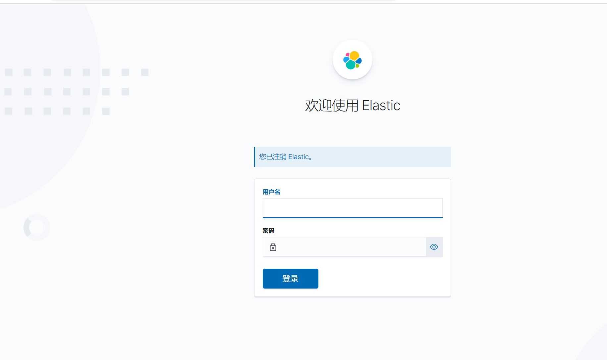
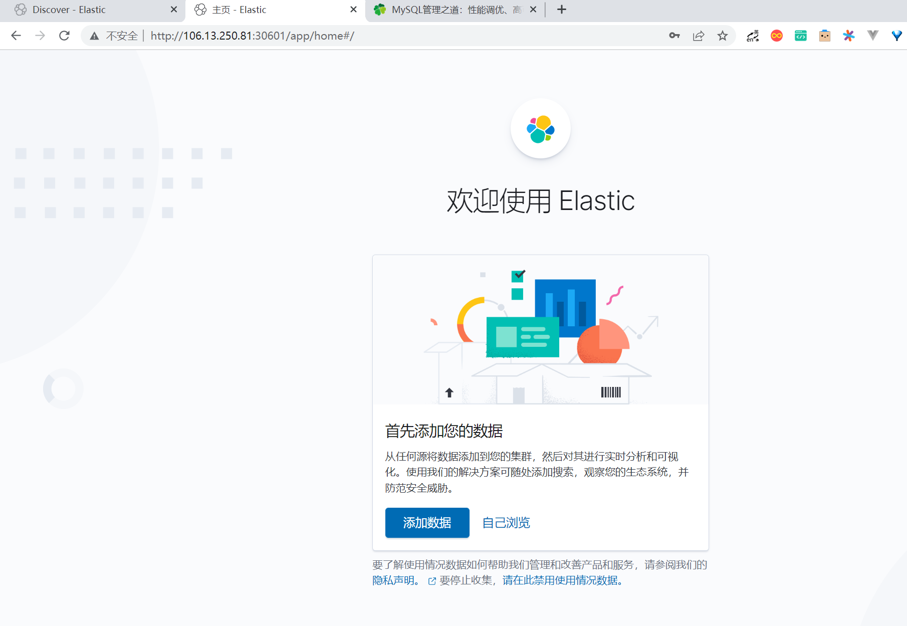
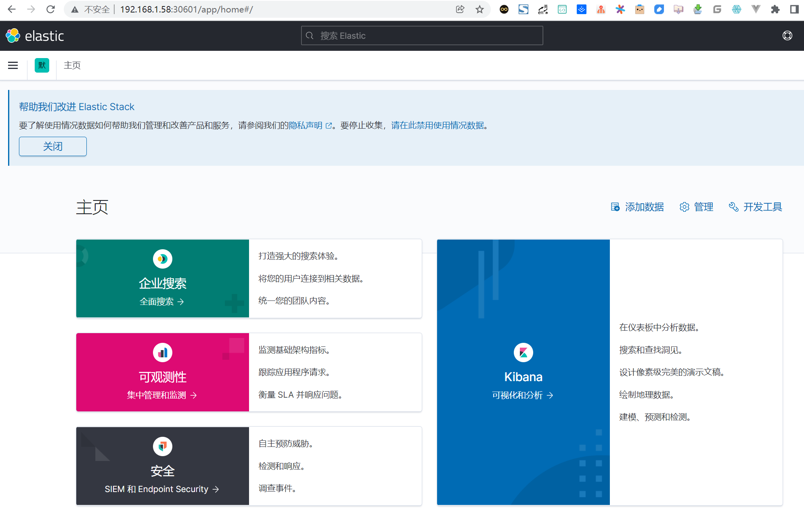
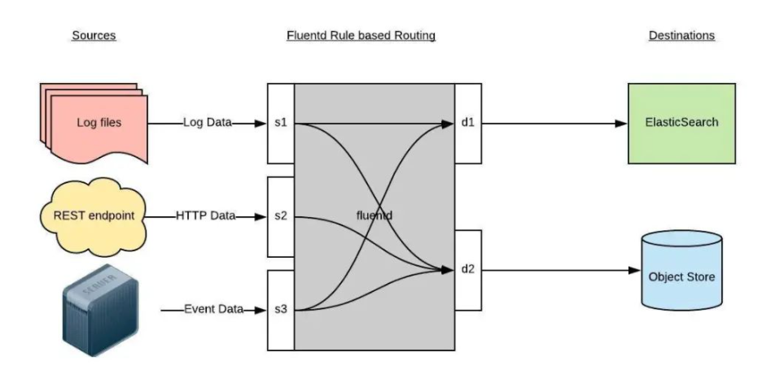
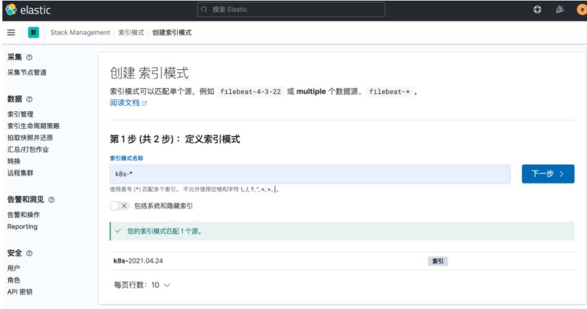

# 使用EFKLK搭建Kubernetes日志收集工具栈


`Elasticsearch` 是一个实时的、分布式的可扩展的搜索引擎，允许进行全文、结构化搜索，它通常用于索引和搜索大量日志数据，也可用于搜索许多不同类型的文档。

Elasticsearch 通常与 `Kibana` 一起部署，Kibana 是 Elasticsearch 的一个功能强大的数据可视化 Dashboard，Kibana 允许你通过 web 界面来浏览 Elasticsearch 日志数据。

`Fluentd`是一个流行的开源数据收集器，我们将在 Kubernetes 集群节点上安装 Fluentd，通过获取容器日志文件、过滤和转换日志数据，然后将数据传递到 Elasticsearch 集群，在该集群中对其进行索引和存储。

我们先来配置启动一个可扩展的 Elasticsearch 集群，然后在 Kubernetes 集群中创建一个 Kibana 应用，最后通过 DaemonSet 来运行 Fluentd，以便它在每个 Kubernetes 工作节点上都可以运行一个 Pod。


>如果你了解 EFK 的基本原理，只是为了测试可以直接使用 Kubernetes 官方提供的 addon 插件的资源清单，
>
>地址：https://github.com/kubernetes/kubernetes/blob/master/cluster/addons/fluentd-elasticsearch/，直接安装即可。


## 1. 安装 Elasticsearch 集群

在创建 Elasticsearch 集群之前，我们先创建一个命名空间，我们将在其中安装所有日志相关的资源对象。

```
kubectl create ns logging
```

### 1.1 环境准备

ElasticSearch 安装有最低安装要求，如果安装后 Pod 无法正常启动，请检查是否符合最低要求的配置，要求如下：

| 节点名称      | 节点类型 | CPU 配置 | Memory 配置 |
| ------------- | :------: | :------: | :---------: |
| k8s-master    |  master  |    4C    |     4Gi     |
| k8s-node-2-12 |  worker  |    8C    |     8Gi     |
| k8s-node-2-13 |  worker  |    8C    |     8Gi     |
| k8s-node-2-14 |  worker  |    8C    |     8Gi     |

es集群要求

| ElasticSearch节点    | CPU最小要求 | Memory 最小要求 |
| -------------------- | :---------: | :-------------: |
| elasticsearch-master |    >2核     |      >2Gi       |
| elasticsearch-data   |    >1核     |      >2Gi       |
| elasticsearch-client |    >1核     |      >2Gi       |

这里我们要安装的 ES 集群环境信息如下所示：


| 集群名称    | 节点类型 | 副本数目 |存储大小|网络模式|描述|
| -------------------- | :---------: | :-------------: |:-------------: |:-------------: |-----------------------------|
| elasticsearch |    Master     |      3       | 5Gi  |  ClusterIP       |   主节点        |
| elasticsearch |    Data       |      3       | 50Gi |  ClusterIP       |   数据节点        |
| elasticsearch |    Client     |      2       | 无 |    NodePort         |  处理用户请求、转发  |


这里我们使用一个 NFS 类型的 StorageClass 来做持久化存储，当然如果你是线上环境建议使用 Local PV 或者 Ceph RBD 之类的存储来持久化 Elasticsearch 的数据。


**安装nfs-storageClass存储**

```
helm repo add azure http://mirror.azure.cn/kubernetes/charts/
helm repo update

# 或者下载到本地再安装
helm pull azure/nfs-client-provisioner
tar xvf nfs-client-provisioner-*.tgz

kubectl create ns nfs

helm install efk-nfs-storage -n nfs \
--set nfs.server=192.168.1.46 \
--set nfs.path=/efk  \
--set storageClass.name=efk-nfs,storageClass.reclaimPolicy=Retain \
--set storageClass.defaultClass=true \
nfs-client-provisioner
```


此外由于 ElasticSearch 7.x 版本默认安装了 `X-Pack` 插件，并且部分功能免费，需要我们配置一些安全证书文件。

**1、生成证书文件**

```
# 运行容器生成证书
$ docker run --name elastic-certs -i -w /app elasticsearch:7.12.0 /bin/sh -c  \
  "elasticsearch-certutil ca --out /app/elastic-stack-ca.p12 --pass '' && \
    elasticsearch-certutil cert --name security-master --dns \
    security-master --ca /app/elastic-stack-ca.p12 --pass '' --ca-pass '' --out /app/elastic-certificates.p12"
    
# 从容器中将生成的证书拷贝出来
$ docker cp elastic-certs:/app/elastic-certificates.p12 .

# 删除容器
$ docker rm -f elastic-certs

# 将 pcks12 中的信息分离出来，写入文件
$ openssl pkcs12 -nodes -passin pass:'' -in elastic-certificates.p12 -out elastic-certificate.pem
```


**2、添加证书到 Kubernetes**

```
# 添加证书
$ kubectl create secret -n logging generic elastic-certs --from-file=elastic-certificates.p12

# 设置集群用户名密码
$ kubectl create secret -n logging generic elastic-auth --from-literal=username=elastic --from-literal=password=oschina
```


### 1.2 安装ES集群

首先添加 ELastic 的 Helm 仓库：

```
helm repo add elastic https://helm.elastic.co
helm repo update
```


ElaticSearch 安装需要安装三次，分别安装 Master、Data、Client 节点，

- Master 节点负责集群间的管理工作；

- Data 节点负责存储数据；

- Client 节点负责代理 ElasticSearch Cluster 集群，负载均衡。

首先使用 `helm pull` 拉取 Chart 并解压：

```
helm pull elastic/elasticsearch --untar --version 7.12.0
cd elasticsearch
```

在 Chart 目录下面创建用于 Master 节点安装配置的 values 文件：

`values-master.yaml`

```
# values-master.yaml
## 设置集群名称
clusterName: "elasticsearch"
## 设置节点名称
nodeGroup: "master"

## 设置角色
roles:
  master: "true"
  ingest: "false"
  data: "false"

# ============镜像配置============
## 指定镜像与镜像版本
image: "elasticsearch"
imageTag: "7.12.0"
## 副本数
replicas: 3

# ============资源配置============
## JVM 配置参数
esJavaOpts: "-Xmx1g -Xms1g"
## 部署资源配置(生成环境一定要设置大些)
resources:
  requests:
    cpu: "2000m"
    memory: "2Gi"
  limits:
    cpu: "2000m"
    memory: "2Gi"
## 数据持久卷配置
persistence:
  enabled: true
## 存储数据大小配置
volumeClaimTemplate:
  storageClassName: nfs-storage
  accessModes: ["ReadWriteOnce"]
  resources:
    requests:
      storage: 50Gi

# ============安全配置============
## 设置协议，可配置为 http、https
protocol: http
## 证书挂载配置，这里我们挂入上面创建的证书
secretMounts:
  - name: elastic-certs
    secretName: elastic-certs
    path: /usr/share/elasticsearch/config/certs

## 允许您在/usr/share/elasticsearch/config/中添加任何自定义配置文件,例如 elasticsearch.yml
## ElasticSearch 7.x 默认安装了 x-pack 插件，部分功能免费，这里我们配置下
## 下面注掉的部分为配置 https 证书，配置此部分还需要配置 helm 参数 protocol 值改为 https
esConfig:
  elasticsearch.yml: |
    xpack.security.enabled: true
    xpack.security.transport.ssl.enabled: true
    xpack.security.transport.ssl.verification_mode: certificate
    xpack.security.transport.ssl.keystore.path: /usr/share/elasticsearch/config/certs/elastic-certificates.p12
    xpack.security.transport.ssl.truststore.path: /usr/share/elasticsearch/config/certs/elastic-certificates.p12
    # xpack.security.http.ssl.enabled: true
    # xpack.security.http.ssl.truststore.path: /usr/share/elasticsearch/config/certs/elastic-certificates.p12
    # xpack.security.http.ssl.keystore.path: /usr/share/elasticsearch/config/certs/elastic-certificates.p12
## 环境变量配置，这里引入上面设置的用户名、密码 secret 文件
extraEnvs:
  - name: ELASTIC_USERNAME
    valueFrom:
      secretKeyRef:
        name: elastic-auth
        key: username
  - name: ELASTIC_PASSWORD
    valueFrom:
      secretKeyRef:
        name: elastic-auth
        key: password

# ============调度配置============
## 设置调度策略
## - hard：只有当有足够的节点时 Pod 才会被调度，并且它们永远不会出现在同一个节点上
## - soft：尽最大努力调度
antiAffinity: "soft"
tolerations:
  - operator: "Exists" ##容忍全部污点
```


然后创建用于 Data 节点安装的 values 文件：

`values-data.yaml`

```
# values-data.yaml
# ============设置集群名称============
## 设置集群名称
clusterName: "elasticsearch"
## 设置节点名称
nodeGroup: "data"
## 设置角色
roles:
  master: "false"
  ingest: "true"
  data: "true"

# ============镜像配置============
## 指定镜像与镜像版本
image: "elasticsearch"
imageTag: "7.12.0"
## 副本数(建议设置为3，我这里资源不足只用了1个副本)
replicas: 1

# ============资源配置============
## JVM 配置参数
esJavaOpts: "-Xmx1g -Xms1g"
## 部署资源配置(生成环境一定要设置大些)
resources:
  requests:
    cpu: "1000m"
    memory: "2Gi"
  limits:
    cpu: "1000m"
    memory: "2Gi"
## 数据持久卷配置
persistence:
  enabled: true
## 存储数据大小配置
volumeClaimTemplate:
  storageClassName: nfs-storage
  accessModes: ["ReadWriteOnce"]
  resources:
    requests:
      storage: 200Gi

# ============安全配置============
## 设置协议，可配置为 http、https
protocol: http
## 证书挂载配置，这里我们挂入上面创建的证书
secretMounts:
  - name: elastic-certs
    secretName: elastic-certs
    path: /usr/share/elasticsearch/config/certs
## 允许您在/usr/share/elasticsearch/config/中添加任何自定义配置文件,例如 elasticsearch.yml
## ElasticSearch 7.x 默认安装了 x-pack 插件，部分功能免费，这里我们配置下
## 下面注掉的部分为配置 https 证书，配置此部分还需要配置 helm 参数 protocol 值改为 https
esConfig:
  elasticsearch.yml: |
    xpack.security.enabled: true
    xpack.security.transport.ssl.enabled: true
    xpack.security.transport.ssl.verification_mode: certificate
    xpack.security.transport.ssl.keystore.path: /usr/share/elasticsearch/config/certs/elastic-certificates.p12
    xpack.security.transport.ssl.truststore.path: /usr/share/elasticsearch/config/certs/elastic-certificates.p12
    # xpack.security.http.ssl.enabled: true
    # xpack.security.http.ssl.truststore.path: /usr/share/elasticsearch/config/certs/elastic-certificates.p12
    # xpack.security.http.ssl.keystore.path: /usr/share/elasticsearch/config/certs/elastic-certificates.p12
## 环境变量配置，这里引入上面设置的用户名、密码 secret 文件
extraEnvs:
  - name: ELASTIC_USERNAME
    valueFrom:
      secretKeyRef:
        name: elastic-auth
        key: username
  - name: ELASTIC_PASSWORD
    valueFrom:
      secretKeyRef:
        name: elastic-auth
        key: password

# ============调度配置============
## 设置调度策略
## - hard：只有当有足够的节点时 Pod 才会被调度，并且它们永远不会出现在同一个节点上
## - soft：尽最大努力调度
antiAffinity: "soft"
## 容忍配置
tolerations:
  - operator: "Exists" ##容忍全部污点
```

最后一个是用于创建 Client 节点的 values 文件：

`values-client.yaml`

```
# values-client.yaml
# ============设置集群名称============
## 设置集群名称
clusterName: "elasticsearch"
## 设置节点名称
nodeGroup: "client"
## 设置角色
roles:
  master: "false"
  ingest: "false"
  data: "false"

# ============镜像配置============
## 指定镜像与镜像版本
image: "elasticsearch"
imageTag: "7.12.0"
## 副本数
replicas: 1

# ============资源配置============
## JVM 配置参数
esJavaOpts: "-Xmx1g -Xms1g"
## 部署资源配置(生成环境一定要设置大些)
resources:
  requests:
    cpu: "1000m"
    memory: "1Gi"
  limits:
    cpu: "1000m"
    memory: "2Gi"
## 数据持久卷配置
persistence:
  enabled: false

# ============安全配置============
## 设置协议，可配置为 http、https
protocol: http
## 证书挂载配置，这里我们挂入上面创建的证书
secretMounts:
  - name: elastic-certs
    secretName: elastic-certs
    path: /usr/share/elasticsearch/config/certs
## 允许您在/usr/share/elasticsearch/config/中添加任何自定义配置文件,例如 elasticsearch.yml
## ElasticSearch 7.x 默认安装了 x-pack 插件，部分功能免费，这里我们配置下
## 下面注掉的部分为配置 https 证书，配置此部分还需要配置 helm 参数 protocol 值改为 https
esConfig:
  elasticsearch.yml: |
    xpack.security.enabled: true
    xpack.security.transport.ssl.enabled: true
    xpack.security.transport.ssl.verification_mode: certificate
    xpack.security.transport.ssl.keystore.path: /usr/share/elasticsearch/config/certs/elastic-certificates.p12
    xpack.security.transport.ssl.truststore.path: /usr/share/elasticsearch/config/certs/elastic-certificates.p12
    # xpack.security.http.ssl.enabled: true
    # xpack.security.http.ssl.truststore.path: /usr/share/elasticsearch/config/certs/elastic-certificates.p12
    # xpack.security.http.ssl.keystore.path: /usr/share/elasticsearch/config/certs/elastic-certificates.p12
## 环境变量配置，这里引入上面设置的用户名、密码 secret 文件
extraEnvs:
  - name: ELASTIC_USERNAME
    valueFrom:
      secretKeyRef:
        name: elastic-auth
        key: username
  - name: ELASTIC_PASSWORD
    valueFrom:
      secretKeyRef:
        name: elastic-auth
        key: password

# ============Service 配置============
service:
  type: NodePort
  nodePort: "30200"
```

现在用上面的 values 文件来安装：

```
# 安装 master 节点
helm install es-master -f values-master.yaml --namespace logging .

# 安装 data 节点
helm install es-data -f values-data.yaml --namespace logging .

# 安装 client 节点
helm install es-client -f values-client.yaml --namespace logging .
```


## 2. 安装Kibana

Elasticsearch 集群安装完成后接下来配置安装 Kibana

使用 `helm pull` 命令拉取 Kibana Chart 包并解压：

```
helm pull elastic/kibana --untar --version 7.12.0
cd kibana
```

创建用于安装 Kibana 的 values 文件：

`values-prod.yaml`

```
# values-prod.yaml
## 指定镜像与镜像版本
image: "kibana"
imageTag: "7.12.0"

## 配置 ElasticSearch 地址
elasticsearchHosts: "http://elasticsearch-client:9200"

# ============环境变量配置============
## 环境变量配置，这里引入上面设置的用户名、密码 secret 文件
extraEnvs:
  - name: "ELASTICSEARCH_USERNAME"
    valueFrom:
      secretKeyRef:
        name: elastic-auth
        key: username
  - name: "ELASTICSEARCH_PASSWORD"
    valueFrom:
      secretKeyRef:
        name: elastic-auth
        key: password

# ============资源配置============
resources:
  requests:
    cpu: "200m"
    memory: "500m"
  limits:
    cpu: "500m"
    memory: "1Gi"

# ============配置 Kibana 参数============
## kibana 配置中添加语言配置，设置 kibana 为中文
kibanaConfig:
  kibana.yml: |
    i18n.locale: "zh-CN"

# ============Service 配置============
service:
  type: NodePort
  nodePort: "30601"
```

使用上面的配置直接安装即可：

```
helm install kibana -f values-prod.yaml --namespace logging .
```

下面是安装完成后的 ES 集群和 Kibana 资源：

```
# kubectl get pod -n logging
NAME                             READY   STATUS    RESTARTS   AGE
elasticsearch-client-0           1/1     Running   0          44m
elasticsearch-data-0             1/1     Running   0          45m
elasticsearch-master-0           1/1     Running   0          38m
elasticsearch-master-1           1/1     Running   0          38m
elasticsearch-master-2           1/1     Running   0          38m
kibana-kibana-785f84bc84-2ld59   1/1     Running   0          9m39s

# kubectl get svc -n logging
NAME                            TYPE        CLUSTER-IP      EXTERNAL-IP   PORT(S)                         AGE
elasticsearch-client            NodePort    10.102.19.132   <none>        9200:30200/TCP,9300:30415/TCP   45m
elasticsearch-client-headless   ClusterIP   None            <none>        9200/TCP,9300/TCP               45m
elasticsearch-data              ClusterIP   10.98.192.155   <none>        9200/TCP,9300/TCP               46m
elasticsearch-data-headless     ClusterIP   None            <none>        9200/TCP,9300/TCP               46m
elasticsearch-master            ClusterIP   10.102.195.24   <none>        9200/TCP,9300/TCP               39m
elasticsearch-master-headless   ClusterIP   None            <none>        9200/TCP,9300/TCP               39m
kibana-kibana                   NodePort    10.108.125.5    <none>        5601:30601/TCP                  10m
```


上面我们安装 Kibana 的时候指定了 30601 的 NodePort 端口，所以我们可以从任意节点 `http://IP:30601` 来访问 Kibana。



我们可以看到会跳转到登录页面，让我们输出用户名、密码，这里我们输入上面配置的用户名 elastic、密码 oschina进行登录。

登录成功后点击自己浏览，进入如下所示的 Kibana 主页：






## 3. 部署Fluentd

`Fluentd` 是一个高效的日志聚合器，是用 Ruby 编写的，并且可以很好地扩展。对于大部分企业来说，Fluentd 足够高效并且消耗的资源相对较少，另外一个工具`Fluent-bit`更轻量级，占用资源更少，但是插件相对 Fluentd 来说不够丰富，所以整体来说，Fluentd 更加成熟，使用更加广泛，所以我们这里也同样使用 Fluentd 来作为日志收集工具。

### 3.1 工作原理

Fluentd 通过一组给定的数据源抓取日志数据，处理后（转换成结构化的数据格式）将它们转发给其他服务，比如 Elasticsearch、对象存储等等。Fluentd 支持超过 300 个日志存储和分析服务，所以在这方面是非常灵活的。主要运行步骤如下：

- 首先 Fluentd 从多个日志源获取数据
- 结构化并且标记这些数据
- 然后根据匹配的标签将数据发送到多个目标服务去

fluentd 架构



### 3.2 配置

一般来说我们是通过一个配置文件来告诉 Fluentd 如何采集、处理数据的，下面简单和大家介绍下 Fluentd 的配置方法。


#### 日志源配置

比如我们这里为了收集 Kubernetes 节点上的所有容器日志，就需要做如下的日志源配置：

```
<source>
  @id fluentd-containers.log
  @type tail                             # Fluentd 内置的输入方式，其原理是不停地从源文件中获取新的日志。
  path /var/log/containers/*.log         # 挂载的服务器Docker容器日志地址
  pos_file /var/log/es-containers.log.pos
  tag raw.kubernetes.*                   # 设置日志标签
  read_from_head true
  <parse>                                # 多行格式化成JSON
    @type multi_format                   # 使用 multi-format-parser 解析器插件
    <pattern>
      format json                        # JSON 解析器
      time_key time                      # 指定事件时间的时间字段
      time_format %Y-%m-%dT%H:%M:%S.%NZ  # 时间格式
    </pattern>
    <pattern>
      format /^(?<time>.+) (?<stream>stdout|stderr) [^ ]* (?<log>.*)$/
      time_format %Y-%m-%dT%H:%M:%S.%N%:z
    </pattern>
  </parse>
</source>
```

上面配置部分参数说明如下：

- id：表示引用该日志源的唯一标识符，该标识可用于进一步过滤和路由结构化日志数据
- type：Fluentd 内置的指令，`tail` 表示 Fluentd 从上次读取的位置通过 tail 不断获取数据，另外一个是 `http` 表示通过一个 GET 请求来收集数据。
- path：`tail` 类型下的特定参数，告诉 Fluentd 采集 `/var/log/containers` 目录下的所有日志，这是 docker 在 Kubernetes 节点上用来存储运行容器 stdout 输出日志数据的目录。
- pos_file：检查点，如果 Fluentd 程序重新启动了，它将使用此文件中的位置来恢复日志数据收集。
- tag：用来将日志源与目标或者过滤器匹配的自定义字符串，Fluentd 匹配源/目标标签来路由日志数据。

#### 路由配置

上面是日志源的配置，接下来看看如何将日志数据发送到 Elasticsearch：

```
<match **>
  @id elasticsearch
  @type elasticsearch
  @log_level info
  include_tag_key true
  type_name fluentd
  host "#{ENV['OUTPUT_HOST']}"
  port "#{ENV['OUTPUT_PORT']}"
  logstash_format true
  <buffer>
    @type file
    path /var/log/fluentd-buffers/kubernetes.system.buffer
    flush_mode interval
    retry_type exponential_backoff
    flush_thread_count 2
    flush_interval 5s
    retry_forever
    retry_max_interval 30
    chunk_limit_size "#{ENV['OUTPUT_BUFFER_CHUNK_LIMIT']}"
    queue_limit_length "#{ENV['OUTPUT_BUFFER_QUEUE_LIMIT']}"
    overflow_action block
  </buffer>
</match>
```


- match：标识一个目标标签，后面是一个匹配日志源的正则表达式，我们这里想要捕获所有的日志并将它们发送给 Elasticsearch，所以需要配置成`**`。
- id：目标的一个唯一标识符。
- type：支持的输出插件标识符，我们这里要输出到 Elasticsearch，所以配置成 elasticsearch，这是 Fluentd 的一个内置插件。
- log_level：指定要捕获的日志级别，我们这里配置成 `info`，表示任何该级别或者该级别以上（INFO、WARNING、ERROR）的日志都将被路由到 Elsasticsearch。
- host/port：定义 Elasticsearch 的地址，也可以配置认证信息，我们的 Elasticsearch 不需要认证，所以这里直接指定 host 和 port 即可。
- logstash_format：Elasticsearch 服务对日志数据构建反向索引进行搜索，将 logstash_format 设置为 `true`，Fluentd 将会以 logstash 格式来转发结构化的日志数据。
- Buffer：Fluentd 允许在目标不可用时进行缓存，比如，如果网络出现故障或者 Elasticsearch 不可用的时候。缓冲区配置也有助于降低磁盘的 IO。


#### 过滤

由于 Kubernetes 集群中应用太多，也还有很多历史数据，所以我们可以只将某些应用的日志进行收集，比如我们只采集具有 `logging=true` 这个 Label 标签的 Pod 日志，这个时候就需要使用 filter，如下所示：

```
# 删除无用的属性
<filter kubernetes.**>
  @type record_transformer
  remove_keys $.docker.container_id,$.kubernetes.container_image_id,$.kubernetes.pod_id,$.kubernetes.namespace_id,$.kubernetes.master_url,$.kubernetes.labels.pod-template-hash
</filter>
# 只保留具有logging=true标签的Pod日志
<filter kubernetes.**>
  @id filter_log
  @type grep
  <regexp>
    key $.kubernetes.labels.logging
    pattern ^true$
  </regexp>
</filter>
```


### 3.3 安装

要收集 Kubernetes 集群的日志，直接用 DasemonSet 控制器来部署 Fluentd 应用，这样，它就可以从 Kubernetes 节点上采集日志，确保在集群中的每个节点上始终运行一个 Fluentd 容器。当然可以直接使用 Helm 来进行一键安装，为了能够了解更多实现细节，我们这里还是采用手动方法来进行安装。

首先，我们通过 ConfigMap 对象来指定 Fluentd 配置文件，新建`fluentd-configmap.yaml`文件，文件内容如下：

```
kind: ConfigMap
apiVersion: v1
metadata:
  name: fluentd-conf
  namespace: logging
data:
  # 容器日志
  containers.input.conf: |-
    <source>
      @id fluentd-containers.log
      @type tail                              # Fluentd 内置的输入方式，其原理是不停地从源文件中获取新的日志
      path /var/log/containers/*.log          # Docker 容器日志路径
      pos_file /var/log/es-containers.log.pos  # 记录读取的位置
      tag raw.kubernetes.*                    # 设置日志标签
      read_from_head true                     # 从头读取
      <parse>                                 # 多行格式化成JSON
        # 可以使用我们介绍过的 multiline 插件实现多行日志
        @type multi_format                    # 使用 multi-format-parser 解析器插件
        <pattern>
          format json                         # JSON解析器
          time_key time                       # 指定事件时间的时间字段
          time_format %Y-%m-%dT%H:%M:%S.%NZ   # 时间格式
        </pattern>
        <pattern>
          format /^(?<time>.+) (?<stream>stdout|stderr) [^ ]* (?<log>.*)$/
          time_format %Y-%m-%dT%H:%M:%S.%N%:z
        </pattern>
      </parse>
    </source>

    # 在日志输出中检测异常(多行日志)，并将其作为一条日志转发
    # https://github.com/GoogleCloudPlatform/fluent-plugin-detect-exceptions
    <match raw.kubernetes.**>           # 匹配tag为raw.kubernetes.**日志信息
      @id raw.kubernetes
      @type detect_exceptions           # 使用detect-exceptions插件处理异常栈信息
      remove_tag_prefix raw             # 移除 raw 前缀
      message log
      multiline_flush_interval 5
    </match>

    <filter **>  # 拼接日志
      @id filter_concat
      @type concat                # Fluentd Filter 插件，用于连接多个日志中分隔的多行日志
      key message
      multiline_end_regexp /\n$/  # 以换行符“\n”拼接
      separator ""
    </filter>

    # 添加 Kubernetes metadata 数据
    <filter kubernetes.**>
      @id filter_kubernetes_metadata
      @type kubernetes_metadata
    </filter>

    # 修复 ES 中的 JSON 字段
    # 插件地址：https://github.com/repeatedly/fluent-plugin-multi-format-parser
    <filter kubernetes.**>
      @id filter_parser
      @type parser                # multi-format-parser多格式解析器插件
      key_name log                # 在要解析的日志中指定字段名称
      reserve_data true           # 在解析结果中保留原始键值对
      remove_key_name_field true  # key_name 解析成功后删除字段
      <parse>
        @type multi_format
        <pattern>
          format json
        </pattern>
        <pattern>
          format none
        </pattern>
      </parse>
    </filter>

    # 删除一些多余的属性
    <filter kubernetes.**>
      @type record_transformer
      remove_keys $.docker.container_id,$.kubernetes.container_image_id,$.kubernetes.pod_id,$.kubernetes.namespace_id,$.kubernetes.master_url,$.kubernetes.labels.pod-template-hash
    </filter>

    # 只保留具有logging=true标签的Pod日志
    <filter kubernetes.**>
      @id filter_log
      @type grep
      <regexp>
        key $.kubernetes.labels.logging
        pattern ^true$
      </regexp>
    </filter>

  ###### 监听配置，一般用于日志聚合用 ######
  forward.input.conf: |-
    # 监听通过TCP发送的消息
    <source>
      @id forward
      @type forward
    </source>

  output.conf: |-
    <match **>
      @id elasticsearch
      @type elasticsearch
      @log_level info
      include_tag_key true
      host elasticsearch-client
      port 9200
      user elastic # FLUENT_ELASTICSEARCH_USER | FLUENT_ELASTICSEARCH_PASSWORD
      password oschina
      logstash_format true
      logstash_prefix k8s
      request_timeout 30s
      <buffer>
        @type file
        path /var/log/fluentd-buffers/kubernetes.system.buffer
        flush_mode interval
        retry_type exponential_backoff
        flush_thread_count 2
        flush_interval 5s
        retry_forever
        retry_max_interval 30
        chunk_limit_size 2M
        queue_limit_length 8
        overflow_action block
      </buffer>
    </match>
```

上面配置文件中我们只配置了 docker 容器日志目录，收集到数据经过处理后发送到 `elasticsearch-client:9200` 服务。

然后新建一个`fluentd-daemonset.yaml`的文件，文件内容如下：

```
apiVersion: v1
kind: ServiceAccount
metadata:
  name: fluentd-es
  namespace: logging
  labels:
    k8s-app: fluentd-es
    kubernetes.io/cluster-service: "true"
    addonmanager.kubernetes.io/mode: Reconcile
---
kind: ClusterRole
apiVersion: rbac.authorization.k8s.io/v1
metadata:
  name: fluentd-es
  labels:
    k8s-app: fluentd-es
    kubernetes.io/cluster-service: "true"
    addonmanager.kubernetes.io/mode: Reconcile
rules:
  - apiGroups:
      - ""
    resources:
      - "namespaces"
      - "pods"
    verbs:
      - "get"
      - "watch"
      - "list"
---
kind: ClusterRoleBinding
apiVersion: rbac.authorization.k8s.io/v1
metadata:
  name: fluentd-es
  labels:
    k8s-app: fluentd-es
    kubernetes.io/cluster-service: "true"
    addonmanager.kubernetes.io/mode: Reconcile
subjects:
  - kind: ServiceAccount
    name: fluentd-es
    namespace: logging
    apiGroup: ""
roleRef:
  kind: ClusterRole
  name: fluentd-es
  apiGroup: ""
---
apiVersion: apps/v1
kind: DaemonSet
metadata:
  name: fluentd
  namespace: logging
  labels:
    app: fluentd
    kubernetes.io/cluster-service: "true"
spec:
  selector:
    matchLabels:
      app: fluentd
  template:
    metadata:
      labels:
        app: fluentd
        kubernetes.io/cluster-service: "true"
    spec:
      tolerations:
        - key: node-role.kubernetes.io/master
          effect: NoSchedule
      serviceAccountName: fluentd-es
      containers:
        - name: fluentd
          image: quay.io/fluentd_elasticsearch/fluentd:v3.2.0
          volumeMounts:
            - name: fluentconfig
              mountPath: /etc/fluent/config.d
            - name: varlog
              mountPath: /var/log
            - name: varlibdockercontainers
              mountPath: /var/lib/docker/containers
              readOnly: true
      nodeSelector:
        beta.kubernetes.io/fluentd-ds-ready: "true"
      terminationGracePeriodSeconds: 30
      volumes:
        - name: fluentconfig
          configMap:
            name: fluentd-conf
        - name: varlog
          hostPath:
            path: /var/log
        - name: varlibdockercontainers
          hostPath:
            path: /var/lib/docker/containers
```

我们将上面创建的 fluentd-config 这个 ConfigMap 对象通过 volumes 挂载到了 Fluentd 容器中，另外为了能够灵活控制哪些节点的日志可以被收集，所以我们这里还添加了一个 nodSelector 属性：

```
      nodeSelector:
        beta.kubernetes.io/fluentd-ds-ready: "true"
```

意思就是要想采集节点的日志，那么我们就需要给节点打上上面的标签。

!!! info "提示" 如果你需要在其他节点上采集日志，则需要给对应节点打上标签，使用如下命令：`kubectl label nodes node名 beta.kubernetes.io/fluentd-ds-ready=true`。

```
kubectl label nodes giteego-k8s-n1 beta.kubernetes.io/fluentd-ds-ready=true
kubectl label nodes giteego-k8s-n2 beta.kubernetes.io/fluentd-ds-ready=true
kubectl label nodes giteego-k8s-n3 beta.kubernetes.io/fluentd-ds-ready=true
kubectl label nodes giteego-k8s-n4 beta.kubernetes.io/fluentd-ds-ready=true
```

另外由于我们的集群使用的是 kubeadm 搭建的，默认情况下 master 节点有污点，所以如果要想也收集 master 节点的日志，则需要添加上容忍：

```
tolerations:
  - operator: Exists
```

> 另外需要注意的地方是，如果更改了 docker 的根目录，则在 volumes 和 volumeMount 里面都需要更改，保持一致

分别创建上面的 ConfigMap 对象和 DaemonSet：

```
$ kubectl create -f fluentd-configmap.yaml
configmap "fluentd-conf" created

$ kubectl create -f fluentd-daemonset.yaml
serviceaccount "fluentd-es" created
clusterrole.rbac.authorization.k8s.io "fluentd-es" created
clusterrolebinding.rbac.authorization.k8s.io "fluentd-es" created
daemonset.apps "fluentd" created
```


创建完成后，查看对应的 Pods 列表，检查是否部署成功：

```
$ kubectl get pods -n logging
NAME                             READY   STATUS    RESTARTS   AGE
elasticsearch-client-0           1/1     Running   0          98m
elasticsearch-data-0             1/1     Running   0          99m
elasticsearch-master-0           1/1     Running   0          92m
elasticsearch-master-1           1/1     Running   0          92m
elasticsearch-master-2           1/1     Running   0          92m
fluentd-5mqjr                    1/1     Running   0          6m58s
fluentd-7pzm8                    1/1     Running   0          6m58s
fluentd-c9ppc                    1/1     Running   0          6m58s
fluentd-d8dvr                    1/1     Running   0          6m58s
fluentd-ms7br                    1/1     Running   0          6m58s
fluentd-qtspb                    1/1     Running   0          6m58s
fluentd-tp9fj                    1/1     Running   0          6m58s
fluentd-wfv8q                    1/1     Running   0          6m58s
kibana-kibana-785f84bc84-2ld59   1/1     Running   0          63m
```

Fluentd 启动成功后，这个时候就可以发送日志到 ES 了，但是我们这里是过滤了只采集具有 `logging=true` 标签的 Pod 日志，所以现在还没有任何数据会被采集。


下面我们部署一个简单的测试应用， 新建`counter.yaml`文件，文件内容如下：

```
apiVersion: v1
kind: Pod
metadata:
  name: counter
  labels:
    logging: "true" # 一定要具有该标签才会被采集
spec:
  containers:
    - name: count
      image: busybox
      args:
        [
          /bin/sh,
          -c,
          'i=0; while true; do echo "$i: $(date)"; i=$((i+1)); sleep 1; done',
        ]
```

该 Pod 只是简单将日志信息打印到 `stdout`，所以正常来说 Fluentd 会收集到这个日志数据，在 Kibana 中也就可以找到对应的日志数据了，使用 kubectl 工具创建该 Pod：

```
$ kubectl create -f counter.yaml
$ kubectl get pod
NAME                                      READY   STATUS    RESTARTS   AGE
counter                                   1/1     Running   0          29s
```

Pod 创建并运行后，回到 Kibana Dashboard 页面，点击左侧最下面的 `Management` -> `Stack Management`，进入管理页面，点击左侧 `Kibana` 下面的 `索引模式`，点击 `创建索引模式` 开始导入索引数据：


在这里可以配置我们需要的 Elasticsearch 索引，前面 Fluentd 配置文件中我们采集的日志使用的是 logstash 格式，定义了一个 `k8s` 的前缀，所以这里只需要在文本框中输入 `k8s-*` 即可匹配到 Elasticsearch 集群中采集的 Kubernetes 集群日志数据，然后点击下一步，进入以下页面



在该页面中配置使用哪个字段按时间过滤日志数据，在下拉列表中，选择`@timestamp`字段，然后点击 `创建索引模式`，创建完成后，点击左侧导航菜单中的 `Discover`，然后就可以看到一些直方图和最近采集到的日志数据了：


我们也可以通过其他元数据来过滤日志数据，比如您可以单击任何日志条目以查看其他元数据，如容器名称，Kubernetes 节点，命名空间等。


## 4. 安装 Kafka

对于大规模集群来说，日志数据量是非常巨大的，如果直接通过 Fluentd 将日志打入 Elasticsearch，对 ES 来说压力是非常巨大的，我们可以在中间加一层消息中间件来缓解 ES 的压力，一般情况下我们会使用 Kafka，然后可以直接使用 `kafka-connect-elasticsearch` 这样的工具将数据直接打入 ES，也可以在加一层 Logstash 去消费 Kafka 的数据，然后通过 Logstash 把数据存入 ES，这里我们来使用 Logstash 这种模式来对日志收集进行优化。


首先在 Kubernetes 集群中安装 Kafka，同样这里使用 Helm 进行安装：

```shell
$ helm repo add bitnami https://charts.bitnami.com/bitnami
$ helm repo update
```

首先使用 `helm pull` 拉取 Chart 并解压：

```shell
$ helm pull bitnami/kafka --untar --version 12.17.5
$ cd kafka
```

这里面我们指定使用一个 `StorageClass` 来提供持久化存储，在 Chart 目录下面创建用于安装的 values 文件：

```yaml
# values-prod.yaml
## Persistence parameters
##
persistence:
  enabled: true
  storageClass: "efk-nfs"
  accessModes:
    - ReadWriteOnce
  size: 5Gi
  ## Mount point for persistence
  mountPath: /bitnami/kafka

# 配置zk volumes
zookeeper:
  enabled: true
  persistence:
    enabled: true
    storageClass: "efk-nfs"
    accessModes:
      - ReadWriteOnce
    size: 8Gi
```


直接使用上面的 values 文件安装 kafka：

```shell
$ helm install kafka -f values-prod.yaml --namespace logging .
Release "kafka" does not exist. Installing it now.
NAME: kafka
LAST DEPLOYED: Tue Apr 27 18:46:01 2021
NAMESPACE: logging
STATUS: deployed
REVISION: 1
TEST SUITE: None
NOTES:
** Please be patient while the chart is being deployed **

Kafka can be accessed by consumers via port 9092 on the following DNS name from within your cluster:

    kafka.logging.svc.cluster.local

Each Kafka broker can be accessed by producers via port 9092 on the following DNS name(s) from within your cluster:

    kafka-0.kafka-headless.logging.svc.cluster.local:9092

To create a pod that you can use as a Kafka client run the following commands:

    kubectl run kafka-client --restart='Never' --image docker.io/bitnami/kafka:2.8.0-debian-10-r0 --namespace logging --command -- sleep infinity
    kubectl exec --tty -i kafka-client --namespace logging -- bash

    PRODUCER:
        kafka-console-producer.sh \

            --broker-list kafka-0.kafka-headless.logging.svc.cluster.local:9092 \
            --topic test

    CONSUMER:
        kafka-console-consumer.sh \

            --bootstrap-server kafka.logging.svc.cluster.local:9092 \
            --topic test \
            --from-beginning
```

安装完成后我们可以使用上面的提示来检查 Kafka 是否正常运行：

```shell
$ kubectl get pods -n logging -l app.kubernetes.io/instance=kafka
NAME                READY   STATUS    RESTARTS   AGE
kafka-0             1/1     Running   0          43m
kafka-zookeeper-0   1/1     Running   0          43m
```

用下面的命令创建一个 Kafka 的测试客户端 Pod：

```shell
$ kubectl run kafka-client --restart='Never' --image docker.io/bitnami/kafka:2.8.0-debian-10-r0 --namespace logging --command -- sleep infinity
pod/kafka-client created
```

然后启动一个终端进入容器内部生产消息：

```shell
# 生产者
$ kubectl exec --tty -i kafka-client --namespace logging -- bash
I have no name!@kafka-client:/$ kafka-console-producer.sh --broker-list kafka-0.kafka-headless.logging.svc.cluster.local:9092 --topic test
>hello kafka on k8s
>
```

启动另外一个终端进入容器内部消费消息：

```shell
# 消费者
$ kubectl exec --tty -i kafka-client --namespace logging -- bash
I have no name!@kafka-client:/$ kafka-console-consumer.sh --bootstrap-server kafka.logging.svc.cluster.local:9092 --topic test --from-beginning
hello kafka on k8s
```

如果在消费端看到了生产的消息数据证明我们的 Kafka 已经运行成功了。


## 5. Fluentd 配置 Kafka

现在有了 Kafka，我们就可以将 Fluentd 的日志数据输出到 Kafka 了，只需要将 Fluentd 配置中的 `<match>` 更改为使用 Kafka 插件即可，但是在 Fluentd 中输出到 Kafka，需要使用到 `fluent-plugin-kafka` 插件，所以需要我们自定义下 Docker 镜像，最简单的做法就是在上面 Fluentd 镜像的基础上新增 kafka 插件即可，Dockerfile 文件如下所示：

`Dockerfile`

```
FROM quay.io/fluentd_elasticsearch/fluentd:v3.2.0
RUN echo "source 'https://mirrors.tuna.tsinghua.edu.cn/rubygems/'" > Gemfile && gem install bundler
RUN gem install fluent-plugin-kafka -v 0.16.1 --no-document
```

使用上面的 `Dockerfile` 文件构建一个 Docker 镜像即可，我这里构建过后的镜像名为 `registry.cn-hangzhou.aliyuncs.com/hu_k8s/fluent-plugin-kafka-0.16.1`。接下来替换 Fluentd 的 Configmap 对象中的 `<match>` 部分，如下所示：

```yaml
# fluentd-configmap.yaml
kind: ConfigMap
apiVersion: v1
metadata:
  name: fluentd-conf
  namespace: logging
data:
  .....
  output.conf: |-
    <match **>
      @id kafka
      @type kafka2
      @log_level info
      # list of seed brokers
      brokers kafka-0.kafka-headless.logging.svc.cluster.local:9092
      use_event_time true
      # topic settings
      topic_key k8slog
      default_topic messages  # 注意，kafka中消费使用的是这个topic
      # buffer settings
      <buffer k8slog>
        @type file
        path /var/log/td-agent/buffer/td
        flush_interval 3s
      </buffer>
      # data type settings
      <format>
        @type json
      </format>
      # producer settings
      required_acks -1
      compression_codec gzip
    </match>
```


> 注意：node节点会创建一个/var/log/td-agent/buffer/td目录。此目录数据很大，考虑到磁盘空间的问题，可以将buffer settings为memory的方式

```
  output.conf: |-
    <match **>
      @id kafka
      @type kafka2
      @log_level info
      # list of seed brokers
      brokers kafka-0.kafka-headless.logging.svc.cluster.local:9092
      use_event_time true
      # topic settings
      topic_key k8slog
      default_topic messages  # 注意，kafka中消费使用的是这个topic
      # buffer settings
      <buffer k8slog>
        @type memory
        path /var/log/td-agent/buffer/td
        flush_interval 3s
      </buffer>
      # data type settings
      <format>
        @type json
      </format>
      # producer settings
      required_acks -1
      compression_codec gzip
    </match>
```


然后替换运行的 Fluentd 镜像：

```
# fluentd-daemonset.yaml
image: registry.cn-hangzhou.aliyuncs.com/hu_k8s/fluent-plugin-kafka-0.16.1
```

直接更新 Fluentd 的 Configmap 与 DaemonSet 资源对象即可：

```shell
$ kubectl apply -f fluentd-configmap.yaml
$ kubectl apply -f fluentd-daemonset.yaml
```

更新成功后我们可以使用上面的测试 Kafka 客户端来验证是否有日志数据：

```shell
$ kubectl exec --tty -i kafka-client --namespace logging -- bash
I have no name!@kafka-client:/$ kafka-console-consumer.sh --bootstrap-server kafka.logging.svc.cluster.local:9092 --topic messages --from-beginning
{"stream":"stdout","docker":{},"kubernetes":{"container_name":"count","namespace_name":"default","pod_name":"counter","container_image":"busybox:latest","host":"node1","labels":{"logging":"true"}},"message":"43883: Tue Apr 27 12:16:30 UTC 2021\n"}
......
```


## 6. 安装 Logstash

虽然数据从 Kafka 到 Elasticsearch 的方式多种多样，我们这里还是采用更加流行的 Logstash 方案，上面我们已经将日志从 Fluentd 采集输出到 Kafka 中去了，接下来我们使用 Logstash 来连接 Kafka 与 Elasticsearch 间的日志数据。

首先使用 `helm pull` 拉取 Chart 并解压：

```shell
$ helm pull elastic/logstash --untar --version 7.12.0
$ cd logstash
```

同样在 Chart 根目录下面创建用于安装的 Values 文件，如下所示：

`values-prod.yaml`

```yaml
# values-prod.yaml
fullnameOverride: logstash

persistence:
  enabled: true

logstashConfig:
  logstash.yml: |
    http.host: 0.0.0.0
    # 如果启用了xpack，需要做如下配置
    xpack.monitoring.enabled: true
    xpack.monitoring.elasticsearch.hosts: ["http://elasticsearch-client:9200"]
    xpack.monitoring.elasticsearch.username: "elastic"
    xpack.monitoring.elasticsearch.password: "oschina"

# 要注意下格式
logstashPipeline:
  logstash.conf: |
    input { kafka { bootstrap_servers => "kafka-0.kafka-headless.logging.svc.cluster.local:9092" codec => json consumer_threads => 3 topics => ["messages"] } }
    filter {}  # 过滤配置（比如可以删除key、添加geoip等等）
    output { elasticsearch { hosts => [ "elasticsearch-client:9200" ] user => "elastic" password => "oschina" index => "logstash-k8s-%{+YYYY.MM.dd}" } stdout { codec => rubydebug } }

volumeClaimTemplate:
  accessModes: ["ReadWriteOnce"]
  storageClassName: efk-nfs
  resources:
    requests:
      storage: 10Gi
```


其中最重要的就是通过 `logstashPipeline` 配置 logstash 数据流的处理配置，通过 `input` 指定日志源 kafka 的配置，通过 `output` 输出到 Elasticsearch，同样直接使用上面的 Values 文件安装 logstash 即可：

```shell
$ helm upgrade --install logstash -f values-prod.yaml --namespace logging .
Release "logstash" does not exist. Installing it now.
NAME: logstash
LAST DEPLOYED: Tue Apr 27 20:22:45 2021
NAMESPACE: logging
STATUS: deployed
REVISION: 1
TEST SUITE: None
NOTES:
1. Watch all cluster members come up.
  $ kubectl get pods --namespace=logging -l app=logstash -w
```


安装启动完成后可以查看 logstash 的日志：

```shell
$ kubectl get pods --namespace=logging -l app=logstash
NAME         READY   STATUS    RESTARTS   AGE
logstash-0   1/1     Running   0          2m8s

$ kubectl logs -f logstash-0 -n logging
......
{
"docker" => {},
"stream" => "stdout",
"message" => "46921: Tue Apr 27 13:07:15 UTC 2021\n",
"kubernetes" => {
            "host" => "node1",
          "labels" => {
    "logging" => "true"
},
        "pod_name" => "counter",
"container_image" => "busybox:latest",
  "container_name" => "count",
  "namespace_name" => "default"
},
"@timestamp" => 2021-04-27T13:07:15.761Z,
"@version" => "1"
}
```

由于我们启用了 debug 日志调试，所以我们可以在 logstash 的日志中看到我们采集的日志消息，到这里证明我们的日志数据就获取成功了。

现在我们可以登录到 Kibana 可以看到有如下所示的索引数据了。

然后同样创建索引模式，匹配上面的索引即可。


## 参考文献

https://mp.weixin.qq.com/s/lPeYavvFJ6GdivkT0iwTGw


