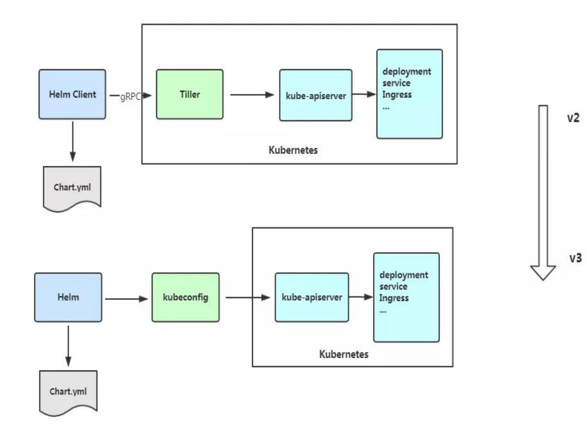
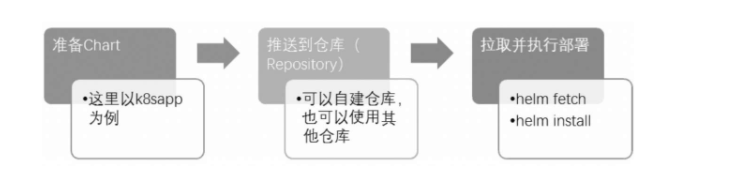
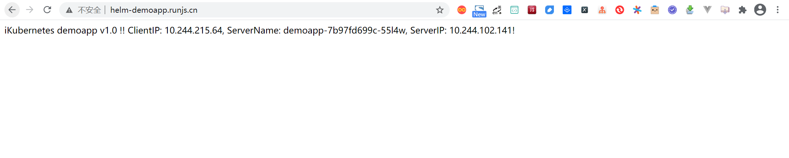
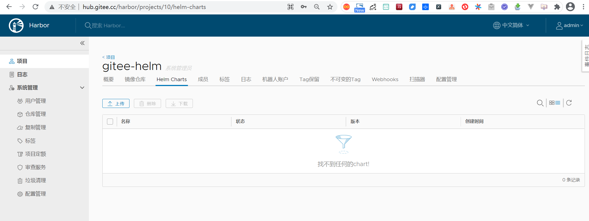

.. contents::
   :depth: 3
..

Helm简化Kubernetes部署
======================

Helm是Kubernetes生态系统中的一个软件包管理工具，有点类似于Linux操作系统里面的“apt-get”和“yum”。

对Kubernetes集群进行部署应用时，我们将面临以下问题：

-  如何管理、编辑和更新这些分散的Kubernetes应用配置文件。

-  如何把一套相关的配置文件作为一个应用进行管理。

-  如何分发和重用Kubernetes的应用配置。

Helm的出现就是为了很好地解决上面这些问题。Helm
Chart是用来封装Kubernetes原生应用程序的一系列YAML文件。我们可以在部署应用的时候自定义应用程序的一些Metadata，以便于应用程序的分发。

对于应用发布者而言，可以通过Helm打包应用、管理应用依赖关系、管理应用版本并发布应用到软件仓库。

对于使用者而言，使用Helm后不需要编写复杂的应用部署文件，可以以简单的方式在Kubernetes上查找、安装、升级、回滚、卸载应用程序。

总之，Helm大大简化了应用管理的难度，其主要有以下优点：

::

    ● 管理复杂应用,Charts能够描述哪怕是最复杂的程序结构，其提供了可重复使用的应用安装的定义。
    ● 易于更新升级,使用就地升级和自定义钩子来解决更新的难题。
    ● 易于共享。Charts无论是在私有服务器还是公共服务器上，都非常易于升级、共享和托管。
    ● 轻松回滚，可使用“helm rollback”命令轻松实现快速回滚。

Helm基础
--------

-  Helm

Helm是一个命令行下的客户端工具，主要用于Kubernetes应用程序Chart的创建、打包、发布以及创建和管理本地和远程的Chart仓库。

-  Tiller

Tiller是Helm的服务端，部署在Kubernetes集群中。Tiller用于接收Helm的请求，并根据Chart生成Kubernetes的部署文件（Helm称为Release），然后提交给Kubernetes创建应用。Tiller还提供了Release的升级、删除、回滚等一系列功能。

-  Chart

Helm的软件包，采用TAR格式，类似于APT的DEB包或者YUM的RPM包，其包含了一组定义Kubernetes资源相关的YAML文件。

-  Repository

Helm的软件仓库，保存了一系列的Chart软件包，以供用户下载；并且提供了一个该Repository的Chart包清单文件，以供用户查询。Helm可以同时管理多个不同的Repository。

-  Config

应用程序实例化部署运行时的配置信息。

-  Release

使用helm
install命令在Kubernetes集群中部署的Chart称为Release。Helm中提到的Release和我们通常概念中的版本有所不同，这里的Release可以理解为Helm使用Chart包部署的一个应用实例。在同一个集群中，一个Chart可以使用不同的配置（Config）安装多次，每次安装都会创建一个Release。

Helm 3 v3 变化
--------------

2019 年 11 月 13 日， Helm 团队发布 Helm v3 的第一个稳定版本。
该版本主要变化如下： 架构变化：

1. 最明显的变化是 Tiller 的删除
2. Release 名称可以在不同命名空间重用
3. 支持将 Chart 推送至 Docker 镜像仓库中
4. 使用 JSONSchema 验证 chart values
5. 其他

Helm的核心术语
~~~~~~~~~~~~~~

Helm将Kubernetes应用的相关配置组织为Charts，并通过它完成应用的常规管理操作。通常来说，使用Charts管理应用的流程包括从0开始创建Charts、将Charts及其相关的文件打包为归档格式、将Charts存储于仓库（repository）中并与之交互、在Kubernetes集群中安装或卸载Charts以及管理经Helm安装的应用的版本发行周期。因此，对Helm来说，它具有以下几个关键概念。

::

    ·Charts：即一个Helm程序包，它包含了运行一个Kubernetes应用所需要的镜像、依赖关系和资源定义等，必要时还会包含Service的定义；它类似于APT的dpkg文件或者yum的rpm文件。

    ·Repository：Charts仓库，用于集中存储和分发Charts，类似于Perl的CPAN，或者Python的PyPI。

    ·Config：应用程序实例化安装运行时使用的配置信息。

    ·Release：应用程序实例化配置后运行于Kubernetes集群中的一个Charts实例；在同一个集群上，一个Charts可以使用不同的Config重复安装多次，每次安装都会创建一个新的Release。

Helm 3快速入门
--------------

Helm的版本v2和版本v3目前处于维护当中，考虑了轻量、安全等特性，这里选择只介绍较新的版本v3的部署和使用，版本v2需要额外部署Tiller，而客户端的使用方法大多数都与版本v3相同。

Helm的每个发行版都提供了主流操作系统的专用版本，主要包括Linux、Mac
OS和Windows，用户安装前按需下载合用的平台上的相关发行版本即可。

Helm项目托管在GitHub之上，项目地址为https://github.com/kubernetes/helm
。

安装
----

安装方式1
~~~~~~~~~

下载最新的helm 3安装脚本

.. code:: shell

    curl -fsSL -o get_helm.sh https://raw.githubusercontent.com/helm/helm/master/scripts/get-helm-3

赋权并执行

.. code:: shell

    chmod 700 get_helm.sh && sh get_helm.sh

通过执行helm命令来验证helm安装。

::

    helm

增加一个公有稳定版的helm的repo仓库

.. code:: shell

    helm repo add stable https://kubernetes.oss-cn-hangzhou.aliyuncs.com/charts

让我们安装稳定的nginx 图表并测试设置

::

    helm install nginx stable/nginx-ingress

列出已安装的helm 图表

::

    helm ls

安装方式2
~~~~~~~~~

安装helm-v3

使用一条命令安装helm

::

    curl -L https://git.io/get_helm.sh | bash

如果安装包无法下载，可以复制脚本输出的下载链接手动下载，然后解压复制到bin目录，如下所示：

Helm 客户端下载地址：https://github.com/helm/helm/releases
解压移动到/usr/bin/目录即可。

.. code:: shell

    wget https://get.helm.sh/helm-vv3.2.1-linux-amd64.tar.gz
    tar zxvf helm-v3.2.1-linux-amd64.tar.gz
    mv linux-amd64/helm /usr/bin/

    **helm3的安装和部署**

    Kubernetes的包管理工具Helm3

    https://blog.csdn.net/qq\_39680564/article/details/107201496

查看Charts仓库信息
------------------

::

    [root@ci-base home]# helm repo list
    NAME            URL
    ingress-nginx   https://kubernetes.github.io/ingress-nginx
    stable          http://mirror.azure.cn/kubernetes/charts
    aliyun          https://kubernetes.oss-cn-hangzhou.aliyuncs.com/charts

常见操作
--------

::

    4.2  配置国内 t chart  仓库

     微软仓库（http://mirror.azure.cn/kubernetes/charts/）这个仓库推荐，基本上官网有的 chart 这里都有。

     阿里云仓库（https://kubernetes.oss-cn-hangzhou.aliyuncs.com/charts ）

     官方仓库（https://hub.kubeapps.com/charts/incubator）官方 chart 仓库，国内有点不好使。

    #添加存储库
    helm repo add stable http://mirror.azure.cn/kubernetes/charts
    helm repo add aliyun https://kubernetes.oss-cn-hangzhou.aliyuncs.com/charts
    helm repo update

    #查看配置的存储库
    helm repo list
    helm search repo stable

    #删除存储库：
    helm repo remove aliyun

    # 列出stable仓库中维护的所有Charts的列表
    helm search repo

    # 列出复合条件的Charts，过滤器查找
    helm search repo redis
    helm ls --all-namespaces

    # 查看Charts的详细信息
    [root@ci-base k8s_yaml]# helm show chart stable/redis
    apiVersion: v1
    appVersion: 4.0.8
    description: Open source, advanced key-value store. It is often referred to as a data
      structure server since keys can contain strings, hashes, lists, sets and sorted
      sets.
    home: http://redis.io/
    icon: https://bitnami.com/assets/stacks/redis/img/redis-stack-220x234.png
    keywords:
    - redis
    - keyvalue
    - database
    maintainers:
    - email: containers@bitnami.com
      name: bitnami-bot
    name: redis
    sources:
    - https://github.com/bitnami/bitnami-docker-redis
    version: 1.1.15

    [root@ci-base home]# helm inspect chart stable/redis
    apiVersion: v1
    appVersion: 5.0.7
    deprecated: true
    description: DEPRECATED Open source, advanced key-value store. It is often referred
      to as a data structure server since keys can contain strings, hashes, lists, sets
      and sorted sets.
    home: http://redis.io/
    icon: https://bitnami.com/assets/stacks/redis/img/redis-stack-220x234.png
    keywords:
    - redis
    - keyvalue
    - database
    name: redis
    sources:
    - https://github.com/bitnami/bitnami-docker-redis
    version: 10.5.7

    #查看发布状态
    # helm list

安装stable/redis在ns=redis中
----------------------------

::

    //创建
    helm search repo redis
    kubectl create namespace redis
    helm install chart stable/redis -n redis --dry-run
    helm install chart stable/redis -n redis

    Helm支持四种安装方法：

    （1）安装仓库中的chart，例如helm install stable/nginx。

    （2）通过tar包安装，例如helm install ./nginx-1.2.3.tgz。

    （3）通过chart本地目录安装，例如helm install ./nginx。

    （4）通过URL安装，例如helm install https://example.com/charts/nginx-1.2.3.tgz。

    //查看创建的charts,查看所有ns
    [root@ci-base home]# helm list --all-namespaces
    NAME            NAMESPACE       REVISION        UPDATED                                 STATUS          CHART                   APP VERSION
    chart           redis           1               2020-11-13 15:11:53.740004087 +0800 CST deployed        redis-10.5.7            5.0.7

    //查看单个ns
    [root@ci-base ~]# helm list -n ci-gitee-10523

    //删除命名空间中的chart
    [root@ci-base home]# helm -n redis uninstall chart
    release "chart" uninstalled

    [root@ci-base home]# helm list -A
    NAME            NAMESPACE       REVISION        UPDATED                                 STATUS          CHART                   APP VERSION

::

    # 安装stable/redis

    //创建
    [root@ci-base home]# helm install redis stable/redis

    //指定value.yaml文件创建
    helm install -f 12705values.yaml -n ci-gitee-12705 ci-gitee-12705 ./

    //查看
    [root@ci-base home]# helm list
    NAME    NAMESPACE       REVISION        UPDATED                                 STATUS          CHART           APP VERSION
    redis   default         1               2020-11-13 15:24:01.368251708 +0800 CST deployed        redis-10.5.7    5.0.7

    //删除
    [root@ci-base home]# helm uninstall redis
    或者使用delete

    [root@ci-base home]# helm delete redis
    release "redis" uninstalled

    [root@ci-base home]# helm list

    # 回滚
    helm rollback
    //命令格式：
    helm rollback <RELEASE> [REVISION] [flags]
    [aiops@3 test]$ helm rollback helloworld 1

    # 升级
    helm upgrade

    //命令语法：
    helm uninstall RELEASE_NAME [flags]

    # 获取指定Release变更历史
    helm history

    //获取某个release历史的安装更新记录
    $ helm history helloworld

    # helm pull
    //从chart仓库中下载打包好的chart到本地存储
    [aiops@3 test]$ helm pull stable/mysql

helm包检查项目
--------------

::

    # helm包检查项目
    [root@ci-base ~]# helm list --all-namespaces

    // 查看Config-Map
    [root@ci-base ~]# kubectl get cm -n ci-gitee-10523

    // 查看Deployment
    [root@ci-base ~]# kubectl get Deployment -n ci-gitee-10523

    // 查看service
    [root@ci-base ~]# kubectl get svc -n ci-gitee-10523

    // 查看ingress
    [root@ci-base ~]# kubectl get Ingress -n ci-gitee-10523

    // 查看pod
    [root@ci-base ~]# kubectl get pod -n ci-gitee-10523

    // 查看ReplicaSet
    [root@k8s-master ~]# kubectl get rs -lapp=demo

    [root@k8s-master ~]# kubectl get rs -lapp=demo --show-labels
    NAME                         DESIRED   CURRENT   READY   AGE   LABELS
    demo-deployment-68b59dd5b8   2         2         2       73m   app=demo,pod-template-hash=68b59dd5b8

    # 查看资源信息
    // 查看pod里面的容器
    kubectl describe -n dev pod cigiteebe-7c5b7486c-pc22z

Helm安装和卸载
--------------

::

    # helm安装和卸载
    [root@ci-base home]# helm install myapp --debug ./mychart --set service.type=NodePort
    [root@ci-base home]# helm uninstall myapp

    [root@ci-base home]# helm uninstall chart
    [root@ci-base home]# helm list

    # 删除命名空间ci-gitee-11856中的chart
    helm uninstall -n ci-gitee-11856 ci-gitee-11856

    #删除命名空间dev中的chart
    helm uninstall -n dev dev

    正确姿势
    1、brew install helm
    2、helm repo add stable http://mirror.azure.cn/kubernetes/charts/
    3、helm repo update
    4、helm install stable/xxx

    helm install --name myapp --dry-run --debug ./mychart --set service.type=NodePort
    helm install --name myapp --debug ./mychart --set service.type=NodePort

使用Helm部署Demo
----------------

事实上，一个单独的Charts既能用于部署简单应用，例如一个memcached
Pod，也能部署复杂的应用，如由HTTP服务器、DB服务器、Cache服务器和应用程序服务器等共同组成的Web应用栈。

接下来我们基于以上认知和Demo配置来进行部署，流程如图

chart 的基本结构
~~~~~~~~~~~~~~~~

::

    [root@ci-base helm]# helm create test
    Creating test

    [root@ci-base helm]# tree test/ -L 3
    test/
    ├── charts
    ├── Chart.yaml
    ├── templates
    │    ├── deployment.yaml
    │    ├── _helpers.tpl
    │    ├── hpa.yaml
    │    ├── ingress.yaml
    │    ├── NOTES.txt
    │    ├── serviceaccount.yaml
    │    ├── service.yaml
    │    └── tests
    │        └── test-connection.yaml
    └── values.yaml

-  charts 目录存放依赖的chart
-  Chart.yaml 包含Chart的基本信息，包括chart版本，名称等
-  templates 目录下存放应用一系列 k8s 资源的 yaml 模板
-  \_helpers.tpl
   此文件中定义一些可重用的模板片断，此文件中的定义在任何资源定义模板中可用
-  NOTES.txt 介绍chart 部署后的帮助信息，如何使用chart等
-  values.yaml 包含了必要的值定义（默认值）, 用于存储 templates
   目录中模板文件中用到变量的值

helm create
~~~~~~~~~~~

创建一个 Chart 模板

::

    # helm create test
    Creating test

helm package
~~~~~~~~~~~~

打包一个 Chart 模板

::

    [root@ci-base helm]# helm package test
    Successfully packaged chart and saved it to: /home/k8s-example/helm/test-0.1.0.tgz

helm search
~~~~~~~~~~~

查找可用的 Chart 模板

::

    [root@ci-base helm]# helm search hub nginx
    URL                                                     CHART VERSION   APP VERSION     DESCRIPTION
    https://hub.helm.sh/charts/wiremind/nginx               2.1.1                           An NGINX HTTP server
    https://hub.helm.sh/charts/bitnami/nginx                8.2.3           1.19.6          Chart for the nginx server
    .........

helm inspect
~~~~~~~~~~~~

查看指定 Chart 的基本信息

::

    [root@ci-base helm]# helm inspect chart test
    apiVersion: v2
    appVersion: 1.16.0
    description: A Helm chart for Kubernetes
    name: test
    type: application
    version: 0.1.0

Chart 模板示例
~~~~~~~~~~~~~~

Chart 文件结构
^^^^^^^^^^^^^^

::

    wordpress
    ├── charts
    ├── Chart.yaml
    ├── README.md
    ├── requirements.lock
    ├── requirements.yaml
    ├── templates
    │   ├── deployment.yaml
    │   ├── externaldb-secrets.yaml
    │   ├── _helpers.tpl
    │   ├── ingress.yaml
    │   ├── NOTES.txt
    │   ├── pvc.yaml
    │   ├── secrets.yaml
    │   ├── svc.yaml
    │   └── tls-secrets.yaml
    └── values.yaml

一个 wordpress chart 如上（去除部分 test 和 charts 依赖），
基本结构由以下几个部分组成：

-  charts 存放子Chart (Subchart) 的定义，Subchart 指的是当前 Chart
   依赖的 Chart ， 在 requirements.yaml 中定义
-  Chart.yaml 包含 Chart 信息的 YAML 文件， 包括 Chart
   的版本、名称等，在 DCE Helm 插件中还包含 Chart 的 **团队授权** 信息
   和 **是否公开** 的信息
-  README.md 可选：Chart 的介绍信息等（该文件对于一个大型 Chart
   来说十分重要）
-  Requirements.yaml 可选：列举当前 Chart 的需要依赖的 Chart
-  templates
-  该目录下存放 Chart 所有的 K8s
   资源定义模板，通常不同的资源放在不同的文件中，DCE Helm
   插件中自定义模板的 K8s 资源统一放在 all\_sources.yaml 文件中
-  \_helpers.tpl ，
   通常这个文件存放可重用的模板片段，该文件中的定义可以在 Chart
   其它资源定义模板中使用
-  NOTES.txt，可选：一段简短使用说明的文本文件，用于安装 Release
   后提示用户使用
-  values.yaml 当前 Chart 的默认配置的值

我们查看下使用 ``helm create`` 命令自动生成的 ``templates/service.yaml``
文件。

.. code:: yaml

    apiVersion: v1
    kind: Service
    metadata:
      name: {{ include "mychart.fullname" . }}
      labels:
        {{- include "mychart.labels" . | nindent 4 }}
    spec:
      type: {{ .Values.service.type }}
      ports:
        - port: {{ .Values.service.port }}
          targetPort: http
          protocol: TCP
          name: http
      selector:
        {{- include "mychart.selectorLabels" . | nindent 4 }}

可以看到其中有很多\ ``{{ }}`` 包围的字段，这是使用的 `Go
template <https://golang.org/pkg/text/template/>`__
创建的自定义字段，其中 ``mychart`` 开头的都是在 ``_helpers.tpl``
中生成的定义。

编写一个简单的 Chart 示例
~~~~~~~~~~~~~~~~~~~~~~~~~

本节以构建一个名称为 nginx-test Chart 为示例，来描述一个 chart
必要条件。

::

    # helm create nginx-test
    Creating nginx-test

1、Chart.yaml 文件是 一个 chart 必要文件，
该文件可以简单包括以下字段（具体字段请参考\ `Helm官网 <https://links.jianshu.com/go?to=https%3A%2F%2Fhelm.sh%2F>`__)

Chart.yaml文件组织格式
^^^^^^^^^^^^^^^^^^^^^^

Chart.yaml用于提供Charts相关的各种元数据，如名称、版本、关键词、维护者信息、使用的模板引擎等，它是一个Charts必备的核心文件，主要包含以下字段。

::

    ·name：当前Charts的名称，必选字段。

    ·version：遵循语义化版本规范第2版的版本号，必选字段。

    ·description：当前项目的单语句描述信息，可选字段。

    ·keywords：当前项目的关键词列表，可选字段。

    ·home：当前项目的主页URL，可选字段。

    ·sources：当前项目用到的源码的来源URL列表，可选字段。

    ·maintainers：项目维护者信息，主要嵌套name、email和URL几个属性组成；可选字段。

    ·engine：模板引擎的名称，默认为gotpl，即go模板。

    ·icon：URL，指向当前项目的图标，SVG或PNG格式的图片；可选字段。

    ·appVersion：本项目用到的应用程序的版本号，可选字段，且不必为语义化版本。

    ·deprecated：当前Charts是否已废弃，可选字段，布尔型值。

    ·tillerVersion：当前Charts依赖的Tiller版本号，可以是语义化版本号的范围，如“>2.4.0”；可选字段。

面的示例信息是redis
Charts中使用的Chart.yaml的内容，用户自行定义Charts编写相关文件时，要采用类似的文件格式：

::

    appVersion: 4.0.9
    description: Open source, advanced key-value store. It is often referred 
      to as a data structure server since keys can contain strings, hashes, 
      lists, sets and sorted sets.
    engine: gotpl
    home: http://redis.io/
    icon: https://bitnami.com/assets/stacks/redis/img/redis-stack-220x234.png
    keywords:
    - redis
    - keyvalue
    - database
    maintainers:
    - email: containers@bitnami.com
      name: bitnami-bot
    name: redis
    sources:
    - https://github.com/bitnami/bitnami-docker-redis
    version: 3.3.0

nginx-test的Charts中使用的Chart.yaml的内容

::

    [root@ci-base helm]# cat nginx-test/Chart.yaml |grep -v "^$"|grep -v "^#"
    apiVersion: v2
    name: nginx-test
    description: A Helm chart for Kubernetes
    type: application
    version: 0.1.0
    appVersion: 1.16.0

Charts中的依赖关系
^^^^^^^^^^^^^^^^^^

requirements.yaml文件

::

    ·name：被依赖的Charts的名称。

    ·version：被依赖的Charts的版本。

    ·repository：被依赖的Charts所属的仓库及其URL；如果是非官方的仓库，则需要先用helm repo add命令将其添加进本地可用仓库。

    ·alias：为被依赖的Charts创建一个别名，从而让当前Charts可以将所依赖的Charts对应到新名称，即别名；可选字段。

    ·tags：默认情况下所有的Charts都会被装载，若给定了tags，则仅装载那些匹配到的Charts。

    ·condition：类似于tags字段，但需要通过自定义的条件来指明要装载的charts。

    ·import-values：导入子Charts中的的值；被导入的值需要在子charts中导出。

如下所示的示例，是Wordpress Charts中定义的动态依赖关系：

::

    dependencies:
    - name: mariadb
      version: 2.1.1
      repository: https://kubernetes-charts.storage.googleapis.com/
      condition: mariadb.enabled
      tags:
        - wordpress-database

一旦依赖关系文件配置完成，即可使用“helm dependency
update”命令更新依赖关系，并自动下载被依赖的Charts至charts/目录中。

Charts目录
^^^^^^^^^^

若需要对依赖关系进行更多的控制，则所有被依赖到的Charts都能以手工方式直接复制到Charts目录中。一个被依赖到的Charts既可以是归档格式，也可以是展开的目录格式，不过，其名称不能以下划线（\_）或点号（.）开头，此类文件会被Charts装载器自动忽略。

例如，Wordpress Charts依赖关系在其Charts目录中的反映类似如下所示：

--------------

::

    charts/
    └── mariadb
        ├── Chart.yaml
        ├── README.md
        ├── templates
        │   ├── configmap.yaml
        │   ├── deployment.yaml
        │   ├── _helpers.tpl
        │   ├── NOTES.txt
        │   ├── pvc.yaml
        │   ├── secrets.yaml
        │   ├── svc.yaml
        │   ├── test-runner.yaml
        │   └── tests.yaml
        └── values.yaml

2、values.yaml 文件是 chart 的必要文件，以 nginx 为示例：

::

    [root@ci-base helm]# cat nginx-test/values.yaml |grep -v "^$"|grep -v "#"
    replicaCount: 1
    image:
      repository: nginx
      pullPolicy: IfNotPresent
      tag: ""
    imagePullSecrets: []
    nameOverride: ""
    fullnameOverride: ""
    serviceAccount:
      create: true
      annotations: {}
      name: ""
    podAnnotations: {}
    podSecurityContext: {}
    securityContext: {}
    service:
      type: ClusterIP
      port: 80
    ingress:
      enabled: false
      annotations: {}
      hosts:
        - host: chart-example.local
          paths: []
      tls: []
    resources: {}
    autoscaling:
      enabled: false
      minReplicas: 1
      maxReplicas: 100
      targetCPUUtilizationPercentage: 80
    nodeSelector: {}
    tolerations: []
    affinity: {}

从示例中可以看出，values.yaml 中定义了一些当前chart 的一些默认值，用于
templates 下的 K8s 资源 yaml 渲染时填充默认值。

不过需要注意的是，\ **如果使用 helm install 来部署一个 Release ,
可以通过下面命令指定一份yaml 文件作为填充值**\ ：

::

    helm install --values=myvals.yaml nginx

    注意：上面命令不要复制执行，执行会报错的。请根据实际情况执行！！！

3、创建 templates 下的模板文件， 用于生成 Kubernetes 资源清单(manifests)
如下所示:

::

    # cat nginx-test/templates/deployment.yaml 
    apiVersion: apps/v1
    kind: Deployment
    metadata:
      name: {{ include "nginx-test.fullname" . }}
      labels:
    ...

上面定义了 一个 deployments.yaml 和 service.yaml 资源文件，里面使用 {{
}} 符号的是 Go 模板语言的标准。其中可以通过：

-  .Values 对象访问 values.yaml 文件的内容， 前面的dot(.)
   表示从顶层命名空间开始，找到 Values 对象(下同)
-  .Release、.Chart 开头的预定义值可用于任何的模板中
-  .Chart 对象用来访问 Chart.yaml 文件的内容
-  .Release 对象是 Helm的内置对象之一， 使用 Helm 安装一个 release
   时，由 Tiller 分配 release 的名称

4、命名模板(\_helper.tpl) ：可以从上面看到有 {{ template
"nginx-test.fullname" . }} 定义。该定义由 \_helper.tpl
文件定义的字段来实现，比如下面一个 \_helper.tpl :

::

    # cat nginx-test/templates/_helpers.tpl 
    {{/* vim: set filetype=mustache: */}}
    {{/*
    Expand the name of the chart.
    */}}
    ...

该模板定义了
"nginx-test.name"、"nginx-test.fullname"、"nginx-test.chart"
等可重用模板部分，当模板引擎读取该文件时，它存储对
nginx-test.name等的引用， 直到调用 template "nginx-test.name"
为止。然后把值渲染到模板中。

注意 {{ template "nginx-test.chart" . }}
后面有个dot(.)，这是因为一个已命名的模板（用于创建 define)
被渲染时，它将接收由该 template
调用传入的范围（scope)。没有范围传入，在模板中无法访问任何内容，因此在：

::

    {{- define "nginx-test.chart" -}}
    这里面的 .Chart 将无法访问，导致在模板中无法看到内容，因为这里值为空
    {{- end -}}

因此在模板中将 范围(scope) 传入即可正常使用：

::

    # cat nginx-test/templates/service.yaml 
    apiVersion: v1
    kind: Service
    metadata:
      name: {{ include "nginx-test.fullname" . }}

在末尾传递了 . 这样就可以使用 .Values 或者 .Chart 或其它范围(scope)

5、Chart 依赖（requirements.yaml)：比如 WordPress Chart 依赖于 mariadb
Chart， 下面是 WordPress 的依赖(requirements.yaml)：

::

    dependencies:
    - name: mariadb
      version: 5.x.x
      repository: https://kubernetes-charts.storage.googleapis.com/
      condition: mariadb.enabled
      tags:
        - wordpress-database

该文件列举当前 Chart 所有的 依赖（subchart)。有几个字段是必要的：

-  name: 依赖 Chart 的名称（必要）
-  version: 依赖 Chart 的版本号（必要）
-  repository: 依赖 Chart 的存储库完整URL，必须通过 helm repo add 添加
   repository（存储库）到本地

Chart 模板开发指南
------------------

1 先创建模板
~~~~~~~~~~~~

::

    $  helm create mychart
    Creating mychart

快速看一下目录 ``mychart/templates/``

::

    $  tree .
    .
    └── mychart
        ├── charts
        ├── Chart.yaml
        ├── templates
        │    ├── deployment.yaml
        │    ├── _helpers.tpl
        │    ├── hpa.yaml
        │    ├── ingress.yaml
        │    ├── NOTES.txt
        │    ├── serviceaccount.yaml
        │    ├── service.yaml
        │    └── tests
        │        └── test-connection.yaml
        └── values.yaml

    4 directories, 10 files

看一下 ``mychart/templates/`` 目录，发现如下几个文件已经存在。

-  NOTES.txt：chart 的 “帮助文本”。这会在用户运行 ``helm install``
   时显示给用户。
-  deployment.yaml：创建 Kubernetes
   `deployment <https://kubernetes.io/docs/concepts/workloads/controllers/deployment/>`__
   的基本 manifest
-  service.yaml：为 deployment 创建 service 端点 `service
   endpoint <https://kubernetes.io/docs/concepts/services-networking/service/>`__
   的基本 manifest
-  ``_helpers.tpl``\ ：放置模板助手的地方，可以在整个 chart 中重复使用

而我们要做的就是......
全部删除它们！这样我们就可以从头开始学习我们的教程。实际上，我们将创建自己的
NOTES.txt 和\_helpers.tpl。

::

    $  rm -rf mychart/templates/*.*

在编写生产级 chart 时，使用这些 chart
的基本版本可能非常有用。所以在你的日常 chart 制作中，可以不删除它们。

1.1 第一个模板
^^^^^^^^^^^^^^

我们要创建的第一个模板将是一个 ConfigMap。在 Kubernetes 中，ConfigMap
只是存储配置数据的地方。其他的东西，比如 Pod，可以访问 ConfigMap
中的数据。

由于 ConfigMaps 是基础资源，它们为我们提供了一个很好的起点。

我们首先创建一个名为 mychart/templates/configmap.yaml：

::

    apiVersion: v1
    kind: ConfigMap
    metadata:
      name: mychart-configmap
    data:
      myvalue: "Hello World"

**提示：** 模板名称不遵循严格的命名模式。但是，我们建议 ``.yaml`` 为
YAML 文件后缀，\ ``.tpl`` 为模板助手后缀。

上面的 YAML 文件是一个简单的
ConfigMap，具有最少的必要字段。由于该文件位于 ``templates/``
目录中，因此将通过模板引擎发送。

::

    $  helm install myapp ./mychart/ -n dev
    NAME: myapp
    LAST DEPLOYED: Fri Apr  9 13:54:30 2021
    NAMESPACE: dev
    STATUS: deployed
    REVISION: 1
    TEST SUITE: None

在上面的输出中，我们可以看到我们的 ConfigMap 已经创建。使用
Helm，我们可以检索版本并查看加载的实际模板。

::

    $  helm get manifest myapp -n dev
    ---
    # Source: mychart/templates/configmap.yaml
    apiVersion: v1
    kind: ConfigMap
    metadata:
      name: mychart-configmap
    data:
      myvalue: "Hello World"

该 ``helm get manifest`` 命令获取 release
名称（full-coral）并打印出上传到服务器的所有 Kubernetes 资源。

每个文件都以 ``---`` 开始作为 YAML
文档的开始，然后是一个自动生成的注释行，告诉我们该模板文件生成的这个
YAML 文档。

删除 release：

::

    $  helm delete myapp -n dev

1.2 添加一个简单的模板调用
^^^^^^^^^^^^^^^^^^^^^^^^^^

我们改一下 ``configmap.yaml``

::

    apiVersion: v1
    kind: ConfigMap
    metadata:
      name: {{.Release.Name}}-configmap
    data:
      myvalue: "Hello World"

所以我们可以这样理解 ``.Release.Name：``"从顶层命名空间开始，找到
Release 对象，然后在里面查找名为 ``Name`` 的对象"。

现在，当我们安装我们的资源时，我们会立即看到使用这个模板指令的结果:

::

    $  helm install clunky-serval ./mychart -n dev
    NAME: clunky-serval
    LAST DEPLOYED: Fri Apr  9 14:02:25 2021
    NAMESPACE: dev
    STATUS: deployed
    REVISION: 1
    TEST SUITE: None

运行 helm get manifest clunky-serval 以查看整个生成的 YAML。

::

    $  helm get manifest clunky-serval  -n dev
    ---
    # Source: mychart/templates/configmap.yaml
    apiVersion: v1
    kind: ConfigMap
    metadata:
      name: clunky-serval-configmap
    data:
      myvalue: "Hello World"

可以使用
``helm install clunky-serval --debug --dry-run ./mychart -n dev``\ 。这会将
chart 发送到 Tiller 服务器，它将渲染模板。但不是安装
chart，它会将渲染模板返回，以便可以看到输出：

::

    $  helm uninstall clunky-serval -n dev
    release "clunky-serval" uninstalled

    $  helm install clunky-serval --debug --dry-run ./mychart -n dev
    install.go:159: [debug] Original chart version: ""
    install.go:176: [debug] CHART PATH: /app/k8s_yaml/helm_example/mychart
    ---
    # Source: mychart/templates/configmap.yaml
    apiVersion: v1
    kind: ConfigMap
    metadata:
      name: clunky-serval-configmap
    data:
      myvalue: "Hello World"

使用 ``--dry-run`` 可以更容易地测试代码，但不能确保 Kubernetes
本身会接受生成的模板。

2 修改 Chart.yaml，Values.yaml
~~~~~~~~~~~~~~~~~~~~~~~~~~~~~~

2.1 内置对象
^^^^^^^^^^^^

``Release`` 是可以在模板中访问的顶级对象之一。

-  ``Release``\ ：这个对象描述了 release 本身。它里面有几个对象：
-  ``Release.Name``\ ：release 名称
-  ``Release.Time``\ ：release 的时间
-  ``Release.Namespace``\ ：release 的 namespace（如果清单未覆盖）
-  ``Release.Service``\ ：release 服务的名称（始终是 ``Tiller``\ ）。
-  ``Release.Revision``\ ：此 release 的修订版本号。它从 1 开始，每
   ``helm upgrade`` 一次增加一个。
-  ``Release.IsUpgrade``\ ：如果当前操作是升级或回滚，则将其设置为
   ``true``\ 。
-  ``Release.IsInstall``\ ：如果当前操作是安装，则设置为 ``true``\ 。
-  ``Values``\ ：从 ``values.yaml``
   文件和用户提供的文件传入模板的值。默认情况下，Values 是空的。
-  ``Chart``\ ：\ ``Chart.yaml`` 文件的内容。任何数据 Chart.yaml
   将在这里访问。例如 {{.Chart.Name}}-{{.Chart.Version}} 将打印出来
   mychart-0.1.0。chart 指南中 `Charts
   Guide <https://github.com/kubernetes/helm/blob/master/docs/charts.md#the-chartyaml-file>`__
   列出了可用字段
-  ``Files``\ ：这提供对 chart
   中所有非特殊文件的访问。虽然无法使用它来访问模板，但可以使用它来访问
   chart 中的其他文件。请参阅 "访问文件" 部分。
-  ``Files.Get``
   是一个按名称获取文件的函数（\ ``.Files.Get config.ini``\ ）
-  ``Files.GetBytes``
   是将文件内容作为字节数组而不是字符串获取的函数。这对于像图片这样的东西很有用。
-  ``Capabilities``\ ：这提供了关于 Kubernetes 集群支持的功能的信息。
-  ``Capabilities.APIVersions`` 是一组版本信息。
-  ``Capabilities.APIVersions.Has $version``
   指示是否在群集上启用版本（\ ``batch/v1``\ ）。
-  ``Capabilities.KubeVersion`` 提供了查找 Kubernetes
   版本的方法。它具有以下值：Major，Minor，GitVersion，GitCommit，GitTreeState，BuildDate，GoVersion，Compiler，和
   Platform。
-  ``Capabilities.TillerVersion`` 提供了查找 Tiller
   版本的方法。它具有以下值：SemVer，GitCommit，和 GitTreeState。
-  ``Template``\ ：包含有关正在执行的当前模板的信息
-  ``Name``\ ：到当前模板的 namespace 文件路径（例如
   ``mychart/templates/mytemplate.yaml``\ ）
-  ``BasePath``\ ：当前 chart 模板目录的 namespace 路径（例如
   mychart/templates）。

2.2 values 文件
^^^^^^^^^^^^^^^

该对象提供对传入 chart 的值的访问。其内容来自四个来源：

-  chart 中的 ``values.yaml`` 文件
-  如果这是一个子 chart，来自父 chart 的 ``values.yaml`` 文件
-  value 文件通过 helm install 或 helm upgrade 的 - f
   标志传入文件（\ ``helm install -f myvals.yaml ./mychart``\ ）
-  通过 ``--set``\ （例如 ``helm install --set foo=bar ./mychart``\ ）

我们编辑 ``mychart/values.yaml``\ ，然后来编辑我们的 ``ConfigMap``
模板。

删除默认带的 values.yaml，我们只设置一个参数：

.. code:: yaml

    favoriteDrink: coffee

现在我们可以在模板中使用这个：

::

    apiVersion: v1
    kind: ConfigMap
    metadata:
      name: {{.Release.Name}}-configmap
    data:
      myvalue: "Hello World"
      drink: {{.Values.favoriteDrink}}

注意我们在最后一行 {{ .Values.favoriteDrink}} 获取 ``favoriteDrink``
的值。

让我们看看这是如何渲染的。

::

    $  helm install myapp2021 --dry-run --debug ./mychart
    install.go:159: [debug] Original chart version: ""
    install.go:176: [debug] CHART PATH: /app/k8s_yaml/helm_example/mychart

    NAME: myapp2021
    LAST DEPLOYED: Fri Apr  9 14:11:16 2021
    NAMESPACE: default
    STATUS: pending-install
    REVISION: 1
    TEST SUITE: None
    USER-SUPPLIED VALUES:
    {}

    COMPUTED VALUES:
    favoriteDrink: coffee

    HOOKS:
    MANIFEST:
    ---
    # Source: mychart/templates/configmap.yaml
    apiVersion: v1
    kind: ConfigMap
    metadata:
      name: myapp2021-configmap
    data:
      myvalue: "Hello World"
      drink: coffee

由于 ``favoriteDrink`` 在默认 ``values.yaml`` 文件中设置为
``coffee``\ ，这就是模板中显示的值。我们可以轻松地在我们的 helm install
命令中通过加一个 ``--set`` 添标志来覆盖：

::

    $  helm install myapp2021 --dry-run --debug --set favoriteDrink=slurm ./mychart
    install.go:159: [debug] Original chart version: ""
    install.go:176: [debug] CHART PATH: /app/k8s_yaml/helm_example/mychart

    NAME: myapp2021
    LAST DEPLOYED: Fri Apr  9 14:12:31 2021
    NAMESPACE: default
    STATUS: pending-install
    REVISION: 1
    TEST SUITE: None
    USER-SUPPLIED VALUES:
    favoriteDrink: slurm

    COMPUTED VALUES:
    favoriteDrink: slurm

    HOOKS:
    MANIFEST:
    ---
    # Source: mychart/templates/configmap.yaml
    apiVersion: v1
    kind: ConfigMap
    metadata:
      name: myapp2021-configmap
    data:
      myvalue: "Hello World"
      drink: slurm

由于 ``--set`` 比默认 ``values.yaml``
文件具有更高的优先级，我们的模板生成 ``drink: slurm``\ 。

values 文件也可以包含更多结构化内容。例如，我们在 values.yaml
文件中可以创建 ``favorite`` 部分，然后在其中添加几个键：

::

    favorite:
      drink: coffee
      food: pizza

现在我们稍微修改模板：

::

    apiVersion: v1
    kind: ConfigMap
    metadata:
      name: {{.Release.Name}}-configmap
    data:
      myvalue: "Hello World"
      drink: {{.Values.favorite.drink}}
      food: {{.Values.favorite.food}}

虽然以这种方式构建数据是可以的，但建议保持 value
树浅一些，平一些。当我们看看为子 chart
分配值时，我们将看到如何使用树结构来命名值。

::

    $  helm install myapp2021 --dry-run --debug  ./mychart
    ---
    # Source: mychart/templates/configmap.yaml
    apiVersion: v1
    kind: ConfigMap
    metadata:
      name: myapp2021-configmap
    data:
      myvalue: "Hello World"
      drink: coffee
      food: pizza

2.3 模板函数和管道
^^^^^^^^^^^^^^^^^^

**使用quote函数**

我们使用管道（\|）将 “参数”
发送给函数：\ ``.Values.favorite.drink | quote``\ 。使用管道，我们可以将几个功能链接在一起：

::

    apiVersion: v1
    kind: ConfigMap
    metadata:
      name: {{.Release.Name}}-configmap
    data:
      myvalue: "Hello World"
      drink: {{.Values.favorite.drink | quote}}
      food: {{.Values.favorite.food | upper | quote}}

当评估时，该模板将产生如下结果：

.. code:: yaml

    # Source: mychart/templates/configmap.yaml
    apiVersion: v1
    kind: ConfigMap
    metadata:
      name: trendsetting-p-configmap
    data:
      myvalue: "Hello World"
      drink: "coffee"
      food: "PIZZA"

原来 ``pizza`` 现在已经转换为 ``"PIZZA"``\ 。

::

    apiVersion: v1
    kind: ConfigMap
    metadata:
      name: {{.Release.Name}}-configmap
    data:
      myvalue: "Hello World"
      drink: {{.Values.favorite.drink | repeat 5 | quote}}
      food: {{.Values.favorite.food | upper | quote}}

该 repeat 函数将回送给定的字符串和给定的次数，所以我们将得到这个输出：

::

    # Source: mychart/templates/configmap.yaml
    apiVersion: v1
    kind: ConfigMap
    metadata:
      name: melting-porcup-configmap
    data:
      myvalue: "Hello World"
      drink: "coffeecoffeecoffeecoffeecoffee"
      food: "PIZZA"

**使用 default 函数**

示例：

::

    drink: {{.Values.favorite.drink | default "tea" | quote}}

现在，我们将从以下位置删除喜欢的饮料设置 values.yaml：

.. code:: yaml

    favorite:
      #drink: coffee
      food: pizza

现在重新运行 ``helm install --dry-run --debug ./mychart`` 会产生这个
YAML：

.. code:: yaml

    # Source: mychart/templates/configmap.yaml
    apiVersion: v1
    kind: ConfigMap
    metadata:
      name: fair-worm-configmap
    data:
      myvalue: "Hello World"
      drink: "tea"
      food: "PIZZA"

**运算符函数**

对于模板，运算符（eq，ne，lt，gt，and，or
等等）都是已实现的功能。在管道中，运算符可以用圆括号（\ ``(`` 和
``)``\ ）分组。

将运算符放到声明的前面，后面跟着它的参数，就像使用函数一样。要多个运算符一起使用，将每个函数通过圆括号分隔。

2.4 流程控制
^^^^^^^^^^^^

控制结构（模板说法中称为
“动作”）为模板作者提供了控制模板生成流程的能力。Helm
的模板语言提供了以下控制结构：

-  ``if/else`` 用于创建条件块
-  ``with`` 指定范围
-  ``range``\ ，它提供了一个 “for each” 风格的循环

除此之外，它还提供了一些声明和使用命名模板段的操作：

-  ``define`` 在模板中声明一个新的命名模板
-  ``template`` 导入一个命名模板
-  ``block`` 声明了一种特殊的可填写模板区域

我们为 ConfigMap
添加一个简单的条件。如果饮料被设置为咖啡，我们将添加另一个设置：

::

    apiVersion: v1
    kind: ConfigMap
    metadata:
      name: {{.Release.Name}}-configmap
    data:
      myvalue: "Hello World"
      drink: {{.Values.favorite.drink | default "tea" | quote}}
      food: {{.Values.favorite.food | upper | quote}}
      {{if and .Values.favorite.drink (eq .Values.favorite.drink "coffee") }}mug: true{{ end }}

输出如下：

.. code:: yaml

    $  helm install myapp2021 --dry-run --debug  ./mychart
    # Source: mychart/templates/configmap.yaml
    apiVersion: v1
    kind: ConfigMap
    metadata:
      name: myapp2021-configmap
    data:
      myvalue: "Hello World"
      drink: "coffee"
      food: "PIZZA"
      mug: true

**控制空格**

将空格替换为 ``*``, 按照此规则将每个空格将被删除。一个在该行的末尾的
``*`` 指示换行符将被移除

::

    apiVersion: v1
    kind: ConfigMap
    metadata:
      name: {{.Release.Name}}-configmap
    data:
      myvalue: "Hello World"
      drink: {{.Values.favorite.drink | default "tea" | quote}}
      food: {{.Values.favorite.food | upper | quote}}
      {{- if eq .Values.favorite.drink "coffee"}}
      mug: true
      {{- end}}

牢记这一点，我们可以通过 Helm 运行我们的模板并查看结果：

::

    # Source: mychart/templates/configmap.yaml
    apiVersion: v1
    kind: ConfigMap
    metadata:
      name: clunky-cat-configmap
    data:
      myvalue: "Hello World"
      drink: "coffee"
      food: "PIZZA"
      mug: true

**使用 with 修改范围**

with
可以允许将当前范围（\ ``.``\ ）设置为特定的对象。例如，我们一直在使用的
``.Values.favorites``\ 。让我们重写我们的 ConfigMap 来改变 ``.``
范围来指向 ``.Values.favorites``\ ：

::

    apiVersion: v1
    kind: ConfigMap
    metadata:
      name: {{.Release.Name}}-configmap
    data:
      myvalue: "Hello World"
      {{- with .Values.favorite}}
      drink: {{.drink | default "tea" | quote}}
      food: {{.food | upper | quote}}
      {{- end}}

注意，现在我们可以引用 ``.drink`` 和 ``.food``
无需对其进行限定。这是因为该 ``with`` 声明设置 ``.`` 为指向
``.Values.favorite``\ 。在 ``{{end}}`` 后 ``.`` 复位其先前的范围。

**循环range动作**

我们在我们的 ``values.yaml`` 文件中添加一份披萨配料列表：

::

    favorite:
      drink: coffee
      food: pizza
    pizzaToppings:
      - mushrooms
      - cheese
      - peppers
      - onions

现在我们有一个列表（模板中称为
slice）pizzaToppings。我们可以修改我们的模板，将这个列表打印到我们的
ConfigMap 中：

::

    apiVersion: v1
    kind: ConfigMap
    metadata:
      name: {{.Release.Name}}-configmap
    data:
      myvalue: "Hello World"
      {{- with .Values.favorite}}
      drink: {{.drink | default "tea" | quote}}
      food: {{.food | upper | quote}}
      {{- end}}
      toppings: |-
        {{- range .Values.pizzaToppings}}
        - {{. | title | quote}}
        {{- end}}

我们可以直接向管道发送 ``.`` 的值，所以当我们这样做时
``{{. | title | quote}}``\ ，它会发送 ``.`` 到 title（标题 case
函数），然后发送到 ``quote``\ 。如果我们运行这个模板，输出将是：

::

    $  helm install myapp2021 --dry-run --debug  ./mychart
    ---
    # Source: mychart/templates/configmap.yaml
    apiVersion: v1
    kind: ConfigMap
    metadata:
      name: myapp2021-configmap
    data:
      myvalue: "Hello World"
      drink: "coffee"
      food: "PIZZA"
      toppings: |-
        - "Mushrooms"
        - "Cheese"
        - "Peppers"
        - "Onions"

    YAML 中的 ``|-``
    标记表示一个多行字符串。这可以是一种有用的技术，用于在清单中嵌入大块数据，如此处所示。

2.5 变量
^^^^^^^^

在 Helm 模板中，变量是对另一个对象的命名引用。它遵循这个形式
``$name``\ 。变量被赋予一个特殊的赋值操作符：\ ``:=``\ 。我们可以使用变量重写上面的
Release.Name。

.. code:: yaml

    apiVersion: v1
    kind: ConfigMap
    metadata:
      name: {{.Release.Name}}-configmap
    data:
      myvalue: "Hello World"
      {{- $relname := .Release.Name -}}
      {{- with .Values.favorite}}
      drink: {{.drink | default "tea" | quote}}
      food: {{.food | upper | quote}}
      release: {{$relname}}
      {{- end}}

注意，在我们开始 ``with`` 块之前，我们赋值
``$relname :=``.Release.Name。现在在 ``with`` 块内部，\ ``$relname``
变量仍然指向发布名称。

::

    $  helm install myapp2021 --dry-run --debug  ./mychart
    ---
    # Source: mychart/templates/configmap.yaml
    apiVersion: v1
    kind: ConfigMap
    metadata:
      name: myapp2021-configmap
    data:
      myvalue: "Hello World"
      drink: "coffee"
      food: "PIZZA"
      release: myapp2021

.. code:: yaml

    # mychart/values.yaml
    favorite:
      drink: coffee
      food: pizza
    pizzaToppings:
      - mushrooms
      - cheese
      - peppers
      - onions

变量在 ``range``
循环中特别有用。它们可以用于类似列表的对象以同时捕获索引和值：

::

    apiVersion: v1
    kind: ConfigMap
    metadata:
      name: {{.Release.Name}}-configmap
    data:
      myvalue: "Hello World"
      {{- $relname := .Release.Name -}}
      {{- with .Values.favorite}}
      drink: {{.drink | default "tea" | quote}}
      food: {{.food | upper | quote}}
      release: {{$relname}}
      {{- end}}
      toppings: |-
        {{- range $index, $topping := .Values.pizzaToppings}}
          {{$index}}: {{ $topping }}
        {{- end}}

注意，\ ``range``
首先是变量，然后是赋值运算符，然后是列表。这将分配整数索引（从零开始）给
``$index``\ ，值给 ``$topping``\ 。运行它将产生：

::

    $  helm install myapp2021 --dry-run --debug  ./mychart
    ---
    # Source: mychart/templates/configmap.yaml
    apiVersion: v1
    kind: ConfigMap
    metadata:
      name: myapp2021-configmap
    data:
      myvalue: "Hello World"
      drink: "coffee"
      food: "PIZZA"
      release: myapp2021
      toppings: |-
          0: mushrooms
          1: cheese
          2: peppers
          3: onions

对于同时具有键和值的数据结构，我们可以使用 ``range``
来获得两者。例如，我们可以对 ``.Values.favorite`` 像这样循环：

::

    apiVersion: v1
    kind: ConfigMap
    metadata:
      name: {{.Release.Name}}-configmap
    data:
      myvalue: "Hello World"
      {{- range $key, $val := .Values.favorite}}
      {{$key}}: {{ $val | quote }}
      {{- end}}

现在在第一次迭代中，\ ``$key`` 是 ``drink``\ ，\ ``$val`` 是
``coffee``\ ，第二次，\ ``$key`` 是 food，\ ``$val`` 会
pizza。运行上面的代码会生成下面这个：

::

    $  helm install myapp2021 --dry-run --debug  ./mychart
    HOOKS:
    MANIFEST:
    ---
    # Source: mychart/templates/configmap.yaml
    apiVersion: v1
    kind: ConfigMap
    metadata:
      name: myapp2021-configmap
    data:
      myvalue: "Hello World"
      drink: "coffee"
      food: "pizza"

3 模板和值
~~~~~~~~~~

在 templates 目录下创建部署镜像所需要的 yaml 文件，并变量引用 yaml
里经常变动的字段

Helm
Charts模板（template）遵循Go模板语言格式，并支持50种以上的来自Spring库的模板函数附件，以及为数不少的其他专用函数。所有的模板文件都存储于Templates目录中，在当前Charts被Helm引用时，此目录中的所有模板文件都会传递给模板引擎进行处理。

模板文件中用到的值（value）有如下两种提供方式。

-  通过Charts的values.yaml文件提供，通常用于提供默认值。

-  在运行“helm
   install”命令时传递包含所需要的自定义值的YAML文件；此处传递的值会覆盖默认值。

下面的示例是Wordpress Charts中Deployment模板文件的部分内容：

::

    apiVersion: extensions/v1beta1
    kind: Deployment
    metadata:
      name: {{ template "fullname" . }}
      labels:
        app: {{ template "fullname" . }}
        chart: "{{ .Chart.Name }}-{{ .Chart.Version }}"
        release: "{{ .Release.Name }}"
        heritage: "{{ .Release.Service }}"
    spec:
      replicas: 1
      template:
        metadata:
          labels:
            app: {{ template "fullname" . }}
        spec:
          containers:
          - name: {{ template "fullname" . }}
            image: "{{ .Values.image }}"
            imagePullPolicy: {{ default "" .Values.imagePullPolicy | quote }}

而在values.yaml一类的文件中定义值（value）时，既可以将它们定义为全局作用域，也可以定义为仅供Charts目录下的某个Charts所使用。一般来说，上级Charts可访问下级Charts中的值，但下级Charts不能访问其上级Charts的值。

如下面示例中的内容，其中title属于全局作用域，max\_connections和password则仅属于mysql
Charts，port仅属于apache Charts：

``values.yaml``

::

    title: "My WordPress Site" # Sent to the WordPress template

    mysql:
      max_connections: 100 # Sent to MySQL
      password: "secret"

    apache:
      port: 8080 # Passed to Apache

    参考文献：https://blog.csdn.net/qq\_39680564/article/details/107388151

4. 自定义Charts
~~~~~~~~~~~~~~~

4.1 生成一个空Charts
^^^^^^^^^^^^^^^^^^^^

下面的命令会于命令执行的当前目录中创建一个名为demoapp的子目录作为Charts存储路径：

::

     helm create demoapp
     
     # 创建namespace
     kubectl create namespace demoapp

此命令会初始化出一个空的Charts目录结构，它有着所需要的各个核心文件：

.. code:: shell

    $  tree demoapp
    demoapp
    ├── Chart.yaml
    ├── demoapp-values.yaml
    ├── README.md
    ├── templates
    │    ├── deployment.yaml
    │    ├── _helpers.tpl
    │    ├── hpa.yaml
    │    ├── ingress.yaml
    │    ├── NOTES.txt
    │    ├── NOTES.txt.bak
    │    ├── serviceaccount.yaml
    │    ├── service.yaml
    │    └── tests
    │        └── test-connection.yaml
    └── values.yaml

4.2 修改Charts以部署自定义服务
^^^^^^^^^^^^^^^^^^^^^^^^^^^^^^

.. code:: shell

    apiVersion: v2
    name: demoapp
    description: A kubernetes-natvie application demo.

    type: application

    version: 0.1.0

    appVersion: 1.0.0

    maintainers:
      - name: MageEdu
        email: mage@magedu.com
        url: http://www.magedu.com

修改values.yaml文件为demo-app.yaml内容如下：

cp -rf values.yaml demoapp-values.yaml

.. code:: shell

    replicaCount: 1

    image:
      repository: ikubernetes/demoapp
      pullPolicy: IfNotPresent
      tag: "v1.0"

    imagePullSecrets: []
    nameOverride: ""
    fullnameOverride: ""

    serviceAccount:
      create: false
      annotations: {}
      name: ""

    podAnnotations: {}

    podSecurityContext: {}

    securityContext: {}

    # service
    service:
      type: ClusterIP
      port: 80
      
    # ingress
    ingress:
      enabled: true
      annotations:
        kubernetes.io/ingress.class: "nginx"
      hosts:
        - host: helm-demoapp.runjs.cn
          paths:
            - /
      tls: []

    resources: {}

    autoscaling:
      enabled: false
      minReplicas: 1
      maxReplicas: 100
      targetCPUUtilizationPercentage: 80

    nodeSelector: {}

    tolerations: []

    affinity: {}

templates/service.yaml

.. code:: shell

    apiVersion: v1
    kind: Service
    metadata:
      name: {{ include "demoapp.fullname" . }}
      labels:
        {{- include "demoapp.labels" . | nindent 4 }}
    spec:
      type: {{ .Values.service.type }}
      ports:
        - port: {{ .Values.service.port }}
          targetPort: http
          protocol: TCP
          name: http
      selector:
        {{- include "demoapp.selectorLabels" . | nindent 4 }}

templates/deployment.yaml

创建了一个pod中2个containers。

.. code:: shell

    apiVersion: apps/v1
    kind: Deployment
    metadata:
      name: {{ include "demoapp.fullname" . }}
      labels:
        {{- include "demoapp.labels" . | nindent 4 }}
    spec:
    {{- if not .Values.autoscaling.enabled }}
      replicas: {{ .Values.replicaCount }}
    {{- end }}
      selector:
        matchLabels:
          {{- include "demoapp.selectorLabels" . | nindent 6 }}
      template:
        metadata:
        {{- with .Values.podAnnotations }}
          annotations:
            {{- toYaml . | nindent 8 }}
        {{- end }}
          labels:
            {{- include "demoapp.selectorLabels" . | nindent 8 }}
        spec:
          {{- with .Values.imagePullSecrets }}
          imagePullSecrets:
            {{- toYaml . | nindent 8 }}
          {{- end }}
          serviceAccountName: {{ include "demoapp.serviceAccountName" . }}
          securityContext:
            {{- toYaml .Values.podSecurityContext | nindent 8 }}
          containers:
            - name: {{ .Chart.Name }}
              securityContext:
                {{- toYaml .Values.securityContext | nindent 12 }}
              image: "{{ .Values.image.repository }}:{{ .Values.image.tag | default .Chart.AppVersion }}"
              imagePullPolicy: {{ .Values.image.pullPolicy }}
              ports:
                - name: http
                  containerPort: 80
                  protocol: TCP
              livenessProbe:
                httpGet:
                  path: /
                  port: http
              readinessProbe:
                httpGet:
                  path: /
                  port: http
              resources:
                {{- toYaml .Values.resources | nindent 12 }}

            - name: wget
              image: registry.cn-hangzhou.aliyuncs.com/aliacs-app-catalog/busybox:1.30.1
              command: ['wget']
              args: ['{{ include "demoapp.fullname" . }}:{{ .Values.service.port }}']
          {{- with .Values.nodeSelector }}
          nodeSelector:
            {{- toYaml . | nindent 8 }}
          {{- end }}
          {{- with .Values.affinity }}
          affinity:
            {{- toYaml . | nindent 8 }}
          {{- end }}
          {{- with .Values.tolerations }}
          tolerations:
            {{- toYaml . | nindent 8 }}
          {{- end }}

templates/hpa.yaml 保持默认，无需修改

templates/NOTES.txt 保持默认，无需修改，部署后的访问方式，和提示信息

templates/serviceaccount.yaml 保持默认，无需修改

templates/\_helpers.tpl 保持默认，无需修改

templates/ingress.yaml如下

.. code:: shell

    {{- if .Values.ingress.enabled -}}
    {{- $fullName := include "demoapp.fullname" . -}}
    {{- $svcPort := .Values.service.port -}}
    {{- if semverCompare ">=1.14-0" .Capabilities.KubeVersion.GitVersion -}}
    apiVersion: networking.k8s.io/v1beta1
    {{- else -}}
    apiVersion: extensions/v1beta1
    {{- end }}
    kind: Ingress
    metadata:
      name: {{ $fullName }}
      labels:
        {{- include "demoapp.labels" . | nindent 4 }}
      {{- with .Values.ingress.annotations }}
      annotations:
        {{- toYaml . | nindent 4 }}
      {{- end }}
    spec:
      {{- if .Values.ingress.tls }}
      tls:
        {{- range .Values.ingress.tls }}
        - hosts:
            {{- range .hosts }}
            - {{ . | quote }}
            {{- end }}
          secretName: {{ .secretName }}
        {{- end }}
      {{- end }}
      rules:
        {{- range .Values.ingress.hosts }}
        - host: {{ .host | quote }}
          http:
            paths:
              {{- range .paths }}
              - path: {{ . }}
                backend:
                  serviceName: {{ $fullName }}
                  servicePort: {{ $svcPort }}
              {{- end }}
        {{- end }}
      {{- end }}

通过“helm lint”命令确认修改后的Charts是否遵循最佳实践且模板格式良好：

.. code:: shell

    $ helm lint demoapp
    ==> Linting demoapp
    [INFO] Chart.yaml: icon is recommended

    1 chart(s) linted, 0 chart(s) failed

多数情况下，“helm
lint”命令报告的错误信息，根据其错误提示中的行号信息即能定位出错误所在。确保一切问题都得以解决之后，即可通过“helm
install”命令调试运行以查看由Charts定义的容器化应用是否能够正确部署：

.. code:: shell

    $ helm install demoapp --debug ./demoapp --dry-run -n demoapp --set service.type=NodePort

确认上述命令输出信息无误后，移除命令中的“--dry-run”选项后再次运行命令即可完成应用的部署

通过-f选项将该文件附加于helm
install命令即可将其合并到Chart默认的值文件上，例如下面的命令基于自定义的demoapp
Chart创建了第二个实例，它通过Ingress将服务发布到集群之外。

使用demoapp-values.yaml模板进行部署

.. code:: shell

    $ helm install demoapp ./demoapp --debug -n demoapp -f ./demoapp/demoapp-values.yaml

查看deployment、pod、service、ingress等信息

.. code:: shell

    $ kubectl get deployment,pod,svc,ingress -n demoapp                                                   
    NAME                      READY   UP-TO-DATE   AVAILABLE   AGE
    deployment.apps/demoapp   1/1     1            1           2m47s

    NAME                           READY   STATUS    RESTARTS   AGE
    pod/demoapp-7b97fd699c-55l4w   1/1     Running   0          2m47s

    NAME              TYPE        CLUSTER-IP       EXTERNAL-IP   PORT(S)   AGE
    service/demoapp   ClusterIP   10.105.213.227   <none>        80/TCP    2m47s

    NAME                         CLASS    HOSTS                   ADDRESS   PORTS   AGE
    ingress.extensions/demoapp   <none>   helm-demoapp.runjs.cn             80      2m47s

5. 打包及分享
~~~~~~~~~~~~~

测试完成的自定义Chart可打包后存储在目标仓库仅供自己或有限范围内的用户使用，也可按需公开回馈到社区之中。helm
package命令基于众多选项提供了灵活的打包机制，如下的命令就会先更新依赖关系再进行打包操作。

.. code:: shell

    $ helm package CI-gitee-helm/
    Successfully packaged chart and saved it to: /data/jenkins/gitee_workspace_parallel/gitee-ci-3.0.0.tgz

将该仓库添加至本地helm命令的可用列表中。

该类Chart的仓库地址为https://hub.xxxx.xxx/chartrepo/<PROJECT>

该类Chart的仓库地址为http://hub.gitee.cc/chartrepo/gitee-helm

.. code:: shell

    $ helm repo add gitee-helm http://hub.gitee.cc/chartrepo/gitee-helm
    "gitee-helm" has been added to your repositories

.. code:: shell

    $ helm repo list
    NAME            URL
    ingress-nginx   https://kubernetes.github.io/ingress-nginx
    stable          https://kubernetes.oss-cn-hangzhou.aliyuncs.com/charts
    cilium          https://helm.cilium.io/
    gitee-helm      http://hub.gitee.cc/chartrepo/gitee-helm

接下来，我们可以直接点击如图中的“上传”按钮在Web
GUI中完成Chart上传，也可以为helm添加向仓库推送Chart的push插件，以便直接通过命令行完成Chart上传。Helm的插件管理子命令为plugin，下面的命令就用于安装push插件。

helm(3.0.3)现在默认不支持推送到charts库，需要安装插件helm-push

https://github.com/chartmuseum/helm-push

.. code:: shell

    $ helm plugin install https://github.com/chartmuseum/helm-push
    Downloading and installing helm-push v0.9.0 ...
    https://github.com/chartmuseum/helm-push/releases/download/v0.9.0/helm-push_0.9.0_linux_amd64.tar.gz
    Installed plugin: push

这里最好本地配置一下 github 的 dns 地址，不然可能会出现链接超时的现象

安装好插件之后，就可以push charts 到 harbor 里面了

.. code:: shell

    $ helm push gitee-ci-3.0.0.tgz gitee-helm --username xxx --password xxxxx
    Pushing gitee-ci-3.0.0.tgz to gitee-helm...
    Done.

出现以上就说明 push 成功了

.. code:: shell

    # 更新
    $ helm repo update
     
    # 下载
    $ helm pull gitee-helm/gitee-ci

    參考文献

    https://blog.51cto.com/u\_13812615/2523543

Helm3 Chart多依赖微服务构建案例
-------------------------------

1. 创建父chart
~~~~~~~~~~~~~~

创建一个前端\ ``Vue``\ 作为父\ ``Chart``\ 。

.. code:: bash

    $ helm create vue

当前的 ``Chart`` 结构如下：

.. code:: shell

    $ tree vue/
    vue/
    ├── charts
    ├── Chart.yaml
    ├── templates
    │    ├── deployment.yaml
    │    ├── _helpers.tpl
    │    ├── hpa.yaml
    │    ├── ingress.yaml
    │    ├── NOTES.txt
    │    ├── serviceaccount.yaml
    │    ├── service.yaml
    │    └── tests
    │        └── test-connection.yaml
    └── values.yaml

``charts``\ ：目录用于存放其他依赖的chart（我们称之为子chart）。

``Chart.yaml``\ ：文件包含chart的说明。

``templates``\ ：目录用于放置模板文件。是所有资源的位置，我们可以看到很多kubernetes的资源文件都在这里存放。

``values.yaml``\ ：文件对模板也很重要。该文件包含 chart
默认值。这些值可能在用户在 helm install 或 helm upgrade 期间被覆盖。

**templates目录中的文件：**

::

    `deployment.yaml`：创建Kubernetes工作负载的基本文件。

    `_helpers.tpl`：放置模板的地方，该文件中定义模版可以在整个chart中重复使用。

    `hpa.yaml`：HPA配置文件。

    `ingress.yaml`：负载均衡配置文件。

    `NOTES.txt`：chart的 “帮助文本”。这会在用户运行helm install时显示给用户。

    `serviceaccount.yaml`：serviceaccount配置文件。

    `service.yaml`：服务发现的配置文件。

    `ests/test-connection.yaml`：用于测试chart安装后的测试pod。

2. 创建子Chart
~~~~~~~~~~~~~~

创建\ ``eureka``\ 注册中心、\ ``oauth2``\ 鉴权中心和一个\ ``MS``\ 微服务，作为子\ ``Chart``\ 。

.. code:: shell

    $ cd vue/charts/

    $ helm create eureka \
    > && helm create oauth2 \
    > && helm create ms \
    > && helm create ws

现在当前目录我们一共有五个待调试的\ ``Chart``\ 。

.. code:: bash

    vue          ---父chart
    eureka       ---子chart 
    oauth2       ---子chart
    ms           ---子chart
    ws           ---子chart

::

    [root@ci-base helm]# tree vue/
    vue/
    ├── charts
         ├── eureka
    │    │    ├── charts
    │    │    ├── Chart.yaml
    │    │    ├── templates
    │    │    │    ├── deployment.yaml
    │    │    │    ├── _helpers.tpl
    │    │    │    ├── hpa.yaml
    │    │    │    ├── ingress.yaml
    │    │    │    ├── NOTES.txt
    │    │    │    ├── serviceaccount.yaml
    │    │    │    ├── service.yaml
    │    │    │    └── tests
    │    │    │        └── test-connection.yaml
    │    │    └── values.yaml
    │    ├── ms
    │    │    ├── charts
    │    │    ├── Chart.yaml
    │    │    ├── templates
    │    │    │    ├── deployment.yaml
    │    │    │    ├── _helpers.tpl
    │    │    │    ├── hpa.yaml
    │    │    │    ├── ingress.yaml
    │    │    │    ├── NOTES.txt
    │    │    │    ├── serviceaccount.yaml
    │    │    │    ├── service.yaml
    │    │    │    └── tests
    │    │    │        └── test-connection.yaml
    │    │    └── values.yaml
    │    ├── oauth2
    │    │    ├── charts
    │    │    ├── Chart.yaml
    │    │    ├── templates
    │    │    │    ├── deployment.yaml
    │    │    │    ├── _helpers.tpl
    │    │    │    ├── hpa.yaml
    │    │    │    ├── ingress.yaml
    │    │    │    ├── NOTES.txt
    │    │    │    ├── serviceaccount.yaml
    │    │    │    ├── service.yaml
    │    │    │    └── tests
    │    │    │        └── test-connection.yaml
    │    │    └── values.yaml
    │    └── ws
    │        ├── charts
    │        ├── Chart.yaml
    │        ├── templates
    │        │    ├── deployment.yaml
    │        │    ├── _helpers.tpl
    │        │    ├── hpa.yaml
    │        │    ├── ingress.yaml
    │        │    ├── NOTES.txt
    │        │    ├── serviceaccount.yaml
    │        │    ├── service.yaml
    │        │    └── tests
    │        │        └── test-connection.yaml
    │        └── values.yaml
    ├── Chart.yaml
    ├── templates
    │    ├── deployment.yaml
    │    ├── _helpers.tpl
    │    ├── hpa.yaml
    │    ├── ingress.yaml
    │    ├── NOTES.txt
    │    ├── serviceaccount.yaml
    │    ├── service.yaml
    │    └── tests
    │        └── test-connection.yaml
    └── values.yaml

3.调试
~~~~~~

3.1 调试父Chart
^^^^^^^^^^^^^^^

**首先删除\ ``Chart``\ 中无用的文件，所有文件根据自己需求创建。**

.. code:: bash

    rm -rf vue/values.yaml  vue/templates/*

3.1.1 创建命名空间\ ``namespace``\ 模版文件
'''''''''''''''''''''''''''''''''''''''''''

``values.yaml``\ 文件中定义如下（每个值后续都会用到，这里统一写完）：

.. code:: yaml

    $ cat vue/values.yaml
    nameSpace: microservice
    secretsName: mysecret
    imageCredentials:
      registry: http://192.168.1.40
      username: admin
      password: Yidongjituan123
    replicaCount: 1
    image:
      repository: 192.168.1.40/xzzyy/vue-saas
      tag: 95e740c61bd7f9b4b3be62f819d00f90fe10ac24
    service:
      port: 40099

创建\ ``namespace``\ 模版文件。

.. code:: bash

    vim vue/templates/namespace.yaml

.. code:: yaml

    apiVersion: v1
    kind: Namespace
    metadata:
      name: {{ .Values.nameSpace }}
      labels:
        name: {{ .Values.nameSpace }}

3.1.2 创建镜像仓库\ ``secrets``\ 模版文件
'''''''''''''''''''''''''''''''''''''''''

镜像拉的secrets实质上是注册，用户名和密码的组合。在正在部署的应用程序中可能需要它们，但要创建它们需要多次运行
base64。我们可以编写一个模板来组合Docker配置文件，以用作Secret的有效载体。这里是一个例子：

我们定义我们的帮助模板如下：

.. code:: bash

    vim vue/templates/_helpers.tpl

::

    {{- define "imagePullSecret"}}
    {{- printf "{\"auths\": {\"%s\": {\"auth\": \"%s\"}}}" .Values.imageCredentials.registry (printf "%s:%s" .Values.imageCredentials.username .Values.imageCredentials.password | b64enc) | b64enc }}
    {{- end}}

创建\ ``secrets``\ 模版文件。

.. code:: bash

    vim vue/templates/secrets.yaml

.. code:: yaml

    apiVersion: v1
    kind: Secret
    metadata:
      name: {{ .Values.secretsName }}
      namespace: {{ .Values.nameSpace }}
    type: kubernetes.io/dockerconfigjson
    data:
      .dockerconfigjson: {{ template "imagePullSecret" . }}

3.1.3 创建工作负载\ ``deployment``\ 模版文件
''''''''''''''''''''''''''''''''''''''''''''

.. code:: bash

    vim vue/templates/deployment.yaml

.. code:: yaml

    apiVersion: apps/v1
    kind: Deployment
    metadata:
      name: {{ .Chart.Name }}
      namespace: {{ .Values.nameSpace }}
    spec:
      replicas: {{ .Values.replicaCount }}
      strategy:
        type: RollingUpdate
        rollingUpdate:
          maxSurge: 1
          maxUnavailable: 0
      selector:
        matchLabels:
          app: {{ .Chart.Name }}
      template:
        metadata:
          labels:
            app: {{ .Chart.Name }}
        spec:
          restartPolicy: Always
          imagePullSecrets:
          - name: {{ .Values.secretsName }}
          containers:
          - name: {{ .Chart.Name }}
            image: "{{ .Values.image.repository }}:{{ .Values.image.tag }}"
            imagePullPolicy: Always
            ports:
            - name: http
              containerPort: {{ .Values.service.port }}
              protocol: TCP
            startupProbe:
              httpGet:
                path: /
                port: 8080
              failureThreshold: 10
              periodSeconds: 5
            livenessProbe:
              httpGet:
                path: /
                port: 8080
              initialDelaySeconds: 10
              failureThreshold: 1
              periodSeconds: 10
            readinessProbe:
              httpGet:
                path: /
                port: 8080
              initialDelaySeconds: 10
              failureThreshold: 3
              periodSeconds: 5

3.1.4 创建服务发现\ ``service``\ 模版文件
'''''''''''''''''''''''''''''''''''''''''

.. code:: bash

    vim vue/templates/service.yaml

.. code:: yaml

    apiVersion: v1
    kind: Service
    metadata:
      name: {{ .Chart.Name }}
      namespace: {{ .Values.nameSpace }}
      labels:
        name: {{ .Chart.Name }}
    spec:
      type: NodePort
      ports:
      - port: {{ .Values.service.port }}
        targetPort: 8080
        nodePort: {{ .Values.service.port }}
        protocol: TCP
      selector:
        app: {{ .Chart.Name }}

使用\ ``helm install --dry-run demo vue/``\ 可对模版进行渲染预览，如渲染不成功，根据提示修改即可。

渲染后的样式：

.. code:: yaml

    NAME: demo
    LAST DEPLOYED: Thu Jul 23 16:06:25 2020
    NAMESPACE: default
    STATUS: pending-install
    REVISION: 1
    TEST SUITE: None
    HOOKS:
    MANIFEST:
    ---
    # Source: vue/templates/namespace.yaml
    apiVersion: v1
    kind: Namespace
    metadata:
      name: microservice
      labels:
        name: microservice
    ---
    # Source: vue/templates/secrets.yaml
    apiVersion: v1
    kind: Secret
    metadata:
      name: mysecret
      namespace: microservice
    type: kubernetes.io/dockerconfigjson
    data:
      .dockerconfigjson: eyJhdXRocyI6IHsiaHR0cDovLzE5Mi4xNjguMS40MCI6IHsiYXV0aCI6ICJZV1J0YVc0NldXbGtiMjVuYW1sMGRXRnVNVEl6In19fQ==
    ---
    # Source: vue/templates/deployment.yaml
    apiVersion: apps/v1
    kind: Deployment
    metadata:
      name: vue
      namespace: microservice
    spec:
      replicas: 1
      strategy:
        type: RollingUpdate
        rollingUpdate:
          maxSurge: 1
          maxUnavailable: 0
      selector:
        matchLabels:
          app: vue
      template:
        metadata:
          labels:
            app: vue
        spec:
          restartPolicy: Always
          imagePullSecrets:
          - name: mysecret
          containers:
          - name: vue
            image: "192.168.1.40/xzzyy/vue-saas:95e740c61bd7f9b4b3be62f819d00f90fe10ac24"
            imagePullPolicy: Always
            ports:
            - name: http
              containerPort: 40099
    ......

3.2 调试子Chart
^^^^^^^^^^^^^^^

由于父Chart已经创建完成namespace、secrets，子Chart无需再次创建。删除无用文件。

.. code:: bash

    cd vue/charts/
    rm -rf eureka/values.yaml eureka/templates/* \
    > && rm -rf oauth2/values.yaml oauth2/templates/* \
    > &&  rm -rf ms/values.yaml ms/templates/* \
    > &&  rm -rf ws/values.yaml ws/templates/*

3.2.1 创建配置映射configmap模版文件
'''''''''''''''''''''''''''''''''''

使用configmap统一管理Spring
Boot的配置文件。只需要创建一个configmap，然后将四个配置文件以键值对的方式存入该configmap，以便引用。

values.yaml文件中定义如下（每个值后续都会用到，这里统一写完）：

.. code:: bash

    vim eureka/values.yaml

.. code:: yaml

    configmapName: demo-config
    nameSpace: microservice
    secretsName: mysecret
    replicaCount: 1
    image:
      repository: 192.168.1.40/xzzyy/eureka
      tag: bff976dda6786a2b593ccf5a76bd2e1cf670e615
    service:
      port: 40000

创建\ ``configmap``\ 模版文件。

.. code:: bash

    vim eureka/templates/configmap.yaml

.. code:: yaml

    apiVersion: v1
    kind: ConfigMap
    metadata:
      name: {{ .Values.configmapName }}
      namespace: {{ .Values.nameSpace }}
    data:
    {{ (.Files.Glob "config/*").AsConfig | indent 2 }}

使用引用静态文件的方式，直接引入配置文件内容，经过这种方式会创建四个键值对，键为配置名称，值为配置文件内容。不过需要提前将配置文件放入\ ``Chart``\ 的根目录，如下：

.. code:: bash

    eureka/
    ├── charts
    ├── Chart.yaml
    ├── config
    │   ├── eureka.yml
    │   ├── ms.yml
    │   ├── oauth2.yml
    │   └── ws.yml
    ├── templates
    │   ├── configmap.yaml
    │   ├── deployment.yaml
    │   └── service.yaml
    └── values.yaml

编写完之后可以通过\ ``helm install --dry-run confimap eureka/``\ 验证模版正确性。

3.2.2 创建工作负载\ ``deployment``\ 模版文件
''''''''''''''''''''''''''''''''''''''''''''

-  eureka

.. code:: bash

    vim eureka/templates/deployment.yaml

.. code:: yaml

    apiVersion: apps/v1
    kind: Deployment
    metadata:
      name: {{ .Chart.Name }}
      namespace: {{ .Values.nameSpace }}
    spec:
      replicas: {{ .Values.replicaCount }}
      strategy:
        type: RollingUpdate
        rollingUpdate:
          maxSurge: 1
          maxUnavailable: 0
      selector:
        matchLabels:
          app: {{ .Chart.Name }}
      template:
        metadata:
          labels:
            app: {{ .Chart.Name }}
        spec:
          restartPolicy: Always
          imagePullSecrets:
          - name: {{ .Values.secretsName }}
          containers:
          - name: {{ .Chart.Name }}
            image: "{{ .Values.image.repository }}:{{ .Values.image.tag }}"
            imagePullPolicy: Always
            ports:
            - name: http
              containerPort: {{ .Values.service.port }}
              protocol: TCP
            startupProbe:
              tcpSocket:
                port: http
              initialDelaySeconds: 5
              failureThreshold: 10
              periodSeconds: 5
            readinessProbe:
              tcpSocket:
                port: http
              failureThreshold: 3
              periodSeconds: 5
            livenessProbe:
              tcpSocket:
                port: http
              failureThreshold: 1
              periodSeconds: 10
            resources:
              limits:
                cpu: 2
                memory: 2Gi
              requests:
                cpu: 1
                memory: 1Gi
            volumeMounts:
              - name: config-volume
                mountPath: /config
          volumes:
          - name: config-volume
            configMap:
              name: {{ .Values.configmapName }}
              items:
              - key: {{ .Chart.Name }}.yml
                path: bootstrap.yml

-  oauth2

``values.yaml``\ 内容。

.. code:: bash

    vim oauth2/values.yaml

.. code:: yaml

    secretsName: mysecret
    configmapName: demo-config
    nameSpace: microservice
    replicaCount: 1
    image:
      repository: 192.168.1.40/xzzyy/oauth2
      tag: bff976dda6786a2b593ccf5a76bd2e1cf670e615
    service:
      port: 40001

``deployment.yaml``\ 内容

.. code:: bash

    vim oauth2/templates/deployment.yaml

.. code:: yaml

    apiVersion: apps/v1
    kind: Deployment
    metadata:
      name: {{ .Chart.Name }}
      namespace: {{ .Values.nameSpace }}
    spec:
      replicas: {{ .Values.replicaCount }}
      strategy:
        type: RollingUpdate
        rollingUpdate:
          maxSurge: 1
          maxUnavailable: 0
      selector:
        matchLabels:
          app: {{ .Chart.Name }}
      template:
        metadata:
          labels:
            app: {{ .Chart.Name }}
        spec:
          restartPolicy: Always
          imagePullSecrets:
          - name: {{ .Values.secretsName }}
          containers:
          - name: {{ .Chart.Name }}
            image: "{{ .Values.image.repository }}:{{ .Values.image.tag }}"
            imagePullPolicy: Always
            ports:
            - name: http
              containerPort: {{ .Values.service.port }}
              protocol: TCP
            startupProbe:
              tcpSocket:
                port: http
              initialDelaySeconds: 5
              failureThreshold: 10
              periodSeconds: 5
            readinessProbe:
              tcpSocket:
                port: http
              failureThreshold: 3
              periodSeconds: 5
            livenessProbe:
              tcpSocket:
                port: http
              failureThreshold: 1
              periodSeconds: 10
            resources:
              limits:
                cpu: 2
                memory: 2Gi
              requests:
                cpu: 1
                memory: 1Gi
            volumeMounts:
              - name: config-volume
                mountPath: /config
          volumes:
          - name: config-volume
            configMap:
              name: {{ .Values.configmapName }}
              items:
              - key: {{ .Chart.Name }}.yml
                path: bootstrap.yml

-  ws

``values.yaml``\ 内容

.. code:: bash

    vim ws/values.yaml

.. code:: yaml

    secretsName: mysecret
    configmapName: demo-config
    nameSpace: microservice
    replicaCount: 1
    image:
      repository: 192.168.1.40/xzzyy/doctor-ws
      tag: bff976dda6786a2b593ccf5a76bd2e1cf670e615
    service:
      port: 40002

``deployment.yaml``\ 内容

.. code:: bash

    vim ws/templates/deployment.yaml

.. code:: yaml

    apiVersion: apps/v1
    kind: Deployment
    metadata:
      name: {{ .Chart.Name }}
      namespace: {{ .Values.nameSpace }}
    spec:
      replicas: {{ .Values.replicaCount }}
      strategy:
        type: RollingUpdate
        rollingUpdate:
          maxSurge: 1
          maxUnavailable: 0
      selector:
        matchLabels:
          app: {{ .Chart.Name }}
      template:
        metadata:
          labels:
            app: {{ .Chart.Name }}
        spec:
          restartPolicy: Always
          imagePullSecrets:
          - name: {{ .Values.secretsName }}
          containers:
          - name: {{ .Chart.Name }}
            image: "{{ .Values.image.repository }}:{{ .Values.image.tag }}"
            imagePullPolicy: Always
            ports:
            - name: http
              containerPort: {{ .Values.service.port }}
              protocol: TCP
            startupProbe:
              httpGet:
                path: /doc.html
                port: http
              initialDelaySeconds: 5
              failureThreshold: 10
              periodSeconds: 5
            livenessProbe:
              httpGet:
                path: /doc.html
                port: http
              failureThreshold: 1
              periodSeconds: 10
            readinessProbe:
              httpGet:
                path: /doc.html
                port: http
              failureThreshold: 3
              periodSeconds: 5
            resources:
              limits:
                cpu: 2
                memory: 2Gi
              requests:
                cpu: 1
                memory: 1Gi
            volumeMounts:
            - name: config-volume
              mountPath: /config
          volumes:
          - name: config-volume
            configMap:
              name: {{ .Values.configmapName }}
              items:
              - key: {{ .Chart.Name }}.yml
                path: bootstrap.yml

-  ms

``values.yaml``\ 内容

.. code:: bash

    vim ms/values.yaml

.. code:: yaml

    secretsName: mysecret
    configmapName: demo-config
    nameSpace: microservice
    replicaCount: 1
    image:
      repository: 192.168.1.40/xzzyy/online-registration-ms
      tag: bff976dda6786a2b593ccf5a76bd2e1cf670e615
    service:
      port: 40003

``deployment.yaml``\ 内容

.. code:: bash

    vim ms/templates/deployment.yaml

.. code:: yaml

    apiVersion: apps/v1
    kind: Deployment
    metadata:
      name: {{ .Chart.Name }}
      namespace: {{ .Values.nameSpace }}
    spec:
      replicas: {{ .Values.replicaCount }}
      strategy:
        type: RollingUpdate
        rollingUpdate:
          maxSurge: 1
          maxUnavailable: 0
      selector:
        matchLabels:
          app: {{ .Chart.Name }}
      template:
        metadata:
          labels:
            app: {{ .Chart.Name }}
        spec:
          restartPolicy: Always
          imagePullSecrets:
          - name: {{ .Values.secretsName }}
          containers:
          - name: {{ .Chart.Name }}
            image: "{{ .Values.image.repository }}:{{ .Values.image.tag }}"
            imagePullPolicy: Always
            ports:
            - name: http
              containerPort: {{ .Values.service.port }}
              protocol: TCP
            startupProbe:
              httpGet:
                path: /doc.html
                port: http
              initialDelaySeconds: 5
              failureThreshold: 10
              periodSeconds: 5
            livenessProbe:
              httpGet:
                path: /doc.html
                port: http
              failureThreshold: 1
              periodSeconds: 10
            readinessProbe:
              httpGet:
                path: /doc.html
                port: http
              failureThreshold: 3
              periodSeconds: 5
            resources:
              limits:
                cpu: 2
                memory: 2Gi
              requests:
                cpu: 1
                memory: 1Gi
            volumeMounts:
            - name: config-volume
              mountPath: /config
          volumes:
          - name: config-volume
            configMap:
              name: {{ .Values.configmapName }}
              items:
              - key: {{ .Chart.Name }}.yml
                path: bootstrap.yml

3.2.3 创建服务发现\ ``service``\ 模版文件
'''''''''''''''''''''''''''''''''''''''''

-  eureka

.. code:: bash

    vim eureka/templates/service.yaml

.. code:: yaml

    apiVersion: v1
    kind: Service
    metadata:
      name: {{ .Chart.Name }}
      namespace: {{ .Values.nameSpace }}
      labels:
        name: {{ .Chart.Name }}
    spec:
      type: NodePort
      ports:
      - port: {{ .Values.service.port }}
        targetPort: {{ .Values.service.port }}
        nodePort: {{ .Values.service.port }}
        protocol: TCP
      selector:
        app: {{ .Chart.Name }}

-  oauth2

.. code:: bash

    vim oauth2/templates/service.yaml

.. code:: yaml

    apiVersion: v1
    kind: Service
    metadata:
      name: {{ .Chart.Name }}
      namespace: {{ .Values.nameSpace }}
      labels:
        name: {{ .Chart.Name }}
    spec:
      type: NodePort
      ports:
      - port: {{ .Values.service.port }}
        targetPort: {{ .Values.service.port }}
        nodePort: {{ .Values.service.port }}
        protocol: TCP
      selector:
        app: {{ .Chart.Name }}

-  ws

.. code:: bash

    vim ws/templates/service.yaml

.. code:: yaml

    apiVersion: v1
    kind: Service
    metadata:
      name: {{ .Chart.Name }}
      namespace: {{ .Values.nameSpace }}
      labels:
        name: {{ .Chart.Name }}
    spec:
      type: NodePort
      ports:
      - port: {{ .Values.service.port }}
        targetPort: {{ .Values.service.port }}
        nodePort: {{ .Values.service.port }}
        protocol: TCP
      selector:
        app: {{ .Chart.Name }}

-  ms

.. code:: bash

    vim ms/templates/service.yaml

.. code:: yaml

    apiVersion: v1
    kind: Service
    metadata:
      name: {{ .Chart.Name }}
      namespace: {{ .Values.nameSpace }}
      labels:
        name: {{ .Chart.Name }}
    spec:
      type: NodePort
      ports:
      - port: {{ .Values.service.port }}
        targetPort: {{ .Values.service.port }}
        nodePort: {{ .Values.service.port }}
        protocol: TCP
      selector:
        app: {{ .Chart.Name }}

通过\ ``helm install --dry-run demo xxxx/``\ 验证每个\ ``Chart``\ 的正确性。

3.3 联合调试父子Chart
^^^^^^^^^^^^^^^^^^^^^

**保证每个Chart都可以\ ``--dry-run``\ 渲染成功，然后就可以开始进行联调试**

首先修改父\ ``Chart``\ 的\ ``Chart.yaml``\ 文件，添加依赖关系。

.. code:: bash

    vim vue/Chart.yaml

追加如下内容，\ ``file://``\ 是针对\ ``Chart.yaml``\ 的相对路径，也可以写远程\ ``repo``\ 库的地址，这里是本地调试没有用到。

::

    dependencies:
      - name: eureka
        repository: file://../eureka/
        version: 0.1.0
      - name: oauth2
        repository: file://../oauth2/
        version: 0.1.0
      - name: ws
        repository: file://../ws/
        version: 0.1.0
      - name: ms
        repository: file://../ms/
        version: 0.1.0

然后使用\ ``dependency update``\ 参数，构建\ ``chart``\ 依赖。

.. code:: bash

    [root@harbor ~]# helm dependency update vue/
    Hang tight while we grab the latest from your chart repositories...
    ...Successfully got an update from the "myrepo" chart repository
    Update Complete. ⎈Happy Helming!⎈
    Saving 4 charts
    Deleting outdated charts

最终父\ ``Chart``\ 目录结构

::

    vue/
    ├── Chart.lock
    ├── charts
    │   ├── eureka-0.1.0.tgz
    │   ├── ms-0.1.0.tgz
    │   ├── oauth2-0.1.0.tgz
    │   └── ws-0.1.0.tgz
    ├── Chart.yaml
    ├── templates
    │   ├── deployment.yaml
    │   ├── _helpers.tpl
    │   ├── namespace.yaml
    │   ├── secrets.yaml
    │   └── service.yaml
    └── values.yaml

4. 安装
~~~~~~~

直接使用\ ``helm``\ 本地安装父\ ``Chart``\ 即可

.. code:: bash

    helm install demo vue/

查看安装的chart

.. code:: bash

    $ helm list 
    NAME                        NAMESPACE   REVISION    UPDATED                                 STATUS      CHART           APP VERSION
    demo                        default     1           2020-07-23 17:18:14.746382646 +0800 CST deployed    vue-0.

查看部署的deployment

.. code:: bash

    $ kubectl get deployments.apps -n microservice 
    NAME     READY   UP-TO-DATE   AVAILABLE   AGE
    eureka   1/1     1            1           43s
    ms       1/1     1            1           43s
    oauth2   1/1     1            1           43s
    vue      1/1     1            1           43s
    ws       1/1     1            1           43s

5.优化
~~~~~~

述步骤完成的多依赖构建，已经满足一键部署多个服务的需求了，但是通过实际操作下来，会发现一些问题：

每个子chart中都有相同的values值。例如：secretsName、configmapName、nameSpace。
有很多模版都是相同的。例如：deployment.yaml、service.yaml。

如果有二三十个微服务后端的话，会有一大部分时间在做重复工作。所以我们就在想能不能复用这些常量和模版。

5.1 全局常量
^^^^^^^^^^^^

可以修改父Chart的values.yaml，追加一个global值，将所有子Chart会用到的值设置为全局常量。

.. code:: yaml

    imageCredentials:
      registry: http://192.168.1.40
      username: admin
      password: Yidongjituan123
    replicaCount: 1
    image:
      repository: 192.168.1.40/xzzyy/vue-saas
      tag: 95e740c61bd7f9b4b3be62f819d00f90fe10ac24
    service:
      port: 40099

    global:
      nameSpace: microservice
      secretsName: mysecret
      configmapName: demo-config

此值可供所有\ ``chart``\ 使用，使用方式：\ ``.Values.global.nameSpace``\ 、\ ``.Values.global.secretsName``\ 等等。
这样我们就无需在每个子\ ``Chart``\ 的\ ``values.yaml``\ 中重复定义这些值了，只需修改一下模版中的使用方式即可。

5.2 共享常量
^^^^^^^^^^^^

父\ ``Chart``\ 的\ ``values.yaml``\ ，增加以下内容，注意节点的名字必须是子\ ``chart``\ 名。

.. code:: yaml

    imageCredentials:
      registry: http://192.168.1.40
      username: admin
      password: Yidongjituan123
    replicaCount: 1
    image:
      repository: 192.168.1.40/xzzyy/vue-saas
      tag: 95e740c61bd7f9b4b3be62f819d00f90fe10ac24
    service:
      port: 40099
    global:
      nameSpace: microservice
      secretsName: mysecret
      configmapName: demo-config

    eureka:
      replicaCount: 1
      image:
        repository: 192.168.1.40/xzzyy/eureka
        tag: bff976dda6786a2b593ccf5a76bd2e1cf670e615
      service:
        port: 40000

    oauth2:
      replicaCount: 1
      image:
        repository: 192.168.1.40/xzzyy/oauth2
        tag: bff976dda6786a2b593ccf5a76bd2e1cf670e615
      service:
        port: 40001

    ws:
      replicaCount: 1
      image:
        repository: 192.168.1.40/xzzyy/doctor-ws
        tag: bff976dda6786a2b593ccf5a76bd2e1cf670e615
      service:
        port: 40002

    ms:
      replicaCount: 1
      image:
        repository: 192.168.1.40/xzzyy/online-registration-ms
        tag: bff976dda6786a2b593ccf5a76bd2e1cf670e615
      service:
        port: 40003

在eureka的模板里就可以通过{{ .Values.replicaCount }}
来引用。当Helm发现节点名是子chart名时，它会自动引用这个常量到子chart的values.yaml中。
因此，在oauth2中，你也可以通过{{ .Values.image.repository }}
来访问这个常量。

如果出现父Chart与子Chart中都定义了相同的values值，那么helm会以父Chart为准，覆盖子Chart中相同的值。

    参考文献：

    https://blog.csdn.net/qq\_39680564/article/details/107516510

常见命令
--------

.. code:: shell

    # 基于本地Chart目录部署
    $ helm install -f values.yaml -n ci-gitee-nginx ci-gitee-nginx ./

    # 删除release
    $ helm uninstall -n ci-gitee-nginx ci-gitee-nginx
    $ helm delete -n ci-gitee-nginx ci-gitee-nginx

    # 查看版本历史
    $ helm history -n ci-gitee-nginx ci-gitee-nginx

    # 下载Chart
    $ helm fetch xinlin/k8sapp

    # 基于本地Chart目录部署
    $ helm install ./k8sapp

    # 安装本地 chart
    $ helm install -f myvalues.yaml myredis ./redis

    Helm支持四种安装方法：

    （1）安装仓库中的chart，例如helm install stable/nginx。

    （2）通过tar包安装，例如helm install ./nginx-1.2.3.tgz。

    （3）通过chart本地目录安装，例如helm install ./nginx。

    （4）通过URL安装，例如helm install https://example.com/charts/nginx-1.2.3.tgz。

    # 指定变量
    $ helm install --set name=prod myredis ./redis

    # 指定变量的值为 string 类型
    $ helm install --set-string long_int=1234567890 myredis ./redis

    # 指定引用的文件地址
    $ helm install --set-file my_script=dothings.sh myredis ./redis

    # 同时指定多个变量
    $ helm install --set foo=bar --set foo=newbar  myredis ./redis
     
    # 卸载helm安装包
    $ helm uninstall demoapp -n demoapp

    # 打包
    $ helm package nginx_text

    # 运行一个测试容器，访问helm测试
    $ kubectl run busybox --rm -ti --image=busybox /bin/sh
     
    # 搜索
    $ helm search k8sapp

    # 启动本地仓库服务
    $ helm serve

    # 查看所有namespaces中部署的release
    $ helm list --all-namespaces

    # 查看某Release的相关状态信息
    $  helm status ci-gitee-release -n ci-gitee-release
    NAME: ci-gitee-release
    LAST DEPLOYED: Thu Apr  8 10:46:33 2021
    NAMESPACE: ci-gitee-release
    STATUS: deployed
    REVISION: 1
    TEST SUITE: None

    # 查看由Charts定义的容器化应用是否能够正确部署，调试
    $ helm install demoapp --debug ./demoapp --dry-run -n demoapp --set service.type=NodePort

搭建私有helm仓库及图形界面
--------------------------

https://www.jianshu.com/p/18478cf7a37f

参考文献
--------

Helm 用户指南 https://whmzsu.github.io/helm-doc-zh-cn/

https://blog.csdn.net/weixin\_36938307/article/details/105245770

https://www.cnblogs.com/xiao987334176/p/12752783.html

https://jimmysong.io/kubernetes-handbook/practice/helm.html
