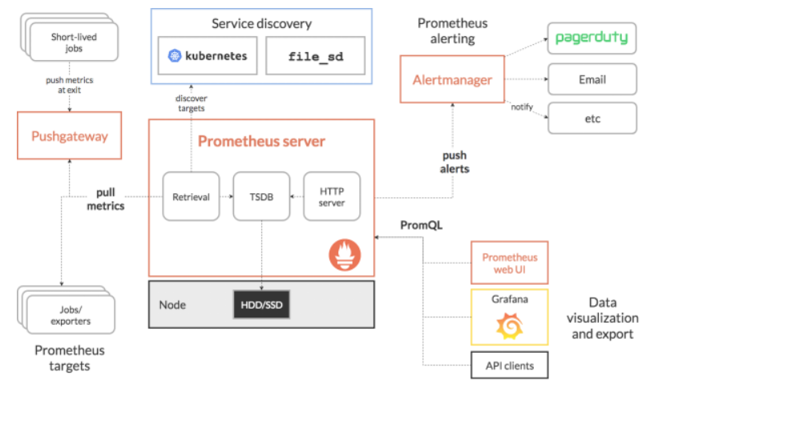
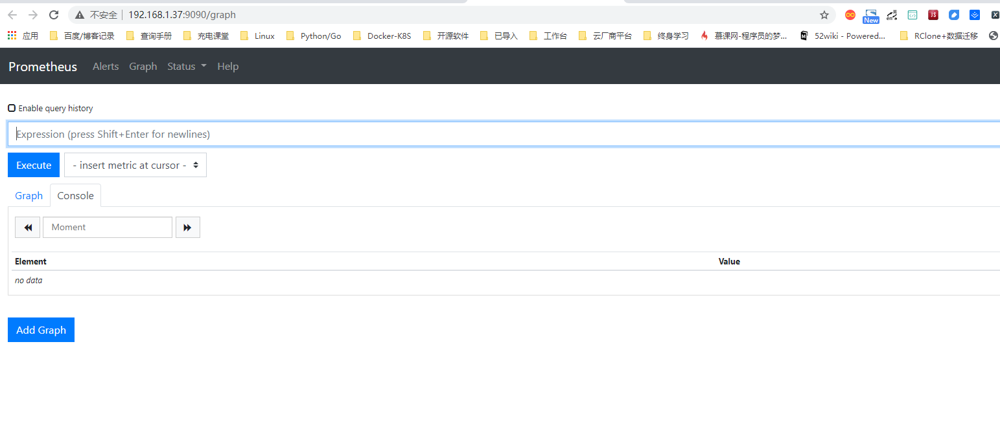
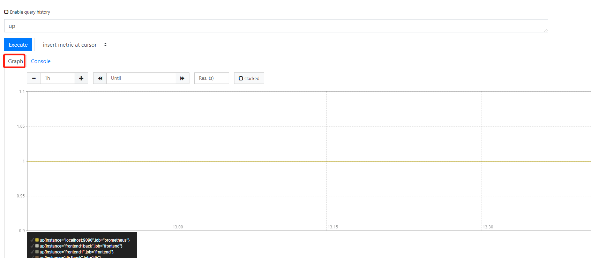
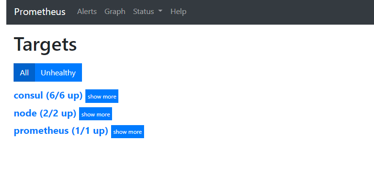

# Prometheus基本概念及部署


## 1 Prometheus架构

　　Prometheus（普罗米修斯）是一个最初在SoundCloud上构建的监控系统。自2012年成为社区开源项目，拥有非常活跃的开发人员和用户社区。为强调开源及独立维护，Prometheus于2016年加入云原生云计算基金会（CNCF），成为继Kubernetes之后的第二个托管项目。

- 官方网站：https://prometheus.io
- 项目托管：https://github.com/prometheus


**Prometheus 由多个组件组成，但是其中许多组件是可选的：**

- Prometheus Server：用于收集指标和存储时间序列数据，并提供查询接口

- client Library：客户端库（例如Go，Python，Java等），为需要监控的服务产生相应的/metrics并暴露给Prometheus Server。目前已经有很多的软件原生就支持Prometheus，提供/metrics，可以直接使用。对于像操作系统已经不提供/metrics，可以使用exporter，或者自己开发exporter来提供/metrics服务。

- push gateway：主要用于临时性的 jobs。由于这类 jobs 存在时间较短，可能在 Prometheus 来 pull 之前就消失了。对此Jobs定时将指标push到pushgateway，再由Prometheus Server从Pushgateway上pull。

**这种方式主要用于服务层面的 metrics：**

- exporter：用于暴露已有的第三方服务的 metrics 给 Prometheus。
- alertmanager：从 Prometheus server 端接收到 alerts 后，会进行去除重复数据，分组，并路由到对收的接受方式，发出报警。常见的接收方式有：电子邮件，pagerduty，OpsGenie, webhook 等。

- Web UI：Prometheus内置一个简单的Web控制台，可以查询指标，查看配置信息或者Service Discovery等，实际工作中，查看指标或者创建仪表盘通常使用Grafana，Prometheus作为Grafana的数据源；

**注：**大多数 Prometheus 组件都是用 Go 编写的，因此很容易构建和部署为静态的二进制文件。




参考文献：

https://www.cnblogs.com/xiangsikai/p/11288632.html


## 2.1 使用二进制文件快速部署

安装步骤参考文献

[CentOS7安装Prometheus(二进制)](https://www.cnblogs.com/xiao987334176/p/11927979.html)


这里我们选择二进制文件安装包进行快速部署。在安装之前，首先在官方网站

下载页面地址https://prometheus.io/download/中找到Prometheus下载列表。


在这里可以下载适用于各平台的二进制文件最新版本。或者，也可以直接在官方的Prometheus GitHub

下载页面地址https://github.com/prometheus/prometheus/releases中选择个人要使用的特定版本，以及对应平台的二进制文件。


### 2.1.1 添加Prometheus为系统服务开机启动

熟悉Linux系统的读者可以在Prometheus当前目录下，直接执行命令：nohup./prometheus&使其后台进行运行即可。但是，我们要对进程执行关闭、重新启动、查看进程状态等操作时，还需配合各种Linux命令才能完成。这里为了方便，将Prometheus添加为系统服务且开机自启动。


可以使用CentOS Linux release 7操作系统中的命令systemctl来管理守护进程Prometheus服务。在/usr/lib/systemd/system目录下添加一个系统服务启动文件，用配置文件prometheus.service

```
[Unit]
Description=Prometheus server daemon
After=network.target

[Service]
Type=simple
User=root
Group=root
# 启动运行prometheus程序所在路径
ExecStart=/data/prometheus/prometheus \
			# 指定prometheus.yml配置文件路径
          --config.file "/data/prometheus/prometheus.yml" \
          --storage.tsdb.path "/data/prometheus/data" \
          --storage.tsdb.retention=15d \
          --web.console.templates="/data/prometheus/consoles" \
          --web.console.libraries="/data/prometheus/console_libraries" \
          # 设置最大连接数
          --web.max-connections=512 \
          --web.external-url"http://192.168.1.37:9090" \
          # prometheus默认监听端口
          --web.listen-address "0.0.0.0:9090" \
          --web.enable-lifecycle
Restart=on-failure

[Install]
WantedBy=multi-user.target
```

设置开机自启动

```
systemctl daemon-reload
systemctl enable prometheus
systemctl stop prometheus
systemctl start prometheus
```

Prometheus启动用配置文件中的WantedBy=multi-user.target指的是，Prometheus所在的Target是multi-user.target。

这个设置非常重要，因为执行systemctl enable prometheus.service命令设置开机自启动时，prometheus.service的一个符号链接，就会放在/etc/systemd/system目录下面的multi-user.target.wants子目录之中。Prometheus启动脚本中用到了systemd的service unit file。

service unit file通常由三部分组成：

+ ［Unit］，提供服务描述信息、启动顺序与依赖关系。 ［Unit］区块有两个常用选项：

```
·Description，服务信息描述。
·After，服务类别描述，定义unit的启动次序。
```

+ ［Service］，服务的关键部分，设置服务运行时使用的一些具体参数。［Service］区块常用选项：

```
·Type，设置进程启动类型，其类型有：
	·simple：默认值，执行ExecStart指定的命令，启动为主进程。
	·forking：进程将在启动过程中使用fork()系统调用，创建后父进程立即退出，而子进程将作为该服务的主进程继续运行。
	·oneshot：与simple类似，不同之处在于该进程必须在systemd启动后继单元之前退出。
	·dbus：类似于simple，但会等待D-Bus信号后启动。
	·notify：当前服务启动完毕，通知systemd再继续往下执行。
	·idle：其他任务执行完毕，当前服务才会运行。
	
·User、Group：设定服务运行的用户和用户组。
·EnvironmentFile：环境配置文件。
·ExecStart：设置启动服务要运行的命令或脚本。
·ExecStartPre：在ExecStart之前执行的命令，语法规则与ExecStart=完全相同。
·ExecStartPost：在ExecStart之后执行的命令，语法规则与ExecStart=完全相同。
·ExecReload：可选指令，设置服务被要求重新载入配置时所执行的命令行。
·ExecStop：可选指令，设置停止服务要运行的命令或脚本。
·Restart：服务进程正常退出、异常退出、被杀死、超时时，是否重新启动该服务，可以设置如下值：
	·no（默认值）：退出后不会重启。
	·on-success：只有正常退出时（退出状态码为0），才会重启。
	·on-failure：非正常退出时（退出状态码非0），包括被信号终止和超时，才会重启。
	·on-abnormal：只有被信号终止和超时，才会重启。
	·on-abort：只有在收到没有捕捉到的信号而终止时，才会重启。
	·on-watchdog：只有超时退出时，才会重启。
	·always：不管是什么退出原因，总是重启。
```

+ ［Install］区块常用选项：

  ```
  ·Alias：可用于启动的别名。
  ·WantedBy：表示该服务所在的Target，即所在服务组。
  ```

  

### 2.1.2 热加载更新配置

在Prometheus的日常维护中，一定会对配置文件prometheus.yml进行再编辑操作，通常对Prometheus服务进行重启动操作即可完成对配置文件的加载。当然也可以通过动态的热加载来更新prometheus.yml中的配置信息，一般热加载有两种方法：

+ 查看Prometheus的进程id，进程发送SIGHUP信号：

```
kill -HUP pid
```

+ 通过HTTP API发送post请求到/-/reload：

```
curl -X POST http://192.168.1.37:9090/-/reload
```

若使用第二种方式进行热加载操作，需要在Prometheus服务启动时指定--web.enable-lifecycle，添加到以上的Prometheus自启动文件中使用。

```
--web.enable-lifecycle     Enable shutdown and reload via HTTP request.
```

无论使用哪种热加载方式，要想热加载更新配置文件成功，必须保证配置信息填写正确。这里可以通过Prometheus提供的工具promtool对prometheus.yml配置文件进行提前核查，示例操作如下：

```
/bin $ ./promtool check config /etc/prometheus/prometheus.yml
Checking /etc/prometheus/prometheus.yml
  SUCCESS: 0 rule files found
```

## 3.使用Docker快速安装

- **官方地址：https://prometheus.io/docs/prometheus/latest/installation/**


**一、prometheus.yml通过运行以下命令将您从主机绑定：**

```
docker run -p 9090:9090 -v /tmp/prometheus.yml:/etc/prometheus/prometheus.yml \
       prom/prometheus
```

**二、或者为配置使用额外的卷：**

```
docker run -p 9090:9090 -v /prometheus-data \
       prom/prometheus --config.file=/prometheus-data/prometheus.yml
```

**注：**普罗米修斯的配置文件的需要指定对。

参考文献：

https://www.cnblogs.com/xiangsikai/p/11288801.html


## 4.Prometheus Web UI

至此，我们已经在物理主机环境或使用Docker容器快速部署好了Prometheus系统环境，需要注意的是防火墙要开通对外提供访问的9090端口。如果使用CentOSLinux release 7操作系统进行Prometheus安装，要注意设置SeLinux状态内容。

完成这些工作后，我们便可以通过浏览器使用Prometheus Web UI，即在浏览器中输入http://IP:9090格式便可进行访问。例如，依据以上安装时的应用信息，访问示例地址http://192.168.1.37:9090，此时默认访问的页面是Graph页面：




Prometheus本身是自带导出器（exporter）的，现在可以在Web UI中查看exporter采集到具体数据，例如，在查询框中输入UP，点击“Execute”按钮后，会在Console选项卡中显示Prometheus服务在线状态的“UP”信息


若点击“Graph”选项卡，则展示“UP”状态




最后，通过访问http://192.168.1.37:9090/targets地址，可以查看页面中的Targets信息



Prometheus内部默认提供许多metric（指标）用于监控操作，这些指标都可以在Web UI中输入查询。如果将Prometheus默认配置文件中的“localhost”修改为主机IP地址http://192.168.1.37:9090/metrics


### 4 Prometheus相关概念

**Prometheus 数据模型**

 Prometheus将所有数据存储为时间序列；具有相同度量名称以及标签属于同一个指标。

每个时间序列都由度量标准名称和一组键值对（也成为标签）唯一标识。

**时间序列格式：**

```
<metric name>{<label name>=<label value>, ...}
```

**示例：**

```
api_http_requests_total{method="POST", handler="/messages"}
```

度量名称{标签名=值}值

HELP 说明指标是干什么的

TYPE 指标类型，这个数据的指标类型

**注：**度量名通常是一英文命名清晰。标签名英文、值推荐英文。

------

**Prometheus 指标类型**

**• Counter：递增的计数器**

　　适合：API 接口请求次数，重试次数。

**• Gauge：可以任意变化的数值**

　　适合：cpu变化，类似波浪线不均匀。

**• Histogram：对一段时间范围内数据进行采样，并对所有数值求和与统计数量、柱状图**

　　适合：将web 一段时间进行分组，根据标签度量名称，统计这段时间这个度量名称有多少条。

　　适合：某个时间对某个度量值，分组，一段时间http相应大小，请求耗时的时间。

**• Summary：与Histogram类似**


### 4.1 Jobs和Instances

在Prometheus中，任何被采集的目标，即每一个暴露监控样本数据的HTTP服务都称为一个实例（Instance），通常对应于单个进程。而具有相同采集目的的实例集合（比如为可伸缩性或可靠性而复制的流程）称为作业（Job）

例如，以下四个复制实例的API服务器作业：

```
job: api-server
	instance1: 1.2.3.4:5670
	instance1: 1.2.3.4:5671
	instance1: 2.2.3.4:5680
	instance1: 3.2.3.4:5681
```

现在看一下在Prometheus中使用prometheus.yml配置文件添加的从Node exporter暴露的服务器中采集监控数据的内容：

```

  - job_name: 'prometheus'
    static_configs:
    - targets: ['localhost:9090']

  - job_name: 'node_exporter'
    static_configs:
    - targets: ['192.168.1.27:9100']
```

在以上Job中，采用静态配置方式定义被监控目标，在当前主机上运行的Nodeexporter监控程序被称为一个实例（Instance），而具有相同目的这些实例，或者是同一个监控进程的多个副本进程则通过每一个作业（Job）进行管理。

除了静态配置每个Job采集实例地址外，Prometheus还可以从自动发现的实例上采集监控数据。

**Prometheus 配置文件详解**

参考文献：

https://www.cnblogs.com/xiangsikai/p/11288835.html


## 5.Prometheus核心组件

Prometheus生态圈系统由多个组件组成，其中许多组件是可选的。大多数Prometheus组件使用Go语言编写而成，这样可以非常容易地构建和部署为静态的二进制文件。我们介绍几个核心组件：

**1.Prometheus服务器**

Prometheus服务器（server）是Prometheus架构中的核心组件，基于Go语言编写而成，无第三方依赖关系，可以独立部署在物理服务器、云主机、Docker容器内。

主要用于收集每个目标数据，并存储为时间序列数据，对外可提供数据查询支持和告警规则配置管理。Prometheus服务器可以对监控目标进行静态配置管理或动态配置管理，它将监控采集到的数据按照时间序列存储在本地磁盘的时序数据库中（当然也支持远程存储），自身对外提供了自定义的PromQL语言，可以对数据进行查询和分析。


**2.Client Library**

Client Library是用于检测应用程序代码的客户端库。在监控服务之前，需要向客户端库代码添加检测，从而实现了Prometheus中metric的类型。所有主要语言和运行时都可以用于客户端库。Prometheus项目提供了官方的客户端库，包括Go、Python、Java/JVM和Ruby。还有第三方客户端库，例如Bash、C++、.Net/C#、Node.js、PHP、Haskell、Erlang和Rust。客户端库负责所有细节，如线程安全和生成Prometheus文本表示格式以响应HTTP请求。由于基于指标的监视不跟踪单个事件，客户端库内存使用不会随着事件的增加而增加。相反，内存与你拥有的监控指标的数量相关。根据库和运行时环境的不同，一些指标通常是由客户端库提供的，比如CPU使用率和垃圾收集统计数据。客户端库不限于以Prometheus文本格式输出指标。Prometheus是一个开放的生态系统，用于生成文本格式的API可以生成其他格式的指标。


**3.Exporter**

用于输出被监控组件信息的HTTP接口统称为Exporter（导出器）。

目前互联网公司常用的组件大部分都有Exporter供直接使用，比如Nginx、MySQL、Linux系统信息（包括磁盘、内存、CPU、网络等）。

Exporter是Prometheus系统中重要的组成部分。在实际中收集监控样本数据都是由Exporter完成的。

Exporter可以是一个独立运行的进程，对外提供一个用于获取监控数据的HTTP服务。Prometheus server只需要定时通过这些Exporter提供的HTTP服务获取监控数据即可。

可以类似理解为我们传统意义上的被监控目标的agent，只是区别在于Exporter不会主动推送监控数据到Prometheus server。

**官方的Exporter列表中包含了常见的绝大多数系统监控指标，比如用于机器性能监控的node_exporter，MySQL数据库监控的mysqld_exporter，以及网络设备监控的snmp_exporter等**。这些已有的Exporter对于监控来说，只需进行很少的配置，就能提供完善的数据指标采集工作。


**4.Pushgateway**

Pushgateway是指用于支持短期临时或批量计划任务工作的数据汇聚节点。主要用于短期的Job，此类Job存在的时间较短，可能在Prometheus来pull之前就自行消失了。所以针对这类Job，设计成可以直接向Pushgateway推送metric，这样Prometheus服务器端便可以定时去Pushgateway拉取metric。另外当某应用系统的网络环境中，Prometheus server和Exporter不能进行直接互通，我们可以使用Pushgateway来进行中转。


**5.Alertmanager**

Alertmanager主要用于处理Prometheus服务器端发送的alerts信息，对其去除重数据、分组并路由到正确的接收方式，发出告警。它支持的告警通知方式非常丰富，常见的通知方式有电子邮件、pagerduty、OpsGenie，webhook等，还可以控制告警的静音和抑制。


## 本章小结

Prometheus核心组件

+ Prometheus server
+ Client Library
+ Exporter
+ Pushgateway
+ Alertmanager

