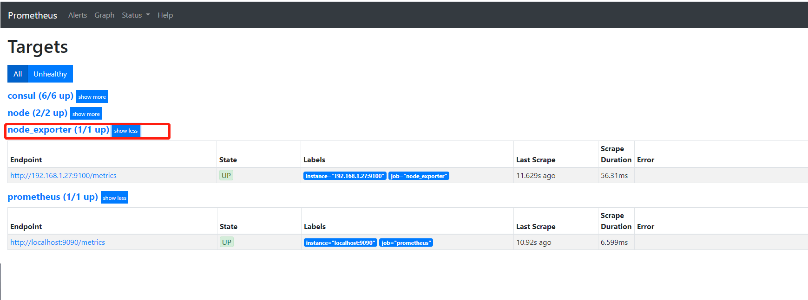
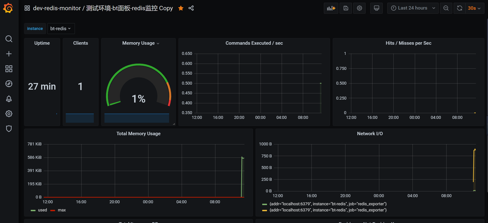
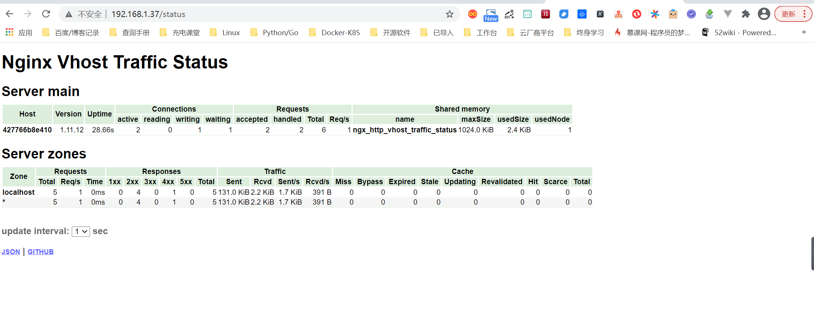
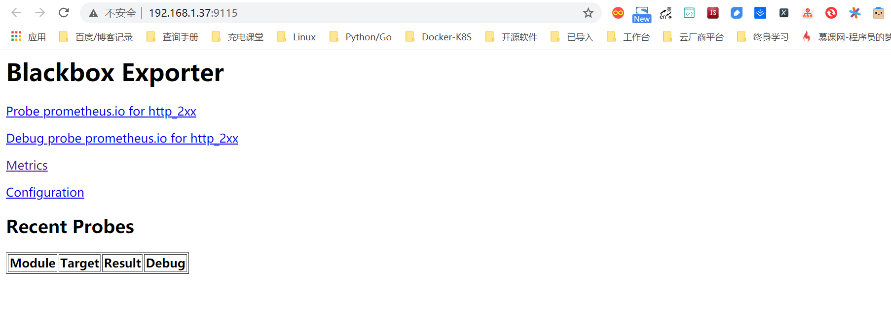
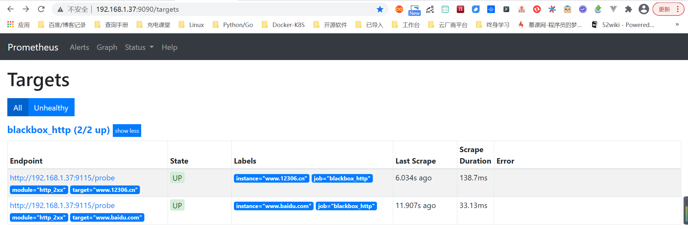
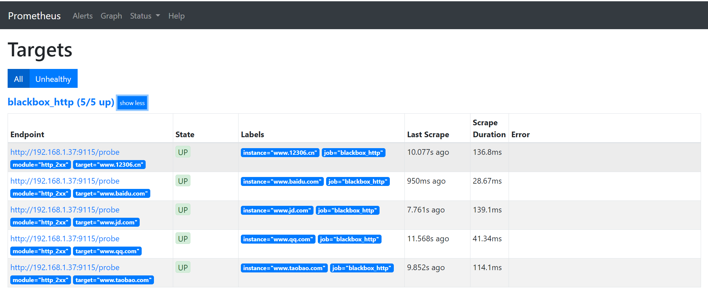
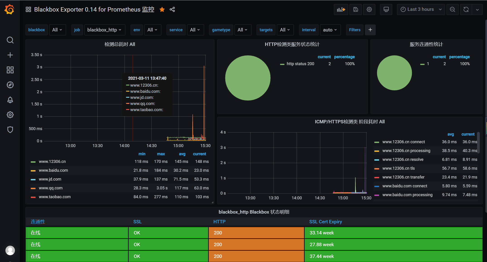
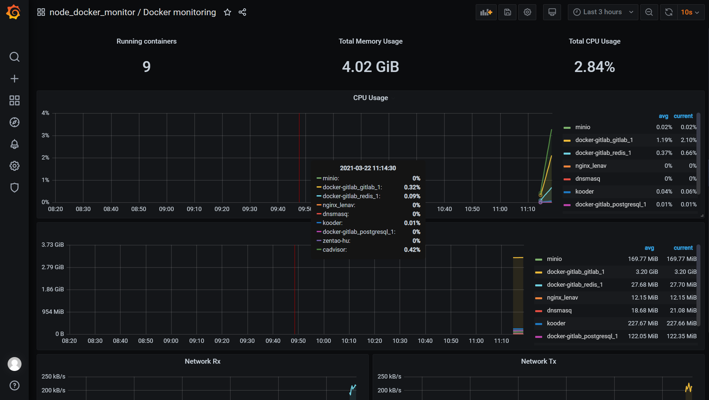

# Prometheus技术基础

## 1.Exporter

Prometheus核心组件中，Exporter是重要的组成部分，在实际中监控样本数据的收集都是由Exporter完成的，Prometheus服务器只需要定时从这些Exporter提供的HTTP服务获取监控数据即可。

本章将对Exporter的类型以及文本数据格式进行说明，讨论如何从官方的Exporter列表获取常用的Exporter，比如用于监控基础设施中服务器性能的node_exporter、wmi_exporter，用于对数据库监控的mysqld_exporter和redis_exporter等。

并对这些获取特定目标监控样本数据的Exporter软件包进行安装集成，最终可以很直观地通过Prometheus Web UI浏览采集到的各类监控数据。


## 2.Exporter类型

通常来说可以将Exporter分为两类：

- 直接采集型。这类Exporter直接内置了相应的应用程序，用于向Prometheus直接提供Target数据支持。这样设计的好处是，可以更好地监控各自系统的内部运行状态，同时也适合更多自定义监控指标的项目实施。例如cAdvisor、Kubernetes等，它们均内置了用于向Prometheus提供监控数据的端点。

  

- 间接采集型。原始监控目标并不直接支持Prometheus，需要我们使用Prometheus提供的Client Library编写该监控目标的监控采集程序，用户可以将该程序独立运行，去获取指定的各类监控数据值。例如，由于Linux操作系统自身并不能直接支持Prometheus，用户无法从操作系统层面上直接提供对Prometheus的支持，因此单独提供Node exporter，还有数据库或网站HTTP应用类等Exporter。

### 2.1 文本数据格式

Prometheus的所有流程都需要使用基于文本的格式。现在我们可以使用浏览器访问已经部署完成的metrics，可以从Prometheus Web UI提供的页面http://192.168.24.17:9090/metrics来获取信息.

```
# HELP go_gc_duration_seconds A summary of the GC invocation durations.
# TYPE go_gc_duration_seconds summary
go_gc_duration_seconds{quantile="0"} 1.6686e-05
go_gc_duration_seconds{quantile="0.25"} 2.3724e-05
go_gc_duration_seconds{quantile="0.5"} 3.4785e-05
go_gc_duration_seconds{quantile="0.75"} 5.5535e-05
go_gc_duration_seconds{quantile="1"} 0.000209371
go_gc_duration_seconds_sum 0.017473216
go_gc_duration_seconds_count 304
# HELP go_goroutines Number of goroutines that currently exist.
# TYPE go_goroutines gauge
go_goroutines 88
# HELP go_info Information about the Go environment.
# TYPE go_info gauge
go_info{version="go1.13.4"} 1
# HELP go_memstats_alloc_bytes Number of bytes allocated and still in use.
# TYPE go_memstats_alloc_bytes gauge
go_memstats_alloc_bytes 4.170512e+07
# HELP go_memstats_alloc_bytes_total Total number of bytes allocated, even if freed.
# TYPE go_memstats_alloc_bytes_total counter
go_memstats_alloc_bytes_total 7.036375856e+09
# HELP go_memstats_buck_hash_sys_bytes Number of bytes used by the profiling bucket hash table.
# TYPE go_memstats_buck_hash_sys_bytes gauge
go_memstats_buck_hash_sys_bytes 1.871112e+06
# HELP go_memstats_frees_total Total number of frees.
```

这些样本数据集合说明如下：

```
·以#HELP开始的行，表示metric的帮助与说明注释，可以包含当前监控指标名称和对应的说明信息。

·以#TYPE开始的行，表示定义metric类型，可以包含当前监控指标名称和类型，类型有Counter、Gauge、Histogram、Summary和Untyped。

·以非#开始的行，即监控样本数据。

·其他一般性注释，方便阅读使用，会被Prometheus忽略。
```


## 2.2 获取Exporter

Prometheus Exporter社区很活跃，提供了支持120+常见开源组件的Exporter，

一些比较有名的技术厂商都专门编写对应的Prometheus Exporter，例如，Oracle编写的Weblogic Exporter，IBM编写的IBM MQ exporter，Kubernetes、etcd都直接内置了基于Exporter规范的Metrics。

在众多的第三方提供的Exporter中，有一些Exporter作为Prometheus GitHub官方组织的一部分进行维护，这些Exporter会被标记为官方。

可以在Prometheus官网https://prometheus.io/docs/instrumenting/exporters/

里看到常用的Node/system metrics exporter（official）和MySQL server exporter（official）。在这些Exporter的名称末尾都标示了（official），即官方进行维护的Exporter。


我们也可以直接到Prometheus GitHub官网https://github.com/prometheus上获取对应的Exporter最新版本。


我们将以下演示环境中用到的应用信息进行汇总，方便大家后续操作中查看

### 2.2.1 测试主机列表及其软件


| 名称                  | IP地址        | 软件信息                           | 端口 |
| --------------------- | ------------- | ---------------------------------- | ---- |
| prometheus            | 192.168.1.x   | prometheus-2.4.0.linux...          | 9090 |
| Grafana               | 192.168.1.x   | grafana-5.2.4-1.x86_64.zip         | 3000 |
| Linux主机             | 192.168.1.x   | node_exporter-0.16.0.linux...      | 9100 |
| Windows主机           | 192.168.1.x   | wmi_exporter-0.5.0-amd64.msi       | 9182 |
| MySQL主机             | 192.168.1.x   | mysqld_exporter-0.11.0.linux...    | 9104 |
| Redis主机             | 192.168.1.xx  | redis-exporter-v0.23.0.linux...    | 9121 |
| Nginx主机             | 192.168.1.xxx | nginx-vts-exporter-0.10.3.linux... | 9913 |
| Blackbox Exporter主机 | 192.168.1.xx  | blackbox_exporter-0.14.0.linux...  | 9115 |

### 2.2.2 软件下载清单

自行百度下载


### 2.2.3 主机监控

#### 1 Linux主机监控

**1.下载部署**

在安装之前，首先在官方下载页面https://prometheus.io/download/找到Nodeexporter列表，下载最新版本中特定平台的二进制文件。或者直接在官方的Prometheus GitHub下载，在https://github.com/prometheus/node_exporter/releases下载指定的Node exporter版本所对应的特定平台的二进制文件。然后开始Node exporter的安装部署以及使用。

```shell
$ curl -OL https://github.com/prometheus/node_exporter/releases/download/v0.17.0/node_exporter-0.17.0.linux-amd64.tar.gz

$ tar zxvf node_exporter-0.17.0.linux-amd64.tar.gz
$ cd node_exporter-0.17.0.linux-amd64
$ mkdir /data/node_exporter
$ mv node_exporter /data/node_exporter/

[root@cicd-dev node_exporter]# ./node_exporter
INFO[0000] Starting node_exporter (version=0.16.0, branch=HEAD, revision=d42bd70f4363dced6b77d8fc311ea57b63387e4f)  source="node_exporter.go:82"
INFO[0000] Build context (go=go1.9.6, user=root@a67a9bc13a69, date=20180515-15:52:42)  source="node_exporter.go:83"
INFO[0000] Enabled collectors:                           source="node_exporter.go:90"
INFO[0000]  - arp                                        source="node_exporter.go:97"
INFO[0000]  - bcache                                     source="node_exporter.go:97"
INFO[0000]  - bonding                                    source="node_exporter.go:97"
INFO[0000]  - conntrack                                  source="node_exporter.go:97"
INFO[0000]  - cpu                                        source="node_exporter.go:97"
INFO[0000]  - diskstats                                  source="node_exporter.go:97"
INFO[0000]  - edac                                       source="node_exporter.go:97"
INFO[0000]  - entropy                                    source="node_exporter.go:97"
INFO[0000]  - filefd                                     source="node_exporter.go:97"
INFO[0000]  - filesystem                                 source="node_exporter.go:97"
INFO[0000]  - hwmon                                      source="node_exporter.go:97"
INFO[0000]  - infiniband                                 source="node_exporter.go:97"
```

先在终端界面启动node_exporter，成功启动后可以看到默认监听端口是9100，其中“Enabled collectors”列是node_exporter默认情况下启用的功能。如果想更换默认监控端口，需要启动时添加参数--web.listen-address=":9200"即可，更多方法可以使用#./node_exporter-h查看相关帮助信息。

添加node_exporter为系统服务开机启动

```shell
$ cat >/usr/lib/systemd/system/node_exporter.service <<EOF
[Unit]
Description=node_exporter
Documentation=https://prometheus.io/
After=network-online.target
[Service]
Type=simple
User=root
Group=root
ExecStart=/data/node_exporter/node_exporter
Restart=on-failure
[Install]
WantedBy=multi-user.target
EOF
```

设置开机自启动

```
systemctl daemon-reload
systemctl enable node_exporter
systemctl stop node_exporter
systemctl start node_exporter
```

```shell
$ ps aux |grep node_exporter
992      12057  0.1  0.1  22216 11352 ?        Ssl  Feb04  52:32 /opt/gitlab/embedded/bin/node_exporter --web.listen-address=localhost:9100 --collector.textfile.directory=/var/opt/gitlab/node-exporter/textfile_collector
root     25878  0.0  0.0 113404  5768 ?        Ssl  09:34   0:00 /data/node_exporter/node_exporter
```

至此，我们完成了对node_exporter的下载安装，并对其进行了系统服务添加和开机自启动设置。

**2.与Prometheus集成**

当启动node_exporter在后台开始工作时，node_exporter和Prometheus还没有进行对接关联，此时，二者只是各自独立运行的应用程序。现在需要将已安装部署好的node_exporter添加到Prometheus服务器中。可以在Prometheus主机目录中，找到主配置文件，使用其中的静态配置功能static_configs来采集node_exporter提供的数据。

在默认配置文件的基础上，重新编辑prometheus.yml文件，添加job与node_exporter进行关联的参考配置内容如下：

```
  - job_name: 'prometheus'
    static_configs:
    - targets: ['localhost:9090']

  - job_name: 'node_exporter'
    static_configs:
    - targets: ['192.168.1.27:9100']
```

注意，这里的YAML语法空格缩进；prometheus.yml配置文件中的prometheus和node_exporter均部署不同的主机上。

进入Targets页面后，可以在列表中看到刚才配置好的node_exporter的状态为“UP”，说明Prometheus最后一次从Node exporter中采集数据是成功的，此刻，被监控的服务器主机工作运行状态是正常的。




当然，我们也可以使用浏览器访问Prometheus web UI提供的graph页面地址http://192.168.1.37:9090/graph，在搜索框中输入“up”进行搜索，或者直接在“Execute”按钮后的选项框中，点击下拉按钮选择最末尾的“up”，再点击“Execute”进行搜索.

**3.metrics查看**

Node exporter服务正常运行时，使用浏览器访问被监控主机的页面地址http://192.168.1.37:9090/metrics，可以直接查看当前被监控主机的样本信息。列举以下常见的几类监控指标。

我们也可以在Prometheus Web UI中的Graph页面中查询到node_memory_MemTotal_bytes信息

由于与内存数据采集相关的metric太多了，在此我们就不一一列举说明，

例如node_memory_MemAvailable_bytes、node_memory_MemFree_bytes、node_memory_SwapFree_bytes等。

然后配置grafana仪表盘，导入9276模板，即可采集。


编写了一个采集linux主机metrics的脚本

`node_exporter.sh`

```
#!/bin/bash
wget https://github.com/prometheus/node_exporter/releases/download/v0.17.0/node_exporter-0.17.0.linux-amd64.tar.gz
tar zxf node_exporter-0.17.0.linux-amd64.tar.gz
mv node_exporter-0.17.0.linux-amd64 /usr/local/node_exporter

cat <<EOF >/usr/lib/systemd/system/node_exporter.service
[Unit]
Description=https://prometheus.io

[Service]
Restart=on-failure
ExecStart=/usr/local/node_exporter/node_exporter

[Install]
WantedBy=multi-user.target
EOF

systemctl daemon-reload
systemctl enable node_exporter
systemctl restart node_exporter
```


批量安装node_exporter脚本

```
# github地址：
https://github.com/zhuqiyang/install-node_exporter-shell
```


#### 2 Windows主机监控

下载页面地址：https://github.com/martinlindhe/wmi_exporter/releases。选择当前最新版本：wmi_exporter-0.5.0-amd64.msi下载到被监控主机。直接双击文件进行快速安装即可。wmi_exporter会自动安装到C:\ProgramFiles\wmi_exporter目录下，安装程序将WMI Exporter设置为Windows服务，并在Windows防火墙中创建入站规则“WMI Exporter（HTTP 9182）”。WMIExporter自动启动运行后，可以启用Windows任务管理，在进程中找到wmi_exporter.exe进程。


在wmi_exporter默认运行情况下，启用了cpu、cs、logical_disk、net、os、service、system、textfile采集监控内容。其他默认没有启用的采集监控内容可以访问GitHub网站https://github.com/martinlindhe/wmi_exporter/blob/v0.5.0/README.md页面进行查看。

后续补充


### 2.2.4 数据库监控

#### 1 MySQL Server exporter

**1.软件下载与部署**

在安装之前，可以在官方下载页面https://prometheus.io/download/中找到mysqld_exporter列表，下载最新版本中特定平台的二进制文件。同样也可以直接在官方的Prometheus GitHub下载页面https://github.com/prometheus/mysqld_exporter/releases中下载指定的mysqld_exporter版本所对应特定平台的二进制文件。


部署可分为以下6个步骤。

1）下载mysqld_exporter

2）解压缩软件包到指定的安装目录。

3）创建MySQL授权用户。连接到MySQL服务器，创建一个用户，例如“mysqld_exporter”。该用户需要拥有PROCESS，SELECT，REPLICATION CLIENT授权，且为了避免有些高负载MySQL服务器过载，为用户设置最大连接限制。可以进行如下操作：

```
mysql> create user 'mysqld_exporter'@'localhost' IDENTIFIED BY 'OSChina@2021';
Query OK, 0 rows affected (0.05 sec)


mysql> grant process, replication client,select on *.* to 'mysqld_exporter'@'localhost';
Query OK, 0 rows affected (0.00 sec)

mysql> flush privileges;
Query OK, 0 rows affected (0.01 sec)

mysql> select host,user from mysql.user;
+-----------+------------------+
| host      | user             |
+-----------+------------------+
| %         | crm              |
| %         | gitee_production |
| %         | root             |
| %         | wiki             |
| %         | zentao           |
| localhost | gitee_production |
| localhost | mysql.session    |
| localhost | mysql.sys        |
| localhost | mysqld_exporter  |
| localhost | root             |
| localhost | wiki             |
| localhost | zentao           |
+-----------+------------------+
```

4）配置数据库认证。mysqld_exports需要连接数据库服务器的用户名和密码，这里可以通过两种方式向exporter提供此内容。

- 使用环境变量。创建一个名为“DATA_SOURCE_NAME”的环境变量，格式如下：

```
export DATA_SOURCE_NAME='user:password@(hostname:3306)/'
```


- 使用配置文件。创建一个文件“.mysqld_exporter.cnf”，并在该文件中输入用户名和密码。格式如下：

```
[client]
user=xxxx
password=xxxx
port=3306
host=127.0.0.1
```


我们选择使用第二种方法，在与“mysqld_exports”文件同目录下创建“.mysqld_exporter.cnf”文件，并添加如下内容

```
[root@localhost mysql_exporter]# cat .mysqld_exporter.cnf
[client]
user=mysqld_exporter
password=OSChina@2021
port=3306
host=192.168.1.61
```

查看目录结构

```shell
$ tree -a mysqld_exporter/
mysql_exporter/
├── LICENSE
├── mysqld_exporter
└── .mysqld_exporter.cnf

$ mkdir -p /data/mysqld_exporter/
$ cp mysqld_exporter /data/mysqld_exporter/
$ cp .mysqld_exporter.cnf /data/mysqld_exporter/
```

5）启动mysqld_exporter

```shell
$ ./mysqld_exporter --config.my-cnf=".mysqld_exporter.cnf"
INFO[0000] Starting mysqld_exporter (version=0.11.0, branch=HEAD, revision=5d7179615695a61ecc3b5bf90a2a7c76a9592cdd)  source="mysqld_exporter.go:206"
INFO[0000] Build context (go=go1.10.3, user=root@3d3ff666b0e4, date=20180629-15:00:35)  source="mysqld_exporter.go:207"
INFO[0000] Enabled scrapers:                             source="mysqld_exporter.go:218"
INFO[0000]  --collect.global_variables                   source="mysqld_exporter.go:222"
INFO[0000]  --collect.slave_status                       source="mysqld_exporter.go:222"
INFO[0000]  --collect.info_schema.tables                 source="mysqld_exporter.go:222"
INFO[0000]  --collect.global_status                      source="mysqld_exporter.go:222"
INFO[0000] Listening on :9104                            source="mysqld_exporter.go:232"
```

6）添加mysqld_exporter，为系统服务启动。

创建系统服务启动配置文件mysqld_exporter.service：

```shell
$ cat > /usr/lib/systemd/system/mysqld_exporter.service <<EOF
[Unit]
Description=Prometheus MySQL Exporter
After=network.target
User=root
Group=root

[Service]
Type=simple
Restart=always
ExecStart=/data/mysqld_exporter/mysqld_exporter \
--config.my-cnf=/data/mysqld_exporter/.mysqld_exporter.cnf \
--collect.global_status \
--collect.auto_increment.columns \
--collect.info_schema.processlist \
--collect.binlog_size \
--collect.info_schema.tablestats \
--collect.global_variables \
--collect.info_schema.innodb_metrics \
--collect.info_schema.query_response_time \
--collect.info_schema.userstats \
--collect.info_schema.tables \
--collect.perf_schema.tablelocks \
--collect.perf_schema.file_events \
--collect.perf_schema.eventswaits \
--collect.perf_schema.indexiowaits \
--collect.perf_schema.tableiowaits \
--collect.slave_status \
--web.listen-address=0.0.0.0:9104
ExecStop=-/sbin/start-stop-daemon --quiet --stop --retry QUIT/5
TimeoutStopSec=5
KillMode=mixed

[Install]
WantedBy=multi-user.target
EOF
```

可以使用命令：#./mysqld_exporter-h查看相关帮助信息，依据实际监控内容配置启动文件。最后可以通过systemctl命令进行各种操作，例如：

```
systemctl daemon-reload
systemctl enable mysqld_exporter.service
systemctl start mysqld_exporter.service
systemctl status mysqld_exporter.service
```

```shell
$ netstat -tunpl|grep 9104
tcp6       0      0 :::9104                 :::*                    LISTEN      11629/mysqld_export
```


综上，我们完成了对mysqld_exporter的下载安装，并对其进行了系统服务添加和开机启动设置。通过浏览器访问主机页面地址http://192.168.1.35:9104/metrics，可以看到此刻采集到的样本数据，mysql_up的值为1，即MySQL为启动运行状态，版本信息为5.7.20，部分内容如下所示：

```
# HELP mysql_up Whether the MySQL server is up.
# TYPE mysql_up gauge
mysql_up 1
# HELP mysql_version_info MySQL version and distribution.
# TYPE mysql_version_info gauge
mysql_version_info{innodb_version="5.7.32",version="5.7.32-log",version_comment="Source distribution"} 1
# HELP mysqld_exporter_build_info A metric with a constant '1' value labeled by version, revision, branch, and goversion from which mysqld_exporter was built.
# TYPE mysqld_exporter_build_info gauge
mysqld_exporter_build_info{branch="HEAD",goversion="go1.10.3",revision="5d7179615695a61ecc3b5bf90a2a7c76a9592cdd",version="0.11.0"} 1
# HELP process_cpu_seconds_total Total user and system CPU time spent in seconds.
# TYPE process_cpu_seconds_total counter
process_cpu_seconds_total 0
# HELP process_max_fds Maximum number of open file descriptors.
# TYPE process_max_fds gauge
process_max_fds 1024
# HELP process_open_fds Number of open file descriptors.
# TYPE process_open_fds gauge
process_open_fds 9
# HELP process_resident_memory_bytes Resident memory size in bytes.
# TYPE process_resident_memory_bytes gauge
process_resident_memory_bytes 5.021696e+06
# HELP process_start_time_seconds Start time of the process since unix epoch in seconds.
# TYPE process_start_time_seconds gauge
process_start_time_seconds 1.61542929271e+09
# HELP process_virtual_memory_bytes Virtual memory size in bytes.
# TYPE process_virtual_memory_bytes gauge
process_virtual_memory_bytes 1.4667776e+07
```

**2.与Prometheus集成**

在Prometheus的配置文件prometheus.yml中的static_configs模块内，继续追加配置内容来采集mysqld_exporter提供的数据。添加的参考配置内容如下：

```

  - job_name: 'mysqld_exporter_node'
    scrape_interval: 10s
    static_configs:
    - targets: ['192.168.1.35:9104']
```

类似地对于可视化配置而言，在Grafana官网选择适用于监控MySQL的模板(过滤条件：name/description=mysql and data source=Prometheus)，复制其ID——12826


**3.metrics**

查看mysqld_exporter服务正常运行时，通过浏览器访问被监控MySQL主机的页面地址http://192.168.1.35:9104/metrics，可以直接查看当前被监控MySQL的采集信息。对于数据库管理员来说，MySQL数据库的性能状态监控内容非常多，但通常必不可少的内容包括查询吞吐量（Query throughput）、查询执行性能（Query execution performance）、连接情况（Connections）和缓冲池使用情况（Buffer pool usage）这四个与基本的性能和资源利用率相关的指标。


1）查询吞吐量

监控任何系统时，我们的主要关注点是确保系统工作有效完成。数据库运行时会完成大量的查询操作，所以监控优先级应该确保MySQL按照预期执行查询。MySQL有一个名为Questions的内部计数器，MySQL术语为“服务器状态变量”。对于客户端应用程序发送的所有语句，该计数器都是递增的。要查询服务器状态变量，可以使用MySQL提供的命令进行查询：

```
mysql> show global status like "Questions";
+---------------+---------+
| Variable_name | Value   |
+---------------+---------+
| Questions     | 4154298 |
+---------------+---------+
1 row in set (0.00 sec)

对应mysqld_exporter采集后再返回的样本数据中，使用
mysql_global_status_questions展示当前的Questions大小
mysql_global_status_queries 4.153952e+06
# HELP mysql_global_status_questions Generic metric from SHOW GLOBAL STATUS.
# TYPE mysql_global_status_questions untyped
mysql_global_status_questions 4.153797e+06
```

（2）查询执行性能

关于查询执行性能表现方面，可以使用MySQL提供的Slow_queries计数器，每当查询的执行时间超过long_query_time参数指定的秒数时，计数器就会增加。默认阈值为10秒。下面使用MySQL提供的命令进行查询：

```
mysql> show global status like "Slow_queries";
+---------------+-------+
| Variable_name | Value |
+---------------+-------+
| Slow_queries  | 0     |
+---------------+-------+
1 row in set (0.00 sec)

对应mysqld_exporter采集后再返回的样本数据中，使用mysql_global_status_slow_queries来展示结果
mysql_global_status_slow_launch_threads 0
# HELP mysql_global_status_slow_queries Generic metric from SHOW GLOBAL STATUS.
# TYPE mysql_global_status_slow_queries untyped
mysql_global_status_slow_queries 0
```

（3）连接情况为了防止MySQL服务器的过载运行，数据库管理员需要根据业务量进行预评估，以便限制客户端连接MySQL的数量。这里使用的MySQL5.7版本，在my.cnf文件配置了最大连接数max_connections=512。使用MySQL提供的命令进行查询，如下所示：

```
mysql> show variables like "max_connections";
+-----------------+-------+
| Variable_name   | Value |
+-----------------+-------+
| max_connections | 500   |
+-----------------+-------+
1 row in set (0.00 sec)


对应mysqld_exporter采集后再返回的样本数据中，mysql_global_variables_max_connections 来展示结果
mysql_global_variables_max_connections 500

数据库管理需要查看MySQL当前实例的连接数，即Threads_connected数值，可使用MySQL提供的命令进行查询，如下所示：
mysql> show global status like "Threads_connected";
+-------------------+-------+
| Variable_name     | Value |
+-------------------+-------+
| Threads_connected | 1     |
+-------------------+-------+
1 row in set (0.00 sec)

mysql_global_status_threads_connected 1
```

当设置的所有可用连接都被占用完时，若再有客户端进行连接MySQL，就会出现连接数过多的错误提示信息。我们可以使用以下相关的监控指标进行核查：

```
# HELP mysql_global_status_connection_errors_total Total number of MySQL connection errors.
# TYPE mysql_global_status_connection_errors_total counter
mysql_global_status_connection_errors_total{error="accept"} 0
mysql_global_status_connection_errors_total{error="internal"} 0
mysql_global_status_connection_errors_total{error="max_connections"} 0
mysql_global_status_connection_errors_total{error="peer_address"} 0
mysql_global_status_connection_errors_total{error="select"} 0
mysql_global_status_connection_errors_total{error="tcpwrap"} 0
# HELP mysql_global_status_connections Generic metric from SHOW GLOBAL STATUS.
# TYPE mysql_global_status_connections untyped
mysql_global_status_connections 7476
```

（4）缓存池使用情况当MySQL默认的存储引擎是InnoDB时，会使用缓冲池来缓存表和索引的数据。即便是初级数据库管理员，在部署MySQL实例时，也会提前预估并在my.cnf文件中配置参数innodb_buffer_pool_size。这是InnoDB最重要的参数，主要作用是缓存innodb表的索引、数据和插入数据，默认值为128M。

通常，当我们查看Innodb_buffer_pool_reads的数量时，使用MySQL提供的命令，如下所示：

```
mysql> show global status like "Innodb_buffer_pool_reads";
+--------------------------+-------+
| Variable_name            | Value |
+--------------------------+-------+
| Innodb_buffer_pool_reads | 1101  |
+--------------------------+-------+
1 row in set (0.01 sec)

对应mysqld_exporter中，可以通过mysql_global_status_innodb_buffer_pool_reads查看指标数量，如下所示：
# HELP mysql_global_status_innodb_buffer_pool_reads Generic metric from SHOW GLOBAL STATUS.
# TYPE mysql_global_status_innodb_buffer_pool_reads untyped
mysql_global_status_innodb_buffer_pool_reads 875
```

若MySQL server集成在Windows操作系统且64位版本时，可以下载对应的软件包，如mysqld_exporter-0.11.0.windows-amd64.tar.gz。在Windows环境中使用可执行程序mysqld_exporter.exe进行相关内容的操作。

总体与Linux操作系统下对MySQL数据的采集过程一样，即Prometheus使用mysqld_exporter采集MySQL的数据，然后对Prometheus进行配置，再获取mysqld_exporter采集到的各项监控指标，数据存放到Prometheus所在服务器的磁盘数据文件中。


参考文献：

[prometheus监控mysql实践](https://zhuanlan.zhihu.com/p/344743604)

[promethus监控mysql](https://www.cnblogs.com/xiao987334176/p/11181033.html)

[promethus监控RDS](https://www.cnblogs.com/xiao987334176/p/12101494.html)


#### 2 Redis exporter 单节点

**1.软件下载与部署**

1）下载redis_exporter。

下载地址为https://github.com/oliver006/redis_exporter/releases。选择当时最新版本redis_exporter-v0.23.0.linux-amd64.tar.gz，对Redis 2.x，3.x，4.x，and 5.x版本均支持。

2）解压缩软件包到指定的安装目录：

```
#进入安装目录下，在终端启动查看信息，成功启动，默认监听端口是9121
[root@localhost redis_exporter]# ./redis_exporter -redis.addr localhost:6379 
INFO[0000] Redis Metrics Exporter v0.23.0    build date: 2018-12-03-17:29:45    sha1: 10045b85b5aaa1c5fa35                                         ba38e3a1aee14f772b31    Go: go1.11.2
INFO[0000] Providing metrics at :9121/metrics
INFO[0000] Connecting to redis hosts: []string{"localhost:6379"}
INFO[0000] Using alias: []string{""}
```

3）添加redis_exporter为系统服务开机启动配置文件redis_exporter.service：

```
[root@localhost redis_exporter]# cat /usr/lib/systemd/system/redis_exporter.service
[Unit]
Description=Prometheus Redis Exporter
After=network.target

[Service]
Type=simple
Restart=always
ExecStart=/data/redis_exporter/redis_exporter \
-redis.addr localhost:6379

[Install]
WantedBy=multi-user.target
```

Redis server若设置过密码登录，以上文件内容需要设置redis连接地址和密码。可以使用命令：#./redis_exporter-h查看相关帮助信息，依据实际监控内容配置启动文件。

同样，可以通过systemctl命令重新加载配置文件，并设置redis_exporter.service为开机自启动后进行开启，查看状态、重启和停止服务操作。

```
systemctl daemon-reload
systemctl enable redis_exporter.service
systemctl start redis_exporter.service
systemctl status redis_exporter.service
```

综上，我们完成了对redis_exporter的下载安装，使用浏览器访问主机页面地址http://192.168.1.35:9121/metrics，可以看到其运行状态为UP，如下所示：

```
# HELP redis_up upmetric
# TYPE redis_up gauge
redis_up{addr="localhost:6379",alias=""} 1
```


**2.与Prometheus集成**

在Prometheus的配置文件prometheus.yml中的static_configs模块内，继续追加配置内容来采集redis_exporter提供的数据。参考配置内容如下：

```
  - job_name: 'redis_exporter'
    scrape_interval: 10s
    static_configs:
    - targets: ['192.168.1.35:9121']
      labels:
        instance: bt-redis
```

配置完成后，仍然需要我们重新启动Prometheus或动态热加载，对配置文件进行加载生效操作。现在，可以在浏览器中输入Prometheus示例页面地址http://192.168.1.37:9090/targets，访问Prometheus Web UI提供的内容，可以看到在Targets页面列表中已经新增了redis_exporter显示项，且redis_exporter状态为“UP”。

**3. 配置 Grafana 的模板**

redis_exporter 在 Grafana 上为我们提供好了 Dashboard 模板：[https://grafana.com/dashboards/763](http://www.eryajf.net/go?url=https://grafana.com/dashboards/763)

下载后在 Grafana 中导入 json 模板就可以看到官方这样的示例截图啦：




参考文献：

https://www.cnblogs.com/xiao987334176/p/12101496.html


#### 3. Redis exporter监控redis集群

参考文献：

https://www.cnblogs.com/fsckzy/p/12053604.html

https://www.cnblogs.com/caoweixiong/p/12736384.html


### 2.2.5 Nginx监控

在Prometheus官方文档中提供了2个Nginx使用的第三方Exporter：Nginxmetric library和nginx-vts-exporter。这里我们使用nginx-vts-exporter对已经安装好的Nginx服务进行监控数据采集。


在安装nginx-vts-exporter前，如果你正在安装Nginx服务，此时，需要安装支持第三方的nginx virtual host traffic status模块，提供对虚拟主机状态信息的访问，它包含当前状态，如服务器、upstreams、缓存，即进行模块加载操作：

```
./configure --add-module=/path/to/nginx-module-vts
```

nginx-module-vts在Nginx官网上的第三方栏目中推荐下载页面地址https://github.com/vozlt/nginx-module-vts，也可以直接使用git进行clone操作git clone git://github.com/vozlt/nginx-module-vts.git。若没有加载nginx-module-vts模块支持，想要通过重新编译加载模块时，需要备份原来的应用环境，再加载此模块。模块加载完成后，需要在Nginx配置文件中添加如下格式的配置内容：

```
http {
    vhost_traffic_status_zone;

    ...

    server {

        ...

        location /status {
            vhost_traffic_status_bypass_stats on;
            vhost_traffic_status_display;
            vhost_traffic_status_display_format html;
        }
    }
}
```

正确添加后，重新加载Nginx配置文件使配置生效，通过浏览器访问/status，可以看到Nginx模块nginx-module-vts已经开始正常运行。



**1.软件下载与部署**

1）下载nginx-vts-exporter。

下载页面地址为https://github.com/hnlq715/nginx-vts-exporter/releases。选择当时最新版本nginx-vts-exporter-0.10.3.linux-amd64.tar.gz，支持nginx-1.4..x版本和nginx-1.6.x以上版本。

2）解压缩软件包到指定的安装目录：

```
# 默认监听端口9913
./nginx-vts-exporter -nginx.scrape_uri http://localhost/status/format/json
```


3）添加nginx-vts-exporter为系统服务开机启动配置文件nginx-vts-exporter.service：

```
[Unit]
Description=Prometheus Nginx VTS Exporter
After=network.target
User=nginx
Group=nginx

[Service]
Type=simple
Restart=always
ExecStart=/data/nginx-vts-exporter/nginx-vts-exporter\
-nginx.scrape_uri http://localhost/status/format/json

[Install]
WantedBy=multi-user.target
```

这里需要注意的是如果没有-nginx.scrape_uri参数，默认访问的状态地址是http://localhost/status。如果想修改访问端口，使用参数-telemetry.addressstring即可。最后可以通过systemctl命令进行各种操作。

综上，我们完成了对nginx-vts-exporter的下载安装，并对其进行了系统服务添加和开机启动设置。使用浏览器访问示例主机页面地址http://192.168.1.379913/metrics，可以查看所有采集数据信息。

**2.与Prometheus集成**

在Prometheus的配置文件prometheus.yml中继续追加static_configs来采集redis_exporter提供的数据。添加的参考配置内容如下：

```
  - job_name: nginx-vts
    static_configs:
      - targets: ['192.168.1.37:9913']
        labels:
          instance: localhost-nginx-vts
```

配置完成后，仍然需要我们重新启动Prometheus或动态热加载配置文件。现在，可以在浏览器中输入Prometheus示例页面地址http://192.168.24.17:9090，访问Prometheus Web UI提供的页面内容，在Targets页面列表中已经新增了nginx-vts-exporter显示项，且nginx-vts-exporter状态为“UP”。

```
curl -X POST http://192.168.1.37:9090/-/reload
```

参考文献：

[使用nginx-module-vts监控各虚拟主机的流量](https://www.cnblogs.com/xiao987334176/p/12870942.html)

[promethus监控nginx](https://www.cnblogs.com/xiao987334176/p/11180652.html)


### 2.2.6  Prometheus之黑盒监控

Exporter的使用可以称为“白盒监控”，即需要把对应的Exporter程序安装到被监控的目标主机上，从而实现对主机各种资源及其状态的数据采集工作。但是由于某些情况下操作技术或其他原因，不是所有的Exporter都能部署到被监控的主机环境中，最典型的例子是监控全国网络质量的稳定性，通常的方法是使用ping操作，对选取的节点进行ICMP测试，此时不可能在他人应用环境中部署相关的Exporter程序。

针对这样的应用的场景，Prometheus社区提供了黑盒解决方案，Blackbox Exporter无须安装在被监控的目标环境中，用户只需要将其安装在与Prometheus和被监控目标互通的环境中，通过HTTP、HTTPS、DNS、TCP、ICMP等方式对网络进行探测监控，还可以探测SSL证书过期时间。


**1.下载安装包**

在安装之前，首先在官方下载页面https://prometheus.io/download/中找到blackbox_exporter列表，下载最新版本中特定平台的二进制文件。

或者直接在官方的Prometheus GitHub下载页面https://github.com/prometheus/blackbox_exporter/releases中下载指定blackbox_exporte版本所对应的特定平台的二进制文件。然后我们开始blackbox_exporter在主机中的安装部署使用工作。


**2.软件安装与部署**

1）官网下载blackbox_exporter

2）解压缩软件包到指定的安装目录。

```
tar -zxvf blackbox_exporter-0.14.0.linux-amd64.tar.gz  -C /data/

cd /data
ln -sv blackbox_exporter-0.14.0.linux-amd64 blackbox_exporter
```

3）添加blackbox_exporter为系统服务开机启动。同样，为了维护方便，将blackbox_exporter添加为系统服务且开机自启动。开始创建系统服务启动配置文件blackbox_exporter.service：

```
[root@localhost blackbox_exporter]# cat /usr/lib/systemd/system/blackbox_exporter.service
[Unit]
Description=blackbox_exporter
After=network.target

[Service]
Type=simple
User=root
Group=root
ExecStart=/data/blackbox_exporter/blackbox_exporter \
          --config.file "/data/blackbox_exporter/blackbox.yml" \
          --web.listen-address ":9115"
Restart=on-failure

[Install]
WantedBy=multi-user.target
```

可以通过systemctl命令进行各种操作。

```
systemctl daemon-reload
systemctl enable blackbox_exporter.service
systemctl start blackbox_exporter.service
systemctl status blackbox_exporter.service
```

```
[root@localhost blackbox_exporter]# ps aux |grep blackbox_exporter
root      1657  0.0  0.0 112764  7956 ?        Ssl  01:19   0:00 /data/blackbox_exporter/blackbox_exporter --config.file /data/blackbox_exporter/blackbox.yml --web.listen-address :9115
root      1670  0.0  0.0 112808   972 pts/1    S+   01:19   0:00 grep --color=auto blackbox_exporter
```

其中配置文件直接使用了默认的blackbox.yml文件，blackbox_exporter正常启动后，可以查看到服务状态为Active：active（running），并且开启默认端口9115进行监听。现在使用浏览器访问示例地址http://192.168.1.37:9115/，



Blackbox Exporter控制台包括允许监控自身的指标，可以点击“Metics”链接，如图中示例，访问地址http://192.168.1.37:9115/metrics可进行查看。控制台还包含最近执行的探测列表，它们的状态以及显示发生的事件的调试日志，这些对于调试探测很有用。

```
# HELP blackbox_exporter_build_info A metric with a constant '1' value labeled by version, revision, branch, and goversion from which blackbox_exporter was built.
# TYPE blackbox_exporter_build_info gauge
blackbox_exporter_build_info{branch="HEAD",goversion="go1.11.5",revision="bba7ef76193948a333a5868a1ab38b864f7d968a",version="0.14.0"} 1
# HELP blackbox_exporter_config_last_reload_success_timestamp_seconds Timestamp of the last successful configuration reload.
# TYPE blackbox_exporter_config_last_reload_success_timestamp_seconds gauge
blackbox_exporter_config_last_reload_success_timestamp_seconds 1.6154435566517625e+09
# HELP blackbox_exporter_config_last_reload_successful Blackbox exporter config loaded successfully.
# TYPE blackbox_exporter_config_last_reload_successful gauge
blackbox_exporter_config_last_reload_successful 1
# HELP go_gc_duration_seconds A summary of the GC invocation durations.
# TYPE go_gc_duration_seconds summary
go_gc_duration_seconds{quantile="0"} 0
go_gc_duration_seconds{quantile="0.25"} 0
go_gc_duration_seconds{quantile="0.5"} 0
go_gc_duration_seconds{quantile="0.75"} 0
go_gc_duration_seconds{quantile="1"} 0
go_gc_duration_seconds_sum 0
go_gc_duration_seconds_count 0
# HELP go_goroutines Number of goroutines that currently exist.
# TYPE go_goroutines gauge
```

配置文件

blackbox_exporter的默认配置文件是blackbox.yml，使用YAML格式，如果格式不符合语法要求，Blackbox Exporter将无法启动。在配置过程中，首先需要在Blackbox Exporter的配置文件中定义监测模块内容，然后在Prometheus Server的配置文件中声明用对应的模块去探测相应的targets。默认配置文件中常用的几个监测模块信息如下.

```
modules:
  http_2xx:
    prober: http
  http_post_2xx:
    prober: http
    http:
      method: POST
  tcp_connect:
    prober: tcp
  pop3s_banner:
    prober: tcp
    tcp:
      query_response:
      - expect: "^+OK"
      tls: true
      tls_config:
        insecure_skip_verify: false
  ssh_banner:
    prober: tcp
    tcp:
      query_response:
      - expect: "^SSH-2.0-"
  irc_banner:
    prober: tcp
    tcp:
      query_response:
      - send: "NICK prober"
      - send: "USER prober prober prober :prober"
      - expect: "PING :([^ ]+)"
        send: "PONG ${1}"
      - expect: "^:[^ ]+ 001"
  icmp:
    prober: icmp
```

**1.http探测配置**

检查HTTP状态，可以使用http探测器。它可以生成HTTP请求使用，如GET或POST方法，配置操作中可以定义请求超时时间，可以使用正则表达式进行相关匹配。首先，我们在blackbox.yml文件中添加HTTP监测模块，

```
modules:
  http_2xx:
    prober: http
    timeout: 10s
    http:
      preferred_ip_protocol: "ip4"
  http_post_2xx:
    prober: http
    http:
      method: POST
      preferred_ip_protocol: "ip4"
  tcp_connect:
    prober: tcp
  pop3s_banner:
    prober: tcp
    tcp:
      query_response:
      - expect: "^+OK"
      tls: true
      tls_config:
        insecure_skip_verify: false
  ssh_banner:
    prober: tcp
    tcp:
      query_response:
      - expect: "^SSH-2.0-"
  irc_banner:
    prober: tcp
    tcp:
      query_response:
      - send: "NICK prober"
      - send: "USER prober prober prober :prober"
      - expect: "PING :([^ ]+)"
        send: "PONG ${1}"
      - expect: "^:[^ ]+ 001"
  icmp:
    prober: icmp
```

配置完成后通过重启BlackboxExporter服务或热加载方式：

```
curl -X POST http://192.168.1.37:9090/-/reload
```

使得配置文件生效。


**2.与Prometheus集成**

与Prometheus进行配置集成，需要在prometheus.yml文件中配置对BlockboxExporter实例的采集任务，以下为添加的参考配置内容：

````
  - job_name: 'blackbox_http'
    metrics_path: /probe
    params:
      module: [http_2xx]
    static_configs:
      - targets:
        - www.12306.cn
        - www.baidu.com
    relabel_configs:
      - source_labels: [__address__]
        target_label: __param_target
      - source_labels: [__param_target]
        target_label: instance
      - target_label: __address__
        replacement: 192.168.1.37:9115	  
````

通过命令curl模拟http请求，可以看到输出的Metrics信息

```
[root@localhost conf]# curl "http://192.168.1.37:9115/probe?module=http_2xx&target=www.12306.cn"
.....

# HELP probe_http_ssl Indicates if SSL was used for the final redirect
# TYPE probe_http_ssl gauge
probe_http_ssl 1
# HELP probe_http_status_code Response HTTP status code
# TYPE probe_http_status_code gauge
probe_http_status_code 200
# HELP probe_http_version Returns the version of HTTP of the probe response
# TYPE probe_http_version gauge
probe_http_version 1.1
# HELP probe_ip_protocol Specifies whether probe ip protocol is IP4 or IP6
# TYPE probe_ip_protocol gauge
probe_ip_protocol 4
# HELP probe_ssl_earliest_cert_expiry Returns earliest SSL cert expiry in unixtime
# TYPE probe_ssl_earliest_cert_expiry gauge
probe_ssl_earliest_cert_expiry 1.641513599e+09
# HELP probe_success Displays whether or not the probe was a success
# TYPE probe_success gauge
probe_success 1
```

URL地址中使用的探针是通过其中的module参数来指定的，而target参数用来指定探测目标，探针所探测的结果通过Metrics的形式返回。从返回的样本中，用户可以获取站点的DNS解析耗时、响应时间、响应状态码、probe_http_ssl指示最终重定向是否使用SSL和指标probe_success为1的成功状态等相关监控指标。

我们可以使用浏览器访问示例地址http://192.168.1.37:9090/targets



如监控目标过多，prometheus.yml文件配置中的targets指定被探测目标地址时，就会使得配置文件过于“臃肿”。现在我们使用“file_sd_configs”重新对prometheus.yml进行配置，操作如下：

```
mkdir /data/PromStack/prometheus/conf/probes -p
vim /data/PromStack/prometheus/conf/probes/http_probes.json
[
    {
        "targets":[
            "www.12306.cn",
            "www.baidu.com",
            "www.taobao.com",
            "www.jd.com",
            "www.qq.com"
        ]
    }
]
```

vim prometheus.yml

```
  - job_name: 'blackbox_http'
    metrics_path: /probe
    params:
      module: [http_2xx]
    file_sd_configs:
      - files:
        - '/etc/prometheus/probes/*.json'
        refresh_interval: 5m
    relabel_configs:
      - source_labels: [__address__]
        target_label: __param_target
      - source_labels: [__param_target]
        target_label: instance
      - target_label: __address__
        replacement: 192.168.1.37:9115
```

热加载使配置文件生效

```
curl -X POST http://192.168.1.37:9090/-/reload
```

同样，使用浏览器访问http://192.168.1.37:9090/targets，可以查看被探测的目标的target实例



在blackbox.yml配置文件中，http_2xx监测模块对http探测类型进行定义，除以上定义内容外，还可以使用headers定义相关的请求头信息，使用body定义请求内容，针对HTTPS类型的服务可以对证书进行自定义设置，有兴趣的读者可以访问官方提供的配置参考，自己进行相关配置，参考地址https://github.com/prometheus/blackbox_exporter/blob/master/example.yml。

对于Blackbox Exporter，其他HTTPS、DNS、TCP、ICMP、SSH等方式对网络进行探测监控的操作过程都与HTTP探测流程一样，我们这里不一一进行演示，实际环境中有需要的读者可以访问https://www.robustperception.io/tag/blackbox_exporter，选择对应的模块内容，再结合官网提供的配置参考进行实际操作。


**3.  grafana中加入blackbox_exporter监控数据**

此模板为9965号模板，数据源选择Prometheus 模板下载地址 https://grafana.com/grafana/dashboards/9965



参考文献：

https://www.cnblogs.com/xiao987334176/p/12022482.html


### 2.2.7 Docker监控

**监控一个容器服务(`常用的监控指标有: 内存，CPU,硬盘，网络，状态`)**

cAdvisor (Container Advisor) 用于收集正在允许的容器资源使用和性能信息。相当于zabbix-agent一样提供一个数据采集的接口

**1.docker部署cAdvisor:**

被监控服务器安装

```
docker run -d   \
--volume=/:/rootfs:ro \
--volume=/var/run:/var/run:ro  \
--volume=/sys:/sys:ro  \
--volume=/var/lib/docker/:/var/lib/docker:ro  \
--volume=/dev/disk/:/dev/disk:ro \
--publish=8890:8080 \
--detach=true \
--name=cadvisor \
google/cadvisor:latest
```

**访问该地址，就能看到实时采集到的数据**

http://192.168.1.25:8890/containers/  

该地址的数据为prometheus识别的数据的接口

http://192.168.1.25:8890/metrics


去监控控制主机上修改prometheus的配置文件,复制一个job文件，job_name 指名称，targets为cAdvisor服务器地址ip和端口

```
  - job_name: "docker"
    static_configs:
    - targets: ['192.168.1.25:8890']
```

开启内核路由转发

```
echo -e "net.ipv4.ip_forward = 1\nnet.ipv4.conf.default.rp_filter = 0 \nnet.ipv4.conf.all.rp_filter = 0" >> /etc/sysctl.conf
sysctl -p
```

热加载使配置文件生效

```
curl -X POST http://192.168.1.37:9090/-/reload
```


http://192.168.1.37:9090/targets 可以看到监控指标说明获取数据成功


**2. 配置 Grafana 的模板**

```text
https://grafana.com/grafana/download    #该地址下载grafana模板
```

使用193模板即可




但是这个模板，无法选择根据主机选择。推荐另外一个模板，它是可以选择主机的。

https://grafana.com/grafana/dashboards/10566


### 2.2.8 kubernets监控

http://www.mydlq.club/article/112/

https://grafana.com/grafana/dashboards/8919

https://grafana.com/grafana/dashboards/16098


## 本章小结

Prometheus监控环境中，具有更好的跨平台和可读性的基于文本的数据格式。

+ Node Exporter对Linux主机进行数据监控采
+ wmi_exporter对Windows主机进行数据监控采集
+ mysqld_exporter对MySQL数据库进行数据监控采集
+ redis_exporter对Redis进行数据监控采集
+ nginx-vts-exporter对nginx服务进行数据监控采集
+ Prometheus的黑盒监控，通过对http的探测示例操作，为其他黑盒探测的使用提供了帮助。

