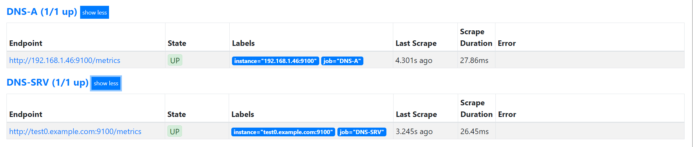

# 服务发现

我们使用各类Exporter分别对操作系统、数据库和HTTP服务进行了数据监控采集。对于所有监控指标对应的target的运行状态和资源使用情况，都使用Prometheus的配置文件prometheus.yml中的静态配置功能static_configs来手工添加主机IP地址和端口，然后与Prometheus进行关联集成。


当仅仅对一组由少数服务器或虚拟机组成的测试环境进行监控系统部署时，这种手工添加信息的操作是最简便的。但是在实际工作环境中，对于成百上千物理服务器组成的庞大主机集群，应该怎样在Prometheus系统中添加这些被监控主机？


特别是在当今最流行的使用容器平台或基于云平台实例的动态集群中，会根据线上各个产品系统总体运行的负载状态，随机动态地创建或销毁实例。

此时，人工手动修改配置文件后重启Prometheus服务或动态热加载使之生效，简直是一件不可想象的工作。幸运的是Prometheus已经为我们解决了这个问题——提供了服务发现（Service Discovery）功能。

我们会对Prometheus发现机制中的基于文件、基于Consul和基于DNS的服务发现进行介绍，使其能完美地解决当前云原生态场景下的各类服务监控项目


## 1.基于文件的服务发现

node_exporter监控指标为示例，prometheus.yml配置文件格式内容如下：

```
scrape_configs:
  - job_name: 'node_exporter'
    static_configs:
    - targets: ['192.168.1.27:9100']
```

可以在浏览器中输入Prometheus示例页面http://192.168.1.37:9090/targets，访问Prometheus Web UI提供的页面内容。


现在，研发和质控部门临时需要增加两台测试服务器，对游戏新版本进行短时性测评。我们的运维人员仅需手动配置prometheus.yml文件，重启Prometheus服务进行加载生效即可。配置文件格式内容如下：

```
scrape_configs:
  - job_name: 'node_exporter'
    static_configs:
    - targets: ['192.168.1.27:9100','192.168.1.28:9100']
    - targets: ['192.168.1.29:9100']
```

从以上配置文件的内容可以看到，只是在同一个job_name中对targets进行了修改。

其中两台服务器在同一个targets中，当然可以再独立添加一个targets，对第三台服务器进行监控数据采集。

但需要注意，虽然是两个targets但job_name还是一样的。

不难看出，如果维护的主机或应用程序数量少时，使用prometheus.yml静态配置功能完成监控系统配置是简单易用的。甚至，随着公司产品业务量的增长，当维护工作的量级增加时，熟悉Ansible配置管理工具的技术人员可以使用Ansible模板来创建目标配置文件。但是，当配置文件急剧增长，targets列表过长，再细心的技术人员也容易出现误操作。此刻，我们应该都想到了拆分配置文件，就像我们使用好多应用配置文件中的“include”功能一样，来提升配置文件的可读性。这就是本小节里我们要说明的基于文件的服务发现。

这些文件可以是JSON或YAML格式的文件，但是文件扩展名必须是JSON文件使用的.json和YAML文件使用的.yml或.yaml扩展名。


每个文件中可以包含人员数据的目标列表，这些配置中定义的格式和静态配置中的是一致的。

Prometheus会定时从已经添加的JSON或YAML格式文件中读取新的targets信息。由于JSON是一种比较流行的格式，互联网上也提供了工具帮助核查JSON语法，我们这里就以JSON格式文件为例说明基于文件的服务发现。


### 1.添加JSON格式文件

代码示例如下：

```
[root@localhost app]# cd /data/PromStack/prometheus/conf
[root@localhost conf]# mkdir targets
[root@localhost targets]# cat dev_node.json
[
  {
    "targets": [
      "192.168.1.27:9100",
      "192.168.1.46:9100"
    ],
    "labels": {
      "env": "dev_webgame"
    }
  }
]
```


2.修改prometheus.yml配置文件

代码示例如下：

```
  - job_name: 'node_exporter_discovery'
    file_sd_configs:
        - files:
          - targets/*.json
          refresh_interval: 60m	
          
·refresh_interval：60m，自定义刷新间隔时间为60秒。
```

这里需要注意，首次添加JSON或YAML格式的动态服务发现文件时，需要重新启动Prometheus服务进行加载配置后才能生效，若再修改配置文件时无须重新启动，Prometheus服务会自动刷新加载文件。

此时使用浏览器访问示例页面地址http://192.168.1.37:9090/targets，可以看到最新targets列表中的已经发现的主机信息


### 2.YAML格式文件

1）添加YAML格式文件。

代码示例如下：

```
[root@localhost node_targets]# cat node.yml
- targets:
  - 192.168.1.35:9100
  - 192.168.1.25:9100
```

2）修改prometheus.yml配置文件。

```
  - job_name: 'node'
    file_sd_configs:
        - files: ['/etc/prometheus/node_targets/*.yml']
          refresh_interval: 5s
```

首次添加YAML格式的动态服务发现文件时，需要重新启动Prometheus服务进行加载配置后才能生效，若再修改配置文件时无须重新启动，Prometheus服务会自动刷新加载文件。此时使用浏览器访问示例页面地址http://192.168.1.37:9090/targets时，可以看到最新targets列表中的主机内容。


参考文献：

[Prometheus 基于文件的服务发现](https://www.cnblogs.com/xiangsikai/p/11289101.html)


基于文件的服务发现仍然是对配置文件进行修改的操作。如果你的应用环境中部署了配置管理工具，例如Ansible、SaltStack、Puppet等工具，再或配合CMDB（配置管理数据库）就可以使用编写好的模板生成服务器、容器或各类应用服务列表的动态配置文件，然后Prometheus定时刷新重新加载目标文件，最终实现服务自动发现功能。


## 2.基于Consul的服务发现

基于Consul的服务发现是一种使用网络的服务发现机制和配置工具，是使用Go语言开发的，部署安装较为简单，具有分布式、高可用性和极高的可扩展性。它提供了以下几个关键功能。

```
·服务发现：Consul通过HTTP API和DNS进行服务注册和服务发现。对于外部服务（如SaaS提供者）也可以注册。

·健康检查：Consul支持对各类服务运行状态的健康检查工作，能够迅速向管理员告警集群中的任何问题，可以防止将流量路由到问题或故障主机，可动态监视服务运行状况并适当更新服务注册表。

·键/值存储：键/值存储可以灵活地进行存储动态配置、功能标记、协调和领导者选举等。简单的HTTP API使其易于在任何地方使用。

·多数据中心：Consul支持单一数据中心，可扩展以支持多个数据中心，并且无须复杂的配置。

·服务分割：通过自动TLS加密和基于身份的授权实现安全的服务间通信。
```


### 2.1 Consul体验应用信息

Linux操作系统版本为CentOS Linux release 7.5.1804（Core）x86_64。

Consul选择下载版本为consul_1.4.0_linux_amd64.zip。


我们在Prometheus服务器上安装Consul软件包，用来在本地获取node_exporter的服务实例信息。


#### 2.1.1 软件下载与部署

下载页面地址：https://www.consul.io/downloads.html.

选择当时最新支持Linux系统的64-bit版本：consul_1.4.0_linux_amd64.zip，下载到被部署的主机上进行安装。

如果选择历史版本，可以在官方的GitHub地址https://github.com/hashicorp/consul/releases选择下载。


##### 2.1.1.1 服务化部署Consul高可用集群

在被监控主机上进行Consul安装操作：

```
mkdir -p /data/consul
// 处理压缩包
cat consul_1.4.0_linux_amd64.zip.zip.00* >consul_1.4.0_linux_amd64.zip.zip
unzip consul_1.4.0_linux_amd64.zip.zip
mv consul_1.4.0_linux_amd64.zip.1 consul_1.4.0_linux_amd64.zip
unzip consul_1.4.0_linux_amd64.zip -d /data/consul/

[root@localhost consul]# ./consul --help
```

完成Consul安装后，初次体验Consul的使用，最简单的是使用开发者模式在本地终端快速创建一个单节点的Consul环境。但是，此种模式不能在线上生产环境中使用，因为它不会持久化任何状态。Consul必须启动agent才可使用，它是运行在Consul集群中每个成员上的守护进程，该进程负责维护集群中成员信息、注册服务、查询响应、运行检查等功能。

现在我们使用定义配置文件方式，将本地运行的node_exporter通过服务的方式进行Consul服务注册。首先创建JSON格式的配置文件：

```
[root@localhost consul]# cat /data/consul/consul.d/node_exporter.json
{
  "service": {
    "id": "node_exporter",
    "name": "node_exporter",
    "tags": [
      "dev_games"
    ],
    "address": "127.0.0.1",
    "port": 9100
  }
```


agent指令是Consul的核心，可以运行为Server或Client模式，操作如下：

**server模式初始化集群**

```
cat >start_consul.sh<<'EOF'
nohup consul agent -server -bootstrap-expect 1 -data-dir /data/consul/consul.d -node=server-1 \
-bind=192.168.1.35 -ui -client 0.0.0.0 > ./consul.log &
EOF


[root@localhost consul]# sh start_consul.sh
[root@localhost consul]# nohup: redirecting stderr to stdout

[root@localhost consul]# cat consul.log
BootstrapExpect is set to 1; this is the same as Bootstrap mode.
bootstrap = true: do not enable unless necessary
==> Starting Consul agent...
==> Consul agent running!
           Version: 'v1.4.0'
           Node ID: 'aa4db749-114d-8702-3a66-1f77aa1cf9b1'
         Node name: 'server-1'
        Datacenter: 'dc1' (Segment: '<all>')
            Server: true (Bootstrap: true)
       Client Addr: [0.0.0.0] (HTTP: 8500, HTTPS: -1, gRPC: -1, DNS: 8600)
      Cluster Addr: 192.168.1.35 (LAN: 8301, WAN: 8302)
           Encrypt: Gossip: false, TLS-Outgoing: false, TLS-Incoming: false

==> Log data will now stream in as it occurs:
```


```
//查看集群成员
[root@localhost ~]# consul members
Node    Address            Status  Type    Build  Protocol  DC   Segment
test    192.168.1.35:8301  alive   server  1.4.0  2         dc1  <all>
```


**client模式加入集群**

工作节点1

```
docker run -d --name=consul -p 8301:8301 -p 8301:8301/udp -p 8500:8500 -p 8600:8600 -p 8600:8600/udp --restart=always progrium/consul -join 192.168.1.35 -advertise 192.168.1.25 -client 0.0.0.0 -node=node01
```


```
//查看集群成员
[root@localhost ~]# consul members
Node      Address            Status  Type    Build  Protocol  DC   Segment
server-1  192.168.1.35:8301  alive   server  1.4.0  2         dc1  <all>
node01    192.168.1.25:8301  alive   client  0.5.2  2         dc1  <default>
```


参考文献：

https://www.cnblogs.com/dalianpai/p/12269024.html


##### 2.1.1.2 Docker搭建consul集群

1.启动第一个consul服务：consul1 

```
docker run --name consul1 -d -p 8500:8500 -p 8300:8300 -p 8301:8301 -p 8302:8302 -p 8600:8600 consul:1.2.2 agent -server -bootstrap-expect 2 -ui -bind=0.0.0.0 -client=0.0.0.0
```

```
8500 http 端口，用于 http 接口和 web ui
8300 server rpc 端口，同一数据中心 consul server 之间通过该端口通信
8301 serf lan 端口，同一数据中心 consul client 通过该端口通信
8302 serf wan 端口，不同数据中心 consul server 通过该端口通信
8600 dns 端口，用于服务发现
-bbostrap-expect 2: 集群至少两台服务器，才能选举集群leader
-ui：运行 web 控制台
-bind： 监听网口，0.0.0.0 表示所有网口，如果不指定默认为127.0.0.1，则无法和容器通信
-client ： 限制某些网口可以访问
```

**获取 consul server1 的 ip 地址**

```
[root@localhost consul]# docker inspect --format '{{ .NetworkSettings.IPAddress }}' consul1
172.17.0.2
```


2.启动第二个consul服务：consul2， 并加入consul1（使用join命令）

```
docker run --name consul2 -d -p 8501:8500 consul agent -server -ui -bind=0.0.0.0 -client=0.0.0.0 -join 172.17.0.2
```


3.启动第三个consul服务：consul3，并加入consul1

```
docker run --name consul3 -d -p 8502:8500 consul agent -server -ui -bind=0.0.0.0 -client=0.0.0.0 -join 172.17.0.2
```


4. 查看运行的容器（consul集群状态）
```
[root@localhost consul]# docker exec -it consul1 consul members
Node          Address          Status  Type    Build  Protocol  DC   Segment
229dd9e105a4  172.17.0.2:8301  alive   server  1.2.2  2         dc1  <all>
6f62c9f56b1a  172.17.0.4:8301  alive   server  1.9.1  2         dc1  <all>
a7ecac245c66  172.17.0.3:8301  alive   server  1.9.1  2         dc1  <all>
```

 

**docker-compose部署consul集群**

docker-compose.yaml 

```yaml
version: '3'
networks:
  mynet:

services:
  consul-server1:
    image: consul:latest
    hostname: "consul-server1"
    container_name: "consul-server1"
    ports:
      - "8500:8500"
      - "8300:8300"
      - "8301:8301"
      - "8302:8302"
      - "8600:8600"
      - "53"
    volumes:
      - ./consul/data1:/consul/data
    command: "agent -server -bootstrap-expect 2 -ui -bind=0.0.0.0 -client=0.0.0.0 -datacenter=dc1"
    networks:
      - mynet

  consul-server2:
    image: consul:latest
    hostname: "consul-server2"
    container_name: "consul-server2"
    ports:
      - "8501:8500"
      - "53"
    volumes:
      - ./consul/data2:/consul/data
    command: "agent -server -ui -bind=0.0.0.0 -client=0.0.0.0 -join consul-server1 -datacenter=dc1 "
    depends_on:
      - consul-server1
    networks:
      - mynet

  consul-server3:
    image: consul:latest
    hostname: "consul-server3"
    container_name: "consul-server3"
    ports:
      - "8502:8500"
      - "53"
    volumes:
      - ./consul/data3:/consul/data
    command: "agent -server -ui -bind=0.0.0.0 -client=0.0.0.0 -join consul-server1 -datacenter=dc1"
    depends_on:
      - consul-server1
    networks:
      - mynet


  consul-node1:
    image: consul:latest
    hostname: "consul-node1"
    container_name: "consul-node1"
    command: "agent -join consul-server1 -datacenter=dc1"
    depends_on:
      - consul-server1
    networks:
      - mynet

  consul-node2:
    image: consul:latest
    hostname: "consul-node2"
    container_name: "consul-node2"
    command: "agent -join consul-server1 -disable-host-node-id -datacenter=dc1"
    depends_on:
      - consul-server1
    networks:
      - mynet
```

测试验证

```shell
$ docker exec -it consul-server1 consul members
Node            Address          Status  Type    Build   Protocol  DC   Partition  Segment
consul-server1  172.20.0.2:8301  alive   server  1.11.1  2         dc1  default    <all>
consul-server2  172.20.0.4:8301  alive   server  1.11.1  2         dc1  default    <all>
consul-server3  172.20.0.5:8301  alive   server  1.11.1  2         dc1  default    <all>
consul-node1    172.20.0.3:8301  alive   client  1.11.1  2         dc1  default    <default>
consul-node2    172.20.0.6:8301  alive   client  1.11.1  2         dc1  default    <default>
```

 访问测试

注意服务器端口开放情况与防火墙拦截

http://192.168.1.133:8500/ui


#### 2.1.2 服务注册发现

Consul服务注册提供了两种注册方法：

一种是定义配置文件服务注册方法，即在配置文件中定义服务来进行注册；

一种是HTTP API服务注册方法，即在启动后由服务自身通过调用API进行自我注册。

接下来，我们要注册服务到 Consul 中，可以通过其提供的 API 标准接口来添加。那么先注册一个测试服务，该测试数据为本机 `node-exporter` 服务信息，服务地址及端口为 `node-exporter` 默认提供指标数据的地址，执行如下命令：

```
curl -X PUT -d '{
  "id": "vm-192.168.1.133",
  "name": "node-exporter-vm",
  "address": "192.168.1.133",
  "port": 9100,
  "tags": [
    "prometheus"
  ],
  "checks": [
    {
      "http": "http://192.168.1.133:9100/metrics",
      "interval": "5s"
    }
  ]
}'  http://192.168.1.133:8500/v1/agent/service/register
```


提一下，如果要注销掉某个服务，可以通过如下 API 命令操作，例如注销上边添加的 `node-exporter` 服务

```
curl -X PUT http://192.168.1.133:8500/v1/agent/service/deregister/vm-192.168.1.133
```


#### 2.1.3 Consul与Prometheus集成


Consul完成了服务的发现和注册后，维护着整个应用环境中的所有服务信息。此时，通过Prometheus与Consul的交互便可自动获取已经注册的node_exporter的信息。我们需要对Prometheus的配置文件prometheus.yml进行编辑，添加如下基于Consul的服务发现内容：

```
  - job_name: 'consul_node'
    honor_labels: true
    consul_sd_configs:
      - server: '192.168.1.133:8500'
    relabel_configs:
      - source_labels: ['__meta_consul_service_id']
        regex: 'consul'
        action: drop
      - source_labels: ['__meta_consul_service']
        target_label: appname
      - source_labels: ['__meta_consul_service_address']
        target_label: instance
      - source_labels: ['__meta_consul_tags']
        target_label: job
```

配置完后，热加载prometheus的配置文件

```
curl -X POST http://192.168.1.37:9090/-/reload
```

查看http://192.168.1.37:9090/targets界面信息


进行服务注册

```
curl -X PUT -d '{
  "id": "node-exporter",
  "name": "node-exporter-192.168.1.34",
  "address": "192.168.1.34",
  "port": 9100,
  "tags": [
    "prometheus"
  ],
  "checks": [
    {
      "http": "http://192.168.1.34:9100/metrics",
      "interval": "5s"
    }
  ]
}'  http://192.168.1.35:8500/v1/agent/service/register
```


**Prometheus配置consul服务发现**

consul 可以使用的元标签：

```
__meta_consul_address：目标的地址
__meta_consul_dc：目标的数据中心名称
__meta_consul_tagged_address_<key>：每个节点标记目标的地址键值
__meta_consul_metadata_<key>：目标的每个节点元数据键值
__meta_consul_node：为目标定义的节点名称
__meta_consul_service_address：目标的服务地址
__meta_consul_service_id：目标的服务ID
__meta_consul_service_metadata_<key>：目标的每个服务元数据键值
__meta_consul_service_port：目标的服务端口
__meta_consul_service：目标所属服务的名称
__meta_consul_tags：标记分隔符连接的目标的标记列表
```

参考文献：

https://www.cnblogs.com/dalianpai/p/13690788.html

[Docker+Consul+Registrator 实现服务注册与发现](https://www.cnblogs.com/xiangsikai/p/10058541.html)

https://www.bookstack.cn/read/prometheus-book/sd-service-discovery-with-consul.md

## 3.基于DNS的服务发现

在大型互联网服务应用架构中，我们使用主机或容器架构的集群通常对外不暴露IP地址，甚至对应用使用人员也不暴露IP地址。这就要求在一个较大的内部局域网或专有网络中部署DNS解析服务，使用DNS服务来完成内部网络中成千上万个域名或主机的解析工作。此时，我们可以使用DNS解析服务中的SRV资源记录功能来实现服务发现。


DNS SRV是DNS资源记录中的一种记录类型，用来指定服务地址和服务端口，并且可以设置每个服务地址的优先级和权重。访问服务的时候，本地的DNS resolver从DNS服务器查询到一个地址列表，根据优先级和权重，从中选取一个地址作为本次请求的目标地址。SRV的记录格式如下：

```
_service._proto.name. TTL class SRV priority weight port target.
```

```
SRV的记录格式说明如下。

·-service：服务名称，前缀“_”是为防止与DNS Label（普通域名）冲突。
·proto：服务使用的通信协议，通常是TCP或UDP协议。
·name：此记录有效域名，以.（点）结束。
·TTL：标准DNS TTL字段，设置缓存有效时间。
·class：标准DNS class字段，例如IN。
·priority：该记录优先级，数值越小优先级越高，范围0～65535。
·weight：该记录的权重，数值越大权重越高，范围0～65535。
·port：服务使用的端口号。
·target：提供服务的主机地址名称，以.（点）结束。
```

### 3.1 自建DNS服务SRV记录设置

在自建DNS服务器配置文件中，手工或使用自动化工具批量生产被监控服务的SRV记录，示例内容如下：

这里没有使用named，而是使用的dnsmasq来做的测试，添加SRV记录完成后，需要重启dnsmasq服务使其生效。

```
#解析日志
log-queries

#域名与IP映射
# 添加test0解析
address=/test0.example.com/192.168.1.46

# 添加 mini SRV 记录
srv-host =_prometheus._tcp.example.com,test0.example.com,9100
```

修改服务器的dns为dnsmasq服务器地址。进行解析

```
[root@localhost conf]# dig +noall +answer SRV _prometheus._tcp.example.com
_prometheus._tcp.example.com. 0 IN      SRV     0 0 9100 test0.example.com.
```

Prometheus服务中与其集成关联。编辑prometheus.yml文件，添加如下内容：

前提是访问：http://192.168.1.34:9100/metrics正常获取数据。

```
  - job_name: 'DNS-SRV'
    metrics_path: "/metrics"
    dns_sd_configs:
    - names: ['_prometheus._tcp.example.com']
```


### 3.2 DNA A记录

发现配置，首先你内网需要有一个DNS服务器，或者直接自行配置解析记录即可，我这里使用的dnsmasq服务在内网测试

```
#域名与IP映射
# 添加test0解析
address=/test0.example.com/192.168.1.46
```


Prometheus配置

```
  - job_name: 'DNS-A'
    metrics_path: "/metrics"
    dns_sd_configs:
    - names: ['test0.example.com']
      type: A
      port: 9100
```


重启Prometheus 在targets中可以看到dns-a记录和SRV 记录




参考文献：

https://www.jianshu.com/p/82547be86ed0


## 4.小结

介绍了几种Prometheus服务发现机制，

包括：

+ 基于文件，由外部数据源填充。
+ 基于Consul，使用网络服务自动注册的服务发现。
+ 基于DNS，使用SRV记录的服务发现。