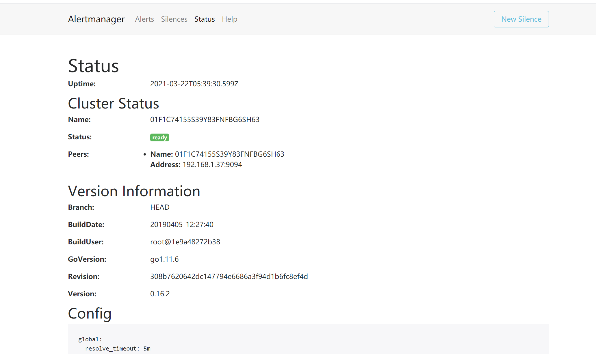

# 告警处理

告警是整个监控系统中重要的组成部分，在Prometheus监控体系中，指标的采集存储与告警是分开的。告警规则是在Prometheus server端定义的，告警规则被触发后，才会将信息发送给独立组件Alertmanager上，经过对告警的处理后，最终通过接收器（如Email）通知用户。

我们在使用Prometheus进行告警时，首要的问题是，什么时候应该发出告警？一个好的告警是在正确的时刻、因正确的理由、踏着正确的节奏发送，并在其中放入真实有用的信息。我们发出告警的时刻一定是重要的系统或服务出现异常，导致最终用户体验不佳或无法正常使用服务，并需要人工检查。要针对最终用户的潜在痛点进行告警，才能使告警的数量保持较小，从而防止对系统或服务进行过度监控。保持小而重要的告警数量，是告警的一个关键原则，也就是说告警应该是重要的、可操作的和真实的。在实际工作中，要减少管理员在半夜接到痛苦的误报。


## 1.Alertmanager部署

在Prometheus生态架构中，告警是由独立的两部分组成。

其中Prometheus server与Alertmanager是相互分离的两个组件。

我们使用Prometheus server采集各类监控指标，然后基于PromQL对这些指标定义阈值告警规则（Rules）。Prometheus server对告警规则周期性地进行计算，如果满足告警触发条件，便生成一条告警信息，并将其推送到Alertmanager组件。收到告警信息后，Alertmanager会处理告警，进行分组（grouping）并将它们路由（routing）到正确的接收器（receiver），如Email、PagerDuty和HipChat等，最终把异常事件的通知发送给接收者。


### 1.1 1.告警分组

分组机制（Grouping）是指，AlertManager将同类型的告警进行分组，合并多条告警到一个通知中。在实际环境中，特别是云计算环境中的业务线之间密集耦合时，若出现多台设备宕机，可能会导致成百上千个告警被触发。在这种情况下使用分组机制，可以将这些被触发的告警合并为一个告警进行通知，从而避免瞬间突发性地接收大量的告警通知，使得管理员无法对问题进行快速定位。例如，在一个Kubernetes集群中，运行着重量级规模数量的实例，即便是集群中持续一小段时间的网络延时或间歇式断开，也会引起大量应用程序无法连接数据库的故障。如果我们在Prometheus告警规则中配置为每一个服务实例都发送告警，那么最后的结果就是大量的告警被发送到Alertmanager中心。其实，作为集群管理员，可能希望在一个通知中就能快速查看是哪些服务实例被本次故障影响了。此时，对服务所在集群或者告警名称进行分组打包配置，将这些告警紧凑在一起成为一个“大”的通知时，管理员就不会受到告警的频繁“轰炸”。告警分组、告警时间和告警接收器均是通过Alertmanager的配置文件来完成配置的。


### 1.1.2 告警抑制

Alertmanager的抑制机制（Inhibition）是指，当某告警已经发出，停止重复发送由此告警引发的其他异常或故障的告警机制。在生产环境中，例如IDC托管机柜中，若每个机柜接入层仅仅是单台交换机，那么该机柜接入交换机故障会造成机柜中服务器非UP状态告警；再有服务器上部署的应用不可访问也会触发告警。此时，可以配置Alertmanager忽略由交换机故障造成的机柜所有服务器及其应用不可访问而产生的告警。在我们的灾备体系中，当原集群故障宕机业务彻底无法访问时，会把用户流量切换到灾备集群中，这样为故障集群及其提供的各个微服务状态发送告警就失去了意义，此时，Alertmanager的抑制机制在一定程度上避免了管理员收到过多的触发告警通知。抑制机制也是通过Alertmanager的配置文件进行设置的。


### 1.1.3 告警静默

告警静默（Silences）提供了一个简单的机制，可以根据标签快速对告警进行静默处理。对传入的告警进行匹配检查，如果接收到的告警符合静默的配置，Alertmanager则不会发送告警通知。管理员可以直接在Alertmanager的Web界面中临时屏蔽指定的告警通知。


### 1.1.4 使用二进制文件方式安装

因为Alertmanager也是基于Go语言编写而成，因此可以直接使用官方提供的二级制文件安装包，解压缩后快速安装。

在官方网站下载页面https://prometheus.io/download/中找到Alertmanager下载列表，在这里可以下载各平台的二进制文件最新版本。

也可以直接在官方的Prometheus GitHub下载页面https://github.com/prometheus/alertmanager/releases中选择个人要使用的指定版本对应的平台的二进制文件。

1）官网下载Alertmanager完成后，获取软件包的哈希值

```
[root@localhost app]# sha256sum alertmanager-0.16.2.linux-amd64.tar.gz
73708254747162731737c4ac367ba52e68117a0d7e4580fbbd4bb5ca919909e7  alertmanager-0.16.2.linux-amd64.tar.gz
```


2）解压缩软件包到指定的安装目录。

```
[root@localhost app]# tar zxvf alertmanager-0.16.2.linux-amd64.tar.gz -C /data/
alertmanager-0.16.2.linux-amd64/
alertmanager-0.16.2.linux-amd64/LICENSE
alertmanager-0.16.2.linux-amd64/alertmanager.yml
alertmanager-0.16.2.linux-amd64/alertmanager
alertmanager-0.16.2.linux-amd64/amtool
alertmanager-0.16.2.linux-amd64/NOTI

[root@localhost app]# cd /data/
[root@localhost data]# chown -R root:root alertmanager-0.16.2.linux-amd64/
[root@localhost data]# ln -sv alertmanager-0.16.2.linux-amd64 alertmanager
‘alertmanager’ -> ‘alertmanager-0.16.2.linux-amd64’
```


3）添加Prometheus为系统服务开机启动。

可以通过`nohup ./alertmanager &`使其在后台运行,

为了方便使用，可将alertmanager添加为系统服务且开机自启动，操作如下：


vim /usr/lib/systemd/system/alertmanager.service

```
[Unit]
Description=Prometheus Alertmanager Service daemon
After=network.target

[Service]
Type=simple
User=root
Group=root
ExecStart=/data/alertmanager/alertmanager \
          --config.file "/data/alertmanager/alertmanager.yml" \
          --storage.path="/data/alertmanager/data/" \
          --data.retention=120h \
          --web.external-url "http://192.168.1.37:9093" \

          --web.listen-address=":9093"
Restart=on-failure

[Install]
WantedBy=multi-user.target
```

```
systemctl disable alertmanager.service
systemctl enable alertmanager.service
systemctl status alertmanager.service
systemctl restart alertmanager.service
```

现在可以通过浏览器访问示例地址http://192.168.1.37:9093/#/status，会看到Alertmanager运行时的状态或集群状态、版本信息和默认的配置文件信息




### 1.1.5 使用Docker安装

1）下载Alertmanager镜像：

```
docker pull prom/alertmanager
```


2）添加Alertmanager使用的配置文件。可以下载Prometheus github中提供的简单示例文件，或者使用二进制安装包中的默认配置：https://github.com/prometheus/alertmanager/blob/master/doc/examples/simple.yml，这里有快速部署演示，复制使用二进制安装包中默认的alertmanager.yml文件，文件路径为示例安装位置：

```
/data/alertmanager/simple.yml
```


3）运行Alertmanager镜像：

```
[root@localhost alertmanager]# docker run -d -p 9093:9093 -v /data/alertmanager/alertmanager.yml:/etc/alertmanager/config.yml --name alertmanager prom/alertmanager
eb6ab18b985177c8e282914a285db86d5bd40086967a63eb45cf2e742d7ad5fb
```

到此，我们完成了使用Docker安装AlertManager，查看alertmanager已经正常运行：

```
[root@localhost alertmanager]# docker ps
CONTAINER ID   IMAGE                       COMMAND                  CREATED          STATUS          PORTS                                                                           NAMES
eb6ab18b9851   prom/alertmanager           "/bin/alertmanager -…"   29 seconds ago   Up 28 seconds   0.0.0.0:9093->9093/tcp                 
```

## 2. Alertmanager配置

### 2.1 global

即全局配置，在Alertmanager配置文件中，只要全局配置项中配置的选项内容均为公共设置，便可以作为其他配置项的默认值，也可以被其他配置项中的设置覆盖掉。其中resolve_timeout用于设置处理超时时间，是声明告警状态为已解决的时间，它的时长设定有可能影响到告警恢复通知的接收时间，需要根据日常生产环境总结出适合自己的时长进行定义，默认为5分钟。如果每一次告警均需要通过电子邮件接收，可以设置用于发送电子邮件的SMTP服务器信息和通知服务，其中对应的配置内容如下：

```
·smtp_smarthost，邮箱SMTP服务器代理地址。
·smtp_from，发送邮件的名称。
·smtp_auth_username，邮箱用户名称。
·smtp_auth_password，邮箱授权密码。
```

同时也可以使用smtp_require_tls来设置TLS协议使用状况，如果使用TLS则设置为true且为默认项，如果不使用则设置为false。


### 2.2 templates

告警模板可以自定义告警通知的外观格式及其包含的对应告警数据。在templates部分中包含告警模板的目录列表，也就是设置已存在的模板文件路径，例如：

```
templates:
- '/data/alertmanager/template/*.tmpl'
```

Alertmanager启动时加载该路径下的模板文件。可以自己定义告警模板。

