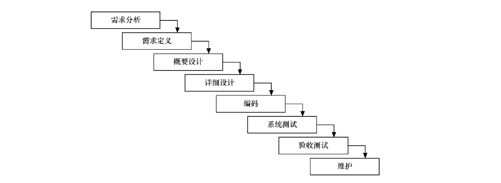
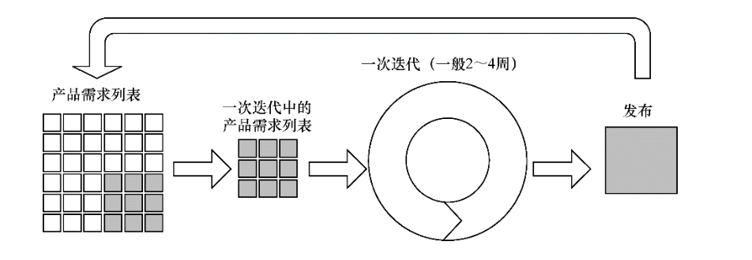

# 开发过程的发展

​	

## 1.瀑布式开发

瀑布模型是一种广泛采用的项目开发过程。瀑布模型由各个阶段组成，从上一个阶段流向下一个阶段，各个阶段都会产生反馈，从系统需求分析阶段开始，然后一直流向产品发布和维护阶段。

其核心思想在于，按照一定的工序让问题变得有迹可循，

将软件开发过程划分为需求分析、需求定义、概要设计、详细设计、编码、系统测试、验收测试、维护这8个阶段。各个阶段自上而下，互相衔接，就像是瀑布流水一样。

瀑布式开发的缺点是显而易见的。

1. 阶段独立容易脱节，上一个阶段成果未必适用下一个阶段
2. 计划死板，任何一个环节延误会导致后续阶段不可控
3. 交付周期长，过程中的风险不能及时响应
4. 反馈回路时间长，最好处理问题影响大

容器技术在这一代开发过程中没有发挥太大作用，即使使用，也局限于最后一两个阶段。有容器固然很好，但由于瀑布模型的先天劣
势，容器对它帮助不大，收效甚微。

## 2.敏捷式开发

敏捷式开发是一种以用户需求为核心，通过迭代、循序渐进完成
软件开发的方法。它的核心在于，整个项目被拆分为多个拥有联系但相对独立的子项目。这些子项目通常在一个迭代周期（通常为2～4
周）发布一次，而每次迭代都经历了完备的开发流程，并通过了各项测试，因此这些子项目可以作为单独的产品使用。

这种方法也非常适合一开始没有或不能完整确定需求和范围的项目，或者经常变化的项目。相对于瀑布式开发，敏捷式开发明显更具有弹性，对风险更可控。敏捷式开发的交付周期适中，反馈回路相对较短，可执行原型和部分实现的可运行系统是了解用户需求与反馈的有效媒介。每次迭代完成后，都可以基于用户反馈或总结，持续优化下一次迭代。

敏捷式开发的交付周期适中，反馈回路适中，很多开发团队会使用持续集成时间贯穿整个过程。容器技术开始在这一开发过程中显示出一定的作用。有效利用它会带来可见的良性改观，但容器技术并未起决定性作用。

## 3.DevOps

很多人在讨论DevOps的时候，会把Kubernetes等同于DevOps，其实他们并未理解DevOps的精髓。简单地将DevOps理解为自动化部署，其实是很不科学的。

DevOps一词来自Development和Operation的组合，突出了软件开发人员和运维人员的沟通合作，

通过自动化流程来使软件构建、测试
与发布更加快捷、频繁和可靠。然而，这只是文字上的定义。

开发过程的发展趋势如下。

（1）越来越快速、越来越频繁的交付，交付周期越来越短。
（2）更迅捷的反馈回路，反馈周期明显变短

DevOps是怎么做到的呢？这里必须要理解一个概念，即“最小原
子产品”。每一个“最小原子产品”都是一个单独发布的产品（这个产品也许只是某个特征，甚至有的只需要几分钟就可以完成编码）。
伴随着全链路监控，DevOps能够真正做到更快捷的持续交付，并拥有更短的反馈回路。

相对于敏捷式开发，DevOps响应变化的速度更快，对风险更可控。

作为自动化部署的一大利器，Kubernetes高效的部署、卓越的集群管理、强大的反馈监控等，能够给DevOps打下坚实的基础（如果测试人员、运维人员需要频繁部署，并且每次都卡在部署环节中的环境问题上或部署低效，则DevOps在两周内可能比敏捷式开发多走几十次流程，简直让人崩溃）。

而Kubernetes本身并不是DevOps，而DevOps也不是Kubernetes。
它们是相辅相成的，Kubernetes这样的平台会真正在DevOps这种开发过程中尽其所能，大放异彩。

另外，Kubernetes也是DevOps中不可或缺的一环。

