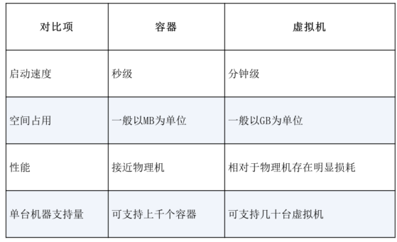
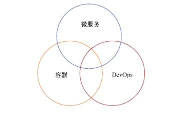

# 部署打包的发展

## 1.物理机和虚拟机

**物理机**

物理机的部署直接与硬件挂钩，有时还会由技术活变为体力活

所有应用部署在一台物理机上，集中在一起，没有任何隔离。

**虚拟机**

将一台计算机虚拟化为多台逻辑计算机。在一台物理机上同时运行多台逻辑计算机，每台逻辑计算机可运行不同的操作系统，并且应
用程序可以在相互独立的空间内运行，互不影响，从而显著提高计算机的利用率。

在操作系统和硬件之间加入一个虚拟机监控程序（hypervisor），可以实现虚拟化系统。

## 2.容器

容器与传统的虚拟化方式相比具有众多的优势。

- 更快捷的部署
- 更高的可移植性
- 更强的版本控制和更高的组件重用率
- 更小的性能开销
- 更易于共享和维护

容器与虚拟机的性能对比

## 3.容器的舵手—Kubernetes

Kubernetes是一套容器集群管理系统，是一个开源平台，

可以实现容器集群的自动化部署、自动扩缩容、维护等功能。Kubernetes拥有自动包装、自我修复、横向缩放、服务发现、负载均衡、自动部
署、升级回滚、存储编排等特性。Kubernetes与DevOps、微服务等相辅相成，密不可分，三者的关系如图

铁三角（Devops、微服务、容器）

