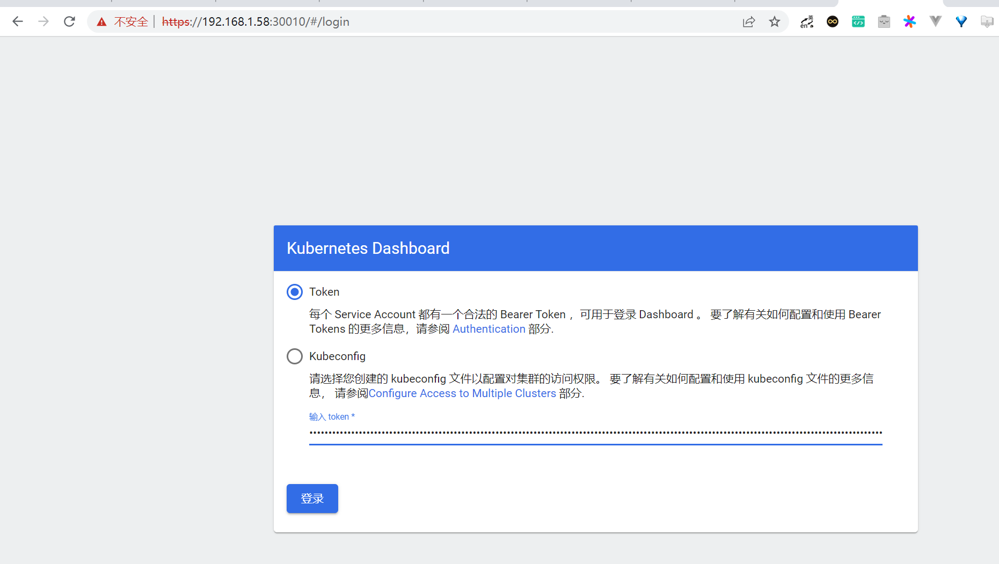
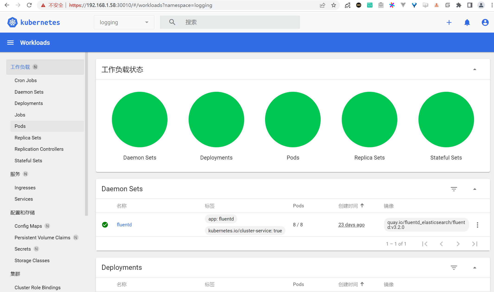
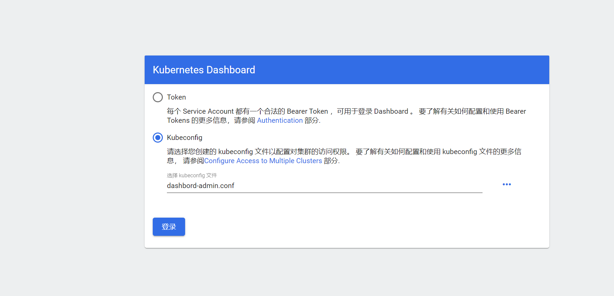

# 可视化管理-Kubernetes Dashboard

Kubernetes Dashboard是一个非常受欢迎的项目，为Kubernetes用户管理Kubernetes集群提供了非常便捷的可视化管理工具。

Kubernetes Dashboard可以实现Pod、控制器、Service、存储卷等资源的创建与维护，并可以对它们进行持续的监控。

Kubernetes Dashboard 是 Kubernetes 的官方 Web UI。使用 Kubernetes Dashboard，您可以：

- 向 Kubernetes 集群部署容器化应用
- 诊断容器化应用的问题
- 管理集群的资源
- 查看集群上所运行的应用程序
- 创建、修改Kubernetes 上的资源（例如 Deployment、Job、DaemonSet等）
- 展示集群上发生的错误

例如：您可以伸缩一个 Deployment、执行滚动更新、重启一个 Pod 或部署一个新的应用程序


## 1. 安装Kubernetes Dashboard

### 1.1 创建证书

因为自动生成的证书很多浏览器无法使用，所以自己创建证书

- 新建证书存放目录

```shell
$ mkdir -p /etc/kubernetes/dashboard-certs
$ cd /etc/kubernetes/dashboard-certs/
```

- 创建命名空间

```shell
$ kubectl create namespace kubernetes-dashboard
```


- 创建key文件

```shell
$ openssl genrsa -out dashboard.key 2048
```


- 证书请求

```shell
$ openssl req -new -out dashboard.csr -key dashboard.key -subj '/CN=kubernetes-dashboard-certs'
```

 

- 自签证书

```shell
$ openssl x509 -req -days 36000 -in dashboard.csr -signkey dashboard.key -out dashboard.crt
```


- 创建kubernetes-dashboard-certs对象

```shell
$ kubectl create secret generic kubernetes-dashboard-certs --from-file=dashboard.key --from-file=dashboard.crt -n kubernetes-dashboard
```


### 1.2 下载并修改配置文件

下载配置文件

```shell
$ mkdir kubernetes-dashboard
$ cd kubernetes-dashboard
$ wget https://raw.githubusercontent.com/kubernetes/dashboard/v2.1.0/aio/deploy/recommended.yaml
```

- 修改配置文件，增加直接访问端口

`vim recommended.yaml`

```yaml
......
---
kind: Service
apiVersion: v1
metadata:
  labels:
    k8s-app: kubernetes-dashboard
  name: kubernetes-dashboard
  namespace: kubernetes-dashboard
spec:
  type: NodePort
  ports:
    - port: 443
      targetPort: 8443
      nodePort: 30010
  selector:
    k8s-app: kubernetes-dashboard
    
---
.....
```

- 修改配置文件，注释原namespace对象和kubernetes-dashboard-certs对象声明

```
#apiVersion: v1
#kind: Namespace
#metadata:
#  name: kubernetes-dashboard
---

#apiVersion: v1
#kind: Secret
#metadata:
#  labels:
#    k8s-app: kubernetes-dashboard
#  name: kubernetes-dashboard-certs
#  namespace: kubernetes-dashboard
#type: Opaque

#---
```

默认900s/15分钟后认证token回话失效，需要重新登录认证，修改12h,方便使用

```
          args:
            - --auto-generate-certificates
            - --namespace=kubernetes-dashboard
            - --token-ttl=43200
```


### 1.3 运行dashboard

```shell
$ kubectl apply -f recommended.yaml 
```


### 1.4 更新配置信息

- 创建Dashboard管理员账号dashboard-admin.yaml，并apply

`dashboard-admin.yaml`

```yaml
apiVersion: v1
kind: ServiceAccount
metadata:
  labels:
    k8s-app: kubernetes-dashboard
  name: dashboard-admin
  namespace: kubernetes-dashboard
```

`dashboard-admin-bind-cluster-role.yaml`

```yaml
apiVersion: rbac.authorization.k8s.io/v1
kind: ClusterRoleBinding
metadata:
  name: dashboard-admin-bind-cluster-role
  labels:
    k8s-app: kubernetes-dashboard
roleRef:
  apiGroup: rbac.authorization.k8s.io
  kind: ClusterRole
  name: cluster-admin
subjects:
- kind: ServiceAccount
  name: dashboard-admin
  namespace: kubernetes-dashboard
```

```shell
$ kubectl apply -f dashboard-admin.yaml
$ kubectl apply -f dashboard-admin-bind-cluster-role.yaml
```


### 1.5 获取token信息

```shell
$ kubectl -n kubernetes-dashboard describe secret $(kubectl -n kubernetes-dashboard get secret | grep dashboard-admin | awk '{print $1}')
Name:         dashboard-admin-token-5chxg
Namespace:    kubernetes-dashboard
Labels:       <none>
Annotations:  kubernetes.io/service-account.name: dashboard-admin
              kubernetes.io/service-account.uid: 25df4002-d67e-4ed5-a331-3f46ea0c6742

Type:  kubernetes.io/service-account-token

Data
====
ca.crt:     1066 bytes
namespace:  20 bytes
token:      eyJhbGciOiJSUzI1NiIsImtpZCI6Im9aREhrU2JwdEZZc3B5Tk9fOU5CNmRWQkE4MWpaOGdKR3drbDJEVUo1dzAifQ.eyJpc3MiOiJrdWJlcm5ldGVzL3NlcnZpY2VhY2NvdW50Iiwia3ViZXJuZXRlcy5pby9zZXJ2aWNlYWNjb3VudC9uYW1lc3BhY2UiOiJrdWJlcm5ldGVzLWRhc2hib2FyZCIsImt1YmVybmV0ZXMuaW8vc2VydmljZWFjY291bnQvc2VjcmV0Lm5hbWUiOiJkYXNoYm9hcmQtYWRtaW4tdG9rZW4tNWNoeGciLCJrdWJlcm5ldGVzLmlvL3NlcnZpY2VhY2NvdW50L3NlcnZpY2UtYWNjb3VudC5uYW1lIjoiZGFzaGJvYXJkLWFkbWluIiwia3ViZXJuZXRlcy5pby9zZXJ2aWNlYWNjb3VudC9zZXJ2aWNlLWFjY291bnQudWlkIjoiMjVkZjQwMDItZDY3ZS00ZWQ1LWEzMzEtM2Y0NmVhMGM2NzQyIiwic3ViIjoic3lzdGVtOnNlcnZpY2VhY2NvdW50Omt1YmVybmV0ZXMtZGFzaGJvYXJkOmRhc2hib2FyZC1hZG1pbiJ9.YI6-dhDg2lIMfYbv4s_FjFAHYhj4ZcWZ5Eu13Nw1g1hcLDPVuI69hDAfoYRGfBoDDidCClLsSCdPIsMAuOj16jnlugzy9n6gEkpTNY1Du3zVGY8jdHmdbFWZK9bd2NHxO0gC-cLcHZ9MctLgrnMylysGsrtvFPB8wepzr2rMKzgfuBvfv00gp8-u_NeIPUDEr2jVteQkK2RHMOU_bBS49FKAu7LvHlxy_bYqqlu3gNX_znfT1AY7cVF8GiwnCSvqV6OJQaLY_ohgNrvoaT19muw6lkaLMJrWFexNszRpdmw9lk3edigPj4xo8Da6DQYpNXICLKJXWMTS5JHli2SsBw
```


### 1.6 登录访问dashboard

登录访问: `https://192.168.1.58:30010/`






## 2.使用Kubernetes Dashboard

图形界面点点点即可实现部署、更新回滚。

相对于直接使用命令行来说，使用Kubernetes Dashboard对集群资源进行可视化管理更清晰、直观、方便。


## 3.Dashboard组件安装-kubeconfig

### 3.1 设置变量

- 获取dashboard-admin-token的名称

```shell
$ kubectl get secrets --all-namespaces | grep dashboard-admin-token
```

- 获取token

```shell
$ DASH_TOCKEN=$(kubectl -n kubernetes-dashboard get secret dashboard-admin-token-9k522 -o jsonpath={.data.token}| base64 -d)
```


### 3.2 初始化集群信息

提供API Server的URL，以及验证API Server证书所用到的CA证书等

```shell
$ kubectl config set-cluster kubernetes --server=192.168.1.56:6443 --kubeconfig=/root/dashbord-admin.conf
```

### 3.3 获取dashboard-admin的token

并将其作为认证信息。

```shell
$ kubectl config set-credentials dashboard-admin --token=$DASH_TOCKEN --kubeconfig=/root/dashbord-admin.conf
```

### 3.4 设置context列表

定义一个名为dashboard-admin的context：

```shell
$ kubectl config set-context dashboard-admin@kubernetes  --cluster=kubernetes  --user=dashboard-admin --kubeconfig=/root/dashbord-admin.conf
```


### 3.5 使用的context为前面定义的名为dashboard-admin的context：

```shell
$ kubectl config use-context dashboard-admin@kubernetes  --kubeconfig=/root/dashbord-admin.conf
```


### 3.6 传输kubeconfig，然后使用kubeconfig登录

下载`/root/dashbord-admin.conf`文件用于dashboard的UI界面登录。



### 3.7 切换到admin用户

```shell
$ kubectl config use-context kubernetes-admin@kubernetes 
```


> 参考文献
>
> https://www.yuque.com/cuiliang-s1qrv/k8s/ag9lb6
>
> https://www.yuque.com/coolops/kubernetes/kndnzu