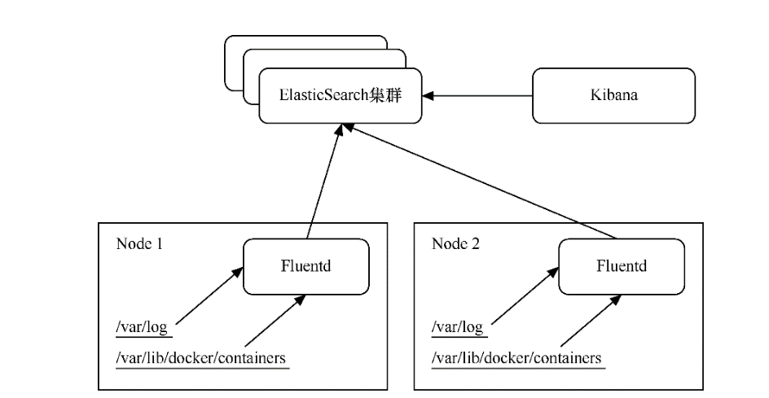

# 日志管理-EFK

Kubernetes推荐采用ElasticSearch、Fluentd、Kibana（简称EFK）三者组合的方式，对系统与容器日志进行收集与查询。它们之间
的关系如下。

- ElasticSearch是一种搜索引擎，用于存储日志并进行查询。
- Fluentd用于将日志消息从Kubernetes中发送到ElasticSearch。
- Kibana是一种图形界面，用于查询存储在ElasticSearch中的日志

EFK的原理

EFK之间的交互过程如下。
（1）容器运行时（container runtime）会将日志输出到控制台，并以“-json.log”结尾将日志文件存放到/var/lib/docker/containers目录中。而/var/log则是Linux系统日志的目录。

（2）在各个Node上运行的Fluentd服务可以收集所在计算机的/var/log与/var/lib/docker/ containers目录下的日志，并将日志数据发送给ElasticSearch集群。

（3）Kibana是直接与用户交互的界面，可以查询存储在ElasticSearch中的日志并将其展示出来。

> 参考文献
>
> https://mp.weixin.qq.com/s/lPeYavvFJ6GdivkT0iwTGw

