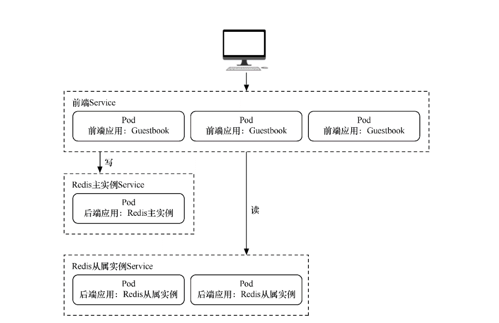

# 无状态项目部署案例

本节将演示如何用Kubernetes来部署无状态的多层Web应用程序——Guestbook。

该应用程序是一个简单的留言板程序，包含以下3个部分，并拥有读写分离机制。

□ 前端应用：Guestbook的留言板应用，将部署多个实例以供用户访问。

□ 后端存储（写）：Redis主应用，用于写入留言信息，只部署一个实例。

□ 后端存储（读）：Redis从属应用，用于读取留言信息，将部署多个实例。


Guestbook的整体结构与各部分之间的交互




## 1. 创建namespace

```shell
[root@ci-base no_status]# kubectl create ns dev
namespace/dev created
```


## 2. 创建redis-master

`redis-master.deployment.yml`

```yaml
apiVersion: apps/v1
kind: Deployment
metadata:
  name: redis-master
  labels:
    app: redis
  namespace: dev

spec:
  selector:
    matchLabels:
      app: redis
      role: master
      tier: backend
  replicas: 1
  template:
    metadata:
      labels:
        app: redis
        role: master
        tier: backend
    spec:
      containers:
        - name: master
          image: kubeguide/redis-master
          resources:
            requests:
              cpu: 100m
              memory: 100Mi
          ports:
            - containerPort: 6379
```

这个模板中使用了Redis镜像，并将作为主存储使用，其实例数量为1。应用模板后，Redis主实例的Pod状态

```shell
[root@ci-base no_status]# kubectl create -f redis-master.deployment.yml
deployment.apps/redis-master created

[root@ci-base no_status]# kubectl get pod -n dev
NAME                            READY   STATUS    RESTARTS   AGE
redis-master-598bcbf4f7-4qk6h   1/1     Running   0          17s

[root@ci-base no_status]# kubectl get deployment -n dev
```

Redis-Master Pod创建完毕后，需要为其创建Service，以便前端应用可以调用它来存储数据，以及从属应用可以从中同步数据。接下来，创建一个名为`redis-master.service.yml`的文件

`redis-master.service.yml`

```yaml
apiVersion: v1
kind: Service
metadata:
  name: redis-master
  labels:
    app: redis
    role: master
    tier: backend
  namespace: dev
spec:
  ports:
    - port: 6379
      targetPort: 6379
  selector:
    app: redis
    role: master
    tier: backend
```

```shell
[root@ci-base no_status]# kubectl create -f redis-master.service.yml
service/redis-master created
```

这个模板通过标签引用了Redis的Pod，并为其创建了类型为ClusterIP的Service。应用模板后，Redis主实例的Service状态

```shell
[root@ci-base no_status]# kubectl get svc -n dev
NAME           TYPE        CLUSTER-IP      EXTERNAL-IP   PORT(S)    AGE
redis-master   ClusterIP   10.98.208.133   <none>        6379/TCP   30s

[root@ci-base no_status]# kubectl get ep -n dev
NAME           ENDPOINTS            AGE
redis-master   10.244.77.226:6379   39s

[root@ci-base no_status]# kubectl get pod -n dev -o wide
NAME                            READY   STATUS    RESTARTS   AGE     IP              NODE     NOMINATED NODE   READINESS GATES
redis-master-598bcbf4f7-4qk6h   1/1     Running   0          4m14s   10.244.77.226   k8s-w9   <none>           <none>
```


## 3. 创建redis-slave

虽然Redis主实例是单个容器，但是可以添加Redis从属实例来增加其负载能力。接下来，部署Redis从属应用，并为其指定两个实例。创建一个名为`redis-slave.deployment.yml`的文件，

```yaml
apiVersion: apps/v1
kind: Deployment
metadata:
  name: redis-slave
  labels:
    app: redis
  namespace: dev

spec:
  selector:
    matchLabels:
      app: redis
      role: slave
      tier: backend
  replicas: 2
  template:
    metadata:
      labels:
        app: redis
        role: slave
        tier: backend
    spec:
      containers:
        - name: slave
          image: kubeguide/guestbook-redis-slave
          resources:
            requests:
              cpu: 100m
              memory: 100Mi
          env:
            - name: GET_HOSTS_FROM
              value: dns
          ports:
            - containerPort: 6379
```

这个模板使用了Redis从属镜像，其实例数量为2，后续可根据访问的负载情况随时调整实例数量。

该模板通过两个环境变量name: GET_HOSTS_FROM和value: dns自动从中解析出Redis主实例的地址并加以引用。应用模板后，Redis从属实例的Pod状态

```shell
[root@ci-base no_status]# kubectl apply -f redis-slave.deployment.yml
deployment.apps/redis-slave created

[root@ci-base no_status]# kubectl get pod -n dev|grep redis-slave
redis-slave-df7466bc9-dnqpm     1/1     Running   0          8s
redis-slave-df7466bc9-trw8p     1/1     Running   0          8s

[root@ci-base no_status]# kubectl get deploy -n dev|grep redis-slave
redis-slave    2/2     2            2           49s
```

Redis-Slave Pod创建完毕后，需要为其创建Service，以便前端应用可以调用它来读取数据。

接下来，创建一个名为`redis-slave.service.yml`的文件，在文件中填入以下内容并保存。

```yaml
apiVersion: v1
kind: Service
metadata:
  name: redis-slave
  labels:
    app: redis
    role: slave
    tier: backend
  namespace: dev
spec:
  ports:
    - port: 6379
  selector:
    app: redis
```

应用模板

```shell
[root@ci-base no_status]# kubectl apply -f redis-slave.service.yml
service/redis-slave created

[root@ci-base no_status]# kubectl get svc -n dev|grep redis-slave
redis-slave    ClusterIP   10.102.11.78    <none>        6379/TCP   34s

[root@ci-base no_status]# kubectl get ep -n dev|grep redis-slave
redis-slave    10.244.77.226:6379,10.244.77.227:6379,10.244.77.228:6379   42s

[root@ci-base no_status]# kubectl get pod -n dev -o wide
NAME                            READY   STATUS    RESTARTS   AGE     IP              NODE     NOMINATED NODE   READINESS GATES
redis-master-598bcbf4f7-4qk6h   1/1     Running   0          12m     10.244.77.226   k8s-w9   <none>           <none>
redis-slave-df7466bc9-dnqpm     1/1     Running   0          4m24s   10.244.77.227   k8s-w9   <none>           <none>
redis-slave-df7466bc9-trw8p     1/1     Running   0          4m24s   10.244.77.228   k8s-w9   <none>           <none>
[root@ci-base no_status]# kubectl get svc -n dev
NAME           TYPE        CLUSTER-IP      EXTERNAL-IP   PORT(S)    AGE
redis-master   ClusterIP   10.98.208.133   <none>        6379/TCP   9m18s
redis-slave    ClusterIP   10.102.11.78    <none>        6379/TCP   80s
```

## 4. 创建frontend

Redis存储实例创建完毕后，就可以创建前端应用程序了。留言板应用程序是一个前端Web程序，基于PHP编写。该应用程序会连接到Redis主实例以执行写入请求，同时会连接到Redis从属实例以执行读取请求。

接下来创建一个名为`frontend.deployment.yml`的文件，在文件中填入以下内容并保存。

```yaml
apiVersion: apps/v1
kind: Deployment
metadata:
  name: frontend
  labels:
    app: guestbook
  namespace: dev

spec:
  selector:
    matchLabels:
      app: guestbook
      tier: frontend
  replicas: 3
  template:
    metadata:
      labels:
        app: guestbook
        tier: frontend
    spec:
      containers:
        - name: php-redis
          image: kubeguide/guestbook-php-frontend
          resources:
            requests:
              cpu: 100m
              memory: 100Mi
          env:
            - name: GET_HOSTS_FROM
              value: dns
          ports:
            - containerPort: 80
```

这个模板使用了hjl-frontend:v3镜像，其实例数量为3，后续可根据所访问的负载情况随时调整实例数量。该模板通过两个环境变量name: GET_HOSTS_FROM和value: dns自动从中解析出Redis主实例和Redis从属实例的地址并引用。应用模板后，Guestbook实例Pod的状态如下

```shell
[root@ci-base no_status]# kubectl apply -f frontend.deployment.yml
deployment.apps/frontend created

[root@ci-base no_status]# kubectl get pod -n dev |grep frontend
frontend-78b47669f6-bc7v5       1/1     Running   0          99s
frontend-78b47669f6-qdscx       1/1     Running   0          99s
frontend-78b47669f6-t4m8d       1/1     Running   0          99s
```

最后，为前端留言板应用创建Service，这样就可以供用户访问了，因此，创建一个名为`frontend.service.yml`的文件，在文件中填入以下内容并保存。

```yaml
apiVersion: v1
kind: Service
metadata:
  name: frontend
  labels:
    app: guestbook
    tier: frontend
  namespace: dev
spec:
  type: NodePort
  ports:
    - port: 80
      nodePort: 30001
  selector:
    app: guestbook
    tier: frontend
```

该模板通过NodePort类型的Service将服务提供给各个集群主机的30222端口，这样就可以在浏览器地址栏中输入`“http://{主机IP}:30222”`来访问留言板页面了。应用模板后，Guestbook实例的Service状态如下

```shell
[root@ci-base no_status]# kubectl apply -f frontend.service.yml
service/frontend created

[root@ci-base no_status]# kubectl get svc -n dev |grep frontend
frontend       NodePort    10.99.34.225    <none>        80:30222/TCP   3s

[root@ci-base no_status]# kubectl get svc,pod,deploy -n dev
NAME                   TYPE        CLUSTER-IP       EXTERNAL-IP   PORT(S)        AGE
service/frontend       NodePort    10.97.7.208      <none>        80:30001/TCP   5m9s
service/redis-master   ClusterIP   10.106.240.32    <none>        6379/TCP       5m8s
service/redis-slave    ClusterIP   10.107.166.193   <none>        6379/TCP       5m8s

NAME                               READY   STATUS    RESTARTS   AGE
pod/frontend-58f67d657c-ctgwb      1/1     Running   0          5m9s
pod/frontend-58f67d657c-g6d6r      1/1     Running   0          5m9s
pod/frontend-58f67d657c-jvzrb      1/1     Running   0          5m9s
pod/redis-master-c55488447-xz5z9   1/1     Running   0          5m8s
pod/redis-slave-67456bdf78-b67cs   1/1     Running   0          5m8s
pod/redis-slave-67456bdf78-dd4pn   1/1     Running   0          5m8s

NAME                           READY   UP-TO-DATE   AVAILABLE   AGE
deployment.apps/frontend       3/3     3            3           5m9s
deployment.apps/redis-master   1/1     1            1           5m9s
deployment.apps/redis-slave    2/2     2            2           5m8s
```

## 5. 验证测试

接下来，就可以在URL中输入地址访问留言板应用了。在本例中地址为http://192.168.xx.xx:30001，进入页面后在文本框中输入文字，然后单击Submit按钮，留言将自动显示在页面下方。


