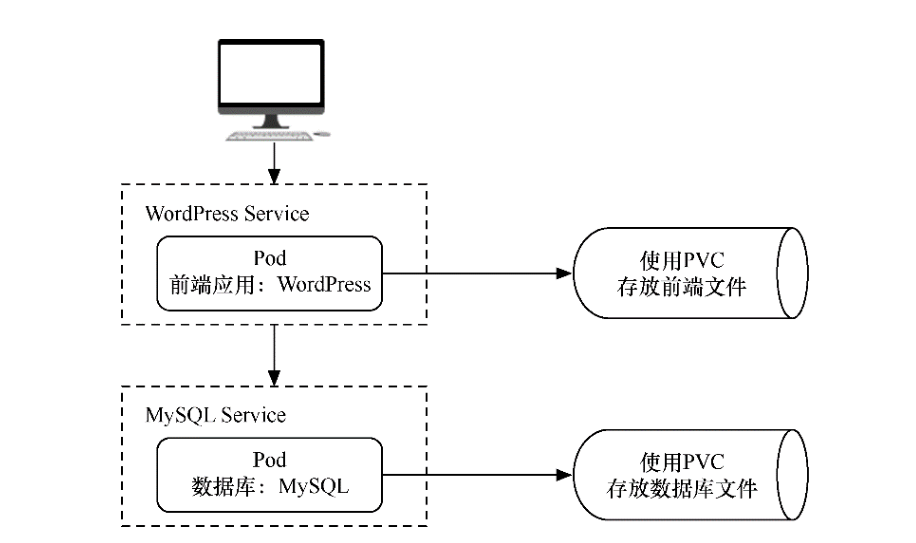

# 有状态项目的部署案例

WordPress是使用PHP语言开发的开源的个人博客平台，是一套非常完善的内容管理系统，支持非常丰富的插件和模板。

WordPress包含以下两个部分。

□ 前端应用：WordPress博客前端应用，拥有各种操作界面以供给用户访问。它使用PVC来存储博客网页等文件。

□ 数据库：MySQL数据库，用于存储该博客的内容数据。它使用PVC来存储博客内容等数据。


WordPress的整体结构与各部分之间的交互如下图：



因为本例中涉及数据库，所以需要设置一个MySQL初始密码，WordPress在引用数据库时也会用到该密码。可以定义一个Secret来存储密码。


## 1. 创建namespace

```shell
[root@ci-base no_status]# kubectl create ns dev
namespace/dev created
```


## 2. 创建mysql的Secret

本例中将数据库初始密码设置为“abc123456”。首先，执行以下命令，对密码字符串进行base64编码。

```shell
[root@ci-base set_status]# echo -n "abc123456"|base64
YWJjMTIzNDU2
```

然后，创建`mysql-pass.yml`文件，在文件中填入以下内容并保存，其中password字段使用了刚才编码后的内容。

```yaml
apiVersion: v1
kind: Secret
metadata:
  name: mysql-pass
  namespace: dev

type: Opaque
data:
  password: YWJjMTIzNDU2
```

## 3. 创建mysql-deployment

接下来，部署WordPress将会用到的MySQL数据库。创建`mysql-deployment.yml`文件，在文件中填入以下内容并保存。

```yaml
apiVersion: v1
kind: Service
metadata:
  name: wordpress-mysql
  labels:
    app: wordpress
  namespace: dev
spec:
  ports:
    - port: 3306
  selector:
    app: wordpress
    tier: mysql
  clusterIP: None
---
apiVersion: v1
kind: PersistentVolumeClaim
metadata:
  name: mysql-pv-claim
  labels:
    app: wordpress
  namespace: dev
spec:
  accessModes:
    - ReadWriteOnce
  storageClassName: "managed-nfs-storage"
  resources:
    requests:
      storage: 10Gi
---
apiVersion: apps/v1 # for k8s versions before 1.9.0 use apps/v1beta2  and before 1.8.0 use extensions/v1beta1
kind: Deployment
metadata:
  name: wordpress-mysql
  labels:
    app: wordpress
  namespace: dev
spec:
  selector:
    matchLabels:
      app: wordpress
      tier: mysql
  strategy:
    type: Recreate
  template:
    metadata:
      labels:
        app: wordpress
        tier: mysql
    spec:
      containers:
        - image: mysql:5.6
          name: mysql
          env:
            - name: MYSQL_ROOT_PASSWORD
              valueFrom:
                secretKeyRef:
                  name: mysql-pass
                  key: password
          livenessProbe:
            tcpSocket:
              port: 3306
          ports:
            - containerPort: 3306
              name: mysql
          volumeMounts:
            - name: mysql-persistent-storage
              mountPath: /var/lib/mysql
      volumes:
        - name: mysql-persistent-storage
          persistentVolumeClaim:
            claimName: mysql-pv-claim
```

这个模板包含4个部分。首先，定义一个无头Service，用于提供MySQL服务。

然后，定义一个10GiB的PVC以供MySQL存放数据库文件，这里使用了managed-nfs-storage的StorageClass，以便自动为PVC创建PV。

接下来，定义单实例的Deployment控制器，其镜像为mysql，该实例引用了刚才创建的Secret，以便初始化数据库密码。最后，引用模板中定义的PVC，映射路径为/var/lib/mysql以存放数据库文件。


应用模板后，MySQL实例的状态如下所示

```shell
[root@ci-base set_status]# ll
total 12
drwxr-xr-x 17 root root 4096 Apr  8 15:00 external-storage
-rw-r--r--  1 root root  119 Apr  8 14:55 mysql-pass.yml
-rw-r--r--  1 root root 1501 Apr  8 15:35 wordpress-mysql.yml
[root@ci-base set_status]# kubectl apply -f .


[root@ci-base set_status]# kubectl get deployment,pod,pvc,svc -n dev
NAME                              READY   UP-TO-DATE   AVAILABLE   AGE
deployment.apps/wordpress-mysql   1/1     1            1           2m34s

NAME                                   READY   STATUS    RESTARTS   AGE
pod/wordpress-mysql-5f4b68ff8f-tsk2l   1/1     Running   0          2m34s

NAME                                   STATUS   VOLUME                                     CAPACITY   ACCESS MODES   STORAGECLASS          AGE
persistentvolumeclaim/mysql-pv-claim   Bound    pvc-e310bfc0-62a9-4b52-a94f-366ad7868f41   10Gi       RWO            managed-nfs-storage   2m34s

NAME                      TYPE        CLUSTER-IP   EXTERNAL-IP   PORT(S)    AGE
service/wordpress-mysql   ClusterIP   None         <none>        3306/TCP   2m34s
```


## 4. 创建wordpress-deployment

接下来，部署WordPress前端应用程序。该应用程序会引用之前创建的MySQL数据库，为用户提供博客管理功能。为了创建`wordpress-deployment.yml`文件，在文件中填入以下内容并保存。

```yaml
apiVersion: v1
kind: Service
metadata:
  name: wordpress
  labels:
    app: wordpress
  namespace: dev
  
spec:
  ports:
    - port: 80
      nodePort: 30111
  selector:
    app: wordpress
    tier: frontend
  type: NodePort
---
apiVersion: v1
kind: PersistentVolumeClaim
metadata:
  name: wp-pv-claim
  labels:
    app: wordpress
  namespace: dev
  
spec:
  storageClassName: "managed-nfs-storage"
  accessModes:
    - ReadWriteOnce
  resources:
    requests:
      storage: 2Gi
---
apiVersion: apps/v1 #  for k8s versions before 1.9.0 use apps/v1beta2  and before 1.8.0 use extensions/v1beta1
kind: Deployment
metadata:
  name: wordpress
  labels:
    app: wordpress
  namespace: dev
  
spec:
  selector:
    matchLabels:
      app: wordpress
      tier: frontend
  strategy:
    type: Recreate
  template:
    metadata:
      labels:
        app: wordpress
        tier: frontend
    spec:
      containers:
      - image: wordpress:4.8-apache
        name: wordpress
        env:
        - name: WORDPRESS_DB_HOST
          value: wordpress-mysql
        - name: WORDPRESS_DB_PASSWORD
          valueFrom:
            secretKeyRef:
              name: mysql-pass
              key: password
        ports:
        - containerPort: 80
          name: wordpress
        volumeMounts:
        - name: wordpress-persistent-storage
          mountPath: /var/www/html
      volumes:
      - name: wordpress-persistent-storage
        persistentVolumeClaim:
          claimName: wp-pv-claim
```

这个模板包含3个部分。首先，定义的NodePort类型的Service将WordPress入口提供给各个集群主机的30111端口，这样在浏览器地址栏中输入http://{主机IP}:30111就可以访问留言板页面了。

然后，定义一个2GiB的PVC用于供WordPress存放博客、网页等文件，这里使用了前几章定义的StorageClass，以便自动为PVC创建PV。

最后，定义单实例的Deployment，其镜像为wordpress，该实例通过WORDPRESS_DB_HOST环境变量引用刚才定义的MySQL服务的名称。接下来，该实例通过WORDPRESS_DB_PASSWORD环境变量引用数据库密码，以便WordPress服务访问数据库，并引用模板中定义的PVC（映射路径为/var/www/html），以存放网页等文件。


应用模板后，WordPress实例的状态如下所示

```shell
[root@ci-base set_status]# kubectl apply -f .

[root@ci-base set_status]# kubectl get deployment,pod,pvc,svc -n dev
NAME                              READY   UP-TO-DATE   AVAILABLE   AGE
deployment.apps/wordpress         1/1     1            1           104s
deployment.apps/wordpress-mysql   1/1     1            1           105s

NAME                                   READY   STATUS    RESTARTS   AGE
pod/wordpress-6857459697-5ndgd         1/1     Running   0          104s
pod/wordpress-mysql-5f4b68ff8f-c7zdj   1/1     Running   0          105s

NAME                                   STATUS   VOLUME                                     CAPACITY   ACCESS MODES   STORAGECLASS          AGE
persistentvolumeclaim/mysql-pv-claim   Bound    pvc-83a89cc1-3cdb-4268-856e-68264e9b03de   10Gi       RWO            managed-nfs-storage   105s
persistentvolumeclaim/wp-pv-claim      Bound    pvc-cfa237f8-fdbd-4932-b8c9-1ce6b5dca3ae   2Gi        RWO            managed-nfs-storage   105s

NAME                      TYPE        CLUSTER-IP     EXTERNAL-IP   PORT(S)        AGE
service/wordpress         NodePort    10.107.67.69   <none>        80:30111/TCP   105s
service/wordpress-mysql   ClusterIP   None           <none>        3306/TCP       105s
```


## 5. 验证测试

接下来，就可以在URL中输入地址访问WordPress应用了，在本例中地址为http://192.168.1.xxx:30111。之后会进入初始界面，如图11-13所示，选择“简体中文”，然后单击“继续”按钮。


接着，设置初始账号和密码，并使用它们进行登录。之后，就会进入WordPress操作界面


