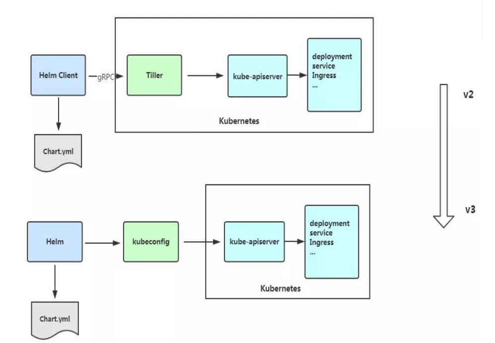
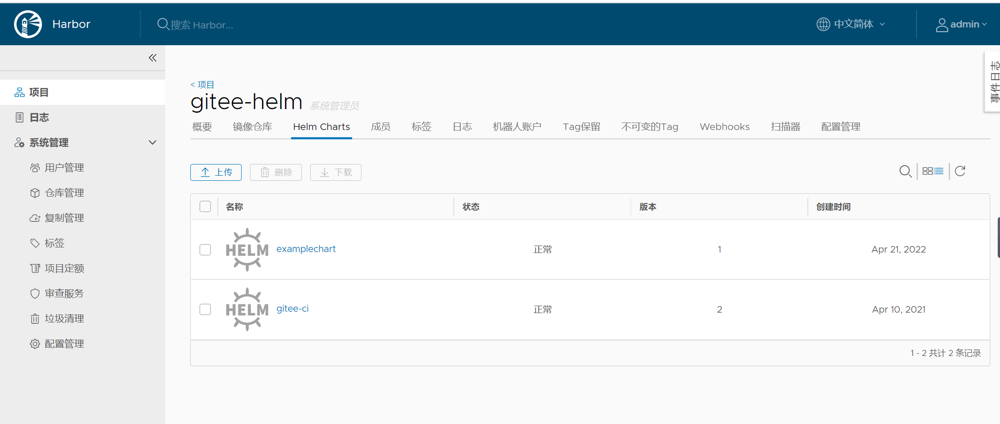
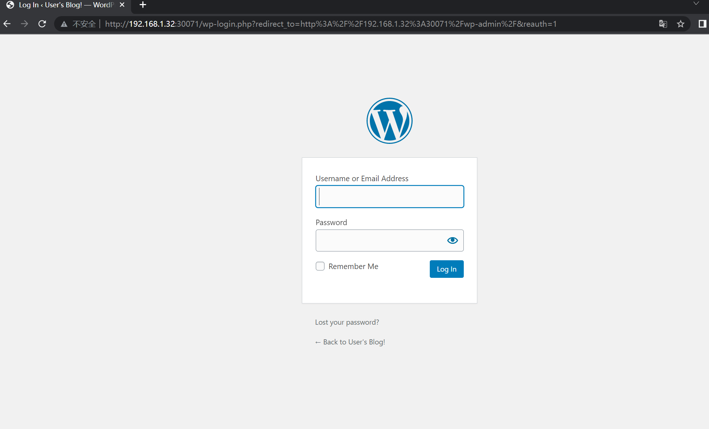

# 使用Helm部署项目

Kubernetes是一套容器集群管理系统，拥有自动包装、自我修复、横向缩放、服务发现和负载均衡、自动部署和升级回滚、存储编
排等特性，不仅支持Docker，还支持Rocket等容器。

我们可以发现Kubernetes的部署需要设置各式各样的模板文件，一个完整的应用程序会涉及多个Kubernetes
资源对象，而且为了描述这些对象要同时维护很多个yaml模板文件。不难发现，对于复杂的应用程序，在使用Kubernetes部署项目的
过程中会面临一些维护难题，如下所示。如何将这些分散而互相关联的应用模板文件作为一个整体统一管理？


- 如何同时发布和重用这些应用模板文件？如何进行版本控制？
- 如何统一维护模板文件产生的各种资源（如Pod、Service、PVC等）？


**而Helm正是以上问题的解决方案。**


## 1. Helm简介

Helm是Kubernetes的一个子项目，是一种Kubernetes包管理平台。Helm能有效管理Kubernetes应用集合。使用Helm，可以轻松定
义、部署、升级非常复杂的Kubernetes应用集合，并进行版本管理。Helm具有对Kubernetes资源进行统一部署、删除、升级、回滚等强大功能。

### 1.1 Helm 3 v3  变化

2019 年 11 月 13 日， Helm 团队发布 Helm v3 的第一个稳定版本。
该版本主要变化如下：

架构变化：

1、最明显的变化是 Tiller 的删除

2、Release 名称可以在不同命名空间重用

3、支持将 Chart 推送至 Docker 镜像仓库中

4、使用 JSONSchema 验证 chart values

5、其他




### 1.2  部署Helm客户端

Helm 客户端下载地址：https://github.com/helm/helm/releases,解压移动到/usr/bin/目录即可。

```shell
$ wget https://get.helm.sh/helm-v3.5.0-linux-amd64.tar.gz
$ tar zxvf helm-v3.5.0-linux-amd64.tar.gz
$ mv linux-amd64/helm /usr/bin/
```

 配置国内chart仓库

- 微软仓库（http://mirror.azure.cn/kubernetes/charts/）这个仓库推荐，基本上官网有的 chart 这里都有。
- 阿里云仓库（https://kubernetes.oss-cn-hangzhou.aliyuncs.com/charts ）
- 官方仓库（https://hub.kubeapps.com/charts/incubator）官方 chart 仓库，国内有点不好使。

添加存储库

```shell
$ helm repo add stable http://mirror.azure.cn/kubernetes/charts
$ helm repo add aliyun https://kubernetes.oss-cn-hangzhou.aliyuncs.com/charts
$ helm repo update
```

查看配置的存储库

```shell
$ helm repo list
$ helm search repo stable
```

删除存储库：

```shell
$ helm repo remove aliyun
```


## 2. Helm Chart的基本操作 

### 2.1 Chart的创建

要创建一个自定义Chart，执行以下命令即可。

```shell
$ helm create examplechart
```

该命令会在当前目录下创建一个名为examplechart的子目录，其结构可以通过以下命令查看。

```shell
$ tree examplechart/
examplechart/
├── charts
├── Chart.yaml
├── templates
│   ├── deployment.yaml
│   ├── _helpers.tpl
│   ├── hpa.yaml
│   ├── ingress.yaml
│   ├── NOTES.txt
│   ├── serviceaccount.yaml
│   ├── service.yaml
│   └── tests
│       └── test-connection.yaml
└── values.yaml

3 directories, 10 files
```

它主要分为4个部分——charts目录、Chart.yaml、templates目录、values.yaml。

- charts目录

```
charts目录用于存放该Chart依赖的所有子Chart的目录，这些子Chart的目录也遵从目前的Chart文件结构（即拥有4个部分）。
如果有子Chart，则需要在父Chart中新建requirements.yaml文件，并在文件中记录这些子Chart。
在创建新Chart时默认没有依赖的子Chart。
```

helm3 v2版本中。已经将依赖requirements.yaml去掉，默认requirements.yaml的内容直接写入Chart.yaml中。

示例

```
apiVersion: v2
appVersion: 2.0.0
name: foruda
home: https://gitee.com/
description: foruda ci Helm chart for Kubernetes
icon: https://gitee.com/static/images/logo-black.svg
keywords:
  - foruda
  - ci
  - gitee-ci
maintainers:
  - name: foruda
    email: 1879324764@qq.com

sources:
  - https://gitee.com/oschina/foruda-gitee-helm.git
version: 2.0.0

dependencies:
  - name: postgres
    repository: file://./charts/postgres/
    version: 2.0.0
```

如下所示的示例，是Wordpress Charts中定义的动态依赖关系：

```
dependencies:
- name: mariadb
  version: 2.1.1
  repository: https://kubernetes-charts.storage.googleapis.com/
  condition: mariadb.enabled
  tags:
    - wordpress-database
```


- Chart.yaml

```
Chart.yaml用于记录该Chart的关键信息，如名称、描述、版本等。该文件的内容如下所示。
```

```
apiVersion: v2
name: examplechart
description: A Helm chart for Kubernetes
type: application
version: 0.1.0
appVersion: 1.16.0
```


- templates 目录

```
templates 目录中存放了Kubernetes部署文件的Helm模板，该模板并不完全等同于Kubernetes中的yaml模板，这里的模板扩展了Go
Template语法。
```


我们先来看看与要部署的应用有关的几个模板文件。首先是deployment.yaml文件，其内容如下所示。

`deployment.yaml`

```yaml
apiVersion: apps/v1
kind: Deployment
metadata:
  name: {{ include "examplechart.fullname" . }}
  labels:
    {{- include "examplechart.labels" . | nindent 4 }}
spec:
{{- if not .Values.autoscaling.enabled }}
  replicas: {{ .Values.replicaCount }}
{{- end }}
  selector:
    matchLabels:
      {{- include "examplechart.selectorLabels" . | nindent 6 }}
  template:
    metadata:
    {{- with .Values.podAnnotations }}
      annotations:
        {{- toYaml . | nindent 8 }}
    {{- end }}
      labels:
        {{- include "examplechart.selectorLabels" . | nindent 8 }}
    spec:
      {{- with .Values.imagePullSecrets }}
      imagePullSecrets:
        {{- toYaml . | nindent 8 }}
      {{- end }}
      serviceAccountName: {{ include "examplechart.serviceAccountName" . }}
      securityContext:
        {{- toYaml .Values.podSecurityContext | nindent 8 }}
      containers:
        - name: {{ .Chart.Name }}
          securityContext:
            {{- toYaml .Values.securityContext | nindent 12 }}
          image: "{{ .Values.image.repository }}:{{ .Values.image.tag | default .Chart.AppVersion }}"
          imagePullPolicy: {{ .Values.image.pullPolicy }}
          ports:
            - name: http
              containerPort: 80
              protocol: TCP
          livenessProbe:
            httpGet:
              path: /
              port: http
          readinessProbe:
            httpGet:
              path: /
              port: http
          resources:
            {{- toYaml .Values.resources | nindent 12 }}
      {{- with .Values.nodeSelector }}
      nodeSelector:
        {{- toYaml . | nindent 8 }}
      {{- end }}
      {{- with .Values.affinity }}
      affinity:
        {{- toYaml . | nindent 8 }}
      {{- end }}
      {{- with .Values.tolerations }}
      tolerations:
        {{- toYaml . | nindent 8 }}
      {{- end }}
```


这是一个示例性质的yaml模板。和普通模板的区别在于，其中有很多属性值是用两个大括号括起来的，被双大括号括起来的部分是Go
Template，**大括号中以.Values开头的属性值是在values.yaml文件中定义的**，**而其他的属性（如以.Chart开头的属性）则是在**
**Chart.yaml中定义的内容**，而以.Release开头的属性则依赖于发布版本部署时的实际值。通过Go Template，可以使模板的具体部署操作和部署参数分离开来，各自单独维护。


然后，查看service.yaml文件

`service.yaml`

```yaml
apiVersion: v1
kind: Service
metadata:
  name: {{ include "examplechart.fullname" . }}
  labels:
    {{- include "examplechart.labels" . | nindent 4 }}
spec:
  type: {{ .Values.service.type }}
  ports:
    - port: {{ .Values.service.port }}
      targetPort: http
      protocol: TCP
      name: http
  selector:
    {{- include "examplechart.selectorLabels" . | nindent 4 }}
```

可以看到它定义了一个基于上述Deployment控制器的Service。和Deployment控制器的定义类似，里面有很多值取决于其他处的引用。

接下来，查看ingress.yaml文件，因为示例模板中默认不启用Ingress，所以这里只列出该文件中的前面几行以进行说明。
ingress.yaml文件的前几行如下所示。

`ingress.yaml`

```yaml
{{- if .Values.ingress.enabled -}}
{{- $fullName := include "examplechart.fullname" . -}}
{{- $svcPort := .Values.service.port -}}
{{- if semverCompare ">=1.14-0" .Capabilities.KubeVersion.GitVersion -}}
apiVersion: networking.k8s.io/v1beta1
{{- else -}}
apiVersion: extensions/v1beta1
{{- end }}
kind: Ingress
metadata:
  name: {{ $fullName }}
  labels:
    {{- include "examplechart.labels" . | nindent 4 }}
  {{- with .Values.ingress.annotations }}
  annotations:
    {{- toYaml . | nindent 4 }}
  {{- end }}
spec:
  {{- if .Values.ingress.tls }}
  tls:
    {{- range .Values.ingress.tls }}
    - hosts:
        {{- range .hosts }}
        - {{ . | quote }}
        {{- end }}
      secretName: {{ .secretName }}
    {{- end }}
  {{- end }}
  rules:
    {{- range .Values.ingress.hosts }}
    - host: {{ .host | quote }}
      http:
        paths:
          {{- range .paths }}
          - path: {{ . }}
            backend:
              serviceName: {{ $fullName }}
              servicePort: {{ $svcPort }}
          {{- end }}
    {{- end }}
  {{- end }}
```

定义Ingress的方式与之前定义Deployment控制器和Service的方式差不多，但最大区别在于，

其模板首行为{{- if.Values.ingress.enabled -}}，这表示只有当values.yaml文件中ingress.enabled属性为true时，该模板才生效。


最后一个与要部署的应用有关的文件是_helpers.tpl，它是一个模板助手文件。该文件主要用于定义通用信息（比如，命名和设置标
签），然后在其他地方使用。之前的各个模板都引用了_helpers.tpl中定义的命名信息和标签信息。_helpers.tpl文件的内容如下所示。

`helpers.tpl`

```
{{/* vim: set filetype=mustache: */}}
{{/*
对Chart的名称进行扩展
*/}}
{{- define "examplechart.name" -}}
{{- default .Chart.Name .Values.nameOverride | trunc 63 | trimSuffix "-" }}
{{- end }}

{{/*
创建一个默认基于一定规则的应用全名，
字符的最大长度为63，超过该数值会被截断，因为一些Kubernetes名称字段拥有这样的限制（根据DNS命名规范）
如果发布（release）对象的名称已经包含Chart名称，则将前者作为全名
*/}}
{{- define "examplechart.fullname" -}}
{{- if .Values.fullnameOverride }}
{{- .Values.fullnameOverride | trunc 63 | trimSuffix "-" }}
{{- else }}
{{- $name := default .Chart.Name .Values.nameOverride }}
{{- if contains $name .Release.Name }}
{{- .Release.Name | trunc 63 | trimSuffix "-" }}
{{- else }}
{{- printf "%s-%s" .Release.Name $name | trunc 63 | trimSuffix "-" }}
{{- end }}
{{- end }}
{{- end }}

{{/*
根据Chart标签创建Chart名称和版本
*/}}
{{- define "examplechart.chart" -}}
{{- printf "%s-%s" .Chart.Name .Chart.Version | replace "+" "_" | trunc 63 | trimSuffix "-" }}
{{- end }}

{{/*
常用标签
*/}}
{{- define "examplechart.labels" -}}
helm.sh/chart: {{ include "examplechart.chart" . }}
{{ include "examplechart.selectorLabels" . }}
{{- if .Chart.AppVersion }}
app.kubernetes.io/version: {{ .Chart.AppVersion | quote }}
{{- end }}
app.kubernetes.io/managed-by: {{ .Release.Service }}
{{- end }}

{{/*
选择器标签
*/}}
{{- define "examplechart.selectorLabels" -}}
app.kubernetes.io/name: {{ include "examplechart.name" . }}
app.kubernetes.io/instance: {{ .Release.Name }}
{{- end }}

{{/*
创建要使用的服务账户的名称
*/}}
{{- define "examplechart.serviceAccountName" -}}
{{- if .Values.serviceAccount.create }}
{{- default (include "examplechart.fullname" .) .Values.serviceAccount.name }}
{{- else }}
{{- default "default" .Values.serviceAccount.name }}
{{- end }}
{{- end }}
```

以上文件已经定义了要部署的应用的全部内容。

另外还有两个附加文件，它们在部署后产生说明文档和部署检查。


`NOTES.txt`

在执行Chart部署命令后，它会代入具体的参数值，产生说明信息。该文件主要讲述的是用户如何操作
才能访问Service，并根据不同的Service类型进行了不同的分支处理和内容输出。

```
1. Get the application URL by running these commands:
{{- if .Values.ingress.enabled }}
{{- range $host := .Values.ingress.hosts }}
  {{- range .paths }}
  http{{ if $.Values.ingress.tls }}s{{ end }}://{{ $host.host }}{{ . }}
  {{- end }}
{{- end }}
{{- else if contains "NodePort" .Values.service.type }}
  export NODE_PORT=$(kubectl get --namespace {{ .Release.Namespace }} -o jsonpath="{.spec.ports[0].nodePort}" services {{ include "examplechart.fullname" . }})
  export NODE_IP=$(kubectl get nodes --namespace {{ .Release.Namespace }} -o jsonpath="{.items[0].status.addresses[0].address}")
  echo http://$NODE_IP:$NODE_PORT
{{- else if contains "LoadBalancer" .Values.service.type }}
     NOTE: It may take a few minutes for the LoadBalancer IP to be available.
           You can watch the status of by running 'kubectl get --namespace {{ .Release.Namespace }} svc -w {{ include "examplechart.fullname" . }}'
  export SERVICE_IP=$(kubectl get svc --namespace {{ .Release.Namespace }} {{ include "examplechart.fullname" . }} --template "{{"{{ range (index .status.loadBalancer.ingress 0) }}{{.}}{{ end }}"}}")
  echo http://$SERVICE_IP:{{ .Values.service.port }}
{{- else if contains "ClusterIP" .Values.service.type }}
  export POD_NAME=$(kubectl get pods --namespace {{ .Release.Namespace }} -l "app.kubernetes.io/name={{ include "examplechart.name" . }},app.kubernetes.io/instance={{ .Release.Name }}" -o jsonpath="{.items[0].metadata.name}")
  echo "Visit http://127.0.0.1:8080 to use your application"
  kubectl --namespace {{ .Release.Namespace }} port-forward $POD_NAME 8080:80
{{- end }}
```


第二个附加文件是tests目录下的test-connection.yaml文件。它用于定义部署完成后需要执行的测试内容，以便验证应用是否已成功部署。test-connection.yaml文件的内容如下所示。

`test-connection.yaml`

```yaml
apiVersion: v1
kind: Pod
metadata:
  name: "{{ include "examplechart.fullname" . }}-test-connection"
  labels:
    {{- include "examplechart.labels" . | nindent 4 }}
  annotations:
    "helm.sh/hook": test-success
spec:
  containers:
    - name: wget
      image: busybox
      command: ['wget']
      args: ['{{ include "examplechart.fullname" . }}:{{ .Values.service.port }}']
  restartPolicy: Never
```

可以看到它的镜像为busybox，它会执行wget命令，测试部署的Service是否可以正常访问。


接下来，我们来看看values.yaml文件，在这个文件中定义了以上所有模板需要的具体部署参数值。

values.yaml文件的内容如下所示。

`values.yaml`

```yaml
replicaCount: 1

image:
  repository: nginx
  pullPolicy: IfNotPresent
  tag: ""

imagePullSecrets: []
nameOverride: ""
fullnameOverride: ""

serviceAccount:
  create: true
  annotations: {}
  name: ""

podAnnotations: {}

podSecurityContext: {}

securityContext: {}

service:
  type: ClusterIP
  port: 80

ingress:
  enabled: false
  annotations: {}
  hosts:
    - host: chart-example.local
      paths: []
  tls: []


resources: {}
autoscaling:
  enabled: false
  minReplicas: 1
  maxReplicas: 100
  targetCPUUtilizationPercentage: 80

nodeSelector: {}

tolerations: []

affinity: {}
```


将这些值分别代入之前的模板，可以发现examplechart的整个示例模板定义的是一个使用Nginx作为镜像的Deployment控制器，其副本
数量为1。基于该Deployment控制器创建了一个Service，其类型为ClusterIP，端口为80。Ingress默认没有启用。


### 2.2 Chart的验证

在发布之前，可以通过以下命令检查Chart文件的依赖项和模板配置是否正确。如果文件格式错误，可以根据提示进行修改。

```shell
$ helm lint examplechart/
==> Linting examplechart/
[INFO] Chart.yaml: icon is recommended

1 chart(s) linted, 0 chart(s) failed
```

Chart文件没有任何错误。


#### 1. 渲染模板
如果想查看通过指定的参数渲染的 Kubernetes 部署资源模板，可以通过下面命令：

```shell
$ helm template examplechart -n test
```

可以看到渲染的模板如下：

```
---
# Source: examplechart/templates/serviceaccount.yaml
apiVersion: v1
kind: ServiceAccount
metadata:
  name: RELEASE-NAME-examplechart
  labels:
    helm.sh/chart: examplechart-0.2.0
    app.kubernetes.io/name: examplechart
    app.kubernetes.io/instance: RELEASE-NAME
    app.kubernetes.io/version: "1.16.0"
    app.kubernetes.io/managed-by: Helm
---
# Source: examplechart/templates/service.yaml
apiVersion: v1
kind: Service
metadata:
  name: RELEASE-NAME-examplechart
  labels:
    helm.sh/chart: examplechart-0.2.0
    app.kubernetes.io/name: examplechart
    app.kubernetes.io/instance: RELEASE-NAME
    app.kubernetes.io/version: "1.16.0"
    app.kubernetes.io/managed-by: Helm
spec:
  type: ClusterIP
  ports:
    - port: 80
      targetPort: http
      protocol: TCP
      name: http
  selector:
    app.kubernetes.io/name: examplechart
    app.kubernetes.io/instance: RELEASE-NAME
---
......
```


#### 2. 预热模板

在使用Helm进行实际部署时，实际上将Chart文件解析为Kubernetes能够识别的各种资源的yaml模板文件以进行部署。

可以使用`$ helm install --dry-run --debug {Chart文件目录} `命令来验证Chart配置。命令执行后输出的内容为最终Kubernetes中Helm各模板与参数值合成在一起的yaml模板文件，可以用该文件来检查Chart的部署行为是否符合预期。

真正会在Kubernetes集群中执行的模板内容

```shell
$ helm install examplerelease ./examplechart -n test --dry-run --debug
install.go:159: [debug] Original chart version: ""
install.go:176: [debug] CHART PATH: /data/jenkins/gitee_workspace_parallel/kubernets_practice_2022/helm/examplechart

NAME: examplerelease
LAST DEPLOYED: Thu Apr 21 21:41:51 2022
NAMESPACE: default
STATUS: pending-install
REVISION: 1
USER-SUPPLIED VALUES:
{}

COMPUTED VALUES:
affinity: {}
autoscaling:
  enabled: false
  maxReplicas: 100
  minReplicas: 1
  targetCPUUtilizationPercentage: 80
fullnameOverride: ""
image:
  pullPolicy: IfNotPresent
  repository: nginx
  tag: ""
imagePullSecrets: []
ingress:
  annotations: {}
  enabled: false
  hosts:
  - host: chart-example.local
    paths: []
  tls: []
nameOverride: ""
nodeSelector: {}
podAnnotations: {}
podSecurityContext: {}
replicaCount: 1
resources: {}
securityContext: {}
service:
  port: 80
  type: ClusterIP
serviceAccount:
  annotations: {}
  create: true
  name: ""
tolerations: []

HOOKS:
---
# Source: examplechart/templates/tests/test-connection.yaml
apiVersion: v1
kind: Pod
metadata:
  name: "examplerelease-examplechart-test-connection"
  labels:
    helm.sh/chart: examplechart-0.1.0
    app.kubernetes.io/name: examplechart
    app.kubernetes.io/instance: examplerelease
    app.kubernetes.io/version: "1.16.0"
    app.kubernetes.io/managed-by: Helm
  annotations:
    "helm.sh/hook": test-success
spec:
  containers:
    - name: wget
      image: busybox
      command: ['wget']
      args: ['examplerelease-examplechart:80']
  restartPolicy: Never
MANIFEST:
---
# Source: examplechart/templates/serviceaccount.yaml
apiVersion: v1
kind: ServiceAccount
metadata:
  name: examplerelease-examplechart
  labels:
    helm.sh/chart: examplechart-0.1.0
    app.kubernetes.io/name: examplechart
    app.kubernetes.io/instance: examplerelease
    app.kubernetes.io/version: "1.16.0"
    app.kubernetes.io/managed-by: Helm
---
# Source: examplechart/templates/service.yaml
apiVersion: v1
kind: Service
metadata:
  name: examplerelease-examplechart
  labels:
    helm.sh/chart: examplechart-0.1.0
    app.kubernetes.io/name: examplechart
    app.kubernetes.io/instance: examplerelease
    app.kubernetes.io/version: "1.16.0"
    app.kubernetes.io/managed-by: Helm
spec:
  type: ClusterIP
  ports:
    - port: 80
      targetPort: http
      protocol: TCP
      name: http
  selector:
    app.kubernetes.io/name: examplechart
    app.kubernetes.io/instance: examplerelease
---
# Source: examplechart/templates/deployment.yaml
apiVersion: apps/v1
kind: Deployment
metadata:
  name: examplerelease-examplechart
  labels:
    helm.sh/chart: examplechart-0.1.0
    app.kubernetes.io/name: examplechart
    app.kubernetes.io/instance: examplerelease
    app.kubernetes.io/version: "1.16.0"
    app.kubernetes.io/managed-by: Helm
spec:
  replicas: 1
  selector:
    matchLabels:
      app.kubernetes.io/name: examplechart
      app.kubernetes.io/instance: examplerelease
  template:
    metadata:
      labels:
        app.kubernetes.io/name: examplechart
        app.kubernetes.io/instance: examplerelease
    spec:
      serviceAccountName: examplerelease-examplechart
      securityContext:
        {}
      containers:
        - name: examplechart
          securityContext:
            {}
          image: "nginx:1.16.0"
          imagePullPolicy: IfNotPresent
          ports:
            - name: http
              containerPort: 80
              protocol: TCP
          livenessProbe:
            httpGet:
              path: /
              port: http
          readinessProbe:
            httpGet:
              path: /
              port: http
          resources:
            {}

NOTES:
1. Get the application URL by running these commands:
  export POD_NAME=$(kubectl get pods --namespace default -l "app.kubernetes.io/name=examplechart,app.kubernetes.io/instance=examplerelease" -o j             sonpath="{.items[0].metadata.name}")
  echo "Visit http://127.0.0.1:8080 to use your application"
  kubectl --namespace default port-forward $POD_NAME 8080:80
```

指定安装名称的方式

```shell
$ helm install my-release bitnami/<chart>           # Helm 3
$ helm install --name my-release bitnami/<chart>    # Helm 2
```


命令中通过指定了发布对象的名称为examplerelease。名称空间为test
如果没有指定，会生成一个随机名称。


### 2.3 Chart的发布

可以通过`$ helm install {Chart名称}` 命令将Chart发布到Kubernetes集群中。

在本例中，执行的命令如下。

```shell
$ kubectl create ns test
$ helm install examplerelease examplechart -n test
```

有五种不同的方式来标识需要安装的chart：

```
1.通过chart引用： helm install mymaria example/mariadb

2.通过chart包： helm install mynginx ./nginx-1.2.3.tgz

3.通过未打包chart目录的路径： helm install mynginx ./nginx
- 基于本地Chart目录的values文件部署：helm install -f values.yaml -n ci-gitee-nginx ci-gitee-nginx ./

4.通过URL绝对路径： helm install mynginx https://example.com/charts/nginx-1.2.3.tgz

5.通过chart引用和仓库url： helm install —repo https://example.com/charts/ mynginx nginx
```

Chart发布后，可以通过$ helm list命令查看当前集群下的所有发布版本。

```shell
NAME: examplerelease
LAST DEPLOYED: Thu Apr 21 21:50:57 2022
NAMESPACE: test
STATUS: deployed
REVISION: 1
NOTES:
1. Get the application URL by running these commands:
  export POD_NAME=$(kubectl get pods --namespace test -l "app.kubernetes.io/name=examplechart,app.kubernetes.io/instance=examplerelease" -o jsonpath="{.items[0].metadata.name}")
  echo "Visit http://127.0.0.1:8080 to use your application"
  kubectl --namespace test port-forward $POD_NAME 8080:80

$ helm list -A |grep test
examplerelease                  test                    1               2022-04-21 21:50:57.768761091 +0800 CST deployed        examplechart-0.1.0              1.16.0
```

发布版本的列表如上所示。可以看到一个名为examplerelease的发布版本，其状态为已部署，所使用的Chart为examplechart-0.1.0。

当相关Pod处于运行状态后，就可以通过Service进行访问了。Service类型为ClusterIP，其虚拟IP地址为
10.102.136.55，端口为80。此时可以用集群中的某台机器通过“{ServiceIP}:{端口}”访问Nginx。

```shell
# master节点或者node节点
$ curl 10.102.136.55
<!DOCTYPE html>
<html>
<head>
<title>Welcome to nginx!</title>
<style>
    body {
        width: 35em;
        margin: 0 auto;
        font-family: Tahoma, Verdana, Arial, sans-serif;
    }
</style>
</head>
<body>
<h1>Welcome to nginx!</h1>
<p>If you see this page, the nginx web server is successfully installed and
working. Further configuration is required.</p>

<p>For online documentation and support please refer to
<a href="http://nginx.org/">nginx.org</a>.<br/>
Commercial support is available at
<a href="http://nginx.com/">nginx.com</a>.</p>

<p><em>Thank you for using nginx.</em></p>
</body>
</html>
```

当然，也可以根据NOTES中的提示，依次执行提示中的2条命令，以便直接使用127.0.0.1:8080进行访问。

```
NOTES:
1. Get the application URL by running these commands:
  export POD_NAME=$(kubectl get pods --namespace test -l "app.kubernetes.io/name=examplechart,app.kubernetes.io/instance=examplerelease" -o json[0].metadata.name}")
  echo "Visit http://127.0.0.1:8080 to use your application"
  kubectl --namespace test port-forward $POD_NAME 8080:80
```

在使用Helm前，如果要查看某个应用在Kubernetes上的资源，就要记住这个应用有哪些资源，

然后依次执行`$ kubectl get`命令查看各个资源的状态，本例中的应用拥有3种类型的资源（Deployment控
制器、Pod和Service）。如果没有用Helm进行部署，就需要依次执行kubectl get命令来查看状态

```shell
$ kubectl get deployment -n test
NAME                          READY   UP-TO-DATE   AVAILABLE   AGE
examplerelease-examplechart   1/1     1            1           2m37s

$ kubectl get svc -n test
NAME                          TYPE        CLUSTER-IP      EXTERNAL-IP   PORT(S)   AGE
examplerelease-examplechart   ClusterIP   10.102.136.55   <none>        80/TCP    2m40s

$ kubectl get pod -n test
NAME                                           READY   STATUS    RESTARTS   AGE
examplerelease-examplechart-78688d8d87-5dpcp   1/1     Running   0          6m2s
```

使用Helm后，可以只通过`$ helm status examplerelease`命令来查看某个发布版本下所有Kubernetes资源的状态了。

```shell
$ helm status examplerelease -n test
NAME: examplerelease
LAST DEPLOYED: Thu Apr 21 21:50:57 2022
NAMESPACE: test
STATUS: deployed
REVISION: 1
NOTES:
1. Get the application URL by running these commands:
  export POD_NAME=$(kubectl get pods --namespace test -l "app.kubernetes.io/name=examplechart,app.kubernetes.io/instance=examplerelease" -o jsonpath="{.items[0].metadata.name}")
  echo "Visit http://127.0.0.1:8080 to use your application"
  kubectl --namespace test port-forward $POD_NAME 8080:80
```


### 2.4 将Chart打包到Chart仓库中

在初始化Helm时会默认使用两个Chart仓库，一个是本地仓库，另一个远程仓库。可以通过以下命令查看当前Helm配置的Chart仓库列
表。

```shell
$ helm repo list
NAME            URL
ingress-nginx   https://kubernetes.github.io/ingress-nginx
stable          http://mirror.azure.cn/kubernetes/charts
cilium          https://helm.cilium.io/
gitee-helm      http://hub.gitee.cc/chartrepo/gitee-helm
harbor          https://helm.goharbor.io
azure           http://mirror.azure.cn/kubernetes/charts/
bitnami         https://charts.bitnami.com/bitnami
aliyun          https://kubernetes.oss-cn-hangzhou.aliyuncs.com/charts
```

接下来，执行以下命令将之前创建的Chart文件以TAR格式压缩成Chart包，并存放到本地仓库中。

```shell
$ helm package examplechart
Successfully packaged chart and saved it to: /data/jenkins/gitee_workspace_parallel/kubernets_practice_2022/helm/examplechart-0.1.0.tgz
```

这表明Chart包已成功生成。

打包完成后，可以将完成Chart上传，也可以为helm添加向仓库推送Chart的push插件，以便直接通过命令行完成Chart上传。Helm的插件管理子命令为plugin，下面的命令就用于安装push插件。

helm(3.0.3)现在默认不支持推送到charts库，需要安装插件helm-push

https://github.com/chartmuseum/helm-push

```
$ helm plugin install https://github.com/chartmuseum/helm-push
Downloading and installing helm-push v0.9.0 ...
https://github.com/chartmuseum/helm-push/releases/download/v0.9.0/helm-push_0.9.0_linux_amd64.tar.gz
Installed plugin: push
```

```shell
$ helm push examplechart-0.1.0.tgz gitee-helm --username gxixxe  --password 12345
Pushing examplechart-0.1.0.tgz to gitee-helm...
Done.
```

出现以上就说明 push 成功了



```
# 更新
$ helm repo update

# 下载
$ helm pull gitee-helm/examplechart
```

可以执行以下命令查询远程仓库和本地仓库中所有名为examplechart的Chart包。

```shell
$ helm search repo examplechart
NAME                    CHART VERSION   APP VERSION     DESCRIPTION
gitee-helm/examplechart 0.1.0           1.16.0          A Helm chart for Kubernetes
```

可以看到已成功查询出刚才生成的Chart包，其名称为gitee-helm/examplechart。

假设现在要对examplechart进行升级，并将更新后的Chart文件重新打包到本地仓库中，那么需要编辑Chart文件目录下之前的各个模
板，并修改Chart.yaml文件和更改Chart的整体版本号。首先，通过以下命令打开之前创建的Chart.yaml文件。

`examplechart/Chart.yaml`

然后，编辑文件内容，将version字段由原先的0.1.0修改为0.2.0，并保存文件。

```
apiVersion: v2
name: examplechart
description: A Helm chart for Kubernetes
type: application
version: 0.2.0
appVersion: 1.16.0
```

接下来，再次执行helm package examplechart命令，将Chart文件打包并存放到本地仓库中。

```shell
$ helm package examplechart
```

此时再通过以下命令查询仓库中名为examplechart的Chart包。若命令中有--versions参数，则将会查询出examplechart中所有版本
的Chart包；如果不带--versions参数，只会查询出一条最新版本的Chart包。

```shell
$ helm push examplechart-0.2.0.tgz gitee-helm --username gitee  --password Oschina123
Pushing examplechart-0.2.0.tgz to gitee-helm...
Done.

$ helm repo update

$ helm search repo examplechart
NAME                    CHART VERSION   APP VERSION     DESCRIPTION
gitee-helm/examplechart 0.2.0           1.16.0          A Helm chart for Kubernetes

$ helm search repo examplechart --versions
NAME                    CHART VERSION   APP VERSION     DESCRIPTION
gitee-helm/examplechart 0.2.0           1.16.0          A Helm chart for Kubernetes
gitee-helm/examplechart 0.1.0           1.16.0          A Helm chart for Kubernetes
```

可以看到本地仓库中包含两名为examplechart的Chart包，最新版本为0.2.0，旧版本为0.1.0。


### 2.5 发布版本的更新、回滚和删除

现在examplechart在本地仓库中分别有0.1.0和0.2.0两个版本。在之前我们已经发布了0.1.0版本，现在可以更新之前部署的名为
examplerelease的发布版本，将其升级为examplechart 0.2.0版本。

使用`$ helm upgrade`命令将已部署的名为examplerelease的发布版本更新到最新版本。

可以通过--version参数指定需要更新的版本号（如--version 0.2.0）。如果没有指定
版本号，Helm默认会使用最新版本进行更新。具体命令如下所示。

```shell
$  helm upgrade examplerelease gitee-helm/examplechart -n test
Release "examplerelease" has been upgraded. Happy Helming!
NAME: examplerelease
LAST DEPLOYED: Thu Apr 21 22:14:53 2022
NAMESPACE: test
STATUS: deployed
REVISION: 2
NOTES:
1. Get the application URL by running these commands:
  export POD_NAME=$(kubectl get pods --namespace test -l "app.kubernetes.io/name=examplechart,app.kubernetes.io/instance=examplerelease" -o jsonpath="{.items[0].metadata.name}")
  echo "Visit http://127.0.0.1:8080 to use your application"
  kubectl --namespace test port-forward $POD_NAME 8080:80
```

这表明examplerelease发布版本已更新为最新版本的examplechart。

使用`$ helm list`命令查看发布版本的列表可以发现，REVISION字段由1变成2，表示变更记录了两次；而CHART字段的值为
examplechart-0.2.0，表示已升级到最新版本。

```
$ helm list -A |grep examplerelease
examplerelease                  test                    2               2022-04-21 22:14:53.28957309 +0800 CST  deployed        examplechart-0.2.0           1.16.0
```


如果版本升级后存在问题，需要回滚到旧版本。可以先执行以下命令查看某个发布版本中的所有变更记录。

```shell
$ helm history examplerelease -n test
REVISION        UPDATED                         STATUS          CHART                   APP VERSION     DESCRIPTION
1               Thu Apr 21 21:50:57 2022        superseded      examplechart-0.1.0      1.16.0          Install complete
2               Thu Apr 21 22:14:53 2022        deployed        examplechart-0.2.0      1.16.0          Upgrade complete
```

可以看到有两条变更记录，一条为0.1.0版本的Chart，其描述为Install complete，表示首次安装；

另一条为0.2.0版本的Chart，其描述为Upgrade complete，表示升级的变更记录。

接下来，通过`$ helm rollback {发布名称} {Revision编号}`命令，将发布回滚到指定版本。本例中执行的命令如下。

```shell
$ helm rollback examplerelease 1 -n test
Rollback was a success! Happy Helming!
```

之后再执行`$ helm list`命令，可以看到REVISION字段为3，而CHART字段已经变为examplechart-0.1.0，表示已回滚到0.1.0版本

```shell
$ helm history examplerelease -n test
REVISION        UPDATED                         STATUS          CHART                   APP VERSION     DESCRIPTION
1               Thu Apr 21 21:50:57 2022        superseded      examplechart-0.1.0      1.16.0          Install complete
2               Thu Apr 21 22:14:53 2022        superseded      examplechart-0.2.0      1.16.0          Upgrade complete
3               Thu Apr 21 22:17:46 2022        deployed        examplechart-0.1.0      1.16.0          Rollback to 1
```

如果此时再通过$ helm history examplerelease命令查看变更记录，可以看到末尾多了一条编号为3的记录，其描述为Rollback
to 1，表示已回滚到第一个变更。


如果要删除某个已部署的发布版本，可以执行以下命令。

```shell
$ helm delete examplerelease -n test
```

当再次执行`$ helm history examplerelease`命令查看变更记录时，可以看到查找的发布版本已经不存在。


## 3. 使用Helm部署的项目案例

**使用Helm进行部署WordPress**

可以执行以下命令，将远程仓库中的stable/wordpress包下载到本地当前目录下并解压出来。

```shell
$ helm fetch stable/wordpress --untar
```

可以根据部署环境和要求修改`values.yaml`文件。


使用Helm部署WordPress更加简单，只需要执行以下命令即可。发布版本的名称为wordpress，它会从远程仓库下载名为stable/wordpress的Chart包，并通过--set参数将部署Service类型设置为NodePort。

````shell
$ helm install wordpress --set "serviceType=NodePort" stable/wordpress -n test

WARNING: This chart is deprecated
NAME: wordpress
LAST DEPLOYED: Thu Apr 21 22:42:38 2022
NAMESPACE: test
STATUS: deployed
REVISION: 1
NOTES:
This Helm chart is deprecated

Given the `stable` deprecation timeline (https://github.com/helm/charts#deprecation-timeline), the Bitnami maintained Helm chart is now located              at bitnami/charts (https://github.com/bitnami/charts/).

The Bitnami repository is already included in the Hubs and we will continue providing the same cadence of updates, support, etc that we've been              keeping here these years. Installation instructions are very similar, just adding the _bitnami_ repo and using it during the installation (`bitn             ami/<chart>` instead of `stable/<chart>`)

```bash
$ helm repo add bitnami https://charts.bitnami.com/bitnami
$ helm install my-release bitnami/<chart>           # Helm 3
$ helm install --name my-release bitnami/<chart>    # Helm 2
```

To update an exisiting _stable_ deployment with a chart hosted in the bitnami repository you can execute

```bash
$ helm repo add bitnami https://charts.bitnami.com/bitnami
$ helm upgrade my-release bitnami/<chart>
```

Issues and PRs related to the chart itself will be redirected to `bitnami/charts` GitHub repository. In the same way, we'll be happy to answer q             uestions related to this migration process in this issue (https://github.com/helm/charts/issues/20969) created as a common place for discussion.

** Please be patient while the chart is being deployed **

To access your WordPress site from outside the cluster follow the steps below:

1. Get the WordPress URL by running these commands:

  NOTE: It may take a few minutes for the LoadBalancer IP to be available.
        Watch the status with: 'kubectl get svc --namespace test -w wordpress'

   export SERVICE_IP=$(kubectl get svc --namespace test wordpress --template "{{ range (index .status.loadBalancer.ingress 0) }}{{.}}{{ end }}")
   echo "WordPress URL: http://$SERVICE_IP/"
   echo "WordPress Admin URL: http://$SERVICE_IP/admin"

2. Open a browser and access WordPress using the obtained URL.

3. Login with the following credentials below to see your blog:

  echo Username: user
  echo Password: $(kubectl get secret --namespace test wordpress -o jsonpath="{.data.wordpress-password}" | base64 --decode)
````

可以在 RESOURCES 栏看到本次发布涉及的所有与Kubernetes相关的资源（ConfigMap、
PVC、Pod、Secret、Service、Deployment控制器）。

```shell
$ kubectl get pv -n test|grep wordpress
pvc-0a705861-c574-4a3b-8bb9-d2c2003b4768   10Gi       RWO            Retain           Bound    test/wordpress                  mysql-nfs-storage              5m38s
pvc-9d1332ac-b45b-4074-bba9-4945872af874   8Gi        RWO            Retain           Bound    test/data-wordpress-mariadb-0   mysql-nfs-storage              5m38s


$ kubectl get pvc -n test|grep wordpress
data-wordpress-mariadb-0   Bound    pvc-9d1332ac-b45b-4074-bba9-4945872af874   8Gi        RWO            mysql-nfs-storage   4m7s
wordpress                  Bound    pvc-0a705861-c574-4a3b-8bb9-d2c2003b4768   10Gi       RWO            mysql-nfs-storage   4m7s


$ kubectl get deployment -n test
NAME        READY   UP-TO-DATE   AVAILABLE   AGE
wordpress   1/1     1            1           4m11s


$ kubectl get pod -n test
NAME                        READY   STATUS    RESTARTS   AGE
wordpress-f9c468c57-bmp4x   1/1     Running   2          5m52s
wordpress-mariadb-0         1/1     Running   0          5m52s

$ kubectl get cm -n test
NAME                      DATA   AGE
kube-root-ca.crt          1      57m
wordpress-mariadb         1      5m19s
wordpress-mariadb-tests   1      5m19s

$ kubectl get secrets -n test
NAME                              TYPE                                  DATA   AGE
default-token-wr5kj               kubernetes.io/service-account-token   3      56m
sh.helm.release.v1.wordpress.v1   helm.sh/release.v1                    1      4m25s
wordpress                         Opaque                                1      4m25s
wordpress-mariadb                 Opaque                                2      4m25s

$ kubectl get svc -n test
NAME                TYPE           CLUSTER-IP     EXTERNAL-IP   PORT(S)                      AGE
wordpress           LoadBalancer   10.106.27.35   <pending>     80:30071/TCP,443:31426/TCP   5m30s
wordpress-mariadb   ClusterIP      10.105.76.76   <none>        3306/TCP                     5m30s
```

若在浏览器中输入http://192.168.1.32:30071/admin，将进入如下图所示页面。此时输入登录账号和密码，单击Log In按钮。




接下来，依次执行之前在NOTES栏提示中给出的命令，获取WordPress的访问地址和登录账号及密码

```shell
$ echo Username: user
Username: user
$echo Password: $(kubectl get secret --namespace test wordpress -o jsonpath="{.data.wordpress-password}" | base64 --decode)
Password: 6ZaBVU83hX
```


## 4. Helm利器的优点

Helm可以实现以下功能。

- 将分散而互相关联的应用模板文件作为一个整体统一管理。
- 同时发布和重用这些应用模板文件，并进行版本控制。
- 统一维护模板文件产生的各种资源（如Pod、Service、PVC等）。


> 更多参考文献
>
> https://mp.weixin.qq.com/s/HRFrmvWYDdwjMzHn8sco5w
>
> https://helm.sh/zh/docs/
>
> https://juejin.cn/post/6995347656591540238 


安装 Helm3 管理 Kubernetes 应用

https://blog.51cto.com/u_15329153/5223427