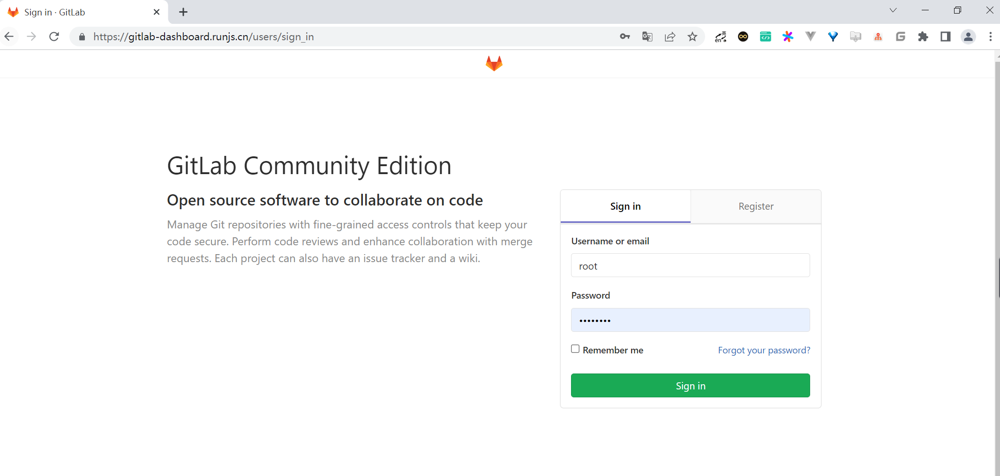
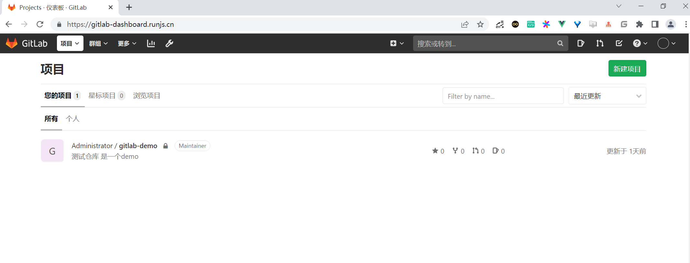
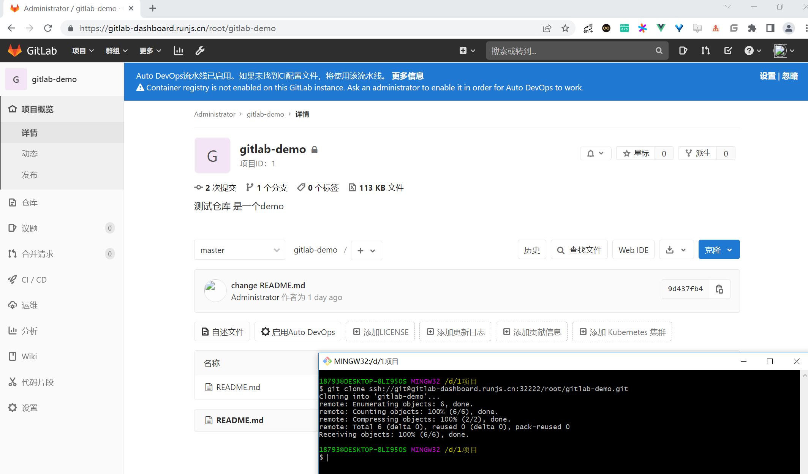

.. contents::
   :depth: 3
..

Gitlab
======

Gitlab 官方提供了 Helm 的方式在 Kubernetes
集群中来快速安装，但是在使用的过程中发现 Helm 提供的 Chart
包中有很多其他额外的配置，所以我们这里使用自定义的方式来安装，也就是自己来定义一些资源清单文件。

Gitlab 主要涉及到3个应用：Redis、Postgresql、Gitlab
核心程序，实际上我们只要将这3个应用分别启动起来，然后加上对应的配置就可以很方便的安装
Gitlab 了，我们这里选择使用的镜像不是官方的，而是 Gitlab
容器化中使用非常多的一个第三方镜像：sameersbn/gitlab，基本上和官方保持同步更新，地址：http://www.damagehead.com/docker-gitlab/

如果我们已经有可使用的 Redis 或 Postgresql 服务的话，那么直接配置在
Gitlab 环境变量中即可，如果没有的话就单独部署,我们这里为了展示 gitlab
部署的完整性，还是分开部署。

1.部署
------

首先部署需要的 Redis 服务，对应的资源清单文件如下：(gitlab-redis.yaml)

``gitlab-redis.yaml``

.. code:: yaml

   apiVersion: apps/v1
   kind: Deployment
   metadata:
     name: redis
     namespace: kube-ops
     labels:
       name: redis
   spec:
     selector:
       matchLabels:
         name: redis
     template:
       metadata:
         name: redis
         labels:
           name: redis
       spec:
         containers:
         - name: redis
           image: sameersbn/redis:4.0.9-2
           imagePullPolicy: IfNotPresent
           ports:
           - name: redis
             containerPort: 6379
           volumeMounts:
           - mountPath: /var/lib/redis
             name: data
           livenessProbe:
             exec:
               command:
               - redis-cli
               - ping
             initialDelaySeconds: 30
             timeoutSeconds: 5
           readinessProbe:
             exec:
               command:
               - redis-cli
               - ping
             initialDelaySeconds: 30
             timeoutSeconds: 1
         volumes:
         - name: data
           emptyDir: {}
   ---
   apiVersion: v1
   kind: Service
   metadata:
     name: redis
     namespace: kube-ops
     labels:
       name: redis
   spec:
     ports:
       - name: redis
         port: 6379
         targetPort: redis
     selector:
       name: redis

然后是数据库
Postgresql，对应的资源清单文件如下：(gitlab-postgresql.yaml)

``gitlab-postgresql.yaml``

.. code:: yaml

   apiVersion: v1
   kind: PersistentVolume
   metadata:
     name: gitlab-postgresql-pv
     namespace: kube-ops
     labels:
       app: postgresql
   spec:
     capacity:
       storage: 200Gi
     accessModes:
       - ReadWriteOnce
     persistentVolumeReclaimPolicy: Retain
     storageClassName: managed-nfs-storage
     mountOptions:
       - hard
       - nfsvers=4.1
     nfs:
       server: 192.168.1.60
       path: /k8ssc/gitlab-postgresql
   ---
   kind: PersistentVolumeClaim
   apiVersion: v1
   metadata:
     name: gitlab-postgresql-pvc
     namespace: kube-ops
   spec:
     accessModes:
       - ReadWriteOnce
     storageClassName: managed-nfs-storage
     resources:
       requests:
         storage: 200Gi
     selector:
       matchLabels:
         app: postgresql
   ---
   apiVersion: apps/v1
   kind: Deployment
   metadata:
     name: postgresql
     namespace: kube-ops
     labels:
       name: postgresql
   spec:
     selector:
       matchLabels:
         name: postgresql
     template:
       metadata:
         name: postgresql
         labels:
           name: postgresql
       spec:
         containers:
         - name: postgresql
           image: sameersbn/postgresql:10-2
           imagePullPolicy: IfNotPresent
           env:
           - name: DB_USER
             value: gitlab
           - name: DB_PASS
             value: passw0rd
           - name: DB_NAME
             value: gitlab_production
           - name: DB_EXTENSION
             value: pg_trgm
           - name: USERMAP_UID
             value: "999"
           - name: USERMAP_GID
             value: "999"
           ports:
           - name: postgres
             containerPort: 5432
           volumeMounts:
           - mountPath: /var/lib/postgresql
             name: data
           readinessProbe:
             exec:
               command:
               - pg_isready
               - -h
               - localhost
               - -U
               - postgres
             initialDelaySeconds: 30
             timeoutSeconds: 1
         volumes:
         - name: data
           persistentVolumeClaim:
             claimName: gitlab-postgresql-pvc
   ---
   apiVersion: v1
   kind: Service
   metadata:
     name: postgresql
     namespace: kube-ops
     labels:
       name: postgresql
   spec:
     ports:
       - name: postgres
         port: 5432
         targetPort: postgres
     selector:
       name: postgresql

为了提高数据库的性能，我们这里也没有使用共享存储之类的，而是直接用的
Local PV 将应用固定到一个节点上。然后就是我们最核心的 Gitlab
的应用，对应的资源清单文件如下：(gitlab.yaml)

``gitlab.yaml``

.. code:: yaml

   apiVersion: v1
   kind: PersistentVolume
   metadata:
     name: gitlab-pv
     namespace: kube-ops
     labels:
       app: gitlab
   spec:
     capacity:
       storage: 500Gi
     accessModes:
       - ReadWriteOnce
     persistentVolumeReclaimPolicy: Retain
     storageClassName: managed-nfs-storage
     mountOptions:
       - hard
       - nfsvers=4.1
     nfs:
       server: 192.168.1.60
       path: /k8ssc/gitlab
   ---
   kind: PersistentVolumeClaim
   apiVersion: v1
   metadata:
     name: gitlab-pvc
     namespace: kube-ops
   spec:
     accessModes:
       - ReadWriteOnce
     storageClassName: managed-nfs-storage
     resources:
       requests:
         storage: 500Gi
     selector:
       matchLabels:
         app: gitlab
   ---
   apiVersion: apps/v1
   kind: Deployment
   metadata:
     name: gitlab
     namespace: kube-ops
     labels:
       name: gitlab
   spec:
     selector:
       matchLabels:
         name: gitlab
     template:
       metadata:
         name: gitlab
         labels:
           name: gitlab
       spec:
         initContainers:
         - name: fix-permissions
           image: busybox
           command: ["sh", "-c", "chown -R 1000:1000 /home/git/data"]
           securityContext:
             privileged: true
           volumeMounts:
           - name: data
             mountPath: /home/git/data
         containers:
         - name: gitlab
           image: sameersbn/gitlab:12.9.5
           imagePullPolicy: IfNotPresent
           env:
           - name: TZ
             value: Asia/Shanghai
           - name: GITLAB_TIMEZONE
             value: Beijing
           - name: GITLAB_SECRETS_DB_KEY_BASE
             value: long-and-random-alpha-numeric-string
           - name: GITLAB_SECRETS_SECRET_KEY_BASE
             value: long-and-random-alpha-numeric-string
           - name: GITLAB_SECRETS_OTP_KEY_BASE
             value: long-and-random-alpha-numeric-string
           - name: GITLAB_ROOT_PASSWORD
             value: admin321
           - name: GITLAB_ROOT_EMAIL
             value: 1879324764@qq.com
           - name: GITLAB_HOST
             value: gitlab-dashboard.runjs.cn
           - name: GITLAB_PORT
             value: "80"
           - name: GITLAB_SSH_PORT
             value: "32222"
           - name: GITLAB_NOTIFY_ON_BROKEN_BUILDS
             value: "true"
           - name: GITLAB_NOTIFY_PUSHER
             value: "false"
           - name: GITLAB_BACKUP_SCHEDULE
             value: daily
           - name: GITLAB_BACKUP_TIME
             value: 01:00
           - name: DB_TYPE
             value: postgres
           - name: DB_HOST
             value: postgresql
           - name: DB_PORT
             value: "5432"
           - name: DB_USER
             value: gitlab
           - name: DB_PASS
             value: passw0rd
           - name: DB_NAME
             value: gitlab_production
           - name: REDIS_HOST
             value: redis
           - name: REDIS_PORT
             value: "6379"
           ports:
           - name: http
             containerPort: 80
           - name: ssh
             containerPort: 22
           volumeMounts:
           - mountPath: /home/git/data
             name: data
           readinessProbe:
             httpGet:
               path: /
               port: 80
             initialDelaySeconds: 60
             timeoutSeconds: 1
         volumes:
         - name: data
           persistentVolumeClaim:
             claimName: gitlab-pvc
   ---
   apiVersion: v1
   kind: Service
   metadata:
     name: gitlab
     namespace: kube-ops
     labels:
       name: gitlab
   spec:
     ports:
       - name: http
         port: 80
         targetPort: http
       - name: ssh
         port: 22
         targetPort: ssh
         nodePort: 32222
     type: NodePort
     selector:
       name: gitlab

同样因为我们这里的 gitlab 镜像内部是一个 ``git``
的用户（id=1000），所以我们这里为了持久化数据通过一个 initContainers
将我们的数据目录权限进行更改：

.. code:: yaml

   initContainers:
   - name: fix-permissions
     image: busybox
     command: ["sh", "-c", "chown -R 1000:1000 /home/git/data"]
     securityContext:
       privileged: true
     volumeMounts:
     - name: data
       mountPath: /home/git/data

.. code:: bash

   $ kubectl apply -f gitlab-redis.yaml gitlab-postgresql.yaml gitlab.yaml

创建完成后，查看 Pod 的部署状态：

.. code:: shell

   $ kubectl get pod -n kube-ops
   NAME                          READY   STATUS    RESTARTS   AGE
   gitlab-8599d69548-cgt4h       1/1     Running   0          16m
   postgresql-65c9cdc4f4-ld86d   1/1     Running   0          16m
   redis-7685d4576b-dblr6        1/1     Running   0          16m

``gitlab-ingress.yaml``

.. code:: yaml

   apiVersion: extensions/v1beta1
   kind: Ingress
   metadata:
     name: gitlab-ingress
     namespace: kube-ops
   spec:
     rules:
     - host: gitlab-dashboard.runjs.cn
       http:
         paths:
         - path: /
           backend:
             serviceName: gitlab
             servicePort: 80

可以看到都已经部署成功了，然后我们可以通过 Ingress 中定义的域名
``git.k8s.local``\ (需要做 DNS 解析或者在本地 ``/etc/hosts``
中添加映射)来访问 Portal：

.. code:: bash

   $ kubectl get ingress -n kube-ops
   NAME             CLASS    HOSTS                       ADDRESS   PORTS   AGE
   gitlab-ingress   <none>   gitlab-dashboard.runjs.cn             80      16m

2.使用
------

使用用户名 ``root``\ ，和部署的时候指定的超级用户密码
``GITLAB_ROOT_PASSWORD=admin321`` 即可登录进入到首页：

Gitlab
运行后，我们可以注册为新用户并创建一个项目，还可以做很多的其他系统设置，比如设置语言、设置应用风格样式等等。

点击 ``Create a project`` 创建一个新的项目，和 Github
使用上没有多大的差别：

创建完成后，我们可以添加本地用户的一个 ``SSH-KEY``\ ，这样我们就可以通过
``SSH`` 来拉取或者推送代码了。SSH 公钥通常包含在 ``~/.ssh/id_rsa.pub``
文件中，并以 ``ssh-rsa`` 开头。如果没有的话可以使用 ``ssh-keygen``
命令来生成，\ ``id_rsa.pub`` 里面的内容就是我们需要的 SSH
公钥，然后添加到 Gitlab 中。

由于平时使用的 ssh 默认是 22 端口，现在如果用默认的 22
端口去连接，是没办法和 Gitlab 容器中的 22
端口进行映射的，因为我们只是通过 Service 的 22
端口进行了映射，要想通过节点去进行 ssh
链接就需要在节点上一个端口和容器内部的 22
端口进行绑定，所以这里我们可以通过 NodePort 去映射 Gitlab 容器内部的 22
端口，我们可以将环境变量设置为 ``GITLAB_SSH_PORT=30022``\ ，将 Gitlab 的
Service 也设置为 NodePort 类型：

.. code:: yaml

   apiVersion: v1
   kind: Service
   metadata:
     name: gitlab
     namespace: kube-ops
     labels:
       name: gitlab
   spec:
     ports:
       - name: http
         port: 80
         targetPort: http
       - name: ssh
         port: 22
         targetPort: ssh
         nodePort: 32222
     type: NodePort
     selector:
       name: gitlab

注意上面 ssh 对应的 nodePort 端口设置为
30022，这样就不会随机生成了，重新更新下 Deployment 和
Service，更新完成后，现在我们在项目上面 Clone 的时候使用 ssh
就会带上端口号了。

3.参考文献
----------

https://www.qikqiak.com/k8strain/devops/gitlab/
