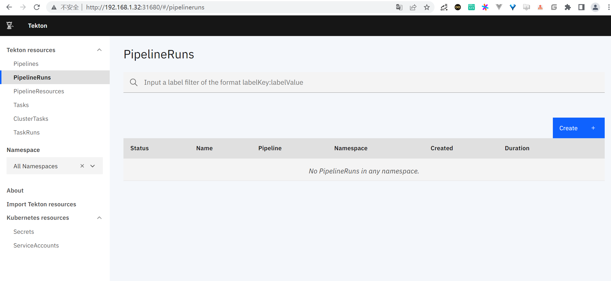

# Tekton

Tekton 是一款功能非常强大而灵活的 CI/CD 开源的云原生框架。Tekton 的前身是 Knative 项目的 build-pipeline 项目，这个项目是为了给 build 模块增加 pipeline 的功能，但是随着不同的功能加入到 Knative build 模块中，build 模块越来越变得像一个通用的 CI/CD 系统，于是，索性将 build-pipeline 剥离出 Knative，就变成了现在的 Tekton，而 Tekton 也从此致力于提供全功能、标准化的云原生 CI/CD 解决方案。


## 1.安装

安装 Tekton 非常简单，可以直接通过 tektoncd/pipeline 的 GitHub 仓库中的 release.yaml 文件进行安装，如下所示的命令：

```shell
$ kubectl apply -f https://github.com/tektoncd/pipeline/releases/download/v0.12.0/release.yaml
```

由于官方使用的镜像是 gcr 的镜像，所以正常情况下我们是获取不到的，如果你的集群由于某些原因获取不到镜像，可以使用下面的资源清单文件，我已经将镜像替换成了 Docker Hub 上面的镜像：

```shell
$ kubectl apply -f https://www.qikqiak.com/k8strain/devops/manifests/tekton/release.yaml
```

上面的资源清单文件安装后，会创建一个名为 tekton-pipelines 的命名空间，在该命名空间下面会有大量和 tekton 相关的资源对象，我们可以通过在该命名空间中查看 Pod 并确保它们处于 Running 状态来检查安装是否成功：

```shell
$ kubectl get pods -n tekton-pipelines
NAME                                           READY   STATUS    RESTARTS   AGE
tekton-pipelines-controller-6fd67c849f-26k6d   1/1     Running   0          93m
tekton-pipelines-webhook-7dc48bc5f7-zgnc4      1/1     Running   0          93m
```

Tekton 安装完成后，我们还可以选择是否安装 CLI 工具，有时候可能 Tekton 提供的命令行工具比 kubectl 管理这些资源更加方便，当然这并不是强制的，我这里是 Mac 系统，所以可以使用常用的 Homebrew 工具来安装：

```shell
$ brew tap tektoncd/tools
$ brew install tektoncd/tools/tektoncd-cli
```

安装完成后可以通过如下命令验证 CLI 是否安装成功：

```shell
$ tkn version
Client version: 0.9.0
Pipeline version: v0.12.0
```

此外，还可以安装一个 Tekton 提供的一个 Dashboard，我们可以通过 Dashboard 查看 Tekton 整个任务的构建过程，直接执行下面的命令直接安装即可：

```shell
$ kubectl apply -f https://www.qikqiak.com/k8strain/devops/manifests/tekton/dashboard.yaml
```

安装完成后我们可以通过 Dashboard 的 Service 的 NodePort 来访问应用。

```shell
$ kubectl get svc -n tekton-pipelines
NAME                          TYPE        CLUSTER-IP       EXTERNAL-IP   PORT(S)                     AGE
tekton-dashboard              NodePort    10.110.104.122   <none>        9097:31680/TCP              23s
tekton-pipelines-controller   ClusterIP   10.107.66.8      <none>        9090/TCP                    96m
tekton-pipelines-webhook      ClusterIP   10.101.233.25    <none>        9090/TCP,8008/TCP,443/TCP   96m
```




## 2.概念

Tekton 为 Kubernetes 提供了多种 CRD 资源对象，可用于定义我们的流水线。

主要有以下几个资源对象：

- Task：表示执行命令的一系列步骤，task 里可以定义一系列的 steps，例如编译代码、构建镜像、推送镜像等，每个 step 实际由一个 Pod 执行。
- ClusterTask：覆盖整个集群的任务，而不是单一的某一个命名空间，这是和 Task 最大的区别，其他基本上一致的。
- TaskRun：task 只是定义了一个模版，taskRun 才真正代表了一次实际的运行，当然你也可以自己手动创建一个 taskRun，taskRun 创建出来之后，就会自动触发 task 描述的构建任务。
- Pipeline：一组任务，表示一个或多个 Task、PipelineResource 以及各种定义参数的集合。
- PipelineRun：类似 task 和 taskRun 的关系，pipelineRun 也表示某一次实际运行的 pipeline，下发一个 pipelineRun CRD 实例到 Kubernetes 后，同样也会触发一次 pipeline 的构建。
- PipelineResource：表示 pipeline 输入资源，比如 github 上的源码，或者 pipeline 输出资源，例如一个容器镜像或者构建生成的 jar 包等。


参考文献：

https://www.cnblogs.com/sanduzxcvbnm/p/16326902.html

