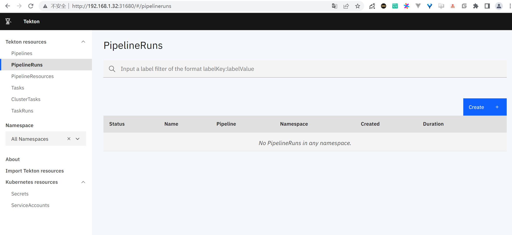

.. contents::
   :depth: 3
..

Tekton
======

Tekton 是一款功能非常强大而灵活的 CI/CD 开源的云原生框架。Tekton
的前身是 Knative 项目的 build-pipeline 项目，这个项目是为了给 build
模块增加 pipeline 的功能，但是随着不同的功能加入到 Knative build
模块中，build 模块越来越变得像一个通用的 CI/CD 系统，于是，索性将
build-pipeline 剥离出 Knative，就变成了现在的 Tekton，而 Tekton
也从此致力于提供全功能、标准化的云原生 CI/CD 解决方案。

1.安装
------

安装 Tekton 非常简单，可以直接通过 tektoncd/pipeline 的 GitHub 仓库中的
release.yaml 文件进行安装，如下所示的命令：

.. code:: shell

   $ kubectl apply -f https://github.com/tektoncd/pipeline/releases/download/v0.12.0/release.yaml

由于官方使用的镜像是 gcr
的镜像，所以正常情况下我们是获取不到的，如果你的集群由于某些原因获取不到镜像，可以使用下面的资源清单文件，我已经将镜像替换成了
Docker Hub 上面的镜像：

.. code:: shell

   $ kubectl apply -f https://www.qikqiak.com/k8strain/devops/manifests/tekton/release.yaml

上面的资源清单文件安装后，会创建一个名为 tekton-pipelines
的命名空间，在该命名空间下面会有大量和 tekton
相关的资源对象，我们可以通过在该命名空间中查看 Pod 并确保它们处于
Running 状态来检查安装是否成功：

.. code:: shell

   $ kubectl get pods -n tekton-pipelines
   NAME                                           READY   STATUS    RESTARTS   AGE
   tekton-pipelines-controller-6fd67c849f-26k6d   1/1     Running   0          93m
   tekton-pipelines-webhook-7dc48bc5f7-zgnc4      1/1     Running   0          93m

Tekton 安装完成后，我们还可以选择是否安装 CLI 工具，有时候可能 Tekton
提供的命令行工具比 kubectl
管理这些资源更加方便，当然这并不是强制的，我这里是 Mac
系统，所以可以使用常用的 Homebrew 工具来安装：

.. code:: shell

   $ brew tap tektoncd/tools
   $ brew install tektoncd/tools/tektoncd-cli

安装完成后可以通过如下命令验证 CLI 是否安装成功：

.. code:: shell

   $ tkn version
   Client version: 0.9.0
   Pipeline version: v0.12.0

此外，还可以安装一个 Tekton 提供的一个 Dashboard，我们可以通过 Dashboard
查看 Tekton 整个任务的构建过程，直接执行下面的命令直接安装即可：

.. code:: shell

   $ kubectl apply -f https://www.qikqiak.com/k8strain/devops/manifests/tekton/dashboard.yaml

安装完成后我们可以通过 Dashboard 的 Service 的 NodePort 来访问应用。

.. code:: shell

   $ kubectl get svc -n tekton-pipelines
   NAME                          TYPE        CLUSTER-IP       EXTERNAL-IP   PORT(S)                     AGE
   tekton-dashboard              NodePort    10.110.104.122   <none>        9097:31680/TCP              23s
   tekton-pipelines-controller   ClusterIP   10.107.66.8      <none>        9090/TCP                    96m
   tekton-pipelines-webhook      ClusterIP   10.101.233.25    <none>        9090/TCP,8008/TCP,443/TCP   96m

2.概念
------

Tekton 为 Kubernetes 提供了多种 CRD 资源对象，可用于定义我们的流水线。

主要有以下几个资源对象：

-  Task：表示执行命令的一系列步骤，task 里可以定义一系列的
   steps，例如编译代码、构建镜像、推送镜像等，每个 step 实际由一个 Pod
   执行。
-  ClusterTask：覆盖整个集群的任务，而不是单一的某一个命名空间，这是和
   Task 最大的区别，其他基本上一致的。
-  TaskRun：task 只是定义了一个模版，taskRun
   才真正代表了一次实际的运行，当然你也可以自己手动创建一个
   taskRun，taskRun 创建出来之后，就会自动触发 task 描述的构建任务。
-  Pipeline：一组任务，表示一个或多个 Task、PipelineResource
   以及各种定义参数的集合。
-  PipelineRun：类似 task 和 taskRun 的关系，pipelineRun
   也表示某一次实际运行的 pipeline，下发一个 pipelineRun CRD 实例到
   Kubernetes 后，同样也会触发一次 pipeline 的构建。
-  PipelineResource：表示 pipeline 输入资源，比如 github 上的源码，或者
   pipeline 输出资源，例如一个容器镜像或者构建生成的 jar 包等。

参考文献：

https://www.cnblogs.com/sanduzxcvbnm/p/16326902.html
