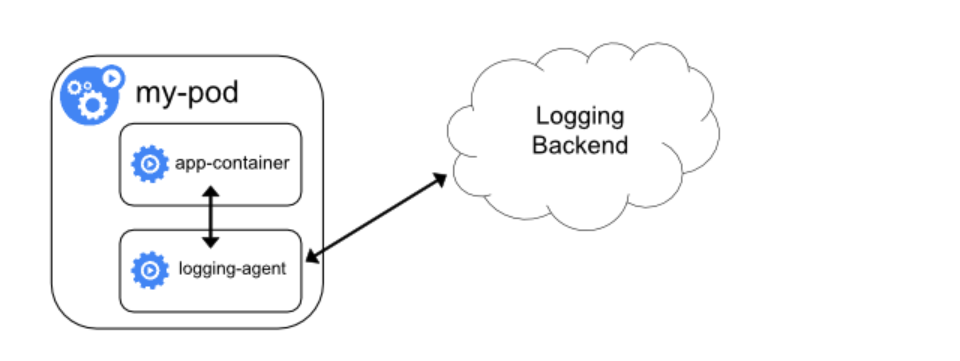

.. contents::
   :depth: 3
..

kubernets日志收集架构
=====================

前面我们学习了 Kubernetes
集群中监控系统的搭建，除了对集群的监控报警之外，还有一项运维工作是非常重要的，那就是日志的收集。

应用程序和系统日志可以帮助我们了解集群内部的运行情况，日志对于我们调试问题和监视集群情况也是非常有用的。而且大部分的应用都会有日志记录，对于传统的应用大部分都会写入到本地的日志文件之中。对于容器化应用程序来说则更简单，只需要将日志信息写入到
stdout 和 stderr 即可，容器默认情况下就会把这些日志输出到宿主机上的一个
JSON 文件之中，同样我们也可以通过 ``docker logs`` 或者 ``kubectl logs``
来查看到对应的日志信息。

但是，通常来说容器引擎或运行时提供的功能不足以记录完整的日志信息，比如，如果容器崩溃了、Pod
被驱逐了或者节点挂掉了，我们仍然也希望访问应用程序的日志。

所以，日志应该独立于节点、Pod 或容器的生命周期，这种设计方式被称为
``cluster-level-logging``\ ，即完全独立于 Kubernetes
系统，需要自己提供单独的日志后端存储、分析和查询工具。

1.Kubernetes 中的基本日志
-------------------------

下面这个示例是 Kubernetes
中的一个基本日志记录的示例，直接将数据输出到标准输出流，如下：

.. code:: yaml

   apiVersion: v1
   kind: Pod
   metadata:
     name: counter
   spec:
     containers:
     - name: count
       image: busybox
       args: [/bin/sh, -c,
               'i=0; while true; do echo "$i: $(date)"; i=$((i+1)); sleep 1; done']

将上面文件保存为 counter-pod.yaml，该 Pod 每秒输出一些文本信息，创建这个
Pod：

.. code:: shell

   $ kubectl apply -f counter-pod.yaml
   pod "counter" created

创建完成后，可以使用 ``kubectl logs`` 命令查看日志信息：

.. code:: shell

   $ kubectl logs counter
   0: Thu Dec 27 15:47:04 UTC 2018
   1: Thu Dec 27 15:47:05 UTC 2018
   2: Thu Dec 27 15:47:06 UTC 2018
   3: Thu Dec 27 15:47:07 UTC 2018
   ......

2.Kubernetes 日志收集
---------------------

Kubernetes
集群本身不提供日志收集的解决方案，一般来说有主要的3种方案来做日志收集：

-  在节点上运行一个 agent 来收集日志
-  在 Pod 中包含一个 sidecar 容器来收集应用日志
-  直接在应用程序中将日志信息推送到采集后端

2.1 节点日志采集代理
~~~~~~~~~~~~~~~~~~~~

.. image:: ../../_static/image-20220726175400508.png

通过在每个节点上运行一个日志收集的 agent 来采集日志数据，日志采集 agent
是一种专用工具，用于将日志数据推送到统一的后端。

一般来说，这种 agent
用一个容器来运行，可以访问该节点上所有应用程序容器的日志文件所在目录。

由于这种 agent 必须在每个节点上运行，所以直接使用 DaemonSet
控制器运行该应用程序即可。

在节点上运行一个日志收集的 agent
这种方式是最常见的一直方法，因为它只需要在每个节点上运行一个代理程序，并不需要对节点上运行的应用程序进行更改，对应用程序没有任何侵入性，但是这种方法也仅仅适用于收集输出到
stdout 和 stderr 的应用程序日志。

2.2 以sidecar容器收集日志
~~~~~~~~~~~~~~~~~~~~~~~~~

我们看上面的图可以看到有一个明显的问题就是我们采集的日志都是通过输出到容器的
stdout 和 stderr 里面的信息，这些信息会在本地的容器对应目录中保留成 JSON
日志文件，所以直接在节点上运行一个 agent 就可以采集到日志。

但是如果我们的应用程序的日志是输出到容器中的某个日志文件的话呢？这种日志数据显然只通过上面的方案是采集不到的了。

用sidecar容器重新输出日志
^^^^^^^^^^^^^^^^^^^^^^^^^

对于上面这种情况我们可以直接在 Pod 中启动另外一个 sidecar
容器，直接将应用程序的日志通过这个容器重新输出到
stdout，这样是不是通过上面的节点日志收集方案又可以完成了。

由于这个 sidecar
容器的主要逻辑就是将应用程序中的日志进行重定向打印，所以背后的逻辑非常简单，开销很小，而且由于输出到了
stdout 或者 stderr，所以我们也可以使用 kubectl logs 来查看日志了。

下面的示例是在 Pod 中将日志记录在了容器的两个本地文件之中：

.. code:: yaml

   apiVersion: v1
   kind: Pod
   metadata:
     name: counter
   spec:
     containers:
     - name: count
       image: busybox
       args:
       - /bin/sh
       - -c
       - >
         i=0;
         while true;
         do
           echo "$i: $(date)" >> /var/log/1.log;
           echo "$(date) INFO $i" >> /var/log/2.log;
           i=$((i+1));
           sleep 1;
         done
       volumeMounts:
       - name: varlog
         mountPath: /var/log
     volumes:
     - name: varlog
       emptyDir: {}

由于 Pod 中容器的特性，我们可以利用另外一个 sidecar
容器去获取到另外容器中的日志文件，然后将日志重定向到自己的 stdout
流中，可以将上面的 YAML
文件做如下修改：（two-files-counter-pod-streaming-sidecar.yaml）

.. code:: yaml

   apiVersion: v1
   kind: Pod
   metadata:
     name: counter
   spec:
     containers:
     - name: count
       image: busybox
       args:
       - /bin/sh
       - -c
       - >
         i=0;
         while true;
         do
           echo "$i: $(date)" >> /var/log/1.log;
           echo "$(date) INFO $i" >> /var/log/2.log;
           i=$((i+1));
           sleep 1;
         done
       volumeMounts:
       - name: varlog
         mountPath: /var/log
     - name: count-log-1
       image: busybox
       args: [/bin/sh, -c, 'tail -n+1 -f /var/log/1.log']
       volumeMounts:
       - name: varlog
         mountPath: /var/log
     - name: count-log-2
       image: busybox
       args: [/bin/sh, -c, 'tail -n+1 -f /var/log/2.log']
       volumeMounts:
       - name: varlog
         mountPath: /var/log
     volumes:
     - name: varlog
       emptyDir: {}

直接创建上面的 Pod：

.. code:: shell

   $ kubectl apply -f two-files-counter-pod-streaming-sidecar.yaml
   pod "counter" created

运行成功后，我们可以通过下面的命令来查看日志的信息：

.. code:: shell

   $ kubectl logs counter count-log-1
   0: Mon Jan  1 00:00:00 UTC 2001
   1: Mon Jan  1 00:00:01 UTC 2001
   2: Mon Jan  1 00:00:02 UTC 2001
   ...
   $ kubectl logs counter count-log-2
   Mon Jan  1 00:00:00 UTC 2001 INFO 0
   Mon Jan  1 00:00:01 UTC 2001 INFO 1
   Mon Jan  1 00:00:02 UTC 2001 INFO 2
   ...

这样前面节点上的日志采集 agent
就可以自动获取这些日志信息，而不需要其他配置。

这种方法虽然可以解决上面的问题，但是也有一个明显的缺陷，就是日志不仅会在原容器文件中保留下来，还会通过
stdout 输出后占用磁盘空间，这样无形中就增加了一倍磁盘空间。

使用sidecar运行日志采集agent
^^^^^^^^^^^^^^^^^^^^^^^^^^^^

如果你觉得在节点上运行一个日志采集的代理不够灵活的话，那么你也可以创建一个单独的日志采集代理程序的
sidecar 容器，不过需要单独配置和应用程序一起运行。

不过这样虽然更加灵活，但是在 sidecar
容器中运行日志采集代理程序会导致大量资源消耗，因为你有多少个要采集的
Pod，就需要运行多少个采集代理程序，另外还无法使用 kubectl logs
命令来访问这些日志，因为它们不受 kubelet 控制。

举个例子，你可以使用的 Stackdriver，它使用 fluentd
作为记录剂。以下是两个可用于实现此方法的配置文件。第一个文件包含配置流利的
ConfigMap。

下面是 Kubernetes 官方的一个 fluentd 的配置文件示例，使用 ConfigMap
对象来保存：

.. code:: yaml

   apiVersion: v1
   kind: ConfigMap
   metadata:
     name: fluentd-config
   data:
     fluentd.conf: |
       <source>
         type tail
         format none
         path /var/log/1.log
         pos_file /var/log/1.log.pos
         tag count.format1
       </source>

       <source>
         type tail
         format none
         path /var/log/2.log
         pos_file /var/log/2.log.pos
         tag count.format2
       </source>

       <match **>
         type google_cloud
       </match>

上面的配置文件是配置收集原文件 ``/var/log/1.log`` 和 ``/var/log/2.log``
的日志数据，然后通过 google_cloud 这个插件将数据推送到 Stackdriver
后端去。

下面是我们使用上面的配置文件在应用程序中运行一个 fluentd
的容器来读取日志数据：

.. code:: yaml

   apiVersion: v1
   kind: Pod
   metadata:
     name: counter
   spec:
     containers:
     - name: count
       image: busybox
       args:
       - /bin/sh
       - -c
       - >
         i=0;
         while true;
         do
           echo "$i: $(date)" >> /var/log/1.log;
           echo "$(date) INFO $i" >> /var/log/2.log;
           i=$((i+1));
           sleep 1;
         done
       volumeMounts:
       - name: varlog
         mountPath: /var/log
     - name: count-agent
       image: k8s.gcr.io/fluentd-gcp:1.30
       env:
       - name: FLUENTD_ARGS
         value: -c /etc/fluentd-config/fluentd.conf
       volumeMounts:
       - name: varlog
         mountPath: /var/log
       - name: config-volume
         mountPath: /etc/fluentd-config
     volumes:
     - name: varlog
       emptyDir: {}
     - name: config-volume
       configMap:
         name: fluentd-config

上面的 Pod 创建完成后，容器 count-agent 就会将 count
容器中的日志进行收集然后上传。当然，这只是一个简单的示例，我们也完全可以使用其他的任何日志采集工具来替换
fluentd，比如 logstash、fluent-bit 等等。

2.3直接从应用程序收集日志
~~~~~~~~~~~~~~~~~~~~~~~~~

除了上面的几种方案之外，我们也完全可以通过直接在应用程序中去显示的将日志推送到日志后端，但是这种方式需要代码层面的实现，也超出了
Kubernetes 本身的范围。

3.搭建EFK日志系统
-----------------

前面大家介绍了 Kubernetes 集群中的几种日志收集方案，Kubernetes
中比较流行的日志收集解决方案是 Elasticsearch、Fluentd 和
Kibana（EFK）技术栈，也是官方现在比较推荐的一种方案。

``Elasticsearch``
是一个实时的、分布式的可扩展的搜索引擎，允许进行全文、结构化搜索，它通常用于索引和搜索大量日志数据，也可用于搜索许多不同类型的文档。

Elasticsearch 通常与 ``Kibana`` 一起部署，Kibana 是 Elasticsearch
的一个功能强大的数据可视化 Dashboard，Kibana 允许你通过 web 界面来浏览
Elasticsearch 日志数据。

``Fluentd``\ 是一个流行的开源数据收集器，我们将在 Kubernetes
集群节点上安装
Fluentd，通过获取容器日志文件、过滤和转换日志数据，然后将数据传递到
Elasticsearch 集群，在该集群中对其进行索引和存储。

我们先来配置启动一个可扩展的 Elasticsearch 集群，然后在 Kubernetes
集群中创建一个 Kibana 应用，最后通过 DaemonSet 来运行
Fluentd，以便它在每个 Kubernetes 工作节点上都可以运行一个 Pod。

   提示:

   如果你了解 EFK 的基本原理，只是为了测试可以直接使用 Kubernetes
   官方提供的 addon
   插件的资源清单，地址：https://github.com/kubernetes/kubernetes/blob/master/cluster/addons/fluentd-elasticsearch/，直接安装即可。

3.1 创建Elasticsearch集群
~~~~~~~~~~~~~~~~~~~~~~~~~

在创建 Elasticsearch
集群之前，我们先创建一个命名空间，我们将在其中安装所有日志相关的资源对象。

新建一个 kube-logging.yaml 文件：

.. code:: yaml

   apiVersion: v1
   kind: Namespace
   metadata:
     name: logging

然后通过 kubectl 创建该资源清单，创建一个名为 logging 的 namespace：

.. code:: shell

   $ kubectl create -f kube-logging.yaml
   namespace/logging created
   $ kubectl get ns
   NAME           STATUS    AGE
   default        Active    244d
   istio-system   Active    100d
   kube-ops       Active    179d
   kube-public    Active    244d
   kube-system    Active    244d
   logging        Active    4h
   monitoring     Active    35d

现在创建了一个命名空间来存放我们的日志相关资源，接下来可以部署 EFK
相关组件，首先开始部署一个3节点的 Elasticsearch 集群。

这里我们使用3个 Elasticsearch Pod
来避免高可用下多节点集群中出现的“脑裂”问题，当一个或多个节点无法与其他节点通信时会产生“脑裂”，可能会出现几个主节点。

   了解更多 Elasticsearch 集群脑裂问题，可以查看文档

   https://www.elastic.co/guide/en/elasticsearch/reference/current/modules-node.html#split-brain

一个关键点是您应该设置参数\ ``discover.zen.minimum_master_nodes=N/2+1``\ ，其中\ ``N``\ 是
Elasticsearch
集群中符合主节点的节点数，比如我们这里3个节点，意味着\ ``N``\ 应该设置为2。

这样，如果一个节点暂时与集群断开连接，则另外两个节点可以选择一个新的主节点，并且集群可以在最后一个节点尝试重新加入时继续运行，在扩展
Elasticsearch 集群时，一定要记住这个参数。

首先创建一个名为 elasticsearch 的无头服务，新建文件
elasticsearch-svc.yaml，文件内容如下：

.. code:: yaml

   kind: Service
   apiVersion: v1
   metadata:
     name: elasticsearch
     namespace: logging
     labels:
       app: elasticsearch
   spec:
     selector:
       app: elasticsearch
     clusterIP: None
     ports:
       - port: 9200
         name: rest
       - port: 9300
         name: inter-node

定义了一个名为 elasticsearch 的 Service，指定标签
``app=elasticsearch``\ ，当我们将 Elasticsearch StatefulSet
与此服务关联时，服务将返回带有标签 ``app=elasticsearch``\ 的
Elasticsearch Pods 的 DNS A 记录，然后设置
``clusterIP=None``\ ，将该服务设置成无头服务。最后，我们分别定义端口9200、9300，分别用于与
REST API 交互，以及用于节点间通信。

使用 kubectl 直接创建上面的服务资源对象：

.. code:: shell

   $ kubectl create -f elasticsearch-svc.yaml
   service/elasticsearch created
   $ kubectl get services --namespace=logging
   Output
   NAME            TYPE        CLUSTER-IP   EXTERNAL-IP   PORT(S)             AGE
   elasticsearch   ClusterIP   None         <none>        9200/TCP,9300/TCP   26s

现在我们已经为 Pod
设置了无头服务和一个稳定的域名\ ``.elasticsearch.logging.svc.cluster.local``\ ，接下来我们通过
StatefulSet 来创建具体的 Elasticsearch 的 Pod 应用。

Kubernetes StatefulSet 允许我们为 Pod
分配一个稳定的标识和持久化存储，Elasticsearch 需要稳定的存储来保证 Pod
在重新调度或者重启后的数据依然不变，所以需要使用 StatefulSet 来管理
Pod。

   要了解更多关于 StaefulSet 的信息，可以查看官网关于 StatefulSet
   的相关文档：

   https://kubernetes.io/docs/concepts/workloads/controllers/statefulset/。

.. code:: yaml

   apiVersion: apps/v1
   kind: StatefulSet
   metadata:
     name: es
     namespace: logging
   spec:
     serviceName: elasticsearch
     replicas: 3
     selector:
       matchLabels:
         app: elasticsearch
     template:
       metadata:
         labels:
           app: elasticsearch

该内容中，我们定义了一个名为 es 的 StatefulSet
对象，然后定义\ ``serviceName=elasticsearch``\ 和前面创建的 Service
相关联，这可以确保使用以下 DNS 地址访问 StatefulSet 中的每一个
Pod：\ ``es-[0,1,2].elasticsearch.logging.svc.cluster.local``\ ，其中[0,1,2]对应于已分配的
Pod 序号。

然后指定3个副本，将 matchLabels 设置为\ ``app=elasticsearch``\ ，所以
Pod
的模板部分\ ``.spec.template.metadata.lables``\ 也必须包含\ ``app=elasticsearch``\ 标签。

然后定义 Pod 模板部分内容：

::

   ...
     spec:
       containers:
       - name: elasticsearch
         image: docker.elastic.co/elasticsearch/elasticsearch:7.6.2
         resources:
           limits:
             cpu: 1000m
           requests:
             cpu: 100m
         ports:
         - containerPort: 9200
           name: rest
           protocol: TCP
         - containerPort: 9300
           name: inter-node
           protocol: TCP
         volumeMounts:
         - name: data
           mountPath: /usr/share/elasticsearch/data
         env:
           - name: cluster.name
             value: k8s-logs
           - name: node.name
             valueFrom:
               fieldRef:
                 fieldPath: metadata.name
           - name: cluster.initial_master_nodes
             value: "es-0,es-1,es-2"
           - name: discovery.zen.minimum_master_nodes
             value: "2"
           - name: discovery.seed_hosts
             value: "elasticsearch"
           - name: ES_JAVA_OPTS
             value: "-Xms512m -Xmx512m"
           - name: network.host
             value: "0.0.0.0"

该部分是定义 StatefulSet 中的
Pod，暴露了9200和9300两个端口，注意名称要和上面定义的 Service 保持一致。

然后通过 volumeMount 声明了数据持久化目录，下面我们再来定义
VolumeClaims。最后就是我们在容器中设置的一些环境变量了：

-  cluster.name：Elasticsearch 集群的名称，我们这里命名成 k8s-logs。
-  node.name：节点的名称，通过 ``metadata.name`` 来获取。这将解析为
   es-[0,1,2]，取决于节点的指定顺序。
-  discovery.seed_hosts：此字段用于设置在 Elasticsearch
   集群中节点相互连接的发现方法。由于我们之前配置的无头服务，我们的 Pod
   具有唯一的 DNS
   域\ ``es-[0,1,2].elasticsearch.logging.svc.cluster.local``\ ，因此我们相应地设置此变量。要了解有关
   Elasticsearch 发现的更多信息，请参阅 Elasticsearch
   官方文档：https://www.elastic.co/guide/en/elasticsearch/reference/current/modules-discovery.html。
-  discovery.zen.minimum_master_nodes：我们将其设置为\ ``(N/2) + 1``\ ，\ ``N``\ 是我们的群集中符合主节点的节点的数量。我们有3个
   Elasticsearch
   节点，因此我们将此值设置为2（向下舍入到最接近的整数）。要了解有关此参数的更多信息，请参阅官方
   Elasticsearch
   文档：https://www.elastic.co/guide/en/elasticsearch/reference/current/modules-node.html#split-brain。
-  ES_JAVA_OPTS：这里我们设置为\ ``-Xms512m -Xmx512m``\ ，告诉\ ``JVM``\ 使用\ ``512 MB``\ 的最小和最大堆。您应该根据群集的资源可用性和需求调整这些参数。要了解更多信息，请参阅设置堆大小的相关文档：https://www.elastic.co/guide/en/elasticsearch/reference/current/heap-size.html。

接下来添加关于 initContainer 的内容：

::

   ...
       initContainers:
       - name: increase-vm-max-map
         image: busybox
         command: ["sysctl", "-w", "vm.max_map_count=262144"]
         securityContext:
           privileged: true
       - name: increase-fd-ulimit
         image: busybox
         command: ["sh", "-c", "ulimit -n 65536"]
         securityContext:
           privileged: true

这里我们定义了几个在主应用程序之前运行的 Init
容器，这些初始容器按照定义的顺序依次执行，执行完成后才会启动主应用容器。

第一个名为 increase-vm-max-map
的容器用来增加操作系统对\ ``mmap``\ 计数的限制，默认情况下该值可能太低，导致内存不足的错误，要了解更多关于该设置的信息，可以查看
Elasticsearch
官方文档说明：https://www.elastic.co/guide/en/elasticsearch/reference/current/vm-max-map-count.html。

最后一个初始化容器是用来执行\ ``ulimit``\ 命令增加打开文件描述符的最大数量的。

   此外 `Elastisearch Notes for Production
   Use <https://www.elastic.co/guide/en/elasticsearch/reference/current/docker.html#_notes_for_production_use_and_defaults>`__
   文档还提到了由于性能原因最好禁用 swap，当然对于 Kubernetes
   集群而言，最好也是禁用 swap 分区的。

现在我们已经定义了主应用容器和它之前运行的 Init Containers
来调整一些必要的系统参数，接下来我们可以添加数据目录的持久化相关的配置，在
StatefulSet 中，使用 volumeClaimTemplates 来定义 volume 模板即可：

::

   ...
     volumeClaimTemplates:
     - metadata:
         name: data
         labels:
           app: elasticsearch
       spec:
         accessModes: [ "ReadWriteOnce" ]
         storageClassName: rook-ceph-block
         resources:
           requests:
             storage: 50Gi

我们这里使用 volumeClaimTemplates 来定义持久化模板，Kubernetes
会使用它为 Pod 创建
PersistentVolume，设置访问模式为\ ``ReadWriteOnce``\ ，这意味着它只能被
mount 到单个节点上进行读写，然后最重要的是使用了一个 StorageClass
对象，这里我们就直接使用前面创建的 Ceph RBD 类型的名为
``rook-ceph-block`` 的 StorageClass 对象即可。

最后，我们指定了每个 PersistentVolume 的大小为
50GB，我们可以根据自己的实际需要进行调整该值。

完整的 Elasticsearch StatefulSet 资源清单文件内容如下：

.. code:: yaml

   apiVersion: apps/v1
   kind: StatefulSet
   metadata:
     name: es
     namespace: logging
   spec:
     serviceName: elasticsearch
     replicas: 3
     selector:
       matchLabels:
         app: elasticsearch
     template:
       metadata:
         labels: 
           app: elasticsearch
       spec:
         nodeSelector:
           es: log
         initContainers:
         - name: increase-vm-max-map
           image: busybox
           command: ["sysctl", "-w", "vm.max_map_count=262144"]
           securityContext:
             privileged: true
         - name: increase-fd-ulimit
           image: busybox
           command: ["sh", "-c", "ulimit -n 65536"]
           securityContext:
             privileged: true
         - name: fix-permissions
           image: busybox
           imagePullPolicy: IfNotPresent
           command: ["sh", "-c", "chown -R 1000:1000 /usr/share/elasticsearch/data"]
           securityContext:
             privileged: true
           volumeMounts:
           - name: data
             mountPath: /usr/share/elasticsearch/data
         containers:
         - name: elasticsearch
           image: docker.elastic.co/elasticsearch/elasticsearch:7.6.2
           ports:
           - name: rest
             containerPort: 9200
           - name: inter
             containerPort: 9300
           resources:
             limits:
               cpu: 4096m
             requests:
               cpu: 1000m
           volumeMounts:
           - name: data
             mountPath: /usr/share/elasticsearch/data
           env:
           - name: cluster.name
             value: k8s-logs
           - name: node.name
             valueFrom:
               fieldRef:
                 fieldPath: metadata.name
           - name: cluster.initial_master_nodes
             value: "es-0,es-1,es-2"
           - name: discovery.zen.minimum_master_nodes
             value: "2"
           - name: discovery.seed_hosts
             value: "elasticsearch"
           - name: ES_JAVA_OPTS
             value: "-Xms512m -Xmx512m"
           - name: network.host
             value: "0.0.0.0"
     volumeClaimTemplates:
     - metadata:
         name: data
         labels:
           app: elasticsearch
       spec:
         accessModes: [ "ReadWriteOnce" ]
         storageClassName: efk-nfs
         resources:
           requests:
             storage: 50Gi    

现在直接使用 kubectl 工具部署即可：

.. code:: shell

   # 为node打标签
   $ kubectl label nodes 10.0.0.12 es=log
   $ kubectl label nodes 10.0.0.36 es=log
   $ kubectl label nodes 10.0.0.37 es=log

   # 查看所有标签
   $ kubectl get nodes --show-labels

   # 现在直接使用 kubectl 工具部署即可
   $ kubectl create -f elasticsearch-statefulset.yaml
   statefulset.apps/es created

添加成功后，可以看到 logging 命名空间下面的所有的资源对象：

.. code:: shell

   $ kubectl get sts -n logging
   NAME   READY   AGE
   es     3/3     83m

   $ kubectl get pods -n logging
   NAME                      READY   STATUS    RESTARTS   AGE
   es-0                      1/1     Running   0          83m
   es-1                      1/1     Running   0          82m
   es-2                      1/1     Running   0          81m

   $ kubectl get svc -n logging
   NAME            TYPE        CLUSTER-IP       EXTERNAL-IP   PORT(S)             AGE
   elasticsearch   ClusterIP   None             <none>        9200/TCP,9300/TCP   20h

Pods 部署完成后，我们可以通过请求一个 REST API 来检查 Elasticsearch
集群是否正常运行。使用下面的命令将本地端口9200 转发到 Elasticsearch
节点（如es-0）对应的端口：

.. code:: shell

   $ kubectl port-forward es-0 9200:9200 --namespace=logging
   Forwarding from 127.0.0.1:9200 -> 9200
   Forwarding from [::1]:9200 -> 9200

然后，在另外的终端窗口中，执行如下请求：

.. code:: shell

   $ curl http://localhost:9200/_cluster/state?pretty

正常来说，应该会看到类似于如下的信息：

::

   {
     "cluster_name" : "k8s-logs",
     "compressed_size_in_bytes" : 348,
     "cluster_uuid" : "QD06dK7CQgids-GQZooNVw",
     "version" : 3,
     "state_uuid" : "mjNIWXAzQVuxNNOQ7xR-qg",
     "master_node" : "IdM5B7cUQWqFgIHXBp0JDg",
     "blocks" : { },
     "nodes" : {
       "u7DoTpMmSCixOoictzHItA" : {
         "name" : "es-1",
         "ephemeral_id" : "ZlBflnXKRMC4RvEACHIVdg",
         "transport_address" : "10.244.4.191:9300",
         "attributes" : { }
       },
       "IdM5B7cUQWqFgIHXBp0JDg" : {
         "name" : "es-0",
         "ephemeral_id" : "JTk1FDdFQuWbSFAtBxdxAQ",
         "transport_address" : "10.244.2.215:9300",
         "attributes" : { }
       },
       "R8E7xcSUSbGbgrhAdyAKmQ" : {
         "name" : "es-2",
         "ephemeral_id" : "9wv6ke71Qqy9vk2LgJTqaA",
         "transport_address" : "10.244.40.4:9300",
         "attributes" : { }
       }
     },
   ...

看到上面的信息就表明我们名为 k8s-logs 的 Elasticsearch
集群成功创建了3个节点：es-0，es-1，和es-2，当前主节点是 es-0。

4.创建Kibana 服务
-----------------

Elasticsearch 集群启动成功了，接下来我们可以来部署 Kibana
服务，新建一个名为 kibana.yaml 的文件，对应的文件内容如下：

.. code:: yaml

   apiVersion: v1
   kind: Service
   metadata:
     name: kibana
     namespace: logging
     labels:
       app: kibana
   spec:
     ports:
     - protocol: TCP
       port: 5601
       targetPort: 5601
       nodePort: 30601
     type: NodePort
     
     selector:
       app: kibana

   ---
   apiVersion: apps/v1
   kind: Deployment
   metadata:
     name: kibana
     namespace: logging
     labels:
       app: kibana
   spec:
     selector:
       matchLabels:
         app: kibana
     template:
       metadata:
         labels:
           app: kibana
       spec:
         nodeSelector:
           es: log
         containers:
         - name: kibana
           image: docker.elastic.co/kibana/kibana:7.6.2
           resources:
             limits:
               cpu: 1000m
             requests:
               cpu: 500m
           env:
           - name: ELASTICSEARCH_HOSTS
             value: http://elasticsearch:9200
           ports:
           - containerPort: 5601

上面我们定义了两个资源对象，一个 Service 和
Deployment，为了测试方便，我们将 Service 设置为了 NodePort 类型，Kibana
Pod 中配置都比较简单，唯一需要注意的是我们使用 ``ELASTICSEARCH_HOSTS``
这个环境变量来设置Elasticsearch 集群的端点和端口，直接使用 Kubernetes
DNS 即可，

此端点对应服务名称为 elasticsearch，由于是一个 headless
service，所以该域将解析为3个 Elasticsearch Pod 的 IP 地址列表。

配置完成后，直接使用 kubectl 工具创建：

.. code:: shell

   $ kubectl create -f kibana.yaml
   service/kibana created
   deployment.apps/kibana created

创建完成后，可以查看 Kibana Pod 的运行状态：

.. code:: shell

   $ kubectl get pods --namespace=logging
   NAME                      READY   STATUS    RESTARTS   AGE
   es-0                      1/1     Running   0          85m
   es-1                      1/1     Running   0          84m
   es-2                      1/1     Running   0          83m
   kibana-5c565c47dd-xj4bd   1/1     Running   0          80m

   $ kubectl get svc -n logging
   NAME            TYPE        CLUSTER-IP       EXTERNAL-IP   PORT(S)             AGE
   elasticsearch   ClusterIP   None             <none>        9200/TCP,9300/TCP   3h32m
   kibana          NodePort    172.16.232.190   <none>        5601:30601/TCP      15s

如果 Pod 已经是 Running 状态了，证明应用已经部署成功了，然后可以通过
NodePort 来访问 Kibana
这个服务，在浏览器中打开\ ``http://<任意节点IP>:30601``\ 即可，如果看到如下欢迎界面证明
Kibana 已经成功部署到了 Kubernetes集群之中。

.. image:: ../../_static/image-20220726214606980.png

5.部署Fluentd
-------------

``Fluentd`` 是一个高效的日志聚合器，是用 Ruby
编写的，并且可以很好地扩展。

对于大部分企业来说，Fluentd
足够高效并且消耗的资源相对较少，另外一个工具\ ``Fluent-bit``\ 更轻量级，占用资源更少，但是插件相对
Fluentd 来说不够丰富，所以整体来说，Fluentd
更加成熟，使用更加广泛，所以我们这里也同样使用 Fluentd
来作为日志收集工具。

5.1 工作原理
~~~~~~~~~~~~

Fluentd
通过一组给定的数据源抓取日志数据，处理后（转换成结构化的数据格式）将它们转发给其他服务，比如
Elasticsearch、对象存储等等。Fluentd
支持超过300个日志存储和分析服务，所以在这方面是非常灵活的。主要运行步骤如下：

-  首先 Fluentd 从多个日志源获取数据
-  结构化并且标记这些数据
-  然后根据匹配的标签将数据发送到多个目标服务去

.. image:: ../../_static/image-20220726214920074.png

5.2 配置
~~~~~~~~

一般来说我们是通过一个配置文件来告诉 Fluentd
如何采集、处理数据的，下面简单和大家介绍下 Fluentd 的配置方法。

1.日志源配置
^^^^^^^^^^^^

比如我们这里为了收集 Kubernetes
节点上的所有容器日志，就需要做如下的日志源配置：

::

   <source>
     @id fluentd-containers.log
     @type tail                             # Fluentd 内置的输入方式，其原理是不停地从源文件中获取新的日志。
     path /var/log/containers/*.log         # 挂载的服务器Docker容器日志地址
     pos_file /var/log/es-containers.log.pos
     tag raw.kubernetes.*                   # 设置日志标签
     read_from_head true
     <parse>                                # 多行格式化成JSON
       @type multi_format                   # 使用 multi-format-parser 解析器插件
       <pattern>
         format json                        # JSON 解析器
         time_key time                      # 指定事件时间的时间字段
         time_format %Y-%m-%dT%H:%M:%S.%NZ  # 时间格式
       </pattern>
       <pattern>
         format /^(?<time>.+) (?<stream>stdout|stderr) [^ ]* (?<log>.*)$/
         time_format %Y-%m-%dT%H:%M:%S.%N%:z
       </pattern>
     </parse>
   </source>

上面配置部分参数说明如下：

-  id：表示引用该日志源的唯一标识符，该标识可用于进一步过滤和路由结构化日志数据
-  type：Fluentd 内置的指令，\ ``tail`` 表示 Fluentd
   从上次读取的位置通过 tail 不断获取数据，另外一个是 ``http``
   表示通过一个 GET 请求来收集数据。
-  path：\ ``tail`` 类型下的特定参数，告诉 Fluentd 采集
   ``/var/log/containers`` 目录下的所有日志，这是 docker 在 Kubernetes
   节点上用来存储运行容器 stdout 输出日志数据的目录。
-  pos_file：检查点，如果 Fluentd
   程序重新启动了，它将使用此文件中的位置来恢复日志数据收集。
-  tag：用来将日志源与目标或者过滤器匹配的自定义字符串，Fluentd
   匹配源/目标标签来路由日志数据。

2.路由配置
^^^^^^^^^^

上面是日志源的配置，接下来看看如何将日志数据发送到 Elasticsearch：

::

   <match **>

   @id elasticsearch

   @type elasticsearch

   @log_level info

   include_tag_key true

   type_name fluentd

   host "#{ENV['OUTPUT_HOST']}"

   port "#{ENV['OUTPUT_PORT']}"

   logstash_format true

   <buffer>

   @type file

   path /var/log/fluentd-buffers/kubernetes.system.buffer

   flush_mode interval

   retry_type exponential_backoff

   flush_thread_count 2

   flush_interval 5s

   retry_forever

   retry_max_interval 30

   chunk_limit_size "#{ENV['OUTPUT_BUFFER_CHUNK_LIMIT']}"

   queue_limit_length "#{ENV['OUTPUT_BUFFER_QUEUE_LIMIT']}"

   overflow_action block

   </buffer>

-  match：标识一个目标标签，后面是一个匹配日志源的正则表达式，我们这里想要捕获所有的日志并将它们发送给
   Elasticsearch，所以需要配置成\ ``**``\ 。
-  id：目标的一个唯一标识符。
-  type：支持的输出插件标识符，我们这里要输出到
   Elasticsearch，所以配置成 elasticsearch，这是 Fluentd
   的一个内置插件。
-  log_level：指定要捕获的日志级别，我们这里配置成
   ``info``\ ，表示任何该级别或者该级别以上（INFO、WARNING、ERROR）的日志都将被路由到
   Elsasticsearch。
-  host/port：定义 Elasticsearch 的地址，也可以配置认证信息，我们的
   Elasticsearch 不需要认证，所以这里直接指定 host 和 port 即可。
-  logstash_format：Elasticsearch 服务对日志数据构建反向索引进行搜索，将
   logstash_format 设置为 ``true``\ ，Fluentd 将会以 logstash
   格式来转发结构化的日志数据。
-  Buffer： Fluentd
   允许在目标不可用时进行缓存，比如，如果网络出现故障或者 Elasticsearch
   不可用的时候。缓冲区配置也有助于降低磁盘的 IO。

3.过滤
^^^^^^

由于 Kubernetes
集群中应用太多，也还有很多历史数据，所以我们可以只将某些应用的日志进行收集，比如我们只采集具有
``logging=true`` 这个 Label 标签的 Pod 日志，这个时候就需要使用
filter，如下所示：

::

   # 删除无用的属性
   <filter kubernetes.**>
     @type record_transformer
     remove_keys $.docker.container_id,$.kubernetes.container_image_id,$.kubernetes.pod_id,$.kubernetes.namespace_id,$.kubernetes.master_url,$.kubernetes.labels.pod-template-hash
   </filter>
   # 只保留具有logging=true标签的Pod日志
   <filter kubernetes.**>
     @id filter_log
     @type grep
     <regexp>
       key $.kubernetes.labels.logging
       pattern ^true$
     </regexp>
   </filter>

6.安装
------

要收集 Kubernetes 集群的日志，直接用 DasemonSet 控制器来部署 Fluentd
应用，这样，它就可以从 Kubernetes
节点上采集日志，确保在集群中的每个节点上始终运行一个 Fluentd
容器。当然可以直接使用 Helm
来进行一键安装，为了能够了解更多实现细节，我们这里还是采用手动方法来进行安装。

首先，我们通过 ConfigMap 对象来指定 Fluentd 配置文件，新建
fluentd-configmap.yaml 文件，文件内容如下：

.. code:: yaml

   kind: ConfigMap
   apiVersion: v1
   metadata:
     name: fluentd-config
     namespace: logging
   data:
     system.conf: |-
       <system>
         root_dir /tmp/fluentd-buffers/
       </system>
     containers.input.conf: |-
       <source>
         @id fluentd-containers.log
         @type tail                              # Fluentd 内置的输入方式，其原理是不停地从源文件中获取新的日志。
         path /var/log/containers/*.log          # 挂载的服务器Docker容器日志地址
         pos_file /var/log/es-containers.log.pos
         tag raw.kubernetes.*                    # 设置日志标签
         read_from_head true
         <parse>                                 # 多行格式化成JSON
           @type multi_format                    # 使用 multi-format-parser 解析器插件
           <pattern>
             format json                         # JSON解析器
             time_key time                       # 指定事件时间的时间字段
             time_format %Y-%m-%dT%H:%M:%S.%NZ   # 时间格式
           </pattern>
           <pattern>
             format /^(?<time>.+) (?<stream>stdout|stderr) [^ ]* (?<log>.*)$/
             time_format %Y-%m-%dT%H:%M:%S.%N%:z
           </pattern>
         </parse>
       </source>
       # 在日志输出中检测异常，并将其作为一条日志转发 
       # https://github.com/GoogleCloudPlatform/fluent-plugin-detect-exceptions
       <match raw.kubernetes.**>           # 匹配tag为raw.kubernetes.**日志信息
         @id raw.kubernetes
         @type detect_exceptions           # 使用detect-exceptions插件处理异常栈信息
         remove_tag_prefix raw             # 移除 raw 前缀
         message log                       
         stream stream                     
         multiline_flush_interval 5
         max_bytes 500000
         max_lines 1000
       </match>

       <filter **>                 # 拼接日志
         @id filter_concat
         @type concat                # Fluentd Filter 插件，用于连接多个事件中分隔的多行日志。
         key message
         multiline_end_regexp /\n$/  # 以换行符“\n”拼接
         separator ""
       </filter> 

       # 添加 Kubernetes metadata 数据
       <filter kubernetes.**>
         @id filter_kubernetes_metadata
         @type kubernetes_metadata
       </filter>

       # 修复 ES 中的 JSON 字段
       # 插件地址：https://github.com/repeatedly/fluent-plugin-multi-format-parser
       <filter kubernetes.**>
         @id filter_parser
         @type parser                # multi-format-parser多格式解析器插件
         key_name log                # 在要解析的记录中指定字段名称。
         reserve_data true           # 在解析结果中保留原始键值对。
         remove_key_name_field true  # key_name 解析成功后删除字段。
         <parse>
           @type multi_format
           <pattern>
             format json
           </pattern>
           <pattern>
             format none
           </pattern>
         </parse>
       </filter>

       # 删除一些多余的属性
       <filter kubernetes.**>
         @type record_transformer
         remove_keys $.docker.container_id,$.kubernetes.container_image_id,$.kubernetes.pod_id,$.kubernetes.namespace_id,$.kubernetes.master_url,$.kubernetes.labels.pod-template-hash
       </filter>

       # 只保留具有logging=true标签的Pod日志
       <filter kubernetes.**>
         @id filter_log
         @type grep
         <regexp>
           key $.kubernetes.labels.logging
           pattern ^true$
         </regexp>
       </filter>

     ###### 监听配置，一般用于日志聚合用 ######
     forward.input.conf: |-
       # 监听通过TCP发送的消息
       <source>
         @id forward
         @type forward
       </source>

     output.conf: |-
       <match **>
         @id elasticsearch
         @type elasticsearch
         @log_level info
         include_tag_key true
         host elasticsearch
         port 9200
         logstash_format true
         logstash_prefix k8s                   # 设置 index 前缀为 k8s
         request_timeout    30s
         <buffer>
           @type file
           path /var/log/fluentd-buffers/kubernetes.system.buffer
           flush_mode interval
           retry_type exponential_backoff
           flush_thread_count 2
           flush_interval 5s
           retry_forever
           retry_max_interval 30
           chunk_limit_size 2M
           queue_limit_length 8
           overflow_action block
         </buffer>
       </match>

上面配置文件中我们只配置了 docker
容器日志目录，收集到数据经过处理后发送到 ``elasticsearch:9200`` 服务。

然后新建一个 fluentd-daemonset.yaml 的文件，文件内容如下：

.. code:: yaml

   apiVersion: v1
   kind: ServiceAccount
   metadata:
     name: fluentd-es
     namespace: logging
     labels:
       k8s-app: fluentd-es
       kubernetes.io/cluster-service: "true"
       addonmanager.kubernetes.io/mode: Reconcile
   ---
   kind: ClusterRole
   apiVersion: rbac.authorization.k8s.io/v1
   metadata:
     name: fluentd-es
     labels:
       k8s-app: fluentd-es
       kubernetes.io/cluster-service: "true"
       addonmanager.kubernetes.io/mode: Reconcile
   rules:
   - apiGroups:
     - ""
     resources:
     - "namespaces"
     - "pods"
     verbs:
     - "get"
     - "watch"
     - "list"
   ---
   kind: ClusterRoleBinding
   apiVersion: rbac.authorization.k8s.io/v1
   metadata:
     name: fluentd-es
     labels:
       k8s-app: fluentd-es
       kubernetes.io/cluster-service: "true"
       addonmanager.kubernetes.io/mode: Reconcile
   subjects:
   - kind: ServiceAccount
     name: fluentd-es
     namespace: logging
     apiGroup: ""
   roleRef:
     kind: ClusterRole
     name: fluentd-es
     apiGroup: ""
   ---
   apiVersion: apps/v1
   kind: DaemonSet
   metadata:
     name: fluentd-es
     namespace: logging
     labels:
       k8s-app: fluentd-es
       kubernetes.io/cluster-service: "true"
       addonmanager.kubernetes.io/mode: Reconcile
   spec:
     selector:
       matchLabels:
         k8s-app: fluentd-es
     template:
       metadata:
         labels:
           k8s-app: fluentd-es
           kubernetes.io/cluster-service: "true"
         # 此注释确保如果节点被驱逐，fluentd不会被驱逐，支持关键的基于 pod 注释的优先级方案。
         annotations:
           scheduler.alpha.kubernetes.io/critical-pod: ''
       spec:
         serviceAccountName: fluentd-es
         containers:
         - name: fluentd-es
           image: quay.io/fluentd_elasticsearch/fluentd:v3.0.1
           env:
           - name: FLUENTD_ARGS
             value: --no-supervisor -q
           resources:
             limits:
               memory: 500Mi
             requests:
               cpu: 100m
               memory: 200Mi
           volumeMounts:
           - name: varlog
             mountPath: /var/log
           - name: varlibdockercontainers
             mountPath: /home/cce/docker/containers/
             readOnly: true
           - name: config-volume
             mountPath: /etc/fluent/config.d
         nodeSelector:
           beta.kubernetes.io/fluentd-ds-ready: "true"
         tolerations:
         - operator: Exists
         terminationGracePeriodSeconds: 30
         volumes:
         - name: varlog
           hostPath:
             path: /var/log
         - name: varlibdockercontainers
           hostPath:
             path: /home/cce/docker/containers/
         - name: config-volume
           configMap:
             name: fluentd-config

我们将上面创建的 fluentd-config 这个 ConfigMap 对象通过 volumes 挂载到了
Fluentd
容器中，另外为了能够灵活控制哪些节点的日志可以被收集，所以我们这里还添加了一个
nodSelector 属性：

::

   nodeSelector:
     beta.kubernetes.io/fluentd-ds-ready: "true"

意思就是要想采集节点的日志，那么我们就需要给节点打上上面的标签，比如我们这里只给节点1、节点2、节点3打上了该标签：

.. code:: shell

   # 节点打标签
   $ kubectl label nodes 10.0.0.12 beta.kubernetes.io/fluentd-ds-ready=true
   $ kubectl label nodes 10.0.0.36 beta.kubernetes.io/fluentd-ds-ready=true
   $ kubectl label nodes 10.0.0.37 beta.kubernetes.io/fluentd-ds-ready=true

   # 查看节点标签信息
   $ kubectl get nodes --show-labels

..

   提示

   如果你需要在其他节点上采集日志，则需要给对应节点打上标签，使用如下命令：\ ``kubectl label nodes node名 beta.kubernetes.io/fluentd-ds-ready=true``\ 。

另外由于我们的集群使用的是 kubeadm 搭建的，默认情况下 master
节点有污点，所以如果要想也收集 master 节点的日志，则需要添加上容忍：

::

   tolerations:
   - operator: Exists

另外需要注意的地方是，我这里的测试环境更改了 docker 的根目录：

.. code:: shell

   $ docker info
   ...
   Docker Root Dir: /data/docker
   ...

所以上面要获取 docker
的容器目录需要更改成\ ``/data/docker/containers``\ ，这个地方非常重要，当然如果你没有更改
docker 根目录则使用默认的\ ``/var/lib/docker/containers``\ 目录即可。

分别创建上面的 ConfigMap 对象和 DaemonSet：

.. code:: shell

   $ kubectl create -f fluentd-configmap.yaml
   configmap "fluentd-config" created

   $ kubectl create -f fluentd-daemonset.yaml
   serviceaccount "fluentd-es" created
   clusterrole.rbac.authorization.k8s.io "fluentd-es" created
   clusterrolebinding.rbac.authorization.k8s.io "fluentd-es" created
   daemonset.apps "fluentd-es" created

创建完成后，查看对应的 Pods 列表，检查是否部署成功：

.. code:: shell

   $ kubectl get pods -n logging
   NAME                      READY   STATUS    RESTARTS   AGE
   es-0                      1/1     Running   0          3h2m
   es-1                      1/1     Running   0          3h1m
   es-2                      1/1     Running   0          3h
   fluentd-es-9krhc          1/1     Running   0          6m31s
   fluentd-es-hsk8q          1/1     Running   0          46s
   fluentd-es-l77hc          1/1     Running   0          6m31s
   fluentd-es-sqbtv          1/1     Running   0          6m31s
   kibana-7bdbd4b989-qgpt7   1/1     Running   0          35m

Fluentd 启动成功后，这个时候就可以发送日志到 ES
了，但是我们这里是过滤了只采集具有 ``logging=true`` 标签的 Pod
日志，所以现在还没有任何数据会被采集。

下面我们部署一个简单的测试应用， 新建 counter.yaml 文件，文件内容如下：

.. code:: yaml

   apiVersion: v1
   kind: Pod
   metadata:
     name: counter
     labels:
       logging: "true"  # 一定要具有该标签才会被采集
   spec:
     containers:
     - name: count
       image: busybox
       args: [/bin/sh, -c,
               'i=0; while true; do echo "$i: $(date)"; i=$((i+1)); sleep 1; done']

该 Pod 只是简单将日志信息打印到 ``stdout``\ ，所以正常来说 Fluentd
会收集到这个日志数据，在 Kibana 中也就可以找到对应的日志数据了，使用
kubectl 工具创建该 Pod：

.. code:: shell

   $ kubectl create -f counter.yaml
   $ kubectl get pods
   NAME                             READY   STATUS    RESTARTS   AGE
   counter                          1/1     Running   0          9h

Pod 创建并运行后，回到 Kibana Dashboard 页面，点击左侧最下面的
``management`` 图标，然后点击 Kibana 下面的 ``Index Patterns``
开始导入索引数据：

.. image:: ../../_static/image-20220726222058339.png

在这里可以配置我们需要的 Elasticsearch 索引，前面 Fluentd
配置文件中我们采集的日志使用的是 logstash 格式，定义了一个 ``k8s``
的前缀，所以这里只需要在文本框中输入\ ``k8s-*``\ 即可匹配到
Elasticsearch 集群中采集的 Kubernetes
集群日志数据，然后点击下一步，进入以下页面：

.. image:: ../../_static/image-20220726222219855.png

在该页面中配置使用哪个字段按时间过滤日志数据，在下拉列表中，选择\ ``@timestamp``\ 字段，然后点击\ ``Create index pattern``\ ，创建完成后，点击左侧导航菜单中的\ ``Discover``\ ，然后就可以看到一些直方图和最近采集到的日志数据了：

.. image:: ../../_static/image-20220726224736937.png

现在的数据就是上面 Counter
应用的日志，如果还有其他的应用，我们也可以筛选过滤：

.. image:: ../../_static/image-20220726224810618.png

我们也可以通过其他元数据来过滤日志数据，比如您可以单击任何日志条目以查看其他元数据，如容器名称，Kubernetes
节点，命名空间等。

6.1 日志分析
~~~~~~~~~~~~

上面我们已经可以将应用日志收集起来了，下面我们来使用一个应用演示如何分析采集的日志。示例应用会输出如下所示的
JSON 格式的日志信息：

::

   {"LOGLEVEL":"WARNING","serviceName":"msg-processor","serviceEnvironment":"staging","message":"WARNING client connection terminated unexpectedly."}
   {"LOGLEVEL":"INFO","serviceName":"msg-processor","serviceEnvironment":"staging","message":"","eventsNumber":5}
   {"LOGLEVEL":"INFO","serviceName":"msg-receiver-api":"msg-receiver-api","serviceEnvironment":"staging","volume":14,"message":"API received messages"}
   {"LOGLEVEL":"ERROR","serviceName":"msg-receiver-api","serviceEnvironment":"staging","message":"ERROR Unable to upload files for processing"}

因为 JSON 格式的日志解析非常容易，当我们将日志结构化传输到 ES
过后，我们可以根据特定的字段值而不是文本搜索日志数据，当然纯文本格式的日志我们也可以进行结构化，但是这样每个应用的日志格式不统一，都需要单独进行结构化，非常麻烦，所以建议将日志格式统一成
JSON 格式输出。

我们这里的示例应用会定期输出不同类型的日志消息，包含不同日志级别（INFO/WARN/ERROR）的日志，一行
JSON 日志就是我们收集的一条日志消息，该消息通过 fluentd 进行采集发送到
Elasticsearch。

这里我们会使用到 fluentd 里面的自动 JSON 解析插件，默认情况下，fluentd
会将每个日志文件的一行作为名为 ``log``
的字段进行发送，并自动添加其他字段，比如 ``tag`` 标识容器，\ ``stream``
标识 stdout 或者 stderr。

由于在 fluentd 配置中我们添加了如下所示的过滤器：

::

   <filter kubernetes.**>
     @id filter_parser
     @type parser                # multi-format-parser多格式解析器插件
     key_name log                # 在要解析的记录中指定字段名称
     reserve_data true           # 在解析结果中保留原始键值对
     remove_key_name_field true  # key_name 解析成功后删除字段。
     <parse>
       @type multi_format
       <pattern>
         format json
       </pattern>
       <pattern>
         format none
       </pattern>
     </parse>
   </filter>

该过滤器使用 ``json`` 和 ``none`` 两个插件将 JSON
数据进行结构化，这样就会把 JSON
日志里面的属性解析成一个一个的字段，解析生效过后记得刷新 Kibana
的索引字段，否则会识别不了这些字段，通过 ``管理`` -> ``Index Pattern``
点击刷新字段列表即可。

下面我们将示例应用部署到 Kubernetes 集群中：(dummylogs.yaml)

.. code:: yaml

   apiVersion: apps/v1
   kind: Deployment
   metadata:
     name: dummylogs
   spec:
     replicas: 3
     selector:
       matchLabels:
         app: dummylogs
     template:
       metadata:
         labels:
           app: dummylogs
           logging: "true"  # 要采集日志需要加上该标签
       spec:
         containers:
         - name: dummy
           image: cnych/dummylogs:latest
           args:
           - msg-processor
   ---
   apiVersion: apps/v1
   kind: Deployment
   metadata:
     name: dummylogs2
   spec:
     replicas: 3
     selector:
       matchLabels:
         app: dummylogs2
     template:
       metadata:
         labels:
           app: dummylogs2
           logging: "true"  # 要采集日志需要加上该标签
       spec:
         containers:
         - name: dummy
           image: cnych/dummylogs:latest
           args:
           - msg-receiver-api

直接部署上面的应用即可：

.. code:: shell

   $ kubectl apply -f dummylogs.yaml
   $ kubectl get pods -l logging=true
   NAME                         READY   STATUS    RESTARTS   AGE
   counter                      1/1     Running   0          22h
   dummylogs-6f7b56579d-7js8n   1/1     Running   5          15h
   dummylogs-6f7b56579d-wdnc6   1/1     Running   5          15h
   dummylogs-6f7b56579d-x4twn   1/1     Running   5          15h
   dummylogs2-d9b978d9b-bchks   1/1     Running   5          15h
   dummylogs2-d9b978d9b-wv7rj   1/1     Running   5          15h
   dummylogs2-d9b978d9b-z2r26   1/1     Running   5          15h

部署完成后 dummylogs 和 dummylogs2
两个应用就会开始输出不同级别的日志信息了，记得要给应用所在的节点打上
``beta.kubernetes.io/fluentd-ds-ready=true`` 的标签，否则 fluentd
不会在对应的节点上运行也就不会收集日志了。

正常情况下日志就已经可以被采集到 Elasticsearch 当中了，我们可以前往
Kibana 的 Dashboard 页面查看:

我们可以看到可用的字段中已经包含我们应用中的一些字段了。找到
``serviceName`` 字段点击我们可以查看已经采集了哪些服务的消息：

.. image:: ../../_static/image-20220727093903492.png

可以看到我们收到了来自 ``msg-processor`` 和 ``msg-receiver-api``
的日志信息，在最近15分钟之内，\ ``api``
服务产生的日志更多，点击后面的加号就可以只过滤该服务的日志数据：

.. figure:: ../../_static/image-20220727093947816.png
   :alt: image-20220727093947816

   image-20220727093947816

我们可以看到展示的日志数据的属性比较多，有时候可能不利于我们查看日志，此时我们可以筛选想要展示的字段:

我们可以根据自己的需求选择要显示的字段，现在查看消息的时候就根据清楚了：

.. image:: ../../_static/image-20220727094057425.png

更多日志分析内容参考：

https://www.qikqiak.com/k8strain/logging/efk/

除此之外我们也可以配置将报警信息发往
`企业微信 <https://github.com/anjia0532/elastalert-wechat-plugin>`__
或者
`钉钉 <https://github.com/xuyaoqiang/elastalert-dingtalk-plugin>`__\ ，还可以安装一个
elastalert 的 `Kibana
插件 <https://github.com/bitsensor/elastalert-kibana-plugin>`__\ ，用于在
Kibana 页面上进行可视化操作。

关于 elastalert
更多的操作和使用说明，大家可以查看官方文档了解更多：https://elastalert.readthedocs.io/en/latest/。
