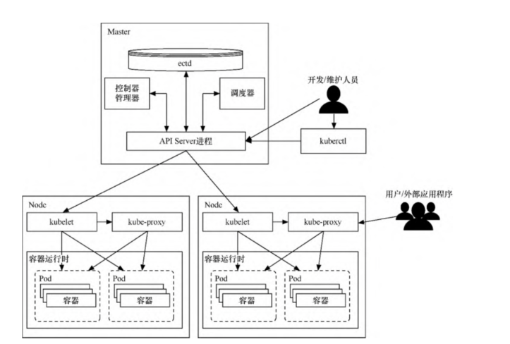
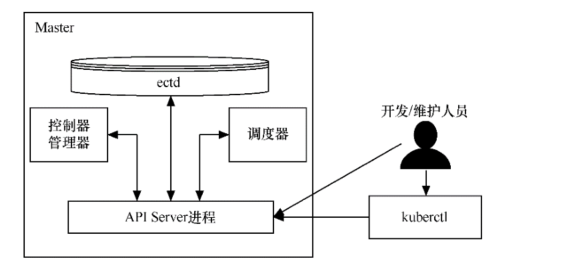
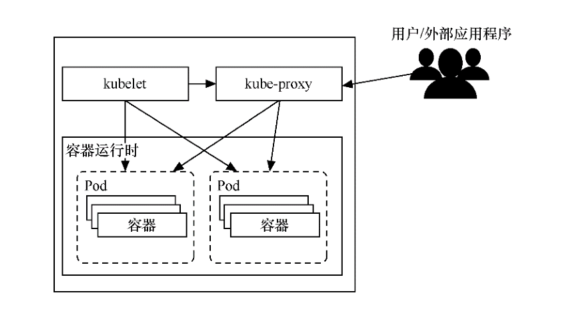
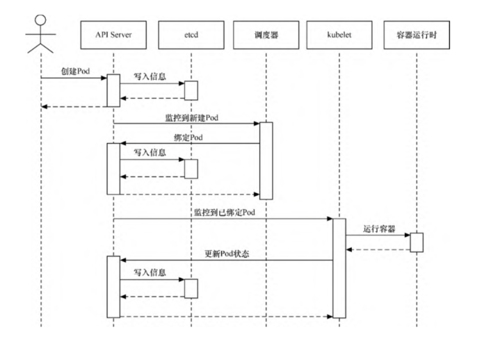

.. contents::
   :depth: 3
..

Kubernetes的设计架构
====================

在Kubernetes集群中，有Master和Node这两种角色。Master管理Node，Node管理容器。

Master主要负责整个集群的管理控制，相当于整个Kubernetes集群的首脑。它用于监控、编排、调度集群中的各个工作节点。

通常Master会占用一台独立的服务器，基于高可用原因，也有可能是多台。

Node则是Kubernetes集群中的各个工作节点。Node由Master管理，提供运行容器所需的各种环境，对容器进行实际的控制，而这些容器会提供实际的应用服务。

Kubernetes的整体架构

|image0|

1.Master
--------

1.1 API Server进程
~~~~~~~~~~~~~~~~~~

PI
Server（kube-apiserver）进程为Kubernetes中各类资源对象提供了增删改查等HTTP
REST接口。

对于资源的任何操作，都需要经过API Server进程来处理。除此之外，API
Server进程还提供了一系列认证授权机制。

访问API Server进程有3种方式。

|image1|

1. 直接通过REST Request的方式来访问。
2. 通过官方提供的客户端库文件来访问，本质上，通过编程方式，转换为对API
   Server进程的REST API调用。
3. 通过命令行工具kubectl客户端来访问。kubectl客户端将把命令行转换为对API
   Server进程的REST API调用。

1.2 etcd
~~~~~~~~

可以将etcd理解为Kubernetes的“数据库”，用于保存集群中所有的配置和各个对象的状态信息。
只有API Server进程才能直接访问和操作etcd。

1.3 调度器
~~~~~~~~~~

调度器（kube-scheduler）是Pod资源的调度器。它用于监听最近创建但还未分配Node的Pod资源，会为Pod自动分配相应的Node。

调度器在调度时会考虑各种因素，包括资源需求、硬件/软件/指定限制条件、内部负载情况等。

调度器所执行的各项操作均是基于API Server进程的。如调度器会通过API
Server进程的Watch接口监听新建的Pod，并搜索所有满足
Pod需求的Node列表，再执行Pod调度逻辑。调度成功后会将Pod绑定到目标Node上。

1.4 控制器管理器（kube-controller-manager）
~~~~~~~~~~~~~~~~~~~~~~~~~~~~~~~~~~~~~~~~~~~

Kubernetes集群的大部分功能是由控制器执行的。

理论上，以下每种控制器都是一个单独的进程，为了降低复杂度，它们都被编译、合并到单个文件中，并在单个进程中运行。

1. Node 控制器：负责在Node出现故障时做出响应。
2. Replication控制器：负责对系统中的每个ReplicationController对象维护正确数量的Pod。
3. Endpoint
   控制器：负责生成和维护所有Endpoint对象的控制器。Endpoint控制器用于监听Service和对应的Pod副本的变化。
4. ServiceAccount及Token
   控制器：为新的命名空间创建默认账户和API访问令牌。

kube-controller-manager所执行的各项操作也是基于API
Server进程的。例如，Node控制器会通过API Server进程提供的Watch接口，
实时监控Node的信息并进行相应处理。

2.Node
------

Node主要由3个部分组成，分别是kubelet、kube-proxy和容器运行时（container
runtime）。

Node的组成

|image2|

2.1 kubelet
~~~~~~~~~~~

kubelet是在每个Node上都运行的主要代理进程。kubelet以PodSpec为单位来运行任务，PodSpec是一种描述Pod的YAML或JSON对象。

kubelet会运行由各种机制提供（主要通过API
Server）的一系列PodSpec，并确保这些PodSpec中描述的容器健康运行。

不是Kubernetes创建的容器将不属于kubelet的管理范围。kubelet负责维护容器的生命周期，同时也负责存储卷（volume）等资源的管理。

每个Node上的kubelet会定期调用Master节点上API
Server进程的REST接口，报告自身状态。

API Server进程接收这些信息后，会将Node的状态信息更新到etcd中。

kubelet也通过API
Server进程的Watch接口监听Pod信息，从而对Node上的Pod进行管理。

2.2 kube-proxy
~~~~~~~~~~~~~~

kube-proxy主要用于管理Service的访问入口，包括从集群内的其他Pod到Service的访问，以及从集群外访问Service。

2.3 容器运行时
~~~~~~~~~~~~~~

容器运行时是负责运行容器的软件。Kubernetes支持多种运行时，包括Docker、containerd、cri-o、rktlet以及任何基于Kubernetes
CRI（容器运行时接口）的实现。

2.4 组件间的基本交互流程
~~~~~~~~~~~~~~~~~~~~~~~~

以Pod的创建为例，当使用kubectl创建Pod时，会相继发生以下事件

|image3|

具体发生的事件如下。

（1）kubectl命令将转换为对API Server的调用。

（2）API Server验证请求并将其保存到etcd中。

（3）etcd通知API Server。

（4）API Server调用调度器。

（5）调度器决定在哪个节点运行Pod，并将其返回给APIServer。

（6）API Server将对应节点保存到etcd中。

（7）etcd通知API Server。

（8）API Server在相应的节点中调用kubelet。

（9）kubelet与容器运行时API发生交互，与容器守护进程通信以创建容器。

（10）kubelet将Pod状态更新到API Server中。

（11）API Server把最新的状态保存到etcd中。

