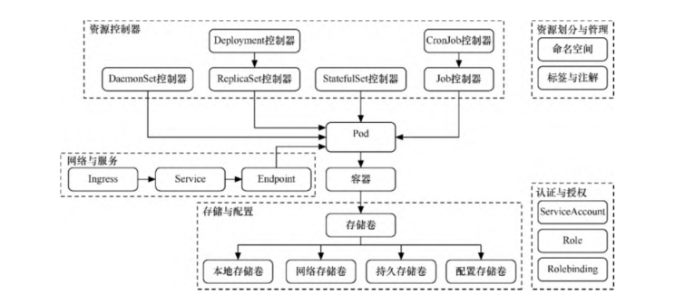

# Kubernetes的核心对象

Kubernetes的基本对象模型

## 1.Pod

Pod是Kubernetes处理的最基本单元。容器本身并不会直接分配到主机上，而是会封装到名为Pod的对象中。

Pod通常表示单个应用程序，由一个或多个关系紧密的容器构成，如图所示。这些容器拥有同样的生命周期，作为一个整体一起编排到Node上。

这些容器共享环境、存储卷和IP空间。尽管Pod基于一个或多个容器，但应将Pod视作单一的整体、单独的应用程序。Kubernetes以Pod为最小单位进行调度、伸缩并共享资源、管理生命周期。

Pod容器的构成

一般来说，用户不应自行管理Pod，因为Pod并没有提供应用程序通常会用到的一些特性，如复杂的生命周期管理及动态伸缩。

建议用户使用将Pod或Pod模板作为基本组件的更高级别对象，这些对象会拥有更多的特性。

### 1.1控制器

一般来说，用户不会直接创建Pod，而是创建控制器，让控制器来管理Pod。在控制器中定义Pod的部署方式（如有多少个副本、需要在
哪种Node上运行等），根据不同的业务场景，Kubernetes提供了多种控制器。

#### 1.ReplicationController和ReplicaSet控制器

- ReplicationController 

上一代的pod管理控制器，可以设置相应控制参数以实现水平伸缩，以调节正在运行的相同的Pod数，ReplicationController还可以执行滚动更新，将一组Pod逐个切换到
最新版本，从而最大限度地减少对应用程序可用性的影响。

- ReplicaSet

ReplicaSet控制器可以看作ReplicationController的另一种版本，其Pod识别功能使它在Pod管理上更具灵活性。

由于ReplicaSet控制器具有副本筛选功能，因此ReplicaSet控制器才有逐渐取代ReplicationController的趋势，但ReplicaSet控制器无法实现滚动更
新，无法像ReplicationController那样在后端轮流切换到最新版本。

缺点：

缺少一些在其他复杂对象中具有的更细粒度的生命周期管理功能。

#### 2.Deployment控制器

Deployment控制器可能是最常用的工作负载对象之一。
Deployment控制器以ReplicaSet控制器为基础，是更高级的概念，增加了更灵活的生命周期管理功能。

Deployment控制器解决了之前在
滚动更新上存在的诸多难点。如果用ReplicationController来更新应用程序，用户需要提交一个新的ReplicationController计划，以替换当前的控制器。

因此，对于历史记录跟踪、更新出现网络故障时的恢复以及回滚错误修改等任务，ReplicationController要么做起来非常
艰难，要么需要用户自理。

Deployment控制器是一种高级对象，旨在简化Pod的生命周期管理。

只要简单更改Deployment控制器的配置文件，Kubernetes就会自动调节ReplicaSet控制器，管理应用程序不同版本之间的切换，还可
以实现自动维护事件历史记录及自动撤销功能，如图2-7所示。正是由于这些强大的功能，Deployment控制器可能是使用频率最高的对象。

Deployment控制器

#### 3.StatefulSet控制器

StatefulSet控制器是一种提供了排序和唯一性保证的特殊Pod控制器。

当有与部署顺序、持久数据或固定网络等相关的特殊需求时，可以使用StatefulSet控制器来进行更细粒度的控制。

StatefulSet控制器主要用于有状态的应用，例如，StatefulSet控制器通常与面向数据的应用程序（比如数据库）相关联。

即使StatefulSet控制器被重新分配到一个新的节点上，还需要访问同一个存储卷。

StatefulSet控制器为每个Pod创建唯一的、基于数字的名称，从而提供稳定的网络标识符。即使要将Pod转移到另一个节点，该名称也
将持续存在。同样，当需要重新调度时，可以通过Pod转移持久性数据卷。

即使删除了Pod，这些卷也依然存在，以防止数据意外丢失。

每当部署或进行伸缩调节时，StatefulSet控制器会根据名称中的标识符执行操作，这使得对执行顺序有了更大的可预测性和控制能
力，它在某些情况下很有用。

#### 4.DaemonSet控制器

DaemonSet控制器是另一种特殊的Pod控制器，它会在集群的各个节点上运行单一的Pod副本。

DaemonSet控制器非常适合部署那些为节点本身提供服务或执行维护的Pod。

#### 5.Job控制器和CronJob控制器

Kubernetes中还有一种叫作Job控制器的工作负载对象，它基于特定任务而运行。

当运行任务的容器完成工作后，Job就会成功退出。如果需要执行一次性的任务，而非提供连续的服务，Job控制器非常适合。

CronJob控制器其实在Job控制器的基础上增加了时间调度，可以在给定的时间点运行一个任务，也可以周期性地在给定时间点运行一个任务。

CronJob控制器实际上和Linux系统中的Crontab控制器非常类似。

## 2.服务与存储

### 2.1Service组件和Ingress

通过Service组件可以发布服务，可以跟踪并路由到所有指定类型的后端容器。

内部使用者只需要知道Service组件提供的稳定端点即可进行访问。另外，Service组件抽象可以根据需要来伸缩或替换后端的
工作单元，无论Service组件具体路由到哪个Pod，其IP地址都保持稳定。通过Service组件，可以轻松获得服务发现的能力。

通过Service组件访问Pod

还可以通过Ingress来整合Service组件。Ingress并不是某种服务类型，可以充当多个Service组件的统一入口。

Ingress支持将路由规则合并到单个资源中，可以通过同一域名或IP地址下不同的路径来访问不同的Service组件。

通过Ingress整合Service组件

## 3.存储卷和持久存储卷

Kubernetes定义了自己的存储卷（volume）
抽象，允许Pod中的所有容器共享数据，并在Pod终止之前一直保持可用，如图2-10所示。

这意味着紧密耦合的Pod可以轻松共享文件而不需要复杂的外部机制，Pod中的容器故障不会影响对共享文件的访问。
Pod终止后，共享的存储卷会被销毁，因此对于真正需要持久化的数据来说，这并非一个好的解决方案

持久存储卷（persistent volume）是一种更健壮的抽象机制，不依赖于Pod的生命周期。持久存储卷允许管理员为集群配置存储资源，
用户可以为正在运行的Pod请求和声明存储资源。

带有持久存储卷的Pod一旦使用完毕，存储卷的回收策略将决定是保留存储卷（直到手动删除），还是立即删除数据。

持久性数据可预防节点级的故障，并分配比本地更多的可用存储空间。

## 4.资源划分

### 4.1 命名空间

命名空间（namespace）的主要作用是对Kubernetes集群资源进行划分。

这种划分并非物理划分而是逻辑划分，用于实现多租户的资源隔离.

使用命名空间隔离资源

### 4.2 标签和注解

Kubernetes中的标签（label）是一种语义化标记，可以附加到Kubernetes对象上，对它们进行标记或划分。

如果要针对不同的实例进行管理或路由，可以用标签来进行选择。

例如，每种基于控制器的对象都可以使用标签来识别需要操作的Pod。

Service组件也可以使用标签来确定应该将请求路由到哪些后端Pod。

标签的形式是键值对，每个单元可以拥有多个标签，但每个单元对于每个键只能拥有一个值。通常来说，相对于当作标识符的name属
性，标签的使用更像是对资源进行划分细类，可以用开发阶段、可访问性级别、应用程序版本等标准对各个对象进行分类。

注解（annotation）也是一种类似的机制，用于将任意键值信息附加到某一对象中。

相对于标签，注解更灵活，可以包含少量结构化数据。

一般来说，注解只是向对象添加更多元数据的一种方式，但并不用于筛选。

