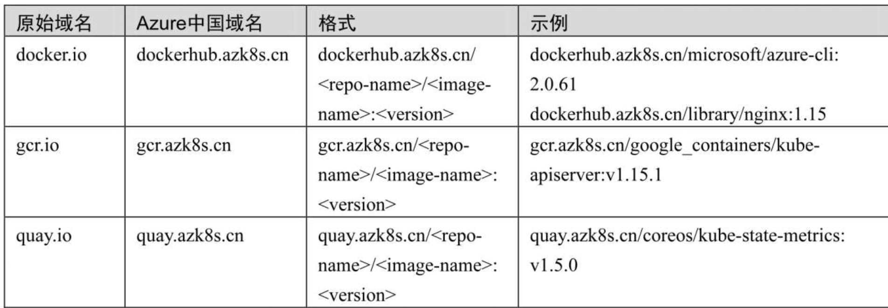

# 集群故障处理


## 1.健康状态检查—初诊


### 1.1 组件、插件健康状态检查

```shell
$ kubectl get componentstatus
# 或
$ kubectl get cs
```


大部分Kubernetes组件运行在命名空间为“kube-system”的静态Pod之中.我们可以使用以下命令来查看这些Pod的状态：

```shell
$ kubectl get pod -n kube-system -o wide
```


### 1.2 节点健康状态检查

```shell
$ kubectl get node
```


### 1.3 Pod健康状态检查

如果是集群应用出现异常，那么我们可以使用以下命令检查相关Pod是否运行正常：

```shell
$ kubectl get pod -o wide
```

如果存在命名空间，就需要使用-n参数指定命名空间。


## 2.进一步诊断分析—听诊三板斧

### 2.1．查看日志

（1）使用journalctl查看服务日志

```shell
$ journalctl -eu docker
```

查看并追踪kubelet的日志：

```shell
$ journalctl -eu kubelet -f
```

（2）使用“kubectl logs”查看容器日志

我们的应用运行在Pod之中，k8s的一些组件（例如，kube-apiserver、coredns、etcd、kube-controller-manager、kube-proxy、kube-scheduler等）也运行在Pod之中（静态Pod），我们可以使用“kubectl logs”命令。


①查看Pod`kube-apiserver-gitee-k8s-m1`的日志：

```shell
$ kubectl logs kube-apiserver-gitee-k8s-m1 -n kube-system
```

②查看24小时内的日志：

```shell
$ kubectl logs kube-apiserver-gitee-k8s-m1 --since 24h -n kube-system

# 查看容器组 nginx 最近20行日志
$ kubectl logs --tail=20 nginx

# 查看容器组 nginx 过去1个小时的日志
$ kubectl logs --since=1h nginx
```

③根据Pod标签查看日志：

```shell
# 查看容器组 nginx 下所有容器的日志
$ kubectl logs nginx --all-containers=true

# 查看带有 app=nginx 标签的所有容器组所有容器的日志
$ kubectl logs -lapp=nginx --all-containers=true
```

④查看指定命名空间下的Pod日志（注意系统组件的命名空间为“kube-system”）：

```shell
$ kubectl logs kube-apiserver-gitee-k8s-m1 -n kube-system -f
```


### 2.2 查看资源详情和事件

kubectl describe命令用于查看一个或多个资源的详细情况，包括相关资源和事件，语法如下：

```shell
# 描述一个节点
$ kubectl describe nodes kubernetes-node-emt8.c.myproject.internal

# 描述一个 pod
$ kubectl describe pods/nginx


# 在“pod.json”中描述由类型和名称标识的 pod
$ kubectl describe -f pod.json

# 描述所有 pod
$ kubectl describe pods


# 按标签 name=myLabel 描述 pod
$ kubectl describe po -l name=myLabel


# 描述由“前端”复制控制器管理的所有 pod（rc 创建的 pod 获取 rc 的名称作为 pod 名称中的前缀）
$ kubectl describe pods frontend
```


### 2.3 查看资源配置

```shell
# 以 ps 输出格式列出所有 pod
$ kubectl get pods

# 以 ps 输出格式列出所有 pod 以及更多信息（例如节点名称）
$ kubectl get pods -o wide

# 以 ps 输出格式列出具有指定名称的单个复制控制器
$ kubectl get replicationcontroller web

# 在“apps”API 组的“v1”版本中以 JSON 输出格式列出部署
$ kubectl get deployments.v1.apps -o json

# 以 JSON 输出格式列出单个 pod
$ kubectl get -o json pod web-pod-13je7

# 以 JSON 输出格式列出由“pod.yaml”中指定的类型和名称标识的 pod
$ kubectl get -f pod.yaml -o json

# 使用 kustomization.yaml 列出目录中的资源 - 例如目录化.yaml
$ kubectl get -k dir/

# 只返回指定 pod 的相位值
$ kubectl get -o template pod/web-pod-13je7 --template={{.status.phase}}

# 在自定义列中列出资源信息
$ kubectl get pod test-pod -o custom-columns=CONTAINER:.spec.containers[0].name,IMAGE:.spec.containers[0].image

# 以 ps 输出格式一起列出所有复制控制器和服务
$ kubectl get rc,services

# 按类型和名称列出一个或多个资源
$ kubectl get rc/web service/frontend pods/web-pod-13je7

# 列出单个 pod 的状态子资源。
$ kubectl get pod web-pod-13je7 --subresource status
```


## 3. 容器调测

### 3.1 使用`kubectl exec`进入运行中的容器进行调测

```shell
$ kubectl exec -it demoapp-5f8989b6c5-hpq9w -- sh -n dev

$ kubectl exec kube-apiserver-master.ilinux.io-n kube-system -- ps

#注意，若Pod对象中存在多个容器，则需要以-c选项指定容器后再运行。
$ kubectl exec -it cigiteebe-6f998dc5-n2jvp -c cigiteebe -n ci-gitee-release -- bash
```


### 3.2 使用kubectl-debug工具调测容器

ubectl-debug是一个简单的开源kubectl插件，可以帮助我们便捷地进行Kubernetes上的Pod排障诊断，背后做的事情很简单：在运行中的Pod上额外起一个新容器，并将新容器加入目标容器的pid、network、user以及ipc namespace中。

这时我们就可以在新容器中直接用netstat、tcpdump这些熟悉的工具来诊断和解决问题了，而旧容器可以保持最小化，不需要预装任何额外的排障工具。GitHub地址为https://github.com/aylei/kubectl-debug

参考文献：

https://zhuanlan.zhihu.com/p/144836378

https://zhuanlan.zhihu.com/p/447901102


## 4. 对症下药

（1）Pod一直处于Pending状态

Pending一般情况下表示这个Pod没有被调度到一个节点上，通常使用`kubectl describe`命令来查看Pod事件以得到具体原因。

通常情况下，这是因为资源不足引起的。如果是资源不足，那么解决方案有:

- 添加工作节点。
- 移除部分Pod以释放资源。
- 降低当前Pod的资源限制。


> *K8S Pod Pending 故障原因及解决方案*
>
> https://www.cnblogs.com/sanduzxcvbnm/p/16164834.html


（2）Pod一直处于Waiting状态，经诊断判为镜像拉取失败

如果一个Pod卡在Waiting状态，就表示这个Pod已经调试到节点上，但是没有运行起来。

解决方案有：

- 检查网络问题。若是网络问题，则保障网络通畅，可以考虑使用代理或国际网络（部分域名在国内网络无法访问，比如"k8s.gcr.io"）。
- 如果是拉取超时，可以考虑使用镜像加速器（比如使用阿里云或腾讯云提供的镜像加速地址），也可以考虑适当调整超时时间。
- 尝试使用`docker pull <image>`来验证镜像是否可以正常拉取。


（3）Pod一直处于CrashLoopBackOff状态，经检查判为健康检查启动超时而退出

CrashLoopBackOff状态说明容器曾经启动但又异常退出了，通常此Pod的重启次数是大于0的。

解决方案有：

- 重新设置合适的健康检查阈值。
- 优化容器性能，提高启动速度。
- 关闭健康检查。


（4）出现大量状态为"Evicted"的Pod

Evicted即驱赶的意思，当节点NotReady（节点宕机或失联）或资源不足时就会将Pod驱逐到其他节点。解决方案有：

解决方案有：

- 排查节点异常。
- 排查资源问题，扩充资源或释放其他资源。
- 可使用以下命令批量删除已有的"Evicted"状态的Pod:

```shell
$ kubectl get pods -n dev |grep Evicted|awk '{print $1}'|xargs kubectl delete pod
$ kubectl get pods --all-namespaces|grep Evicted|awk '{print $1}'|xargs kubectl delete pod
```


### 4.1 Pod状态排错

参考文档

https://www.bookstack.cn/read/kubernetes-practice-guide/troubleshooting-problems-pod-README.md


## 5.部分常见问题处理


### 5.1 镜像源问题

从上面的部署步骤可以看出，网络一直是一个很大的问题，要么导致镜像拉取非常缓慢，要么直接拉取失败。这样就给我们在部署和使用Kubernetes时带来了极大的不便，因此有时候我们需要使用到一些国内的镜像源。

（1）Azure中国镜像源

- Azure中国镜像源地址：http://mirror.azure.cn/。
- Azure中国镜像源GitHub地址：https://github.com/Azure/container-service-for-azure-china。

Azure中国镜像源使用格式:




（2）中科大镜像源 

- 中科大镜像源地址：http://mirrors.ustc.edu.cn/。
- 中科大镜像源GitHub地址：https://github.com/ustclug/mirrorrequest。

中科大镜像源使用格式:


### 5.2 Coredns CrashLoopBackOff导致无法成功添加工作节点的问题

k8s集群安装完成之后，当我们添加工作节点时可能会在长久的等待之中（无任何进展），这时可以使用以下命令来查看k8s各个服务的状态：

```shell
$ kubectl get pod -n kube-system -o wide
```

这种问题很有可能是防火墙（iptables）规则错乱或者缓存导致的，可以依次执行以下命令进行解决：

```shell
$ systemctl stop kubelet
$ systemctl stop docker
$ iptables --flush
$ iptables -tnat --flush
$ systemctl start kubelet
$ systemctl start docker
```


### 5.3 添加工作节点时提示token过期

集群注册token的有效时间为24小时，如果集群创建完成后没有及时添加工作节点，那么我们需要重新生成token。相关命令如下：

```shell
$ kubeadm token create --print-join-command

# 或者
# 生成token
$ kubeadm token generate

# 根据token输出添加命令
$ kubeadm token create <token> --print-join-command --tt1=0
```


.....后续补充