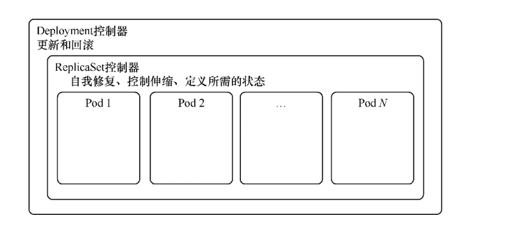
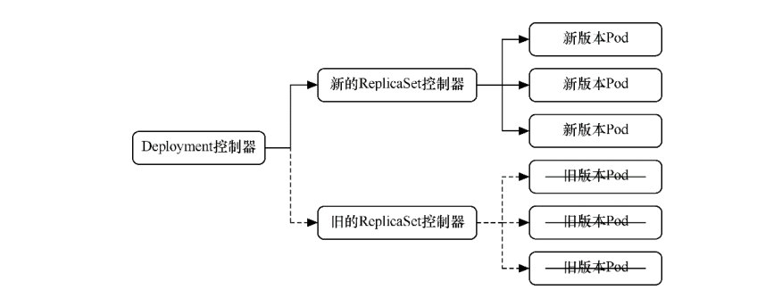
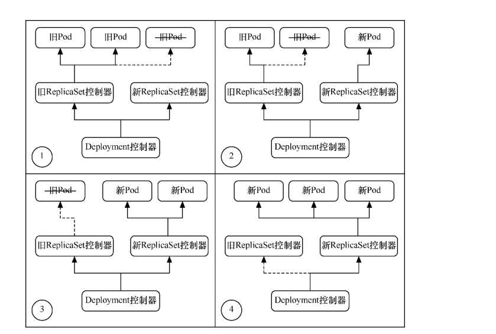

# Deployment控制器


Deployment控制器可能是最常用的工作负载对象之一。

在使用Kubernetes时，通常要管理的是由多个相同Pod所组成的Pod集合，而不是单个Pod。

通过Deployment控制器，可以定义Pod模板，并设置相应控制参数以实现水平伸缩，以调节正在运行的相同Pod数。

Deployment控制器保证在集群中部署的Pod数量与配置中的Pod数量一致。如果Pod或主机出现故障，则会自动启用新的Pod进行补充。


Deployment控制器以ReplicaSet控制器为基础，是更高级的概念，增加了更灵活的生命周期管理功能，

例如，滚动更新和回滚

Deployment控制器与ReplicaSet控制器




Deployment控制器旨在简化Pod的生命周期管理。只需要简单更改Deployment控制器的配置文件，Kubernetes就会自动调节ReplicaSet控制器，管理应用程序不同版本之间的切换，还可以实现自动维护事件历史记录及自动回滚等功能。


> **ReplicaSet控制器基本上已不会直接使用，目前常规的Pod管理则直接使用更高一层的Deployment控制器。**


## 1.Deployment控制器的基本操作

`exampleDeploymentv1. yml`的模板文件

```yaml
apiVersion: apps/v1
kind: Deployment
metadata:
  name: exampledeployment
spec:
  replicas: 3
  selector:
    matchLabels:
      example: deploymentfornginx
  template:
    metadata:
      labels:
        example: deploymentfornginx
    spec:
      containers:
      - name: nginx
        image: nginx:1.7.9
        ports:
        - containerPort: 80
```


该模板的含义如下。

- apiVersion表示使用的API版本，apps/v1表示使用Kubernetes API的稳定版本。
- kind表示要创建的资源对象，这里使用关键字Deployment。
- metadata表示该资源对象的元数据。一个资源对象可拥有多个元数据，其中一项是name，它表示当前资源的命名。
- spec表示该资源对象的具体设置。
- replicas：表示在控制器下托管的Pod需要保持的副本数量。
- selector/matchLabels：用于定义一个或多个自定义标签（label），其形式为键值对。它对Pod起筛选作用，会选
  择与标签定义相匹配的Pod。这在后续章节会详细解说，因为它是必填字段，所以这里填写了一个示例值。
- template：Pod模板

```bash
$ kubectl apply -f exampleDeploymentv1.yml --record
```

> 注意：这里一定要带参数--record，这样会把每次修改
> Deployment控制器时所使用的命令记录到备注字段中，以便在查看
> Deployment控制器变更历史或进行回滚时可以辨别每次修改的内容。


创建成功后，可通过以下命令查询当前运行的所有Deployment控制器。

```bash
$  kubectl get deployments
NAME                READY   UP-TO-DATE   AVAILABLE   AGE
exampledeployment   3/3     3            3           78s

$ kubectl get pods
NAME                                 READY   STATUS    RESTARTS   AGE
exampledeployment-656c6d8f4c-dxfpm   1/1     Running   0          2m2s
exampledeployment-656c6d8f4c-jt4sd   1/1     Running   0          2m2s
exampledeployment-656c6d8f4c-kvkjw   1/1     Running   0          2m2s
```

随着时间的推移，3个Pod均创建完，READY字段变成3/3，AVAILABLE字段变成3。

要查询更详细的信息（包括状态、生命周期和执行情况等），可以用`kubectl describe`命令

```bash
$ kubectl describe deployment exampledeployment
```

一般来说我们是根本不需要关注ReplicaSet控制器的，


可以用以下命令查看Deployment控制器对应的ReplicaSet控制器。

```bash
$ kubectl get replicasets
NAME                           DESIRED   CURRENT   READY   AGE
exampledeployment-656c6d8f4c   3         3         3       4m
```

现在来做一些破坏性操作，用于验证Deployment控制器的稳定性。

将其中一个Pod直接删除

```bash
$ kubectl delete pod/exampledeployment-656c6d8f4c-dxfpm
```

```bash
$ kubectl get deployment
NAME                READY   UP-TO-DATE   AVAILABLE   AGE
exampledeployment   2/3     3            2           3m41s

$ kubectl get deployment
NAME                READY   UP-TO-DATE   AVAILABLE   AGE
exampledeployment   3/3     3            3           5m23s
```

此时用`kubectl get pods`命令查看，会发现已经启用了一个名为wt9fk的Pod来代替原先被删除的Pod

```bash
$ kubectl get pods
NAME                                 READY   STATUS    RESTARTS   AGE
exampledeployment-656c6d8f4c-jt4sd   1/1     Running   0          6m3s
exampledeployment-656c6d8f4c-kvkjw   1/1     Running   0          6m3s
exampledeployment-656c6d8f4c-z4grf   1/1     Running   0          106s
```

刚才只假定Pod被错误删除，现在假设某台Node机器出现异常死机。

先查看pod所在的node节点

```bash
$ kubectl get pods -o wide
NAME                                 READY   STATUS    RESTARTS   AGE     IP           NODE            NOMINATED NODE   READIN          ESS GATES
exampledeployment-656c6d8f4c-jt4sd   1/1     Running   0          5m19s   10.0.19.7    gitee-k8s-w01   <none>           <none>
exampledeployment-656c6d8f4c-kvkjw   1/1     Running   0          5m19s   10.0.19.42   gitee-k8s-w01   <none>           <none>
exampledeployment-656c6d8f4c-z4grf   1/1     Running   0          62s     10.0.6.217   gitee-k8s-w27   <none>           <none>

```

如果关机node物理机，node上的pod会在其他可用空间足够的node上重新创建。

> Deployment控制器保证在集群中部署的Pod数量与配置中的Pod数量一致。如果Pod或主机出现故障，会自动启用新的Pod进行补充。


## 2.Deployment控制器的模板

yaml模板

```yaml
apiVersion: apps/v1      #必填，版本号
kind: Depolyment     #必填，资源类型
metadata:       #必填，元数据
  name: <name>-deploy     #必填，资源名称
  namespace: <namespace>    #Pod所属的命名空间
  labels:      #自定义标签
    - name: string     #自定义标签名字<key: value>
spec:         #必填，部署的详细定义
  selector: #必填，标签选择
    matchLabels: #必填，标签匹配
      name: <name> #必填，通过此标签匹配对应pod<key: value>
  replicas: <number> #必填，副本数量
  minReadySeconds: int #新创建的Pod状态为Ready持续的时间
  revisionHistoryLimit: int #保留的历史版本个数，默认是10
  minAvailable: int #Pod自愿中断的场景中，至少要保证可用的Pod对象数量或比例，要阻止任何Pod对象发生自愿中断，可将其设置为100%。
  maxUnavailable: int #Pod自愿中断的场景中，最多可转换为不可用状态的Pod对象数量或比例，0值意味着不允许Pod对象进行自愿中断；此字段与minAvailable互斥
  strategy: #版本更新控制
    type: RollingUpdate #更新策略，滚动更新（也可以是Recreate 重建更新）
    rollingUpdate: #滚动更新配置
      maxSurge: int #升级期间存在的总Pod对象数量最多不超过多少（百分比）
      maxUnavailable: int #升级期间正常可用的Pod副本数（包括新旧版本）不低于多少（百分比）
  template: #必填，应用容器模版定义
    metadata: 
      labels: 
        name: <name> #必填，与上面matchLabels的标签相同
    spec: 
      containers: #此处参考pod的containers
```

- yaml示例：以grafana alert举例。指定容器监听端口，配置存活就绪检测，设置资源限制，挂载宿主机本机目录存储，

> 建议生产环境为资源添加limit和liveness

```yaml
apiVersion: apps/v1
kind: Deployment
metadata:
  namespace: test
  name: grafana-alert-deploy
  labels:
    name: grafana-alert-deploy
spec:
  replicas: 2
  selector:
    matchLabels:
      name: grafanaAlert
  template:
    metadata:
      labels:
        name: grafanaAlert
    spec:
      containers:
      - name: grafana-alert
        image: grafana_alert:cm_v2
        imagePullPolicy: IfNotPresent
        command: ["python3.8","-u","-m","flask","run","-h","0.0.0.0","-p","9999"]
        ports:
        - containerPort: 9999
          protocol: TCP
        volumeMounts:
        - name: grafana-alert-log
          mountPath: /opt/grafanaAlert/log
        readinessProbe:
          tcpSocket: 
            port: 9999
        livenessProbe:
          tcpSocket: 
            port: 9999
        resources:    
          limits:   
            cpu: 1
            memory: 100Mi
          requests:     
            cpu: 100m
            memory: 10Mi
      volumes:
      - name: grafana-alert-log
        hostPath:
          path: /var/log/grafana-alert
          type: Directory
      affinity:
        nodeAffinity:
          requiredDuringSchedulingIgnoredDuringExecution:
            nodeSelectorTerms:
              - matchExpressions:
                  - key: role
                    operator: In
                    values:
                      - removable
      dnsPolicy: ClusterFirst
      restartPolicy: Always
```

还可以使用`$ kubectl explain deployment`命令详细查看Deployment控制器中资源支持的所有字段的详细说明。

如果想了解一个正在运行的Pod的配置，可以通过以下命令获取。

```bash
$ kubectl get deployment {deployment名称} -o yaml
示例
$ kubectl get deployment exampledeployment -o yaml
```


### 2.1 Deployment 添加hosts

示例yml：

```yaml
apiVersion: v1
kind: ReplicationController
metadata:
  name: dp-rc
  namespace: default
spec:
  replicas: 1
  selector:
    name: dp-pod
  template:
    metadata:
      labels:
        name: dp-pod
    spec:
      hostAliases:
      - ip: 192.168.176.247
        hostnames:
        - "dccas.finupgroup.com"
      containers:
      - name: dp
        image: reg.k8s.dc.finupgroup.com/datacenter/dp:latest
        imagePullPolicy: Always
        ports:
        - containerPort: 8080
```


### 2.2 最简单的 nginx 测试服务

```yaml
apiVersion: apps/v1
kind: Deployment
metadata:
  name: nginx
spec:
  replicas: 1
  selector:
    matchLabels:
      app: nginx
  template:
    metadata:
      labels:
        app: nginx
    spec:
      containers:
      - name: nginx
        image: nginx
---
apiVersion: v1
kind: Service
metadata:
  name: nginx
  labels:
    app: nginx
spec:
  type: ClusterIP
  ports:
  - port: 80
    protocol: TCP
    name: http
  selector:
    app: nginx
```

## 3.Deployment控制器的伸缩

之前的示例中，设置的Pod副本数为3

```bash
$ kubectl get deployment
NAME                READY   UP-TO-DATE   AVAILABLE   AGE
exampledeployment   3/3     3            3           10m
```

假设现在有业务变更，需要将Pod副本数设置为5。我们先打开`exampleDeploymentv1.yml`模板文件，命令如下。

```
apiVersion: apps/v1
kind: Deployment
metadata:
  name: exampledeployment
spec:
  replicas: 5
  selector:
  .....
```

运行以下命令，应用模板文件。执行成功后的结果

```bash
$ kubectl apply -f exampleDeploymentv1.yml --record
```

接下来，会进入Pod创建过程。待Pod创建完成，通过`$ kubectl get deployments`命令查看状态。可以看到READY变成5/5，

```bash
$ kubectl get deployment
NAME                READY   UP-TO-DATE   AVAILABLE   AGE
exampledeployment   5/5     5            5           12m
```

再通过`$ kubectl get pods -o wide`命令查看，可以看到已经成功部署了另外两个Pod，它们均匀分布到其他有可用空间的node上

通过同样的办法，也可以将Deployment控制器的Pod副本数量减少，比如从现在的5个恢复到之前设置的3个。

```bash
$ kubectl apply -f exampleDeploymentv1.yml --record
```


提示：默认情况下，Pod不会调度到Master节点上。如果希望将Master节点也当作Node来使用，可以执行以下命令。

```bash
$ kubectl taint node master node-role.Kubernetes.io/master-
```

如果要恢复成只作为Master节点来使用，则可以执行以下命令。

```bash
$ kubectl taint node master node-
role.Kubernetes.io/master="":NoSchedule
```

**一般情况下，不应将Master节点当作Node来使用。**


### 3.1 资源伸缩命令

```shell
# 将名为 'foo' 的副本集伸缩到 3 副本
kubectl scale --replicas=3 rs/foo

# 将在 "foo.yaml" 中的特定资源伸缩到 3 个副本
kubectl scale --replicas=3 -f foo.yaml

# 如果名为 mysql 的 Deployment 的副本当前是 2，那么将它伸缩到 3
kubectl scale --current-replicas=2 --replicas=3 deployment/mysql

# 伸缩多个副本控制器
kubectl scale --replicas=5 rc/foo rc/bar rc/baz
```


## 4.Deployment控制器的更新

Deployment控制器有两种更新方式。

- Recreate：所有现有的Pod都会在创建新的Pod之前被终止。
- RollingUpdate：表示以滚动更新方式更新Pod，并可以通过maxUnavailable和maxSurge参数来控制滚动更新过程。


### 4.1 Recreate方式

在之前的示例中，我们指定Nginx镜像的版本号是1.7.9。

假设现在有业务需要，计划将所有副本的Nginx镜像版本升级到1.8.1。

我们先新建`exampleDeploymentv2.yml`模板文件。

```yaml
apiVersion: apps/v1
kind: Deployment
metadata:
  name: exampledeployment
spec:
  replicas: 3
  selector:
    matchLabels:
      example: deploymentfornginx
  template:
    metadata:
      labels:
        example: deploymentfornginx
    spec:
      containers:
      - name: nginx
        image: nginx:1.8.1
        ports:
        - containerPort: 80
  strategy:
    type: Recreate
```

```bash

$ kubectl apply -f exampleDeploymentv2.yml --record
deployment.apps/exampledeployment configured

$ kubectl get deployment
NAME                READY   UP-TO-DATE   AVAILABLE   AGE
exampledeployment   0/3     0            0           34m
```

此时再执行`$ kubectl get deployments`命令，可以看到READY为0/3，AVAILABLE为0，这表示此Deployment控制器下面的所有
Pod都暂时不可用。而UP-TO-DATE为0，表示没有任何一个Pod完成更新.

此时再通过`$ kubectl get pods -o wide`命令进行查看，可以看到原先的3个Pod正在终止


通过`$ kubectl describe pods {Pod名称}`命令查看Pod的详细信息，可以发现镜像版本已更
新为1.8.1

```bash

$ kubectl describe pod/exampledeployment-5974df6f9d-2j2kh
Name:         exampledeployment-5974df6f9d-2j2kh
Namespace:    default
Priority:     0
Node:         gitee-k8s-w27/192.168.1.22
Start Time:   Mon, 11 Apr 2022 18:46:28 +0800
Labels:       example=deploymentfornginx
              pod-template-hash=5974df6f9d
Annotations:  <none>
Status:       Running
IP:           10.0.6.225
IPs:
  IP:           10.0.6.225
Controlled By:  ReplicaSet/exampledeployment-5974df6f9d
Containers:
  nginx:
    Container ID:   containerd://38c425a10da4af359ff3a8bef9b44319c9f347cfac326cb0bb4af7fda0f4a0d1
    Image:          nginx:1.8.1
```


通过命令`$ kubectl get rs -o wide`查看ReplicaSet控制器的变化情况。可以看到1.7.9的那个版本已停止使用

```bash
$ kubectl get rs -o wide
NAME                           DESIRED   CURRENT   READY   AGE    CONTAINERS   IMAGES        SELECTOR
exampledeployment-5974df6f9d   3         3         3       4m1s   nginx        nginx:1.8.1   example=deploymentfornginx,pod-template-hash=5974df6f9d
exampledeployment-656c6d8f4c   0         0         0       38m    nginx        nginx:1.7.9   example=deploymentfornginx,pod-template-hash=656c6d8f4c
```


可以看到这种更新方式相当直接，会直接删除当前Deployment制器下所有的Pod，即删除旧的ReplicaSet控制器下的所有Pod，只保
留旧的ReplicaSet控制器的定义，但不再投入使用，之后新建更新后的ReplicaSet控制器及Pod。

Recreate更新方式



但在实际使用过程中，一般我们会用这些Pod来提供长期稳定且不
间断的服务，**很少有终止所有Pod再等候全部重新创建来提供服务的情况**。

**如果要让Pod能提供不间断的服务，平滑升级，则需要使用RollingUpdate更新方式。**


### 4.2 RollingUpdate方式

RollingUpdate其实在人为不干预的情况下，**属于一种蓝绿发布模式，**

即：新旧的版本共存，有新版发布也有旧版发布，访问部分用户旧版，部分用户新版本。


Deployment控制器的另一种更新方式就是RollingUpdate（滚动更新）。

这种更新方式更实用，是一种比较平滑的升级方式，不会中断整个Pod集群提供的服务。在具体介绍滚动更新之前，需要先了解滚动
更新策略使用的两个参数。

- maxUnavailable：表示在更新过程中能够进入不可用状态的Pod 的最大值或相对于总副本数的最大百分比。
- maxSurge：表示能够额外创建的Pod数或相对于总副本数的百分比。

假设现在有业务需要，计划将所有副本的Nginx镜像版本升级到1.9.0，但这一次要求平滑过渡，服务不能中断。

我们先新建`exampleDeploymentv3.yml`模板文件。

```yaml
apiVersion: apps/v1
kind: Deployment
metadata:
  name: exampledeployment

spec:
  replicas: 3
  selector:
    matchLabels:
      example: deploymentfornginx
  template:
    metadata:
      labels:
        example: deploymentfornginx
    spec:
      containers:
      - name: nginx
        image: nginx:1.9.0
        ports:
        - containerPort: 80
  strategy:
    type: RollingUpdate
    rollingUpdate:
      maxSurge: 0
      maxUnavailable: 1
```

运行以下命令，应用模板文件。

```bash
$ kubectl apply -f exampleDeploymentv3.yml --record
```

在不同时间点执行`$ kubectl get deployments`命令，会得到不同的结果

在不同时间点执行`$ kubectl get pods -o wide`命令，会得到不同的结果


可以看到，在执行滚动更新时，因为设置了maxUnavailable=1，表示最多只允许1个Pod不可用，所以会先终止1个Pod，使另外两个Pod处于运行状态。

AVAILABLE为2，表示有两个Pod可用（其中有1个是新Pod）；

UP-TO-DATE为2，表示有两个更新的Pod。

由于设置了maxSurge=0，表示最多创建0个额外的Pod副本，更新过程中有1个正在创建的Pod以及两个正在运行的Pod（正好为3个），因此符合3个副本与0个额外副本的设置。此时READY为2/3，AVAILABLE为2，表示有两个旧Pod可用；UP-TO-DATE为1，表示有1个更新的Pod。


最后，全部新Pod创建成功，代替旧Pod提供服务。整个升级过程如图所示，它保持平滑过渡，逐步替代，持续让Pod提供稳定服务。

RollingUpdate方式



最后升级后的deployment内容如下：

```bash
$ kubectl get deployment -o wide
NAME                READY   UP-TO-DATE   AVAILABLE   AGE   CONTAINERS   IMAGES        SELECTOR
exampledeployment   3/3     3            3           49m   nginx        nginx:1.9.0   example=deploymentfornginx

$ kubectl get rs
NAME                           DESIRED   CURRENT   READY   AGE
exampledeployment-556b4d9fc4   3         3         3       14h
exampledeployment-5974df6f9d   0         0         0       14h
exampledeployment-656c6d8f4c   0         0         0       15h
```


### 4.3 更新的暂停与恢复

目前无论是直接更新还是滚动更新，都会一直持续更新，直到结
束，但如果更新后的版本有问题怎么办？是否可以只尝试发布一个最
新的Pod，待这个Pod验证无误后，再更新剩余的Pod？


答案是肯定的，Kubernetes提供的暂停与恢复更新功能可以实现上述功能。


假设现在有业务需要，计划将所有副本的Nginx镜像版本升级到1.9.1，这一次不仅要求平滑过渡，还要求进行**金丝雀发布**，即确认其
中一个Pod没有问题后再进行剩余的更新。

即：**人工干预进行更新暂停，金丝雀发布，出现问题及时回滚。**

暂停与恢复也可以用yml文件来实现，但相对比较复杂，这里用比较简单的命令进行说明。暂停与恢复的命令如下所示。

```bash
$ kubectl rollout pause deploy {Deployment名称}
$ kubectl rollout resume deploy {Deployment名称}
```

以之前示例中创建的Deployment控制器为例，连续执行以下命令。

```bash
$ kubectl set image deploy exampledeployment nginx=nginx:1.9.1 --record
# 暂停更新
$ kubectl rollout pause deploy exampledeployment
```

该命令会升级exampledeployment中的Nginx版本，但紧接着执行的暂停命令会使更新第1个Pod的时候就停止后续操作。

通过`$ kubectl get pods -o wide`命令，可以看到如下结果，原先的3个版本为1.9.0的Pod被终止了1个，然后启动了1个新的版本为1.9.1的Pod。更新完1个Pod后就停止后续更新了

通过`$ kubectl get deployments`命令进行查看，可以发现READY和AVAILABLE都是3，但是最新版本的**UP-TO-DATE只有1**

此时只更新了一个pod为最新的版本。

```bash
$ kubectl get deployment
NAME                READY   UP-TO-DATE   AVAILABLE   AGE
exampledeployment   3/3     1            3           15h
```

此时可以验证刚才创建的新版本Pod，直到验证没有问题后，就可以结束暂停了，让剩余的Pod继续更新为最新版，使用的命令如下。

```bash
# 恢复更新
$ kubectl rollout resume deploy exampledeployment
```

此时会继续更新剩余两个Pod。因为配置的是滚动更新，所以不同时段的结果和上一节一致，可以看到所有的Pod都更新为最新版。

```bash
[root@ci-base ~]# kubectl get deployment -o wide -w
NAME                READY   UP-TO-DATE   AVAILABLE   AGE   CONTAINERS   IMAGES        SELECTOR
exampledeployment   2/3     3            2           15h   nginx        nginx:1.9.1   example=deploymentfornginx
```

### 4.4 Deployment控制器的回滚

如果更新之后，发现新版本的Pod有严重问题，需要回滚到之前版本，则可以先使用以下命令查看历史变更记录。

```
$ kubectl rollout history deployment {Deployment名称}
```

本例中的命令如下。

```bash
$ kubectl rollout history deployment exampledeployment
deployment.apps/exampledeployment
REVISION  CHANGE-CAUSE
1         kubectl apply --filename=exampleDeploymentv1.yml --record=true
2         kubectl apply --filename=exampleDeploymentv2.yml --record=true
3         kubectl apply --filename=exampleDeploymentv3.yml --record=true
4         kubectl set image deploy exampledeployment nginx=nginx:1.9.1 --record=true
```


> 提示：前面提示过一定要带参数--record，只有这样才会记录每次修改Deployment控制器时所使用的命令，记录的位置就是现在我
> 们看到的CHANGE-CAUSE字段。如果没有带--record，CHANGE-CAUSE记录将为<none>。


保存历史记录的本质是保留每次修改所创建的ReplicaSet控制器，而**回滚的本质其实是切换到对应版本的ReplicaSet控制器**。
*Deployment控制器是通过ReplicaSet控制器来管理Pod的*。

保存历史记录的本质


可以通过以下命令查看这个Deployment控制器下所有的ReplicaSet控制器。

```bash
$ kubectl get rs -o wide
NAME                           DESIRED   CURRENT   READY   AGE   CONTAINERS   IMAGES        SELECTOR
exampledeployment-556b4d9fc4   0         0         0       14h   nginx        nginx:1.9.0   example=deploymentfornginx,pod-template-hash=556b4d9fc4
exampledeployment-5974df6f9d   0         0         0       14h   nginx        nginx:1.8.1   example=deploymentfornginx,pod-template-hash=5974df6f9d
exampledeployment-656c6d8f4c   0         0         0       15h   nginx        nginx:1.7.9   example=deploymentfornginx,pod-template-hash=656c6d8f4c
exampledeployment-89899ddf7    3         3         3       10m   nginx        nginx:1.9.1   example=deploymentfornginx,pod-template-hash=89899ddf7
```

可以看到目前使用的是1.9.1版本的ReplicaSet控制器。

回滚命令如下。

```
$ kubectl rollout undo deployment {Deployment名称} --to-revision={REVISION编号}
```

假设现在我们想退回到CHANGE-CAUSE "kubectl apply --filename=example Deploymentv2.yml --record=true"这个版本，由于其版本编号为2，因此可以使用以下命令进行回滚。

```bash
$ kubectl rollout undo deployment exampledeployment --to-revision=2
deployment.apps/exampledeployment rolled back
```

使用`$ kubectl rollout history deployment exampledeployment`命令再次查看历史记录，可以发现REVISION 2
已经消失，取而代之的是新加的REVISION 5，

```bash
$ kubectl rollout history deployment exampledeployment
deployment.apps/exampledeployment
REVISION  CHANGE-CAUSE
1         kubectl apply --filename=exampleDeploymentv1.yml --record=true
3         kubectl apply --filename=exampleDeploymentv3.yml --record=true
4         kubectl set image deploy exampledeployment nginx=nginx:1.9.1 --record=true
5         kubectl apply --filename=exampleDeploymentv2.yml --record=true
```

之前提到回滚的本质其实是切换到对应版本的ReplicaSet控制器，可以通过 kubectl get rs -o wide命令来再次查看
ReplicaSet控制器的启用情况。

```bash
$ kubectl get rs -o wide
NAME                           DESIRED   CURRENT   READY   AGE   CONTAINERS   IMAGES        SELECTOR
exampledeployment-556b4d9fc4   0         0         0       14h   nginx        nginx:1.9.0   example=deploymentfornginx,pod-template-hash=556b4d9fc4
exampledeployment-5974df6f9d   3         3         3       14h   nginx        nginx:1.8.1   example=deploymentfornginx,pod-template-hash=5974df6f9d
exampledeployment-656c6d8f4c   0         0         0       15h   nginx        nginx:1.7.9   example=deploymentfornginx,pod-template-hash=656c6d8f4c
exampledeployment-89899ddf7    0         0         0       14m   nginx        nginx:1.9.1   example=deploymentfornginx,pod-template-hash=89899ddf7
```

可以发现，1.9.1版本的ReplicaSet控制器目前已没有Pod副本，之前1.8.1版本的ReplicaSet控制器再度启用并且拥有3个Pod副本。
