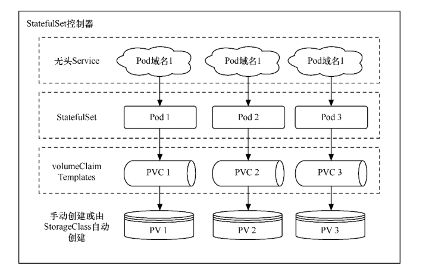
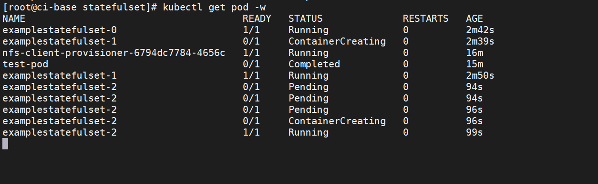
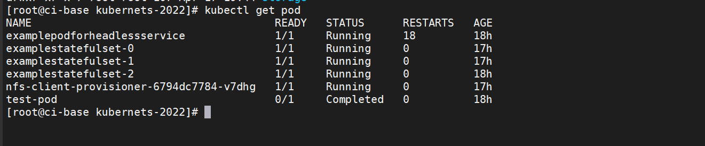

.. contents::
   :depth: 3
..

StatefulSet控制器
=================

StatefulSet控制器是一种提供排序和唯一性保证的特殊Pod控制器。当有与部署顺序、持久数据或固定网络等相关的特殊需求时，可
以使用StatefulSet控制器来进行更细粒度的控制。

StatefulSet控制器通常与面向数据的应用程序（如数据库）关联，它即使被重新分配到一个新的节点上，还是需要访问同一个存储卷的。

StatefulSet控制器对应于有状态服务（Deployment控制器对应于无状态服务），前者的功能如下所示。

-  实现稳定的持久化存储：Pod重新调度后还能访问相同的持久化数据，可基于PVC来实现。
-  实现稳定的网络标识：Pod重新调度后其PodName和HostName不变，基于无头Service（没有Cluster
   IP的Service）来实现。
-  实现有序部署、有序伸缩：Pod是有顺序的，在部署或者扩展的时候要依据定义的顺序依次执行（即从第一个到最后一个依次部
   署，在下一个Pod运行之前所有的Pod必须都处于Running或Ready状态）。
-  实现有序收缩、有序删除：从最后一个开始，依次删除到第一个。

创建StatefulSet资源之前，先要保证集群中存在StorageClass，并使用headless
service暴露服务
StatefulSet相较于Deployment，多了volumeClaimTemplates字段，即pvc存储的配置信息

yaml模板

.. code:: yaml

   apiVersion: apps/v1      #必填，版本号
   kind: StatefulSet     #必填，资源类型
   metadata:       #必填，元数据
     name: <name>-sts     #必填，资源名称
     namespace: <namespace>    #Pod所属的命名空间
   spec:         #必填，部署的详细定义
     selector: #必填，标签选择
       matchLabels: #必填，标签匹配
         key: <value> #必填，通过此标签匹配对应pod<key: value>
     serviceName: string # Headless Service资源名称
     replicas: int # 副本数量
     template: #必填，应用容器模版定义
       metadata: #必填，元数据
         labels:  # 标签
           key: <value> #必填，与上面matchLabels的标签相同
       spec: 
         containers: #此处参考pod的containers
     volumeClaimTemplates: #必填，+pvc模板
       - metadata:       #必填，元数据
           name: <name>-depolyment     #必填，资源名称
         spec:
           accessModes: [ "ReadWriteOnce | ReadOnlyMany | ReadWriteMany" ] #必填，访问模式
           storageClassName: strint  #存储类名，改为集群中已存在的
           resources: # 存储卷需要占用的资源量最小值
             requests: # 请求空间大小
               storage: 1Gi # 空间大小值

-  yaml示例：以nginx服务使用nfs共享存储为例

.. code:: yaml

   #先定义了一个名为myapp-svc的Headless Service资源，用于为关联到的每个Pod资源创建DNS资源记录。
   apiVersion: v1
   kind: Service
   metadata:
     name: myapp-svc
     labels:
       app: myapp-svc
   spec:
     ports:
     - port: 80
       name: web
     clusterIP: None
     selector:
       app: myapp-pod

   ---
   # 定义多个使用NFS存储后端的PV，空间大小为2GB，仅支持单路的读写操作。
   apiVersion: v1
   kind: PersistentVolume
   metadata:
     name: nfs-pv
   spec:
     capacity:
       storage: 2Gi
     accessModes:
       - ReadWriteOnce
     persistentVolumeReclaimPolicy: Recycle
     storageClassName: nfs
     nfs:
       path: /nfs/data1
       server: 172.17.0.2
   ---
   # 定义了一个名为myapp的StatefulSet资源，它通过Pod模板创建了两个Pod资源副本，并基于volumeClaimTemplates（存储卷申请模板）向nfs存储类请求动态供给PV，从而为每个Pod资源提供大小为1GB的专用存储卷。
   apiVersion: apps/v1
   kind: StatefulSet
   metadata:
     name: myapp-sts
   spec:
     selector:
       matchLabels:
         app: myapp-pod
     serviceName: myapp-svc
     replicas: 2
     template:
       metadata:
         labels:
           app: myapp-pod
       spec:
         containers:
         - name: nginx
           image: k8s.gcr.io/nginx-slim:0.8
           ports:
           - containerPort: 80
             name: web
           volumeMounts:
           - name: myapp-data
             mountPath: /usr/share/nginx/html
     volumeClaimTemplates:
     - metadata:
         name: myapp-data
       spec:
         accessModes: [ "ReadWriteOnce" ]
         storageClassName: "nfs"
         resources:
           requests:
             storage: 1Gi

1.statefulset的组成
-------------------

StatefulSet控制器由3个部分组成

-  无头Service：用于为Pod资源标识符生成可解析的DNS记录。
-  volumeClaimTemplates：基于静态或动态PV供给方式为Pod资源提供专有的固定存储。
-  StatefulSet：管理Pod资源。

StatefulSet控制器的组成

|image0|

2.为什么要用StatefulSet控制器？
-------------------------------

Deployment控制器下的每一个Pod都毫无区别地提供服务。

但StatefulSet控制器下的Pod则不同，虽然各个Pod的定义是一样的，但因为数据不同，所提供的服务是有差异的。

分布式存储系统就适合使用StatefulSet控制器，由Pod
A存储一部分数据并提供相关服务，由Pod B存储另一部分数据并提供相关服务。

又比如有些服务会临时保存客户请求的数据，如使用服务端Session方式存放部分信息的业务网站，由于Session的不同，Pod
A和Pod B能提供的服务也不尽相同，这种场景也适合使用StatefulSet控制器。

因为在上述场景下每一个有状态的Pod提供的服务都不一样，所以每一个Pod不能被随意取代，必须有序分配且必须为其分配唯一的标识。

**Pod名称将是它们的唯一标识符，和Deployment控制器下的Pod不同，即使有状态的Pod发生故障并被重建，Pod名称也会和原来的一模一样。**

*因为各个有状态的Pod也必须要拥有一个唯一的网络标识符以访问具体的某个Pod，所以会用到无头Service，无头Service可以给每个*
*Pod分配一个唯一的DNS名称。*

有状态的Pod都会使用到持久存储（如果没有持久存储，Pod发生故障时数据就没有了）。

如前所述，有状态的Pod的最大特点是各个Pod中的数据是不一样的，所以各个Pod无法共用同一个存储卷。

**需要单独分配各自的PV和PVC**

因为每个Pod要有各自专用的存储卷，所以并不是在Pod模板中定义（若在Pod模板中定义，那么每个Pod都用的同一个存储卷）StatefulSet控制器的存储卷配置，而是在StatefulSet控制器模板的volumeClaimTemplate属性中定义存储卷的申请模板，并会为每个
Pod生成不同的PVC且各自绑定PV，从而使各个Pod拥有各自专用的存储卷。

**因为每个Pod都会产生各自专用的PVC及PV，所以StatefulSet控制器的存储最好通过StorageClass来动态创建。**

当然，也可以通过手动创建各个预设的PV，只是这个过程会相当麻烦。

3.StatefulSet控制器的基本操作
-----------------------------

定义模板文件，创建一个名为\ ``examplestatefulset.yml``\ 的模板文件

.. code:: yaml

   kind: Service
   apiVersion: v1
   metadata:
     name: examplestatefulservice
   spec:
     selector:
       example: exampleforstateful
     # headless service
     clusterIP: None
     ports:
       - protocol: TCP
         port: 8080
         targetPort: 80
     type: ClusterIP

   ---
   apiVersion: apps/v1
   kind: StatefulSet
   metadata:
     name: examplestatefulset
   spec:
     replicas: 3
     serviceName: "examplestatefulservice"
     selector:
       matchLabels:
         example: exampleforstateful
     template:
       metadata:
         labels:
           example: exampleforstateful
       spec:
         containers:
         - name: pythonserviceforstateful
           image: python:3.7
           imagePullPolicy: IfNotPresent
           command: ['sh', '-c']
           args: ['echo "The host is $(hostname)" >> /dir/data; echo "
The host is $(hostname)
" > index.html; python -m http.server 80']

           volumeMounts:
           - name: statefuldata
             mountPath: /dir
           ports:
           - name: http
             containerPort: 80

     volumeClaimTemplates:
       - metadata:
           name: statefuldata
         spec:
           accessModes: [ "ReadWriteOnce" ]
           storageClassName: "managed-nfs-storage"
           resources:
             requests:
               storage: 200Mi

这个模板主要分为3个部分。首先，创建了一个无头Service，其名称为examplestatefulservice。它会通过标签选择器关联到各个标签为
``example: exampleforstateful``\ 的Pod上。

然后，创建了一个StatefulSet模板。该StatefulSet模板的前半部分的定义和Deployment模板相似，定义了3个Pod副本，其容器为
“python:3.7”镜像，其目的是搭建服务。在启动容器时，会先以追加方式向/dir/data文件写入一串文本"The
host is
:math:`(hostname)"， 这串文本使用`\ (hostname)环境变量获取当前Pod名称。/dir目录通过volumeMounts属性映射到名为statefuldata的存储卷申请模板
上，这在写入文本时会直接写入存储卷中。

接下来，执行\ ``echo "
The host is $(hostname)
 "index.html``\ 命令，将一段HTML代码插入index.html文件中，这样
在访问index.html时就可以知道访问的是哪个Pod。

另外，通过\ ``python -m http.server 80``\ 命令，搭建一个简单的Web服务，并令服务对应的端口为80。

StatefulSet模板的后半部分是存储卷申请模板，其定义的内容和PVC模板的差不多，但要注意，这里批量定义了PVC。
storageClassName属性设置为\ **managed-nfs-storage**\ ，与上一节中创建的StorageClass名称保持一致。

requests为storage:200Mi，这表示为每一个Pod都申请200MiB的存储空间。

接下来，执行以下命令，创建StatefulSet控制器的相关资源。

.. code:: shell

   $ kubectl apply -f examplestatefulset.yml

在创建过程中，在不同时段通过\ ``$ kubectl get pod``\ 进行查看，会发现Pod是按照顺序依次创建的。

Kubernetes会先创建第一个Pod，第二个Pod处于Pending状态。

第一个Pod创建完毕后创建第二个Pod，此时第三个Pod处于Pending状态。

前两个Pod创建完毕后，再创建第三个Pod。Pod的名称和Deployment控制器下的Pod不一样，名称末尾并没有生成随机字符串，而是按照数字顺序从0开始依次向上累加。

StatefulSet控制器下有序创建的各个Pod

|image1|

通过以下命令，可以查看StatefulSet控制器的总体状态。

.. code:: shell

   $ kubectl get statefulset
   NAME                 READY   AGE
   examplestatefulset   3/3     82s

通过以下命令，可以查看StatefulSet控制器的详细信息。

.. code:: shell

   $ kubectl describe statefulset examplestatefulset
   Name:               examplestatefulset
   Namespace:          default
   CreationTimestamp:  Mon, 18 Apr 2022 14:59:01 +0800
   Selector:           example=exampleforstateful
   Labels:             <none>
   Annotations:        <none>
   Replicas:           3 desired | 3 total
   Update Strategy:    RollingUpdate
     Partition:        0
   Pods Status:        3 Running / 0 Waiting / 0 Succeeded / 0 Failed
   Pod Template:
     Labels:  example=exampleforstateful
     Containers:
      pythonserviceforstateful:
       Image:      python:3.7
       Port:       80/TCP
       Host Port:  0/TCP
       Command:
         sh
         -c
       Args:
         echo "The host is $(hostname)" >> /dir/data; echo "
The host is $(hostname)
" > index.html; python -m http.server 80
       Environment:  <none>
       Mounts:
         /dir from statefuldata (rw)
     Volumes:  <none>
   Volume Claims:
     Name:          statefuldata
     StorageClass:  managed-nfs-storage
     Labels:        <none>
     Annotations:   <none>
     Capacity:      200Mi
     Access Modes:  [ReadWriteOnce]
   Events:
     Type    Reason            Age    From                    Message
     ----    ------            ----   ----                    -------
     Normal  SuccessfulCreate  5m6s   statefulset-controller  create Claim statefuldata-examplestatefulset-0 Pod examplestatefulset-0 in StatefulSet e             xamplestatefulset success
     Normal  SuccessfulCreate  5m6s   statefulset-controller  create Pod examplestatefulset-0 in StatefulSet examplestatefulset successful
     Normal  SuccessfulCreate  5m3s   statefulset-controller  create Claim statefuldata-examplestatefulset-1 Pod examplestatefulset-1 in StatefulSet e             xamplestatefulset success
     Normal  SuccessfulCreate  5m3s   statefulset-controller  create Pod examplestatefulset-1 in StatefulSet examplestatefulset successful
     Normal  SuccessfulCreate  3m47s  statefulset-controller  create Claim statefuldata-examplestatefulset-2 Pod examplestatefulset-2 in StatefulSet e             xamplestatefulset success
     Normal  SuccessfulCreate  3m47s  statefulset-controller  create Pod examplestatefulset-2 in StatefulSet examplestatefulset successful

4.PVC及PV的使用
---------------

我们先检查存储卷的使用情况。此时如果通过\ ``$ kubectl getpvc``\ 以及\ ``$ kubectl get pv``\ 命令进行查询，可以看到StatefulSet
控制器为每个Pod都创建了各自专用的PVC及PV。

.. code:: shell

   $ kubectl get pv|grep default/statefuldata-examplestatefulset
   pvc-0bd1af19-8af1-41b1-ba61-8933ac9fb8f2   200Mi      RWO            Delete           Bound    default/statefuldata-examplestatefulset-2               managed-nfs-storage            6m46s
   pvc-3144e3df-cf7c-46c6-a285-d2719b9d5161   200Mi      RWO            Delete           Bound    default/statefuldata-examplestatefulset-1               managed-nfs-storage            8m2s
   pvc-9fa9ae39-a778-4d31-aa38-37c84de9d7fa   200Mi      RWO            Delete           Bound    default/statefuldata-examplestatefulset-0               managed-nfs-storage            8m4s

   $ kubectl get pvc
   NAME                                STATUS   VOLUME                                     CAPACITY   ACCESS MODES   STORAGECLASS          AGE
   statefuldata-examplestatefulset-0   Bound    pvc-9fa9ae39-a778-4d31-aa38-37c84de9d7fa   200Mi      RWO            managed-nfs-storage   7m41s
   statefuldata-examplestatefulset-1   Bound    pvc-3144e3df-cf7c-46c6-a285-d2719b9d5161   200Mi      RWO            managed-nfs-storage   7m38s
   statefuldata-examplestatefulset-2   Bound    pvc-0bd1af19-8af1-41b1-ba61-8933ac9fb8f2   200Mi      RWO            managed-nfs-storage   6m22s

任意挑选一个PV，通过\ ``$ kubectl describe pv``\ 命令查看详情，可以看到它在NFS服务器共享目录上创建的专用目录，

::

   $ kubectl describe pv pvc-0bd1af19-8af1-41b1-ba61-8933ac9fb8f2
   Name:            pvc-0bd1af19-8af1-41b1-ba61-8933ac9fb8f2
   Labels:          <none>
   Annotations:     pv.kubernetes.io/provisioned-by: fuseim.pri/ifs
   Finalizers:      [kubernetes.io/pv-protection]
   StorageClass:    managed-nfs-storage
   Status:          Bound
   Claim:           default/statefuldata-examplestatefulset-2
   Reclaim Policy:  Delete
   Access Modes:    RWO
   VolumeMode:      Filesystem
   Capacity:        200Mi
   Node Affinity:   <none>
   Message:
   Source:
       Type:      NFS (an NFS mount that lasts the lifetime of a pod)
       Server:    192.168.1.60
       Path:      /nfstest/default-statefuldata-examplestatefulset-2-pvc-0bd1af19-8af1-41b1-ba61-8933ac9fb8f2
       ReadOnly:  false
   Events:        <none>

在NFS服务器上执行以下命令，查看Pod是否已成功向该目录写入文件。

执行结果如下所示，可以看到Pod已成功向它的专属存储卷中写入数据。

.. code:: shell

   $ cat /data/nfs/nfstest/default-statefuldata-examplestatefulset-0-pvc-9fa9ae39-a778-4d31-aa38-37c84de9d7fa/data
   The host is examplestatefulset-0

对于其余两个Pod也是一样的，先通过\ ``$ kubectl describe pv pvName``\ 命令查看其专属目录位置，然后执行命令查看文件是否写入。

.. code:: shell

   $ kubectl describe pv pvc-3144e3df-cf7c-46c6-a285-d2719b9d5161
   Name:            pvc-3144e3df-cf7c-46c6-a285-d2719b9d5161
   Labels:          <none>
   Annotations:     pv.kubernetes.io/provisioned-by: fuseim.pri/ifs
   Finalizers:      [kubernetes.io/pv-protection]
   StorageClass:    managed-nfs-storage
   Status:          Bound
   Claim:           default/statefuldata-examplestatefulset-1
   Reclaim Policy:  Delete
   Access Modes:    RWO
   VolumeMode:      Filesystem
   Capacity:        200Mi
   Node Affinity:   <none>
   Message:
   Source:
       Type:      NFS (an NFS mount that lasts the lifetime of a pod)
       Server:    192.168.1.60
       Path:      /nfstest/default-statefuldata-examplestatefulset-1-pvc-3144e3df-cf7c-46c6-a285-d2719b9d5161
       ReadOnly:  false
   Events:        <none>

   $ cat /data/nfs/nfstest/default-statefuldata-examplestatefulset-1-pvc-3144e3df-cf7c-46c6-a285-d2719b9d5161/data
   The host is examplestatefulset-1

结果：每个Pod都往各自的存储卷中写入了数据。

5.无头Service的访问
-------------------

我们检查Service的发布情况。使用\ ``$ kubectl get svc``\ 命令可以看到已经创建了一个无头Service。

.. code:: shell

   $ kubectl get svc
   NAME                     TYPE        CLUSTER-IP   EXTERNAL-IP   PORT(S)    AGE
   examplestatefulservice   ClusterIP   None         <none>        8080/TCP   11m
   kubernetes               ClusterIP   10.96.0.1    <none>        443/TCP    173d

由于这个Service无法由集群内外的机器直接访问，因此只能由Pod访问，而且需要通过DNS形式来访问，具体访问形式为
``{ServiceName}.{Namespace}.svc.{ClusterDomain}``\ 。

**svc是Service的缩写（固定格式）；**

**ClusterDomain表示集群域，本例中默认的集群域为cluster.local；**

**前面两个字段则是根据Service定义决定的，在这个例子中ServiceName为examplestatefulservice，而Namespace我们没有在yml文件中指定，默认值为Default。**

在访问这个地址之前，我们先创建一个测试用的Pod，用它来尝试访问Service。命令如下。

``examplepodforheadlessservice.yml``

.. code:: yaml

   apiVersion: v1
   kind: Pod
   metadata:
     name: examplepodforheadlessservice
   spec:
     containers:
     - name: testcontainer
       image: docker.io/appropriate/curl
       imagePullPolicy: IfNotPresent
       command: ['sh', '-c']
       args: ['echo "test pod for headless service!"; sleep 3600']

这个Pod并没有什么特别之处，其镜像为appropriate/curl。该镜像是一种工具箱，里面存放了一些测试网络和DNS使用的工具（例
如curl和nslookup等），可用于测试现在的Service。通过sleep3600命令，可让该容器长期处于运行状态。

通过模板创建Pod。

.. code:: shell

   $ kubectl apply -f examplepodforheadlessservice.yml

Pod创建完成后，就可以通过以下命令进入Pod内部，这样就可以在Pod内部执行命令行。

进入容器内部后，可以执行nslookup命令查询DNS信息，获得这个DNS下面的IP地址列表。之前已经提到，Kubernetes中的DNS资源访
问方式为{ServiceName}.{Namespace}.
svc.{ClusterDomain}，本例中的具体命令如下。

::

   $ kubectl exec -it pod/examplepodforheadlessservice -- /bin/sh
   / # nslookup examplestatefulservice.default.svc.cluster.local
   nslookup: can't resolve '(null)': Name does not resolve

   Name:      examplestatefulservice.default.svc.cluster.local
   Address 1: 10.0.16.28 examplestatefulset-1.examplestatefulservice.default.svc.cluster.local
   Address 2: 10.0.32.106 examplestatefulset-2.examplestatefulservice.default.svc.cluster.local
   Address 3: 10.0.36.231 examplestatefulset-0.examplestatefulservice.default.svc.cluster.local

可以看到，一共返回了3个IP地址，这些IP地址正是之前创建的各个Pod的IP地址，\ *而Kubernetes又为每个*
*Pod地址创建了对应的专属域名。访问这些专属域名就可以访问指定Pod提供的服务*

当然，\ **也可以直接使用无头Service的总域名来访问服务，如下面所示。通过这种方式访问的服务是随机的**\ ，这对于Deployment控制
器提供的无状态Pod没有问题，但如前所述，对于StatefulSet控制器提供的有状态Pod而言，每个Pod提供的服务都是不同的，在调用时必须指明调用哪一个Pod提供的服务。

::

   / # curl examplestatefulservice.default.svc.cluster.local
   
The host is examplestatefulset-1

   / # curl examplestatefulservice.default.svc.cluster.local
   
The host is examplestatefulset-0

   / # curl examplestatefulservice.default.svc.cluster.local
   
The host is examplestatefulset-1

   / # curl examplestatefulservice.default.svc.cluster.local
   
The host is examplestatefulset-2

在无头Service中，每一个Pod都会生成专属的访问域名，其访问格式为\ ``{PodName}. {ServiceName}.{Namespace}.svc. {ClusterDomain}``\ 。每个域名通过DNS查询都可以解析出Pod的IP地址，例如，使用以下命令

::

   / # nslookup examplestatefulset-0.examplestatefulservice.default.svc.cluster.local
   nslookup: can't resolve '(null)': Name does not resolve

   Name:      examplestatefulset-0.examplestatefulservice.default.svc.cluster.local
   Address 1: 10.0.36.231 examplestatefulset-0.examplestatefulservice.default.svc.cluster.local

   / # nslookup examplestatefulset-1.examplestatefulservice.default.svc.cluster.local
   nslookup: can't resolve '(null)': Name does not resolve

   Name:      examplestatefulset-1.examplestatefulservice.default.svc.cluster.local
   Address 1: 10.0.16.28 examplestatefulset-1.examplestatefulservice.default.svc.cluster.local

   / # nslookup examplestatefulset-2.examplestatefulservice.default.svc.cluster.local
   nslookup: can't resolve '(null)': Name does not resolve

   Name:      examplestatefulset-2.examplestatefulservice.default.svc.cluster.local
   Address 1: 10.0.32.106 examplestatefulset-2.examplestatefulservice.default.svc.cluster.local

综上所述，要访问由不同的有状态Pod提供的服务，只需要访问其专属域名即可。

.. code:: shell

   / # curl examplestatefulset-0.examplestatefulservice.default.svc.cluster.local
   
The host is examplestatefulset-0

   / # curl examplestatefulset-1.examplestatefulservice.default.svc.cluster.local
   
The host is examplestatefulset-1

   / # curl examplestatefulset-2.examplestatefulservice.default.svc.cluster.local
   
The host is examplestatefulset-2

可以看到每个域名都可以成功返回各自的结果。

6.Pod的重建
-----------

可以模拟Pod发生故障时的场景。假设现在examplestatefulset-1发生故障（例如，人为删除），请执行以下命令。

.. code:: shell

   $ kubectl delete pod/examplestatefulset-1

因为在之前模板中replicas设置为3，这表示会保留3个稳定副本，所以Pod会重建。可以看到，Pod
重建后的名称一模一样，Pod的 IP地址会有变化（但不会有实际影响）。

如图：

|image2|

执行以下命令，输出这个 Pod
专属的存储卷中文件的内容，查看是否仍然调用了同一个存储。

.. code:: shell

   $ cat /data/nfs/nfstest/default-statefuldata-examplestatefulset-1-pvc-3144e3df-cf7c-46c6-a285-d2719b9d5161/data
   The host is examplestatefulset-1
   The host is examplestatefulset-1

因为在之前的Pod定义中Pod启动时会以追加文本的形式向文件中写入数据，所以Pod重建后，会再写一条数据。

因为重建后的Pod使用的还是同一个PVC和PV，所以仍然在同一个文件上进行编辑。

查询该文件会看到两条文本，一条是之前由被删除的Pod在启动时写的，一条是重建时写的

7.StatefulSet控制器的伸缩与更新
-------------------------------

和Deployment控制器一样，StatefulSet控制器也可以实现动态伸缩，只需要修改配置模板中的replicas属性然后执行应用即可。

但与Deployment控制器不同的地方在于，Pod是有序伸缩的，就像创建StatefulSet控制器时依次创建Pod一样。在扩容时，后续新增的Pod会从前往后依次创建，创建完成后才开始下一个
Pod 的创建；

在缩容时，会先从编号最大的
Pod开始，从后往前依次删除，完全删除后才开始下一个Pod的删除。

StatefulSet控制器有\ **两种更新策略**\ ，可以在模板中通过\ **.spec.updateStrategy**\ 属性进行设置。

-  OnDelete更新策略，这是默认的向后兼容的更新策略。使用OnDelete更新策略更新StatefulSet模板后，只有在手动删除旧的Pod时才会创建新的Pod。
-  RollingUpdate策略。在更新StatefulSet控制器模板后，旧的Pod将被终止，并且将以受控方式自动创建新的
   Pod。

7.1 sts和deployment的滚动更新差异
~~~~~~~~~~~~~~~~~~~~~~~~~~~~~~~~~

StatefulSet控制器和Deployment控制器的滚动更新，有一些细节上的差异。

-  因为StatefulSet控制器是有序的，所以它会从编号最大的Pod到最小的Pod依次更新，而且在更新前不会立即删除旧的Pod，而是
   等新的Pod已完全创建完毕且处于Running状态时，才会替换并删除旧的Pod。
-  StatefulSet控制器拥有独有的更新属性\ **.spec.updateStrategy.rollingUpdate.partition**\ 。这种方式类似于金丝雀部署，如果将partition设置为4，只有编号大于或等于4的Pod才会进行更新，编号小于partition的Pod将不会更新。如果已经更新的Pod通过验证，则再将partition改为0，更新其余Pod即可。

