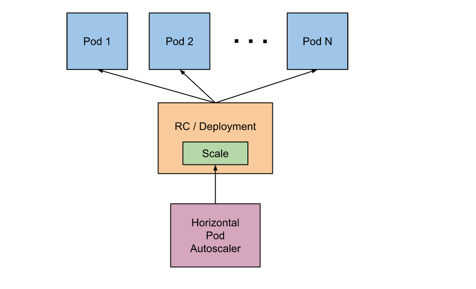
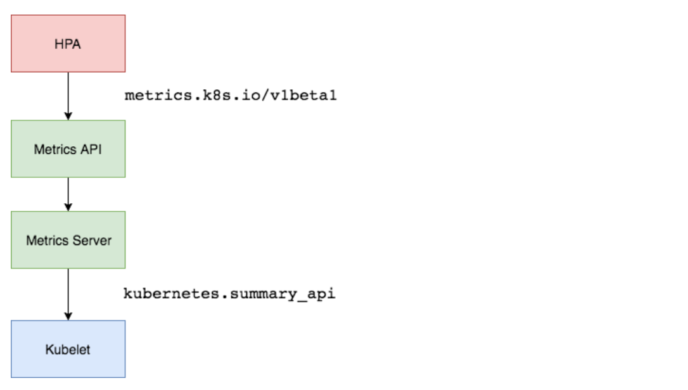

.. contents::
   :depth: 3
..

HPA 控制器
==========

在前面的学习中我们使用用一个 ``kubectl scale`` 命令可以来实现 Pod
的扩缩容功能，但是这个毕竟是完全手动操作的，要应对线上的各种复杂情况，我们需要能够做到自动化去感知业务，来自动进行扩缩容。

为此，Kubernetes
也为我们提供了这样的一个资源对象：\ ``Horizontal Pod Autoscaling（Pod 水平自动伸缩）``\ ，简称\ ``HPA``\ ，HPA
通过监控分析一些控制器控制的所有 Pod 的负载变化情况来确定是否需要调整
Pod 的副本数量，这是 HPA 最基本的原理：

|image0|

我们可以简单的通过 ``kubectl autoscale`` 命令来创建一个 HPA
资源对象，\ ``HPA Controller``\ 默认\ ``30s``\ 轮询一次（可通过
``kube-controller-manager``
的\ ``--horizontal-pod-autoscaler-sync-period``
参数进行设置），查询指定的资源中的 Pod
资源使用率，并且与创建时设定的值和指标做对比，从而实现自动伸缩的功能。

1.Metrics Server
----------------

在 HPA 的第一个版本中，我们需要 ``Heapster`` 提供 CPU 和内存指标，在 HPA
v2 过后就需要安装 Metrcis Server 了，\ ``Metrics Server`` 可以通过标准的
Kubernetes API 把监控数据暴露出来，有了 ``Metrics Server``
之后，我们就完全可以通过标准的 Kubernetes API
来访问我们想要获取的监控数据了：

::

   https://10.96.0.1/apis/metrics.k8s.io/v1beta1/namespaces/<namespace-name>/pods/<pod-name>

比如当我们访问上面的 API 的时候，我们就可以获取到该 Pod
的资源数据，这些数据其实是来自于 kubelet 的 ``Summary API``
采集而来的。不过需要说明的是我们这里可以通过标准的 API
来获取资源监控数据，并不是因为 ``Metrics Server`` 就是 APIServer
的一部分，而是通过 Kubernetes 提供的 ``Aggregator``
汇聚插件来实现的，是独立于 APIServer 之外运行的。

|image1|

2.聚合 API
----------

``Aggregator`` 允许开发人员编写一个自己的服务，把这个服务注册到
Kubernetes 的 APIServer 里面去，这样我们就可以像原生的 APIServer 提供的
API 使用自己的 API 了，我们把自己的服务运行在 Kubernetes 集群里面，然后
Kubernetes 的 ``Aggregator`` 通过 Service 名称就可以转发到我们自己写的
Service 里面去了。这样这个聚合层就带来了很多好处：

-  增加了 API 的扩展性，开发人员可以编写自己的 API 服务来暴露他们想要的
   API。
-  丰富了 API，核心 kubernetes 团队阻止了很多新的 API
   提案，通过允许开发人员将他们的 API
   作为单独的服务公开，这样就无须社区繁杂的审查了。
-  开发分阶段实验性 API，新的 API
   可以在单独的聚合服务中开发，当它稳定之后，在合并会 APIServer
   就很容易了。
-  确保新 API 遵循 Kubernetes
   约定，如果没有这里提出的机制，社区成员可能会被迫推出自己的东西，这样很可能造成社区成员和社区约定不一致。

3.安装
------

所以现在我们要使用 HPA，就需要在集群中安装 ``Metrics Server``
服务，要安装 ``Metrics Server`` 就需要开启 ``Aggregator``\ ，因为
``Metrics Server`` 就是通过该代理进行扩展的，不过我们集群是通过 Kubeadm
搭建的，默认已经开启了，如果是二进制方式安装的集群，需要单独配置
kube-apsierver 添加如下所示的参数：

::

   --requestheader-client-ca-file=<path to aggregator CA cert>
   --requestheader-allowed-names=aggregator
   --requestheader-extra-headers-prefix=X-Remote-Extra-
   --requestheader-group-headers=X-Remote-Group
   --requestheader-username-headers=X-Remote-User
   --proxy-client-cert-file=<path to aggregator proxy cert>
   --proxy-client-key-file=<path to aggregator proxy key>

如果 ``kube-proxy`` 没有和 APIServer
运行在同一台主机上，那么需要确保启用了如下 kube-apsierver 的参数：

::

   --enable-aggregator-routing=true

对于这些证书的生成方式，我们可以查看官方文档：https://github.com/kubernetes-sigs/apiserver-builder-alpha/blob/master/docs/concepts/auth.md。

``Aggregator`` 聚合层启动完成后，就可以来安装 ``Metrics Server``
了，我们可以获取该仓库的官方安装资源清单：

::

   # 官方仓库地址：https://github.com/kubernetes-sigs/metrics-server
   $ wget https://github.com/kubernetes-sigs/metrics-server/releases/download/v0.3.6/components.yaml

等部署完成后，可以查看 Pod 日志是否正常：

::

   $ kubectl apply -f components.yaml
   $ kubectl get pods -n kube-system -l k8s-app=metrics-server
   NAME                              READY   STATUS    RESTARTS   AGE
   metrics-server-6886856d7c-g5k6q   1/1     Running   0          2m39s
   $ kubectl logs -f metrics-server-6886856d7c-g5k6q -n kube-system
   ......
   E1119 09:05:57.234312       1 manager.go:111] unable to fully collect metrics: [unable to fully scrape metrics from source kubelet_summary:ydzs-node1: unable to fetch metrics from Kubelet ydzs-node1 (ydzs-node1): Get https://ydzs-node1:10250/stats/summary?only_cpu_and_memory=true: dial tcp: lookup ydzs-node1 on 10.96.0.10:53: no such host, unable to fully scrape metrics from source kubelet_summary:ydzs-node4: unable to fetch metrics from Kubelet ydzs-node4 (ydzs-node4): Get https://ydzs-node4:10250/stats/summary?only_cpu_and_memory=true: dial tcp: lookup ydzs-node4 on 10.96.0.10:53: no such host, unable to fully scrape metrics from source kubelet_summary:ydzs-node3: unable to fetch metrics from Kubelet ydzs-node3 (ydzs-node3): Get https://ydzs-node3:10250/stats/summary?only_cpu_and_memory=true: dial tcp: lookup ydzs-node3 on 10.96.0.10:53: no such host, unable to fully scrape metrics from source kubelet_summary:ydzs-master: unable to fetch metrics from Kubelet ydzs-master (ydzs-master): Get https://ydzs-master:10250/stats/summary?only_cpu_and_memory=true: dial tcp: lookup ydzs-master on 10.96.0.10:53: no such host, unable to fully scrape metrics from source kubelet_summary:ydzs-node2: unable to fetch metrics from Kubelet ydzs-node2 (ydzs-node2): Get https://ydzs-node2:10250/stats/summary?only_cpu_and_memory=true: dial tcp: lookup ydzs-node2 on 10.96.0.10:53: no such host]

我们可以发现 Pod
中出现了一些错误信息：\ ``xxx: no such host``\ ，我们看到这个错误信息一般就可以确定是
DNS 解析不了造成的，我们可以看到 Metrics Server 会通过 kubelet 的 10250
端口获取信息，使用的是 hostname，我们部署集群的时候在节点的
``/etc/hosts`` 里面添加了节点的 hostname 和 ip 的映射，但是是我们的
Metrics Server 的 Pod 内部并没有这个 hosts 信息，当然也就不识别 hostname
了，要解决这个问题，有两种方法：

第一种方法就是在集群内部的 DNS 服务里面添加上 hostname
的解析，比如我们这里集群中使用的是 ``CoreDNS``\ ，我们就可以去修改下
CoreDNS 的 Configmap 信息，添加上 hosts 信息：

.. code:: shell

   $ kubectl edit configmap coredns -n kube-system
   apiVersion: v1
   data:
     Corefile: |
       .:53 {
           errors
           health
           hosts {  # 添加集群节点hosts隐射信息
             10.151.30.11 ydzs-master
             10.151.30.57 ydzs-node3
             10.151.30.59 ydzs-node4
             10.151.30.22 ydzs-node1
             10.151.30.23 ydzs-node2
             fallthrough
           }
           kubernetes cluster.local in-addr.arpa ip6.arpa {
              pods insecure
              upstream
              fallthrough in-addr.arpa ip6.arpa
           }
           prometheus :9153
           proxy . /etc/resolv.conf
           cache 30
           reload
       }
   kind: ConfigMap
   metadata:
     creationTimestamp: 2019-05-18T11:07:46Z
     name: coredns
     namespace: kube-system

这样当在集群内部访问集群的 hostname 的时候就可以解析到对应的 ip
了，另外一种方法就是在 metrics-server 的启动参数中修改
``kubelet-preferred-address-types`` 参数，如下：

::

   args:
   - --cert-dir=/tmp
   - --secure-port=4443
   - --kubelet-preferred-address-types=InternalIP

我们这里使用第二种方式，然后重新安装：

::

   $ kubectl apply -f components.yaml
   $ kubectl get pods -n kube-system -l k8s-app=metrics-server
   NAME                              READY   STATUS    RESTARTS   AGE
   metrics-server-5d4dbb78bb-6klw6   1/1     Running   0          14s
   $ kubectl logs -f metrics-server-5d4dbb78bb-6klw6 -n kube-system
   I1119 09:10:44.249092       1 serving.go:312] Generated self-signed cert (/tmp/apiserver.crt, /tmp/apiserver.key)
   I1119 09:10:45.264076       1 secure_serving.go:116] Serving securely on [::]:4443
   $ kubectl get apiservice | grep metrics
   v1beta1.metrics.k8s.io                 kube-system/metrics-server   True        9m
   $ kubectl get --raw "/apis/metrics.k8s.io/v1beta1/nodes"
   {"kind":"NodeMetricsList","apiVersion":"metrics.k8s.io/v1beta1","metadata":{"selfLink":"/apis/metrics.k8s.io/v1beta1/nodes"},"items":[{"metadata":{"name":"ydzs-node3","selfLink":"/apis/metrics.k8s.io/v1beta1/nodes/ydzs-node3","creationTimestamp":"2019-11-19T09:11:53Z"},"timestamp":"2019-11-19T09:11:38Z","window":"30s","usage":{"cpu":"240965441n","memory":"3004360Ki"}},{"metadata":{"name":"ydzs-node4","selfLink":"/apis/metrics.k8s.io/v1beta1/nodes/ydzs-node4","creationTimestamp":"2019-11-19T09:11:53Z"},"timestamp":"2019-11-19T09:11:37Z","window":"30s","usage":{"cpu":"167036681n","memory":"2574664Ki"}},{"metadata":{"name":"ydzs-master","selfLink":"/apis/metrics.k8s.io/v1beta1/nodes/ydzs-master","creationTimestamp":"2019-11-19T09:11:53Z"},"timestamp":"2019-11-19T09:11:38Z","window":"30s","usage":{"cpu":"350907350n","memory":"2986716Ki"}},{"metadata":{"name":"ydzs-node1","selfLink":"/apis/metrics.k8s.io/v1beta1/nodes/ydzs-node1","creationTimestamp":"2019-11-19T09:11:53Z"},"timestamp":"2019-11-19T09:11:39Z","window":"30s","usage":{"cpu":"1319638039n","memory":"2094376Ki"}},{"metadata":{"name":"ydzs-node2","selfLink":"/apis/metrics.k8s.io/v1beta1/nodes/ydzs-node2","creationTimestamp":"2019-11-19T09:11:53Z"},"timestamp":"2019-11-19T09:11:36Z","window":"30s","usage":{"cpu":"320381888n","memory":"3270368Ki"}}]}
   $ kubectl top nodes
   NAME          CPU(cores)   CPU%   MEMORY(bytes)   MEMORY%   
   ydzs-master   351m         17%    2916Mi          79%       
   ydzs-node1    1320m        33%    2045Mi          26%       
   ydzs-node2    321m         8%     3193Mi          41%       
   ydzs-node3    241m         6%     2933Mi          37%       
   ydzs-node4    168m         4%     2514Mi          32% 

现在我们可以通过 ``kubectl top`` 命令来获取到资源数据了，证明
``Metrics Server`` 已经安装成功了。

4.HPA
-----

现在我们用 Deployment 来创建一个 Nginx Pod，然后利用 ``HPA``
来进行自动扩缩容。资源清单如下所示：

``hpa-demo.yml``

.. code:: yaml

   apiVersion: apps/v1
   kind: Deployment
   metadata:
     name: hpa-demo
   spec:
     selector:
       matchLabels:
         app: nginx
     template:
       metadata:
         labels:
           app: nginx
       spec:
         containers:
         - name: nginx
           image: nginx
           ports:
           - containerPort: 80

然后直接创建 Deployment：

.. code:: shell

   $ kubectl apply -f hpa-demo.yaml
   deployment.apps/hpa-demo created

   $ kubectl get pods -l app=nginx
   NAME                        READY   STATUS    RESTARTS   AGE
   hpa-demo-85ff79dd56-pz8th   1/1     Running   0          21s

现在我们来创建一个 ``HPA``
资源对象，可以使用\ ``kubectl autoscale``\ 命令来创建：

.. code:: shell

   $ kubectl autoscale deployment hpa-demo --cpu-percent=10 --min=1 --max=10
   horizontalpodautoscaler.autoscaling/hpa-demo autoscaled

   $ kubectl get hpa
   NAME       REFERENCE             TARGETS         MINPODS   MAXPODS   REPLICAS   AGE
   hpa-demo   Deployment/hpa-demo   <unknown>/10%   1         10        1          16s

此命令创建了一个关联资源 hpa-demo 的 HPA，最小的 Pod
副本数为1，最大为10。HPA 会根据设定的 cpu
使用率（10%）动态的增加或者减少 Pod 数量。

当然我们依然还是可以通过创建 YAML 文件的形式来创建 HPA
资源对象。如果我们不知道怎么编写的话，可以查看上面命令行创建的HPA的YAML文件：

.. code:: shell

   $ kubectl get hpa hpa-demo -o yaml
   apiVersion: autoscaling/v1
   kind: HorizontalPodAutoscaler
   metadata:
     annotations:
       autoscaling.alpha.kubernetes.io/conditions: '[{"type":"AbleToScale","status":"True","lastTransitionTime":"2022-07-13T07:07:52Z","reason":"SucceededGetScale","message":"the
         HPA controller was able to get the target''s current scale"},{"type":"ScalingActive","status":"False","lastTransitionTime":"2022-07-13T07:07:52Z","reason":"FailedGetResourceMetric","message":"the
         HPA was unable to compute the replica count: failed to get cpu utilization:
         missing request for cpu"}]'
     creationTimestamp: "2022-07-13T07:07:37Z"
     managedFields:
     - apiVersion: autoscaling/v1
       fieldsType: FieldsV1
       fieldsV1:
         f:spec:
           f:maxReplicas: {}
           f:minReplicas: {}
           f:scaleTargetRef:
             f:apiVersion: {}
             f:kind: {}
             f:name: {}
           f:targetCPUUtilizationPercentage: {}
       manager: kubectl-autoscale
       operation: Update
       time: "2022-07-13T07:07:37Z"
     - apiVersion: autoscaling/v1
       fieldsType: FieldsV1
       fieldsV1:
         f:metadata:
           f:annotations:
             .: {}
             f:autoscaling.alpha.kubernetes.io/conditions: {}
         f:status:
           f:currentReplicas: {}
       manager: kube-controller-manager
       operation: Update
       time: "2022-07-13T07:07:52Z"
     name: hpa-demo
     namespace: default
     resourceVersion: "148343486"
     selfLink: /apis/autoscaling/v1/namespaces/default/horizontalpodautoscalers/hpa-demo
     uid: fecf4a6c-d735-4d22-a53f-7d76959891ea
   spec:
     maxReplicas: 10
     minReplicas: 1
     scaleTargetRef:
       apiVersion: apps/v1
       kind: Deployment
       name: hpa-demo
     targetCPUUtilizationPercentage: 10
   status:
     currentReplicas: 1
     desiredReplicas: 0

然后我们可以根据上面的 YAML 文件就可以自己来创建一个基于 YAML 的 HPA
描述文件了。但是我们发现上面信息里面出现了一些 Fail
信息，我们来查看下这个 HPA 对象的信息：

::

   $ kubectl describe hpa hpa-demo
   Name:                                                  hpa-demo
   Namespace:                                             default
   Labels:                                                <none>
   Annotations:                                           <none>
   CreationTimestamp:                                     Tue, 19 Nov 2019 17:14:56 +0800
   Reference:                                             Deployment/hpa-demo
   Metrics:                                               ( current / target )
     resource cpu on pods  (as a percentage of request):  <unknown> / 10%
   Min replicas:                                          1
   Max replicas:                                          10
   Deployment pods:                                       1 current / 0 desired
   Conditions:
     Type           Status  Reason                   Message
     ----           ------  ------                   -------
     AbleToScale    True    SucceededGetScale        the HPA controller was able to get the target's current scale
     ScalingActive  False   FailedGetResourceMetric  the HPA was unable to compute the replica count: missing request for cpu
   Events:
     Type     Reason                        Age                From                       Message
     ----     ------                        ----               ----                       -------
     Warning  FailedGetResourceMetric       14s (x4 over 60s)  horizontal-pod-autoscaler  missing request for cpu
     Warning  FailedComputeMetricsReplicas  14s (x4 over 60s)  horizontal-pod-autoscaler  invalid metrics (1 invalid out of 1), first error is: failed to get cpu utilization: missing request for cpu

我们可以看到上面的事件信息里面出现了
``failed to get cpu utilization: missing request for cpu``
这样的错误信息。

这是因为我们上面创建的 Pod 对象没有添加 request 资源声明，这样导致 HPA
读取不到 CPU 指标信息，所以如果要想让 HPA 生效，对应的 Pod 资源必须添加
requests 资源声明，更新我们的资源清单文件：

``hpa-demo.yml``

.. code:: yaml

   apiVersion: apps/v1
   kind: Deployment
   metadata:
     name: hpa-demo
   spec:
     selector:
       matchLabels:
         app: nginx
     template:
       metadata:
         labels:
           app: nginx
       spec:
         containers:
         - name: nginx
           image: nginx
           ports:
           - containerPort: 80
           resources:
             requests:
               memory: 50Mi
               cpu: 50m

然后重新更新 Deployment，重新创建 HPA 对象：

.. code:: shell

   $ kubectl apply -f hpa-demo.yml
   deployment.apps/hpa-demo configured

   $ kubectl get pods -o wide -l app=nginx
   NAME                        READY   STATUS    RESTARTS   AGE     IP            NODE         NOMINATED NODE   READINESS GATES
   hpa-demo-69968bb59f-twtdp   1/1     Running   0          4m11s   10.244.4.97   ydzs-node4   <none>           <none>

   $ kubectl delete hpa hpa-demo
   horizontalpodautoscaler.autoscaling "hpa-demo" deleted

   $ kubectl autoscale deployment hpa-demo --cpu-percent=10 --min=1 --max=10
   horizontalpodautoscaler.autoscaling/hpa-demo autoscaled

   $ kubectl describe hpa hpa-demo                                          
   Name:                                                  hpa-demo
   Namespace:                                             default
   Labels:                                                <none>
   Annotations:                                           <none>
   CreationTimestamp:                                     Tue, 19 Nov 2019 17:23:49 +0800
   Reference:                                             Deployment/hpa-demo
   Metrics:                                               ( current / target )
     resource cpu on pods  (as a percentage of request):  0% (0) / 10%
   Min replicas:                                          1
   Max replicas:                                          10
   Deployment pods:                                       1 current / 1 desired
   Conditions:
     Type            Status  Reason               Message
     ----            ------  ------               -------
     AbleToScale     True    ScaleDownStabilized  recent recommendations were higher than current one, applying the highest recent recommendation
     ScalingActive   True    ValidMetricFound     the HPA was able to successfully calculate a replica count from cpu resource utilization (percentage of request)
     ScalingLimited  False   DesiredWithinRange   the desired count is within the acceptable range
   Events:           <none>

   $ kubectl get hpa                                                        
   NAME       REFERENCE             TARGETS   MINPODS   MAXPODS   REPLICAS   AGE
   hpa-demo   Deployment/hpa-demo   0%/10%    1         10        1          52s

现在可以看到 HPA
资源对象已经正常了，现在我们来增大负载进行测试，我们来创建一个 busybox
的 Pod，并且循环访问上面创建的 Pod：

::

   $ kubectl run -it --image busybox test-hpa --restart=Never --rm /bin/sh
   If you don't see a command prompt, try pressing enter.
   / # while true; do wget -q -O- http://10.244.4.97; done

下图可以看到，HPA 已经开始工作：

.. code:: shell

   $  kubectl get hpa
   NAME       REFERENCE             TARGETS    MINPODS   MAXPODS   REPLICAS   AGE
   hpa-demo   Deployment/hpa-demo   338%/10%   1         10        1          5m15s

   $ kubectl get pods -l app=nginx --watch 
   NAME                        READY   STATUS              RESTARTS   AGE
   hpa-demo-69968bb59f-8hjnn   1/1     Running             0          22s
   hpa-demo-69968bb59f-9ss9f   1/1     Running             0          22s
   hpa-demo-69968bb59f-bllsd   1/1     Running             0          22s
   hpa-demo-69968bb59f-lnh8k   1/1     Running             0          37s
   hpa-demo-69968bb59f-r8zfh   1/1     Running             0          22s
   hpa-demo-69968bb59f-twtdp   1/1     Running             0          6m43s
   hpa-demo-69968bb59f-w792g   1/1     Running             0          37s
   hpa-demo-69968bb59f-zlxkp   1/1     Running             0          37s
   hpa-demo-69968bb59f-znp6q   0/1     ContainerCreating   0          6s
   hpa-demo-69968bb59f-ztnvx   1/1     Running             0          6s

我们可以看到已经自动拉起了很多新的 Pod，最后定格在了我们上面设置的 10 个
Pod，同时查看资源 hpa-demo 的副本数量，副本数量已经从原来的1变成了10个：

.. code:: shell

   $ kubectl get deployment hpa-demo
   NAME       READY   UP-TO-DATE   AVAILABLE   AGE
   hpa-demo   10/10   10           10          17m

查看 HPA 资源的对象了解工作过程：

.. code:: shell

   $ kubectl describe hpa hpa-demo
   Name:                                                  hpa-demo
   Namespace:                                             default
   Labels:                                                <none>
   Annotations:                                           <none>
   CreationTimestamp:                                     Tue, 19 Nov 2019 17:23:49 +0800
   Reference:                                             Deployment/hpa-demo
   Metrics:                                               ( current / target )
     resource cpu on pods  (as a percentage of request):  0% (0) / 10%
   Min replicas:                                          1
   Max replicas:                                          10
   Deployment pods:                                       10 current / 10 desired
   Conditions:
     Type            Status  Reason               Message
     ----            ------  ------               -------
     AbleToScale     True    ScaleDownStabilized  recent recommendations were higher than current one, applying the highest recent recommendation
     ScalingActive   True    ValidMetricFound     the HPA was able to successfully calculate a replica count from cpu resource utilization (percentage of request)
     ScalingLimited  True    TooManyReplicas      the desired replica count is more than the maximum replica count
   Events:
     Type    Reason             Age    From                       Message
     ----    ------             ----   ----                       -------
     Normal  SuccessfulRescale  5m45s  horizontal-pod-autoscaler  New size: 4; reason: cpu resource utilization (percentage of request) above target
     Normal  SuccessfulRescale  5m30s  horizontal-pod-autoscaler  New size: 8; reason: cpu resource utilization (percentage of request) above target
     Normal  SuccessfulRescale  5m14s  horizontal-pod-autoscaler  New size: 10; reason: cpu resource utilization (percentage of request) above target

同样的这个时候我们来关掉 busybox 来减少负载，然后等待一段时间观察下 HPA
和 Deployment 对象：

.. code:: shell

   $ kubectl get hpa
   NAME       REFERENCE             TARGETS   MINPODS   MAXPODS   REPLICAS   AGE
   hpa-demo   Deployment/hpa-demo   0%/10%    1         10        1          14m

   $ kubectl get deployment hpa-demo
   NAME       READY   UP-TO-DATE   AVAILABLE   AGE
   hpa-demo   1/1     1            1           24m

..

   **缩放间隙**

   从 Kubernetes ``v1.12`` 版本开始我们可以通过设置
   ``kube-controller-manager``
   组件的\ ``--horizontal-pod-autoscaler-downscale-stabilization``
   参数来设置一个持续时间，用于指定在当前操作完成后，\ ``HPA``
   必须等待多长时间才能执行另一次缩放操作。默认为5分钟，也就是默认需要等待5分钟后才会开始自动缩放。

可以看到副本数量已经由 10 变为 1，当前我们只是演示了 CPU
使用率这一个指标，在后面的课程中我们还会学习到根据自定义的监控指标来自动对
Pod 进行扩缩容。

5.demo示例
----------

例如，首先创建一个名为myapp的Deployment控制器，而后通过一个同名的HPA控制器自动管控其Pod副本规模：

.. code:: shell

   $ kubectl run myapp --image=ikubernetes/myapp:v1 --replicas=2 \
       --requests='cpu=50m,memory=256Mi' --limits='cpu=50m,memory=256Mi' \
       --labels='app=myapp' --expose --port=80

   $ kubectl autoscale deploy myapp --min=2 --max=5 --cpu-percent=60

下面的命令用于显示HPA控制器的当前状态：

.. code:: shell

   $ kubectl get hpa myapp -o yaml

