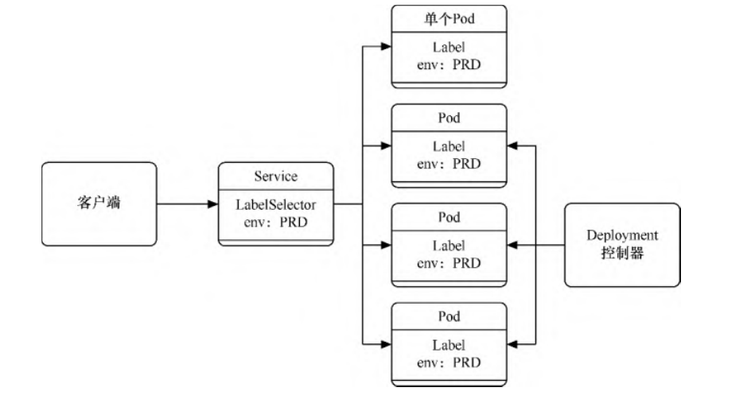
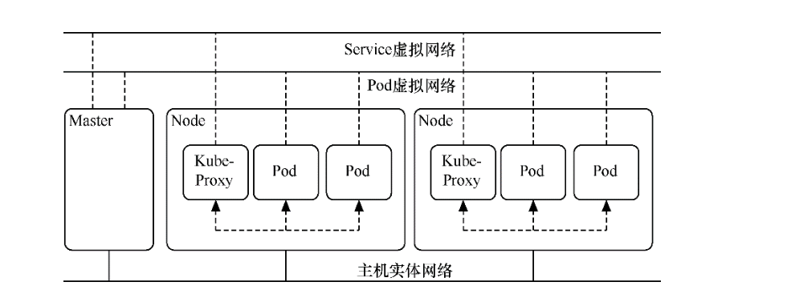
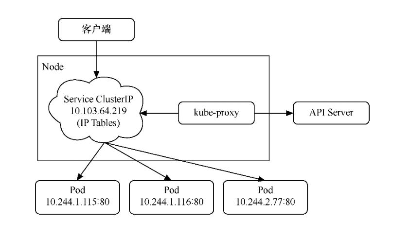
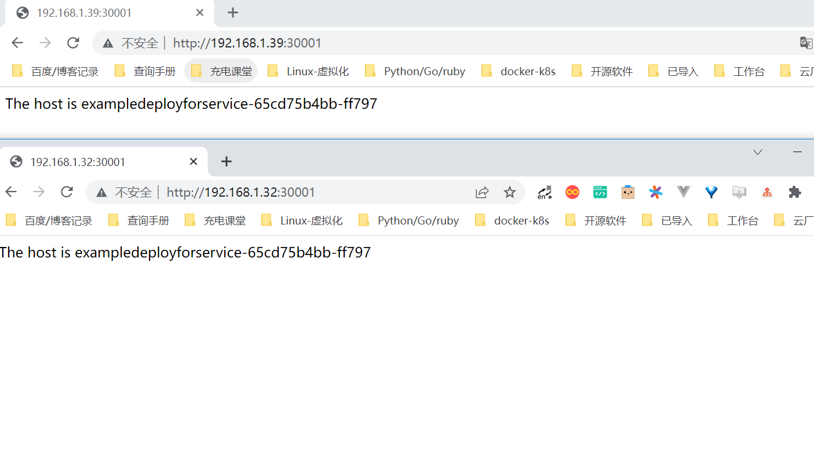
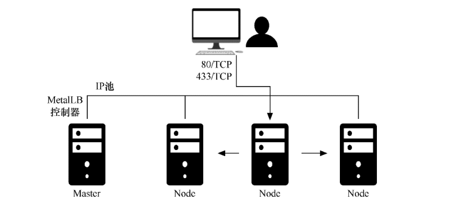
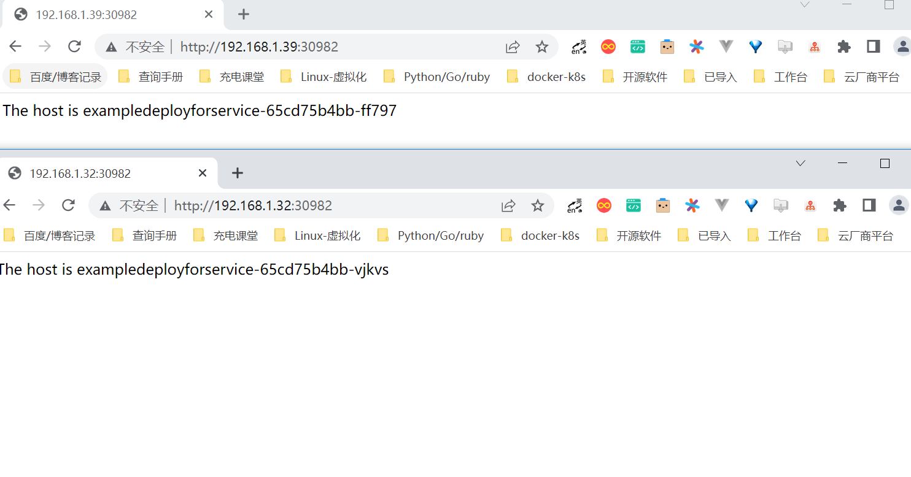

# Service

在Kubernetes中，Service是充当基础内部负载均衡器的一种组件。

Service会将相同功能的Pod在逻辑上组合到一起，一般会采用标签选择器进行组合，让它们表现得如同单个实体。


Service与Pod



Service可以发布服务，可以跟踪并路由到所有指定类型的后端容器。

内部使用者只需要知道Service提供的稳定端点即可进行访问。另外，Service抽象可以根据需要来伸缩或替换后端的工作单位，无论
Service具体路由到哪个Pod，其IP地址都保持稳定。通过Service，我们可以轻松获得服务发现的能力。


Service可以定义一组Pod的访问策略，供Kubernetes集群内部使用，或供集群外的机器使用。Service还可以将集群外所提供的服务抽
象化，有组织地给内部Pod使用。


和Pod一样，在Kubernetes中Service也属于虚拟网络，只有Master节点和Node属于实体网络，


Pod和Service的IP地址只在Kubernetes集群（即Master和Node）内能访问，集群外部的机器是无法访问的。

如果要想让外部机器能访问，对于Pod，可通过之前讲过的将Pod映射到**HostPort上的方法来实现**；

而对于Service，通常的办法是**配置NodePort或LoadBalancer的Service**，或者给Service配置ExternalIP，以便将Service映射到Master或Node上，供外部机器访问。


Kubernetes网络



Service的模板如下。

```
apiVersion: v1
kind: Service
metadata: #元数据
  name: string #Service的名称
  namespace: string #Service所属的命名空间
  labels: #Service的标签
    - name: string
  annotations: #Service的注解
    - name: string

spec:
  selector: [ ] #标签选择器，将选择具有指定标签的Pod作为管理范围
  type: string #Service的类型，分为clusterIP、NodePort、LoadBalancer、ExternalName
  clusterIP: string #虚拟服务的地址
  sessionAffinity: string #指定是否支持session，[ClientIP|None] 表示将同一个客户端的访问请
  #求都转发到同一个后端
  ports: #Service需要暴露的端口
  - name: string #端口名称，区分不同应用的端口
    protocol: string #使用的协议
    port: int #Service监听的端口
    targetPort: int #发送到后端应用的端口
    nodePort: int #当spec.type=NodePort时，指定映射到物理机的端口
status: #当spec.type=LoadBalancer时，设置外部负载均衡器的地址
  loadBalancer:
    ingress:
      ip: string #外部负载的IP地址
       hostname: string #外部负载均衡的主机名
```

Service目前可定义为5个大类。通过spec.type属性可定义

`ClusterIP`、`NodePort`、`LoadBalancer`、`ExternalName`这4类Service。


而ClusterIP类服务还可以分为`普通Service`和`无头Service`两类，所以总共分为5类。


## 1. 3个向外发布服务方式

3种向外发布的方式分别如下。

- ClusterIP-普通Service:这是默认方式，使用时可以不填写`spec.type`。在Kubernetes集群内部发布服务时，会为Service分配一个集群内部可以访问的固定虚拟IP（即ClusterIP）地址。集群中的机器（即Master和Node）以及集群中的Pod都可以访问这个IP地址。
- NodePort:这种方式基于ClusterIP方式，先生成一个ClusterIP地址，然后将这个IP地址及端口映射到各个集群机器（即Master
  和Node）的指定端口上。这样，Kubernetes集群外部的机器就可以通过“NodeIP:Node端口”方式访问Service。
- LoadBalancer：这种方式基于ClusterIP方式和NodePort方式，除此以外，还会申请使用外部负载均衡器，由负载均衡器映射到各
  个“NodeIP:端口”上。这样，Kubernetes集群外部的机器就可以通过负载均衡器访问Service。


定义模板文件，创建一个名为`exampledeployforservice.yml`的模板文件

```yaml
apiVersion: apps/v1
kind: Deployment
metadata:
  name: exampledeployforservice
spec:
  replicas: 3
  selector:
    matchLabels:
      example: exampleforservice
  template:
    metadata:
      labels:
        example: exampleforservice
    spec:
      containers:
      - name: pythonservice
        image: python:3.7
        imagePullPolicy: IfNotPresent
        command: ['sh', '-c']
        args: ['echo "<p>The host is $(hostname)</p>" > index.html; python -m http.server 80']
        ports:
        - name: http
          containerPort: 80
```

各个Pod的标签为“example: exampleforservice”，后续建立Service时会用到这个标签。

通过模板创建Deployment

```bash
$ kubectl apply -f exampledeployforservice.yml
```

Deployment控制器创建完毕后，先通过`kubectl get pod -o wide`命令查看部署情况。可以看到各个Pod都已经创建，它们都有自
己独立的虚拟IP地址。

```bash
$ kubectl get pod -o wide
NAME                                       READY   STATUS    RESTARTS   AGE     IP            NODE            NOMINATED NODE   READINESS GATES
exampledeployforservice-65cd75b4bb-4z4rv   1/1     Running   0          2m39s   10.0.15.74    gitee-k8s-w10   <none>           <none>
exampledeployforservice-65cd75b4bb-ff797   1/1     Running   0          2m39s   10.0.18.149   gitee-k8s-w25   <none>           <none>
exampledeployforservice-65cd75b4bb-vjkvs   1/1     Running   0          2m39s   10.0.18.73    gitee-k8s-w25   <none>           <none>
```

我们创建了3个Pod，分别对应于3个IP地址。以第一个Pod为例，因为在这个Pod中已经搭建了一个Web服务（端口为80，虚拟IP地址为
10.0.15.74）

所以在node或者master上通过访问这个地址就可以访问这个Pod中的服务，如执行以下命令

```bash
[root@gitee-k8s-w04 ~]# curl 192.168.1.35
```

前面已经提过，因为Pod的IP地址不是固定的，而且直接访问Pod的IP地址也无法实现负载均衡，所以会以Service作为入口，提供稳定的IP地址及负载均衡功能，供集群内外使用。

### 1.1 通过ClusterIP发布

#### 普通Service

`exampleclusteripservice.yml`

```yaml
kind: Service
apiVersion: v1
metadata:
  name: exampleclusteripservice
spec:
  selector:
    example: exampleforservice
  ports:
    - protocol: TCP
      port: 8080
      targetPort: 80
  type: ClusterIP
```


- type表示Service的类型。该Service的类型为ClusterIP，可以通过`spec.clusterIP`属性自定义ClusterIP虚拟地址，但在本
  例中没有设置这个属性，Kubernetes会随机分配一个ClusterIP虚拟地址。
- selector表示标签选择器。Service会寻找匹配“example:exampleforservice”的所有Pod，并将它们组织到一个Service
  中。之前我们已经创建了3个这样的Pod。
- ports表示Service发布端口的设置。
- protocol表示使用的协议。
- port表示Service对外提供的端口，可以通过“ClusterIP:端口”访问服务。
- targetPort表示对应的后端应用（即Pod）的端口。


运行以下命令，通过模板创建Service。

```bash
$ kubectl apply -f exampleclusteripservice.yml
```

Service创建成功后，可以通过以下命令查看Service。

```bash
$ kubectl get service
NAME                      TYPE        CLUSTER-IP     EXTERNAL-IP   PORT(S)    AGE
exampleclusteripservice   ClusterIP   10.97.98.205   <none>        8080/TCP   <invalid>
kubernetes                ClusterIP   10.96.0.1      <none>        443/TCP    168d
```

可以看到，Service已成功创建，自动生成的ClusterIP虚拟地址为10.97.98.205 ，端口为8080。可以通过10.97.98.205 :8080访问各个Pod所提供的服务。

```bash
[root@gitee-k8s-w04 ~]# for i in {1..10};do curl 10.97.98.205:8080  ;done
<p>The host is exampledeployforservice-65cd75b4bb-ff797</p>
<p>The host is exampledeployforservice-65cd75b4bb-4z4rv</p>
<p>The host is exampledeployforservice-65cd75b4bb-vjkvs</p>
<p>The host is exampledeployforservice-65cd75b4bb-vjkvs</p>
<p>The host is exampledeployforservice-65cd75b4bb-4z4rv</p>
<p>The host is exampledeployforservice-65cd75b4bb-vjkvs</p>
<p>The host is exampledeployforservice-65cd75b4bb-vjkvs</p>
<p>The host is exampledeployforservice-65cd75b4bb-4z4rv</p>
<p>The host is exampledeployforservice-65cd75b4bb-ff797</p>
<p>The host is exampledeployforservice-65cd75b4bb-4z4rv</p>
```

可以看到，通过“ClusterIP:端口”可以成功访问各个Pod上的Web服务，无须关注具体的Pod地址。另外，Service已经实现了负载均
衡功能，访问时会按比例随机分配到3个Pod中的1个。

通过以下命令可以查看Service的具体信息。

```
$ kubectl describe service {Service名称}
```

在本例中使用了`kubectl describe servic eexampleclusteripservice`命令，可以看到这个Service的各个信息。

其中最重要的信息是Endpoints属性，可以看到这里列出了所有Pod的IP地址与公布的端口。

当调用Service时，会按比例随机转发到Endpoints后面列出的一个地址上面。

```bash
$ kubectl describe svc exampleclusteripservice
Name:              exampleclusteripservice
Namespace:         default
Labels:            <none>
Annotations:       <none>
Selector:          example=exampleforservice
Type:              ClusterIP
IP Family Policy:  SingleStack
IP Families:       IPv4
IP:                10.97.98.205
IPs:               10.97.98.205
Port:              <unset>  8080/TCP
TargetPort:        80/TCP
Endpoints:         10.0.15.74:80,10.0.18.149:80,10.0.18.73:80
Session Affinity:  None
Events:            <none>
```


#### Service访问及负载均衡原理

为什么在给这3个Pod设置了Service以后，就可以实现负载均衡了呢？在每个节点中都有一个叫作kube-proxy的组件，这个组件识别Service和Pod的动态变化，并将变化的地址信息写入本地的IPTables中。而IPTables使用NAT等技术将virtualIP的流量转至Endpoint。默认情况下，Kubernetes使用的是IPTables模式




我们可以进入任意一台Kubernetes机器（Master或者Node），运行以下命令查看IPTables的配置

```bash
$ sudo iptables -L -v -n -t nat
```

kube-proxy底层是修改iptables规则进行的Server和Pod之间的网络数据转发。每个nat表中有server和pod对应的链，可以看到每条链都有对应的数字，表示被转发的概率，这样实现了流量的负载均衡。


我的kubernets集群网络插件使用的Cilium 。

代码开源在 https://github.com/cilium/cilium。


参考：

Cilium 网络概述

https://www.koenli.com/fcdddb4a.html

Cilium 的官方文档

https://docs.cilium.io/en/v1.11/

其他参考文献

https://www.jianshu.com/p/090c3d32c2be


### 1.2 通过NodePort发布


通过NodePort发布的方式基于通过ClusterIP发布的方式，先生成一个ClusterIP，然后将这个虚拟IP地址及端口映射到各个集群机器
（即Master和Node）的指定端口上，这样，Kubernetes集群外部的机器就可以通过“NodeIP:端口”方式访问Service。

`examplenode-portservice.yml`

```yaml
kind: Service
apiVersion: v1
metadata:
  name: examplenodeportservice
spec:
  selector:
    example: exampleforservice
  ports:
  - protocol: TCP
    port: 8080
    targetPort: 80
    nodePort: 30001
  type: NodePort
```

除了更改type属性之外，这里还添加了nodePort: 30001属性，它表示将ClusterIP及port属性（本例中为port:8080）映射到集群中各个机器的30001端口上，这样可以通过“NodeIP:端口”访问Service。

> 提示：nodeport的取值范围为30000～32767。

运行以下命令，通过模板创建Service。

```bash
$ kubectl apply -f examplenode-portservice.yml
service/examplenodeportservice created
```

Service创建成功后，可以通过以下命令查看Service。

```bash
$ kubectl get svc
NAME                     TYPE        CLUSTER-IP       EXTERNAL-IP   PORT(S)          AGE
examplenodeportservice   NodePort    10.111.156.147   <none>        8080:30001/TCP   50m
```

由于NodePort方式会基于ClusterIP方式，因此在集群内部还是可以通过ClusterIP进行端口访问的。

集群外部直接通过NodeIP:30001访问，现在已经可以通过集群外部的机器使用“NodeIP:端口”方式访问Service了



### 1.3 通过LoadBalancer发布

LoadBalancer方式基于ClusterIP方式和NodePort方式来创建服务，除此以外，还会申请使用外部负载均衡器，由负载均衡器映射到
各个“NodeIP:端口”上。

这样，Kubernetes集群外部的机器就可以通过负载均衡器访问Service。

以下的yaml示例中，通过设置LoadBalancer映射到云服务商提供的LoadBalancer地址，以请求底层云平台创建一个负载均衡器，并将
每个Node作为后端进行服务分发。该模式需要底层云平台（如GCE）的支持。

```
apiVersion: v1
kind: Service
metadata:
  name: my-service
spec:
  selector:
    app: MyApp
  ports:
    - protocol: TCP
      port: 80
      targetPort: 9376
      nodePort: 30061
  clusterIP: 10.0.171.12
  loadBalancerIP: 78.11.42.19
  type: loadBalancer
status:
  loadBalancer:
    ingress:
    - ip: 146.147.12.155 #这个是云服务商提供的负载IP
```


然而，Kubernetes没有为私有集群提供网络负载均衡器（类型为LoadBalancer的Service）的实现。

如果你的Kubernetes集群没有在公有云的IaaS平台（GCP、AWS、Azure等）上运行，则LoadBalancer将在创建时无限期地处于“Pending”状态。

**也就是说，只有公有云厂商的Kubernetes支持LoadBalancer。**


#### MetalLB实现 Load Balancer 负载均衡

我们使用的是MetalLB，它为不在公有云平台上运行的私有Kubernetes集群提供网络负载均衡器实现，从而有效地在任何集群中使用LoadBalancer Service。

MetalLB官网：https://metallb.org/


相比Traefik而言

Traefik和metallb使用的场景是不一样的，

- traefik用在7层的LB
- metallb是2/3层的LB


MetalLB会在Kubernetes内运行，监控服务对象的变化。一旦察觉有新的LoadBalancer Service在运行，并且没有可申请的负载均衡器
之后，就会完成以下两部分工作。

- 地址分配：MetalLB将会把在用户配置的地址池中选取的地址分配给Service。
- 地址广播：根据不同配置，MetalLB会以二层（ARP/NDP）或者BGP方式进行地址广播

MetalLB的原理




首先，为了安装MetalLB，直接执行以下命令即可。

```bash
$ kubectl apply -f https://raw.githubusercontent.com/metallb/metallb/v0.12.1/manifests/namespace.yaml
$ kubectl apply -f https://raw.githubusercontent.com/metallb/metallb/v0.12.1/manifests/metallb.yaml
```

MetalLB的相关资源都会安装到metallb-system这个命名空间（namespace）下。

配置生效后，可以通过`$ kubectl get pods -n metallb-system`命令进行查看。

```bash
$ kubectl get pods -n metallb-system
```

其中包含一个名为“controller”的Deployment控制器和一个名为“speaker”的DaemonSet控制器。

```
 kubectl get pods -n metallb-system
NAME                          READY   STATUS              RESTARTS   AGE
controller-66445f859d-pj6qb   1/1     Running             0          119s
speaker-2q9pk                 1/1     Running             0          119s
speaker-2v5c9                 1/1     Running             0          119s
speaker-4h2kl                 1/1     Running             0          119s
speaker-4h8pf                 1/1     Running             0          119s
speaker-569vp                 1/1     Running             0          119s
speaker-5k9lp                 1/1     Running             0          119s
speaker-5wnjx                 1/1     Running             0          119s
speaker-6k6ts                 1/1     Running             0          119s
speaker-85bgw                 1/1     Running             0          119s
speaker-88v5m                 1/1     Running             0          119s
speaker-8rvqv                 1/1     Running             0          119s
speaker-944wx                 1/1     Running             0          119s
....
```

然后，还需要创建一个配置文件发送给MetalLB，以提供对应的集群IP地址及相关协议配置。

`metallb-config.yaml`

编辑地址池，以把自己的集群地址配置进去。

```yaml
apiVersion: v1
kind: ConfigMap
metadata:
  namespace: metallb-system
  name: config
data:
  config: |
    address-pools:
    - name: default
      protocol: layer2
      addresses:
      - 192.168.1.251-192.168.1.253
      # - 192.168.1.0/28
```

接下来，执行以下命令，让配置生效。

```bash
$ kubectl apply -f metallb-config.yaml
```


此时，MetalLB的安装与配置就完成了。
为了创建对应的Service，先执行以下命令。

`exampleloadbalancerservice.yaml`

```yaml
kind: Service
apiVersion: v1
metadata:
  name: exampleloadbalancerservice
spec:
  selector:
    example: exampleforservice
  ports:
  - protocol: TCP
    port: 8080
    targetPort: 80
  type: LoadBalancer
```

通过模板创建Service

```bash
$ kubectl apply -f exampleloadbalancerservice.yaml
service/exampleloadbalancerservice created
```

Service创建成功后，可以通过以下命令查看Service。

```bash
$ kubectl get service
NAME                         TYPE           CLUSTER-IP     EXTERNAL-IP     PORT(S)          AGE
exampleloadbalancerservice   LoadBalancer   10.108.17.98   192.168.1.251   8080:30982/TCP   2m25s
kubernetes                   ClusterIP      10.96.0.1      <none>          443/TCP          168d
```


因为LoadBalancer类型的Service也基于ClusterIP（10.108.17.98: 8080）和NodePort（NodeIP:30982），所以也可以通过这两种形式来访问。

对于这个Service，可以通过ClusterIP方式进行访问，也可以通过NodePort方式进行访问。

```bash
$ curl 10.108.17.98:8080
<p>The host is exampledeployforservice-65cd75b4bb-4z4rv</p>
```

通过NodePort方式访问的结果如图



除此之外，Service还有一个EXTERNAL-IP地址，这个IP地址就是LoadBalancer对外的IP地址，可以由外部机器访问。

因为在Service创建时spec.ports.port属性为8080，所以LoadBalancer的端口为8080。

在本例中，因为LoadBalancer的对外IP为192.168.1.251，端口为8080，所以外部机器也可以通过LoadBalancer地址进行访问。打开
浏览器访问192.168.1.251:8080


参考文献

> MetalLB 负载均衡器使用介绍
>
> https://www.xiexianbin.cn/kubernetes/network/metallb/index.html?to_index=1


#### OpenELB实现 Load Balancer 负载均衡


> 参考文献：
>
> https://www.qikqiak.com/post/service-use-openelb/


## 2.2 个向内发布服务方式

2种向内发布的方式分别如下。

- ClusterIP-无头Service（headless service）：这种方式不会分配ClusterIP地址，也不通过kube-proxy进行反向代理和负载均
  衡，而是通过DNS提供稳定的网络ID来进行访问。DNS会将无头Service的后端直接解析为Pod的IP地址列表。这种类型的Service
  只能在集群内的Pod中访问，集群中的机器无法直接访问。**这种方式主要供StatefulSet使用。**
- ExternalName：和上面提到的3种向外发布的方式不太一样，在那3种方式中都将Kubernetes集群内部的服务发布出去，而ExternalName则将外部服务引入进来，通过一定格式映射到Kubernetes集群，从而为集群内部提供服务。


### 2.1 通过无头Service

无头Service（headless service）是一种特殊的Service类型。

**通过无头Service发布，不会分配任何ClusterIP地址，也不通过kube-proxy进行反向代理和负载均衡。**

*无头Service是通过DNS提供稳定的网络ID来进行访问的，DNS会将无头Service的后端直接解析为Pod的IP地址列表，通过标签选择器将后端的Pod列表返回给调用的客户端。*


这种类型的Service只能在集群内的Pod中访问，集群内的机器（即Master和Node）无法直接访问，集群外的机器也无法访问。

*无头Service主要供StatefulSet使用。*


因为无头Service不提供负载均衡功能，也没有单独的Service IP地址，所以开发人员可以自己控制负载均衡策略，降低与Kubernetes
系统的耦合性。

`exampledeployforservice.yml`

```yaml
apiVersion: apps/v1
kind: Deployment
metadata:
  name: exampledeployforservice
spec:
  replicas: 3
  selector:
    matchLabels:
      example: exampleforservice
  template:
    metadata:
      labels:
        example: exampleforservice
    spec:
      containers:
      - name: pythonservice
        image: python:3.7
        imagePullPolicy: IfNotPresent
        command: ['sh', '-c']
        args: ['echo "<p>The host is $(hostname)</p>" > index.html; python -m http.server 80']
        ports:
        - name: http
          containerPort: 80
```


`exampleheadlessservice.yml`

```yaml
kind: Service
apiVersion: v1
metadata:
  name: exampleheadlessservice
spec:
  selector:
    example: exampleforservice
  clusterIP: None
  ports:
    - protocol: TCP
      port: 8080
      targetPort: 80
  type: ClusterIP
```


和上一个示例不同的是，这里指定了一个属性`clusterIP:None`，它表示不分配任何虚拟IP地址。

```bash
$ kubectl apply -f exampleheadlessservice.yml
```

```bash
$ kubectl get service
NAME                     TYPE        CLUSTER-IP   EXTERNAL-IP   PORT(S)    AGE
exampleheadlessservice   ClusterIP   None         <none>        8080/TCP   49s
```

相对于上一个示例中创建的Service，无头Service的CLUSTER-IP属性为None，即无法通过IP地址访问。

由于这个Service无法由集群内外的机器直接访问，因此只能由Pod访问，而且需要通过DNS形式进行访问。


具体访问形式为`{ServiceName}.{Namespace}.svc.{ClusterDomain}`，

其中svc是Service的缩写（固定格式）；

ClusterDomain表示集群域，本例中默认的集群域为cluster.local；

前面两段文字则是根据Service定义决定的，这个例子中ServiceName为exampleheadlessservice，

而Namespace没有在yml文件中指定，默认值为Default。

为了访问这个地址，先创建一个测试用的Pod，用它来尝试访问Service。命令如下。

`examplepodforheadlessservice.yml`

```yaml
apiVersion: v1
kind: Pod
metadata:
  name: examplepodforheadlessservice
spec:
  containers:
  - name: testcontainer
    image: docker.io/appropriate/curl
    imagePullPolicy: IfNotPresent
    command: ['sh', '-c']
    args: ['echo "test pod for headless service!"; sleep 3600']
```

这个Pod并没有什么特别之处，其镜像为appropriate/curl。该Pod是一种工具箱，里面存放了一些测试网络和DNS使用的工具（例
如，curl和nslookup等），正好用于测试现在的Service。执行sleep 3600命令，可让该容器长期处于运行状态。

```bash
$ kubectl apply -f examplepodforheadlessservice.yml
```

进入容器内部后，可以执行nslookup命令查询DNS信息，获得DNS下面的IP列表。

之前已经提到，Kubernetes中的DNS资源访问方式为`{ServiceName}.{Namespace}.svc. {ClusterDomain}`，

所以本例中的具体命令如下。

```
$ kubectl exec -ti examplepodforheadlessservice -- /bin/sh
/ # nslookup exampleheadlessservice.default.svc.cluster.local
nslookup: can't resolve '(null)': Name does not resolve

Name:      exampleheadlessservice.default.svc.cluster.local
Address 1: 10.0.32.186 10-0-32-186.exampleheadlessservice.default.svc.cluster.local
Address 2: 10.0.23.137 10-0-23-137.exampleheadlessservice.default.svc.cluster.local
Address 3: 10.0.36.243 10-0-36-243.exampleheadlessservice.default.svc.cluster.local
```

可以通过crul命令来测试可访问性。执行以下命令测试是否可以访问Pod上的Web服务。

可以看到，Pod上的Web服务可以成功访问。

```bash
/ # curl exampleheadlessservice.default.svc.cluster.local
<p>The host is exampledeployforservice-65cd75b4bb-wljkl</p>

/ # curl exampleheadlessservice.default.svc.cluster.local
<p>The host is exampledeployforservice-65cd75b4bb-pfcwm</p>

# 如果在同一个名称空间下，还可以用如下方式访问
/ # curl exampleheadlessservice
```

除了直接调用该域名访问服务之外，还可以通过解析域名并根据自定义需求来决定具体要访问哪个Pod的ID地址。

这种方式更适用于由StatefulSet产生的有状态Pod。


### 2.2 通过ExternalName

向外发布方式都将Kubernetes集群内部的服务发布出去，而ExternalName恰恰相反，将外部服务引入进来，通过一定格式映射到Kubernetes集群，从而为集群内部提供服务。

也就是说，ExternalName类型的Service没有选择器，也没有定义任何的端口和端点。

相反，对于运行在集群外部的服务，通过返回外部服务别名这种方式来提供服务。

`exampleexternalnameservice.yml`

```yaml
apiVersion: v1
kind: Service
metadata:
  name: exampleexternalnameservice
spec:
  type: ExternalName
  externalName: www.baidu.com
```

ExternalName类型的Service所需要的属性很简单，只需要指定type，并通过ExternalName引入外部服务的地址即可，这里直接将百
度的网址引入进来。

运行以下命令，通过模板创建Service。

```bash
$ kubectl apply -f exampleexternalnameservice.yml
```

Service创建成功后，可以通过以下命令查看Service。

```bash
$ kubectl get service
NAME                         TYPE           CLUSTER-IP   EXTERNAL-IP     PORT(S)   AGE
exampleexternalnameservice   ExternalName   <none>       www.baidu.com   <none>    37s
```

可以看到，这个Service非常特殊，没有`CLUSTER-IP`，就像无头Service一样，同时也没有对应的`PORT(S)`。

由于该Service和无头Service类似，因此如果需要访问，需要在Pod内通过DNS解析方式进行访问。

我们已经创建了一个专门用于测试Service的Pod，现在继续使用它，通过以下命令进入Pod内部，在Pod内部执行命令行。

```bash
$ kubectl exec -ti examplepodforheadlessservice -- /bin/sh

## 一共解析出两个IP地址。其具体访问方式和无头Service几乎一致
/ # nslookup exampleexternalnameservice.default.svc.cluster.local
nslookup: can't resolve '(null)': Name does not resolve


Name:      exampleexternalnameservice.default.svc.cluster.local
Address 1: 14.215.177.39
Address 2: 14.215.177.38

#这两个IP地址其实就是百度的访问地址，可以发现解析出的IP地址和上面是一样的
/ # nslookup www.baidu.com
nslookup: can't resolve '(null)': Name does not resolve

Name:      www.baidu.com
Address 1: 14.215.177.39
Address 2: 14.215.177.38
```


## 3. 服务发现

Kubernetes支持两种基本的服务发现模式—通过环境变量和通过DNS。通过这两种方式，可以在Pod中发现这些服务。


### 3.1 环境变量

在配置的这些环境变量中，`{ServiceName}_SERVICE_HOST`和
`{ServiceName}_ SERVICE_PORT`格式的变量表示KubernetesService的环境变量（{ServiceName}全转换为大写，横线转换为下
划线），而其他类型格式则是Docker Link形式的环境变量。

之前我们已经创建了专用于测试Service的Pod，可以通过以下命令进入Pod内部，以便在Pod内执行命令行。

```bash
$ kubectl exec -ti examplepodforheadlessservice -- /bin/sh
```

进入Pod后，执行以下命令。

```bash
$ printenv | grep EXAMPLE
```

该命令的作用是查询所带“EXAMPLE”关键字的环境变量，之前我们所创建的所有Service都有这个前缀。

这种方式存在一定的局限性。它要求按一定的顺序执行，即先创建`Service`，之后创建的Pod才会有这些环境变量，否则环境变量不会
有值（除非重启）。

除此以外，还要求Service和Pod在同一命名空间中，其他命名空间中的变量不会配置到Pod中。


### 3.2 DNS

Kubernetes网络中常见四种通信方式

1. 同一个pod的内部通信；

2. 各个pod彼此通信；

3. pod和service的通信；

4. 集群外部流向service的通信。

   **看到上面这些你就不难理解为什么在yaml中存在port，targetPort，nodePort？**

> Service本身有端口、Pod也有端口、容器也有端口，之间有什么关系呢？
>
> - containerPort：一个信息性数据，他只是为集群提供一个可以快速了解相关pod可以访问端口的途径，而且显式指定容器端口，无论你是否指定都不影响其他节点上的客户端pod对其进行访问。
>
> - port：服务提供端口，用于kubernetes集群内部服务访问。
>
> - targetPort：pod目标端口，如果不设置使用默认port端口，port和nodePort的数据通过这个端口进入到Pod内部，Pod里面的containers的端口映射到这个端口，提供服务。
>
> - nodePort：外部用户访问端口


其具体格式如下。

{ServiceName}.{Namespace}.svc.{ClusterDomain}

各个动态字段的配置说明如下。

- ServiceName：创建Service时的Name属性。
- Namespace：创建Service时的Namespace属性，如果没有设置，默认值为Default。
- ClusterDomain：集群的域名，默认的集群域为cluster.local。


对于普通Service和无头Service，DNS的解析会略有区别。


#### 1.无头Service

在解析DNS时，会直接将其解析为相关Pod的IP地址及Pod域名列表，以便客户端通过自己的规则动态地使用这些地址

```
$ kubectl exec -ti examplepodforheadlessservice -- /bin/sh
/ # nslookup exampleheadlessservice.default.svc.cluster.local
nslookup: can't resolve '(null)': Name does not resolve

Name:      exampleheadlessservice.default.svc.cluster.local
Address 1: 10.0.32.186 10-0-32-186.exampleheadlessservice.default.svc.cluster.local
Address 2: 10.0.23.137 10-0-23-137.exampleheadlessservice.default.svc.cluster.local
Address 3: 10.0.36.243 10-0-36-243.exampleheadlessservice.default.svc.cluster.local
```

#### 2.普通Service

在解析DNS时会将其解析为Service的ClusterIP地址，不会直接获取Pod的各个地址.

```
$ kubectl apply -f exampleclusteripservice.yml

$ kubectl get service
NAME                      TYPE        CLUSTER-IP      EXTERNAL-IP   PORT(S)    AGE
exampleclusteripservice   ClusterIP   10.109.135.25   <none>        8080/TCP   3s
kubernetes                ClusterIP   10.96.0.1       <none>        443/TCP    171d

$ kubectl apply -f examplepodforheadlessservice.yml

$ kubectl exec -ti examplepodforheadlessservice -- /bin/sh
/ # nslookup exampleclusteripservice.default.svc.cluster.local
nslookup: can't resolve '(null)': Name does not resolve

Name:      exampleclusteripservice.default.svc.cluster.local
Address 1: 10.109.135.25 exampleclusteripservice.default.svc.cluster.local
```


## 4.其他配置方式


### 4.1 未设置选择器的Service

Service是对Pod进行访问时最常用的抽象，还可以在以下情况下抽象其他类型的后端。

* 如果希望在生产环境中使用外部数据库，但在测试环境中使用自己的数据库。
* 将服务指向不同命名空间下的服务，或者其他集群中的服务。
* 正在做Kubernetes迁移，计划将一部分工作负载迁移到Kubernetes，但现在正在评估，只打算先运行一部分。

在这些情况下，都可以使用没有设置选择器的Service，并自定义Endpoint类型。

`examplenoselectorservice.yml`

```yaml
kind: Service
apiVersion: v1
metadata:
  name: examplenoselectorservice
spec:
  ports:
    - protocol: TCP
      port: 8080
      targetPort: 80
```

可以发现，这个Service里面没有关于选择器的配置，无法与Pod产生关联。

运行以下命令，通过模板创建Service。

```bash
$ kubectl apply -f examplenoselectorservice.yml
```

Service创建成功后，可以通过以下命令查看Service。

```bash
$ kubectl get service
NAME                       TYPE        CLUSTER-IP     EXTERNAL-IP   PORT(S)    AGE
examplenoselectorservice   ClusterIP   10.99.109.46   <none>        8080/TCP   21s
```

此时，可以使用`$ kubectl describe service examplenoselectorservice`命令查看Service的详细信息。可以
发现此时Endpoints属性为`<none>`，即没有任何设置

```bash
$ kubectl describe service examplenoselectorservice
Name:              examplenoselectorservice
Namespace:         default
Labels:            <none>
Annotations:       <none>
Selector:          <none>
Type:              ClusterIP
IP Family Policy:  SingleStack
IP Families:       IPv4
IP:                10.99.109.46
IPs:               10.99.109.46
Port:              <unset>  8080/TCP
TargetPort:        80/TCP
Endpoints:         <none>
```

如果此时通过ClusterIP与端口方式访问Service，可以发现无法连接，

```
$ curl 10.99.109.46:8080
curl: (7) Failed connect to 10.99.109.46:8080; Connection timed out
```

接着，创建Endpoints，让它与刚才创建的Service产生关联。

接下来，通过`$ vim examplenoselectorendpoint.yml`命令创建模板文件。

```bash
$ kubectl get pod -o wide
NAME                                 READY   STATUS    RESTARTS   AGE   IP            NODE            NOMINATED NODE   READINESS GATES
exampledeployment-656c6d8f4c-lww4h   1/1     Running   0          75s   10.0.36.160   gitee-k8s-w08   <none>           <none>
```

```yaml
kind: Endpoints
apiVersion: v1
metadata:
  name: examplenoselectorservice
subsets:
  - addresses:
    - ip: 10.0.36.160
    ports:
    - port: 80
```

这里的IP地址和port可以设置为Kubernetes集群内Pod的IP地址和端口，也可以是Node的IP地址和端口，甚至可以配置成外部集群或外
网的IP地址和端口。

这非常灵活，可根据需要配置。这里配置的是10.0.36.160,是一个nginx的容器的IP地址。

注意，这里Endpoints的name属性需要和Service保持一致，否则无法关联。在本例中，它们的名称都是`examplenoselectorservice`。


运行以下命令，通过模板创建Endpoints。

```bash
$ kubectl apply -f examplenoselectorendpoint.yml
```

此时再使用`kubectl describe service examplenoselectorservice`命令，查看Service的详细信息，可
以发现此时Endpoints已经有信息了，其值为10.0.36.160:80

```bash
$ kubectl describe service examplenoselectorservice
Name:              examplenoselectorservice
Namespace:         default
Labels:            <none>
Annotations:       <none>
Selector:          <none>
Type:              ClusterIP
IP Family Policy:  SingleStack
IP Families:       IPv4
IP:                10.99.109.46
IPs:               10.99.109.46
Port:              <unset>  8080/TCP
TargetPort:        80/TCP
Endpoints:         10.0.36.160:80
```

此时如果再通过ClusterIP加端口的方式访问Service，可以看到已经成功访问Pod提供的服务。

```bash
$ curl 10.99.109.46:8080
<!DOCTYPE html>
<html>
<head>
<title>Welcome to nginx!</title>
....
```

### 4.2 配置外部IP地址

**externalIPs 通过svc创建,在指定的node上监听端口**


如果要让Kubernetes集群之外的机器访问集群内部的服务，另一种方式是配置外部IP地址。

Kubernetes的Service会由externalIP地址发布出去，这样集群之外的机器就可以通过这个外部IP地址来访问Service。

externalIP可以用在任何类型的发布方式（即ClusterIP、NodePort、LoadBalancer、External Name）中。

举例说明

`nginxdeployment.yaml`

```yaml
apiVersion: apps/v1
kind: Deployment
metadata:
  name: exampledeployment
spec:
  replicas: 1
  selector:
    matchLabels:
      example: deploymentfornginx
  template:
    metadata:
      labels:
        example: deploymentfornginx
    spec:
      containers:
      - name: nginx
        image: nginx:1.7.9
        ports:
        - containerPort: 80[
```


`exampleexternalipservice.yml`

```yaml
kind: Service
apiVersion: v1
metadata:
  name: exampleexternalipservice
spec:
  selector:
    example: deploymentfornginx
  ports:
    - protocol: TCP
      port: 8081
      targetPort: 80
  externalIPs:
    - 192.168.1.80
```

这个Service其实就是简单的ClusterIP Service，Pod端口为80，而向外映射的端口为8081，这个端口会同时映射到ClusterIP和
externalIP。我们设置的外部IP地址为192.168.1.80，集群外的机器可以通过这个地址访问集群内的服务。


> 注意：externalIPs 是一个node节点的IP，NodePort是发布所有的Node的服务，externalIPs 是发布单个Node的服务
>
> 适用场景: 想通过svc来负载,但要求某台指定的node上监听,而非像nodeport所有节点监听


```bash
$ kubectl apply -f nginxdeployment.yaml
$ kubectl apply -f exampleexternalipservice.yml
```

Service创建成功后，可以通过以下命令查看Service。

```bash
$ kubectl get service
NAME                       TYPE        CLUSTER-IP       EXTERNAL-IP     PORT(S)    AGE
exampleexternalipservice   ClusterIP   10.107.200.177   192.168.1.101   8081/TCP   48s

$ kubectl describe service exampleexternalipservice
....
Endpoints:         10.0.36.190:80
```

可以看到这里多了EXTERNAL-IP属性，它正是我们设置的地址。

在集群之外的机器上，通过`“外部IP地址:端口”`，就可以访问Pod中的服务。

从外部机器访问的结果


## 5. kubernets Pod的四种网络模式

> 参考文献：
>
> https://www.cnblogs.com/iiiiher/p/8051947.html

