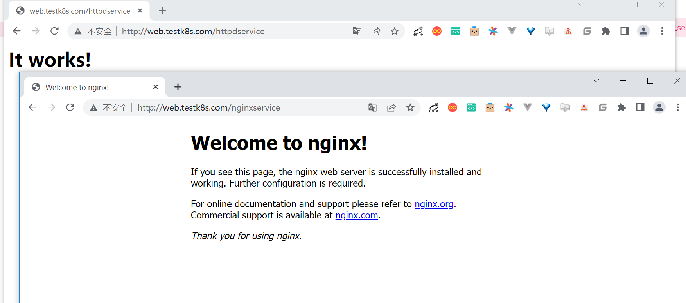

# Ingress

要将Kubernetes集群内的服务发布到集群外来使用，通常的办法是

1. 配置NodePort
2. 配置LoadBalancer的Service
3. 配置ExternalIP的Service
4. 通过Pod模板中的HostPort进行配置等。


但这些方式都存在比较严重的问题。它们几乎都是通过节点端口形式向外暴露服务的，Service一旦变多，每个节点上开启的端口也会
变多。这样不仅维护起来相当复杂，安全性还会大大降低。


Ingress可以避免这个问题，除了Ingress自身的服务需要向外发布之外，其他服务不必使用节点端口形式向外发布。

由Ingress接收外部请求，然后按照域名配置转发给各个后端服务

通过Ingress访问Service提供的服务


在使用Ingress时一般会涉及3个组件：

- 反向代理负载均衡器：其实它类似于Nginx、Apache的应用。在集群中可以使用Deployment、DaemonSet等控制器自由部署反向代理负载均衡器。
- Ingress控制器：实质上是监控器。它不断地与API Server进行交互，实时地感知后端Service、Pod等的变化情况，比如新增和减
  少Pod、增加与减少Service等。当得到这些变化信息后，Ingress控制器再结合Ingress生成配置，然后更新反向代理负载均衡器并
  刷新其配置，以达到服务发现的作用。
- Ingress：定义访问规则。假如某个域名对应某个Service，或者某个域名下的子路径对应某个Service，那么当某个域名的请求或
  子路径的请求进来时，就把请求转发给对应Service。根据这个规则，Ingress控制器会将访问规则动态写入负载均衡器配置中，从
  而实现整体的服务发现和负载均衡。

在使用Ingress时各个组件的关系


Ingress控制器不会随着Kubernetes一起安装。如果要让Ingress资源正常运作，需要安装Ingress控制器。可以选择的Ingress控制器
种类很多，可根据情况自行选择。


不管是哪类Ingress控制器，因为在基本使用层面几乎没有差别（在性能、安全或复杂使用上可能略有区别），所以后面介绍Ingress
基本操作的部分也适用于所有类型的Ingress控制器。

我们使用Traefik作为Ingress控制器，它的功能非常强大，跟Kubernetes结合得很好，还提供了商用支持。


## 1.Ingress控制器的安装

Traefik的安装并不复杂。在这里我们选择最简单的默认安装，只要两步就可以完成。


第一步，执行以下命令，配置traefik-ingress-controller基于角色的访问控制（Role Based Access Control, RBAC），让它能与
Kubernetes的资源和API进行细粒度的控制和交互。

```shell
$ kubectl apply -f https://raw.githubusercontent.com/containous/traefik/v1.7/examples/k8s/traefik-rbac.yaml
```

第二步，选择以下两个命令中的一个执行即可。配置`traefik-ingress-controller`的反向代理负载均衡器服务进程，并在
Kubernetes集群外的各个Node上暴露端口，这样就可以通过集群外的机器访问服务了。

DaemonSet版本的代码如下。

```
$ kubectl apply -f https://raw.githubusercontent.com/containous/traefik/v1.7/examples/k8s/traefik-ds.yaml
```

Deployment版本的代码如下。

```
$ kubectl apply -f https://raw.githubusercontent.com/containous/traefik/v1.7/examples/k8s/traefik-deployment.yaml
```

DaemonSet版本和Deployment版本各有利弊。

Deployment版本的可伸缩性更好，而DaemonSet的流量转发更少，这里不会详述，可根据自己的喜好选择。

从使用角度来说，两种方式没有任何差异，都会暴露各个Node的80端口以供集群外的机器访问服务。

其区别在于：

- DaemonSet版本用Pod的HostPort进行暴露
- Deployment版本用Service的NodePort进行暴露

可以打开上面两个yaml文件自行查看。我们本次选择的是DaemonSet版本。


> 提示：为了了解更全面的安装细节或进行自定义操作，可以参见Traefik官网中关于在Kubernetes上使用的部分，查看TraefikIngress控制器的详细安装说明。


两个安装步骤执行完成后，可以通过如下命令，查看与traefik-ingress-controller相关的Pod是否已成功运行

```
$ kubectl get pod -n kube-system -o wide
NAME                                     READY   STATUS    RESTARTS   AGE    IP              NODE             NOMINATED NODE   READINESS GATES
traefik-ingress-controller-8zsqv         1/1     Running   0          93s    10.0.3.188      giteego-k8s-n2   <none>           <none>
traefik-ingress-controller-j4gsp         1/1     Running   0          93s    10.0.1.9        giteego-k8s-n3   <none>           <none>
traefik-ingress-controller-mxnw8         1/1     Running   0          93s    10.0.0.218      giteego-k8s-n1   <none>           <none>
```

处于运行状态后，可以对这些Pod的IP地址执行curl命令，查看服务是否成功安装

```
[root@giteego-k8s-n4 ~]# curl 10.0.3.188
404 page not found

[root@giteego-k8s-n4 ~]# curl 10.0.1.9
404 page not found

[root@giteego-k8s-n4 ~]# curl 10.0.0.218
404 page not found
```

如果返回“404 page notfound”，则表示服务已成功安装（因为没有配置资源，所以显示“404 page not found”）

通过如下命令，也可以看到与traefik-ingress-controller相关的Service成功配置

```
$ kubectl get service -n kube-system
NAME                      TYPE        CLUSTER-IP      EXTERNAL-IP   PORT(S)                  AGE
kube-dns                  ClusterIP   10.96.0.10      <none>        53/UDP,53/TCP,9153/TCP   170d
metrics-server            ClusterIP   10.103.31.254   <none>        443/TCP                  169d
traefik-ingress-service   ClusterIP   10.101.78.83    <none>        80/TCP,8080/TCP          4m33s
```

之前提到，Traefik在每个Node上暴露80端口以提供服务。我们也可以进行测试

```
$ kubectl get node -o wide
NAME             STATUS   ROLES                  AGE    VERSION   INTERNAL-IP     EXTERNAL-IP   OS-IMAGE                KERNEL-VERSION                CONTAINER-RUNTIME
giteego-k8s-m1   Ready    control-plane,master   170d   v1.21.3   192.168.1.56    <none>        CentOS Linux 7 (Core)   5.14.15-1.el7.elrepo.x86_64   containerd://1.4.11
giteego-k8s-n1   Ready    ingress                170d   v1.21.3   192.168.1.58    <none>        CentOS Linux 7 (Core)   5.14.15-1.el7.elrepo.x86_64   containerd://1.4.11
giteego-k8s-n2   Ready    ingress                170d   v1.21.3   192.168.1.64    <none>        CentOS Linux 7 (Core)   5.14.15-1.el7.elrepo.x86_64   containerd://1.4.11
giteego-k8s-n3   Ready    ingress                170d   v1.21.3   192.168.1.59    <none>        CentOS Linux 7 (Core)   5.14.15-1.el7.elrepo.x86_64   cont
```

```

[root@gitee-go traefik]# curl  192.168.1.58
404 page not found
[root@gitee-go traefik]# curl  192.168.1.64
404 page not found
```


### 1.1 Nginx-ingress部署及使用

> 参考文献
>
>  https://www.cnblogs.com/itzgr/p/13030762.html


### 1.2  Traefik-ingress部署及使用 

> Traefik-ingress部署及使用 
>
> https://www.cnblogs.com/itzgr/p/13030883.html


> k8s Traefik简介与部署
>
> https://www.cuiliangblog.cn/detail/article/29


### 1.3 在指定节点部署Ingress服务

打标签

```shell
$ kubectl label nodes node01 node-role.kubernetes.io/ingress="true"
$ kubectl label nodes node02 node-role.kubernetes.io/ingress="true"
```

查看节点是否设置 Label 成功

```shell
$ kubectl get nodes --show-labels
```

如果想删除标签，可以使用

```shell
$ kubectl label nodes node.k8s.com node-role.kubernetes.io/ingress-
```

更新deployment，增加nodeSelector配置

```shell
$ kubectl -n kube-system patch deployment nginx-ingress-controller -p '{"spec": {"template": {"spec": {"nodeSelector": {"node-role.kubernetes.io/ingress": "true"}}}}}'
```


> 参考文献
>
> [在指定节点部署Ingress服务](https://sre.ink/deploy-ingress-on-single-node/)
>
> [kubernetes 集群部署 Traefik-ingress](https://www.gl.sh.cn/2021/09/08/kubernetes_ji_qun_bu_shu_traefik-ingress.html)
>
> https://www.gl.sh.cn/2021/09/08/kubernetes_ji_qun_bu_shu_traefik-ingress.html#4label


## 2.Ingress的基本操作

 

### 2.1 Ingress示例

两个服务—一个是httpd服务，另一个是Nginx服务

（1）创建与这两个服务相关的Deployment控制器。
① 使用命令创建yml文件。

` exampledeploymentforingress.yml`

② 在文件中填入如下内容并保存。

```yaml
apiVersion: apps/v1
kind: Deployment
metadata:
  name: exampledeploymentnginx
spec:
  replicas: 1
  selector:
    matchLabels:
      example: deploymentfornginx
  template:
    metadata:
      labels:
        example: deploymentfornginx
    spec:
      containers:
      - name: nginx
        image: nginx:1.7.9
        ports:
        - containerPort: 80
---
apiVersion: apps/v1
kind: Deployment
metadata:
  name: exampledeploymenthttpd
spec:
  replicas: 1
  selector:
    matchLabels:
      example: deploymentforhttpd
  template:
    metadata:
      labels:
        example: deploymentforhttpd
    spec:
      containers:
      - name: httpd
        image: httpd:2.2
        ports:
        - containerPort: 80
```

③ 运行以下命令，通过模板创建Deployment控制器。

```shell
$ kubectl apply -f exampledeploymentforingress.yml
```

④ 通过`$ kubectl get pod-o wide`命令查看Pod是否已成功

```shell
$ kubectl get pod -o wide
NAME                                      READY   STATUS    RESTARTS   AGE    IP            NODE            NOMINATED NODE   READINESS GATES
exampledeploymenthttpd-75c6d89b44-rs66c   1/1     Running   0          107s   10.0.23.198   gitee-k8s-w28   <none>           <none>
exampledeploymentnginx-656c6d8f4c-7mnnf   1/1     Running   0          107s   10.0.23.12    gitee-k8s-w28   <none>           <none>

```

（2）创建与这两个服务相关的Service。

① 使用命令创建yml文件。

`exampleserviceforingress.yml`

```yaml
kind: Service
apiVersion: v1
metadata:
  name: exampleservicenginx
spec:
  selector:
    example: deploymentfornginx
  ports:
  - protocol: TCP
    port: 8081
    targetPort: 80
---
kind: Service
apiVersion: v1
metadata:
  name: exampleservicehttpd
spec:
  selector:
    example: deploymentforhttpd
  ports:
  - protocol: TCP
    port: 8081
    targetPort: 80
```

③ 运行以下命令，通过模板创建Service。

```shell
$ kubectl apply -f exampleserviceforingress.yml
```

④ 通过`$ kubeclt get service`命令，查看Service是否已成功配置

```shell
$ kubectl get service
NAME                  TYPE        CLUSTER-IP      EXTERNAL-IP   PORT(S)    AGE
exampleservicehttpd   ClusterIP   10.105.151.198   <none>        8081/TCP   61s
exampleservicenginx   ClusterIP   10.100.179.196     <none>        8081/TCP   61s
```

exampleservicehttpd的IP地址为10.105.151.198，
exampleservicenginx的IP地址为10.100.179.196。

（3）进行简单验证，看看服务是否已成功创建。

```
$ curl 10.105.151.198:8081
<html><body><h1>It works!</h1></body></html>

$ curl 10.100.179.196:8081
<!DOCTYPE html>
<html>
<head>
<title>Welcome to nginx!</title>
```


### 2.2 不使用虚拟主机名称-单个Service

Kubernetes中其实可以通过很多方式来暴露单个Service，不过也可以用Ingress来实现这个功能。要指定一个没有配置规则的
Ingress，只设置backend属性即可。


> 注意：显而易见，不推荐这种方式，这里只是为了说明这种方式存在而已。

首先，定义模板文件，创建一个名为`examplesingleingress.yml`的模板文件。命令如下。

```yaml
apiVersion: extensions/v1beta1
kind: Ingress
metadata:
  name: examplesingleingress
  annotations:
    Kubernetes.io/ingress.class: traefik
spec:
  backend:
    serviceName: exampleservicehttpd
    servicePort: 8081
```

该模板的含义如下。

- apiVersion表示使用的API版本，Ingress目前只存在于beta1版本中。
- kind表示要创建的资源对象，这里使用关键字Ingress。
- metadata表示该资源对象的元数据，一个资源对象可拥有多个元数据。metadata下面的annotations表示资源对象的注解。对
  于Ingress，如果配置了多个Ingress控制器，则需要指定此注解，确定使用哪个Ingress控制器。在本书中安装的是Traefik，
  所以需要按此填写。如果只安装了一个Ingress控制器，则可以不用指定此注解，Ingress会自动匹配唯一的控制器。
- spec表示该资源对象的具体设置。spec下面的backend表示Ingress对应的后端服务。其中serviceName代表Service资源的
  名称，这里取之前设置的名称exampleservicehttpd；
- servicePort代表Service资源的端口，这里取之前在exampleservicehttpd中设置的8081。

通过模板创建Ingress

```shell
$ kubectl apply -f examplesingleingress.yml
```

Ingress创建成功后，可以通过以下命令查看Ingress。

```shell
$ kubectl get ingress
NAME                   CLASS    HOSTS   ADDRESS   PORTS   AGE
examplesingleingress   <none>   *                 80      28s
```

通过以下命令可以查看指定Ingress的详细信息。

```shell
$  kubectl describe ingress examplesingleingress
Name:             examplesingleingress
Namespace:        default
Address:
Default backend:  exampleservicehttpd:8081 (10.0.6.41:80)
Rules:
  Host        Path  Backends
  ----        ----  --------
  *           *     exampleservicehttpd:8081 (10.0.6.41:80)
Annotations:  Kubernetes.io/ingress.class: traefik
Events:       <none>
```

可以看到这个Ingress 对应的后端为exampleservicehttpd:8081，后面的括号中是Pod的IP地址，即10.0.6.41:80。

Host和Path都为*，这表示没有指定任何规则，直接访问Ingress服务的根地址即可访问Service。

之前提到Traefik在每个Node上暴露端口80以提供服务，我们可以进行测试。

```shell
$ curl 192.168.1.58
<html><body><h1>It works!</h1></body></html>

$ curl 192.168.1.64
<html><body><h1>It works!</h1></body></html>
```


### 2.3 基于虚拟主机名称-多个子路径

上面的示例并未展示出Ingress的强大之处，这里会展示Ingress的另一个用法，以便看到使用Ingress的优势所在。

假设现在要实现这样的场景：

在同一个域名下配置两个子路径，其中一个子路径访问httpd的Service，

另一个子路径访问Nginx的Service。

如图6-50所示，首先，通过虚拟网址

`web.testk8s.com/httpdservice`和`web.testk8s.com/nginxservice`访问不同的服务。

同一个域名下配置两个子路径


创建`examplefanoutingress.yml`模板文件

```yaml
apiVersion: networking.k8s.io/v1
kind: Ingress
metadata:
  name: examplefanoutingress
  annotations:
    Kubernetes.io/ingress.class: traefik
    traefik.frontend.rule.type: PathPrefixStrip
spec:
  rules:
    - host: web.testk8s.com
      http:
        paths:
          - path: /httpdservice
            backend:
              service:
                name: exampleservicehttpd
                port:
                 number: 8081
          - path: /nginxservice
            backend:
              service:
                name: exampleservicenginx
                port:
                  number: 8081
```

该模板的含义如下，这里会详细说明一些重要的属性。

- apiVersion表示使用的API版本，Ingress目前只存在于beta1版本中。
- kind表示要创建的资源对象，这里使用关键字Ingress。
- metadata表示该资源对象的元数据，一个资源对象可拥有多个元数据。metadata下面的annotations表示资源对象的注解。其
  中Kubernetes.io/ingress.class表示要使用哪个Ingress控制器；**traefik.frontend.rule.type表示Traefik的特定属性，如果支持在一个域名下划分子路径，这里必须填写PathPrefixStrip。**
- spec表示该资源对象的具体设置。spec下面的rules表示Ingress的路由规则。*host表示自定义一个虚拟主机名称*，
  以此为基础访问各个Service；http表示http协议下的各种设置，在下面设置了多个paths属性，即代表各个子路径的设置。第
  一个path为/httpdservice，它对应的后端服务是exampleservicehttpd；第二个path为/nginxservice，它对应的后端服务是exampleservicenginx。

运行以下命令，通过模板创建Ingress。

```shell
$ kubectl apply -f examplefanoutingress.yml
```

Ingress创建成功后，可以通过以下命令查看Ingress。

```shell
$ kubectl get ingress
NAME                   CLASS    HOSTS             ADDRESS   PORTS   AGE
examplefanoutingress   <none>   web.testk8s.com             80      113s
examplesingleingress   <none>   *                           80      3s
```

从这里也可以看到本例中配置的Ingress与上一个示例中配置的Ingress的区别，它拥有HOSTS属性（值为web.testk8s.com）。

通过以下命令，可以查看指定Ingress的详细信息。

```
$ kubectl describe ingress examplefanoutingress
Name:             examplefanoutingress
Namespace:        default
Address:
Default backend:  default-http-backend:80 (<error: endpoints "default-http-backend" not found>)
Rules:
  Host             Path  Backends
  ----             ----  --------
  web.testk8s.com
                   /httpdservice   exampleservicehttpd:8081 (10.0.6.165:80)
                   /nginxservice   exampleservicenginx:8081 (10.0.6.98:80)
Annotations:       Kubernetes.io/ingress.class: traefik
                   traefik.frontend.rule.type: PathPrefixStrip
Events:            <none>
```

可以看到这个Ingress除了Host为web.testk8s.com之外，还对应了两个path（即访问的子路径），各个子路径对应的Service后面的小括号中也标明了Service对应的Pod。

在集群外的机器访问这些服务之前，需要给这些集群外的机器配置HOST，以便能通过虚拟主机名称解析出对应的IP地址。

现在编辑HOST文件（对于Linux系统，其路径为/etc/hosts；

对于Windows系统，其路径为C:\Windows\System32\drivers\etc\hosts），需要在HOST文件中添加如下内容。

若在浏览器上访问虚拟网址http://web.testk8s.com/httpdservice，就会定位到exampleservicehttpd提供的服务

若在浏览器上访问虚拟网址http://web.testk8s.com/nginxservice，就会定位到exampleservicenginx提供的服务

```
192.168.1.58    web.testk8s.com
192.168.1.64    web.testk8s.com
```





### 2.4 基于多个虚拟主机名称

首先定义模板文件`examplehostingingress.yml`

```yaml
apiVersion: networking.k8s.io/v1
kind: Ingress
metadata:
  name: examplefanoutingress
  annotations:
    Kubernetes.io/ingress.class: traefik
    traefik.frontend.rule.type: PathPrefixStrip
spec:
  rules:
    - host: web.testk8shttpd.com
      http:
        paths:
          - path: /
            pathType: Prefix
            backend:
              service:
                name: exampleservicehttpd
                port:
                 number: 8081
    - host: web.testk8snginx.com
      http:
        paths:
          - path: /
            pathType: Prefix
            backend:
              service:
                name: exampleservicenginx
                port:
                 number: 8081
```

这个Ingress和之前定义的区别在于，这里定义了两个规则：

其中一个host设置为web.testk8shttpd.com（虚拟网址），其后端服务为exampleservicehttpd；

另一个host设置为web.testk8snginx.com（虚拟网址），其后端服务为exampleservicenginx。

运行以下命令，通过模板创建Ingress。

```shell
$ kubectl apply -f examplehostingingress.yml
```

Ingress创建成功后，可以通过以下命令查询Ingress。

```shell
$ kubectl get ingress
NAME                   CLASS    HOSTS                                       ADDRESS   PORTS   AGE
examplefanoutingress   <none>   web.testk8shttpd.com,web.testk8snginx.com             80      1s
examplesingleingress   <none>   *                                                     80      25m
```

查询结果如图6-56所示。从这里也可以看到和之前配置的Ingress的区别，它拥有两个HOSTS属性，分别为web.testk8shttpd.com
和web.testk8snginx.com。

通过以下命令，可以查看指定Ingress的详细信息。

```shell
$ kubectl describe ingress examplefanoutingress
Name:             examplefanoutingress
Namespace:        default
Address:
Default backend:  default-http-backend:80 (<error: endpoints "default-http-backend" not found>)
Rules:
  Host                  Path  Backends
  ----                  ----  --------
  web.testk8shttpd.com
                        /   exampleservicehttpd:8081 (10.0.6.165:80)
  web.testk8snginx.com
                        /   exampleservicenginx:8081 (10.0.6.98:80)
Annotations:            Kubernetes.io/ingress.class: traefik
                        traefik.frontend.rule.type: PathPrefixStrip
Events:                 <none>
```

可以看到这个Ingress拥有两个Host，分别对应的不同的Service。

在集群外的机器访问这些服务之前，需要给这些集群外的机器配置HOST，以便能通过虚拟主机名称解析出对应的IP地址。

为了编辑HOST文件（对于Linux系统，其路径为/etc/hosts；

对于Windows系统，其路径为C:\Windows\System32\drivers\etc\hosts），需要在HOST文件中添加如下关于虚拟网址的内容。

```
192.168.1.58 web.testk8shttpd.com
192.168.1.58 web.testk8snginx.com
192.168.1.64 web.testk8shttpd.com
192.168.1.64 web.testk8snginx.com
```

若在浏览器上访问虚拟网址http://web.testk8shttpd.com，就会定位到exampleservicehttpd提供的服务

若在浏览器上访问虚拟网址http://web.testk8snginx.com，就会定位到exampleservicenginx提供的服务


关于更复杂的场景（如配置多个虚拟主机、每个主机配置多个子路径等方式），读者可以自行尝试，这里不再详述。


## 3.Ingress配置https访问

> 参考文献
>
> https://www.gl.sh.cn/2021/12/26/ingress-nginx_pei_zhi_https.html
>
> https://sre.ink/ingress-use-https/
