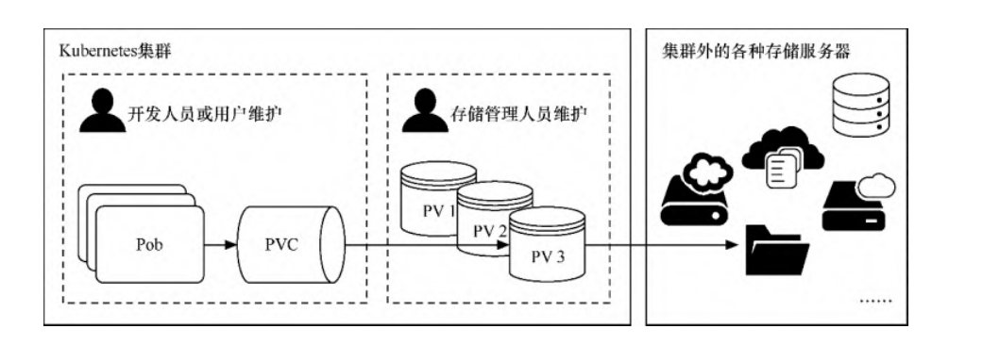

# 持久存储卷

在介绍网络存储卷的时候已经提到，Kubernetes支持为数众多的云提供商和网络存储方案，如NFS/iSCSI/GlusterFS/RDB/azureDisk/flocker等。但因为网络存储卷通常是集成各种第三方的存储系统，所以在配置上各有差别。


由于方案众多，配置有异，因此在存储参数的配置方面，可能只有对应的存储管理人员才能了解，而且这些都不应该是开发人员或集
群管理员需要关注的。

Kubernetes提供了3种基于存储的抽象对象——PersistentVolume（PV）、StorageClass和PersistentVolumeClaim（PVC），以支持基础设施和应用之间的分离。


这样开发人员、存储管理人员能各司其职，由存储管理人员设置PV或StorageClass，并在里面配置存储系统和参数，然后开发人员只
需要创建PVC来申请指定空间的资源以存储与共享数据即可，无须再关注存储的具体实现和操作，如图7-13所示。当删除PVC时，它写入具体存储资源中的数据可以根据回收策略自动清理。

PVC与PV的管理



## 1. PV与PVC

PV表示持久存储卷，定义了Kubernetes集群中可用的存储资源，其中包含存储资源实现的细节，如包含如何使用
NFS/iSCSI/GlusterFS/RDB/azureDisk/flocker 等资源的具体设置。

·

PVC表示持久存储卷的申请，是由用户发起的对存储资源的请求。申请中只包含请求资源的大小和读写访问模式，无须关注具体的资源
实现细节，Kubernetes会自动为其绑定符合条件的PV。


### 1.1 PV与PVC的基本操作

`examplefornfspv.yml`

```yaml
apiVersion: v1
kind: PersistentVolume
metadata:
  name: examplefornfspv
spec:
  capacity:
    storage: 1Gi
  accessModes:
    - ReadWriteMany
  persistentVolumeReclaimPolicy: Recycle
  storageClassName: examplenfs
  nfs:
    path: /nfstest
    server: 192.168.1.60
```

该模板的主要含义如下。

- kind表示要创建的资源对象，这里使用关键字PersistentVolume。
- spec表示该资源对象的具体设置。
- capacity：表示PV的容量，通过storage子属性可以指定占用的具体存储资源（如NFS）的大小，在本例中设定为1Gi
- accessModes：定义 PV 对具体存储资源（如 NFS）的访问模式。一共有 3种访问模式，分别为ReadWriteOnce（该卷可以被单个节点以读写模式挂载），ReadOnlyMany（该卷可以被多个节点以只读模式挂载），ReadWriteMany（该卷可以被多个节点以读写模式挂载）。
- 在本例中使用ReadWriteMany。persistentVolumeReclaimPolicy：表示当删除PVC
  时，PV资源的回收策略。一共有3种策略，分别为`Retain（保留`）、`Recycle（自动回收）`、`Delete（自动删除）`。当前只有NFS和hostPath支持Recycle策略，AWSEBS、GCE PD、Azure Disk和Cinder卷支持Delete策略。在
  本例中使用Recycle。storageClassName：表示PV资源的描述性分类名称，例如，可以使用“ssd”“slowdisk”等具备分类的描述性名称。后续在创建PVC时可以引用这个名称来绑定PV。
- nfs：表示该PV使用NFS服务器作为具体的存储资源，server和path属性为之前网络存储卷示例中配置的NFS服务
  器及共享目录。

接下来，执行以下命令，创建PV。

```shell
$ kubectl apply -f examplefornfspv.yml
```

PV创建完成后，可以通过以下命令查询PV资源。

```shell
$ kubectl get pv
NAME                                       CAPACITY   ACCESS MODES   RECLAIM POLICY   STATUS      CLAIM                                                   STORAGECLASS          REASON   AGE
examplefornfspv                            1Gi        RWX            Recycle          Available 
```

查询结果如上所示。PV已成功创建，其STATUS属性为Available，这表示资源空闲，尚未被PVC申请使用。

接下来，使用以下命令，可以查询PV资源的详情。

```shell
$ kubectl describe pv {PV名称}
```


在本例中，命令为`$ kubectl describe pvexamplefornfspv`。执行结果如图7-15所示，在Source处可以看到具体的资源配置信息。

```shell
$ kubectl describe pv examplefornfspv
Name:            examplefornfspv
Labels:          <none>
Annotations:     <none>
Finalizers:      [kubernetes.io/pv-protection]
StorageClass:    examplenfs
Status:          Available
Claim:
Reclaim Policy:  Recycle
Access Modes:    RWX
VolumeMode:      Filesystem
Capacity:        1Gi
Node Affinity:   <none>
Message:
Source:
    Type:      NFS (an NFS mount that lasts the lifetime of a pod)
    Server:    192.168.1.60
    Path:      /nfstest
    ReadOnly:  false
Events:        <none>
```


PV定义完成后就可以创建PVC以申请使用存储卷资源。

接下来，创建`examplefornfspvc.yml`文件。

```yaml
apiVersion: v1
kind: PersistentVolumeClaim
metadata:
  name: examplefornfspvc
spec:
  accessModes:
    - ReadWriteMany
  storageClassName: "examplenfs"
  resources:
    requests:
      storage: 500Mi
```

该模板的主要含义如下。

- kind表示要创建的资源对象，这里使用关键字PersistentVolumeClaim。
- spec表示该资源对象的具体设置。accessModes：定义对PV的访问模式。Kubernetes会给PVC绑定满足此访问模式的PV。在本例中使用ReadWriteMany，与之前定义的PV保持一致。
- storageClassName：表示要引用的PV资源的描述性分类名称。Kubernetes会根据这个名称将PVC绑定到符合条件的
  PV。在本例中使用examplenfs，这与之前定义的PV保持一致。
- resources：定义PVC的资源参数。requests属性会设置具体资源需求，Kubernetes会给PVC绑定满足资源大小的PV。
  本例中设置为“storage: 500Mi”，这表示申请500MiB（1MiB=2 20 B，1MB=10 6 B）的资源大小。之前我们创建
  的PV为1GiB（1GiB=2 30 B，1GB=10 9 B），足够容纳该资源请求。

接下来，执行以下命令，创建PVC。

```shell
$ kubectl apply -f examplefornfspvc.yml
```

PVC创建完成后，可以通过以下命令查询PVC资源。

```shell
$ kubectl get pvc
NAME               STATUS   VOLUME            CAPACITY   ACCESS MODES   STORAGECLASS   AGE
examplefornfspvc   Bound    examplefornfspv   1Gi        RWX            examplenfs     0s
```

查询结果如上面所示。PVC已成功创建，其STATUS属性为Bound，表示已成功绑定到符合PVC资源申请条件的PV上；

VOLUME属性显示了绑定的PV的名称，这正是我们之前创建的examplefornfspv。

此时如果再通过`$ kubectl get pv`命令查看已创建的PV，可以发现其STATUS属性由之前的Available变为Bound，CLAIM属性由
空值变为刚才创建的PVC。

```shell
$ kubectl get pv
NAME                                       CAPACITY   ACCESS MODES   RECLAIM POLICY   STATUS     CLAIM                                                   STORAGECLASS          REASON   AGE
examplefornfspv                            1Gi        RWX            Recycle          Bound      default/examplefornfspvc  
```

使用以下命令，可以查询PVC资源的详情。

```shell
$ kubectl describe pvc examplefornfspvc
Name:          examplefornfspvc
Namespace:     default
StorageClass:  examplenfs
Status:        Bound
Volume:        examplefornfspv
Labels:        <none>
Annotations:   pv.kubernetes.io/bind-completed: yes
               pv.kubernetes.io/bound-by-controller: yes
Finalizers:    [kubernetes.io/pvc-protection]
Capacity:      1Gi
Access Modes:  RWX
VolumeMode:    Filesystem
Used By:       <none>
Events:        <none>
```


PVC创建完成后，为了定义Pod并使用PVC引用的资源，首先，创建`exampledeployforpvc.yml`文件。

```yaml
apiVersion: apps/v1
kind: Deployment
metadata:
  name: exampledeployforpvc
spec:
  replicas: 2
  selector:
    matchLabels:
      example: exampleforpvc
  template:
    metadata:
      labels:
        example: exampleforpvc
    spec:
      containers:
      - name: containerforpvc
        image: busybox
        imagePullPolicy: IfNotPresent
        command: ['sh', '-c']
        args: ['echo "The host is $(hostname)" >> /dir/dataforpvc; sleep 3600']
        volumeMounts:
        - name: pvcdata
          mountPath: /dir
      volumes:
      - name: pvcdata
        persistentVolumeClaim:
          claimName: examplefornfspvc
```

本例中创建的存储卷名称为pvcdata，这个名称会被容器设置中的volumeMounts所引用。存储卷的类型是persistentVolumeClaim（即使用PVC），claimName属性表示引用的PVC名称，本例中为examplefornfspvc。

接下来，执行以下命令，创建Deployment控制器。

```shell
$ kubectl apply -f exampledeployforpvc.yml
```

创建后可以通过`$ kubectl get deploy`命令查看启动状态

```shell
$ kubectl get deployment
NAME                  READY   UP-TO-DATE   AVAILABLE   AGE
exampledeployforpvc   2/2     2            2           29s
```

接下来，执行`$ kubectl get pod -o wide`命令，可以看到Deployment控制器一共创建了两个Pod，分别位于不同
的机器上。

在本例中，PVC所绑定的PV引用中NFS服务器的共享目录为`/data/nfs/nfstest`。在NFS服务器上执行`cat /data/nfs/nfstest/data`，可输出NFS共享目录下的文件内容。

```
$ cat /data/nfs/nfstest/dataforpvc
The host is exampledeployforpvc-697cbdb4d9-qjg8h
The host is exampledeployforpvc-697cbdb4d9-zvkk4
```

任意抽取一个Pod（在本例中为exampledeployforpvc-697cbdb4d9-qjg8h），通过以下命令进入Pod内部的命令界面。

```shell
$ kubectl exec -it pod/exampledeployforpvc-697cbdb4d9-qjg8h -- /bin/sh
/ # cat /dir/dataforpvc
The host is exampledeployforpvc-697cbdb4d9-qjg8h
The host is exampledeployforpvc-697cbdb4d9-zvkk4
/ # echo "hujianli20220417!" >> /dir/dataforpvc
/ # cat /dir/dataforpvc
The host is exampledeployforpvc-697cbdb4d9-qjg8h
The host is exampledeployforpvc-697cbdb4d9-zvkk4
hujianli20220417!
```

回到nfs服务器目录查看数据的一致性

```shell
$ cat /data/nfs/nfstest/dataforpvc
The host is exampledeployforpvc-697cbdb4d9-qjg8h
The host is exampledeployforpvc-697cbdb4d9-zvkk4
hujianli20220417!
```

### 1.2 PV的解绑与回收

在之前的示例中已经将exampledeployforpvc绑定到唯一的PV—exampledeployforpv上，如果此时再创建一个新的PVC，会发生什么情
况呢？

`examplefornfspvc2.yml`

```yaml
apiVersion: v1
kind: PersistentVolumeClaim
metadata:
  name: examplefornfspvc2
spec:
  accessModes:
    - ReadWriteMany
  storageClassName: "examplenfs"
  resources:
    requests:
      storage: 500Mi
```

接下来，执行以下命令，创建PVC。

```shell
$ kubectl apply -f examplefornfspvc2.yml
```

PVC创建完成后，可以通过以下命令查询PVC资源。

```shell
$ kubectl get pvc
NAME                STATUS    VOLUME            CAPACITY   ACCESS MODES   STORAGECLASS   AGE
examplefornfspvc    Bound     examplefornfspv   1Gi        RWX            examplenfs     5m43s
examplefornfspvc2   Pending                                               examplenfs     <invalid>
```

可以看到examplefornfspvc2的STATUS属性为Pending，这表示PVC一直处于挂起状态，没有找到合适的PV资源。

虽然examplefornfspv定义的空间为1GiB，而后面定义的两个PVC都各自只申请了500MiB的资源，但PV和PVC只能一对一绑定，不能一对多绑定，所以examplefornfspvc2无法申请到合适的PV资源。要使用examplefornfspvc2，要么再创建一个新的PV资源，要么就让之前的PVC和PV资源解除绑定。

此时我们可以执行以下命令，先删除之前创建的PVC资源。

```shell
$ kubectl delete pvc exampledeployforpvc
```

执行删除命令后，执行$ kubectl get pv命令，可以看到examplefornfspv的STATUS属性由Bound变回Available，CLAIM属性
再次变为空值。PV和PVC已解除绑定,examplefornfspvc2自动绑定到了pv上。

此时再执行`$ kubectl get pv`命令，可以看到examplefornfspv和examplefornfspvc2已成功绑定

```shell
$ kubectl get pvc
NAME                STATUS   VOLUME            CAPACITY   ACCESS MODES   STORAGECLASS   AGE
examplefornfspvc2   Bound    examplefornfspv   1Gi        RWX            examplenfs     2m41s

$ kubectl get pv
NAME                                       CAPACITY   ACCESS MODES   RECLAIM POLICY   STATUS   CLAIM                                                   STORAGECLASS          REASON   AGE
examplefornfspv                            1Gi        RWX            Recycle          Bound    default/examplefornfspvc2                               examplenfs                     10m
```

因为之前PV定义的回收策略（persistentVolumeReclaimPolicy）为Recycle，这表示自动回收，所以解绑后会清理PVC在PV上写入的内
容。此时如果再执行`$ cat /data/nfs/nfstest/dataforpvc`，可以看到文件已不存在。

```shell
$ cat /data/nfs/nfstest/dataforpvc
cat: /data/nfs/nfstest/dataforpvc: No such file or directory
```

如果自动回收失败，则PV的STATUS属性将变为Failed，这表示暂时无法使用。

如果之前PV定义的回收策略是Retain，则删除PVC后资源不会自动回收。

此时`/data/nfs/nfstest/dataforpvc`文件依然存在，而PV的STATUS属性将变为Released，因此依然不能重新绑定其
他PVC，除非重新创建PV。