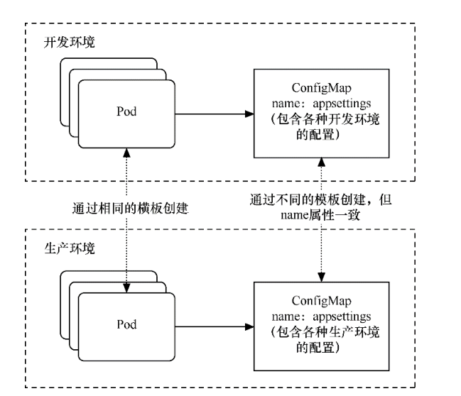

.. contents::
   :depth: 3
..

配置存储卷
==========

Kubernetes还拥有一些存储卷，但它们并不是用来进行容器间交互或Pod间数据共享的，而是用于向各个Pod的容器中注入配置信息
的。它们的使用方式大同小异，Pod可以通过环境变量或者存储卷访问这些配置信息。

目前这类存储卷主要分为3种。

-  ConfigMap：可传递普通的配置信息。
-  Secret：可传递敏感的、加密的配置信息。
-  DownwardAPI：可传递Pod和容器自身的运行信息。

1. ConfigMap
------------

在企业运营中，一般都会有多个部署环境，如开发环境、测试环境、预发布环境、生产环境等，这几种环境的配置也各有不同。如果
在Pod模板中直接配置，会发现管理非常困难，每个环境都要准备不同的模板。

利用 ConfigMap
可以解耦部署与配置之间的关系，只需要在各个环境的机器上预先完成不同的配置即可，也就是配置ConfigMap。

而对于同一个应用部署，Pod模板无须变化，只要将明文编写的配置设置为对ConfigMap的引用，就可以降低环境管理和部署的复杂度，

利用ConfigMap解耦部署与配置间的关系 如图所示

|image0|

1.1 ConfigMap创建
~~~~~~~~~~~~~~~~~

1. 从key-value字符串创建
^^^^^^^^^^^^^^^^^^^^^^^^

.. code:: shell

   $ kubectl create configmap special-config --from-literal=special.how=very
   configmap "special-config" created

   $ kubectl get configmap special-config -o go-template='{{.data}}'
   map[special.how:very]

2. 从env文件创建
^^^^^^^^^^^^^^^^

.. code:: shell

   $ echo -e "a=b\nc=d" | tee config.env
   a=b
   c=d

   $ kubectl create configmap special-config --from-env-file=config.env
   configmap "special-config" created

   $ kubectl get configmap special-config -o go-template='{{.data}}'
   map[a:b c:d]

3. 从目录创建
^^^^^^^^^^^^^

.. code:: shell

   $ mkdir config
   $ echo a>config/a
   $ echo b>config/b
   $ kubectl create configmap special-config --from-file=config/
   configmap "special-config" created

   $ kubectl get configmap special-config -o go-template='{{.data}}'
   map[a:a
    b:b
   ]

kubernetes的configmap格式错乱问题json/yaml格式化

**备忘configmap格式化**

::

   #kubectl create cm node-local-dns  --from-file Corefile

   kubectl get cm node-local-dns -o json | jq '.data.Corefile' -r

   # 使用以下方法删除尾随空格
   sed -i -E 's/[[:space:]]+$//g' file.txt
   # 使用空格替换制表符
   sed -i 's/\t/    /g' file.txt

4. 从文件Yaml/Json 文件创建
^^^^^^^^^^^^^^^^^^^^^^^^^^^

.. code:: yaml

   apiVersion: v1
   kind: ConfigMap
   metadata:
     name: special-config
     namespace: default
   data:
     special.how: very
     special.type: charm

.. code:: shell

   $ kubectl create  -f  config.yaml
   configmap "special-config" created

ConfigMap主要是以键值对的方式来存储配置信息的。首先，创建一个ConfigMap。和之前一样，通过以下命令创建模板
文件。

``exampleconfigmap.yml``

.. code:: yaml

   kind: ConfigMap
   apiVersion: v1
   metadata:
     name: exampleconfigmap
   data:
     exampleHostName: www.testk8s.com
     exampleBusinessMode: exampleMode

运行以下命令，通过模板创建ConfigMap。

.. code:: shell

   $ kubectl apply -f exampleconfigmap.yml

创建完成后，可以通过\ ``$ kubectl get configmap``\ 命令来查看创建情况

.. code:: shell

   $ kubectl get cm
   NAME               DATA   AGE
   exampleconfigmap   2      83s

查看ConfigMap的详情。

.. code:: shell

   $ kubectl describe cm exampleconfigmap
   Name:         exampleconfigmap
   Namespace:    default
   Labels:       <none>
   Annotations:  <none>

   Data
   ====
   exampleBusinessMode:
   ----
   exampleMode
   exampleHostName:
   ----
   www.testk8s.com
   Events:  <none>

ConfigMap创建完成后就可以在Pod中引用了。接下来分别介绍ConfigMap的两种引用方式。

1.2 ConfigMap使用
~~~~~~~~~~~~~~~~~

1. 环境变量引用方式
^^^^^^^^^^^^^^^^^^^

``examplepodforenvconfig.yml``

.. code:: yaml

   apiVersion: v1
   kind: Pod
   metadata:
     name: examplepodforenvconfig
   spec:
     containers:
       - name: containerforenv
         image: busybox
         imagePullPolicy: IfNotPresent
         command: ['sh','-c']
         args: ['echo "EnvParaHostName: ${EnvParaHostName} EnvParaBusinessMode: ${EnvParaBusinessMode}"; printenv | grep EnvPara; sleep 3600']
         env:
           - name: EnvParaHostName
             valueFrom:
               configMapKeyRef:
                 name: exampleconfigmap
                 key: exampleHostName
           - name: EnvParaBusinessMode
             valueFrom:
               configMapKeyRef:
                 name: exampleconfigmap
                 key: exampleBusinessMode

通过valueFrom、configMapKeyRef、name、key等属性，我们可以指定具体要引用哪些环境变量。

在 env
属性中，我们先定义了环境变量的名称（在本例中分别为EnvParaHostName和EnvParaBusinessMode）。

和之前引用环境变量的不同之处在于，这里使用valueFrom属性来定义，表示环境变量的值来自外部引用，
关键字configMapKeyRef表示从ConfigMap中引用；
configMapKeyRef.name属性表示要引用的ConfigMap的名称；而configMapKeyRef.key表示要引用的键值对的键名，它的值会映射
到环境变量上。这里我们使用之前创建的两个键值对。

在容器的命令参数中，我们会先通过命令行参数直接输出定义的参数，然后通过$
printenv \| grep EnvPara命令输出Pod中包含
“EnvPara”字符串的环境变量（因为其他环境变量较多，所以通过grep来筛选），查看定义的参数是否已注入Pod的环境变量中。

运行以下命令，通过模板创建Pod。

.. code:: shell

   $ kubectl apply -f examplepodforenvconfig.yml

创建完成后，通过\ ``$ kubectl logs examplepodforenvconfig``\ 命令可以查看Pod输出的信息

.. code:: shell

   $ kubectl logs pod/examplepodforenvconfig
   EnvParaHostName: www.testk8s.com EnvParaBusinessMode: exampleMode
   EnvParaHostName=www.testk8s.com
   EnvParaBusinessMode=exampleMode

环境变量已经成功引用ConfigMap中设置的值。

有些时候，ConfigMap中设置的键值对可能会非常多，一个个配置到Pod模板中会相当麻烦。

Kubernetes还提供了一种简易的方式，即将ConfigMap中的所有键值对直接配置到Pod中。

``examplepodforenvconfigv2.yml``

.. code:: yaml

   apiVersion: v1
   kind: Pod
   metadata:
     name: examplepodforenvconfigv2
   spec:
     containers:
     - name: containerforenv
       image: busybox
       imagePullPolicy: IfNotPresent
       command: ['sh','-c']
       args: ['printenv | grep example; sleep 3600']
       envFrom:
       - configMapRef:
           name: exampleconfigmap

本例中直接使用envFrom属性，表示整个环境变量都是从外部文件引用的；引用方式为configMapRef，表示从ConfigMap中引用；
configMapRef.name属性表示ConfigMap的名称。

接下来，利用容器命令参数printenv \| grep
example输出Pod中包含“example”字符串的环境变量（因为其他环境变量较多，
所以通过grep筛选出指定条目来查看）。

运行以下命令，通过模板创建Pod。

.. code:: shell

   $ kubectl apply -f examplepodforenvconfigv2.yml

创建完成后，可以查看Pod输出的信息

.. code:: shell

   $ kubectl logs pod/examplepodforenvconfigv2
   HOSTNAME=examplepodforenvconfigv2
   exampleHostName=www.testk8s.com
   exampleBusinessMode=exampleMode

2. 存储卷引用方式
^^^^^^^^^^^^^^^^^

因为ConfigMap本身是一种特殊的存储卷，所以也可以通过存储卷方式配置到Pod中。不同于环境变量的引用方式，这种引用方式会将每
个键值对都转换成对应的实体文件。

``examplepodforvolumeconfig.yml``

.. code:: yaml

   apiVersion: v1
   kind: Pod
   metadata:
     name: examplepodforvolumeconfig
   spec:
     containers:
     - name: containerforvolume
       image: busybox
       imagePullPolicy: IfNotPresent
       command: ['sh','-c']
       args: ['echo "files:"; ls /config/allvalues; sleep 3600']
       volumeMounts:
       - name: volumeconfig
         mountPath: /config/allvalues

     volumes:
     - name: volumeconfig
       configMap:
         name: exampleconfigmap

本例中创建的存储卷名称为volumeconfig，这个名称会被容器设置中的数据卷引用。存储卷的类型是configMap，其name属性为
exampleconfigmap，引用之前我们创建的ConfigMap。

本例中创建的名为containerforvolume容器会引用volumeconfig存储卷，并将其映射到容器的/config/allvalues目录下，然后通过ls
命令，输出/config/allvalues目录下的所有文件。

运行以下命令，通过模板创建Pod。

.. code:: shell

   $ kubectl apply -f examplepodforvolumeconfig.yml

在容器的/config/allvalues
目录下，分别有名为exampleBusinessMode和exampleHostName的两个文件，它们分别对应
ConfigMap中的两个键值对。

.. code:: shell

   $ kubectl logs pod/examplepodforvolumeconfig
   files:
   exampleBusinessMode
   exampleHostName

通过\ ``$ kubectl exec -ti examplepodforvolumeconfig -- /bin/sh``\ 命令进入Pod内部，然后分别输出这两个文件的内容（分
别通过\ ``cat /config/allvalues/exampleBusinessMode``\ 和\ ``cat /config/allvalues/exampleHostName``\ 命令），可以看到这两
个文件中的内容正是ConfigMap中各个键对应的实际值

.. code:: shell

   $ kubectl exec -it pod/examplepodforvolumeconfig -- /bin/sh
   / # cat config/allvalues/exampleBusinessMode
   exampleMode/ #

   / # cat config/allvalues/exampleHostName
   www.testk8s.com/ #

1.3 参考文献
~~~~~~~~~~~~

   Kubernetes资源管理ConfigMap

   https://www.cnblogs.com/infodriven/p/16261141.html

2. Secret
---------

如果说 ConfigMap 用于传递普通的配置信息，那么 Secret
则用于传递敏感的、加密的配置信息，例如，用户名和密码等敏感信息。

话虽如此，实际上Secret的安全性并不高，因为它本质上通过base64格式对信息进行编码，连加密都算不上，这些编码后的信息只
需要解码就可以变回原始值。对于重要信息，建议采用其他自定义方式进行加密并在Pod中按自定义算法进行解密。

Secret主要有3种类型。

-  OpaqueSecret：使用base64编码格式，用来存储密码、密钥等。
-  ImagePullSecret：用来存储私有Docker Registry的认证信息。
-  ServiceAccountSecret：主要用来访问Kubernetes
   API。它会被ServiceAccount引用。在 ServiceAccount 创建时，Kubernetes
   会默认创建对应的 Secret。Pod
   如果使用了ServiceAccount，则对应的Secret会自动挂载到Pod的/run/secrets/Kubernetes.io/
   serviceaccount目录下，后续章节会详述这种Secret。

接下来将主要介绍OpaqueSecret和ImagePullSecret的基本使用方式。

2.1 OpaqueSecret
~~~~~~~~~~~~~~~~

OpaqueSecret完全就是ConfigMap的翻版，它们的定义方式和使用方式类似，都是使用键值对形式，但区别在于，OpaqueSecret中各个键对应的值必须通过base64进行编码才能配置。

现在创建一个OpaqueSecret。假设我们要用OpaqueSecret来存储自定义的用户名和密码，在本例中用户名为superuser，密码为
abc12345。首先，需要对用户名和密码进行base64编码。

需要执行的命令如下。

.. code:: shell

   $ echo -n "superuser" | base64
   c3VwZXJ1c2Vy

   $ echo -n "abc123456" | base64
   YWJjMTIzNDU2

用户名和密码的base64编码结果已经产生，现在先记录这些编码后的值，稍后将这些值配置到Secret中。

创建模板文件\ ``examplesecret.yml``

.. code:: shell

   apiVersion: v1
   kind: Secret
   metadata:
     name: examplesecret
   type: Opaque
   data:
     exampleusername: c3VwZXJ1c2Vy
     examplepassword: YWJjMTIzNDU=

运行以下命令，通过模板创建ConfigMap。

.. code:: shell

   $ kubectl apply -f examplesecret.yml

创建完成后，查看创建情况

.. code:: shell

   $ kubectl get secret
   NAME                                 TYPE                                  DATA   AGE
   examplesecret                        Opaque                                2      32s

也可以通过以下命令查看Secret的详情，具体命令如下。

.. code:: shell

   $ kubectl describe secret/examplesecret
   Name:         examplesecret
   Namespace:    default
   Labels:       <none>
   Annotations:  <none>

   Type:  Opaque

   Data
   ====
   examplepassword:  8 bytes
   exampleusername:  9 bytes

执行\ ``$ kubectl get secret examplesecret -o yaml``\ 命令，将会以yaml格式输出这个Secret的信息，输出的信息中已显示出所配置的键值对。

.. code:: shell

   $ kubectl get secret examplesecret -o yaml
   apiVersion: v1
   data:
     examplepassword: YWJjMTIzNDU=
     exampleusername: c3VwZXJ1c2Vy
   kind: Secret
   metadata:
     name: examplesecret
     namespace: default
   type: Opaque

从这里就可以看出，Secret其实一点都不安全，很轻松就可以获取配置值，只要稍微解码就可以得到原始值。在本例中，解码命令为

.. code:: shell

   $ echo "c3VwZXJ1c2Vy"| base64 --decode
   superuser

Secret创建完成后就可以在Pod中引用了。Secret和ConfigMap的引用方式大同小异。接下来分别介绍Secret的两种引用方式。

.. _环境变量引用方式-1:

1.环境变量引用方式
^^^^^^^^^^^^^^^^^^

``examplepodforenvsecret.yml``

.. code:: yaml

   apiVersion: v1
   kind: Pod
   metadata:
     name: examplepodforenvsecret
   spec:
     containers:
     - name: containerforenv
       image: busybox
       imagePullPolicy: IfNotPresent
       command: ['sh','-c']
       args: ['echo "EnvParaUserName: ${EnvParaUserName} EnvParaPassword: ${EnvParaPassword}"; printenv | grep EnvPara; sleep 3600']
       env:
         - name: EnvParaUserName
           valueFrom:
             secretKeyRef:
               name: examplesecret
               key: exampleusername
         - name: EnvParaPassword
           valueFrom:
             secretKeyRef:
               name: examplesecret
               key: examplepassword

.. code:: shell

   $ kubectl apply -f  examplepodforenvsecret.yml

创建完成后，可以查看Pod输出的信息,环境变量已经成功引用了Secret中设置的值，且这些值已经解码成明文。

.. code:: shell

   $ kubectl logs pod/examplepodforenvsecret
   EnvParaUserName: superuser EnvParaPassword: abc12345
   EnvParaUserName=superuser
   EnvParaPassword=abc12345

和ConfigMap一样，Secret中设置的键值对可能会非常多，一个个配置到Pod模板中会非常麻烦。

Kubernetes提供了一种简易方式，用于将Secret中的所有键值对直接配置到Pod中。

为了使用示例来介绍直接引用Secret整个文件的方法，首先，定义模板文件，创建一个名为\ ``examplepodforenvsecretv2.yml``\ 的模板文
件。

.. code:: yaml

   apiVersion: v1
   kind: Pod
   metadata:
     name: examplepodforenvsecretv2
   spec:
     containers:
     - name: containerforenv
       image: busybox
       imagePullPolicy: IfNotPresent
       command: ['sh','-c']
       args: ['printenv | grep example; sleep 3600']
       envFrom:
         - secretRef:
             name: examplesecret

本例中直接使用envFrom属性，表示整个环境变量都是从外部文件引用的；引用方式为secretRef，表示从Secret中引用；

secretRef.name属性表示Secret的名称。接下来，通过容器命令参数printenv \|
grep example输出Pod中包含“example”字符串的环境变量。

模板创建Pod

.. code:: shell

   $ kubectl apply -f examplepodforenvsecretv2.yml

建完成后，可以查看Pod输出的信息。可以看到Secret中的所有键值对都已经按环境变量的方式配置到Pod当中，且这些值已经解码成明文。

.. code:: shell

   $ kubectl logs pod/examplepodforenvsecretv2
   HOSTNAME=examplepodforenvsecretv2
   examplepassword=abc12345
   exampleusername=superuser

.. _存储卷引用方式-1:

2.存储卷引用方式
^^^^^^^^^^^^^^^^

因为Secret本身是一种特殊的存储卷，所以也可以通过存储卷方式配置到Pod中。

不同于环境变量的引用方式，这种引用方式会将每个键值对都转换成对应的实体文件。

为了通过存储卷方式引用
Secret，首先，定义模板文件，创建一个名为\ ``examplepodforvolumesecret.yml``\ 的模板文件。

.. code:: yaml

   apiVersion: v1
   kind: Pod
   metadata:
     name: examplepodforvolumesecret
   spec:
     containers:
     - name: containerforvolume
       image: busybox
       imagePullPolicy: IfNotPresent
       command: ['sh','-c']
       args: ['echo "files:"; ls /secret/allvalues; sleep 3600']
       volumeMounts:
       - name: volumesecret
         mountPath: /secret/allvalues
     volumes:
     - name: volumesecret
       secret:
         secretName: examplesecret

本例中创建的存储卷名称为volumesecret，这个名称会被容器设置中的数据卷引用。存储卷的类型是Secret，其name属性为
examplesecret，即引用之前我们创建的Secret。

.. code:: shell

   $ kubectl apply -f examplepodforvolumesecret.yml

例中创建的名为containerforvolume的容器会引用volumesecret存储卷，并将其映射到容器的/secret/allvalues目
录下，然后通过ls命令，输出/secret/allvalues目录下的所有文件。

通过\ ``$ kubectl exec -ti examplepodforvolumesecret -- /bin/sh``\ 命令进入Pod内部，然后分别输出这两个文件的内容

.. code:: shell

   $ kubectl exec -ti examplepodforvolumesecret -- /bin/sh
   / # cat secret/allvalues/exampleusername
   superuser/ #

   / # cat secret/allvalues/examplepassword
   abc12345/ #

可以看到这两个文件的内容正是Secret中各个键对应的实际值，且这些值已经解码成明文。

2.2 ImagePullSecret
~~~~~~~~~~~~~~~~~~~

ImagePullSecret主要用来存储私有Docker
Registry的认证信息。在设置Pod模板时，如果需要从私有仓库中拉取镜像，可以设置imagePullSecrets属性为此类型的Secret，以作为仓库的登录密钥。

可以直接使用\ ``$ kubectl create secret``\ 命令来创建ImagePullSecret。具体命令如下所示。

.. code:: shell

   $ kubectl create secret docker-registry myregistrykey --docker-server=DOCKER_REGISTRY_SERVER --docker-username=DOCKER_USER --docker-password=DOCKER_PASSWORD --docker-email=DOCKER_EMAIL

本例中创建了一个名为myregistrykey的Secret。注意，这里需要将命令中的\ ``DOCKER_ REGISTRY_SERVER``\ 、\ ``DOCKER_USER``\ 、\ ``DOCKER_PASSWORD``\ 、\ ``DOCKER_EMAIL``\ 替换为对应环境中的值。

也可以通过直接读取.dockercfg中的内容来创建Secret，具体命令如下所示。

.. code:: shell

   $ kubectl create secret docker-registry myregistrykey --from-file="~/.dockercfg"

Secret创建后，可以通过\ ``$ kubectl describe secretmyregistrykey``\ 命令查询具体信息。

可以看到Secret中有一个名为.dockerconfigjson的键值对。

执行\ ``$ kubectl get secret myregistrykey -o yaml``\ 命令，将会以yaml格式输出这个Secret的具体信息。

.. code:: yaml

   $ kubectl get secret registry-pull-secret -n ci-gitee-10523 -o yaml
   apiVersion: v1
   data:
     .dockerconfigjson: eyJhdXRocyI6IHsiaHViLmdpdGVlLmNjIjogeyJhdXRoIjogIloybDBaV1U2VDNOamFHbHVZVEV5TXc9PSJ9fX0=
   kind: Secret
   metadata:
     labels:
       app.kubernetes.io/managed-by: Helm
     name: registry-pull-secret
     namespace: ci-gitee-10523
   type: kubernetes.io/dockerconfigjson

在输出的信息中已显示出配置的键值对。

复制.dockerconfigjson的值，通过以下命令进行解码。

.. code:: shell

    $ echo "eyJhdXRocyI6IHsiaHViLmdpdGVlLmNjIjogeyJhdXRoIjogIloybDBaV1U2VDNOamFHbHVZVEV5TXc9PSJ9fX0=" | base64 --decode
   {"auths": {"hub.gitee.cc": {"auth": "Z2xxxxxxxxxxw=="}}}

解码结果如上所示，.dockerconfigjson中的内容已经以明文形式展示出来。本示例再一次证明了Secret实际上并不怎么名副其实。

Secret创建完成后就可以在Pod中引用了，将Secret名称配置到\ **spec.imagePullSecrets**\ 属性中即可。具体代码如下所示。

.. code:: yaml

   apiVersion: v1
   kind: Pod
   metadata:
       name: exampleSecret
   spec:
     containers:
       - name: exampleContainer
         image: mydocker/myapp:v1
     imagePullSecrets:
       - name: myregistrykey

.. _参考文献-1:

2.3 参考文献
~~~~~~~~~~~~

   Kubernetes资源管理Secret

   https://www.cnblogs.com/infodriven/p/16261067.html

3.深入探究 K8S ConfigMap 和 Secret
----------------------------------

https://www.cnblogs.com/sanduzxcvbnm/p/16173126.html

4. Downward API
---------------

有时候，容器可能需要获得有关自身的信息，但不能与Kubernetes过于耦合。这时Downward
API就派上用场了，它的主要作
用是向Pod中运行的容器暴露Pod自身的信息，Downward
API允许容器在不使用Kubernetes客户端或API
Server的情况下获取有关自身或集群的信息。

在目前版本中，通过Downward API可以获取大量信息。

下面列出可以同时通过环境变量或存储卷获得的信息。

使用fieldRef属性可获取的信息如下。

-  metadata.name：Pod的名称。
-  metadata.namespace：Pod的命名空间。
-  metadata.uid：Pod的UID。
-  metadata.labels[‘{KEY}’]：Pod标签{KEY}的值（例如metadata. labels
   [‘mylabel’]）。
-  metadata.annotations[‘{KEY}’]：Pod注解{KEY}的值（例如metadata.
   annotations[‘myannotation’]）。

使用resourceFieldRef属性可获取的信息如下。

如果没有为容器指定CPU和内存限制，则Downward
API获取节点上CPU和内存默认的可分配值。

-  limits.cpu：容器的CPU限制。
-  requests.cpu：容器的CPU请求。
-  limits.memory：容器的内存限制。
-  requests.memory：容器的内存请求。
-  limits.ephemeral-storage：容器的临时存储限制。
-  requests.ephemeral-storage：容器的临时存储请求。

以下信息可通过fieldRef属性批量获取。

-  metadata.labels：所有的 Pod 标签，格式为 label-key=“escaped-label-
   value”，每行一个标签。
-  metadata.annotations：所有的Pod注解，格式为annotation-key= “escaped-
   annotation-value”，每行一个注解。

只能通过环境变量获得的信息如下。

-  status.podIP：Pod的IP地址。
-  spec.serviceAccountName：Pod的ServiceAccount名称。
-  spec.nodeName：节点的名称。
-  status.hostIP：节点的IP。

.. _环境变量引用方式-2:

4.1 环境变量引用方式
~~~~~~~~~~~~~~~~~~~~

``examplepodfordownward.yml``

.. code:: yaml

   apiVersion: v1
   kind: Pod
   metadata:
     name: examplepodfordownward
   spec:
     containers:
       - name: containerforenv
         image: busybox
         imagePullPolicy: IfNotPresent
         command: ['sh','-c']
         args: ['echo "EnvParaPodName: ${EnvParaPodName} EnvParaPodIP: ${EnvParaPodIP} EnvParaNodeName: ${EnvParaNodeName}"; printenv | grep EnvPara; sleep 3600']
         env:
         - name: EnvParaPodName
           valueFrom:
             fieldRef:
               fieldPath: metadata.name

           - name: EnvParaPodIP
             valueFrom:
               fieldRef:
                 fieldPath: status.podIP

           - name: EnvParaNodeName
             valueFrom:
               fieldRef:
                 fieldPath: spec.nodeName

通过valueFrom、fieldRef、fieldPath等属性，我们可以指定具体要引用哪些环境变量。

在env属性中，我们先定义了环境变量的名称。使用valueFrom属性进行定义，以表示环境变量的值来自外部引用；

关键字fieldRef表示从Downward API中引用；fieldPath表示要引用的Downward
API键值对的键名，它的值会映射
到环境变量上。这里我们分别使用metadata.name、status.podIP、spec.nodeName来获取Pod名称、Pod
IP地址以及 调度到的节点名称。

在容器的命令参数中，我们先通过命令行参数直接输出定义的参数，然后通过printenv
\| grep EnvPara命令输出Pod中包含
“EnvPara”字符串的环境变量，查看我们定义的参数是否已注入Pod的环境变量中。

运行以下命令，通过模板创建Pod。

.. code:: shell

   $ kubectl apply -f examplepodfordownward.yml

创建完成后，通过\ ``kubectl logs examplepodfordownward``\ 命令可以查看Pod输出的信息，环境变量已经成功引用Downward
API中设置的值。

.. code:: shell

   $ kubectl logs pod/examplepodfordownward
   EnvParaPodName: examplepodfordownward EnvParaPodIP: 10.0.37.102 EnvParaNodeName: gitee-k8s-w09
   EnvParaPodName=examplepodfordownward
   EnvParaPodIP=10.0.37.102
   EnvParaNodeName=gitee-k8s-w09

.. _存储卷引用方式-2:

4.2 存储卷引用方式
~~~~~~~~~~~~~~~~~~

因为Downward
API本身是一种特殊的存储卷，所以也可以通过存储卷方式配置到Pod中。这种引用方式会将每个键值对都转换成对应的
实体文件。

``examplepodforvolumedownward.yml``

.. code:: yaml

   apiVersion: v1
   kind: Pod
   metadata:
     name: examplepodforvolumedownward
   spec:
     containers:
     - name: containerforvolume
       image: busybox
       imagePullPolicy: IfNotPresent
       command: ['sh','-c']
       args: ['echo "files:"; ls /config/alldownward; sleep 3600']
       volumeMounts:
         - name: volumedownward
           mountPath: /config/alldownward
     volumes:
     - name: volumedownward
       downwardAPI:
         items:
         - path: "PodName"
           fieldRef:
             fieldPath: metadata.name
         - path: "PodUID"
           fieldRef:
             fieldPath: metadata.uid
         - path: "PodNameSpace"
           fieldRef:
             fieldPath: metadata.namespace

本例中创建的存储卷名称为volumedownward，这个名称会被容器设置中的数据卷引用。

存储卷的类型是downwardAPI，分别引用了metadata.name、metadata.uid，metadata.
namespace来表
示Pod的名称、UID以及命名空间，然后分别将其重命名到指定路径的PodName、PodUID、PodNameSpace。

本例中创建的名为containerforvolume的容器会引用volumedownward存储卷，并将其映射到容器的/config/alldownward目录下，然后通过ls命令，输出/config/alldownward目录下的所有文件

.. code:: shell

   $ kubectl apply -f examplepodforvolumedownward.yml

在容器的/config/alldownward目录下，分别有名为PodName、PodUID、PodNameSpace的3个文件，它们分别对应Downward
API中的3个键值对。

.. code:: shell

   $ kubectl logs pod/examplepodforvolumedownward
   files:
   PodName
   PodNameSpace
   PodUID

查看容器内的内容

.. code:: shell

   $ kubectl exec -it pod/examplepodforvolumedownward -- /bin/sh

   / # ls /config/alldownward/
   PodName       PodNameSpace  PodUID

   / # cat  /config/alldownward/PodName
   examplepodforvolumedownward/

   / # cat  /config/alldownward/PodNameSpace
   default/ 

   / # cat  /config/alldownward/PodUID
   309065d2-c980-4e5c-a92b-de34497ca910

