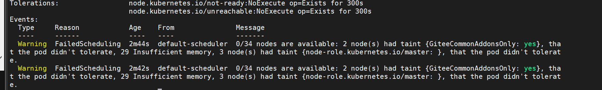

.. contents::
   :depth: 3
..

资源调度-为Pod设置计算资源
==========================

容器运行时（container
runtime）通常会提供一些机制来限制容器能够使用的计算资源的大小，例如，最多可以使用多少CPU或内存。如果超过计算资源的限制，容器就会被终止。

例如，在Docker中，通过docker
run命令中的\ **–cpu-shares、–cpu-quota、–memory**\ 等参数，可以指定容器对CPU和内存的使用限度。同样，在Pod模板中也提供了这个功能，Pod模板中的相关参数如下所示。

.. code:: yaml

   apiVersion: apps/v1
   kind: Deployment
   metadata:
     name: exampledeployment
   spec:
     replicas: 3
     selector:
       matchLabels:
         example: deploymentfornginx
     template:
       metadata:
         labels:
           example: deploymentfornginx
       spec:
         containers:
         - name: nginx
           image: nginx:1.7.9
           #资源限制和请求的设置
           resources:
             #资源限制的设置
             limits:
               #CPU的限制，单位为CPU内核数，将用于docker run --cpu-quota 参数；
               #也可以使用小数，例如0.1，它等价于表达式100m（表示100milicore）
               cpu: "600m"
               #内存限制，单位可以为MiB/GiB/MB/GB，将用于docker run --memory参数，
               memory: "500Mi"
             #资源请求的设置
             requests:
               cpu: "100m"
               memory: "100Mi"
           ports:
           - containerPort: 80

requests和limits属性从不同维度保证Pod的资源占用情况。

requests表示容器至少可获得的资源大小，也许容器实际上不会使用这么多资源，但Kubernetes在
调度时会以此为参照，保证容器能调度到至少满足这些资源的机器上。

而limits表示容器能够使用资源的最大限度，如果超过这个值，容器将被终止。

本节用两个示例演示limits和requests的功能。

``examplepodforresource.yml``

.. code:: yaml

   apiVersion: v1
   kind: Pod
   metadata:
     name: examplepodforresource
   spec:
     containers:
     - name: examplecontainerforresource
       image: vish/stress
       imagePullPolicy: IfNotPresent
       args: ['-mem-total','150Mi','-mem-alloc-size','5Mi','-mem-alloc-sleep','1s']
       resources:
         limits:
           cpu: "1"
           memory: "100Mi"
         requests:
           cpu: "200m"
           memory: "50Mi"

在本例中，我们定义了一个名为examplecontainerforresource的容器，

其资源上限分别为1个CPU内核和100MiB（1MiB=2 20 B，1MB=10 6
B）内存空间，请求的资源为200milicore CPU和50MiB内存空间。

该容器使用的镜像为vish/stress，这是一种专门用来测试容器性能和压力的工具镜像。在容器启动时，会分别传入多个参数。第一组参数为’-mem-total’,‘150Mi’，这表示将容器的内存占用量增加到150MiB，这将超过设置的最大值100MiB，但它不是一次达到150MiB的。第二组参数为’-mem-alloc-size’,‘5Mi’，这表示从0开始每次增加5MiB的内存占用。

第三组参数为’-mem-alloc-sleep’,‘1s’，这表示增加内存占用量的时间间隔为1s。结合前面的参数，表示每秒增加5MiB的内存占用量，直到占用150MiB的内存空间。

这个容器在创建初期不会有任何问题，和正常容器一样。但创建差不多20s后，追加的内存就会超过100MiB的限制。我们先应用模板，看看实际效果。

创建Pod。

.. code:: shell

   $ kubectl apply -f examplepodforresource.ym

接下来，通过\ ``$ kubectl get pod examplepodforresource``\ 命令查看Pod的运行情况，直到状态变为Running

.. code:: shell

   $ kubectl get pod examplepodforresource
   NAME                    READY   STATUS    RESTARTS   AGE
   examplepodforresource   1/1     Running   0          60s

此时如果使用\ ``$ kubectl describe pod examplepodforresource``\ 命令可以查看Pod的详细信息。在容器信息部分可以看到其资源设置情况

.. image:: ../../_static/image-20220419133647324.png

最开始容器还能正常运行，但运行超过20s以后，因为压力测试工具不断施压，当其内存占用量超过了limits属性中设置的100MiB后，容器会被自动终止。此时通过\ ``$ kubectl get pod``\ 命令查询容器状态，可以发现其状态变为OOMKilled，READY变为0。基于容器的重启策略，容器会不断重启。

.. code:: shell

   $ kubectl get pod
   NAME                                      READY   STATUS      RESTARTS   AGE
   examplepodforresource                     0/1     OOMKilled   3          90s

最后，通过\ ``$ kubectl get pod examplepodforresource -o yaml``\ 命令查看详情，可以发现容器是由于超出资源限制而被终止的

::

    kubectl get pod examplepodforresource -o yaml
   apiVersion: v1
   kind: Pod
   metadata:
     annotations:
       kubectl.kubernetes.io/last-applied-configuration: |
         {"apiVersion":"v1","kind":"Pod","metadata":{"annotations":{},"name":"examplepodforresource","namespace":"default"},"spec":{"containers":[{"args":["-mem-total","150Mi","-mem-alloc-size","5Mi","-mem-alloc-sleep","1s"],"image":"vish/stress","imagePullPolicy":"IfNotPresent","name":"examplecontainerforresource","resources":{"limits":{"cpu":"1","memory":"100Mi"},"requests":{"cpu":"200m","memory":"50Mi"}}}]}}
     creationTimestamp: "2022-04-19T05:34:27Z"
     name: examplepodforresource
     namespace: default
     resourceVersion: "82218112"
     selfLink: /api/v1/namespaces/default/pods/examplepodforresource
     uid: 674b9153-8541-4a79-8b81-e1efba17984d
     ......
       lastState:
         terminated:
           containerID: containerd://6befbf056b338e8d2947f3265e8a5e56084c7efa12953fe2e7f9848017e8ed01
           exitCode: 137
           finishedAt: "2022-04-19T05:37:21Z"
           reason: OOMKilled
           startedAt: "2022-04-19T05:37:03Z"

创建另一个示例，首先，创建examplepodforerror.yml文件

``examplepodforerror.yml``

.. code:: yaml

   apiVersion: v1
   kind: Pod
   metadata:
     name: examplepodforerror
   spec:
     containers:
     - name: examplecontainerforerror
       image: busybox
       imagePullPolicy: IfNotPresent
       command: ['sh', '-c']
       args: ['sleep 3600']
       resources:
         requests:
           memory: "500Gi"

本例中的Pod和之前相比并没有什么特别之处，但设置了它的resource.requests.memory属性，其值为500GiB（1GiB=2
30 字节，1GB=10 9
字节），目前一般计算机应该不会有这么大的内存资源。我们先应用模板，看看实际效果。

执行以下命令，创建Pod。

.. code:: shell

   $ kubectl apply -f examplepodforerror.yml

通过\ ``$ kubectl get pod examplepodforerror``\ 命令查看Pod的运行情况，可以发现它的状态一直都是Pending

.. code:: shell

   $ kubectl get pod examplepodforerror
   NAME                 READY   STATUS    RESTARTS   AGE
   examplepodforerror   0/1     Pending   0          <invalid>

接下来，通过\ ``$ kubectl describe pods examplepodforerror``\ 命令，查看Pod的详细信息，在底部的Events区域可以发现造成Pending的原因

.. code:: shell

   $ kubectl describe pods examplepodforerror

如图所示，集群中没有任何一台机器能满足该Pod的内存要求。

