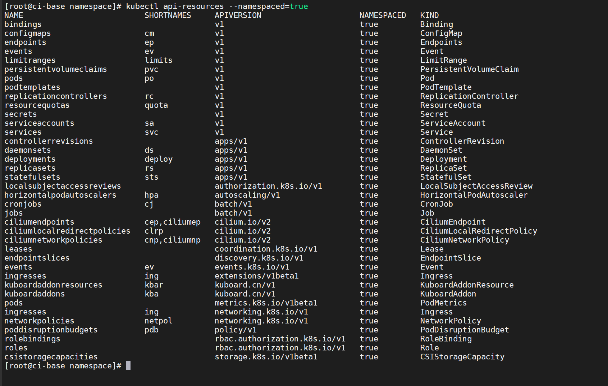

# 资源管理-命名空间

命名空间（namespace）的主要作用是对Kubernetes集群资源进行划分，这种划分并非物理划分，而是逻辑划分，用于实现多租户的资源隔离。

如果使用Kubernetes的用户很少，可以不使用命名空间。

但如果使用Kubernetes的团队或用户众多，各种资源管理起来就会比较麻烦。这时就应考虑使用命名空间来进行划分，这样集群内部
的各种资源对象就可以在不同的命名空间下进行管理。


使用命名空间划分资源


## 1.命名空间的基本操作

为了创建一个名为examplenamespace的命名空间

```shell
# 新建
$ kubectl create namespace examplenamespace

#删除
$ kubectl delete ns examplenamespace
```

通过模板文件创建命名空间的方式如下。
首先，通过命令创建`examplenamespace.yml`文件。

```yaml
apiVersion: v1
kind: Namespace
metadata:
  name: examplenamespace
```

通过模板创建命名空间

```shell
$ kubectl apply -f examplenamespace.yml
```

创建完成后，通过`kubectl get namespace`命令可以查看各个命名空间

```shell
$ kubectl get ns examplenamespace
NAME               STATUS   AGE
examplenamespace   Active   2m7s
```

除了刚刚创建的命名空间外，我们看到查询结果中还有其他几个命名空间，这些都是Kubernetes的初始命名空间。

- default：所有未指定namespace属性的对象都会分配到default命名空间中。
- kube-node-lease：主要存放各个节点上的Lease对象，用于节点的心跳检测。
- kube-system：所有由Kubernetes系统创建的资源都在这个命名空间中。
- kube-public：此命名空间下的资源可以被所有人访问（包括未认证用户）

此时可以在刚才创建的examplenamespace命名空间下创建资源。为了创建一个Pod，首先，使用以下命令创建模板文件。

`examplepodforns.yml`

```yaml
apiVersion: v1
kind: Pod
metadata:
  name: examplepodforns
  namespace: examplenamespace
  
spec:
  containers:
  - name: examplepod-container
    image: busybox
    imagePullPolicy: IfNotPresent
    command: ['sh', '-c']
    args: ['echo "Hello Kubernetes!"; sleep 3600']
```

该模板和之前的示例几乎相同，唯一的区别在于，指定了namespace属性，它指向刚刚创建的examplenamespace命名空间。

```shell
$ kubectl apply -f examplepodforns.yml
```


对于某个命名空间下的资源，所有命令（如get、describe、logs、delete等）都必须带上**--namespace={命名空间}或-n {命名空间}参数**，才能够查询。

```shell
$ kubectl get pod -n examplenamespace
NAME              READY   STATUS    RESTARTS   AGE
examplepodforns   1/1     Running   0          0s
```

大多数Kubernetes资源（例如，Pod、Service、控制器等）在命名空间中，但是命名空间资源本身并不在命名空间中，并且低级资源（例如，节点和持久存储卷等）也不在任何命名空间中。

可以使用命令查看哪些Kubernetes资源在命名空间中，哪些不在。
通过`$ kubectl api-resources --namespaced=true`命令，可以查看位于命名空间下的资源

```shell
$ kubectl api-resources --namespaced=true
```




通过`$ kubectl api-resources --namespaced=false`命令，可以查看不在命名空间下的资源

```shell
$ kubectl api-resources --namespaced=false
```


## 2.命名空间中的服务发现

命名空间和Service的DNS也有一定关系，之前章节提及过DNS服务发现的方式，其具体访问格式为

**{ServiceName}.{Namespace}.svc.{ClusterDomain}。**

之前的示例中因为没有使用命名空间，所以{Namespace}填写的都是default。

如果某个Service资源位于某个命名空间下（如刚才创建的examplenamespace命名空间），DNS将会变为

**{ServiceName}.examplenamespace.svc.{ClusterDomain}。**

通过以下命令，可以查询命名空间的详情。

```shell
$ kubectl describe namespace examplenamespace
Name:         examplenamespace
Labels:       kubernetes.io/metadata.name=examplenamespace
Annotations:  <none>
Status:       Active

No resource quota.

No LimitRange resource.
```

使用`$ kubectl describe namespace examplenamespace`命令可以看到“No resource quota”（没有资源配额）和“No resource limits”（没有资源限额）

对于某个命名空间，可以分别设置其资源配额（ResourceQuota）和限额范围（LimitRange）


## 3.命名空间的资源配额

命名空间的设计初衷是实现多租户的资源隔离。

这只是逻辑隔离，实际上所有租户都共用同一个Kubernetes集群，所以还需要规划命名空间的资源配额（ResourceQuota），以免某个命名空间滥用集群资源而影响整个Kubernetes集群。

可以通过ResourceQuota来定义资源配额，设置命名空间下能够使用的各类资源总量。

一个命名空间下最多只能存在一个ResourceQuota。


资源配额分为3种类型。

- 计算资源配额：指定可用的计算机资源总量（如总内存或CPU等）。
- 存储资源配额：指定可用的存储资源总量（如PVC总数等）。
- 对象数量配额：指定Kubernetes资源对象的可用总量（如Pod总数和Service总数等）。

资源配额模板的定义如下所示。

`template.yaml`

```yaml
apiVersion: v1
kind: ResourceQuota
metadata:
  name: string #资源配额名称
  namespace: string #所属命名空间
spec:
  hard:
    #计算资源配额
    limits.cpu: number #对于所有非终止状态的Pod，其CPU限额总量不能超过该值
    limits.memory: number #对于所有非终止状态的Pod，其内存限额总量不能超过该值
    requests.cpu: number #对于所有非终止状态的Pod，其CPU需求总量不能超过该值
    requests.memory: number #对于所有非终止状态的Pod，其内存需求总量不能超过该值
    cpu: number #等同于requests.cpu
    memory: number #等同于requests.memory
    #存储资源配额
    requests.storage: number #在所有的PVC中，存储资源的需求不能超过该值
    persistentvolumeclaims: number #允许存在的PVC数量
    {storage-class-name}.storageclass.storage.k8s.io/requests.storage: number #在所有与该storage-class-name相关的PVC中，存储资源的需求不能超过该值
    {storage-class-name}.storageclass.storage.k8s.io/persistentvolumeclaims: number #允许与该storage-class-name相关的PVC总量 对象数量配额
    configmaps: number #允许存在的ConfigMap数量
    pods: number #允许存在的非终止状态的Pod数量。如果Pod的status.phase为Failed或Succeeded那么它处于终止状态
    replicationcontrollers: number #允许存在的ReplicationController数量
    resourcequotas: number #允许存在的资源配额数量
    services: number #允许存在的Service数量
    services.loadbalancers: number #允许存在的LoadBalancer类型的Service数量
    services.nodeports: number #允许存在的NodePort类型的Service数量
    secrets: number #允许存在的Secret数量
```

为了给命名空间创建一个简单的资源配额，首先，通过命令创建模板文件。

`exampleresourcequota.yml`

```yaml
apiVersion: v1
kind: ResourceQuota
metadata:
  name: exampleresourcequota
  namespace: examplenamespace
spec:
  hard:
    pods: "2"
    services: "1"
    persistentvolumeclaims: "4"
```

接下来，运行以下命令，通过模板创建资源配额。

```shell
$ kubectl apply -f exampleresourcequota.yml
```

创建完成后，通过`$ kubectl get resourcequota -n examplenamespace`命令可以查看刚刚创建的资源配额。

```shell
$ kubectl get resourcequota -n examplenamespace
NAME                   AGE    REQUEST                                                 LIMIT
exampleresourcequota   100s   persistentvolumeclaims: 0/4, pods: 1/2, services: 0/1
```

接下来，通过`$ kubectl describe resourcequota exampleresourcequota -n examplenamespace`命令可以查看具体的资源占用
情况,因为之前已经在examplenamespace命名空间中创建了1个Pod，所以pods的Used属性为1。

```shell
$ kubectl describe resourcequota exampleresourcequota -n examplenamespace
Name:                   exampleresourcequota
Namespace:              examplenamespace
Resource                Used  Hard
--------                ----  ----
persistentvolumeclaims  0     4
pods                    1     2
services                0     1
```

如果此时再通过`$ kubectl describe namespace examplenamespace`命令查看命名空间的详细信息，可以看到原先的No resource quota提示已经变成具体的配额，和刚刚我们配置的一模一样

```shell
$ kubectl describe namespace examplenamespace
Name:         examplenamespace
Labels:       kubernetes.io/metadata.name=examplenamespace
Annotations:  <none>
Status:       Active

Resource Quotas
  Name:                   exampleresourcequota
  Resource                Used  Hard
  --------                ---   ---
  persistentvolumeclaims  0     4
  pods                    1     2
  services                0     1

No LimitRange resource.
```

此时可以尝试在该命名空间下继续创建Pod。目前Pod的使用量为1，上限为2。接下来，创建一个Deployment控制器并将其副本数设置为2，这样刚好超过上限，多出1个Pod，试试看会发生什么情况。为此，首先，通过命令创建模板文件。

`exampledeploymentforns.yaml`

```yaml
apiVersion: apps/v1
kind: Deployment
metadata:
  name: exampledeploymentforns
  namespace: examplenamespace
spec:
  replicas: 2
  selector:
    matchLabels:
      example: deploymentforns
  template:
    metadata:
      labels:
        example: deploymentforns
    spec:
      containers:
      - name: nginx
        image: nginx:1.7.9
        imagePullPolicy: IfNotPresent
        ports:
        - containerPort: 80
```

这里的Deployment示例除了指定命名空间为examplenamespace外，和之前的示例没有什么区别，其副本数设置为2。

通过模板创建Deployment控制器。

```shell
$ kubectl apply -f exampledeploymentforns.yaml
```

创建完成后，分别查看Pod创建情况，可以看到Deployment控制器只创建了一个Pod，另一个Pod无法创建，

```shell
$ kubectl get pod -n examplenamespace
$ kubectl get deploy -n examplenamespace
$ kubectl describe deploy -n examplenamespace exampledeploymentforns
```

输出Deployment控制器详情。在输出文本的下半部分可以找到失败的原因是请求的Pod数超出了配额限制

```shell
$ kubectl get deploy exampledeploymentforns -n examplenamespace -o yaml
```


此时如果将Deployment控制器的副本数量设置为1，或者删除旧的Pod，或者更改配额设置为更大的数值，则另一个Pod才会成功创建。

> 注意：如果在ResourceQuota中设置了任何一种计算机资源配额（cpu、limits.cpu、requests.cpu、memory、limits.memory和
> requests.memory属性），那么在创建Pod或控制器时，在Pod模板中也必须明确指定相关的计算机资源属性值（即容器的resources.limits.cpu、resources.limits.memory、resources.requests.cpu、resources.requests.memory属性），或者已经通过LimitRange对象设置默认值；否则，将无法创建，并在创建时将会出现图8-19所示的错误消息。另外，在使用kubectl describe resourcequota命令查询时，计算机资源配额的Used属性其实并非CPU或内存的实时使用值之和，而是在Pod模板中填写的指定值之和。


## 4.命名空间中单个资源的限额范围

通过设置资源配额，可以限定一个命名空间下使用的资源总量。但这仅是总量设置，对于单个资源没有限制，很有可能单个 Pod 或容器就会消耗完整个命名空间下资源配额所指定的CPU 或内存总量。为了避免单个资源对象消耗所有的命名空间资源，可以通过LimitRange对象来对单个资源对象的资源占用量进行限定。

通过LimitRange对象可以实现以下功能。

- 设置命名空间下单个Pod或容器的最小和最大计算资源使用量。
- 设置命名空间下单个PVC的最小和最大存储请求。
- 设置命名空间下请求（request）资源量和上限（limit）资源量的比例。
- 设置命名空间下默认的计算资源请求与上限，并在运行时自动将其注入容器中。


**如果在命名空间下对CPU或内存设置了请求与上限，那么在定义Pod资源时，必须明确在模板中指定这两个值否则，系统会拒绝创建Pod（除非在定义LimitRange 时设置了默认值）。如果在设置LimitRange之前就创建了Pod，**
**即使之后设置了LimitRange，那么对正在运行的Pod也没有影响，除非Pod重建。**


**如果在命名空间下设置了PVC请求的存储大小，那么当定义PVC时如果请求的大小不在范围内，系统也会拒绝创建PVC。**


### 4.1 设置容器的限额范围

通过设置type为Container的限额范围，可以定义每个容器中最小与最大的内存/CPU限制，以及默认的内存/CPU请求及限制。首先，通过命令创建`limitrangeforcontainer.yml`文件。

```yaml
apiVersion: v1
kind: LimitRange
metadata:
  name: limitrangeforcontainer
  namespace: examplenamespace
spec:
  limits:
  - max:
      cpu: "200m"
      memory: "300Mi"
    min:
      cpu: "100m"
      memory: "150Mi"
    default:
      cpu: "180m"
      memory: "250Mi"
    defaultRequest:
      cpu: "110m"
      memory: "160Mi"
    type: Container
```

接下来，运行以下命令，通过模板创建限额范围。

```shell
$ kubectl apply -f limitrangeforcontainer.yml
```

创建完成后，可以通过`$ kubectl get limitrange -n examplenamespace`命令查看限额范围

```shell
$ kubectl get limitrange  -n examplenamespace
NAME                     CREATED AT
limitrangeforcontainer   2022-04-19T06:52:29Z
```

也可以通过`$ kubectl describe limitrange limitrangeforcontainer -n examplenamespace`命令查看限额范围的详情，

可以看到LimitRange创建后关于容器的计算资源限额范围的详情。


从图中可以看到容器CPU及内存的Min和Max属性，这表示最小资源限制与最大资源限制。LimitRange生效之后，当创建Pod模板或填写控制器的Pod模板时，各个容器的resources.limits和resources.requests属性必须要满足指定Min/Max条件的资源限制，否则无法成功创建。本例中必须满足的条件如下所示。

- 100m≤容器的resources.requests.cpu≤容器的resources.limits.cpu≤200m
- 150MiB≤容器的resources.requests.memory≤容器的resources.limits. memory≤300MiB

defaultRequest属性和defaultLimit属性分别代表默认请求值和默认限制值。在创建Pod模板或填写控制器的Pod模板时，如果没有显式指定resources.limits和resources.requests属性，则在创建时会自动将其填充为LimitRange中的默认值。

在本例中默认值如下所示。

- 容器默认resources.limits.cpu = 180m。
- 容器默认resources.limits.memory = 250Mi。
- 容器默认resources.requests.cpu = 110m。
- 容器默认resources.requests.memory = 160Mi。


### 4.2 设置Pod的限额范围

可以设置type为Pod的限额范围，定义Pod中全部容器的内存/CPU限额总和的最小值以及最大值。首先，通过命令创建`limitrangeforpod.yml`文件。

`limitrangeforpod.yml`

```yaml
apiVersion: v1
kind: LimitRange
metadata:
  name: limitrangeforpod
  namespace: examplenamespace
spec:
  limits:
    - max:
        cpu: "1"
        memory: "600Mi"
      min:
        cpu: "100m"
        memory: "150Mi"
      type: Pod
```

运行以下命令，通过模板创建限额范围。

```shell
$ kubectl apply -f limitrangeforpod.yml
```

接下来，通过`$ kubectl describe limitrange limitrangeforpod - n examplenamespace`命令查看限额范围的详情

```shell
$ kubectl describe limitrange limitrangeforpod -n examplenamespace
Name:       limitrangeforpod
Namespace:  examplenamespace
Type        Resource  Min    Max    Default Request  Default Limit  Max Limit/Request Ratio
----        --------  ---    ---    ---------------  -------------  -----------------------
Pod         cpu       100m   1      -                -              -
Pod         memory    150Mi  600Mi  -                -              -
```

可以看到Pod的CPU及内存的Min和Max属性，这表示Pod最小与最大资源限制。LimitRange生效之后，当再次创建Pod模板或填写控制器的Pod模板时，必须使各个容器的resources.limits属性总和满足资源限制，否则无法成功创建。本例中必须满足的条件如下所示。

- 100m≤Pod模板中所有容器的resources.limits.cpu总和≤1
- 150MiB≤Pod模板中所有容器的resources.limits.memory总和≤600MiB


### 4.3 设置PVC的限额范围

可以设置type为PersistentVolumeClaim的限额范围，定义PVC的最小与最大存储量。首先，通过命令创建`limitrangeforpvc.yml`文件。

`limitrangeforpvc.yml`

```yaml
apiVersion: v1
kind: LimitRange
metadata:
  name: limitrangeforpvc
  namespace: examplenamespace
spec:
  limits:
  - type: PersistentVolumeClaim
    max:
      storage: 1Gi
    min:
      storage: 200Mi
```

运行以下命令，通过模板创建限额范围。

```shell
$ kubectl apply -f limitrangeforpvc.yml
```

接下来，通过`$ kubectl describe limitrange limitrangeforpvc -n examplenamespace`命令查看限额范围的详情。

```shell
$ kubectl describe limitrange limitrangeforpvc -n examplenamespace
Name:                  limitrangeforpvc
Namespace:             examplenamespace
Type                   Resource  Min    Max  Default Request  Default Limit  Max Limit/Request Ratio
----                   --------  ---    ---  ---------------  -------------  -----------------------
PersistentVolumeClaim  storage   200Mi  1Gi  -                -              -
```

可以看到PVC存储资源的Min和Max属性。LimitRange生效之后，当再次创建PVC模板或填写StatefulSet的存储卷申请模板（volumeClaimTemplate）时，必须使PVC的resources.requests.storage属性满足资源限额范围，否则无法成功创建。

本例中必须满足的条件如下所示。

- 200MiB≤PVC模板中的resources.requests.storage属性≤1GiB


### 4.4 设置Pod或容器的比例限额范围

可以对Pod或容器设置请求资源量和上限资源量的比值。对于Pod来说，这是Pod模板中所有容器的resources.limits.cpu或memory的总和与所有容器的resources. requests.cpu或memory的总和之比；

而对于容器来说，这是单个容器的resources. limits.cpu或memory与自身的resources.requests.cpu或memory之比。

这里我们以Pod中的memory限额范围为例进行介绍。

`limitrangeforratiopod.yml`

```yaml
apiVersion: v1
kind: LimitRange
metadata:
  name: limitrangeforratiopod
  namespace: examplenamespace
spec:
  limits:
  - maxLimitRequestRatio:
      memory: "2"
    type: Pod
```

运行以下命令，通过模板创建限额范围。

```shell
$ kubectl apply -f limitrangeforratiopod.yml
```

接下来，通过`$ kubectl describe limitrange limitrangeforratiopod -n examplenamespace`命令查看限额范围的详情。

```shell
$ kubectl describe limitrange limitrangeforratiopod -n examplenamespace
Name:       limitrangeforratiopod
Namespace:  examplenamespace
Type        Resource  Min  Max  Default Request  Default Limit  Max Limit/Request Ratio
----        --------  ---  ---  ---------------  -------------  -----------------------
Pod         memory    -    -    -                -              2
```

可以看到LimitRange创建后关于Pod存储资源限额范围的详情。

可以看到Pod内存资源的Max Limit/Request Ratio属性。LimitRange生效之后，当再次创建Pod模板或填写控制器的Pod模板时，必须使Pod的resources.requests属性和resources.limit属性满足比例限制，否则无法成功创建。

本例中必须满足的条件如下所示。

- Pod 模板中所有容器的resources.limits.memory总和 = Pod模板中所有容器的resources.requests.memory总和 × 2

可以通过查看命名空间的详情统一查看创建的多个限额范围。本例中的具体命令为`kubectl describe namespace examplenamespace。`可以看到原先的“No resource limits”提示已经变成具体的限额范围，这和刚刚我们配置的一模一样，

```shell
$ kubectl describe namespace examplenamespace
Name:         examplenamespace
Labels:       kubernetes.io/metadata.name=examplenamespace
Annotations:  <none>
Status:       Active

Resource Quotas
  Name:                   exampleresourcequota
  Resource                Used  Hard
  --------                ---   ---
  persistentvolumeclaims  0     4
  pods                    2     2
  services                0     1

Resource Limits
 Type                   Resource  Min    Max    Default Request  Default Limit  Max Limit/Request Ratio
 ----                   --------  ---    ---    ---------------  -------------  -----------------------
 Container              memory    150Mi  300Mi  160Mi            250Mi          -
 Container              cpu       100m   200m   110m             180m           -
 Pod                    memory    150Mi  600Mi  -                -              -
 Pod                    cpu       100m   1      -                -              -
 PersistentVolumeClaim  storage   200Mi  1Gi    -                -              -
 Pod                    memory    -      -      -                -              2
```


## 5. Kubernetes 多租户：资源配额

> 参考文献
>
> Kubernetes 多租户：多租户介绍
>
> https://www.cnblogs.com/sanduzxcvbnm/p/16329200.html
>
> 
>
> Kubernetes 多租户：资源配额
>
> https://www.cnblogs.com/sanduzxcvbnm/p/16329217.html

