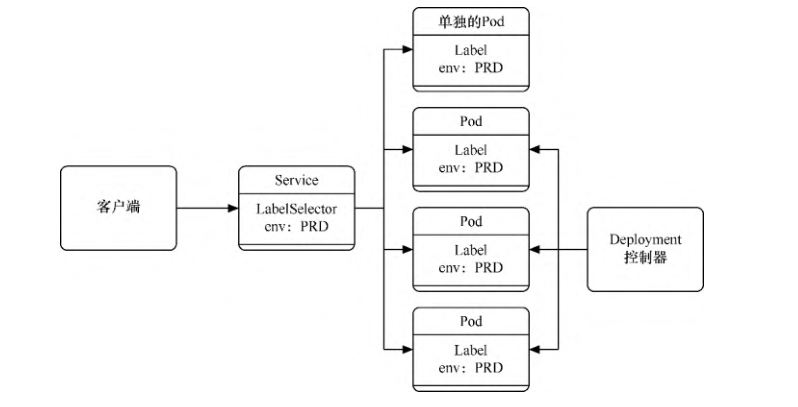

# 资源管理-标签、选择器及注解

上面我们讨论了命名空间，它主要用于实现多租户的资源隔离。

在同一个命名空间下，还可以对资源进行更细粒度的划分，对各个资源的身份进行标识（例如，可以区分各个应用的版本、层级、环境等），可以使用标签（label）来区分这些资源。


通过标签选择器（selector），我们可以快速查找具备指定标签值的资源，或者将某些高层Kubernetes资源通过标签条件关联到低层资源。


注解（annotation）也是一种类似标签的机制。相比标签，注解更自由，可以包含少量结构化数据。一般来说，注解只是向对象中添加更多信息的一种方式，并没有实际功能。


## 1. 标签

Kubernetes中的标签是一种语义化标记标签，可以附加到Kubernetes对象上，并对它们进行标记或划分。如果要针对不同的实例进行管理或路由，就可以用标签来进行选择。

标签的形式是键值对，每个资源对象都可以拥有多个标签，但每个资源对象对于每个键都只能拥有一个值。

标签的使用非常灵活，可以使用开发阶段、可访问性级别、应用程序版本等标准对各个对象进行分类。

对于每一种资源对象，都可以设置标签。方法是在模板中的metadata属性中设置，如下所示。

```
metadata:
  labels: #标签列表，可定义多个标签的键/值对
    key1: value1
    key2: value2
    ......
    keyN: valueN
```

对于已有资源，可以通过以下命令为其创建或删除标签。

```
$ kubectl label {资源类型} {资源名称} {标签名}={标签值}
$ kubectl label {资源类型} {资源名称} {标签名}-
```

以下是一些标签的应用场景。

- 根据发布版本划分为release: beta、release: stable、release:canary。
- 根据环境划分为 environment: dev、environment: qa、environment: production。
- 根据应用层级划分为tier: frontend、tier: backend、tier: cache。
- 根据用户群划分为partition: customerA、partition: customerB。
- 根据维护频率划分为track: daily、track: weekly。

为了定义一个带标签的Pod，首先，通过以下命令创建`examplepodforlabel.yml`文件。

`examplepodforlabel.yml`

```yaml
apiVersion: v1
kind: Pod
metadata:
  name: examplepodforlabel
  labels:
    environment: production
    app: nginx
    release: stable
    tire: backend
spec:
  containers:
    - name: nginx
      image: nginx:1.7.9
      ports:
      - containerPort: 80
```

运行以下命令，通过模板创建Pod。

```shell
$ kubectl apply -f examplepodforlabel.yml
```

接下来，通过`$ kubectl describe pod examplepodforlabel`命令查看Pod的详细信息，可以发现Pod已成功指定标签

```shell
$ kubectl describe pod examplepodforlabel
Name:         examplepodforlabel
Namespace:    default
Priority:     0
Node:         gitee-k8s-w17/192.168.1.126
Start Time:   Tue, 19 Apr 2022 15:16:23 +0800
Labels:       app=nginx
              environment=production
              release=stable
              tire=backend
......
```


## 2. 选择器

通过标签选择器，可以快速查找具备指定标签值的资源，如通过命令查找指定资源。在查询时应带上“-l”参数，后面带上选择器表达式。

在查询时可以使用=（或==）、!=操作符，使用逗号可分隔并连接多个表达式以进行匹配。

例如，**可以使用以下命令查询environment标签不为dev、tire标签为backend的所有Pod。**

```shell
$ kubectl get pods -l environment!=dev,tire=backend
NAME                 READY   STATUS    RESTARTS   AGE
examplepodforlabel   1/1     Running   0          89s
```

还可以使用in、notin等方式进行查询。在使用这种方式时需要将选择器表达式放置在单引号之间，使用逗号分隔并连接多个表达式进行匹配。例如，**可以使用以下命令查询environment标签的取值在production和dev之间且tire标签取值不在frontend中的所有Pod。**

```shell
$ kubectl get pods -l 'environment in (production,dev),tire notin (frontend)'
NAME                 READY   STATUS    RESTARTS   AGE
examplepodforlabel   1/1     Running   0          4m3s
```

还可以使用!{label}、{label}等方式进行查询。如果使用!{label}，需要将选择器表达式放置在单引号之间，使用逗号分隔并连接多个表达式进行匹配。例如，**可以使用以下命令查询带environment标签（任何值皆可）但不带deadline标签的所有Pod。**

```shell
$ kubectl get pods -l 'environment,!deadline'
NAME                 READY   STATUS    RESTARTS   AGE
examplepodforlabel   1/1     Running   0          3m22s
```

如果查询时标签与资源不匹配，则查询结果为空

```shell
$ kubectl get pods -l a=b,b=c,'evn in (abc)'
No resources found in default namespace.
```

标签选择器也可以将某些高层Kubernetes资源通过标签条件关联到低层资源。接下来分别介绍这些场景的用法。

每种基于控制器的对象都可以使用标签来识别需要操作的Pod。Job、Deployment及DaemonSet等控制器可以在控制器模板的spec属性中指定选择器，以查找符合条件的Pod。示例如下。

```
selector:
  matchLabels:
	app: jekins
	release: stable
  matchExpressions:
    - {key: tier, operator: In, values: [backend]}
    - {key: environment, operator: NotIn, values: [dev,qa]}
    - {key: track, operator: Exists}
    - {key: deadline, operator: DoesNotExist}
```

配置上述选择器的控制器将会选取的Pod满足以下条件。

app标签为jekins，release标签为stable，tier标签在backend中取值，environment标签取值不介于dev和qa，存在track标签以及不存在deadline标签。

除了控制器外，Service还必须使用标签选择器才能确定应该将请求路由到哪些后端Pod。示例如下。

```
kind: Service
apiVersion: v1
metadata:
  name: servicedemo
spec:
  selector:
    env: PRD
  ports:
....
```

如图所示，这个Service将会定位所有标签满足evn=PRD的Pod，将其添加到自己的Endpoint列表中，无论是单个Pod还是由控制器托管的Pod。

Service通过标签匹配Endpoint



在创建PVC时，除了可以用storageClassName以外，还可以用标签来匹配对应的PV。示例如下。

```yaml
apiVersion: v1
kind: PersistentVolume
metadata:
  name: testPV
  labels:
    pvnumber: pv001
spec:
  capacity:
    storage: 1Gi
  accessModes:
    - ReadWriteOnce
  storageClassName: testing

---
apiVersion: v1
kind: PersistentVolumeClaim
metadata:
  name: testPVC
spec:
  accessModes:
    - ReadWriteOnce
  resources:
    requests:
      storage: 1Gi
  storageClassName: testing
  selector:
    matchLabels:
      pvnumber: pv001
```

在创建PVC时会自动寻找storageClassName为testing且pvnumber标签为pv001的PV并进行绑定。


## 3. 注解

注解也是一种类似标签的机制。相对于标签，注解更自由，可以包含少量结构化数据。注解不用于识别和选择对象，只是向对象中添加更多信息的一种方式，**只起说明作用并没有实际功能。**

同标签一样，对于每一种资源对象都可以设置注解，在模板的metadata属性中设置即可。

为了定义一个带注解的Pod，首先，通过命令创建examplepodforannotation.yml文件。

`examplepodforannotation.yml`

```yaml
apiVersion: v1
kind: Pod
metadata:
  name: examplepodforannotation
  annotations:
    devteam: 'Tiger Team'
    phone: '999-888-77777'
    howtouse: 'plz open this app and click....'
    Gitrepository: 'https://github.com/xxxxx/project.git'
    email: 'tigerteam@company.com'
spec:
  containers:
  - name: nginx
    image: nginx:1.7.9
    ports:
    - containerPort: 80
```

运行以下命令，通过模板创建Pod。

```shell
$ kubectl apply -f examplepodforannotation.yml
```

接下来，通过`$ kubectl describe pod examplepodforannotation`命令查看Pod的详细信息，可以发现Pod已成功指定注解

```shell
$ kubectl describe pod examplepodforannotation
Name:         examplepodforannotation
Namespace:    default
Priority:     0
Node:         gitee-k8s-w02/192.168.1.36
Start Time:   Tue, 19 Apr 2022 15:49:11 +0800
Labels:       <none>
Annotations:  Gitrepository: https://github.com/xxxxx/project.git
              devteam: Tiger Team
              email: tigerteam@company.com
              howtouse: plz open this app and click....
              phone: 999-888-77777
Status:       Running
```

