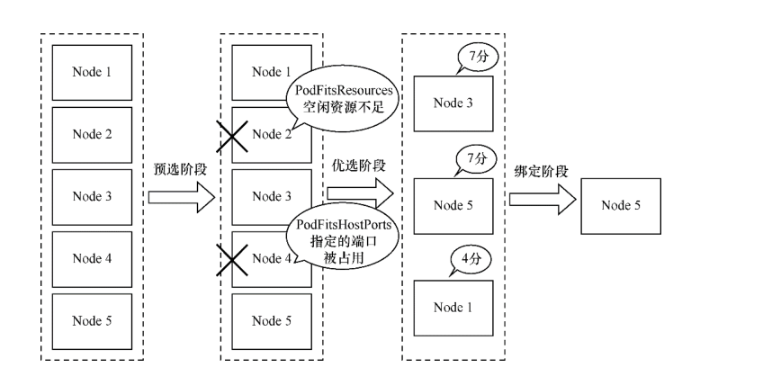
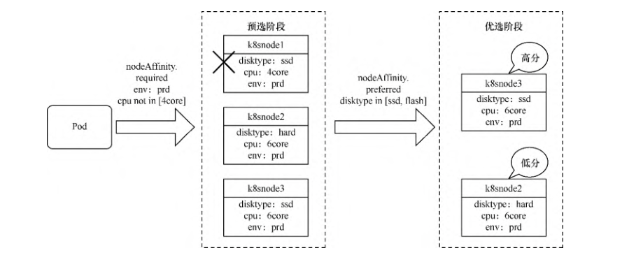
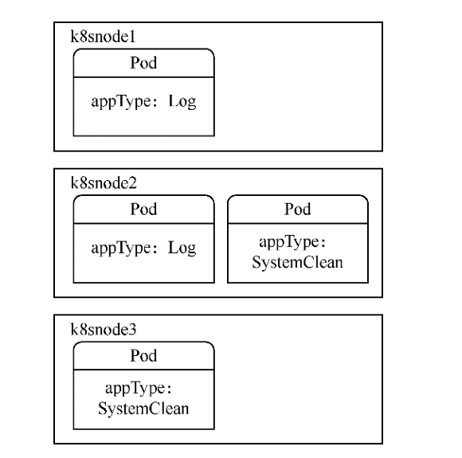
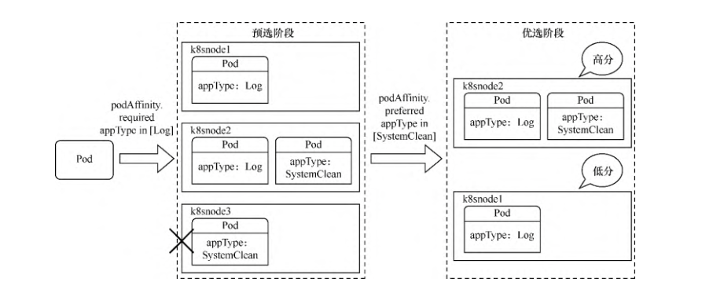
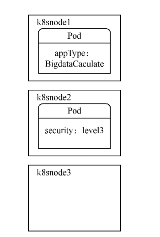
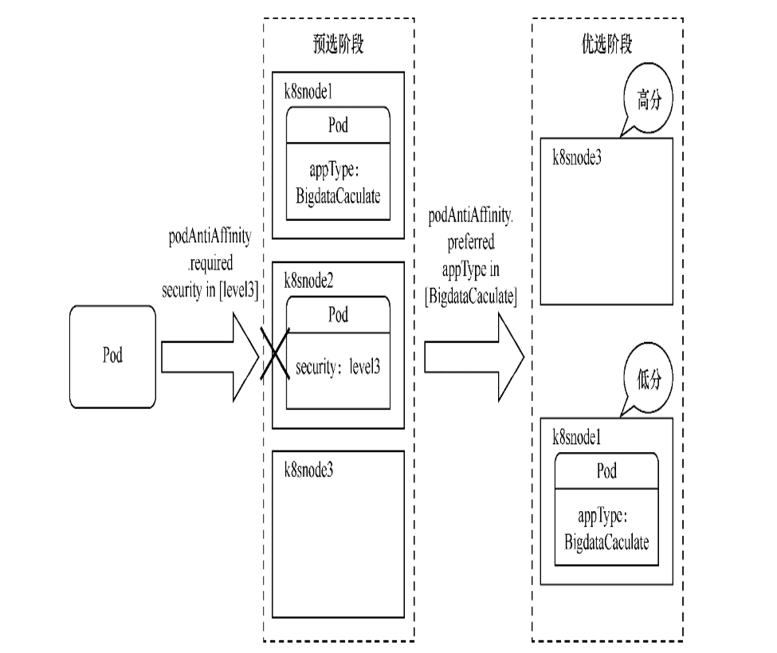
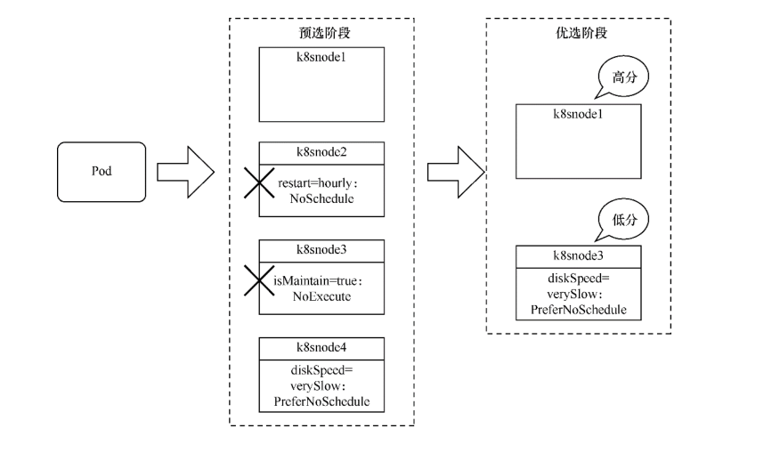
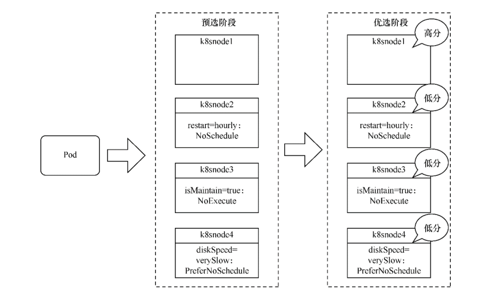

# 资源调度-Pod调度策略详解

Pod的调度是由kube-scheduler组件来控制的，我们可以称该组件为调度器。

所有Pod都需要经过调度器才能分配到具体的Node上。

调度器用于监听要求创建或还未分配Node的Pod资源，为Pod自动分配相应的Node。

kube-scheduler在调度时会考虑各种因素，包括资源需求、硬件/软件/指定限制条件、内部负载情况等。

kube-scheduler所执行的各项操作是基于API Server的，如调度器会通过API Server的Watch接口监听新建Pod，搜索所有满足Pod需求的Node列表，再执行Pod调度逻辑，找到适合运行这个Pod的最佳Node。

调度成功后会将Pod绑定到目标Node上。

如果没有找到合适的Node，Pod将保持Pending状态，不会分配到任何节点上，直到集群情况发生变化且满足条件为止。


## 1. 调度过程

kube-scheduler将按以下3个步骤进行调度。

（1）预选——在所有节点中，调度器用一组规则过滤掉不符合要求的节点。例如，Pod指定了resource.requests.cpu或memory，因此可用资源比Pod需求资源量少的主机会被筛除。

（2）优选——在选择出符合要求的候选节点后，用一组规则对这些节点的优先级打分。比如，优先把一个Deployment控制器Pod分配到不同的主机上，优先使用负载最低的主机等。

（3）绑定——选择打分最高的节点执行绑定操作。如果最高得分中有好几个节点，则会从中随机选择一个节点。


调度过程



### 1. 预选阶段

预选阶段的默认调度策略如下，主要分为3类。

- 资源性预选策略。

```
- PodFitsResources：检查主机上的空闲资源是否满足Pod中容器的resource. requests.cpu或memory。
- PodFitsHostPorts：检查Pod中容器的hostPort属性所指定的端口是否已被节点上其他容器或服务占用。
- CheckNodeMemoryPressure：判断节点是否已经进入内存压力状态。如果进入，则只允许调度内存标记为0的Pod。
- CheckNodePIDPressure：检查节点是否存在进程ID资源紧缺情况。
- CheckNodeDiskPressure：判断节点是否已进入存储压力状态（文件系统磁盘已满或接近满）。
- CheckNodeCondition：检查节点网络是否可用，或者kubelet组件是否就绪。
```

- 指定性预选策略。这种预选方式更多是用户主动选择的，需要用户来指定与设置。稍后将详细讲解这种预选方式。

```
- PodFitsHost：如果Pod设置了 spec.nodeName，则只有名字相匹配的节点才能运行Pod。


- PodMatchNodeSelector：如果Pod设置了spec.nodeSelector，则只有标签与之匹配的节点才能运行Pod。如果Pod设置了
                  spec.affinity.nodeAffinity. requiredDuringScheduling属性，检查是否与节点的亲和性要求相匹配。

- MatchInterPodAffinity：如果Pod设置了spec.affinity.podAffinity. requiredDuringScheduling或
         spec.affinity.podAntiAffinity. requiredDuringScheduling属性，检查是否与Pod的亲和性/反亲和性要求相匹配。

- PodToleratesNodeTaints：如果Pod通过spec.tolerations属性设置了容忍度（tolerate），且其容忍度的effect属性为				  NoSchedule或NoExecute，则检查Pod是否能容忍节点上的污点（taint）。
```

- 存储卷预选策略。

```
- CheckVolumeBinding：检查Pod是否能适配到它所请求的存储卷，该规则对已绑定或未绑定PV的PVC都起作用。

- NoDiskConflict：检查Pod所需的卷是否和节点已存在的卷冲突。如果这个主机已经挂载了卷，同样使用这个卷的其他Pod不能调度到这个 			主机上，仅限于GCE PD、AWS EBS、Ceph RBD以及iSCSI。

- NoVolumeZoneConflict：在给定区域限制前提下，检查在此主机上部署的 Pod 是否存在卷冲突（前提是存储卷设有区域调度约束）。
         MaxCSI/MaxEBS/MaxGCEPD/MaxAzureDisk/MaxCinderVolumeCount：检查需要挂载的相关存储卷是否已超过配置限制。
```


### 2. 优选阶段

优选阶段的默认调度策略主要分4类。

- 资源性优选策略。

```
LeastRequestedPriority：计算Pod需要的CPU和内存在当前节点可用资
                        源上的百分比。具有最小百分比的节点最优，根据公式cpu((capacity–
                        sum(requested))*10/capacity)+memory((capacity–
                        sum(requested))* 10/capacity)/2计算得分。

BalancedResourceAllocation：该调度策略出于平衡度考虑，避免出
                            现CPU、内存消耗不均匀的情况。优先选择在部署Pod后各项资源更均衡的机
                            器。得分计算公式为10 –
                            abs(totalCpu/cpuNodeCapacity−totalMemory/memoryNodeCapacity)*10。
                           

ResourceLimitsPriority：优先选择满足Pod中容器的resource.limits.cpu或memory的节点。
```


- 容灾性优选策略。

```
SelectorSpreadPriority：为了更好地容灾，优先减少节点上属于同一
                        个Service或控制器的Pod数量。同一个Service或控制器的Pod数量越少，得分越高。
                        
ImageLocalityPriority：尽量将使用大镜像的容器调度到已经下拉了该镜像的节点上。默认未启用该策略。若不存在所需镜像，返回0分；						若存在镜像，镜像越大，得分越高。 
```

- 指定性优选策略。这种优选方式更多是用户主动选择的，需要用户进行指定与设置。稍后将详细讲解这种优选方式。

```
NodeAffinityPriority：如果Pod设置了
                    spec.affinity.nodeAffinity. preferredDuringScheduling属
                    性，优先选择最大限度满足该亲和性条件的节点。
                    
                    
InterPodAffinityPriority：如果Pod设置了
                        spec.affinity.podAffinity. preferredDuringScheduling或
                        spec.affinity.podAntiAffinity.
                        preferredDuringScheduling属性，优先选择最大限度满足该亲和性/
                        反亲和性条件的节点。
                        
TaintTolerationPriority：如果Pod通过spec.tolerations属性设
                        置了容忍度，且其容忍度的effect属性为PreferNoSchedule，则优先选
                        择Pod匹配污点最少的节点。污点配对成功的项越多，得分越低。
```

- 特殊优选策略（通常只用于测试或特殊场景）

```
NodePreferAvoidPodsPriority：如果设置了节点的注解，
                        scheduler.alpha. Kubernetes. io/preferAvoidPods =
                        "..."，则由 ReplicationController（以及基于它的Deployment控制器）
                        控制的Pod在这个节点上忽视所有其他优选策略，该节点拥有所有节点中最低的调度优先级。
                        
                        
MostRequestedPriority：在使用率最高的主机节点上优先调度Pod。一般用在缩减集群时，通过这种方式可以腾出空闲机器。默认未启用该						策略。EqualPriorityMap：将所有节点设置为相同的优先级。默认未启用该策略。
```

Kubernetes提供了调度策略的定义，可以在kube-scheduler启动参数中添加--policy- config-fileAaaaaaaaaaAAzaz来指定要运用的调度配置文件。配置文件的格式如下所示。

```
"kind" : "Policy",
"apiVersion" : "v1",
"predicates" : [
    {"name" : "PodFitsResources"},
    {"name" : "PodFitsHostPorts"},
    {"name" : "CheckNodeMemoryPressure"},
    {"name" : "NoDiskConflict"},
    {"name" : "PodFitsHost"},
    ......
],
"priorities" : [
    {"name" : "LeastRequestedPriority", "weight" : 1},
    {"name" : "SelectorSpreadPriority", "weight" : 1},
    {"name" : "NodeAffinityPriority", "weight" : 1},
    {"name" : "NodePreferAvoidPodsPriority", "weight" : 1}
    ......
]
}
```

Kubernetes非常灵活，还可以自己定义新的预选和优选策略并添加到原有配置中，甚至可以重新编写自定义的调度器，替代默认调度器或与默认调度器共同使用。之前介绍各个调度策略时，提到了指定性预选和优选策略。这些方式更多是用户主动选择的，需要用户指定与设置。


## 2. 节点选择调度

在某些时候，可能需要指定将Pod部署在某台Node上。此时就可以使用spec.nodeName直接指定Pod需要调度到的具体机器（通过PodFitsHost预选策略）。例如，以下Pod模板。

`templateNodeschudeing.yml`

```yaml
apiVersion: v1
kind: Pod
metadata:
  name: examplepodforhostname
spec:
  containers:
  - name: examplepod-container
    image: busybox
    imagePullPolicy: IfNotPresent
    command: ['sh', '-c']
    args: ['echo "Hello Kubernetes!"; sleep 3600']
  nodeName: gitee-k8s-w29
```

应用模板后，Pod将直接调度到gitee-k8s-w29上

```shell
$ kubectl apply -f templateNodeschudeing.yml
$ kubectl get pod -o wide
NAME                    READY   STATUS              RESTARTS   AGE         IP       NODE            NOMINATED NODE   READINESS GATES
examplepodforhostname   0/1     ContainerCreating   0          <invalid>   <none>   gitee-k8s-w29   <none>           <none>
```


## 3. 节点亲和性调度

点亲和性调度表示会根据节点的标签挑选合适的节点。
由于节点亲和性调度策略依赖于节点的标签，因此首先需要为节点设置标签。


### 3.1 为节点设置标签

要给各个节点设置标签，命令如下

```shell
$ kubectl label nodes {node名称} {标签名}={标签值}
```

例如以下命令。

```shell
$ kubectl label nodes gitee-k8s-w29 disktype=ssd
```

使用以下命令可以删除定义的标签。

```shell
$ kubectl label nodes gitee-k8s-w29 disktype-
```

设置完成后可以通过`$ kubectl describe node gitee-k8s-w29`命令查看标签配置情况

```shell
$ kubectl describe node gitee-k8s-w29
Name:               gitee-k8s-w29
Roles:              <none>
Labels:             beta.kubernetes.io/arch=amd64
                    beta.kubernetes.io/os=linux
                    disktype=ssd
                    kubernetes.io/arch=amd64
                    kubernetes.io/hostname=gitee-k8s-w29
                    kubernetes.io/os=linux
```

```shell
# 设置标签
$ kubectl label node gitee-k8s-w02 monitor=prometheus
node/gitee-k8s-w02 labeled
# 带有prometheus标识符的标签
$ kubectl label nodes gitee-k8s-w02 node-role.kubernetes.io/prometheus="true"


# 删除标签
$ kubectl label nodes gitee-k8s-w02 monitor-
node/gitee-k8s-w02 labeled
# 带有prometheus标识符的标签
$ kubectl label nodes gitee-k8s-w02 node-role.kubernetes.io/prometheus-


# 修改一个label的值，需要加上–overwrite参数：
$ kubectl label nodes k8s-test01 gpu=false --overwrite


# 查看所有的lables信息
$ kubectl get nodes --show-labels

# 或者
$ kubectl describe nodes k8s-test01
```


除了自己定义的标签之外，Kubernetes还会为每个节点自动生成系统级标签。

- Kubernetes.io/hostname：机器名称，例如，gitee-k8s-w29。
- Kubernetes.io/os：系统名称，例如，Linux/Windows。
- Kubernetes.io/arch：架构名称，例如，amd64。

只有使用公有云厂商自家的Kubernetes时才会有以下标签，私有Kubernetes集群没有这些标签。

- failure-domain.beta.Kubernetes.io/region：地域名称。
- failure-domain.beta.Kubernetes.io/zone：地域下的区域名称。
- beta.Kubernetes.io/instance-type：使用的cloudprovider名称。


### 3.2 亲和性调度

在某些时候，可能需要将Pod调度到指定类型的节点中。

通过spec.nodeSelector或spec.affinity.nodeAffinity.requiredDuringScheduling可以将Pod调度
到拥有指定标签的节点上（通过PodMatchNodeSelector预选策略），这种方式属于硬亲和性调度，是强制性的，节点不允许调度到不符合条件的机器上。

为了看看如何通过spec.nodeSelector将Pod调度到有指定标签的节点上，首先，创建以下模板。

```shell
$ kubectl label nodes gitee-k8s-w29 disktype=ssd
$ kubectl label nodes gitee-k8s-w29 env=prd
```


`example-scheduingv1.yml`

```yaml
apiVersion: v1
kind: Pod
metadata:
  name: examplefornodeselector
spec:
  containers:
  - name: nginx
    image: nginx
    imagePullPolicy: IfNotPresent
  nodeSelector:
    disktype: ssd
    env: prd
```


```bash
$ kubectl apply -f example-scheduingv1.yml
$ kubectl get pod -o wide
NAME                     READY   STATUS    RESTARTS   AGE   IP            NODE            NOMINATED NODE   READINESS GATES
examplefornodeselector   1/1     Running   0          93s   10.0.24.101   gitee-k8s-w29   <none>           <none>
```

除了spec.nodeSelector之外，还可以通过spec.affinity.nodeAffinity.requiredDuringScheduling 将 Pod 调度到有指定标签的节点上。它们的主要区别在于，spec.affinity.nodeAffinity.requiredDuringScheduling可以设置更复杂的表达式。

例如，之前提到的In、NotIn、Exists、DoesNotExist等属性。

requiredDuringScheduling有两种用法，

一种是requiredDuringScheduling RequiredDuringExecution，

另一种是requiredDuringSchedulingIgnored DuringExecution。

两者都可以将Pod调度到存在指定标签的节点上，但区别在于，前者Pod调度成功运行后，如果节点标
签发生变化而不再满足条件，Pod将会被驱逐出节点，而后者仍会在节点上运行。

还可以通过spec.affinity.nodeAffinity.preferredDuringScheduling属性来指定节点标签，优先选择最大限度满足该亲和性条件的节点（通过NodeAffinityPriority优选策略）。这种方式属于软亲和性调度，是非强制性的。节点根据优先级的得分情况可能会也可能不会调度到不符合条件的机器上。

为了创建有亲和性条件的Pod，首先，创建以下模板。

`examplefornodeaffinity.yml`

```yaml
apiVersion: v1
kind: Pod
metadata:
  name: examplefornodeaffinity
spec:
  containers:
  - name: nginx
    image: nginx
    imagePullPolicy: IfNotPresent
  affinity:
    nodeAffinity:
      requiredDuringSchedulingIgnoredDuringExecution:
        nodeSelectorTerms:
        - matchExpressions:
          - {key: env, operator: In, values: [prd]}
          - {key: cpu, operator: NotIn, values: [4core]}
      preferredDuringSchedulingIgnoredDuringExecution:
      - weight: 1
        preference:
          matchExpressions:
          - {key: disktype, operator: In, values: [ssd,flash]}
```

这里我们**通过nodeAffinity.requiredDuringSchedulingIgnoredDuringExecution设置了硬亲和性条件，寻找env标签取值在prd内，cpu标签取值不在4core内的节点。**

**然后通过nodeAffinity.preferredDuringSchedulingIgnoredDuringExecution设置软亲和性条件，优先寻找disktype在ssd/flash内的节点。**

其中，weight字段表示相对于其他软亲和性条件的优先级比值，取值范围为 1～100，因为目前我们只
设置了一个软亲和性条件，所以填写任意值均可。

应用该模板后，其调度过程将如图所示。k8snode1 的标签由于不符合required DuringScheduling条件，在预选阶段就会被筛除。然后对k8snode2和k8snode3进行优先级选择，根据preferredDuringScheduling的设置，k8snode3满足这个条件，因此将获得最高优先级，Pod调度到k8snode3上的概率更大。


调度过程




## 4. Pod亲和性与反亲和性调度

### 4.1 Pod亲和性调度

**有些时候，需要将某些Pod与正在运行的已具有某些特质的Pod调度到一起，因此就需要使用Pod亲和性调度方式。**

通过spec.affinity.podAffinity.requiredDuringScheduling可将Pod调度到带有指定标签的Pod节点上（通过MatchInterPodAffinity预选策略）。

requiredDuring Scheduling有两种用法

- requiredDuringSchedulingRequiredDuringExecution，

- requiredDuringSchedulingIgnoredDuringExecution。

两者都可以将Pod调度到存在指定标签的Pod节点上，区别在于，前者Pod调度成功运行后，如果节点上已
有Pod的标签发生变化且不再满足条件，Pod将会被驱逐出节点，而后者仍会在节点上运行。


另外，还可以通过spec.affinity.podAffinity.preferredDuringScheduling属性来指定节
点上 Pod 的标签，优先选择最大限度满足该亲和性条件的节点（通过 InterPodAffinityPriority优选策略）。这种方式属于软亲和性调度，是非强制性的。

节点根据优先级得分情况，可能会也可能不会调度到不符合条件的机器上。

假设现在各个机器上Pod的标签情况如图所示。appType: Log 表示它是一个收集系统日志的应用，appType: SystemClean表示它是一个定期清理系统垃圾的应用。

各个机器上的Pod标签



现在我们需要创建一个Pod，如果它会和系统交互并产生影响，就必须和能收集系统日志的Pod部署到一起。因为读Pod也会生成一定数量的系统垃圾，所以需要优先和能定期清理垃圾的Pod部署在一起。

为了创建具有Pod亲和性条件的Pod，创建以下模板。

`exampleforpodaffinity.yml`

```yaml
apiVersion: v1
kind: Pod
metadata:
  name: exampleforpodaffinity
spec:
  containers:
  - name: nginx
    image: nginx
    imagePullPolicy: IfNotPresent
  affinity:
  	# pod亲和性
    podAffinity:
      # 硬亲和性条件
      requiredDuringSchedulingIgnoredDuringExecution:
      - labelSelector:
          matchExpressions:
            - {key: appType, operator: In, values: [Log]}
        topologyKey: 'Kubernetes.io/hostname'
      # 软亲和性条件
      preferredDuringSchedulingIgnoredDuringExecution:
      - weight: 1
        podAffinityTerm:
          labelSelector:
            matchExpressions:
              - {key: appType, operator: In, values: [SystemClean]}
          topologyKey: 'Kubernetes.io/hostname'
```

这里通过podAffinity.requiredDuringSchedulingIgnoredDuringExecution设置了硬亲和性条件，寻找appType标签取值在Log内的Pod。

然后通过nodeAffinity. preferredDuringSchedulingIgnoredDuringExecution设置了软亲和性条件，优先寻找appType在SystemClean内的Pod。

其中，weight字段表示相对于其他软亲和性条件的优先级比例，取值范围为1～100。因为目前我们只设置了一个软亲和性条件，所以填写任意值均可。


值得注意的是，对于Pod亲和性，无论是硬亲和性还是软亲和性都设置了topologyKey属性，把该属性设置为节点的标签名称。

如果满足Pod亲和性条件，则将Pod调度到和已有 Pod 的所在节点拥有相同节点标签的机器上。

这里使用了系统标签Kubernetes.io/ hostname（主机名称），它表示如果满足亲和性条件，则会
将Pod调度到和已有Pod所在节点的Kubernetes.io/hostname标签值相同的节点上。

换句话说，会将该Pod调度到同一台机器上。

也可以将topologyKey设置为之前示例中使用的disktype节点标签等，如果满足亲和性条件，就会将Pod调度到与
disktype一致的节点上，但这些节点也可能有多个。

应用该模板后，其调度过程将如下图 所示。

k8snode3 的标签由于不符合required DuringScheduling条件，因此在预选阶段就会被筛除。

然后对k8snode1和k8snode2进行优先级选择，根据preferredDuringScheduling的设置，k8snode2满足这个条件，因此将获得最高优先级，Pod调度到k8snode2上的概率更大。


调度过程




### 4.2 Pod反亲和性调度

当不能将某些Pod与正在运行的已具有某些特质的Pod调度到一起时，就需要使用Pod反亲和性调度方式。

Pod反亲和性调度和Pod亲和性调度的作用恰恰相反。

Pod反亲和性使用podAntiAffinity属性来定义，而在podAntiAffinity内部，其子属性定义方式和podAffinity一模一样。

假设现在各个机器上Pod的标签情况如图所示。

security: level3表示它是一个安全级别非常高的应用，appType: BigdataCaculate表示它是大数据计
算应用，可能会随时消耗全部的CPU或内存资源。

各个机器上的Pod标签




现在我们需要创建一个Pod。假设由于公司政策，其他任何Pod都不允许和安全等级高于3的应用部署到一起。

而因为大数据应用太消耗节点的CPU或内存资源，所以不推荐与它们部署在一起。

为了创建具有Pod反亲和性条件的Pod，创建以下模板。

`exampleforpodantiaffinity.yml`

```yaml
apiVersion: v1
kind: Pod
metadata:
  name: exampleforpodantiaffinity
spec:
  containers:
  - name: nginx
    image: nginx
    imagePullPolicy: IfNotPresent
  affinity:
  	# pod反亲和性
    podAntiAffinity:
      # 硬反亲和性条件
      requiredDuringSchedulingIgnoredDuringExecution:
      - labelSelector:
        matchExpressions:
          - {key: security, operator: In, values: [level3]}
        topologyKey: 'Kubernetes.io/hostname'
      # 软反亲和性条件
      preferredDuringSchedulingIgnoredDuringExecution:
      - weight: 1
        podAffinityTerm:
          labelSelector:
            matchExpressions:
            - {key: appType, operator: In, values: [BigdataCaculate]}
          topologyKey: 'Kubernetes.io/hostname'
```

应用该模板后，其调度过程将如下图所示。k8snode2 的标签因为满足required DuringScheduling的反亲和条件，所以在预选阶段就会被筛除。

然后对k8snode1和k8snode3进行优先级选择，根据preferredDuringScheduling的设置，k8snode3不满足反亲和条件，因此它将获得最高优先级，Pod调度到k8snode3上的概率更大。


调度过程





**注意：在Pod亲和性与反亲和性调度过程中会涉及大量调度运算，这会显著减慢在大型集群中的调度。不建议在大于几百个节点的集群中使用它们。**


## 5. 污点与容忍度


### 5.1 污点

顾名思义，污点表示一个节点上存在不良状况。污点会影响Pod的调度，其定义方式如下。

```
$ kubectl taint node {节点名称} {污点名称}={污点值}:{污点的影响}
```

污点名称及污点值类似于标签，也是一种键值对形式。污点的影响一共有3种。

- NoExecute：不将Pod调度到具备该污点的机器上。如果Pod已经在某台机器上运行，且设置了NoExecute污点，则不能容忍该污点的Pod将会被驱逐。
- NoSchedule：不将Pod调度到具备该污点的机器上。对于已运行的Pod不会驱逐。
- PreferNoSchedule：不推荐将Pod调度到具备该污点的机器上。


前两种影响会触发 PodToleratesNodeTaints预选策略，最后一种影响会触发TaintTolerationPriority优选策略。

例如，可以给其中一台机器添加污点。

```shell
$ kubectl taint node gitee-k8s-w29 restart=hourly:NoSchedule
```

可以通过以下命令删除污点。

```shell
$ kubectl taint node gitee-k8s-w29 restart:NoSchedule-
```


设置完成后可以通过`$ kubectl describe node gitee-k8s-w29`命令查看污点配置情况。

```shell
$ kubectl describe node gitee-k8s-w29
Name:               gitee-k8s-w29
Roles:              <none>
Labels:             beta.kubernetes.io/arch=amd64
                    beta.kubernetes.io/os=linux
                    kubernetes.io/arch=amd64
                    kubernetes.io/hostname=gitee-k8s-w29
                    kubernetes.io/os=linux
Annotations:        io.cilium.network.ipv4-cilium-host: 10.0.24.248
                    io.cilium.network.ipv4-health-ip: 10.0.24.23
                    io.cilium.network.ipv4-pod-cidr: 10.0.24.0/24
                    kubeadm.alpha.kubernetes.io/cri-socket: /var/run/dockershim.sock
                    node.alpha.kubernetes.io/ttl: 0
                    volumes.kubernetes.io/controller-managed-attach-detach: true
CreationTimestamp:  Mon, 18 Apr 2022 11:32:49 +0800

Taints:             restart=hourly:NoSchedule
```

除了自定义的污点之外，Kubernetes还会根据各个节点的当前运行情况，自动生成系统级的污点。


- node.Kubernetes.io/not-ready：节点还没有准备好，对应节点状态的Ready值为False。
- node.Kubernetes.io/unreachable：节点控制器无法访问节点，对应节点状态的Ready值为Unknown。
- node.Kubernetes.io/out-of-disk：节点磁盘空间不足。
- node.Kubernetes.io/memory-pressure：节点存在内存压力。
- node.Kubernetes.io/disk-pressure：节点磁盘存在压力。
- node.Kubernetes.io/network-unavailable：节点网络不可用。
- node.Kubernetes.io/unschedulable：节点不可被调度。
- node.cloudprovider.Kubernetes.io/uninitialized：节点还未初始化完毕。


在接下来的示例中，各个节点的污点配置如下所示。

其中，k8snode2有每小时重启的不稳定状况，所以不将Pod调度到该机器上；

k8snode3处于开机维护状态，也不将Pod调度到该机器上；

k8snode4的硬盘非常差，不推荐将Pod调度到该机器上。


| k8snode1 | k8snode2                  | k8snode3                  | k8snode4                            |
| -------- | ------------------------- | ------------------------- | ----------------------------------- |
| 无污点   | restart=hourly:NoSchedule | isMaintain=true:NoExecute | diskSpeed=verySlow:PreferNoSchedule |

如果此时定义一个任意的Pod，其调度过程将如下图所示。

k8snode2和k8snode3因为存在污点，所以在预选阶段就会被筛除。

**然后对k8snode1和k8snode4进行优先级选择，由于k8snode4存在不推荐的污点，因此k8snode1将获得最高优先级，**
**Pod调度到k8snode1上的概率更大。**


调度过程




### 5.2 容忍

创建设置了容忍度的Pod模板。

`examplefortolerations.yml`

```yaml
apiVersion: v1
kind: Pod
metadata:
  name: examplefortolerations
spec:
  containers:
  - name: nginx
    image: nginx
    imagePullPolicy: IfNotPresent
  tolerations:
  - key: "restart"
    operator: "Equal"
    value: "hourly"
    effect: "NoSchedule"
  - key: "isMaintain"
    operator: "Equal"
    value: "true"
    effect: "NoExecute"
    tolerationSeconds: 3600
```

这里tolerations定义了两个容忍度。

第一个容忍的污点为restart，operator为Equal，value为hourly，effect为NoSchedule。

这表示可以容忍restart等于hourly且影响为NoSchedule的污点。

第二个污点的定义与此类似，但增加了一个tolerationSeconds属性，表示可以容忍污点3600s。

如果Pod调度到了k8snode3上，由于它对isMaintain=true:NoExecute污点的容忍度为3600s，假设超过这个时间k8snode3还处于维护状态，没有清除该污点，则Pod会被驱逐。


应用该模板创建Pod后，其调度过程如下图所示。因为已容忍k8snode2和k8snode3上的污点，所以在预选阶段Pod不会被筛除。

由于k8snode1不存在污点，因此k8snode1将获得最高优先级，Pod调度到k8snode1上的概率更大。

调度过程



**容忍度设置一般用于DaemonSet控制器，因为DaemonSet控制器下的应用通常是为节点本身提供服务的。**

**另外，在创建DaemonSet控制器时，还会自动为DeamonSet控制器的Pod添加以下容忍度，以防止DaemonSet控制器被破坏。**

- node.Kubernetes.io/unreachable:NoExecute
- node.Kubernetes.io/not-ready:NoExecute
- node.Kubernetes.io/memory-pressure:NoSchedule
- node.Kubernetes.io/disk-pressure:NoSchedule
- node.Kubernetes.io/out-of-disk:NoSchedule
- node.Kubernetes.io/unschedulable:NoSchedule
- node.Kubernetes.io/network-unavailable:NoSchedule

